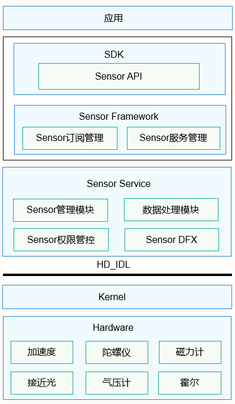

# 传感器开发概述

OpenHarmony系统传感器是应用访问底层硬件传感器的一种设备抽象概念。开发者根据传感器提供的Sensor API，可以查询设备上的传感器，订阅传感器数据，并根据传感器数据定制相应的算法开发各类应用，比如指南针、运动健康、游戏等。

根据传感器的用途，可以将传感器分为六大类：运动类传感器、环境类传感器、方向类传感器、光线类传感器、健康类传感器、其他传感器（如霍尔传感器），每一大类传感器都包含不同类型的传感器，某些类型的传感器可能是单一的物理传感器，也可能是由多个物理传感器复合而成。下面为传感器列表：

  **表1** 运动类-ohos.sensor.agent.CategoryMotionAgent

| 传感器类型                                  | 中文描述      | 说明                                       | 主要用途            |
| -------------------------------------- | --------- | ---------------------------------------- | --------------- |
| SENSOR_TYPE_ACCELEROMETER              | 加速度传感器    | 测量三个物理轴（x、y&nbsp;和&nbsp;z）上，施加在设备上的加速度（包括重力加速度），单位&nbsp;:&nbsp;m/s2 | 检测运动状态          |
| SENSOR_TYPE_ACCELEROMETER_UNCALIBRATED | 未校准加速度传感器 | 测量三个物理轴（x、y&nbsp;和&nbsp;z）上，施加在设备上的未校准的加速度（包括重力加速度），单位&nbsp;:&nbsp;m/s2 | 检测加速度偏差估值       |
| SENSOR_TYPE_LINEAR_ACCELERATION        | 线性加速度传感器  | 测量三个物理轴（x、y&nbsp;和&nbsp;z）上，施加在设备上的线性加速度（不包括重力加速度），单位&nbsp;:&nbsp;m/s2 | 检测每个单轴方向上的线性加速度 |
| SENSOR_TYPE_GRAVITY                    | 重力传感器     | 测量三个物理轴（x、y&nbsp;和&nbsp;z）上，施加在设备上的重力加速度，单位&nbsp;:&nbsp;m/s2 | 测量重力大小          |
| SENSOR_TYPE_GYROSCOPE                  | 陀螺仪传感器    | 测量三个物理轴（x、y&nbsp;和&nbsp;z）上，设备的旋转角速度，单位&nbsp;:&nbsp;rad/s | 测量旋转的角速度        |
| SENSOR_TYPE_GYROSCOPE_UNCALIBRATED     | 未校准陀螺仪传感器 | 测量三个物理轴（x、y&nbsp;和&nbsp;z）上，设备的未校准旋转角速度，单位&nbsp;:&nbsp;rad/s | 测量旋转的角速度及偏差估值   |
| SENSOR_TYPE_SIGNIFICANT_MOTION         | 大幅度动作传感器  | 测量三个物理轴（x、y&nbsp;和&nbsp;z）上，设备是否存在大幅度运动；如果取值为1则代表存在大幅度运动，取值为0则代表没有大幅度运动 | 用于检测设备是否存在大幅度运动 |
| SENSOR_TYPE_DROP_DETECTION             | 跌落检测传感器   | 检测设备的跌落状态；如果取值为1则代表发生跌落，取值为0则代表没有发生跌落    | 用于检测设备是否发生了跌落   |
| SENSOR_TYPE_PEDOMETER_DETECTION        | 计步器检测传感器  | 检测用户的计步动作；如果取值为1则代表用户产生了计步行走的动作；取值为0则代表用户没有发生运动 | 用于检测用户是否有计步的动作  |
| SENSOR_TYPE_PEDOMETER                  | 计步器传感器    | 统计用户的行走步数                                | 用于提供用户行走的步数数据   |

  **表2** 环境类-ohos.sensor.agent.CategoryOrientationAgent

| 传感器类型                                   | 中文描述     | 说明                                       | 主要用途            |
| --------------------------------------- | -------- | ---------------------------------------- | --------------- |
| SENSOR_TYPE_AMBIENT_TEMPERATURE         | 环境温度传感器  | 测量环境温度，单位&nbsp;:&nbsp;摄氏度&nbsp;(°C)      | 测量环境温度          |
| SENSOR_TYPE_MAGNETIC_FIELD              | 磁场传感器    | 测量三个物理轴向（x、y、z）上，环境地磁场，单位&nbsp;:&nbsp;μT | 创建指南针           |
| SENSOR_TYPE_MAGNETIC_FIELD_UNCALIBRATED | 未校准磁场传感器 | 测量三个物理轴向（x、y、z）上，未校准环境地磁场，单位&nbsp;:&nbsp;μT | 测量地磁偏差估值        |
| SENSOR_TYPE_HUMIDITY                    | 湿度传感器    | 测量环境的相对湿度，以百分比&nbsp;(%)&nbsp;表示          | 监测露点、绝对湿度和相对湿度  |
| SENSOR_TYPE_BAROMETER                   | 气压计传感器   | 测量环境气压，单位&nbsp;:&nbsp;hPa&nbsp;或&nbsp;mbar | 测量环境气压          |
| SENSOR_TYPE_SAR                         | 比吸收率传感器  | 测量比吸收率，单位：W/kg                           | 测量设备的电磁波能量吸收比值。 |

  **表3** 方向类-ohos.sensor.agent.CategoryOrientationAgent

| 传感器类型                                    | 中文描述                    | 说明                                       | 主要用途                              |
| ---------------------------------------- | ----------------------- | ---------------------------------------- | --------------------------------- |
| SENSOR_TYPE_6DOF                         | 自由度传感器                  | 测量上下、前后、左右方向上的位移，单位：m或mm；测量俯仰、偏摆、翻滚的角度，单位：rad | 检测设备的三个平移自由度以及旋转自由度，用于目标定位追踪，如：VR |
| SENSOR_TYPE_SCREEN_ROTATION              | 屏幕旋转传感器                 | 检测设备屏幕的旋转状态                              | 用于检测设备屏幕是否发生了旋转                   |
| SENSOR_TYPE_DEVICE_ORIENTATION           | 设备方向传感器                 | 测量设备的旋转方向，单位：rad                         | 用于检测设备旋转方向的角度值                    |
| SENSOR_TYPE_ORIENTATION                  | 方向传感器                   | 测量设备围绕所有三个物理轴（x、y、z）旋转的角度值，单位：rad        | 用于提供屏幕旋转的3个角度值                    |
| SENSOR_TYPE_ROTATION_VECTOR              | 旋转矢量传感器                 | 测量设备旋转矢量，复合传感器：由加速度传感器、磁场传感器、陀螺仪传感器合成    | 检测设备相对于东北天坐标系的方向                  |
| SENSOR_TYPE_GAME_ROTATION_VECTOR SENSOR_TYPE_GEOMAGNETIC_ROTATION_VECTOR | 游戏旋转矢量传感器 地磁旋转矢量传感器 | 测量设备游戏旋转矢量，复合传感器：由加速度传感器、陀螺仪传感器合成 测量设备地磁旋转矢量，复合传感器：由加速度传感器、磁场传感器合成 | 应用于游戏场景 用于测量地磁旋转矢量            |

  **表4** 光线类-ohos.sensor.agent.CategoryLightAgent

| 传感器类型                         | 中文描述     | 说明                     | 主要用途                 |
| ----------------------------- | -------- | ---------------------- | -------------------- |
| SENSOR_TYPE_PROXIMITY         | 接近光传感器   | 测量可见物体相对于设备显示屏的接近或远离状态 | 通话中设备相对人的位置          |
| SENSOR_TYPE_TOF               | ToF传感器   | 测量光在介质中行进一段距离所需的时间     | 人脸识别                 |
| SENSOR_TYPE_AMBIENT_LIGHT     | 环境光传感器   | 测量设备周围光线强度，单位：lux      | 自动调节屏幕亮度，检测屏幕上方是否有遮挡 |
| SENSOR_TYPE_COLOR_TEMPERATURE | 色温传感器    | 测量环境中的色温               | 应用于设备的影像处理           |
| SENSOR_TYPE_COLOR_RGB         | RGB颜色传感器 | 测量环境中的RGB颜色值           | 通过三原色的反射比率实现颜色检测     |
| SENSOR_TYPE_COLOR_XYZ         | XYZ颜色传感器 | 测量环境中的XYZ颜色值           | 用于辨识真色色点，还原色彩更真实     |

  **表5** 健康类-ohos.sensor.agent.CategoryBodyAgent

| 传感器类型                      | 中文描述    | 说明        | 主要用途           |
| -------------------------- | ------- | --------- | -------------- |
| SENSOR_TYPE_HEART_RATE     | 心率传感器   | 测量用户的心率数值 | 用于提供用户的心率健康数据  |
| SENSOR_TYPE_WEAR_DETECTION | 佩戴检测传感器 | 检测用户是否佩戴  | 用于检测用户是否佩戴智能穿戴 |

  **表6** 其他

| 传感器类型                         | 中文描述    | 说明             | 主要用途             |
| ----------------------------- | ------- | -------------- | ---------------- |
| SENSOR_TYPE_HALL              | 霍尔传感器   | 测量设备周围是否存在磁力吸引 | 设备的皮套模式          |
| SENSOR_TYPE_GRIP_DETECTOR     | 手握检测传感器 | 检测设备是否有抓力施加    | 用于检查设备侧边是否被手握住   |
| SENSOR_TYPE_MAGNET_BRACKET    | 磁铁支架传感器 | 检测设备是否被磁吸      | 检测设备是否位于车内或者室内   |
| SENSOR_TYPE_PRESSURE_DETECTOR | 按压检测传感器 | 检测设备是否有压力施加    | 用于检测设备的正上方是否存在按压 |

## 运作机制

OpenHarmony传感器包含如下四个模块：Sensor API、Sensor Framework、Sensor Service和HD_IDL层。

  **图1** OpenHarmony传感器

  

- Sensor API：提供传感器的基础API，主要包含查询传感器列表，订阅/取消传感器的数据、执行控制命令等，简化应用开发。

- Sensor Framework：主要实现传感器的订阅管理，数据通道的创建、销毁、订阅与取消订阅，实现与SensorService的通信。

- Sensor Service：主要实现HD_IDL层数据接收、解析、分发，前后台的策略管控，对该设备Sensor的管理，Sensor权限管控等。

- HD_IDL层：对不同的FIFO、频率进行策略选择，以及适配不同设备。

## 约束与限制

1. 针对下面所列传感器，开发者需要请求响应的权限，才能获取到相应传感器的数据。

    表7 传感器数据权限

   | 传感器                       | 权限名                              | 敏感级别         | 权限描述                    |
   | ------------------------- | -------------------------------- | ------------ | ----------------------- |
   | 加速度传感器，加速度未校准传感器，线性加速度传感器 | ohos.permission.ACCELEROMETER    | system_grant | 允许订阅Motion组对应的加速度传感器的数据 |
   | 陀螺仪传感器，陀螺仪未校准传感器          | ohos.permission.GYROSCOPE        | system_grant | 允许订阅Motion组对应的陀螺仪传感器的数据 |
   | 计步器                       | ohos.permission.ACTIVITY_MOTION  | user_grant   | 允许订阅运动状态                |
   | 心率计                       | ohos.permission.READ_HEALTH_DATA | user_grant   | 允许读取健康数据                |

2. 传感器数据订阅和取消订阅接口成对调用，当不再需要订阅传感器数据时，开发者需要调用取消订阅接口停止数据上报。
