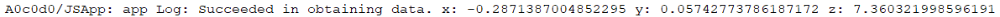

# 传感器开发指导(ArkTS)
<!--Kit: Sensor Service Kit-->
<!--Subsystem: Sensors-->
<!--Owner: @dilligencer-->
<!--Designer: @butterls-->
<!--Tester: @murphy84-->
<!--Adviser: @hu-zhiqiong-->

## 场景介绍

当设备需要获取传感器数据时，可以使用sensor模块，例如：通过订阅方向传感器数据感知用户设备当前的朝向，通过订阅计步传感器数据统计用户的步数等。

详细的接口介绍请参考[Sensor接口](../../reference/apis-sensor-service-kit/js-apis-sensor.md)。


## 接口说明

| 名称 | 描述                              |
| -------- |---------------------------------|
| sensor.on(sensorId, callback:AsyncCallback&lt;Response&gt;, options?: Options): void | 持续监听传感器数据变化。                    |
| sensor.on(type: 'sensorStatusChange', callback: Callback&lt;SensorStatusEvent&gt;): void | 监听传感器动态上下线的状态变化，callback返回传感器状态事件数据。 |
| sensor.once(sensorId, callback:AsyncCallback&lt;Response&gt;): void | 获取一次传感器数据变化。                    |
| sensor.off(sensorId, callback?:AsyncCallback&lt;void&gt;): void | 注销传感器数据的监听。                     |
| sensor.off(sensorId, sensorInfoParam?: SensorInfoParam, callback?:AsyncCallback&lt;void&gt;): void | 注销传感器数据的监听，可传入设置参数。             |
| sensor.off(type: 'sensorStatusChange', callback?: Callback&lt;SensorStatusEvent&gt;): void | 注销传感器动态上下线的状态变化的监听。             |
| sensor.getSensorList(callback: AsyncCallback\<Array\<Sensor>>): void| 获取设备上的所有传感器信息。                  |


## 开发步骤

开发步骤以加速度传感器ACCELEROMETER为例。

1. 导入模块。

   ```ts
   import { sensor } from '@kit.SensorServiceKit';
   import { BusinessError } from '@kit.BasicServicesKit';
   ```

2. 查询设备支持的所有传感器的参数。

    ```ts    
    sensor.getSensorList((error: BusinessError, data: Array<sensor.Sensor>) => {
        if (error) {
            console.error('getSensorList failed');
        } else {
            console.info('getSensorList success');
            for (let i = 0; i < data.length; i++) {
                console.info(JSON.stringify(data[i]));
            }
        }
    });
    ```

    

    该传感器支持的最小采样周期为5000000纳秒，最大采样周期是200000000纳秒。不同传感器支持的采样周期范围也不同，interval应该设置在传感器支持范围内，大于最大值时以最大值上报数据，小于最小值时以最小值上报数据。设置数值越小数据上报越频繁，其功耗越大。

    根据设备Id查询传感器。
    ```ts
    try {
      const deviceId = 1;
      // 第一个参数deviceId 非必填，缺省默认查询的为本地设备。
      const sensorList: sensor.Sensor[] = sensor.getSensorListByDeviceSync(deviceId);
      console.log(`sensorList length: ${sensorList.length}`);
      console.log(`sensorList: ${JSON.stringify(sensorList)}`);
    } catch (error) {
      let e: BusinessError = error as BusinessError;
      console.error(`Failed to get sensorList. Code: ${e.code}, message: ${e.message}`);
    }
    ```

3. 检查是否已经配置相应权限，具体配置方式请参考[声明权限](../../security/AccessToken/declare-permissions.md)。

4. 注册监听。可以通过on()和once()两种接口监听传感器的调用结果。

   通过on()接口，实现对传感器的持续监听，传感器上报周期interval设置为100000000纳秒。

   ```ts
   import { sensor } from '@kit.SensorServiceKit';
   import { BusinessError } from '@kit.BasicServicesKit';

   try { 
     sensor.on(sensor.SensorId.ACCELEROMETER, (data: sensor.AccelerometerResponse) => {
          console.info("Succeeded in obtaining data. x: " + data.x + " y: " + data.y + " z: " + data.z);
     }, { interval: 100000000 });
   } catch (error) {
      let e: BusinessError = error as BusinessError;
      console.error(`Failed to get sensorList. Code: ${e.code}, message: ${e.message}`);
   }
   ```

   第三个参数还可以传入SensorInfoParam，传递deviceId、sensorIndex。
   ```ts 
   import { sensor } from '@kit.SensorServiceKit';
   import { BusinessError } from '@kit.BasicServicesKit';
    
   try {
     sensor.on(sensor.SensorId.ACCELEROMETER, (data: sensor.AccelerometerResponse) => {
          console.info("Succeeded in obtaining data. x: " + data.x + " y: " + data.y + " z: " + data.z);
     }, { interval: 100000000, sensorInfoParam: { deviceId: 1, sensorIndex: 3 } });
   } catch (error) {
      let e: BusinessError = error as BusinessError;
      console.error(`Failed to get sensorList. Code: ${e.code}, message: ${e.message}`);
   }
   ```

    

   通过once()接口，实现对传感器的一次监听。

   ```ts
   sensor.once(sensor.SensorId.ACCELEROMETER, (data: sensor.AccelerometerResponse) => {
       console.info("Succeeded in obtaining data. x: " + data.x + " y: " + data.y + " z: " + data.z);
   });
   ```

   

5. 取消持续监听。

    取消持续监听，此场景下未订阅而取消监听为异常行为，需处理异常。
    ```ts
    sensor.off(sensor.SensorId.ACCELEROMETER);
    ```

    根据SensorInfoParam取消监听。
    ```ts
    sensor.off(sensor.SensorId.ACCELEROMETER, { deviceId: 1, sensorIndex: 3 });
    ```

6. 动态传感器状态的监听，在收到设备下线事件通知时，用户应主动调用off关闭该设备上的传感器。 

    注册监听, SensorStatusEvent 会返回事件时间戳、传感器ID、传感器索引、上线或下线、设备id、设备名称等值。
    ```ts
    sensor.on('sensorStatusChange', (data: sensor.SensorStatusEvent) => {
          console.log(`timestamp: ${data.timestamp},
            deviceId: ${data.deviceId} deviceName: ${data.deviceName}
            sensorId: ${data.sensorId} sensorIndex:${data.sensorIndex} isSensorOnline: ${data.isSensorOnline}`)
    });
    ```

    取消监听。
    ```ts
    // 注意：取消监听前，请确保已通过 on('sensorStatusChange', ...) 成功订阅，否则此调用无意义。
    sensor.off('sensorStatusChange');
    ```