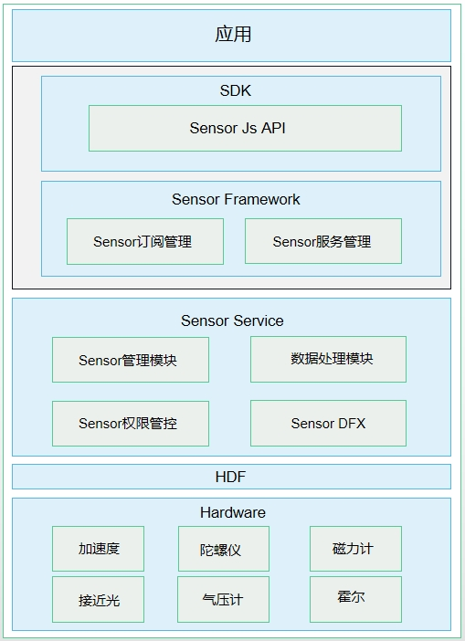

# 传感器开发概述

## 传感器类型

系统传感器是应用访问底层硬件传感器的一种设备抽象概念。开发者根据传感器提供的[Sensor接口](../../reference/apis-sensor-service-kit/js-apis-sensor.md)，可以查询设备上的传感器，订阅传感器数据，并根据传感器数据定制相应的算法开发各类应用，比如指南针、运动健康、游戏等。

| 传感器类型                  | 描述               | 说明                                                         | 主要用途                                   |
| --------------------------- | ------------------ | ------------------------------------------------------------ | ------------------------------------------ |
| ACCELEROMETER               | 加速度传感器       | 测量三个物理轴（x、y&nbsp;和&nbsp;z）上，施加在设备上的加速度（包括重力加速度），单位&nbsp;:&nbsp;m/s² | 检测运动状态。                             |
| ACCELEROMETER_UNCALIBRATED  | 未校准加速度传感器 | 测量三个物理轴（x、y&nbsp;和&nbsp;z）上，施加在设备上的未校准的加速度（包括重力加速度），单位&nbsp;:&nbsp;m/s² | 检测加速度偏差估值。                       |
| LINEAR_ACCELEROMETER        | 线性加速度传感器   | 测量三个物理轴（x、y&nbsp;和&nbsp;z）上，施加在设备上的线性加速度（不包括重力加速度），单位&nbsp;:&nbsp;m/s² | 检测每个单轴方向上的线性加速度。           |
| GRAVITY                     | 重力传感器         | 测量三个物理轴（x、y&nbsp;和&nbsp;z）上，施加在设备上的重力加速度，单位&nbsp;:&nbsp;m/s²。 | 测量重力大小。                             |
| GYROSCOPE                   | 陀螺仪传感器       | 测量三个物理轴（x、y&nbsp;和&nbsp;z）上，设备的旋转角速度，单位&nbsp;:&nbsp;rad/s。 | 测量旋转的角速度。                         |
| GYROSCOPE_UNCALIBRATED      | 未校准陀螺仪传感器 | 测量三个物理轴（x、y&nbsp;和&nbsp;z）上，设备的未校准旋转角速度，单位&nbsp;:&nbsp;rad/s。 | 测量旋转的角速度及偏差估值。               |
| SIGNIFICANT_MOTION          | 大幅度动作传感器   | 测量三个物理轴（x、y&nbsp;和&nbsp;z）上，设备是否存在大幅度运动；如果取值为1则代表存在大幅度运动，取值为0则代表没有大幅度运动。 | 用于检测设备是否存在大幅度运动。           |
| PEDOMETER_DETECTION         | 计步器检测传感器   | 检测用户的计步动作；如果取值为1则代表用户产生了计步行走的动作；取值为0则代表用户没有发生运动。 | 用于检测用户是否有计步的动作。             |
| PEDOMETER                   | 计步器传感器       | 统计用户的行走步数。                                         | 用于提供用户行走的步数数据。               |
| AMBIENT_TEMPERATURE         | 环境温度传感器     | 测量环境温度，单位&nbsp;:&nbsp;摄氏度&nbsp;(°C)。            | 测量环境温度。                             |
| MAGNETIC_FIELD              | 磁场传感器         | 测量三个物理轴向（x、y、z）上，环境地磁场，单位&nbsp;:&nbsp;μT。 | 创建指南针。                               |
| MAGNETIC_FIELD_UNCALIBRATED | 未校准磁场传感器   | 测量三个物理轴向（x、y、z）上，未校准环境地磁场，单位&nbsp;:&nbsp;μT。 | 测量地磁偏差估值。                         |
| HUMIDITY                    | 湿度传感器         | 测量环境的相对湿度，以百分比&nbsp;(%)&nbsp;表示。            | 监测露点、绝对湿度和相对湿度。             |
| BAROMETER                   | 气压计传感器       | 测量环境气压，单位&nbsp;:&nbsp;hPa&nbsp;或&nbsp;mbar。       | 测量环境气压。                             |
| ORIENTATION                 | 方向传感器         | 测量设备围绕所有三个物理轴（z、x、y）旋转的角度值，单位：rad。 | 用于测量屏幕旋转的3个角度值。              |
| ROTATION_VECTOR             | 旋转矢量传感器     | 测量设备旋转矢量，复合传感器：由加速度传感器、磁场传感器、陀螺仪传感器合成。 | 检测设备相对于东北天坐标系的方向。         |
| PROXIMITY                   | 接近光传感器       | 测量可见物体相对于设备显示屏的接近或远离状态。               | 通话中设备相对人的位置。                   |
| AMBIENT_LIGHT               | 环境光传感器       | 测量设备周围光线强度，单位：lux。                            | 自动调节屏幕亮度，检测屏幕上方是否有遮挡。 |
| HEART_RATE                  | 心率传感器         | 测量用户的心率数值。                                         | 用于提供用户的心率健康数据。               |
| WEAR_DETECTION              | 佩戴检测传感器     | 检测用户是否佩戴。                                           | 用于检测用户是否佩戴智能穿戴。             |
| HALL                        | 霍尔传感器         | 测量设备周围是否存在磁力吸引。                               | 设备的皮套模式。                           |

## 运作机制

传感器包含如下四个模块：Sensor API、Sensor Framework、Sensor Service和HDF层。

  **图1** 传感器

- Sensor API：提供传感器的基础API，主要包含查询传感器列表，订阅/取消传感器的数据、执行控制命令等，简化应用开发。

- Sensor Framework：主要实现传感器的订阅管理，数据通道的创建、销毁、订阅与取消订阅，实现与SensorService的通信。

- Sensor Service：主要实现HD_IDL层数据接收、解析、分发，前后台的策略管控，对该设备Sensor的管理，Sensor权限管控等。

- HDF层：对不同的FIFO、频率进行策略选择，以及适配不同设备。

## 约束与限制

1. 针对下面所列传感器，开发者需要请求相应的权限，才能获取到相应传感器的数据。

    | 传感器                                             | 权限名                           | 敏感级别     | 权限描述                                                     |
    | -------------------------------------------------- | -------------------------------- | ------------ | ------------------------------------------------------------ |
    | 加速度传感器，加速度未校准传感器，线性加速度传感器 | ohos.permission.ACCELEROMETER    | system_grant | 允许应用读取加速度传感器的数据，包括：加速度传感器、加速度未校准传感器、线性加速度传感器。 |
    | 陀螺仪传感器，陀螺仪未校准传感器                   | ohos.permission.GYROSCOPE        | system_grant | 允许应用读取陀螺仪传感器的数据，包括：陀螺仪传感器、陀螺仪未校准传感器。 |
    | 计步器                                             | ohos.permission.ACTIVITY_MOTION  | user_grant   | 该权限允许应用读取用户当前的运动状态。例如：判断用户是否处于运动中、记录用户行走步数。 |
    | 心率计                                             | ohos.permission.READ_HEALTH_DATA | user_grant   | 该权限允许应用读取用户的健康数据，如：心率数据等。           |
    
2. 传感器数据订阅和取消订阅接口成对调用，当不再需要订阅传感器数据时，开发者需要调用取消订阅接口停止数据上报。