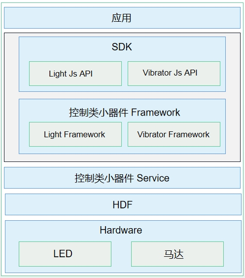

# 振动开发概述
<!--Kit: Sensor Service Kit-->
<!--Subsystem: Sensors-->
<!--Owner: @dilligencer-->
<!--SE: @butterls-->
<!--TSE: @murphy84-->

通过最大化开放马达器件能力，振动器模块服务拓展了马达服务，实现了振动与交互融合设计，从而打造出细腻精致的一体化振动体验和差异化体验，提升用户交互效率、易用性以及用户体验，并增强品牌竞争力。

## 运作机制

Vibrator属于控制类小器件，主要包含以下四个模块：Vibrator API，Vibrator Framework，Vibrator Service和HDF层。

  **图1** 控制类小器件中的Vibrator

- Vibrator API：提供振动器基础的API，主要包含振动器的列表查询，振动器的振动器效果查询，触发/关闭振动器等接口。

- Vibrator Framework：实现振动器的框架层管理，实现与控制类小器件Service的通信。

- 控制类小器件 Service：实现控制器的服务管理。

- HDF层：适配不同设备。

## 约束与限制

在使用振动器时，开发者需要配置请求振动器的权限ohos.permission.VIBRATE，才能控制振动器振动。

