# 分析AppFreeze（应用无响应）

用户在使用应用时会出现点击没反应、应用无响应等情况，其超过一定时间限制后即被定义为应用无响应(appfreeze)。系统提供了检测应用无响应的机制，并生成appfreeze日志供应用开发分析。

> **说明：**
> 本文仅适用于Stage模型下的应用使用。且在根据本文分析日志前，需要开发者对JS在系统中运行情况、C++程序堆栈信息有相关基础知识，并对应用相关的子系统有一定了解。

## 应用无响应检测能力点

目前应用无响应检测从以下维度检测，应用开发者了解其原理对定位和分析appfreeze故障非常有帮助。

| 故障类型 | 说明 |
| -------- | -------- |
| THREAD_BLOCK_6S | 应用主线程卡死超时 |
| APP_INPUT_BLOCK | 用户输入响应超时 |
| LIFECYCLE_TIMEOUT | Ability生命周期切换超时 |

### THREAD_BLOCK_6S 应用主线程卡死超时

该故障出现表示当前应用主线程有卡死或者执行任务过多的情况，影响任务执行的流畅度和体验。

该事件的检测原理是：应用的watchdog线程定期向主线程插入判活检测，并在自己线程插入超时上报机制。当判活检测超过3s没有被执行，会上报THREAD_BLOCK_3S警告事件；超过6s依然没有被执行，会上报THREAD_BLOCK_6S主线程卡死事件。两个事件匹配生成THREAD_BLOCK的应用无响应日志。

检测原理如下图：

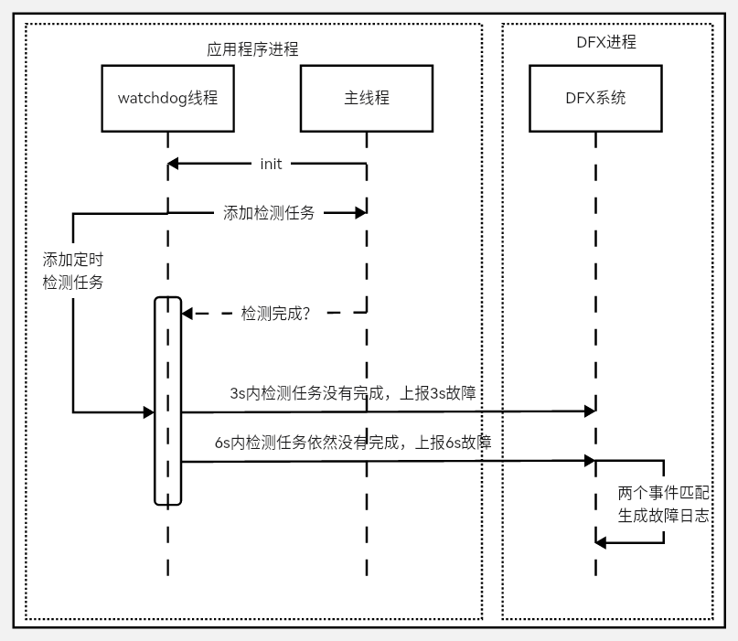

### APP_INPUT_BLOCK 用户输入响应超时

该故障是指用户的点击事件超过一定时间限制未得到响应，严重影响当前用户体验。

该事件的检测原理是：用户点击应用的按钮时，输入系统会向应用侧发送点击事件，但超时未收到应用侧的响应反馈回执，则上报该故障。

检测原理如下图：

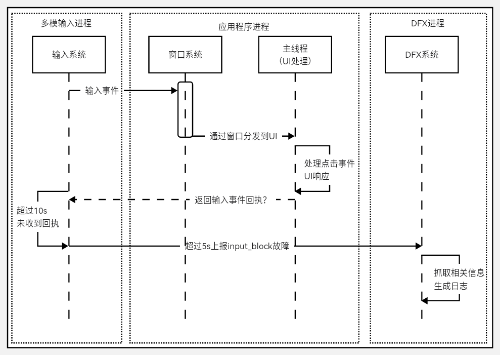

### 生命周期切换超时

生命周期切换超时分为[Ability生命周期](../application-models/uiability-lifecycle.md#uiability组件生命周期)切换超时和[PageAbility生命周期](../application-models/pageability-lifecycle.md#pageability的生命周期)切换超时。

该故障出现在生命周期切换的过程中，影响当前应用内Ability的切换或者不同PageAbility之间的切换。

该事件的检测原理是：通过获取不同生命周期切换的过程，在生命周期切换开始的位置向watchdog线程插入超时任务，在生命周期切换完成之后移除超时任务，固定时间内未成功移除将上报故障。

生命周期切换超时由LIFECYCLE_HALF_TIMEOUT和LIFECYCLE_TIMEOUT两个事件组合而成。LIFECYCLE_HALF_TIMEOUT作为LIFECYCLE_TIMEOUT的警告事件，抓取binder等信息。

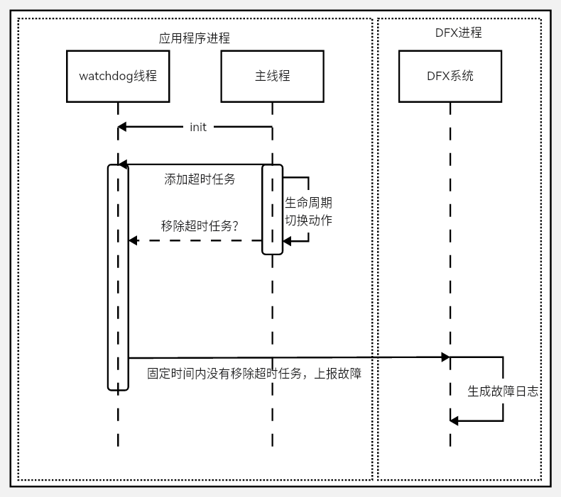

不同的生命周期，超时的时间不一样：

| 生命周期 | 超时时间 |
| -------- | -------- |
| Load | 10s |
| Terminate | 10s |
| Connect | 3s |
| Disconnect | 0.5s |
| Foreground | 5s |
| Background | 3s |

## 应用无响应日志分析

应用无响应(appfreeze)故障需要结合应用无响应日志和流水hilog日志一起分析。

当前示例仅提供一个分析方法，请开发者根据具体问题具体分析。

应用无响应日志主要分以下几个模块信息：

### 日志头部信息

| 字段 | 说明 |
| -------- | -------- |
| Reason | 应用无响应原因，与[应用无响应检测能力点](#应用无响应检测能力点)对应 |
| PID | 发生故障时候的pid，可以用于在流水日志中搜索相关进程信息 |
| PACKAGE_NAME | 应用进程包名 |

```
============================================================
Device info:OpenHarmony 3.2
Build info:OpenHarmony 4.0.5.3
Module name:com.xxx.xxx
Version:1.0.0
Pid:1561
Uid:20010039
Reason:LIFECYCLE_TIMEOUT
sysfreeze: LIFECYCLE_TIMEOUT LIFECYCLE_TIMEOUT at 20230317170653
>>>>>>>>>>>>>>>>>>>>>>>>>>>>>>>>>>>>>>>>>>>
DOMAIN:AAFWK
STRINGID:LIFECYCLE_TIMEOUT
TIMESTAMP:2023/XX/XX/XX-XX:XX:XX:XX
PID:1561
UID:20010039
PACKAGE_NAME:com.xxx.xxx
PROCESS_NAME:com.xxx.xxx
MSG:ablity:EntryAbility background timeout
```

### 日志主干通用信息

以上三种日志都包含以下几部分信息，可以通过搜索“主要信息字段”在日志中找到对应的位置：

| 主要信息字段 | 说明 |
| -------- | -------- |
| EVENTNAME | 应用无响应原因，或者组成卡死检测的不同事件 |
| TIMESTAMP | 发生故障时上报时刻的事件，可以根据[应用无响应检测能力点](#应用无响应检测能力点)中说明的超时时间，在相应流水日志中缩小查看日志的时间范围 |
| PID | 发生故障时候的pid，可以与发生时间和超时时间配合用于在流水日志中搜索相关进程信息 |
| PACKAGE_NAME | 应用进程包名 |
| MSG | 发生故障时dump信息或者说明信息，后面具体说明 |
| BinderCatcher | 进程与其他系统进程间通信的调用信息，显示调用等待时间长的情况 |
| PeerBinder Stacktrace | 跟当前进程相关的对端进程有卡死，会抓取对端的进程堆栈 |
| cpuusage | 跟当前时间段整机CPU使用情况 |
| memory | 跟当前时间当前进程的内存使用情况 |

> **说明：**
>
> 在整机高负载的情况下，采用低开销方式获取调用栈的情况，可能损失函数名称和build-id信息。

MSG字段信息主要包括卡死上报的原因，以及当前应用主线程的队列中任务堆积信息。

主线程队列中任务堆积信息包括：

- 当前正在运行的任务以及任务启动的时间：如果跟当前日志上报的时间相差很大，则当前运行的任务就是卡死的主要任务事件。

- 历史任务时间：可判断是否由于历史任务过多且每一个任务执行都占一定时间，导致当前的新任务运行时无法及时响应。

- 堆积中还没有执行的任务。

**当前进程堆栈示例：**

通过搜索pid对应的数字找到应用栈信息。以下堆栈示例表明窗口通过IPC向系统发送事件时，停留在IPC通信阶段。

```
OpenStacktraceCatcher -pid==1561 packageName is com.ohos.huawei.myapplication
Result: 0 ( no error )
Timestamp:2017-08-0817:06:53.000
Pid:1561
Uid:20010039
Process name:com.ohos.huawei.myapplication
Tid:1561,Name:i.myapplication
#00 pc 0017888c /system/lib/libark_jsruntime.so
#01 pc 00025779 /system/lib/platformsdk/libipc_core.z.so(OHOS:BinderConnector:WriteBinder(unsigned Long,void*)+56)
#02 pc 000265a5 /system/lib/platformsdk/libipc_core.z.so(OHOS:BinderInvoker:TransactWithDriver(bool)+216)
#03 pc 0002666f /system/lib/platformsdk/libipc_core.z.so(OHOS:BinderInvoker:StartWorkLoop()+18)
#04 pc 000270a9 /system/lib/platformsdk/libipc_core.z.so(OHOS:BinderInvoker:JoinThread(bool)+32)
#05 pc 00023783 /system/lib/platformsdk/libipc_core.z.so(OHOS:IPCWorkThread:ThreadHandler(void*)+290)
#06 pc 00e1c6f7 /system/lib/libace.z.so
#07 pc 0091bbdd /system/lib/libace.z.so
#08 pc 0092fd9d /system/lib/libace.z.so
#09 pc 0092fa5f /system/lib/libace.z.so
#10 pc 0092cd6b /system/lib/libace.z.so
#11 pc 009326a9 /system/lib/libace.z.so
#12 pc 0093054b /system/lib/libace.z.so
#13 pc 009324f3 /system/lib/libace.z.so
#14 pc 003989e1 /system/lib/libace.z.so
#15 pc 0045dd4b /system/lib/libace.z.so
#16 pc 00d24fef /system/lib/libace.z.so
#17 pc 0041e6e9 /system/lib/libace.z.so
#18 pc 0000b4d9 /system/lib/platformsdk/libeventhandler.z.so(OHOS:AppExecFwk:EventHandler:DistributeEvent(std::__h:unique_ptr<0 #19 pc 00012829 /system/lib/platformsdk/libeventhandler.z.so
#20 pc 00011841 /system/lib/platformsdk/libeventhandler.z.so(OHOS:AppExecFwk:EventRunner:Run()+64)
#21 pc 00054a8b /system/lib/libappkit_native.z.so(OHOS:AppExecFwk:MainThread:Start()+278)
#22 pc 00011503 /system/bin/appspawn
#23 pc 0001141f /system/bin/appspawn
#24 pc 0000ee97 /system/bin/appspawn
```

**BinderCatcher信息示例：**

通过搜索pid对应的数字找到当前进程与哪个进程在通信，同步的通信等待的时长。

示例表明当前1561进程向685进程请求通信，等待超过10s没有得到响应。

```
PeerBinderCatcher -pid==1561 Layer_==0


BinderCatcher --
    1561::1561t0685:0c0de0Wait:10.366245919s 1329::1376t0487:794c0de0Wait:0.12070041s

pid   context  request  started  max  ready free_async_space
1561   binder    0       3       16     4       520192
544    binder    0       4       16     5       520192
1104   binder    0       1       16     2       520192
1397   binder    0       1       16     3       520192
...
```

**PeerBinder Stacktrace信息示例：**

示例表明对端卡死进程685的堆栈信息。

```
PeerBinder Stacktrace --

PeerBinderCatcher start catcher stacktrace for pid 685
Result: 0 ( no error )
Timestamp:2017-08-0817:06:55.000
Pid:685
Uid:1000
Process name:wifi_manager_service
Tid:658,Name:wifi_manager_service
#00 pc 000669f0 /system/lib/ld-musl-arm.so.1
#01 pc 000c60cc /system/lib/ld-musl-arm.so.1
#02 pc 000c5040 /system/lib/ld-musl-arm.so.1
#03 pc 000c6818 /system/lib/ld-musl-arm.so.1(__pthread_cond_timedwait_time64+596)
#04 pc 000bd058 /system/lib/libc++.so
#05 pc 0008592c /system/lib/ld-musl-arm.so.1(ioctl+72)
#06 pc 00025779 /system/lib/platformsdk/libipc_core.z.so(OHOS:BinderConnector:WriteBinder(unsigned long,void*)+56)
#07 pc 000265a5 /system/lib/platformsdk/libipc_core.z.so(OHOS:BinderInvoker:TransactWithDriver(bool)+216)
#08 pc 0002666f /system/lib/platformsdk/libipc_core.z.so(OHOS:BinderInvoker:StartWorkLoop()+18)
#09 pc 000270a9 /system/lib/platformsdk/libipc_core.z.so(OHOS:BinderInvoker:JoinThread(bool)+32)
#10 pc 00023783 /system/lib/platformsdk/libipc_core.z.so(OHOS:IPCWorkThread:ThreadHandler(void*)+290)
#11 pc 0007b4d9 /system/lib/platformsdk/libeventhandler.z.so(OHOS:AppExecFwk:EventHandler:DistributeEvent(std::__h:unique_ptr<OHOS:Ap
#12 pc 00072829 /system/lib/platformsdk/libeventhandler.z.so
#13 pc 00071841 /system/lib/platformsdk/libeventhandler.z.so(OHOS:AppExecFwk:EventRunner:Run()+64)
#14 pc 00094a8b /system/lib/libappkit_native.z.so(OHOS:AppExecFwk:MainThread:Start()+278)

Tid:1563,Name:IPC_0_1563
#00 pc 0009392c /system/lib/ld-musl-arm.so.1(ioctl+72)
#01 pc 00025779 /system/lib/platformsdk/libipc_core.z.so(OHOS:BinderConnector:WriteBinder(unsigned long,void*)+56)
```

**cpuusage信息示例：**

整机CPU信息。

```
Load average:2.87 /1.45 /0.58;the cpu load average in 1 min,5 min and 15 min
CPU usage fr0m2023-03-1017:06:53t02023-03-1017:06:53
Total:29%;User Space:28%;Kernel Space:1%;iowait:6%;irq:0%;idle:62%
Details of Processes:
    PID     Total Usage     User Space     Kernel Space     Page Fault Minor     Page Fault Major      Name
    1561       23%            23%              0%               9985                  26            i.myapplication
    527        1%             1%               0%               3046                  9             hidumper_servic
    242        1%             1%               0%               69799                 280           hiview
```

**memory信息示例：**

当前进程内存信息。

```
-------------------------------------------[memory]----------------------------------------
                 Pss      Shared   Shared   Private  Private   Swap   SwapPss   Heap  Heap
                 Total    CLean    Dirty    CLean    Dirty     Total  Total     Size  Alloc
                 (kB)     (kB)     (kB)     (kB)      (kB)     (kB)    (kB)     (kB)  (kB)
-------------------------------------------------------------------------------------------
guard             0        0         0       0         0         0      0        0      0
native heap      185       0        180      0        160        0      0        0      0
AnonPage other   17881    12        12376    88       15948      0      0        0      0
stack            292       0        0        0        292        0      0        0      0
.S0              5053     63408     4172     1812     2640       0      0        0      0
.ttf             1133     3092      0        4        0          0      0        0      0
dev              10       0         108      8        0          0      0        0      0
FilePage other   121      556       8        0        4          0      0        0      0
------------------------------------------------------------------------------------------
Total            34675    67068     16844    1912     19044      0      0        0      0
```

### 日志主干特异性信息(应用主线程卡死超时)

Reason是THREAD_BLOCK_6S的日志。根据前面的[应用主线程卡死超时](#thread_block_6s-应用主线程卡死超时)的原理可知，THREAD_BLOCK由THREAD_BLOCK_3S和THREAD_BLOCK_6S两部分组成。将两部分日志对比分析，可更准确的判断是卡死还是执行任务过多造成无法响应的情况。

THREAD_BLOCK_3S在日志的前部分，THREAD_BLOCK_6S在THREAD_BLOCK_3S后面写入。可以通过EVENTNAME字段搜索两个事件在日志中的位置。

两个事件中都包含MSG字段，该字段在应用主线程卡死超时故障中写入了当前主线程处理队列的信息，可查看在两个时间点中主线程事件处理队列排队情况。

示例日志显示了在Low priority的队列中05:06:18.145的事件一直在处理，THREAD_BLOCK_3S和THREAD_BLOCK_6S的队列都显示其存在。这说明主线程卡死不是任务过多情况。

由于THREAD_BLOCK_6S是主线程卡死，进程堆栈信息只需要关注主线程的堆栈(主线程线程号跟进程号相同)。当前示例日志主线程堆栈显示通过ArkUI控件到JS运行，说明卡死在Js代码中。3S和6S都是这个位置的堆栈，说明JS有卡死，但原因排除任务过多导致。

THREAD_BLOCK_3S：

```
start time:2017/08/08-17:06:24:380
DOMAIN = AAFWK EVENTNAME THREAD_BLOCK_3S
TIMESTAMP = 2017/08/08-17:06:24:363
PID = 1561
UID = 20010039
TID = 1566
PACKAGE_NAME com.ohos.huawei.myapplication
PROCESS_NAME com.ohos.huawei.myapplication
eventLog_action pb:1 eventLog_interval 10
MSG = App main thread is not response!EventHandler dump begin curTime:2017-08-08 05:06:24.362
  Event runner (Thread name =Thread ID 1561)is running
  Current Running:start at 2017-08-08 05:06:18.145,Event send thread 1561,send time =2017-08-08 05:06:18.145,handle time =2017-08-08 05:
  Immediate priority event queue information:
  Total size of Immediate events 0
  High priority event queue information:
  No.1 Event send thread 1561,send time 2017-08-08 05:06:18.039,handle time 2017-08-08 05:06:21.539,task name [anr_handler.cpp(Send Total size of High events 1
  Low priority event queue information:
  No.1:Event{send thread=1566,send time=2017-08-0805:06:21.062,handle time=2017-08-0805:06:21.062,id=1}
  Total size of Low events 1
  Idle priority event queue information:
  Total size of Idle events 0
  Total event size :2

 Timestamp: 2017-08-0817:06:24.4142447784
 Pid: 1561
 Uid: 20010039
 Process name: com.ohos.huawei.myapplication
 Tid:1561 Name:i.myapplication
   at anonymous entry (D:/project/OpenHarmonyOS/MyApplication_test/entry/build/default/intermediates/loader_out/default/ets,pages/Index_.js:0:1)
   #00 pc 0017909c /system/lib/libark_jsruntime.so
   #01 pc 00177ebb /system/lib/libark_jsruntime.so
   #02 pc 0024b4bb /system/lib/libark_jsruntime.so(panda:FunctionRef:Call(panda:ecmascript:EcmaVM const*,panda:Local<panda:JSValueRef>,panda
   #03 pc 00fbed23 /system/lib/libace.z.so
   #04 pc 00d8208f /system/lib/libace.z.so
   ...
```

THREAD_BLOCK_6S：
```
start time: 2017/08/08-17:06:27:299
DOMAIN = AAFWK
EVENTNAME THREAD_BLOCK_6S
TIMESTAMP = 2017/08/08-17:06:27:292
PID = 1561
UID = 20010039
TID = 1566
PACKAGE_NAME com.ohos.huawei.myapplication
PROCESS NAME com.ohos.huawei.myapplication eventLog_action cmd:c,cmd:m,tr,k:SysRqFile
eventLog_interval 10
MSG = App main thread is not response!EventHandler dump begin curTime:2017-08-08 05:06:27.291
  Event runner (Thread name =Thread ID =1561)is running
  Current Running:start at 2017-08-08 05:06:18.144, Event {send thread 1561,send time =2017-08-08 05:06:18.145,handle time =2017-08-08 05:
  Immediate priority event queue information:
  Total size of Immediate events 0
  High priority event queue information:
  No.1 Event send thread 1561,send time 2017-08-08 05:06:18.039,handle time 2017-08-08 05:06:21.539,task name [arr_handler.cpp(Se Total size of High events 1
  Low priority event queue information:
  No.1:Event{send thread=1566,send time=2017-08-0805:06:21.062,handle time=2017-08-0805:06:21.062,id=1}
  No.2 Event send thread 1566,send time 2017-08-08 05:06:24.369,handle time 2017-08-08 05:06:24.369,id =1
  Total size of Low events 2
  Idle priority event queue information:
  Total size of Idle events 0
  Total event size 3

Timestamp:2017-08-0817:0k:27,4142447784
Pid:1561
Uid:20010039
Process name:com.ohos.huawei.myapplication
Tid:1561 Name:i.myapplication
  at anonymous entry (D:/project/OpenHarmony0S/MyApplication_test/entry/build/default/intermediates/loader_out/default/ets/pages/Index_.js:0:1)
  #00 pc 00178dcc /system/lib/libark_jsruntime.so
  #01 pc 00177ebb /system/lib/libark_jsruntime.so
  #02 pc 0024b4bb /system/lib/libark_jsruntime.so(panda:FunctionRef:Call(panda:ecmascript:EcmaVM const*,panda:Local<panda:JSValueRef>,par
  #03 pc 00fbed23 /system/lib/libace.z.so
  #04 pc 00d8208f /system/lib/libace.z.so
  #05 pc 00d7af1b /system/lib/libace.z.so
```

再结合流水日志查看当前应用侧是在执行哪块代码。

一般情况下可以查看以上[通用日志信息](#日志主干通用信息)内容，判断是否存在对端通信卡死，整机CPU消耗很高导致当前应用响应不过来，内存泄漏，内存非常多导致任务无法运行的情况。

### 日志主干特异性信息(用户输入响应超时)

Reason是APP_INPUT_BLOCK，表明用户点击事件超过5s没有得到反馈。

MSG信息是这个事件的说明：用户的输入没有得到响应。

APP_INPUT_BLOCK的日志信息可以参考[通用日志信息](#日志主干通用信息)进行分析。需特别说明的是，一般情况下用户输入无响应大概率主线程也会卡死。可以结合两个日志的三个堆栈、两个BinderCatcher信息，进行对比查看。如果没有主线程卡死的日志，说明有可能在输入事件之前有大量的细碎的其他事件，细碎的事件不足以卡死主线程，但是数量比较多导致用户的输入事件响应不过来。

### 日志主干特异性信息(生命周期切换超时)

Reason是LIFECYCLE_TIMEOUT的日志与上文THREAD_BLOCK_6S和THREAD_BLOCK_3S一样都是有两个事件。分别是LIFECYCLE_HALF_TIMEOUT和LIFECYCLE_TIMEOUT

MSG说明当前是什么生命周期的超时。

示例可以看出，LIFECYCLE_TIMEOUT的可以看出Ability在切换后台的时候超时，可以按照上面[生命周期切换超时](#生命周期切换超时)的超时时间来找流水日志等信息。

LIFECYCLE_TIMEOUT：

```
DOMAIN:AAFWK
STRINGID:LIFECYCLE
TIMEOUT TIMESTAMP:2023/03/10-17:06:53:65
PID:1561
UID:20010039
PACKAGE_NAME:com.ohos.huawei.myapplication
PROCESS_NAME:com.ohos.huawei.myapplication
MSG:ability:EntryAbility background timeout
```

其他的日志信息可以参考[通用日志信息](#日志主干通用信息)进行分析。需要特别说明的是，一般情况下生命周期切换大概率主线程也会卡死。可以结合两个日志的三个堆栈、两个BinderCatcher信息，进行对比查看。

## 应用退出

当应用发生以下故障时，为了保证可恢复，会杀死应用。

| 故障类型 | 说明 |
| -------- | -------- |
| THREAD_BLOCK_6S | 应用主线程卡死超时 |
| APP_INPUT_BLOCK | 用户输入响应超时 |
| LIFECYCLE_TIMEOUT | Ability生命周期切换超时 |

## 定位步骤与思路

定位应用无响应问题，首先需要开发者获取相关日志，再通过日志记录的问题基本信息，结合hilog日志和trace来定位出无响应问题的发生的具体位置。

### 获取日志

应用无响应日志是一种故障日志，与Native进程崩溃、JS应用崩溃、系统进程异常等都由FaultLog模块管理，可通过以下方式获取日志：

- 方式一：通过DevEco Studio获取日志

    DevEco Studio会收集设备的故障日志并归档到FaultLog下。具体可参考<!--RP1-->[DevEco Studio使用指南-FaultLog](https://developer.huawei.com/consumer/cn/doc/harmonyos-guides-V5/ide-fault-log-V5)<!--RP1End-->。

- 方式二：通过hiAppEvent接口订阅

    hiAppEvent 提供了故障订阅接口，可以订阅各类故障打点，详见[HiAppEvent介绍](hiappevent-intro.md)。

<!--Del-->
- 方式三：设备ROOT模式下通过shell获取日志

    应用无响应日志是以appfreeze-开头，生成在”设备/data/log/faultlog/faultlogger/”路径下。该日志文件名格式为“appfreeze-应用包名-应用UID-毫秒级时间.log”。

    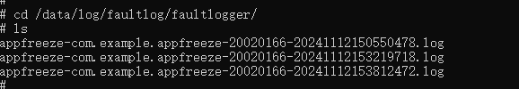
<!--DelEnd-->

### 确认基本信息

#### 获取直接卡死应用的进程号，是否处于前台等基础信息

```
Generated by HiviewDFX@OpenHarmony
============================================================
Device info:HUANEI Mate 60 Pro
Build info:ALN-AL00 x.x.x.xx(XXXXXXX)
Fingerprint: ef8bd28f8b57b54656d743b546efa73764c77866a65934bd96f2678f886813b7
Module name:com.xxx.xxx
Version:1.2.2.202
VersionCode: 1002002202
PreInstalled:Yes
Foreground:No   --> 是否处于前台
Pid:15440
Uid:20020029
Reason:THREAD BLOCK 6S
appfreeze: com.xxx.xxx THREAD_BLOCK 6S at 20240410164052
DisplayPowerInfo:powerState: AWAKE
>>>>>>>>>>>>>>>>>>>>>>>>>>>>>>>>>>>>>>>>>>>
```

#### 获取故障发生时间点

故障上报时间点

```
>>>>>>>>>>>>>>>>>>>>>>>>>>>>>>>>>>>>>>>>
DOMAIN:AAFWK
STRINGID: THREAD BLOCK 6S
TIMESTAMP: 2024/04/10-16:40:52:743   --> 故障上报时间戳
PID:15440
UID:20020029
PACKAGE NAME:com.xxx.xxx
PROCESS NAME:com.xxx.xxx
****************************************
```

不同故障类型的不同场景下的检测时长汇总表格

| THREAD_BLOCK_6S |APP_INPUT_BLOCK|LIFECYCLE_TIMEOUT|
| -------- |--------|--------|
|前台应用：6s <br> 后台应用 ：3s * 5 + 6s = 21s | 5s | Load：10s <br> Active：5s <br> Inactive：0.5s <br> Terminate：10s <br> Connect：3s <br> Disconnect：0.5s <br> Restart：5s <br> Foreground：5s <br> Background：3s |

**说明：**
1、THREAD_BLOCK_3S / LIFECYCLE_HALF_TIMEOUT 的检测时长是相应THREAD_BLOCK_6S / LIFECYCLE_TIMEOUT的一半，warning 级别，不会单独上报日志；THREAD_BLOCK_6S / LIFECYCLE_TIMEOUT 是 error 级别，整合了本身和其一半检测时长故障的日志一同上报。
2、前台应用发生THREAD_BLOCK_3S后即可触发后续THREAD_BLOCK_6S事件
3、后台应用存在计数器 backgroundReportCount_ = 0，发生THREAD_BLOCK_3S后 +1 累计到 5 次后才会上报 （即连续发生5次 THREAD_BLOCK_3S 事件，计数不清零，才会上报THREAD_BLOCK_6S 事件，可知后台应用THREAD_BLOCK_3S 与THREAD_BLOCK_6S 检测时长依次为 18s 与 21s</samll>

通过故障上报时间点往前推检测时长可得到故障发生的具体时间。

### 查看 eventHandler 信息

开发者可以通过 “mainHandler dump is” 关键字搜索日志中的 eventHandler dump 信息

1、dump begin curTime & Current Running

```
mainHandler dump is:
 EventHandler dump begin curTime: 2024-08-08 12:17:43.544      --> 开始 dump 时间
 Event runner (Thread name = , Thread ID = 35854) is running   --> 正在运行的线程信息
 Current Running: start at 2024-08-08 12:17:16.629, Event { send thread = 35882, send time = 2024-08-08 12:17:16.628,  handle time = 2024-08-08 12:17:16.629, trigger time = 2024-08-08 12:17:16.630, task name = , caller = xx }  
 --> trigger time--> 任务开始运行的时间
```

当前任务运行时长 = dump begin curTime - trigger time, 如示例中当前任务运行达到27s。
若任务运行时长 > 故障检测时长，表示当前正在运行的任务是导致应用卡死的任务，需对该任务进行排查。
若任务运行时长较小，表示当前任务仅是检测时间区间内主线程运行的任务之一，主要耗时不一定是该任务，建议优先查看近期耗时最长任务（History event queue information中）。该情形多为线程繁忙导致的watchdog无法调度执行。

2、 History event queue information

```
 Current Running: start at 2024-08-08 12:17:16.629, Event { send thread = 35882, send time = 2024-08-08 12:17:16.628, handle time = 2024-08-08 12:17:16.629, trigger time = 2024-08-08 12:17:16.630, task name = , caller = [extension_ability_thread.cpp(ScheduleAbilityTransaction:393)]}
 History event queue information:
 No. 0 : Event { send thread = 35854, send time = 2024-08-08 12:17:15.525, handle time = 2024-08-08 12:17:15.525, trigger time = 2024-08-08 12:17:15.527, completeTime time = 2024-08-08 12:17:15.528, priority = High, id = 1 }
 No. 1 : Event { send thread = 35854, send time = 2024-08-08 12:17:15.525, handle time = 2024-08-08 12:17:15.525, trigger time = 2024-08-08 12:17:15.527, completeTime time = 2024-08-08 12:17:15.527, priority = Low, task name = MainThread:SetRunnerStarted }
 No. 2 : Event { send thread = 35856, send time = 2024-08-08 12:17:15.765, handle time = 2024-08-08 12:17:15.765, trigger time = 2024-08-08 12:17:15.766, completeTime time = 2024-08-08 12:17:15.800, priority = Low, task name = MainThread:LaunchApplication }
 No. 3 : Event { send thread = 35856, send time = 2024-08-08 12:17:15.767, handle time = 2024-08-08 12:17:15.767, trigger time = 2024-08-08 12:17:15.800, completeTime time = 2024-08-08 12:17:16.629, priority = Low, task name = MainThread:LaunchAbility }
 No. 4 : Event { send thread = 35854, send time = 2024-08-08 12:17:15.794, handle time = 2024-08-08 12:17:15.794, trigger time = 2024-08-08 12:17:16.629, completeTime time = 2024-08-08 12:17:16.629, priority = IDEL, task name = IdleTime:PostTask }
 No. 5 : Event { send thread = 35852, send time = 2024-08-08 12:17:16.629, handle time = 2024-08-08 12:17:16.629, trigger time = 2024-08-08 12:17:16.629, completeTime time = , priority = Low, task name =  }
```

可以从历史任务队列中寻找故障发生时间区间内较为耗时的任务。其中CompleteTime time 为空的任务是当前任务。
任务运行耗时 = CompleteTime time - trigger time。
筛选出耗时较高的任务，排查其运行情况。

3、VIP priority event queue information

```
 VIP priority event queue information:
 No. 1 : Event { send thread = 3205, send time = 2024-08-07 04:11:15.407, handle time = 2024-08-07 04:11:15.407, task name = ArkUIWindowInjectPointerEvent, caller = [task_runner_adapter_impl.cpp(PostTask:33)]}
 No. 2 : Event { send thread = 3205, send time = 2024-08-07 04:11:15.407, handle time = 2024-08-07 04:11:15.407, task name = ArkUIWindowInjectPointerEvent, caller = [task_runner_adapter_impl.cpp(PostTask:33)]}
 No. 3 : Event { send thread = 3205, send time = 2024-08-07 04:11:15.407, handle time = 2024-08-07 04:11:15.407, task name = ArkUIWindowInjectPointerEvent, caller = [task_runner_adapter_impl.cpp(PostTask:33)]}
 No. 4 : Event { send thread = 3961, send time = 2024-08-07 04:11:15.408, handle time = 2024-08-07 04:11:15.408, task name = MMI::OnPointerEvent, caller = [input_manager_impl.cpp (OnPointerEvent:493)]}
 No. 5 : Event { send thread = 3205, send time = 2024-08-07 04:11:15.408, handle time = 2024-08-07 04:11:15.408, task name = ArkUIWindowInjectPointerEvent, caller = [task_runner_adapter_impl.cpp(PostTask:33)]}
 No. 6 : Event { send thread = 3205, send time = 2024-08-07 04:11:15.409, handle time = 2024-08-07 04:11:15.409, task name = ArkUIWindowInjectPointerEvent, caller = [task_runner_adapter_impl.cpp(PostTask:33)]}
 No. 7 : Event { send thread = 3205, send time = 2024-08-07 04:11:15.409, handle time = 2024-08-07 04:11:15.409, task name = ArkUIWindowInjectPointerEvent, caller = [task_runner_adapter_impl.cpp(PostTask:33)]}
 No. 8 : Event { send thread = 3205, send time = 2024-08-07 04:11:15.409, handle time = 2024-08-07 04:11:15.409, task name = ArkUIWindowInjectPointerEvent, caller = [task_runner_adapter_impl.cpp(PostTask:33)]}
 No. 9 : Event { send thread = 3205, send time = 2024-08-07 04:11:15.410, handle time = 2024-08-07 04:11:15.410, task name = ArkUIWindowInjectPointerEvent, caller = [task_runner_adapter_impl.cpp(PostTask:33)]}
 ...
```

为保障第一时间响应用户，用户输入事件传递链中的任务都属于高优先级任务。此任务事件队列均由系统创建，通常记录用户输入->屏幕->窗口->ArkUI->应用的传输过程，与三方应用事件无关，开发者无需额外关注。

4、High priority event queue information

```
 High priority event queue information:
 No. 1 : Event { send thread = 35862, send time = 2024-08-08 12:17:25.526, handle time = 2024-08-08 12:17:25.526, id = 1, caller = [watchdog.cpp(Timer:156)]}
 No. 2 : Event { send thread = 35862, send time = 2024-08-08 12:17:28.526, handle time = 2024-08-08 12:17:28.526, id = 1, caller = [watchdog.cpp(Timer:156)]}
 No. 3 : Event { send thread = 35862, send time = 2024-08-08 12:17:31.526, handle time = 2024-08-08 12:17:31.526, id = 1, caller = [watchdog.cpp(Timer:156)]}
 No. 4 : Event { send thread = 35862, send time = 2024-08-08 12:17:34.530, handle time = 2024-08-08 12:17:34.530, id = 1, caller = [watchdog.cpp(Timer:156)]}
 No. 5 : Event { send thread = 35862, send time = 2024-08-08 12:17:37.526, handle time = 2024-08-08 12:17:37.526, id = 1, caller = [watchdog.cpp(Timer:156)]}
 No. 6 : Event { send thread = 35862, send time = 2024-08-08 12:17:40.526, handle time = 2024-08-08 12:17:40.526, id = 1, caller = [watchdog.cpp(Timer:156)]}
 No. 7 : Event { send thread = 35862, send time = 2024-08-08 12:17:43.544, handle time = 2024-08-08 12:17:43.544 ,id = 1, caller = [watchdog.cpp(Timer:156)]}
 Total size of High events : 7
```

watchdog 任务位于此优先级队列中，观察 watchdog 任务队列发现其是每隔 3s 发送一次。

对比 warning/block 事件，观察 watchdog 任务在队列中的移动情况。
warning:
```
 High priority event queue information:
 No. 1 : Event { send thread = 35862, send time = 2024-08-08 12:17:25.526, handle time = 2024-08-08 12:17:25.526, id = 1, caller = [watchdog.cpp(Timer:156)]}
 No. 2 : Event { send thread = 35862, send time = 2024-08-08 12:17:28.526, handle time = 2024-08-08 12:17:28.526, id = 1, caller = [watchdog.cpp(Timer:156)]}
 No. 3 : Event { send thread = 35862, send time = 2024-08-08 12:17:31.526, handle time = 2024-08-08 12:17:31.526, id = 1, caller = [watchdog.cpp(Timer:156)]}
 No. 4 : Event { send thread = 35862, send time = 2024-08-08 12:17:34.530, handle time = 2024-08-08 12:17:34.530, id = 1, caller = [watchdog.cpp(Timer:156)]}
 Total size of High events : 4
```

block:
```
 High priority event queue information:
 No. 1 : Event { send thread = 35862, send time = 2024-08-08 12:17:25.526, handle time = 2024-08-08 12:17:25.526, id = 1, caller = [watchdog.cpp(Timer:156)]}
 No. 2 : Event { send thread = 35862, send time = 2024-08-08 12:17:28.526, handle time = 2024-08-08 12:17:28.526, id = 1, caller = [watchdog.cpp(Timer:156)]}
 No. 3 : Event { send thread = 35862, send time = 2024-08-08 12:17:31.526, handle time = 2024-08-08 12:17:31.526, id = 1, caller = [watchdog.cpp(Timer:156)]}
 No. 4 : Event { send thread = 35862, send time = 2024-08-08 12:17:34.530, handle time = 2024-08-08 12:17:34.530, id = 1, caller = [watchdog.cpp(Timer:156)]}
 No. 5 : Event { send thread = 35862, send time = 2024-08-08 12:17:37.526, handle time = 2024-08-08 12:17:37.526, id = 1, caller = [watchdog.cpp(Timer:156)]}
  Total size of High events : 5
```

以上示例中可发现 block 队列相比于 warning 队列更长了，而对应的第一个任务没有发生变化，可能存在两种情况：
- 当前正在运行的任务卡死阻塞，导致其他任务一直未被调度执行。
- 更高优先级队列中任务堆积，导致位于较低优先级队列中的 watchdog 任务未被调度执行。

### 查看 stack 信息

通过得到的 Pid、Tid 查看对应的 stack，存在以下几种情况：

1、有明确卡死堆栈信息

```
Tid:3025, Name: xxx
# 00 pc 00000000001b4094 /system/lib/ld-musl-aarch64.so.1(__timedwait_cp+188)(b168f10a179cf6050a309242262e6a17)
# 01 pc 00000000001b9fc8 /system/lib/ld-musl-aarch64.so.1(__pthread_mutex_timedlock_inner+592)(b168f10a179cf6050a309242262e6a17)
# 02 pc 00000000000c3e40 /system/lib64/libc++.so(std::__h::mutex::lock()+8)(9cbc937082b3d7412696099dd58f4f78242f9512) --> 等锁卡死
# 03 pc 000000000007ac4c /system/lib64/platformsdk/libnative_rdb.z.so(OHOS::NativeRdb::SqliteConnectionPool::Container::Release(std::__h::shared_ptr<OHOS::NativeRdb::SqliteConnectionPool::ConnNode>)+60)(5e8443def4695e8c791e5f847035ad9f)
# 04 pc 000000000007aaf4 /system/lib64/platformsdk/libnative_rdb.z.so(OHOS::NativeRdb::SqliteConnectionPool::ReleaseNode(std::__h::shared_ptr<OHOS::NativeRdb::SqliteConnectionPool::ConnNode>)+276)(5e8443def4695e8c791e5f847035ad9f)
# 05 pc 000000000007a8c0 /system/lib64/platformsdk/libnative_rdb.z.so(5e8443def4695e8c791e5f847035ad9f)
# 06 pc 00000000000b36ec /system/lib64/platformsdk/libnative_rdb.z.so(OHOS::NativeRdb::SqliteSharedResultSet::Close()+324)(5e8443def4695e8c791e5f847035ad9f)
# 07 pc 000000000006da94 /system/lib64/module/data/librelationalstore.z.so(OHOS::RelationalStoreJsKit::ResultSetProxy::Close(napi_env__*, napi_callback_info__*) (.cfi)+212)(5c7c67512e12e0e53fd23e82ee576a88)
# 08 pc 0000000000034408 /system/lib64/platformsdk/libace_napi.z.so(panda::JSValueRef ArkNativeFunctionCallBack<true>(panda::JsiRuntimeCallInfo*)+220)(f271f536a588ef9d0dc5328c70fce511)
# 09 pc 00000000002d71d0 /system/lib64/module/arkcompiler/stub.an(RTStub_PushCallArgsAndDispatchNative+40)
# 10 at parseResultSet (entry/build/default/cache/default/default@CompileArkTS/esmodule/release/datamanager/datawrapper/src/main/ets/database/RdbManager.ts:266:1)
# 11 at query (entry/build/default/cache/default/default@CompileArkTS/esmodule/release/datamanager/datawrapper/src/main/ets/database/RdbManager.ts:188:1)
```

so 明确等锁卡死，通过反编译获取对应代码行，排查代码上下文解决 bug

2、卡在 ipc 请求

```
Tid:53616, Name:xxx
# 00 pc 0000000000171c1c /system/lib/ld-musl-aarch64.so.1(ioctl+176)(b168f10a179cf6050a309242262e6a17)
# 01 pc 0000000000006508 /system/lib64/chipset-pub-sdk/libipc_common.z.so(OHOS::BinderConnector::WriteBinder(unsigned long, void*)+100)(1edec25445c569dd1093635c1da3bc0a) --> binder 卡死
# 02 pc 000000000004d500 /system/lib64/platformsdk/libipc_core.z.so(OHOS::BinderInvoker::TransactWithDriver(bool)+296)(6151eca3b47aa2ab3e378e6e558b90f3)
# 03 pc 000000000004c6c0 /system/lib64/platformsdk/libipc_core.z.so(OHOS::BinderInvoker::WaitForCompletion(OHOS::MessageParcel*, int*)+128)(6151eca3b47aa2ab3e378e6e558b90f3)
# 04 pc 000000000004c304 /system/lib64/platformsdk/libipc_core.z.so(OHOS::BinderInvoker::SendRequest(int, unsigned int, OHOS::MessageParcel&, OHOS::MessageParcel&, OHOS::MessageOption&)+348)(6151eca3b47aa2ab3e378e6e558b90f3)
# 05 pc 00000000000319ac /system/lib64/platformsdk/libipc_core.z.so(OHOS::IPCObjectProxy::SendRequestInner(bool, unsigned int, OHOS::MessageParcel&, OHOS::MessageParcel&, OHOS::MessageOption&)+124)(6151eca3b47aa2ab3e378e6e558b90f3)
# 06 pc 0000000000031cfc /system/lib64/platformsdk/libipc_core.z.so(OHOS::IPCObjectProxy::SendRequest(unsigned int, OHOS::MessageParcel&, OHOS::MessageParcel&, OHOS::MessageOption&)+184)(6151eca3b47aa2ab3e378e6e558b90f3)
# 07 pc 0000000000023c7c /system/lib64/libipc.dylib.so(<ipc::remote::obj::RemoteObj>::send_request+268)(7006cb5520edc22f64d04df86cb90152)
# 08 pc 000000000000b904 /system/lib64/libasset_sdk.dylib.so(<asset_sdk::Manager>::send_request+48)(4073ec22b58b83f79883d5fc8102ce77)
# 09 pc 000000000000b600 /system/lib64/libasset_sdk.dylib.so(<asset_sdk::Manager>::query+156)(4073ec22b58b83f79883d5fc8102ce77)
# 10 pc 0000000000006d94 /system/lib64/libasset_sdk_ffi.z.so(query_asset+116)(9a309896092ba014c878289a54688679)
# 11 pc 0000000000006740 /system/lib64/module/security/libasset_napi.z.so((anonymous namespace)::NapiQuerySync(napi_env__*, napi_callback_info__*) (.cfi)+220)(ef7afe850712e4822f085ed0ac184e8a)
# 12 pc 0000000000034408 /system/lib64/platformsdk/libace_napi.z.so(panda::JSValueRef ArkNativeFunctionCallBack<true>(panda::JsiRuntimeCallInfo*)+220)(f271f536a588ef9d0dc5328c70fce511)
```

3、warning/error 栈一致，栈顶为业务同步执行代码

warning/error 栈均为：

```
Tid:14727, Name:xxx
# 00 pc 00000000001c4c60 /system/lib/ld-musl-aarch64.so.1(pread+72)(b168f10a179cf6050a309242262e6a17)
# 01 pc 0000000000049154 /system/lib64/platformsdk/libsqlite.z.so(unixRead+180)(48485aa23da681fc87d8dc0b4be3e34c)
# 02 pc 0000000000053e98 /system/lib64/platformsdk/libsqlite.z.so(readDbPage+116)(48485aa23da681fc87d8dc0b4be3e34c)
# 03 pc 0000000000053d48 /system/lib64/platformsdk/libsqlite.z.so(getPageNormal+864)(48485aa23da681fc87d8dc0b4be3e34c)
# 04 pc 00000000000757a0 /system/lib64/platformsdk/libsqlite.z.so(getAndInitPage+216)(48485aa23da681fc87d8dc0b4be3e34c)
# 05 pc 0000000000077658 /system/lib64/platformsdk/libsqlite.z.so(moveToLeftmost+164)(48485aa23da681fc87d8dc0b4be3e34c)
# 06 pc 000000000006aa34 /system/lib64/platformsdk/libsqlite.z.so(sqlite3VdbeExec+34532)(48485aa23da681fc87d8dc0b4be3e34c)
# 07 pc 000000000002e424 /system/lib64/platformsdk/libsqlite.z.so(sqlite3_step+644)(48485aa23da681fc87d8dc0b4be3e34c)
# 08 pc 00000000000b1a70 /system/lib64/platformsdk/libnative_rdb.z.so(FillSharedBlockOpt+408)(5e8443def4695e8c791e5f847035ad9f)
# 09 pc 0000000000082a94 /system/lib64/platformsdk/libnative_rdb.z.so(OHOS::NativeRdb::SqliteStatement::FillBlockInfo(OHOS::NativeRdb::SharedBlockInfo*) const+76)(5e8443def4695e8c791e5f847035ad9f)
# 10 pc 00000000000b4214 /system/lib64/platformsdk/libnative_rdb.z.so(OHOS::NativeRdb::SqliteSharedResultSet::ExecuteForSharedBlock(OHOS::AppDataFwk::SharedBlock*, int, int, bool)+236)(5e8443def4695e8c791e5f847035ad9f)
```

结合 trace 进一步确认，排查调用的单一栈顶函数逻辑是否执行超时

4、 瞬时栈，warning/error 栈不一致

warning 栈：

```
Tid:3108, Name:xxx
# 00 pc 0000000000146e2c /system/lib/ld-musl-aarch64.so.1(open64+224)(b168f10a179cf6050a309242262e6a17)
# 01 pc 0000000000014600 /system/lib64/chipset-pub-sdk/libextractortool.z.so(OHOS::AbilityBase::ZipFileReader::init()+600)(c4893935af8fc8cb36569be5ccdebfa9)
# 02 pc 0000000000014144 /system/lib64/chipset-pub-sdk/libextractortool.z.so(OHOS::AbilityBase::ZipFileReader::CreateZipFileReader(std::__h::basic_string<char, std::__h::char_traits<char>, std::__h::allocator<char>> const&)+392)(c4893935af8fc8cb36569be5ccdebfa9)
# 03 pc 000000000000f724 /system/lib64/chipset-pub-sdk/libextractortool.z.so(OHOS::AbilityBase::ZipFile::Open()+728)(c4893935af8fc8cb36569be5ccdebfa9)
# 04 pc 000000000000a808 /system/lib64/chipset-pub-sdk/libextractortool.z.so(OHOS::AbilityBase::Extractor::Init()+124)(c4893935af8fc8cb36569be5ccdebfa9)
# 05 pc 000000000000c4a4 /system/lib64/chipset-pub-sdk/libextractortool.z.so(OHOS::AbilityBase::ExtractorUtil::GetExtractor(std::__h::basic_string<char, std::__h::char_traits<char>, std::__h::allocator<char>> const&, bool&, bool)+596)(c4893935af8fc8cb36569be5ccdebfa9)
# 06 pc 00000000000391e4 /system/lib64/platformsdk/libglobal_resmgr.z.so(OHOS::Global::Resource::GetIndexData(char const*, std::__h::unique_ptr<unsigned char [], std::__h::default_delete<unsigned char []>>&, unsigned long&)+284)(5c4263e737507b4a8f2ee7196a152dbd)
# 07 pc 0000000000038590 /system/lib64/platformsdk/libglobal_resmgr.z.so(OHOS::Global::Resource::HapResource::LoadFromHap(char const*, std::__h::shared_ptr<OHOS::Global::Resource::ResConfigImpl>&, bool, bool, unsigned int const&)+80)(5c4263e737507b4a8f2ee7196a152dbd)
# 08 pc 00000000000384e8 /system/lib64/platformsdk/libglobal_resmgr.z.so(OHOS::Global::Resource::HapResource::Load(char const*, std::__h::shared_ptr<OHOS::Global::Resource::ResConfigImpl>&, bool, bool, unsigned int const&)+364)(5c4263e737507b4a8f2ee7196a152dbd)
# 09 pc 000000000002f118 /system/lib64/platformsdk/libglobal_resmgr.z.so(OHOS::Global::Resource::HapManager::AddResourcePath(char const*, unsigned int const&)+280)(5c4263e737507b4a8f2ee7196a152dbd)
# 10 pc 000000000002efdc /system/lib64/platformsdk/libglobal_resmgr.z.so(OHOS::Global::Resource::HapManager::AddResource(char const*, unsigned int const&)+52)(5c4263e737507b4a8f2ee7196a152dbd)
```

error 栈：

```
Tid:3108, xxx
# 00 pc 00000000003e13cc /system/lib64/platformsdk/libark_jsruntime.so(panda::ecmascript::JSObject::GetProperty(panda::ecmascript::JSThread*, panda::ecmascript::JSHandle<panda::ecmascript::JSTaggedValue> const&, panda::ecmascript::JSHandle<panda::ecmascript::JSTaggedValue> const&, panda::ecmascript::JSShared::SCheckMode)+164)(13376099388381a01b166c00a8af99fb)
# 01 pc 00000000003d5518 /system/lib64/platformsdk/libark_jsruntime.so(panda::ecmascript::JSIterator::IteratorStep(panda::ecmascript::JSThread*, panda::ecmascript::JSHandle<panda::ecmascript::JSTaggedValue> const&)+228)(13376099388381a01b166c00a8af99fb)
# 02 pc 0000000000570fa8 /system/lib64/platformsdk/libark_jsruntime.so(panda::ecmascript::RuntimeStubs::StArraySpread(unsigned long, unsigned int, unsigned long)+592)(13376099388381a01b166c00a8af99fb)
# 03 pc 00000000002d53c0 /system/lib64/module/arkcompiler/stub.an(RTStub_CallRuntime+40)
# 04 at doTask (product/phone/build/default/cache/default/default@CompileArkTS/esmodule/release/staticcommon/launchercommon/src/main/ets/db/RdbTaskPool.ts:1:1)
# 05 at update (product/phone/build/default/cache/default/default@CompileArkTS/esmodule/release/staticcommon/launchercommon/src/main/ets/db/RdbTaskPool.ts:1:1)
# 06 at updateAppNameByAbilityInfoAndType (product/phone/build/default/cache/default/default@CompileArkTS/esmodule/release/staticcommon/launchercommon/src/main/ets/db/RdbStoreManager.ts:12:1)
# 07 at anonymous (product/phone/build/default/cache/default/default@CompileArkTS/esmodule/release/staticcommon/launchercommon/src/main/ets/model/AppModel.ts:0:1)
# 08 pc 0000000000304a94 /system/lib64/platformsdk/libark_jsruntime.so(panda::ecmascript::InterpreterAssembly::Execute(panda::ecmascript::EcmaRuntimeCallInfo*)+144)(13376099388381a01b166c00a8af99fb)
# 09 pc 0000000000201d84 /system/lib64/platformsdk/libark_jsruntime.so(panda::ecmascript::builtins::BuiltinsPromiseJob::PromiseReactionJob(panda::ecmascript::EcmaRuntimeCallInfo*)+348)(13376099388381a01b166c00a8af99fb)
# 10 pc 00000000002d6e14 /system/lib64/module/arkcompiler/stub.an(RTStub_AsmInterpreterEntry+208)
```

此时栈是在线程的运行过程中抓的，没有规律，说明线程未卡死；线程繁忙场景，需结合 trace 和 hilog 判断应用具体运行场景，针对场景进行优化

### 查看 binder 信息

binder信息抓取时机：存在半周期检测的故障类型实在warning事件产生后获取；其他则在block事件后获取。

1、获取binder调用链

```
PeerBinderCatcher -- pid==35854 layer_ == 1
BinderCatcher --
    35854:35854 to 52462:52462 code 3 wait:27.185154163 s frz_state:3          -> 35854:35854 to 52462:53462 code 3 wait:27.185154163 s
    ...
    52462:52462 to 1386:0 code 13 wait:24.733640622 s frz_state:3              -> 52462:52462 to 1386:0 code 13 wait:24.733640622 s
```
以上示例为参考：从故障进程的主线程出发，存在 35854:35854 -> 52462:52462 -> 1386:0 的调用链关系，结合对端进程堆栈信息排查对端阻塞原因。

2、线程号为0

表示该应用为IPC_FULL，即应用的ipc线程都在使用中，没有空闲线程分配来完成本次请求，导致阻塞，如上面示例中的1386进程，可参照其stack分析:

```
pid     context     request   started    max     ready   free_async_space

35862    binder      0          2        16       2         519984

35854    binder      0          2        16       3         520192

35850    binder      0          2        16       3         520192

13669    binder      0          1        16       3         520192

...

1386     binder      1          15       16       0         517264                 -> binderInfo

1474     binder      0          2        16       4         520192
```

可以看到此时 1386 进程处于 ready 态的线程为 0，验证了上述说法。此情况说明该进程的其他ipc线程可能全部被阻塞了，需要分析排查为什么其他ipc线程不释放。常见场景为：某一ipc线程持锁阻塞，导致其他线程等锁卡死。

另一种情况为 free_async_space 消耗殆尽，导致新的ipc线程没有足够的 buffer 空间完成请求。值得说明的是，同步和异步请求都会消耗该值，常见场景为：某短时间段内大批量异步请求。

3、waitTime过小

waitTime 表示的是本次ipc通信时长，如果该值远小于故障检测时长，我们有理由确认本次ipc请求并不是卡死的根本原因。
一种典型的场景是：应用侧主线程在短时间内多次ipc请求，总请求时长过长导致故障。

排查方向：
    - 单次请求是否在预期时长内（例如：规格在20ms的请求接口异常情形下达到1s），排查接口性能不达预期的原因。
    - 应用测频繁调用场景是否合理。

4、无调用关系，栈为ipc栈

确定是否为瞬时栈，即waring/block栈是否一致，可能场景是：warning为ipc栈，block栈为其他瞬时栈，表明抓取binder时ipc请求已经结束，本次ipc请求耗时并不长。
需要提到的是：binder信息并不是在发生故障时刻实时获取的，有一定的延迟性；对于存在半周期检测的故障类型来说，binder抓取比较准确，绝大多数都可以在故障时间段内完成采集；而其他故障类型在上报存在延迟的情况下可能抓取到非现场binder。

当然，结合 trace 分析更能直观查看binder的耗时情况。

### 结合 hilog

#### DFX 相关日志

1、故障上报（reportEvent）

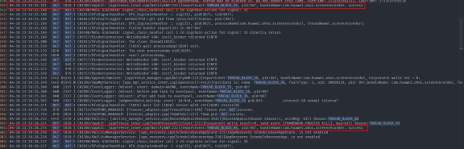

2、抓栈（signal: 35）

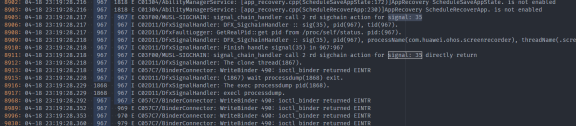

3、后台应用检测（5次后上报），21s 左右

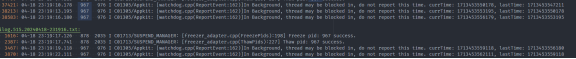

4、记录查杀原因


5、APPFREEZE kill 卡死应用


#### 一般分析步骤

根据故障日志确定上报[时间点](#获取故障发生时间点)，再根据具体场景下的故障类型前推断卡死开始发生的时间点，查看对应时间段的hilog日志，分析日志得出应用对应线程运行状态：

- 应用日志完全无打应输出：卡死在最后日志打印的接口调用处

   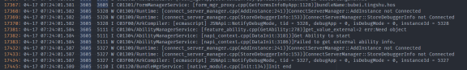

   **...**

   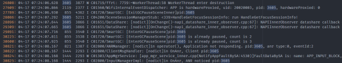

   例如上图案例：APP_INPUT_BLOCK 类型在 07:24:08.167 上报，应用主线程在 07:24:01.581 后就没有打印了，可排查是否为 FormManagerService:

   [form_mgr_proxy.cpp(GetFormsInfoByApp:1128)] 中的逻辑超时

- 应用频繁打印输出日志：分析对应输出表示的场景及其合理性

   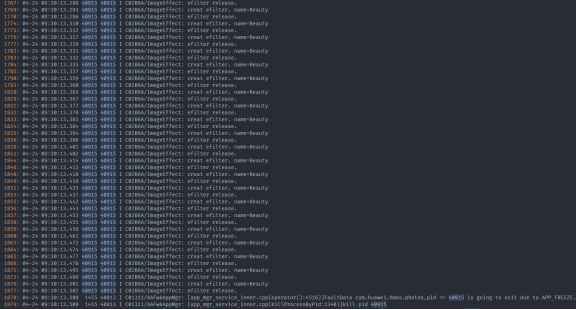

   例如上图案例：进程在被 APP_FREEZE 杀死前在大量输出，对应的 ImageEffect 领域需排查此日志是否正常

### 结合 trace

存在以下可能：

1、进程每一小段业务时间并不长，但是较长时间段运行非常密集，占满了主线程

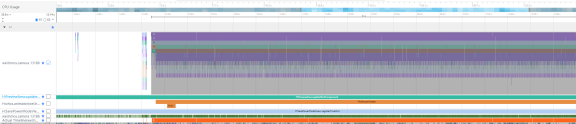

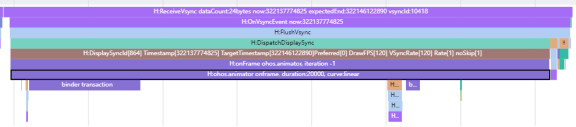

上图案例为：PriviewArea::updateShotComponent（更新组件） -> ohos.animator （执行动画）-> 密集的动画执行过程达 9.2s；

线程繁忙地循环执行某业务，分析每一小段业务：

- 不符合业务场景（此处不应该频繁调用），分析业务代码，为何会循环执行；

- 符合业务场景，分析每一小段业务是否耗时超过预期，性能为何不满足设计规格；

2、进程执行某一函数接口超时

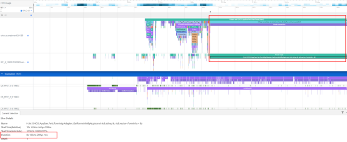

上图案例为：OHOS::AppExecFwk::FormMgrAdapter::GetFormsInfoByApp 接口执行时长达到 8s

## 分析案例

### ThreadBlock 类典型案例——未正确使用锁

#### 背景/原理

xxxservice 上报 THREAD_BLOCK_6S 的 appfreeze 问题

#### 错误代码案例

第4行加锁，第6行函数返回失败后，第6行直接返回未解锁，导致其他线程一直等锁

```cpp
int xxx()
{
    ...
    mutex_.lock();
    AIContext aiContext;
    if (ConvertRpcHandle2AIContext(inputs[0], aiContext) != aicp::SUCCESS) {
        return FAILED;
    }
    ...
}
```

#### 影响/报错

后台应用卡死，用户无感知，但是相关功能不可用

#### 定位思路

提取故障日志关键类别信息

```
appfreeze: com.huawei.hmsapp.xxx THREAD_BLOCK_6S at 20240408082432
DisplayPowerInfo:powerState:AWAKE
```

从 Foreground 值可看出 hiai 为后台应用，可推断出当真正的 3s 事件上报上来时，后台应用已卡 **18s** 前

```
Module name:com.xxx.xxx.xxx
Version:1.2.2.202
VersionCode:1002002202
PreInstalled:Yes
Foreground:No  --> 后台
Pid:43675
Uid:20020029
Reason:THREAD_BLOCK_6S
```

THREAD_BLOCK_3S 上报的时间为 08:24:29:612；
THREAD_BLOCK_6S 上报的时间为 08:24:32:638；相隔 3s 符合预期

```
>>>>>>>>>>>>>>>>>>>>>>>>>>>>>>>>>>>>>>>>>>>
DOMAIN:AAFWK
STRINGID:THREAD_BLOCK_6S
TIMESTAMP:2024/04/08-08:24:32:638
PID:43675
UID:20020029
PACKAGE_NAME:com.xxx.xxx.xxx
PROCESS_NAME:com.xxx.xxx.xxx
*******************************************
start time: 2024/04/08-08:24:29:627
DOMAIN = AAFWK
EVENTNAME = THREAD_BLOCK_3S
TIMESTAMP = 2024/04/08-08:24:29:612
PID = 43675
UID = 20020029
PACKAGE_NAME = com.xxx.xxx.xxx
PROCESS_NAME = com.xxx.xxx.xxx
```

3s 上报时会去抓取此时的 EventHandler 信息，时间为 08:24:29.413，符合预期上报的原因为：App main thread is not response! 主线程无响应，当前正在运行的任务开始时间为 08:24:01.514

```
MSG = 
Fault time:2024/04/08-08:24:29
App main thread is not response!
mainHandler dump is:
 EventHandler dump begin curTime: 2024-04-08 08:24:29.413
 Event runner (Thread name = , Thread ID = 43675) is running
 Current Running: start at 2024-04-08 08:24:01.514, Event { send thread = 43675, send time = 2024-04-08 08:24:01.514, handle time = 2024-04-08 08:24:01.514, task name = uvLoopTask }
```

watchdog 任务位于高优先级队列（High priority event queue），如下图可发现：每隔 3s 就会抛一个任务到主线程去，符合预期；

THREAD_BLOCK_3S、THREAD_BLOCK_6S 的队列一致，6s 较 3s 多了一个 event

最早的一个 event send time 为 **08:24:11.388**，与 3s 上报上来的时间 08:24:29:612 刚好差 18s，符合预期；

```
 High priority event queue information:
 No.1 : Event { send thread = 43679, send time = 2024-04-08 08:24:11.388, handle time = 2024-04-08 08:24:11.388, id = 1, caller = [watchdog.cpp(Timer:139)] }
 No.2 : Event { send thread = 43679, send time = 2024-04-08 08:24:14.458, handle time = 2024-04-08 08:24:14.458, id = 1, caller = [watchdog.cpp(Timer:139)] }
 No.3 : Event { send thread = 43679, send time = 2024-04-08 08:24:17.383, handle time = 2024-04-08 08:24:17.383, id = 1, caller = [watchdog.cpp(Timer:139)] }
 No.4 : Event { send thread = 43679, send time = 2024-04-08 08:24:20.363, handle time = 2024-04-08 08:24:20.363, id = 1, caller = [watchdog.cpp(Timer:139)] }
 No.5 : Event { send thread = 43679, send time = 2024-04-08 08:24:23.418, handle time = 2024-04-08 08:24:23.418, id = 1, caller = [watchdog.cpp(Timer:139)] }
 No.6 : Event { send thread = 43679, send time = 2024-04-08 08:24:26.369, handle time = 2024-04-08 08:24:26.369, id = 1, caller = [watchdog.cpp(Timer:139)] }
 No.7 : Event { send thread = 43679, send time = 2024-04-08 08:24:29.412, handle time = 2024-04-08 08:24:29.412, id = 1, caller = [watchdog.cpp(Timer:139)] }
```

以上可总结：应用**主线程从 08:24:01.514 开始运行本次任务，第一次 3s 检测开始时间为 08:24:11.388，真正开始卡住的时间在 08:24:11 左右；**

查看主线程栈：从 xxx_request_client.so -> libsamgr_proxy.z.so -> libipc_core.z.so(OHOS::BinderConnector::WriteBinder)

可知：**此时主线程发起了一个 ipc 请求，对端进程未返回导致卡死，如下堆栈所示。**

```
Tid:43675, Name:xxx
# 00 pc 0000000000168c44 /system/lib/ld-musl-aarch64.so.1(ioctl+176)(91b804d2409a13f27463debe9e19fb5d)
# 01 pc 0000000000049268 /system/lib64/platformsdk/libipc_core.z.so(OHOS::BinderConnector::WriteBinder(unsigned long, void*)+112)(e59500a4ea66775388332f6e3cc12fe3)
# 02 pc 0000000000054fd4 /system/lib64/platformsdk/libipc_core.z.so(OHOS::BinderInvoker::TransactWithDriver(bool)+296)(e59500a4ea66775388332f6e3cc12fe3)
# 03 pc 00000000000544c8 /system/lib64/platformsdk/libipc_core.z.so(OHOS::BinderInvoker::WaitForCompletion(OHOS::MessageParcel*, int*)+304)(e59500a4ea66775388332f6e3cc12fe3)
# 04 pc 0000000000053c84 /system/lib64/platformsdk/libipc_core.z.so(OHOS::BinderInvoker::SendRequest(int, unsigned int, OHOS::MessageParcel&, OHOS::MessageParcel&, OHOS::MessageOption&)+312)(e59500a4ea66775388332f6e3cc12fe3)
# 05 pc 000000000002d6d8 /system/lib64/platformsdk/libipc_core.z.so(OHOS::IPCObjectProxy::SendRequestInner(bool, unsigned int, OHOS::MessageParcel&, OHOS::MessageParcel&, OHOS::MessageOption&)+128)(e59500a4ea66775388332f6e3cc12fe3)
# 06 pc 0000000000030e00 /system/lib64/platformsdk/libipc_core.z.so(OHOS::IPCObjectProxy::GetProtoInfo()+396)(e59500a4ea66775388332f6e3cc12fe3)
# 07 pc 000000000002e990 /system/lib64/platformsdk/libipc_core.z.so(OHOS::IPCObjectProxy::WaitForInit()+292)(e59500a4ea66775388332f6e3cc12fe3)
# 08 pc 0000000000036cd0 /system/lib64/platformsdk/libipc_core.z.so(OHOS::IPCProcessSkeleton::FindOrNewObject(int)+116)(e59500a4ea66775388332f6e3cc12fe3)
# 09 pc 00000000000571cc /system/lib64/platformsdk/libipc_core.z.so(OHOS::BinderInvoker::UnflattenObject(OHOS::Parcel&)+272)(e59500a4ea66775388332f6e3cc12fe3)
# 10 pc 00000000000463a4 /system/lib64/platformsdk/libipc_core.z.so(OHOS::MessageParcel::ReadRemoteObject()+116)(e59500a4ea66775388332f6e3cc12fe3)
# 11 pc 000000000001250c /system/lib64/chipset-pub-sdk/libsamgr_proxy.z.so(OHOS::SystemAbilityManagerProxy::CheckSystemAbility(int, bool&)+952)(6f113f37ac6ac882cfa16077ad5b406a)
# 12 pc 0000000000010e7c /system/lib64/chipset-pub-sdk/libsamgr_proxy.z.so(OHOS::SystemAbilityManagerProxy::GetSystemAbilityWrapper(int, std::__h::basic_string<char, std::__h::char_traits<char>, std::__h::allocator<char>> const&)+232)(6f113f37ac6ac882cfa16077ad5b406a)
# 13 pc 00000000000118b8 /system/lib64/chipset-pub-sdk/libsamgr_proxy.z.so(OHOS::SystemAbilityManagerProxy::Recompute(int, int)+132)(6f113f37ac6ac882cfa16077ad5b406a)
# 14 pc 0000000000011170 /system/lib64/chipset-pub-sdk/libsamgr_proxy.z.so(OHOS::DynamicCache<int, OHOS::sptr<OHOS::IRemoteObject>>::QueryResult(int, int)+316)(6f113f37ac6ac882cfa16077ad5b406a)
# 15 pc 0000000000007e0c xxx_request_client.so(xxx::RPCRequestClient::GetService()+540)(557450139184527807025a632613fd76)
# 16 pc 0000000000008824 xxx_request_client.so(xxx::RPCRequestClient::Init()+16)(557450139184527807025a632613fd76)
# 17 pc 0000000000008d60 xxx_request_client.so(CreateRpcRequestByServiceName+104)(557450139184527807025a632613fd76)
# 18 pc 0000000000008f98 xxx_request_client.so(CreateRpcRequest+72)(557450139184527807025a632613fd76)
# 19 pc 0000000000002944 xxx_rpc_client.so(xxx::xxx::RpcRequestClient::RpcRequestClient()+224)(02343ed2fff69759d408b23eaf69fcde)
```

查看 binderCatcher：**此时 43675 的主线程正在与 979 进程通信，抓 binder 时已经卡了 27s**

```
PeerBinderCatcher -- pid==43675 layer_ == 1
BinderCatcher --
    43675:43675 to 979:0 code 5f475249 wait:27.104545829 s frz_state:1  --> binder通信等待了27s
    57187:39147 to 28644:30753 code 0 wait:0.337894271 s frz_state:3
    57187:39151 to 28644:28652 code 7 wait:0.531140625 s frz_state:3
    57187:39150 to 28644:31297 code 0 wait:0.976419270 s frz_state:3
    57187:38979 to 28644:32554 code 0 wait:0.22108334 s frz_state:3
    57187:39149 to 28644:30754 code 0 wait:0.534261979 s frz_state:3
    57187:38949 to 28644:31301 code 0 wait:0.977779166 s frz_state:3
    57187:39172 to 28644:35667 code 0 wait:1.47387500 s frz_state:3
    57187:39173 to 28644:28822 code 0 wait:0.565389063 s frz_state:3
    1477:1676 to 1408:2026 code 17 wait:0.0 s frz_state:3
    628:8136 to 979:0 code 2 wait:13166.722870859 s frz_state:1
```

查看 979 进程主线程栈：xxxserver 在等待锁释放。**该问题即为典型的锁使用不当，导致的等锁卡死。**

```
PeerBinder Stacktrace --
PeerBinderCatcher start catcher stacktrace for pid : 979
Result: 0 ( no error )
Timestamp:2024-04-08 08:24:29.000
Pid:979
Uid:3094
Process name:xxxserver
Process life time:60410s
Tid:979, Name:xxxserver
# 00 pc 00000000001aafc4 /system/lib/ld-musl-aarch64.so.1(__timedwait_cp+192)(91b804d2409a13f27463debe9e19fb5d)
# 01 pc 00000000001b0d50 /system/lib/ld-musl-aarch64.so.1(__pthread_mutex_timedlock_inner+592)(91b804d2409a13f27463debe9e19fb5d)
# 02 pc 00000000000c38e0 /system/lib64/libc++.so(std::__h::mutex::lock()+8)(0b61ba21a775725a1bd8802a393b133afbc503a5)   --> 调用了lock，然后等待
# 03 pc 00000000000086dc xxx_server.so(xxx::xxx::InitImpl(int, std::__h::vector<xxx::xxx::RpcHandle, std::__h::allocator<xxx::xxx::RpcHandle>> const&, std::__h::vector<xxx::xxx::RpcHandle, std::__h::allocator<xxx::xxx::RpcHandle>>&)+84)(f4bb275898d797b22eae35fe48db9009)
# 04 pc 000000000000798c xxx_request_server.so(xxx::RPCRequestStub::SyncExecute(OHOS::MessageParcel&, OHOS::MessageParcel&)+164)(70cbb10c758902c1e3e179efc93ce0af)
# 05 pc 0000000000008314 xxx_request_server.so(xxx::RPCRequestStub::OnRemoteRequest(unsigned int, OHOS::MessageParcel&, OHOS::MessageParcel&, OHOS::MessageOption&)+300)(70cbb10c758902c1e3e179efc93ce0af)
# 06 pc 00000000000153e4 /system/lib64/chipset-pub-sdk/libipc_single.z.so(OHOS::IPCObjectStub::SendRequest(unsigned int, OHOS::MessageParcel&, OHOS::MessageParcel&, OHOS::MessageOption&)+604)(25b3d63905ef47289c096ea42ba2d86a)
# 07 pc 000000000002b464 /system/lib64/chipset-pub-sdk/libipc_single.z.so(OHOS::IPC_SINGLE::BinderInvoker::OnTransaction(unsigned char const*)+1220)(25b3d63905ef47289c096ea42ba2d86a)
# 08 pc 000000000002baec /system/lib64/chipset-pub-sdk/libipc_single.z.so(OHOS::IPC_SINGLE::BinderInvoker::HandleCommandsInner(unsigned int)+368)(25b3d63905ef47289c096ea42ba2d86a)
# 09 pc 000000000002a6b0 /system/lib64/chipset-pub-sdk/libipc_single.z.so(OHOS::IPC_SINGLE::BinderInvoker::HandleCommands(unsigned int)+60)(25b3d63905ef47289c096ea42ba2d86a)
# 10 pc 000000000002a4dc /system/lib64/chipset-pub-sdk/libipc_single.z.so(OHOS::IPC_SINGLE::BinderInvoker::StartWorkLoop()+120)(25b3d63905ef47289c096ea42ba2d86a)
# 11 pc 000000000002bc2c /system/lib64/chipset-pub-sdk/libipc_single.z.so(OHOS::IPC_SINGLE::BinderInvoker::JoinThread(bool)+92)(25b3d63905ef47289c096ea42ba2d86a)
# 12 pc 0000000000004bd4 xxxserver(02cff7e5dce05d6d28096601458b6f6d)
# 13 pc 00000000000a3b58 /system/lib/ld-musl-aarch64.so.1(libc_start_main_stage2+64)(91b804d2409a13f27463debe9e19fb5d)
```

反编译即可确定对应卡锁代码行，结合上下文检测锁的使用

#### 修改方法

```cpp
int xxx()
{
    ...
    mutex_.lock();
    AIContext aiContext;
    if (ConvertRpcHandle2AIContext(inputs[0], aiContext) != aicp::SUCCESS) {
        return FAILED;
    }
    ...
}
```

修改为：

```cpp
int xxx()
{
    ...
    AIContext aiContext;
    if (ConvertRpcHandle2AIContext(inputs[0], aiContext) != aicp::SUCCESS) {
        return FAILED;
    }
    mutex_.lock();
    ...
}
```

结合上下文，合理调整锁的使用

#### 推荐建议（问题总结）

1、多线程交互时需要格外注意时序、死锁问题

### APP_INPUT_BLOCK 类典型案例——组件全量刷新

#### 背景

用户在切换主题时突然卡死，有 sceneboard 的 appfreeze 问题上报

该问题为线程繁忙导致卡死

#### 错误代码实例

对于组件的刷新复用，是通过组件的 key 值来控制的，当页面更新时，若组件的 key 不变，会复用之前的组件；若 key 值变化，会更新组件及其子组件。

该函数用户生成桌面组件的 key，关联有 themeStyle，当用户在桌面连续切换主题时，导致组件反复全量刷新，导致卡死。

```ts
private getForeachKey(item: xxx): string {
    ...
    return `${item.xxx2}${item.xxx2}...${item.themeStyle}`;
}
```

#### 影响

用户在合一桌面切换主题时页面高概率卡死，点击无响应，而后闪退到锁屏界面。

严重影响用户使用体验。

#### 定位思路

提取故障关键信息。

```
appfreeze: com.ohos.sceneboard APP_INPUT_BLOCK at 20240319022527
DisplayPowerInfo:powerState:AWAKE
```

APP_INPUT_BLOCK 是事件上报的时间为 **14:40:59:440**

```
DOMAIN:AAFWK
STRINGID:APP_INPUT_BLOCK
TIMESTAMP:2024/03/14-14:40:59:440 --> 故障上报时间
PID:2918
UID:20020017
PACKAGE_NAME:com.ohos.sceneboard
PROCESS_NAME:com.ohos.sceneboard
```

上报的原因是：User input does not respond! 用户输入事件没有响应
可以看到当前是在主线程上(Thread ID == Pid)，正在运行的任务从 **14:40:53.499** 开始运行，直到 Fault time **14:40:58** 都还没有运行完

```
MSG = 
Fault time:2024/03/14-14:40:58
User input does not respond!
mainHandler dump is:
 EventHandler dump begin curTime: 2024-03-14 02:40:58.520
 Event runner (Thread name = , Thread ID = 2918) is running
 Current Running: start at 2024-03-14 02:40:53.499, Event { send thread = 2918, send time = 2024-03-14 02:40:53.499, handle time = 2024-03-14 02:40:53.499, task name =  }
```

用户输入事件需要第一时间响应，所以同 watchdog 一样都在 High priority event queue；

可以看到此时已经有 200+ 的 input event 在队列中阻塞住没有处理了；

```
 High priority event queue information:
 No.1 : Event { send thread = 3370, send time = 2024-03-14 02:40:53.690, handle time = 2024-03-14 02:40:53.690, task name = , caller = [input_manager_impl.cpp(OnPointerEvent:465)] }
 No.2 : Event { send thread = 3370, send time = 2024-03-14 02:40:53.699, handle time = 2024-03-14 02:40:53.699, task name = , caller = [input_manager_impl.cpp(OnPointerEvent:465)] }
 No.3 : Event { send thread = 3370, send time = 2024-03-14 02:40:53.708, handle time = 2024-03-14 02:40:53.708, task name = , caller = [input_manager_impl.cpp(OnPointerEvent:465)] }
 No.4 : Event { send thread = 3370, send time = 2024-03-14 02:40:53.717, handle time = 2024-03-14 02:40:53.717, task name = , caller = [input_manager_impl.cpp(OnPointerEvent:465)] }
 No.5 : Event { send thread = 3370, send time = 2024-03-14 02:40:53.726, handle time = 2024-03-14 02:40:53.726, task name = , caller = [input_manager_impl.cpp(OnPointerEvent:465)] }
 No.6 : Event { send thread = 3370, send time = 2024-03-14 02:40:53.736, handle time = 2024-03-14 02:40:53.736, task name = , caller = [input_manager_impl.cpp(OnPointerEvent:465)] }
 No.7 : Event { send thread = 3370, send time = 2024-03-14 02:40:53.745, handle time = 2024-03-14 02:40:53.745, task name = , caller = [input_manager_impl.cpp(OnPointerEvent:465)] }
 No.8 : Event { send thread = 3370, send time = 2024-03-14 02:40:53.754, handle time = 2024-03-14 02:40:53.754, task name = , caller = [input_manager_impl.cpp(OnPointerEvent:465)] }
 ...
 No.190 : Event { send thread = 3370, send time = 2024-03-14 02:40:56.166, handle time = 2024-03-14 02:40:56.166, task name = , caller = [input_manager_impl.cpp(OnPointerEvent:465)] }
 No.191 : Event { send thread = 3370, send time = 2024-03-14 02:40:56.176, handle time = 2024-03-14 02:40:56.176, task name = , caller = [input_manager_impl.cpp(OnPointerEvent:465)] }
 No.192 : Event { send thread = 3370, send time = 2024-03-14 02:40:56.186, handle time = 2024-03-14 02:40:56.186, task name = , caller = [input_manager_impl.cpp(OnPointerEvent:465)] }
 No.193 : Event { send thread = 2923, send time = 2024-03-14 02:40:56.196, handle time = 2024-03-14 02:40:56.196, id = 1, caller = [watchdog.cpp(Timer:140)] }
 No.194 : Event { send thread = 3370, send time = 2024-03-14 02:40:56.196, handle time = 2024-03-14 02:40:56.196, task name = , caller = [input_manager_impl.cpp(OnPointerEvent:465)] }
 No.195 : Event { send thread = 3370, send time = 2024-03-14 02:40:56.206, handle time = 2024-03-14 02:40:56.206, task name = , caller = [input_manager_impl.cpp(OnPointerEvent:465)] }
 No.196 : Event { send thread = 3370, send time = 2024-03-14 02:40:56.216, handle time = 2024-03-14 02:40:56.216, task name = , caller = [input_manager_impl.cpp(OnPointerEvent:465)] }
 No.197 : Event { send thread = 3370, send time = 2024-03-14 02:40:56.226, handle time = 2024-03-14 02:40:56.226, task name = , caller = [input_manager_impl.cpp(OnPointerEvent:465)] }
 No.198 : Event { send thread = 3370, send time = 2024-03-14 02:40:56.236, handle time = 2024-03-14 02:40:56.236, task name = , caller = [input_manager_impl.cpp(OnPointerEvent:465)] }
 No.199 : Event { send thread = 3370, send time = 2024-03-14 02:40:56.245, handle time = 2024-03-14 02:40:56.245, task name = , caller = [input_manager_impl.cpp(OnPointerEvent:465)] }
 No.200 : Event { send thread = 3370, send time = 2024-03-14 02:40:56.254, handle time = 2024-03-14 02:40:56.254, task name = , caller = [input_manager_impl.cpp(OnPointerEvent:465)] }
 No.201 : Event { send thread = 3370, send time = 2024-03-14 02:40:56.265, handle time = 2024-03-14 02:40:56.265, task name = , caller = [input_manager_impl.cpp(OnPointerEvent:465)] }
 No.202 : Event { send thread = 3370, send time = 2024-03-14 02:40:56.275, handle time = 2024-03-14 02:40:56.274, task name = , caller = [input_manager_impl.cpp(OnPointerEvent:465)] }
 No.203 : Event { send thread = 3370, send time = 2024-03-14 02:40:56.284, handle time = 2024-03-14 02:40:56.284, task name = , caller = [input_manager_impl.cpp(OnPointerEvent:465)] }
 No.204 : Event { send thread = 3370, send time = 2024-03-14 02:40:56.294, handle time = 2024-03-14 02:40:56.294, task name = , caller = [input_manager_impl.cpp(OnPointerEvent:465)] }
 No.205 : Event { send thread = 3370, send time = 2024-03-14 02:40:56.305, handle time = 2024-03-14 02:40:56.305, task name = , caller = [input_manager_impl.cpp(OnPointerEvent:465)] }
```

从逻辑来看，input event 触发应用主线程任务开始执行，但是 6s 还没有执行完，没有反馈，导致 ANR 超时；
因此我们只需要关心 input 触发了应用执行什么任务，该任务为什么会执行超时即可。

主线程栈：此时运行时状态，栈顶的 ark_jsruntime GetCurrentThreadId 也不是持锁阻塞或耗时很长函数，抓到的栈为瞬时栈，没有参考意义；

```
Tid:2918, Name:ohos.sceneboard
# 00 pc 000000000009f73c /system/lib/ld-musl-aarch64.so.1(8fa55898166cd804dad43d909b5319cc)
# 01 pc 000000000054b7b4 /system/lib64/platformsdk/libark_jsruntime.so(panda::os::thread::GetCurrentThreadId()+12)(7715646e48f750f3dc31e660b056eb43)
# 02 pc 00000000002107a4 /system/lib64/platformsdk/libark_jsruntime.so(panda::ecmascript::EcmaVM::CheckThread() const+200)(7715646e48f750f3dc31e660b056eb43)
# 03 pc 0000000000432998 /system/lib64/platformsdk/libark_jsruntime.so(panda::JSNApi::GetHandleAddr(panda::ecmascript::EcmaVM const*, unsigned long)+64)(7715646e48f750f3dc31e660b056eb43)
# 04 pc 000000000003eeb8 /system/lib64/platformsdk/libace_napi.z.so(ArkNativeReference::Get()+32)(c3a760aff0c73a2e76accaf518321fc9)
# 05 pc 0000000000043cb4 /system/lib64/platformsdk/libace_napi.z.so(napi_get_reference_value+48)(c3a760aff0c73a2e76accaf518321fc9)
# 06 pc 0000000000007564 /system/lib64/module/events/libemitter.z.so(OHOS::AppExecFwk::SearchCallbackInfo(napi_env__*, std::__h::variant<unsigned int, std::__h::basic_string<char, std::__h::char_traits<char>, std::__h::allocator<char>>> const&, napi_value__*)+248)(8fe2937855aab3ea839419f952597511)
# 07 pc 0000000000007d8c /system/lib64/module/events/libemitter.z.so(OHOS::AppExecFwk::OnOrOnce(napi_env__*, napi_callback_info__*, bool)+568)(8fe2937855aab3ea839419f952597511)
# 08 pc 00000000000096d8 /system/lib64/module/events/libemitter.z.so(OHOS::AppExecFwk::JS_Once(napi_env__*, napi_callback_info__*) (.cfi)+84)(8fe2937855aab3ea839419f952597511)
# 09 pc 000000000002c8f0 /system/lib64/platformsdk/libace_napi.z.so(ArkNativeFunctionCallBack(panda::JsiRuntimeCallInfo*)+168)(c3a760aff0c73a2e76accaf518321fc9)
# 10 pc 0000000000187b48 /system/lib64/module/arkcompiler/stub.an(RTStub_PushCallArgsAndDispatchNative+40)
# 11 pc 00000000002da5fc /system/lib64/platformsdk/libark_jsruntime.so(panda::ecmascript::InterpreterAssembly::Execute(panda::ecmascript::EcmaRuntimeCallInfo*)+416)(7715646e48f750f3dc31e660b056eb43)
# 12 pc 00000000002da5fc /system/lib64/platformsdk/libark_jsruntime.so(panda::ecmascript::InterpreterAssembly::Execute(panda::ecmascript::EcmaRuntimeCallInfo*)+416)(7715646e48f750f3dc31e660b056eb43)
# 13 pc 00000000003954a0 /system/lib64/platformsdk/libark_jsruntime.so(panda::ecmascript::JSStableArray::HandleforEachOfStable(panda::ecmascript::JSThread*, panda::ecmascript::JSHandle<panda::ecmascript::JSObject>, panda::ecmascript::JSHandle<panda::ecmascript::JSTaggedValue>, panda::ecmascript::JSHandle<panda::ecmascript::JSTaggedValue>, unsigned int, unsigned int&)+596)(7715646e48f750f3dc31e660b056eb43)
# 14 pc 000000000018f4b0 /system/lib64/platformsdk/libark_jsruntime.so(panda::ecmascript::builtins::BuiltinsArray::ForEach(panda::ecmascript::EcmaRuntimeCallInfo*)+840)(7715646e48f750f3dc31e660b056eb43)
...
```

接下来排查流水日志：

首先找到上报 APP_INPUT_BLOCK 的时间点，大概在 13:40:59.448 左右，且从这里我们可以看到在事件上报完后，dfx 将卡死的 scb 杀掉。

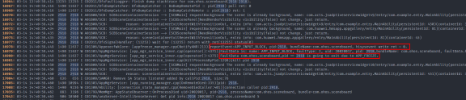

往前推 6s 左右，可以看到在 14:40:53.498 左右，有一个点击事件发给了 scb。

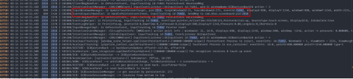

在这之间的 6s 存在大量的 scb 日志，判断是在做更新渲染

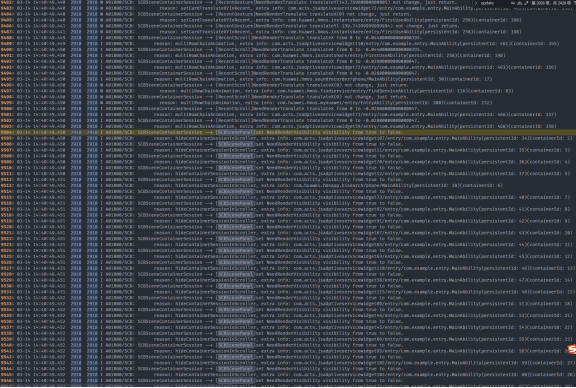

看下对应时间点的 trace：

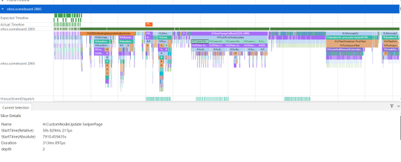

发现 scb 主线程被占满，确实很繁忙。选择耗时较长的任务，是 **CustomNodeUpdate SwiperPage**，后续就需要排查为啥这个组件里一直在做刷新。

根据对应领域排查后发现：swiperPage上把 themeStyle 加入到了 key 里面，key 变了就会走控件新建流程

即当用户切换主题或者切换图标风格时，会造成桌面上控件的全量新建，导致主线程繁忙，导致输入事件未响应

#### 修改方法

仅当切换桌面组件风格时，才触发桌面组件的刷新，缩小刷新范围。

```ts
+ if (!CheckEmptyUtils.isEmpty(themeStyleInfo.iconResourcePath) &&
+     themeStyleInfo.iconResourcePath !== this.themeStyle.iconResourcePath) {
+     this.isStyleChanged = true;
+     this.themeStyle.iconResourcePath = themeStyleInfo.iconResourcePath; --> themeStyle 与 iconResourcePath 关联
+ }
```

#### 推荐建议（问题总结）

1、用户点击触发页面更新时，需要合理控制页面刷新的范围，考虑大量组件、频繁刷新等场景

### LIFECYCLE_TIMEOUT 类典型案例——加载云图

#### 背景/原理

用户在打开云笔记时应用卡死后闪退

#### 错误代码实例

循环中同步获取云图

```ts
public static xxxFunction(fileUris: string[]): void {
    ...
    for (const fileuril of fileUrils) {
        let file = fs.openSync(fileUri, fs.OpenMode.READ_ONLY);
        ...
    }
    ...
}
```

#### 影响/报错

应用拉起、切前台等过程中卡死并闪退

#### 定位思路

以 notepad LIFECYCLE_TIMEOUT 为例，提取故障关键信息：

```
 sysfreeze: LIFECYCLE_TIMEOUT LIFECYCLE_TIMEOUT at 20240201100459
```

查看 MSG 信息：**foreground timeout，对应时长为 5s**

```
MSG = 
Fault time:2024/02/01-10:04:57
ability:MainAbility foreground timeout.
server:
312522; AbilityRecord::ForegroundAbility; the ForegroundAbility lifecycle starts.
client:
312522; AbilityThread::ScheduleAbilityTransaction; the foreground lifecycle.
```

LIFECYCLE_HALF_TIMEOUT 上报时间为 **10:04:57:538**；
LIFECYCLE_TIMEOUT 上报时间为 **10:04:59:965**；相隔 2.5s 左右，符合预期；

```
>>>>>>>>>>>>>>>>>>>>>>>>>>>>>>>>>>>>>>>>>>>
DOMAIN:AAFWK
STRINGID:LIFECYCLE_TIMEOUT
TIMESTAMP:2024/02/01-10:04:59:965
PID:18083
UID:20020041
PACKAGE_NAME:com.huawei.hmos.notepad
PROCESS_NAME:com.huawei.hmos.notepad
*******************************************
start time: 2024/02/01-10:04:57:555
DOMAIN = AAFWK
EVENTNAME = LIFECYCLE_HALF_TIMEOUT
TIMESTAMP = 2024/02/01-10:04:57:538
PID = 18083
UID = 20020041
TID = 17286
PACKAGE_NAME = com.huawei.hmos.notepad
PROCESS_NAME = com.huawei.hmos.notepad
```

任务开始的时间为 **10:04:54.798**，离 LIFECYCLE_HALF_TIMEOUT 相隔 2.5s 左右，符合预期；

```
mainHandler dump is:
 EventHandler dump begin curTime: 2024-02-01 10:04:57.306
 Event runner (Thread name = , Thread ID = 18083) is running
 Current Running: start at 2024-02-01 10:04:54.798, Event { send thread = 18132, send time = 2024-02-01 10:04:54.778, handle time = 2024-02-01 10:04:54.778, task name = UIAbilityThread:SendResult }
 History event queue information:
 No. 0 : Event { send thread = 18083, send time = 2024-02-01 10:04:46.481, handle time = 2024-02-01 10:04:46.981, trigger time = 2024-02-01 10:04:46.982, completeTime time = 2024-02-01 10:04:46.982, task name =  }
 No. 1 : Event { send thread = 18132, send time = 2024-02-01 10:04:47.149, handle time = 2024-02-01 10:04:47.149, trigger time = 2024-02-01 10:04:47.149, completeTime time = 2024-02-01 10:04:47.197, task name = MainThread:BackgroundApplication }
 No. 2 : Event { send thread = 18083, send time = 2024-02-01 10:04:44.329, handle time = 2024-02-01 10:04:47.329, trigger time = 2024-02-01 10:04:47.329, completeTime time = 2024-02-01 10:04:47.329, task name =  }
 No. 3 : Event { send thread = 18087, send time = 2024-02-01 10:04:48.091, handle time = 2024-02-01 10:04:48.091, trigger time = 2024-02-01 10:04:48.091, completeTime time = 2024-02-01 10:04:48.091, task name =  }
 No. 4 : Event { send thread = 18087, send time = 2024-02-01 10:04:51.047, handle time = 2024-02-01 10:04:51.047, trigger time = 2024-02-01 10:04:51.048, completeTime time = 2024-02-01 10:04:51.048, task name =  }
 No. 5 : Event { send thread = 18087, send time = 2024-02-01 10:04:54.067, handle time = 2024-02-01 10:04:54.067, trigger time = 2024-02-01 10:04:54.067, completeTime time = 2024-02-01 10:04:54.067, task name =  }
 ...
```

看对应的堆栈信息：libfs.z.so -> libdatashare_consumer.z.so -> libipc_core.z.so

```
Tid:18083, Name:ei.hmos.notepad
# 00 pc 00000000001617a4 /system/lib/ld-musl-aarch64.so.1(ioctl+180)(4ca73cff61bea7c4a687eb0f71c9df69)
# 01 pc 000000000003e8a0 /system/lib64/platformsdk/libipc_core.z.so(OHOS::BinderConnector::WriteBinder(unsigned long, void*)+72)(3248fceb1fa676994734e0437430ce37)
# 02 pc 0000000000049f38 /system/lib64/platformsdk/libipc_core.z.so(OHOS::BinderInvoker::TransactWithDriver(bool)+296)(3248fceb1fa676994734e0437430ce37)
# 03 pc 00000000000496f8 /system/lib64/platformsdk/libipc_core.z.so(OHOS::BinderInvoker::WaitForCompletion(OHOS::MessageParcel*, int*)+116)(3248fceb1fa676994734e0437430ce37)
# 04 pc 00000000000490bc /system/lib64/platformsdk/libipc_core.z.so(OHOS::BinderInvoker::SendRequest(int, unsigned int, OHOS::MessageParcel&, OHOS::MessageParcel&, OHOS::MessageOption&)+312)(3248fceb1fa676994734e0437430ce37)
# 05 pc 0000000000027700 /system/lib64/platformsdk/libipc_core.z.so(OHOS::IPCObjectProxy::SendRequestInner(bool, unsigned int, OHOS::MessageParcel&, OHOS::MessageParcel&, OHOS::MessageOption&)+132)(3248fceb1fa676994734e0437430ce37)
# 06 pc 000000000002799c /system/lib64/platformsdk/libipc_core.z.so(OHOS::IPCObjectProxy::SendRequest(unsigned int, OHOS::MessageParcel&, OHOS::MessageParcel&, OHOS::MessageOption&)+140)(3248fceb1fa676994734e0437430ce37)
# 07 pc 000000000002640c /system/lib64/platformsdk/libdatashare_consumer.z.so(OHOS::DataShare::DataShareProxy::OpenFile(OHOS::Uri const&, std::__h::basic_string<char, std::__h::char_traits<char>, std::__h::allocator<char>> const&)+440)(e93b5085235269d4b7218ea7de64b69a)
# 08 pc 0000000000014b2c /system/lib64/platformsdk/libdatashare_consumer.z.so(OHOS::DataShare::ExtSpecialController::OpenFile(OHOS::Uri const&, std::__h::basic_string<char, std::__h::char_traits<char>, std::__h::allocator<char>> const&)+160)(e93b5085235269d4b7218ea7de64b69a)
# 09 pc 0000000000022c54 /system/lib64/platformsdk/libdatashare_consumer.z.so(OHOS::DataShare::DataShareHelperImpl::OpenFile(OHOS::Uri&, std::__h::basic_string<char, std::__h::char_traits<char>, std::__h::allocator<char>> const&)+96)(e93b5085235269d4b7218ea7de64b69a)
# 10 pc 0000000000108b34 /system/lib64/module/file/libfs.z.so(OHOS::FileManagement::ModuleFileIO::OpenFileByDatashare(std::__h::basic_string<char, std::__h::char_traits<char>, std::__h::allocator<char>> const&, unsigned int)+468)(152580bf9c379f11f29fdded278541bd)
# 11 pc 0000000000108264 /system/lib64/module/file/libfs.z.so(OHOS::FileManagement::ModuleFileIO::OpenFileByUri(std::__h::basic_string<char, std::__h::char_traits<char>, std::__h::allocator<char>> const&, unsigned int)+1760)(152580bf9c379f11f29fdded278541bd)
# 12 pc 00000000001077fc /system/lib64/module/file/libfs.z.so(OHOS::FileManagement::ModuleFileIO::Open::Sync(napi_env__*, napi_callback_info__*) (.cfi)+1036)(152580bf9c379f11f29fdded278541bd)
# 13 pc 000000000002bbf8 /system/lib64/platformsdk/libace_napi.z.so(ArkNativeFunctionCallBack(panda::JsiRuntimeCallInfo*)+168)(f5b81db475835ee752235c606b1c5e33)
# 14 pc 0000000000132e48 /system/lib64/module/arkcompiler/stub.an
```

通过 binder 可以看出在与 5235 进程通信，时长大于 2.5s，符合预期。

```
PeerBinderCatcher -- pid==18083 layer_ == 1
BinderCatcher --
    18083:18083 to 5235:7437 code 2 wait:2.723147396 s
    3462:3840 to 4956:4958 code 8 wait:261.213830169 s
    3462:3621 to 4956:4981 code 8 wait:273.550283291 s
```

5235 为媒体库进程，该堆栈无有效信息

```
PeerBinder Stacktrace --
PeerBinderCatcher start catcher stacktrace for pid : 5235
Result: 0 ( no error )
Timestamp:2024-02-01 10:04:57.000
Pid:5235
Uid:20020079
Process name:com.ohos.medialibrary.medialibrarydata
Tid:5235, Name:edialibrarydata
# 00 pc 0000000000142d1c /system/lib/ld-musl-aarch64.so.1(epoll_wait+84)(4ca73cff61bea7c4a687eb0f71c9df69)
# 01 pc 000000000000fb74 /system/lib64/chipset-pub-sdk/libeventhandler.z.so(OHOS::AppExecFwk::EpollIoWaiter::WaitFor(std::__h::unique_lock<std::__h::mutex>&, long)+224)(a4d21072c08fd3ac639d5cf5b8fb8b51)
# 02 pc 0000000000019df8 /system/lib64/chipset-pub-sdk/libeventhandler.z.so(OHOS::AppExecFwk::EventQueue::WaitUntilLocked(std::__h::chrono::time_point<std::__h::chrono::steady_clock, std::__h::chrono::duration<long long, std::__h::ratio<1l, 1000000000l>>> const&, std::__h::unique_lock<std::__h::mutex>&)+180)(a4d21072c08fd3ac639d5cf5b8fb8b51)
# 03 pc 0000000000019c6c /system/lib64/chipset-pub-sdk/libeventhandler.z.so(OHOS::AppExecFwk::EventQueue::GetEvent()+128)(a4d21072c08fd3ac639d5cf5b8fb8b51)
# 04 pc 00000000000202b8 /system/lib64/chipset-pub-sdk/libeventhandler.z.so(OHOS::AppExecFwk::(anonymous namespace)::EventRunnerImpl::Run()+1164)(a4d21072c08fd3ac639d5cf5b8fb8b51)
# 05 pc 0000000000022388 /system/lib64/chipset-pub-sdk/libeventhandler.z.so(OHOS::AppExecFwk::EventRunner::Run()+120)(a4d21072c08fd3ac639d5cf5b8fb8b51)
# 06 pc 000000000007ea08 /system/lib64/platformsdk/libappkit_native.z.so(OHOS::AppExecFwk::MainThread::Start()+772)(183fe2babcfdd3e1ea4bca16a0e26a5d)
# 07 pc 0000000000011ac8 /system/bin/appspawn(RunChildProcessor+236)(7b715884c45cfe57b22df46fdaeeca88)
# 08 pc 0000000000034684 /system/bin/appspawn(AppSpawnChild+264)(7b715884c45cfe57b22df46fdaeeca88)
# 09 pc 00000000000344f4 /system/bin/appspawn(AppSpawnProcessMsg+380)(7b715884c45cfe57b22df46fdaeeca88)
# 10 pc 00000000000305a0 /system/bin/appspawn(OnReceiveRequest+1820)(7b715884c45cfe57b22df46fdaeeca88)
# 11 pc 0000000000017c58 /system/lib64/chipset-pub-sdk/libbegetutil.z.so(HandleRecvMsg_+260)(22f33d1b0218f31bad0dcc75cf348b90)
# 12 pc 00000000000178fc /system/lib64/chipset-pub-sdk/libbegetutil.z.so(HandleStreamEvent_+148)(22f33d1b0218f31bad0dcc75cf348b90)
# 13 pc 0000000000015478 /system/lib64/chipset-pub-sdk/libbegetutil.z.so(ProcessEvent+112)(22f33d1b0218f31bad0dcc75cf348b90)
# 14 pc 0000000000015090 /system/lib64/chipset-pub-sdk/libbegetutil.z.so(RunLoop_+308)(22f33d1b0218f31bad0dcc75cf348b90)
# 15 pc 000000000002eff4 /system/bin/appspawn(AppSpawnRun+116)(7b715884c45cfe57b22df46fdaeeca88)
# 16 pc 000000000001f438 /system/bin/appspawn(main+724)(7b715884c45cfe57b22df46fdaeeca88)
# 17 pc 00000000000a0974 /system/lib/ld-musl-aarch64.so.1(libc_start_main_stage2+64)(4ca73cff61bea7c4a687eb0f71c9df69)
# 18 pc 000000000001106c /system/bin/appspawn(_start_c+76)(7b715884c45cfe57b22df46fdaeeca88)
```

以上可以得到信息：应用通过文件系统 Open::Sync 同步通过 uri 加载文件，调用到 datashare 请求媒体库文件数据

查看对应时间点的流水信息：进程调用 datashare 加载云图后卡死，与堆栈信息吻合；

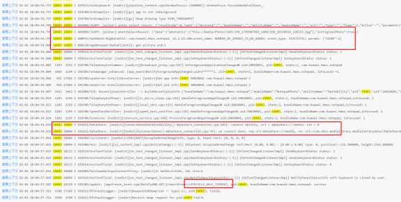

查看具体代码：

在循环中同步加载 fileUri ，这种明显是不合理的，当弱网或者同时加载大量数据的条件下，极易出现卡死情况，应用侧需要整改。

#### 修改方法

同步加载改为异步加载，并用标志位来标识是否加载完，用户界面展示加载中效果。

```ts
public static xxxFunction(fileUris: string[]): void {
    ...
    for (const fileuril of fileUrils) {
        let file = fs.openSync(fileUri, fs.OpenMode.READ_ONLY);
        ...
    }
    ...
}
```

修改为：

```ts
public static async xxxFunction(fileUris: string[]): void {
    ...
    AppStorage.setOrCreate<boolean>('isLoadingPic', true); --> 用于页面 load 效果展示
    for (const fileuril of fileUrils) {
        let file = await fs.open(fileUri, fs.OpenMode.READ_ONLY);
        ...
    }
    ...
}
```

#### 推荐建议（问题总结）

1、请求云侧数据需要验证充分，有网、弱网、无网场景下

2、不要在应用生命周期函数中做耗时操作
