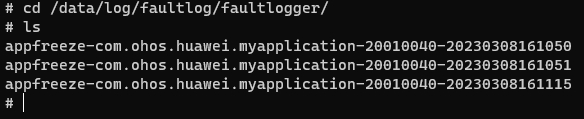
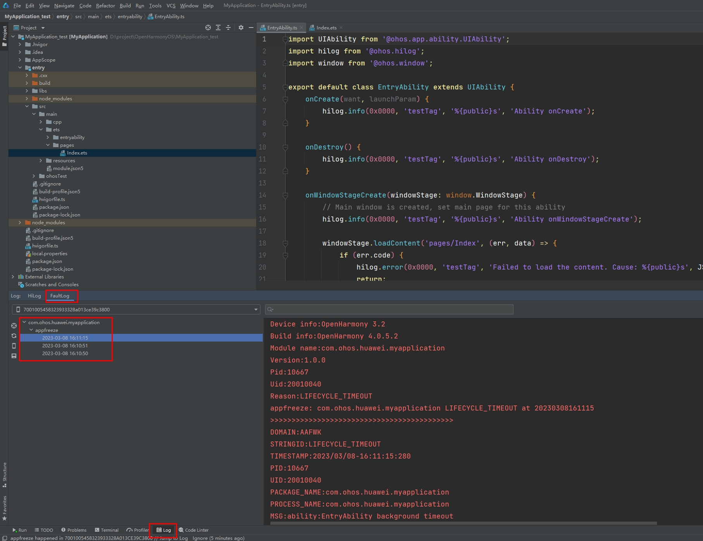
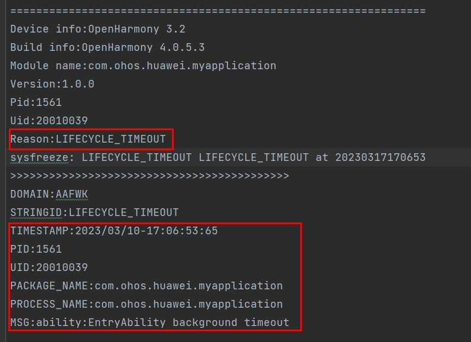
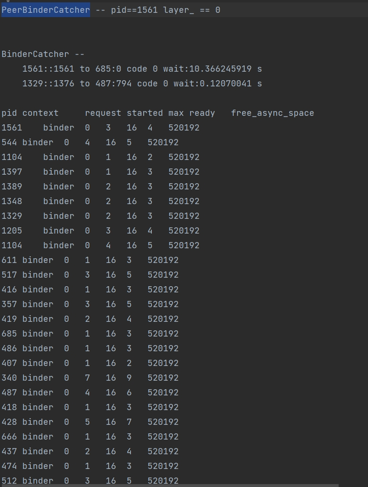
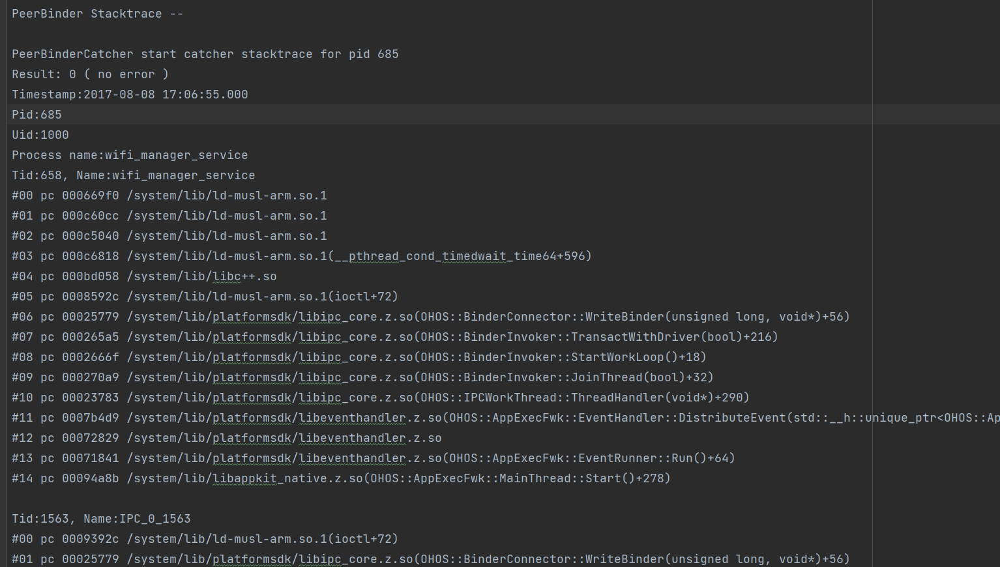
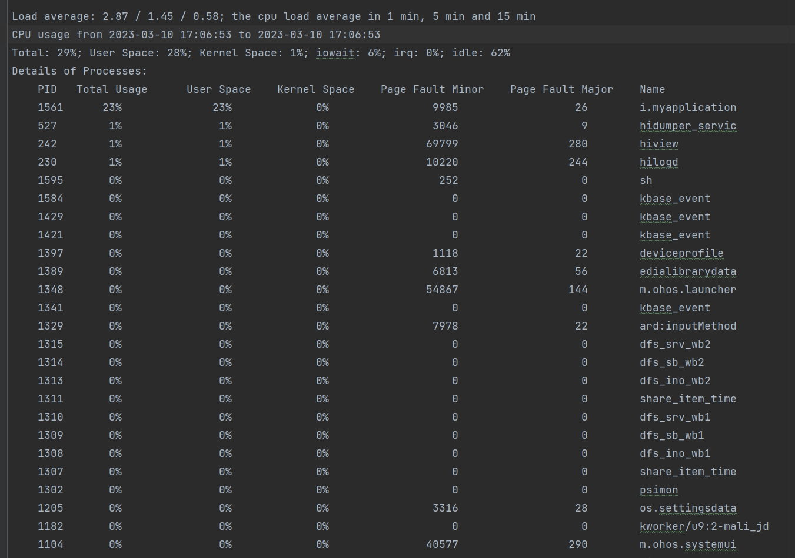
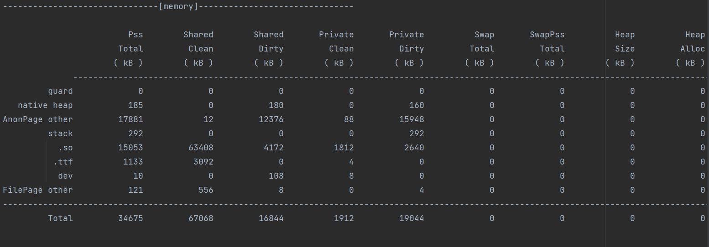
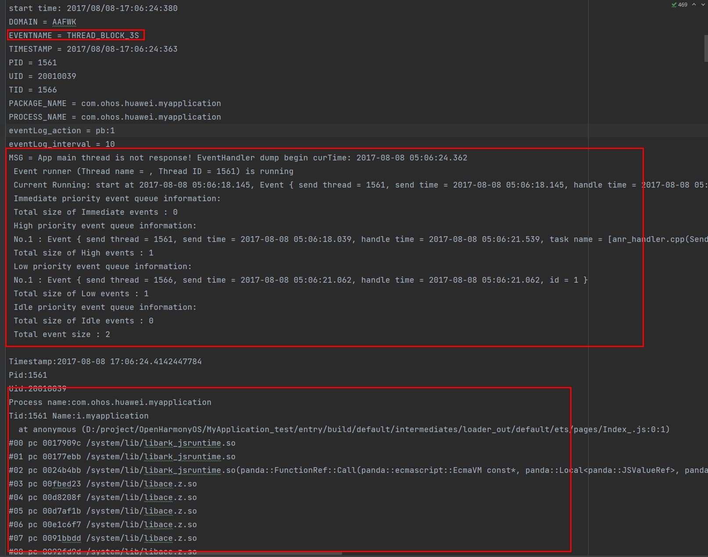
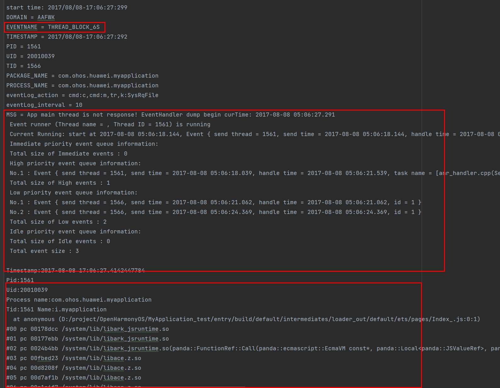
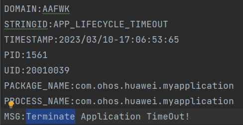

# 应用无响应(appfreeze)日志分析指导

## 简介

应用在用户使用的时候会出现点击没有反应、应用没有响应等情况，其超过一定时间后即被定义为应用无响应(appfreeze)。OpenHarmony提供了检测应用无响应的机制，并生成appfreeze日志供应用开发分析使用。

 **说明1：** 本指导仅适用于Stage模型下的应用使用。

 **说明2：** 在使用本指导分析日志前，需要开发者对JS在OpenHarmony中运行情况、C++程序堆栈信息有相关基础知识，并对应用相关的子系统有一定了解。

## 获取方式

应用无响应日志是一种故障日志，与Native进程崩溃、JS应用崩溃、系统进程异常等都归类到FaultLog下面，可以通过如下三个方式获取日志：

### 通过shell获取日志

在设备/data/log/faultlog/faultlogger/下面，以appfreeze-开头的日志。

日志格文件名格式是appfreeze-应用包名-应用UID-秒级时间

### 通过DevEco Studio获取日志

DevEco Studio会收集设备的故障日志到FaultLog下面：

DevEco Studio会将包名和故障和时间都分类好显示

### 通过faultlogger接口获取

faultlogger对外提供了故障查询接口，可以查询各种故障信息，详见[@ohos.faultLogger (故障日志获取)](../reference/apis/js-apis-faultLogger.md)

## 应用无响应检测能力点

目前应用无响应检测从以下维度检测，应用开发者了解其原理对定位和分析appfreeze故障非常有帮助。

| 故障类型 | 说明 |
| -------- | -------- |
| THREAD_BLOCK_6S | 应用主线程卡死超时 |
| APPLICATION_BLOCK_INPUT | 用户输入响应超时 |
| LIFECYCLE_TIMEOUT | Ability生命周期切换超时 |
| APP_LIFECYCLE_TIMEOUT | App生命周期切换超时 |

### THREAD_BLOCK_6S 应用主线程卡死超时

该故障出现是表示当前应用主线程有卡死或者执行任务过多的情况，影响任务执行的流畅度和体验。

该事件的检测原理是：是应用的watchdog线程定期去向主线程插入判活检测并在自己线程插入超时上报机制，当超过3s判活检测没有被执行会上THREAD_BLOCK_3S警告事件，超过6s依然没有被执行就会上报THREAD_BLOCK_6S主线程卡死事件，两个事件匹配生成THREAD_BLOCK的应用无响应日志。原理如图所示：

### APPLICATION_BLOCK_INPUT 用户输入响应超时

该故障出现会影响了用户体验，用户的点击事件超过10s没有得到响应。

该事件的检测原理是：用户点击应用的某些按钮，输入系统向应用侧发送点击事件，但是超过10s没有收到应用侧的响应反馈回执，上报该故障。如下图所示：

### 生命周期切换超时

生命周期切换超时分为Ability生命周期切换超时和App生命周期切换超时，对应两个不同的日志LIFECYCLE_TIMEOUT和APP_LIFECYCLE_TIMEOUT。

该故障出现在生命周期切换的过程中，影响当前应用内Ability的切换或者不同APP之间的切换。

该事件的检测原理是：通过获取不同生命周期切换的过程，在生命周期切换开始的位置向watchdog线程插入超时任务，在生命周期切换完成之后移除超时任务，超过时间将上报故障。

不同的生命周期，超时的时间不一样：
| 生命周期 | 超时时间 |
| -------- | -------- |
| Load | 10s |
| Terminate | 10s |
| Connect | 3s |
| Disconnect | 0.5s |
| Foreground | 5s |
| Background | 3s |

## 应用无响应日志分析

应用无响应(appfreeze)故障需要结合应用无响应日志和流水hilog日志一起分析。

当前示例仅提供一个分析方法，请开发者根据具体问题具体分析。

应用无响应日志主要分以下几个模块信息：

### 日志头部信息
| 字段 | 说明 |
| -------- | -------- |
| Reason | 应用无响应原因，与[应用无响应检测能力点](#应用无响应检测能力点)对应 |
| PID | 发生故障时候的pid，可以用于在流水日志中搜索相关进程信息 |
| PACKAGE_NAME | 应用进程包名 |

### 日志主干通用信息

全部日志都包括以下几部分信息，可以通过搜索“主要信息字段”在日志中找到对应的位置：
| 主要信息字段 | 说明 |
| -------- | -------- |
| EVENTNAME | 应用无响应原因或者组成卡死检测的不同事件 |
| TIMESTAMP | 发生故障时上报时刻的事件，可以根据[应用无响应检测能力点](#应用无响应检测能力点)中说明的超时时间，在相应流水日志中缩小查看日志的时间范围 |
| PID | 发生故障时候的pid，可以与发生时间和超时时间配合用于在流水日志中搜索相关进程信息 |
| PACKAGE_NAME | 应用进程包名 |
| MSG | 发生故障时dump信息或者说明信息，后面具体说明 |
| OpenStacktraceCatcher | 当前进程堆栈信息 |
| BinderCatcher | 进程与其他系统进程间通信的调用信息，显示调用等待时间长的情况 |
| PeerBinder Stacktrace | 跟当前进程相关的对端进程有卡死，会抓取对端的进程堆栈 |
| cpuusage | 跟当前时间段整机CPU使用情况 |
| memory | 跟当前时间当前进程的内存使用情况 |

OpenStacktraceCatcher当前进程堆栈示例：

示例堆栈表面窗口通过IPC向下发送事件的时候没有调用下去，停留在IPC通信阶段

BinderCatcher信息示例：
示例表面当前1561进程向685进程请求通信，等待了超过10s没有得到响应。

PeerBinder Stacktrace信息示例：

示例展示对端卡死进程685的堆栈信息

cpuusage信息示例：

整机CPU信息

memory信息示例：

当前进程内存信息

### 日志主干特异性信息(应用主线程卡死超时)

Reason是THREAD_BLOCK_6S的日志根据前面的[应用主线程卡死超时](#thread_block_6s-应用主线程卡死超时)的原理可知，有两部分组成，一部分是THREAD_BLOCK_3S，一部分是THREAD_BLOCK_6S。将两部分日志对比分析能更准确的获得是卡死还是执行任务过多响应不过来的情况。

THREAD_BLOCK_3S在日志的前部分，THREAD_BLOCK_6S在THREAD_BLOCK_3S后面写入。可以通过EVENTNAME字段来搜索两个事件在日志中的位置。

两个事件中都包含MSG字段，该字段在应用主线程卡死超时故障中写入了当前主线程处理队列的信息，可以查看在两个时间点中主线程事件处理队列排队情况。

示例日志显示了在Low priority的队列中05:06:18.145的事件一直在处理，THREAD_BLOCK_3S和THREAD_BLOCK_6S的队列都显示其存在。说明主线程卡死不是任务过多情况。

由于THREAD_BLOCK_6S是主线程卡死，进程堆栈信息只需要关注主线程的堆栈(主线程线程号跟进程号相同)。当前示例日志主线程堆栈显示通过ArkUI控件到JS运行，说明卡死在Js代码中。3S和6S都是这个位置的堆栈，说明JS有卡死不是任务过多。
THREAD_BLOCK_3S：

THREAD_BLOCK_6S：

然后再可以结合流水日志看一下当前应用侧是在执行哪块代码。

一般情况下可以看一下上面[通用日志信息](#日志主干通用信息)内容，是不是有对端通信卡死，是不是整机CPU消耗很高导致当前应用响应不过来，是不是有内存泄漏，内存非常多导致任务非常重跑不起来。

### 日志主干特异性信息(用户输入响应超时)

Reason是APPLICATION_BLOCK_INPUT,表明用户点击事件超过10s没有的到反馈。

MSG信息是这个事件的说明：用户的输入没有得到响应。

APPLICATION_BLOCK_INPUT的日志信息可以参考[通用日志信息](#日志主干通用信息)进行分析。需要特别说明的是，一般情况下用户输入无响应大概率主线程也会卡死。可以结合两个日志的三个堆栈、两个BinderCatcher信息，进行对比查看。如果没有主线程卡死的日志，说明有可能在输入事件之前有大量的细碎的其他事件，细碎的事件不足以卡死主线程，但是数量比较多导致用户的输入事件响应不过来。

### 日志主干特异性信息(生命周期切换超时)

Reason分两个一个是LIFECYCLE_TIMEOUT，一个是APP_LIFECYCLE_TIMEOUT。

LIFECYCLE_TIMEOUT是Ability级别的生命周期切换超时，APP_LIFECYCLE_TIMEOUT表示APP级别的生命周期切换超时。

MSG说明当前是什么生命周期的超时。

示例可以看出，LIFECYCLE_TIMEOUT的可以看出Ability在切换后台的时候超时，APP_LIFECYCLE_TIMEOUT的可以看出APP的终止阶段超时，可以按照上面[生命周期切换超时](#生命周期切换超时)的超时时间来找流水日志等信息。

LIFECYCLE_TIMEOUT：

APP_LIFECYCLE_TIMEOUT：

其他的日志信息可以参考[通用日志信息](#日志主干通用信息)进行分析。需要特别说明的是，一般情况下生命周期切换大概率主线程也会卡死。可以结合两个日志的三个堆栈、两个BinderCatcher信息，进行对比查看。

## 相关实例

针对故障日志获取，有以下相关实力可供参考：

- [故障日志获取（ArkTS）（API9）](https://gitee.com/openharmony/applications_app_samples/tree/OpenHarmony-3.2-Release/code/BasicFeature/DFX/FaultLogger)