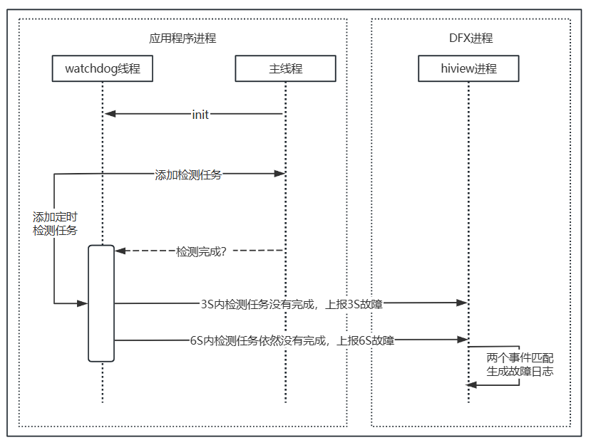
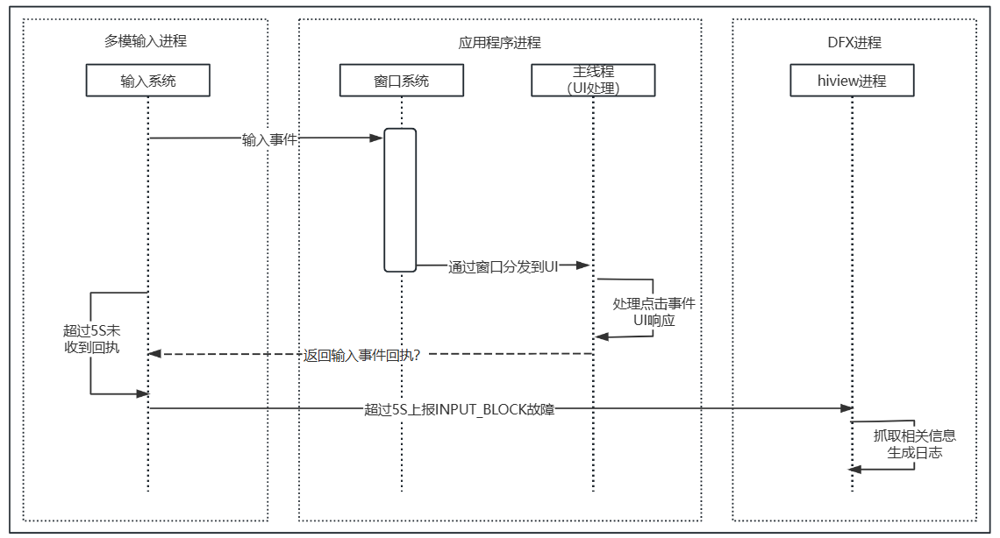

# AppFreeze（应用冻屏）检测

<!--Kit: Performance Analysis Kit-->
<!--Subsystem: HiviewDFX-->
<!--Owner: @rr_cn-->
<!--Designer: @peterhuangyu-->
<!--Tester: @gcw_KuLfPSbe;@lipengpeng97-->
<!--Adviser: @foryourself-->

## 简介

用户在使用应用时，如果出现点击无反应或应用无响应等情况，并且持续时间超过一定限制，就会被定义为应用冻屏（AppFreeze），即应用无响应或卡死。系统会检测应用无响应，并生成AppFreeze日志，供应用开发者分析。

> **说明：**
>
> 本文仅适用于Stage模型下的应用。在根据本文分析日志前，开发者需要具备JS在系统中运行情况、C++程序堆栈信息的相关基础知识，并对应用相关的子系统有一定了解。

## 检测原理

目前应用冻屏检测从以下三个维度检测，了解其原理有助于应用开发者定位和分析AppFreeze故障。

> **注意：**
>
> AppFreeze检测仅对[release版本应用](performance-analysis-kit-terminology.md#release版本应用)生效，对[debug版本应用](performance-analysis-kit-terminology.md#debug版本应用)不生效。

| 故障类型 | 说明 |
| -------- | -------- |
| THREAD_BLOCK_6S | 应用主线程卡死超时 |
| APP_INPUT_BLOCK | 用户输入响应超时 |
| LIFECYCLE_TIMEOUT | Ability生命周期切换超时 |

当应用发生上述故障时，为了保证可恢复，会杀死应用。并上报应用冻屏事件，可通过HiAppEvent订阅[应用冻屏事件](hiappevent-watcher-freeze-events.md)。

### THREAD_BLOCK_6S 应用主线程卡死超时

**概述**：发生该故障，表示当前应用主线程有卡死或者执行任务过多的情况，影响应用的流畅度和体验。

**检测原理**：应用的watchdog线程定期向主线程插入判活检测任务。如果判活检测超过3s未被执行，将上报THREAD_BLOCK_3S告警事件；如果超过6s仍未被执行，将上报THREAD_BLOCK_6S主线程卡死事件。两个事件匹配生成THREAD_BLOCK的应用无响应日志。

检测原理如下图：

**图1**



### APP_INPUT_BLOCK 用户输入响应超时

**概述**：该故障是指点击事件超过5s未得到响应。

**检测原理**：用户点击应用时，输入系统会向应用侧发送点击事件；应用侧的响应反馈回执超时，则上报该故障。

检测原理如下图：

**图2**



### 生命周期切换超时

**概述**：生命周期切换超时分为[UIAbility生命周期](../application-models/uiability-lifecycle.md)切换超时和[PageAbility生命周期](../application-models/pageability-lifecycle.md)切换超时。

该故障发生在生命周期切换过程中，影响应用内Ability的切换或者不同PageAbility之间的切换。

**检测原理**：foundation的AMS服务向应用进程发送生命周期切换指令，随后等待应用返回结果，固定时间内未成功移除任务将上报故障。

生命周期切换超时由LIFECYCLE_HALF_TIMEOUT和LIFECYCLE_TIMEOUT两个事件组合而成。LIFECYCLE_HALF_TIMEOUT作为LIFECYCLE_TIMEOUT的告警事件，抓取binder等信息。

**图3**


不同的生命周期超时，对应的超时时间各不相同。具体如下表所示：

| 生命周期 | 超时时间 |
| -------- | -------- |
| Load | 10s |
| Foreground | 5s |

## 日志获取

应用冻屏日志和进程崩溃日志一致，都是由Faultlogger模块进行管理，可通过以下方式获取：

**方式一：通过DevEco Studio获取日志**

DevEco Studio会收集设备/data/log/faultlog/faultlogger/路径下的进程崩溃故障日志到FaultLog下，根据进程名和故障时间分类显示。获取日志的方法参见：[DevEco Studio使用指南-FaultLog](https://developer.huawei.com/consumer/cn/doc/harmonyos-guides/ide-fault-log)。

**方式二：通过HiAppEvent接口订阅**

HiAppEvent给开发者提供了故障订阅接口，详见[HiAppEvent介绍](hiappevent-intro.md)。参考[订阅应用冻屏事件（ArkTS）](hiappevent-watcher-freeze-events-arkts.md)或[订阅应用冻屏事件（C/C++）](hiappevent-watcher-freeze-events-ndk.md)完成应用冻屏事件订阅，并通过事件的[external_log](hiappevent-watcher-freeze-events.md#事件字段说明)字段读取故障日志文件内容。

**方式三：通过hdc获取日志，需打开开发者选项**

在开发者选项打开的情况下，开发者可以通过hdc file recv /data/log/faultlog/faultlogger D:\命令导出故障日志到本地，故障日志文件名格式为appfreeze-进程名-进程UID-毫秒级时间.log。

## 日志规格

应用冻屏（AppFreeze）问题需要结合应用冻屏日志和hilog流水日志进行分析。

当前提供一个故障分析示例，请开发者根据具体问题具体分析。

应用冻屏日志主要分以下几个模块信息：

### 日志头部信息

```
Generated by HiviewDFX@OpenHarmony
================================================================
Device info:HUAWEI Mate 60 Pro
Build info:ALN-AL00 6.0.0.328(C00E1R4P3DEVDUlog)
Fingerprint:e18a33c12e1361173ec9ac1c93f2bd0c2daa88f03c7f76b228cca14bdc6a21b1
Module name:com.samples.freezedebug
Version:1.0.0
VersionCode:1000000
PreInstalled:No
Foreground:Yes
Pid:13680
Uid:20020177
Reason:THREAD_BLOCK_6S
appfreeze: com.samples.freezedebug THREAD_BLOCK_6S at 20250628140837
DisplayPowerInfo:powerState:UNKNOWN
HitraceIdInfo: hitrace_id: a92ab27238f409a, span_id: 1cd61c9, parent_span_id: 3072e, trace_flag: 0
Page switch history:
  14:08:30:327 /ets/pages/Index:Appfreeze
  14:08:28:986 /ets/pages/Index
  14:08:26:502 :enters foreground
  14:08:07:606 :leaves foreground
  14:08:06:246 /ets/pages/Index:Appfreeze
  14:08:01:955 :enters foreground
>>>>>>>>>>>>>>>>>>>>>>>>>>>>>>>>>>>>>>>>>>>
DOMAIN:AAFWK
STRINGID:THREAD_BLOCK_6S
TIMESTAMP:2025/06/28-14:08:37:360
PID:13680
UID:20020177
PACKAGE_NAME:com.samples.freezedebug
PROCESS_NAME:com.samples.freezedebug
NOTE: Current fault may be caused by the system's low memory or thermal throttling, you may ignore it and analysis other faults.
***
```

从API version 20开始，当整机资源告警（如整机低内存或热限频）时，会输出NOTE行。出现此行时，开发者可以忽略应用冻屏故障。在之前的API版本中，无论整机资源状态如何，均无此行输出。

从API verrsion 20开始，发生THREAD_BLOCK_6S故障时，日志中新增[HiTraceId](../reference/apis-performance-analysis-kit/js-apis-hitracechain.md#hitraceid)信息打印。HitraceId是HiTraceChain提供的唯一跟踪标识，用于跟踪业务流程调用链。可以协助开发者查看故障时间段内，故障流程的hilog日志，分析日志查看应用的执行状态。

三种AppFreeze事件都包含以下几部分信息，具体解释如下：

| 字段 | 说明 |
| -------- | -------- |
| Reason | 应用无响应原因，与应用无响应检测能力点对应。 |
| PID | 发生故障时的pid。 |
| PACKAGE_NAME | 应用进程包名。 |
|[Page switch history](./cppcrash-guidelines.md#有页面切换轨迹的故障场景日志规格)| 从API 20开始，维测进程会记录应用切换历史。应用发生故障后，生成的故障文件将包含页面切换历史轨迹。如果维测服务进程出现故障或未缓存切换轨迹，则不包含此字段。|

### 日志主干通用信息

```
start time: 2025/06/28-14:08:34:318
DOMAIN = AAFWK
EVENTNAME = THREAD_BLOCK_3S
TIMESTAMP = 2025/06/28-14:08:34:310
PID = 13680
UID = 20020177
TID = 13680
PACKAGE_NAME = com.samples.freezedebug
PROCESS_NAME = com.samples.freezedebug
eventLog_action = ffrt,t,GpuStack,cmd:m,hot
eventLog_interval = 10
MSG =
Fault time:2025/06/28-14:08:34
App main thread is not response!
Main handler dump start time: 2025-06-28 14:08:34.067
mainHandler dump is:
 EventHandler dump begin curTime: 2025-06-28 14:08:34.067
 Event runner (Thread name = , Thread ID = 13680) is running
 Current Running: start at 2025-06-28 14:08:27.354, Event { send thread = 13680, send time = 2025-06-28 14:08:22.353, handle time = 2025-06-28 14:08:27.353, trigger time = 2025-06-28 14:08:27.354, task name = uv_timer_task, caller = [ohos_loop_handler.cpp(OnTriggered:72)] }
 History event queue information:
 No. 0 : Event { send thread = 13856, send time = 2025-06-28 14:08:22.336, handle time = 2025-06-28 14:08:22.336, trigger time = 2025-06-28 14:08:22.336, completeTime time = 2025-06-28 14:08:22.337, priority = VIP, task name = MMITask, caller = [deamon_io_waiter.cpp(HandleFileDescriptorEvent:225)] }
...
 No. 31 : Event { send thread = 13856, send time = 2025-06-28 14:08:22.330, handle time = 2025-06-28 14:08:22.380, trigger time = 2025-06-28 14:08:22.330, completeTime time = 2025-06-28 14:08:22.331, priority = VIP, task name = vSyncTask, caller = [deamon_io_waiter.cpp(PostTaskForVsync:159)] }
 VIP priority event queue information:
 No.1 : Event { send thread = 13843, send time = 2025-06-28 14:08:31.066, handle time = 2025-06-28 14:08:31.066, id = 1, caller = [watchdog.cpp(Timer:233)] }
 No.2 : Event { send thread = 13843, send time = 2025-06-28 14:08:34.067, handle time = 2025-06-28 14:08:34.067, id = 1, caller = [watchdog.cpp(Timer:233)] }
 Total size of VIP events : 2
 Immediate priority event queue information:
 Total size of Immediate events : 0
 High priority event queue information:
 Total size of High events : 0
 Low priority event queue information:
 Total size of Low events : 0
 Idle priority event queue information:
 Total size of Idle events : 0
 Total event size : 2
```

三种AppFreeze事件都包含以下几部分信息，具体解释如下：

| 主要信息字段 | 说明 |
| -------- | -------- |
| EVENTNAME | 组成卡死检测事件。 |
| TIMESTAMP | 发生故障时上报事件的时刻，可以根据应用无响应检测能力点中说明的超时时间，在相应hilog流水日志中缩小查看日志的时间范围。 |
| PID | 发生故障时候的pid。 |
| UID | 故障进程UID。 |
| TID | 发生故障时候的tid。 |
| PACKAGE_NAME | 应用进程包名。 |
| PROCESS_NAME | 应用进程名。 |
| MSG | 发生故障时间及EventHandler信息。 |
| task name | 任务队列中的任务名。 |
| trigger time | 任务执行时间。 |
| completeTime time | 任务执行完成时间（如果没有打印则表示该任务未执行完成）。 |

### 堆栈信息

显示故障进程堆栈信息。

```
Tid:13680, Name:les.freezedebug
#00 pc 000000000000186c [shmm](__kernel_gettimeofday+72)
#01 pc 00000000001d887c /system/lib/ld-musl-aarch64.so.1(gettimeofday+40)(f1a940981720250b920ee26d2d76af5b)
#02 pc 000000000058fb5c /system/lib64/platformsdk/libark_jsruntime.so(panda::ecmascript::builtins::BuiltinsDate::Now(panda::ecmascript::EcmaRuntimeCallInfo*)+48)(0f1928b77d36d27edb5512bd89806a6f)
#03 pc 0000000000cff5dc /system/lib64/module/arkcompiler/stub.an(RTStub_PushCallArgsAndDispatchNative+40)
#04 pc 000000000036aaf4 /system/lib64/module/arkcompiler/stub.an(BCStub_HandleCallthis0Imm8V8StwCopy+380)
#05 at wait15s (entry/src/main/ets/pages/Index.ets:16:10)
#06 pc 000000000026b1dc /system/lib64/platformsdk/libark_jsruntime.so(panda::ecmascript::InterpreterAssembly::Execute(panda::ecmascript::EcmaRuntimeCallInfo*)+536)(0f1928b77d36d27edb5512bd89806a6f)
#07 pc 000000000096b188 /system/lib64/platformsdk/libark_jsruntime.so(panda::FunctionRef::CallForNapi(panda::ecmascript::EcmaVM const*, panda::JSValueRef*, panda::JSValueRef* const*, int)+1432)(0f1928b77d36d27edb5512bd89806a6f)
#08 pc 000000000006b7a4 /system/lib64/platformsdk/libace_napi.z.so(napi_call_function+212)(eaa639519e67e8495ca596293a0d33cd)
#09 pc 000000000000b17c /system/lib64/platformsdk/libtimer.z.so(OHOS::JsSysModule::Timer::TimerCallback(uv_timer_s*) (.cfi)+528)(764291289e89523cdbe9c3c78c1cca35)
#10 pc 0000000000013ea8 /system/lib64/platformsdk/libuv.so(uv__run_timers+68)(9e7eb59ca1a45f4230b641a7c940a20b)
#11 pc 000000000001a344 /system/lib64/platformsdk/libuv.so(uv_run+376)(9e7eb59ca1a45f4230b641a7c940a20b)
#12 pc 00000000000895a8 /system/lib64/platformsdk/libruntime.z.so(OHOS::AbilityRuntime::OHOSLoopHandler::OnTriggered()+140)(daf29e377c47e3e26282e745dd1b3488)
#13 pc 0000000000089b4c /system/lib64/platformsdk/libruntime.z.so(std::__h::__function::__func<OHOS::AbilityRuntime::OHOSLoopHandler::OnTriggered()::$_0, std::__h::allocator<OHOS::AbilityRuntime::OHOSLoopHandler::OnTriggered()::$_0>, void ()>::operator()() (.9efded9864dc55830f61b3b92d59beab)+52)(daf29e377c47e3e26282e745dd1b3488)
#14 pc 000000000001ff6c /system/lib64/chipset-sdk-sp/libeventhandler.z.so(OHOS::AppExecFwk::(anonymous namespace)::EventRunnerImpl::ExecuteEventHandler(std::__h::unique_ptr<OHOS::AppExecFwk::InnerEvent, void (*)(OHOS::AppExecFwk::InnerEvent*)>&)+2228)(475713336c2720d372d5aeb99dda5f9f)
#15 pc 000000000001a7d8 /system/lib64/chipset-sdk-sp/libeventhandler.z.so(OHOS::AppExecFwk::(anonymous namespace)::EventRunnerImpl::Run()+648)(475713336c2720d372d5aeb99dda5f9f)
#16 pc 000000000003f5f4 /system/lib64/chipset-sdk-sp/libeventhandler.z.so(OHOS::AppExecFwk::EventRunner::Run()+404)(475713336c2720d372d5aeb99dda5f9f)
#17 pc 00000000000a50f0 /system/lib64/platformsdk/libappkit_native.z.so(OHOS::AppExecFwk::MainThread::Start()+504)(e794b687fdf46631ae5144eba250f8c0)
#18 pc 0000000000005278 /system/lib64/appspawn/appspawn/libappspawn_ace.z.so(RunChildProcessor(AppSpawnContent*, AppSpawnClient*)+568)(143c05087e9460f0fd794b9dce5dec29)
#19 pc 000000000000baa8 /system/bin/appspawn(AppSpawnChild+648)(25ab88f6e04b1d2c8feb5d3eebfb4664)
#20 pc 0000000000016478 /system/bin/appspawn(ProcessSpawnReqMsg+3260)(25ab88f6e04b1d2c8feb5d3eebfb4664)
#21 pc 0000000000013aac /system/bin/appspawn(OnReceiveRequest+724)(25ab88f6e04b1d2c8feb5d3eebfb4664)
#22 pc 0000000000017844 /system/lib64/chipset-sdk-sp/libbegetutil.z.so(HandleRecvMsg_+384)(a9ddb8b84cc09183cc6bd2e5bb875f30)
#23 pc 000000000001715c /system/lib64/chipset-sdk-sp/libbegetutil.z.so(HandleStreamEvent_+152)(a9ddb8b84cc09183cc6bd2e5bb875f30)
#24 pc 000000000001444c /system/lib64/chipset-sdk-sp/libbegetutil.z.so(ProcessEvent+380)(a9ddb8b84cc09183cc6bd2e5bb875f30)
#25 pc 0000000000013edc /system/lib64/chipset-sdk-sp/libbegetutil.z.so(RunLoop_.llvm.16927440879641410339+656)(a9ddb8b84cc09183cc6bd2e5bb875f30)
#26 pc 0000000000010dcc /system/bin/appspawn(AppSpawnRun+212)(25ab88f6e04b1d2c8feb5d3eebfb4664)
#27 pc 000000000000eb90 /system/bin/appspawn(main+728)(25ab88f6e04b1d2c8feb5d3eebfb4664)
#28 pc 00000000000a9804 /system/lib/ld-musl-aarch64.so.1(libc_start_main_stage2+84)(f1a940981720250b920ee26d2d76af5b)
```

大部分情况下，THREAD_BLOCK_6S、LIFECYCLE_TIMEOUT以及APP_INPUT_BLOCK故障的堆栈信息，可以协助开发者定位到异常代码。

其他情况下（比如瞬时栈场景），由于主线程繁忙等问题，导致获取堆栈信息延迟，无法及时捕获到异常代码段，堆栈的栈顶信息并非开发者期望获取的结果。

为解决上述问题，从API version 21开始，支持获取AppFreeze的增强日志。协助开发者定位问题，详见[AppFreeze（应用冻屏）增强日志实现原理](#实现原理)。

> **说明：**
>
> 在整机高负载情况（如CPU高负载）下，采用低开销方式获取调用栈时，可能损失函数名信息。
>
> 从API version 21开始，出现'Failed to dump normal stacktrace'字样时，系统采取轻量化的frame pointer回溯模式。栈回溯可能中断在非使能frame pointer的库（在GCC编译使用 -fomit-frame-pointer 选项时，编译产物会非使能frame pointer），以及受轻量化的限制，单个线程的回栈层数不会超过50层。

### 对端信息（与当前故障进程通信的进程信息）

（1）BinderCatcher：显示进程间通信的调用信息及等待时间过长的情况。

```
PeerBinderCatcher -- pid==13680
BinderCatcher --
    13840:14102 to 901:4079 code 16 wait:0.25653125 s frz_state:3,  ns:-1:-1 to -1:-1, debug:13840:14102 to 901:4079, active_code:0, active_thread=0, pending_async_proc=0
    3712:3712 to 13967:14076 code d2 wait:0.703385417 s frz_state:3,  ns:-1:-1 to -1:-1, debug:3712:3712 to 13967:14076, active_code:0, active_thread=0, pending_async_proc=0
    1733:2285 to 3712:3712 code b wait:1.365925521 s frz_state:3,  ns:-1:-1 to -1:-1, debug:1733:2285 to 3712:3712, active_code:0, active_thread=0, pending_async_proc=0
...
pid context     request started max ready   free_async_space
14072   binder  0   2   16  3   520192
14103   binder  0   4   16  6   520192
13967   binder  0   3   16  3   520192
13878   binder  0   2   16  3   520192
13840   binder  0   2   16  3   520192
13863   binder  0   1   16  3   520192
13680   binder  0   2   16  3   520192
13770   binder  0   3   16  5   520192
13749   binder  0   3   16  5   520192
...

```

进程间通信调用信息解释如下：

| | |
| -------- | -------- |
| xxx:xxx to xxx:xxx | 客户端进程号、线程号 to 服务端进程号、线程号。其中async表示异步，无async表示同步。 |
| code | 客户端和服务端达成一致约束的业务码。 |
| wait | 通信等待时长。 |
| frz_state | 进程冻结状态。<br/>-1 未知<br/>1 默认<br/>2 正在向用户态发送binder状态信息<br/>3 走到了binder接收线程。 |
| ns | 客户端进程号、线程号 to 服务端进程号、线程号（非卓易通内进程显示-1）。 |
| debug | IPC通信双方的信息补充。 |
| active_code | 正在处理的异步消息code。 |
| active_thread | 处理这个异步消息的线程。 |
| pending_async_proc | 被这个异步消息阻塞的进程。 |
| pid | 进程PID。 |
| context | 通信方式。 |
| request | 请求申请的IPC线程数量。 |
| started | 已经申请启动的IPC线程数量。 |
| max | 可以申请的最大IPC线程数量。 |
| ready | 空闲IPC线程。 |
| free_async_space | 空闲异步空间，用于观测异步信息阻塞。 |

（2）PeerBinder Stacktrace：故障进程相关的对端进程有卡死，会抓取对端的进程堆栈，即与当前进程通信的进程堆栈

```
Tid:48841, Name:xxx
#00 pc 000000000016adf4 /system/lib/ld-musl-aarch64.so.1
#01 pc 000000000001c0d4 /system/lib64/chipset-sdk-sp/libeventhandler.z.so
#02 pc 000000000001a7f4 /system/lib64/chipset-sdk-sp/libeventhandler.z.so
#03 pc 000000000003f5f4 /system/lib64/chipset-sdk-sp/libeventhandler.z.so
#04 pc 00000000000a50f0 /system/lib64/platformsdk/libappkit_native.z.so
#05 pc 0000000000005278 /system/lib64/appspawn/appspawn/libappspawn_ace.z.so
#06 pc 000000000000baa8 /system/bin/appspawn
#07 pc 0000000000016478 /system/bin/appspawn
#08 pc 0000000000013aac /system/bin/appspawn
#09 pc 0000000000017844 /system/lib64/chipset-sdk-sp/libbegetutil.z.so
#10 pc 000000000001715c /system/lib64/chipset-sdk-sp/libbegetutil.z.so
#11 pc 000000000001444c /system/lib64/chipset-sdk-sp/libbegetutil.z.so
#12 pc 0000000000013edc /system/lib64/chipset-sdk-sp/libbegetutil.z.so
#13 pc 0000000000010dcc /system/bin/appspawn
#14 pc 000000000000eb90 /system/bin/appspawn
#15 pc 00000000000a9804 /system/lib/ld-musl-aarch64.so.1
#16 pc 000000000000b754 /system/bin/appspawn
```

### CPU信息

整机CPU信息及解释如下：

```
Load average: 14.3 / 12.9 / 11.4; the cpu load average in 1 min, 5 min and 15 min
CPU usage from 2025-06-28 14:08:36 to 2025-06-28 14:08:37
Total: 22.45%; User Space: 13.64%; Kernel Space: 8.81%; iowait: 0.33%; irq: 0.07%; idle: 77.15%
Details of Processes:
    PID   Total Usage      User Space    Kernel Space    Page Fault Minor    Page Fault Major    Name
    13680      8.86%           8.31%          0.55%            4711                6637            com.samples.freezedebug
    644        2.55%           1.40%          1.15%          210104                7391            hiview
    600        0.89%           0.78%          0.10%           60192                 514            hilogd
    1685       0.53%           0.31%          0.22%          879838               59636            foundation
```

| | |
| -------- | -------- |
| PID | 进程PID。 |
| Total Usage | CPU使用率，Total Usage = User Space+Kernel Space。 |
| User Space | 用户态使用率。 |
| Kernel Space | 内核态使用率。 |
| Page Fault Minor | 次要缺页错误。 |
| Page Fault Major | 主要缺页错误。 |
| Name | 进程名。 |

### 内存信息

```
Get freeze memory start time: 2025-06-28 14:08:37.112
some avg10=56.81 avg60=56.81 avg300=56.81 total=56
full avg10=56.81 avg60=56.81 avg300=56.81 total=56
...
ReclaimAvailBuffer:                    4676608 kB
...
```

整机内存信息如上所示，其中ReclaimAvailBuffer为整机剩余可用内存，主要用于确认是否是低内存问题。

## 日志差异性信息

生命周期超时事件

```
DOMAIN:AAFWK
STRINGID:LIFECYCLE_TIMEOUT
TIMEOUT TIMESTAMP:2025/02/10-21:40:59:113
PID:1561
UID:20010039
PACKAGE_NAME:com.example.myapplication
PROCESS_NAME:com.example.myapplication
MSG:ability:EntryAbility background timeout
server actions for ability:
2025-02-10 21:40:56.376; AbilityRecord::ProcessForegroundAbility; the ProcessForegroundAbility lifecycle starts.
2025-02-10 21:40:56.377; ServiceInner::UpdateAbilityState
server actions for app:
2025-02-10 21:40:56.397; AppRunningRecord::OnWindowVisibilityChanged
2025-02-10 21:40:56.851; AppRunningRecord::OnWindowVisibilityChanged
2025-02-10 21:40:58.668; AppRunningRecord::OnWindowVisibilityChanged
client actions for ability:
2025-02-10 21:40:56.378; AbilityThread::ScheduleAbilityTransaction
2025-02-10 21:40:56.378; AbilityThread::HandleAbilityTransaction
2025-02-10 21:40:56.382; JsUIAbility::OnStart begin
2025-02-10 21:40:56.382; JsUIAbility::OnStart end
2025-02-10 21:40:56.387; JsUIAbility::OnSceneCreated begin
2025-02-10 21:40:56.388; JsUIAbility::OnSceneCreated end
2025-02-10 21:40:56.388; JsUIAbility::WindowScene::GoForeground begin
2025-02-10 21:40:56.389; UIAbilityImpl::WindowLifeCycleImpl::AfterForeground
2025-02-10 21:40:56.390; JsUIAbility::OnForeground begin
client actions for app:
```

下面用两个完整生命周期切换示例来解释MSG中的信息。

（1）load 阶段事件（应用进程未创建举例）

| | | |
| -------- | -------- | -------- |
| server | client | 描述 |
| AbilityRecord::LoadAbility; the LoadAbility lifecycle starts. |- | 开始。 |
| AppMgrServiceInner::LoadAbility | -| 创建进程前。 |
| AppMgrService::AttachApplication | -| 进程创建成功，进程attach。 |
| ServiceInner::AttachApplication | -| 进程attach。 |
| ServiceInner::LaunchApplication | -| 调度应用执行加载流程。 |
| AppRunningRecord::LaunchApplication | -| 调度应用执行加载流程。 |
| AppScheduler::ScheduleLaunchApplication | -| 调度应用执行加载流程。 |
| -| ScheduleLaunchApplication | 应用收到加载调度请求。 |
| -| HandleLaunchApplication begin | 应用加载开始。 |
| -| HandleLaunchApplication end | 应用加载结束。 |
| AppRunningRecord::LaunchPendingAbilities | -| 调度应用启动ability。 |
| -| MainThread::ScheduleLaunchAbility | 应用收到请求加载ability。 |
| -| MainThread::HandleLaunchAbility | 主线程处理。 |
| -| JsAbilityStage::Create | 加载abilityStage。 |
| -| JsAbilityStage::OnCreate begin | abilityStage onCreate生命周期开始。 |
| -| JsAbilityStage::OnCreate end | abilityStage onCreate生命周期结束。 |
| -| AbilityThread::Attach | ability attach到ams，load过程结束。 |

（2）foreground 阶段事件，冷启动

| | | |
| -------- | -------- | -------- |
| server | client | 描述 |
| AbilityRecord::ProcessForegroundAbility; the ProcessForegroundAbility lifecycle starts. |  | 开始。 |
| ServiceInner::UpdateAbilityState | -| 先调度应用前台。 |
| AppRunningRecord::ScheduleForegroundRunning | -| 调度应用前台。 |
| AppScheduler::ScheduleForegroundApplication | -| 调度应用前台。 |
| -| ScheduleForegroundApplication | 应用收到调度。 |
| -| HandleForegroundApplication | 主线程执行调度。 |
| AppMgrService::AppForegrounded | -| 应用前台完成。 |
| ServiceInner::AppForegrounded | -| 应用前台完成。 |
| -| AbilityThread::ScheduleAbilityTransaction | 应用收到ability前台调度。 |
| -| AbilityThread::HandleAbilityTransaction | 主线程执行ability前台调度。 |
| -| JsUIAbility::OnStart begin | onCreate生命周期开始。 |
| -| JsUIAbility::OnStart end | onCreate生命周期结束。 |
| -| JsUIAbility::OnSceneCreated begin | 创建窗口scene开始。 |
| -| JsUIAbility::OnSceneCreated end | 创建窗口scene结束。 |
| -| JsUIAbility::OnWillForeground begin | -|
| -| JsUIAbility::OnWillForeground end |- |
| -| JsUIAbility::WindowScene::GoForeground begin | 调用窗口接口执行 goForeground。 |
| -| UIAbilityImpl::WindowLifeCycleImpl::AfterForeground | 窗口迁台后回调。 |
| -| JsUIAbility::OnForeground begin | onForeground生命周期开始。 |
| -| JsUIAbility::OnForeground end | onForeground生命周期结束。 |
| -|  | 当窗口回调和onForeground都完成后，前台生命周期结束。 |

参考[日志规格](#日志规格)分析其他日志信息。特别说明：大多数情况下，生命周期切换时主线程会卡死。可以结合两个日志的堆栈和BinderCatcher信息对比查看。

## AppFreeze（应用冻屏）增强日志信息

从API version 21开始，支持获取AppFreeze的增强日志。该日志通过采集整机及主线程的运行负载，并抓取多份主线程调用栈，帮助开发者更精准地分析问题根源。相比原有日志，AppFreeze的增强日志主要解决了以下两个不足：

1. 难以定位故障期间的主线程热点。

2. 缺乏对主线程繁忙或阻塞的资源层面分析。

### 实现原理

生成AppFreeze增强日志的流程分为以下两个阶段，具体如下：

1. 应用进程在运行时发生THREAD_BLOCK_3S或LIFECYCLE_HALF_TIMEOUT时，会开启采集主线程调用栈流程，记录当前时刻的一些CPU信息。

2. 应用进程在运行时发生THREAD_BLOCK_6S、LIFECYCLE_TIMEOUT或APP_INPUT_BLOCK时，会停止上述流程的采集主线程调用栈流程，并计算周期内的CPU信息。一般情况下，会抓取1~10次堆栈日志。

   > **说明：**
   >
   > 由于应用冻屏事件的采样栈会与[MAIN_THREAD_JANK](hiappevent-watcher-mainthreadjank-events.md)冲突，如果应用接入MAIN_THREAD_JANK的setEventConfig接口自定义配置采集堆栈的个数，应用冻屏事件的采集堆栈的会与应用当前配置的采集堆栈的个数一致。
   >
   > APP_INPUT_BLOCK故障有增强日志的前提是：先发生THREAD_BLOCK_3S或LIFECYCLE_HALF_TIMEOUT。

### 日志获取

开发者可通过以下方式获取Appfreeze增强日志路径：

**方式一：通过HiAppEvent接口订阅**

应用需要在AppScope/app.json5文件中配置如下环境变量：

   ```text
   "appEnvironments": [
     {
       "name": "DFX_APPFREEZE_LOG_OPTIONS",
       "value": "mainthread_sampling:enable"
     }
   ]
   ```

HiAppEvent给开发者提供了故障订阅接口，开发者可以使用HiAppEvent监听应用冻屏事件，获取文件内容，详见[应用冻屏事件介绍](hiappevent-watcher-freeze-events.md)。参考[订阅应用冻屏事件（ArkTS）](hiappevent-watcher-freeze-events-arkts.md)或[订阅应用冻屏事件（C/C++）](hiappevent-watcher-freeze-events-ndk.md)完成应用冻屏事件订阅。

开发者可以通过事件的[external_log](hiappevent-watcher-freeze-events.md#事件字段说明)字段读取应用冻屏事件生成的故障文件和应用冻屏事件的增强日志文件。增强日志文件的命名与应用冻屏事件生成的故障文件名称格式相同。

external_log是字符串数组，第一个元素为应用冻屏事件生成的故障文件路径；第二个元素为应用冻屏事件生成的增强日志文件路径。

**方式二：通过hdc获取日志，需打开开发者选项**

在开发者选项打开的情况下，开发者可以通过“hdc file recv /data/log/faultlog/freeze_ext D:\”命令导出故障日志到本地，故障日志文件名格式为：freeze-cpuinfo-ext-进程名-进程UID-毫秒级时间。

### 日志规格

增强日志的信息头字段如下：
|字段|描述|起始API版本|
|---|---|---|
| TimeStamp | 日志生成时间。 | 21 |
| Module name | 故障模块名。 | 21 |

增强日志的CPU总体耗时信息字段如下：
|字段|描述|起始API版本|
|---|---|---|
| ProcessCpuTime | 统计周期内，进程运行时间。 | 21 |
| DeviceRuntime | 统计周期内，设备所有CPU的运行时间。 | 21 |
| Tid | 线程号。 | 21 |
| StartTime | 统计开始时间。 | 21 |
| EndTime | 统计结束时间。 | 21 |
| StaticsDuration | 统计持续时间。 | 21 |
| CpuTime | 统计周期内，主线程运行时间。 | 21 |
| SyncWaitTime | 主线程等待时间。 | 21 |
| OptimalCpuTime | 统计周期内，主线程最优负载运行时间（使用最大核的最高算力运行）。 | 21 |
| SupplyAvailableTime | 调度可优化时间。如果值较小，说明主线程繁忙，需要开发者考虑优化主线程的任务。 | 21 |

增强日志的堆栈信息字段如下：
|字段|描述|起始API版本|
|---|---|---|
| SnapshotTime | 本次抓取主线程堆栈的时间。 | 21 |
| ThreadInfos Tid | 线程号。 | 21 |
| Name | 线程名。 | 21 |
| Stack | 主线程调用栈。 | 21 |

### 增强日志规格

本节主要介绍增强日志的一般日志规格，以下是一份Appfreeze增强日志的核心内容。

```text
Generated by HiviewDFX @OpenHarmony
===============================================================
TimeStamp: 2021-01-01 20:06:01.175  <- 日志生成时间
Module name: com.example.freeze   <- 模块名

#Basic Concepts   <- CPU时间注释
T1:  StaticsDuration, EndTime - StartTime.
T2:  CpuTime              --Time that spend on CPU.
T3:  SyncWaitTime         --SleepingTime + Runnable Time, etc.
T4:  OptimalCpuTime       --run the thread at the max Core's max cpu capacity.
T5:  SupplyAvailableTime  --T2 - T3. Time can be optimized by scheduling.
Equation:  T1 = T2 + T3. T2 = T4 = T5.
|-----------------------------------StaticsDuration-----------------------------------|.
|-------------------------CpuTime----------------------|--------SyncWaitTime----------|.
|----OptimalCpuTime----|------SupplyAvailableTime------|--------SyncWaitTime----------|.

#Basic Statistical Infomation  <- CPU基本统计信息
ProcessCpuTime: 0 ms  <- 统计周期内，进程运行时间
DeviceRuntime: 0 ms  <- 统计周期内，设备所有CPU的运行时间
Tid: 2320  <- 故障主线程号
StartTime: 2021-01-01 20:05:58:177  <- 统计开始时间
EndTime: 2021-01-01 20:06:01:172  <- 统计结束时间
StaticsDuration: 2995 ms  <- 统计持续时间
CpuTime: 0 ms  <- 统计周期内，主线程运行时间
SyncWaitTime: 2995 ms  <- 主线程等待时间
OptimalCpuTime: 0 ms  <- 统计周期内，主线程最优负载运行时间（使用最大核的最高算力运行）
SupplyAvailableTime: 0 ms  <- 调度可优化时间

#CpuFreq Usage (usage >=1%)  <- 当CPU单个频点使用率>=1%时，这些频点及频点的使用率就会被列出来。
start time: 2021-01-01 20:06:00:888  <- 计算CPU使用率开始时间
cpu0 Usage 23.5%, 1430MHZ 21.04%  <- cpu0的总使用率，cpu0单个频点的使用率（在1430MHZ频点下的使用率）
cpu1 Usage 23.5%, 1430MHZ 21.04%
cpu2 Usage 23.5%, 1430MHZ 21.04%
cpu3 Usage 23.5%, 1430MHZ 21.04%
.......
end time: 2021-01-01 20:06:00:888  <- 计算CPU使用率结束时间
#ThreadInfos Tid: 2204, Name: com.example.freeze  <- 故障线程号，线程名
SnapshotTime: 2021-01-01-20-05-58.292875  <- 获取主线程的时间
#00 pc 002d0bf9 /system/lib/platformsdk/libark_jsruntime.so(panda::ecmascript::EcmaInterpreter::RunInternal(panda::ecmascript::JSThread*, unsigned char const*, unsigned long long*)+87512)(8b74cdc906ea6b2eba95d891bc91c72a)
#01 at wait50s (entry|entry|1.0.0|src/main/ets/pages/Index.ts:31:17) <- 主线程调用栈
#02 pc 00378c27 /system/lib/platformsdk/libark_jsruntime.so(panda::ecmascript::JSFunction::Call(panda::ecmascript::EcmaRuntimeCallInfo*)+394)(8b74cdc906ea6b2eba95d891bc91c72a)
#03 pc 004ee3b3 /system/lib/platformsdk/libark_jsruntime.so(panda::FunctionRef::CallForNapi(panda::ecmascript::EcmaVM const*, panda::JSValueRef*, panda::JSValueRef* const*, int)+1502)(8b74cdc906ea6b2eba95d891bc91c72a)
#04 pc 00057a61 /system/lib/platformsdk/libace_napi.z.so(napi_call_function+156)(f92c9293cda4e381a836ba134d7e7c0a)
#05 pc 00007873 /system/lib/platformsdk/libtimer.z.so(c2f75213ee12fdf08da323fe546923ff)
#06 pc 0000e6c3 /system/lib/platformsdk/libuv.so(366b4d7f2eba693ad06f14469b08943b)
#07 pc 000122f7 /system/lib/platformsdk/libuv.so(uv_run+106)(366b4d7f2eba693ad06f14469b08943b)
#08 pc 0009ce21 /system/lib/platformsdk/libruntime.z.so(OHOS::AbilityRuntime::OHOSLoopHandler::OnTriggered()+160)(bc1c64aabbe5c7d4db2282a6137443e1)
#09 pc 0009d4bf /system/lib/platformsdk/libruntime.z.so(bc1c64aabbe5c7d4db2282a6137443e1)
#10 pc 00014355 /system/lib/chipset-sdk-sp/libeventhandler.z.so(OHOS::AppExecFwk::EventHandler::DistributeEvent(std::__h::unique_ptr<OHOS::AppExecFwk::InnerEvent, void (*)(OHOS::AppExecFwk::InnerEvent*)> const&)+904)(630c45ae565e7a94cb8ea1c4f4e0d3ef)
.......

SnapshotTime: 2021-01-01-20-05-58.549685
#00 pc 0000186c [shmm](__kernel_gettimeofday+72)
#01 pc 002bb407 /system/lib/platformsdk/libark_jsruntime.so(panda::ecmascript::EcmaInterpreter::Execute(panda::ecmascript::EcmaRuntimeCallInfo*)+1126)(8b74cdc906ea6b2eba95d891bc91c72a)
#02 pc 00378c27 /system/lib/platformsdk/libark_jsruntime.so(panda::ecmascript::JSFunction::Call(panda::ecmascript::EcmaRuntimeCallInfo*)+394)(8b74cdc906ea6b2eba95d891bc91c72a)
#03 pc 004ee3b3 /system/lib/platformsdk/libark_jsruntime.so(panda::FunctionRef::CallForNapi(panda::ecmascript::EcmaVM const*, panda::JSValueRef*, panda::JSValueRef* const*, int)+1502)(8b74cdc906ea6b2eba95d891bc91c72a)
#04 pc 00057a61 /system/lib/platformsdk/libace_napi.z.so(napi_call_function+156)(f92c9293cda4e381a836ba134d7e7c0a)
#05 at wait50s (entry|entry|1.0.0|src/main/ets/pages/Index.ts:31:17)
.......
```
