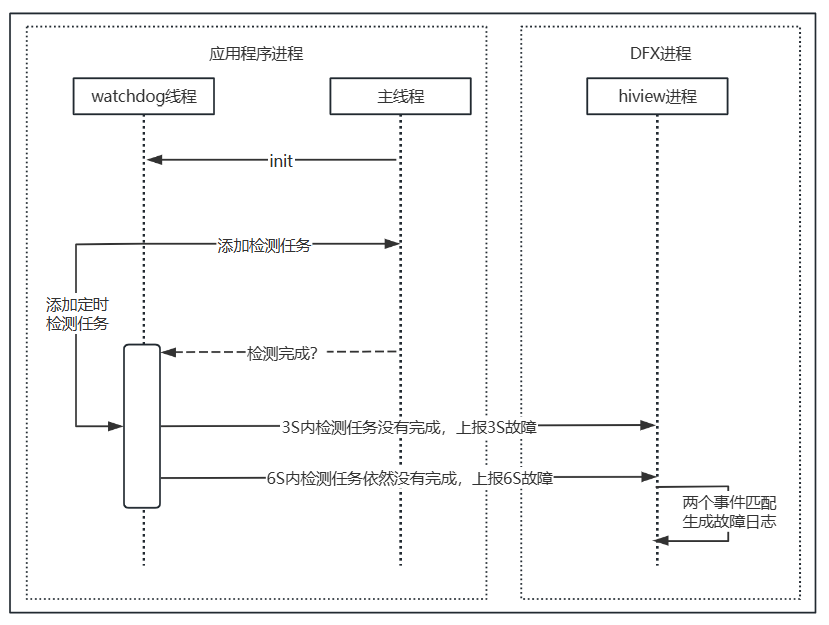
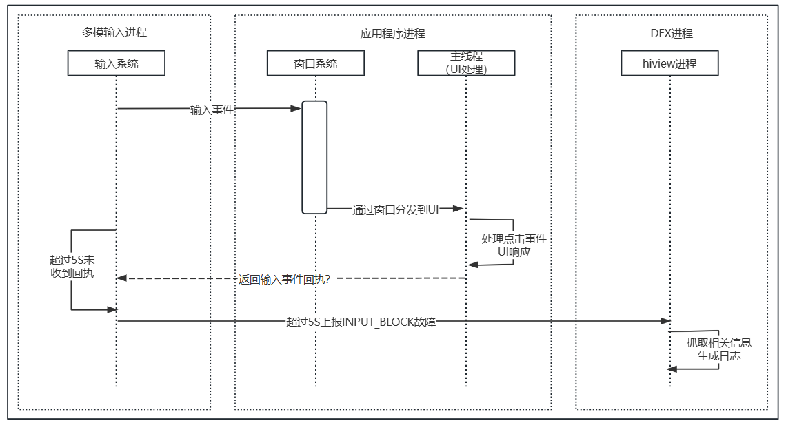
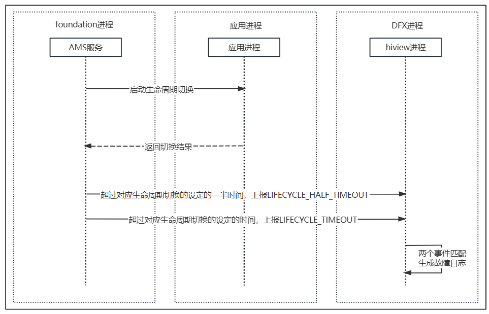

# AppFreeze（应用冻屏）检测

<!--Kit: Performance Analysis Kit-->
<!--Subsystem: HiviewDFX-->
<!--Owner: @Chenyufan466765692-->
<!--Designer: @peterhuangyu-->
<!--Tester: @gcw_KuLfPSbe;@lipengpeng97-->
<!--Adviser: @jinqiuheng-->

## 简介

用户在使用应用时，如果出现点击无反应或应用无响应等情况，并且持续时间超过一定限制，就会被定义为应用冻屏（AppFreeze），即应用无响应。系统会检测应用无响应，并生成AppFreeze日志，供应用开发者分析。

> **说明：**
>
> 本文仅适用于Stage模型下的应用。在根据本文分析日志前，开发者需要具备JS在系统中运行情况、C++程序堆栈信息的相关基础知识，并对应用相关的子系统有一定了解。

## 检测原理

目前应用冻屏检测从以下维度检测，了解其原理有助于应用开发者定位和分析AppFreeze故障。

> **注意：**
>
> 当开发者通过DevEco Studio的Debug按钮安装并启动应用时，会自动关闭当前工程的超时检测机制。避免调试过程出现超时检测影响开发者调试。

| 事件类型 | 说明 | 所属故障类型 |
| -------- | -------- | -------- |
| THREAD_BLOCK_3S | 应用冻屏告警事件，应用主线程执行任务超过3s时触发。<br>**说明**：从API版本26.0.0开始，支持该类型。 | [THREAD_BLOCK_6S应用主线程卡死超时](#thread_block_6s应用主线程卡死超时) |
| THREAD_BLOCK_6S | 应用冻屏事件，应用主线程执行任务超过6s时触发。 | [THREAD_BLOCK_6S应用主线程卡死超时](#thread_block_6s应用主线程卡死超时) |
| APP_INPUT_BLOCK | 应用冻屏事件，用户输入响应超时。 | [APP_INPUT_BLOCK用户输入响应超时](#app_input_block用户输入响应超时) |
| LIFECYCLE_HALF_TIMEOUT | 应用冻屏告警事件， UIAbility生命周期切换过程中，超过半生命周期阈值时触发。<br>**说明**：从API版本26.0.0开始，支持该类型。 | [LIFECYCLE_TIMEOUT生命周期切换超时](#lifecycle_timeout生命周期切换超时) |
| LIFECYCLE_TIMEOUT | 应用冻屏事件，UIAbility生命周期切换超时。<br>**说明**：从API版本26.0.0开始，支持该类型。 | [LIFECYCLE_TIMEOUT生命周期切换超时](#lifecycle_timeout生命周期切换超时) |

当触发上述告警事件时，会上报应用冻屏告警事件，可通过HiAppEvent订阅[应用冻屏告警事件介绍](hiappevent-watcher-appfreezewarning-events.md)。

当触发上述应用冻屏故障时，系统会杀死应用以保证可恢复，同时上报应用冻屏事件，可通过HiAppEvent订阅[应用冻屏事件介绍](hiappevent-watcher-freeze-events.md)。

### THREAD_BLOCK_6S应用主线程卡死超时

**概述**：发生该故障，表示当前应用主线程有卡死或者执行任务过多的情况，影响应用的流畅度和体验。

**检测原理**：应用的watchdog线程定期向主线程插入判活检测任务。如果判活检测超过3s未被执行，将上报THREAD_BLOCK_3S告警事件；如果超过6s仍未被执行，将上报THREAD_BLOCK_6S主线程卡死事件。两个事件匹配生成THREAD_BLOCK的应用无响应日志。

检测原理如下图：

**图1**



### APP_INPUT_BLOCK用户输入响应超时

**概述**：该故障是指点击事件超过5s未得到响应。

> **说明：**
>
> 从**API version 24**开始，5s检测阈值扩大到8s。

**检测原理**：用户点击应用时，输入系统会向应用侧发送点击事件；应用侧的响应反馈回执超时，则上报该故障。

检测原理如下图：

**图2**



### LIFECYCLE_TIMEOUT生命周期切换超时

**概述**：生命周期切换超时是指：[UIAbility生命周期](../application-models/uiability-lifecycle.md)切换流程没有在指定时间内执行完毕。原因可能为：应用在生命周期切换过程中执行耗时操作，或者后台任务优先级低，资源供给不足导致的。

该故障发生在生命周期切换过程中，影响应用内Ability的切换或不同PageAbility之间的切换。

从**API版本26.0.0**开始，应用在AppScope/app.json5文件中配置如下环境变量，可获取故障日志，获取方式参考[日志获取](#日志获取)。

> **注意：**
>
> 配置日志获取后，该类型日志将以Appfreeze类型上报给三方应用，会增加Appfreeze故障统计，计入Appfreeze故障指标。

```text
"appEnvironments": [
  {
    "name": "DFX_APPFREEZE_LOG_OPTIONS",
    "value": "report_lifecycle_as_appfreeze:enable;"
  }
]
```

**检测原理**：AMS（Ability Manager Service）作为协调Ability运行和生命周期调度的系统服务，向应用进程发送生命周期切换指令，等待应用返回结果，在固定时间内未成功完成任务将上报故障。

生命周期切换超时由LIFECYCLE_HALF_TIMEOUT和LIFECYCLE_TIMEOUT两个事件组合而成。如果生命周期切换过程中，超过半生命周期阈值未被执行，将上报LIFECYCLE_HALF_TIMEOUT告警事件；如果超过完整生命周期阈值仍未被执行，将上报LIFECYCLE_TIMEOUT卡死事件，两个事件匹配生成应用无响应日志。LIFECYCLE_HALF_TIMEOUT作为LIFECYCLE_TIMEOUT的告警事件，捕获Binder等信息。

不同的生命周期超时，对应的超时时间各不相同。具体如下表所示：

| 生命周期 | 超时时间 |
| -------- | -------- |
| Load | 10s |
| Foreground | 5s |

**图3**



## 日志获取

应用冻屏日志和进程崩溃日志一致，都是由Faultlogger模块进行管理，可通过以下方式获取：

**方式一：通过DevEco Studio获取日志**

DevEco Studio会收集设备/data/log/faultlog/faultlogger/路径下的进程崩溃故障日志到FaultLog下，根据进程名和故障时间分类显示。获取日志的方法参见：[DevEco Studio使用指南-FaultLog](https://developer.huawei.com/consumer/cn/doc/harmonyos-guides/ide-fault-log)。

**方式二：通过HiAppEvent接口订阅**

HiAppEvent给开发者提供了故障订阅接口，详见[HiAppEvent介绍](hiappevent-intro.md)。参考[订阅应用冻屏事件（ArkTS）](hiappevent-watcher-freeze-events-arkts.md)或[订阅应用冻屏事件（C/C++）](hiappevent-watcher-freeze-events-ndk.md)完成应用冻屏事件订阅，并通过事件的[external_log](hiappevent-watcher-freeze-events.md#事件字段说明)字段读取故障日志文件内容。

**方式三：通过hdc获取日志，需打开开发者选项**

在开发者选项打开的情况下，开发者可以通过hdc file recv /data/log/faultlog/faultlogger D:\命令导出故障日志到本地，故障日志文件名格式为appfreeze-进程名-进程UID-毫秒级时间.log。

## 日志规格

应用冻屏（AppFreeze）问题需要结合应用冻屏日志和hilog流水日志进行分析。

当前提供一个故障分析示例，请开发者根据日志中的模块信息进行具体分析。

应用冻屏日志主要分以下几个模块信息：

### 日志头部信息

```text
Generated by HiviewDFX@OpenHarmony
================================================================
<!--RP2-->
Device info:OpenHarmony 3.2
Build info:OpenHarmony 6.1.0.125
<!--RP2End-->
DeviceDebuggable:No
Fingerprint:e18a33c12e1361173ec9ac1c93f2bd0c2daa88f03c7f76b228cca14bdc6a21b1
Module name:com.samples.freezedebug
ReleaseType:release
CpuAbi:arm64-v8a
Version:1.0.0
VersionCode:1000000
IsSystemApp:No
PreInstalled:No
Foreground:Yes
Pid:13680
Uid:20020177
App running unique id:124500628566978194
Process life time:18s
Process Memory(kB):163819(Rss)
Device Memory(kB):Total 11679272, Free 3697424, Available 5814272
Reason:THREAD_BLOCK_6S
appfreeze: com.samples.freezedebug THREAD_BLOCK_6S at 20250628140837
DisplayPowerInfo:powerState:UNKNOWN
HitraceIdInfo: hitrace_id: a92ab27238f409a, span_id: 1cd61c9, parent_span_id: 3072e, trace_flag: 0
Page switch history:
  14:08:30:327 /ets/pages/Index:Appfreeze
  14:08:28:986 /ets/pages/Index
  14:08:26:502 :enters foreground
  14:08:07:606 :leaves foreground
  14:08:06:246 /ets/pages/Index:Appfreeze
  14:08:01:955 :enters foreground
>>>>>>>>>>>>>>>>>>>>>>>>>>>>>>>>>>>>>>>>>>>
DOMAIN:AAFWK
STRINGID:THREAD_BLOCK_6S
TIMESTAMP:2025/06/28-14:08:37:360
PID:13680
UID:20020177
PACKAGE_NAME:com.samples.freezedebug
PROCESS_NAME:com.samples.freezedebug
NOTE: Current fault may be caused by the system's low memory or thermal throttling, you may ignore it and analysis other faults.Current process has encountered fd leak which may lead to appfreeze, you may refer to resource overlimit event from hiAppEvent for further analysis.
***
```

从API version 20开始，当整机资源告警（如整机低内存或热限频）时，系统会输出NOTE行。此时开发者可忽略应用冻屏故障。在之前的API版本中，无论整机资源状态如何，系统都不会输出此NOTE行。

从API version 20开始，发生THREAD_BLOCK_6S故障时，日志中新增[HiTraceId](../reference/apis-performance-analysis-kit/js-apis-hitracechain.md#hitraceid)信息打印。HiTraceId是HiTraceChain提供的唯一跟踪标识，用于跟踪业务流程调用链。可以协助开发者查看故障时间段内，故障流程的hilog日志，分析日志查看应用的执行状态。

从API版本26.0.0开始，支持AppFreeze日志中关联[Resource Leak（资源泄漏）检测](https://developer.huawei.com/consumer/cn/doc/harmonyos-guides/resource-leak-guidelines)事件信息。若当前进程在发生冻屏故障前已存在内存泄漏，故障日志将提示泄漏事件，并指出其可能为导致冻屏的诱因。

AppFreeze事件（THREAD_BLOCK_6S、 APP_INPUT_BLOCK）都包含以下几部分信息：

| 字段 | 说明 |
| -------- | -------- |
| DeviceDebuggable | 设备的系统版本是否可调试，和开发者选项无关。<br>**说明**：从API version 23开始支持。 |
| ReleaseType | 应用的版本类型。release表示应用为[release版本应用](https://developer.huawei.com/consumer/cn/doc/harmonyos-guides/ide-hvigor-compilation-options-customizing-guide#section192461528194916)，debug表示应用为[debug版本应用](https://developer.huawei.com/consumer/cn/doc/harmonyos-guides/ide-hvigor-compilation-options-customizing-guide#section192461528194916)。<br>**说明**：从API version 23开始支持。 |
| CpuAbi | 二进制接口类型。<br>**说明**：从API version 23开始支持。 |
| IsSystemApp | 应用是否为系统应用。<br>**说明**：从API version 23开始支持。 |
| Reason | 应用无响应原因，与应用无响应检测能力点对应。 |
| PID | 发生故障时的pid。 |
| PACKAGE_NAME | 应用进程包名。 |
|[Page switch history](./cppcrash-guidelines.md#有页面切换轨迹的故障场景日志规格)| 从API version 20开始，维测进程会记录应用切换历史。应用发生故障后，生成的故障文件将包含页面切换历史轨迹。如果维测服务进程崩溃或被终止运行，或者未能成功缓存页面切换轨迹，则不包含此字段。|
| App running unique id | 应用运行时唯一关联的id。<br>**说明**：从API版本26.0.0开始支持。|
| Process life time | 故障进程存活时间。单位：s。<br>**说明**：从API version 22开始支持。|
| Process Memory(kB) | 故障进程内存占用。<br>**说明**：从API version 22开始支持。|
| Device Memory(kB) | 整机内存信息。<br>**说明**：从API version 22开始支持。|

### 日志主干通用信息

```text
start time: 2025/06/28-14:08:34:318
DOMAIN = AAFWK
EVENTNAME = THREAD_BLOCK_3S
TIMESTAMP = 2025/06/28-14:08:34:310
PID = 13680
UID = 20020177
TID = 13680
PACKAGE_NAME = com.samples.freezedebug
PROCESS_NAME = com.samples.freezedebug
eventLog_action = ffrt,t,GpuStack,cmd:m,hot
eventLog_interval = 10
this thread has blocked 3000ms.
IS_FROZEN = 0
MSG =
Fault time:2025/06/28-14:08:34
App main thread is not response!
Main handler dump start time: 2025-06-28 14:08:34.067
mainHandler dump is:
 EventHandler dump begin curTime: 2025-06-28 14:08:34.067
 Event runner (Thread name = , Thread ID = 13680) is running
 Current Running: start at 2025-06-28 14:08:27.354, Event { send thread = 13680, send time = 2025-06-28 14:08:22.353, handle time = 2025-06-28 14:08:27.353, trigger time = 2025-06-28 14:08:27.354, task name = uv_timer_task, caller = [ohos_loop_handler.cpp(OnTriggered:72)] }
 History event queue information:
 No. 0 : Event { send thread = 13856, send time = 2025-06-28 14:08:22.336, handle time = 2025-06-28 14:08:22.336, trigger time = 2025-06-28 14:08:22.336, completeTime time = 2025-06-28 14:08:22.337, priority = VIP, task name = MMITask, caller = [deamon_io_waiter.cpp(HandleFileDescriptorEvent:225)] }
...
 No. 31 : Event { send thread = 13856, send time = 2025-06-28 14:08:22.330, handle time = 2025-06-28 14:08:22.380, trigger time = 2025-06-28 14:08:22.330, completeTime time = 2025-06-28 14:08:22.331, priority = VIP, task name = vSyncTask, caller = [deamon_io_waiter.cpp(PostTaskForVsync:159)] }
 VIP priority event queue information:
 No.1 : Event { send thread = 13843, send time = 2025-06-28 14:08:31.066, handle time = 2025-06-28 14:08:31.066, id = 1, caller = [watchdog.cpp(Timer:233)] }
 No.2 : Event { send thread = 13843, send time = 2025-06-28 14:08:34.067, handle time = 2025-06-28 14:08:34.067, id = 1, caller = [watchdog.cpp(Timer:233)] }
 Total size of VIP events : 2
 Immediate priority event queue information:
 Total size of Immediate events : 0
 High priority event queue information:
 Total size of High events : 0
 Low priority event queue information:
 Total size of Low events : 0
 Idle priority event queue information:
 Total size of Idle events : 0
 Total event size : 2
```

AppFreeze事件THREAD_BLOCK_6S、APP_INPUT_BLOCK均包含以下信息：

从API版本26.0.0开始，AppFreeze事件新增支持LIFECYCLE_TIMEOUT。

| 字段 | 说明 |
| -------- | -------- |
| EVENTNAME | 组成卡死检测事件。 |
| TIMESTAMP | 发生故障时上报事件的时刻，可以根据应用无响应检测能力点中说明的超时时间，在相应hilog流水日志中缩小查看日志的时间范围。 |
| PID | 发生故障时的pid。 |
| UID | 发生故障时的uid。 |
| TID | 发生故障时的tid。 |
| PACKAGE_NAME | 应用进程包名。 |
| PROCESS_NAME | 应用进程名。 |
| MSG | 发生故障时间及EventHandler信息。 |
| IS_FROZEN | 发生故障时，进程冻结状态。<br/>- 0表示进程未冻结。<br/>- 1表示进程冻结。<br>**说明**：从API版本26.0.0开始支持。|
| this thread has blocked 3000ms. | 发生线程阻塞故障时，应用线程执行任务超时 3 秒（即 THREAD_BLOCK_3S 阈值）。具体超时时间以日志中实际数值为准（示例中为 3000ms）。<br>**说明**：从API版本26.0.0开始支持。|

EventHandler信息，具体解释如下：

dump信息包含以下字段：

| 字段 | 说明 |
| -------- | -------- |
| EventHandler dump begin curTime | 获取dump信息时间。 |
| Event runner | EventHandler对应的线程名和线程号。 |
| Current Running | 当前正在执行的完整任务信息。 |
| History event queue information | 历史执行任务信息。 |
| VIP priority event queue information | VIP级任务队列信息。 |
| Immediate priority event queue information | 立即执行任务队列信息。 |
| High priority event queue information | 高优先级任务队列信息。 |
| Low priority event queue information | 低优先级任务队列信息。 |
| Idle priority event queue information | 挂起任务队列信息。 |

任务信息包含以下字段：

| 字段 | 说明 |
| -------- | -------- |
| send thread | 提交任务线程号。 |
| send time | 提交任务时间。 |
| task name | 任务队列中的任务名。 |
| priority | 任务优先级。 |
| caller | 任务提交方法。 |
| handle time | 任务预期执行时间，该时间与实际的任务执行时间（trigger time）可能存在偏差。 |
| trigger time | 任务执行时间。 |
| completeTime time | 任务执行完成时间（如果没有打印则表示该任务未执行完成）。 |

> **说明：**
>
> EventHandler信息中，开发者只需重点关注EventHandler dump begin curTime，trigger time和completeTime time时间即可。
>
> EventHandler信息详细指导可参考：[查看eventHandler信息](https://developer.huawei.com/consumer/cn/doc/best-practices/bpta-stability-app-freeze-way#section190014865618)

### 堆栈信息

故障进程堆栈信息。

```text
Tid:13680, Name:les.freezedebug
state=S, utime=0, stime=0, priority=0, nice=-20, clk=100
#00 pc 000000000000186c [shmm](__kernel_gettimeofday+72)
#01 pc 00000000001d887c /system/lib/ld-musl-aarch64.so.1(gettimeofday+40)(f1a940981720250b920ee26d2d76af5b)
#02 pc 000000000058fb5c /system/lib64/platformsdk/libark_jsruntime.so(panda::ecmascript::builtins::BuiltinsDate::Now(panda::ecmascript::EcmaRuntimeCallInfo*)+48)(0f1928b77d36d27edb5512bd89806a6f)
#03 pc 0000000000cff5dc /system/lib64/module/arkcompiler/stub.an(RTStub_PushCallArgsAndDispatchNative+40)
#04 pc 000000000036aaf4 /system/lib64/module/arkcompiler/stub.an(BCStub_HandleCallthis0Imm8V8StwCopy+380)
#05 at wait15s (entry/src/main/ets/pages/Index.ets:16:10)
#06 pc 000000000026b1dc /system/lib64/platformsdk/libark_jsruntime.so(panda::ecmascript::InterpreterAssembly::Execute(panda::ecmascript::EcmaRuntimeCallInfo*)+536)(0f1928b77d36d27edb5512bd89806a6f)
#07 pc 000000000096b188 /system/lib64/platformsdk/libark_jsruntime.so(panda::FunctionRef::CallForNapi(panda::ecmascript::EcmaVM const*, panda::JSValueRef*, panda::JSValueRef* const*, int)+1432)(0f1928b77d36d27edb5512bd89806a6f)
#08 pc 000000000006b7a4 /system/lib64/platformsdk/libace_napi.z.so(napi_call_function+212)(eaa639519e67e8495ca596293a0d33cd)
#09 pc 000000000000b17c /system/lib64/platformsdk/libtimer.z.so(OHOS::JsSysModule::Timer::TimerCallback(uv_timer_s*) (.cfi)+528)(764291289e89523cdbe9c3c78c1cca35)
#10 pc 0000000000013ea8 /system/lib64/platformsdk/libuv.so(uv__run_timers+68)(9e7eb59ca1a45f4230b641a7c940a20b)
#11 pc 000000000001a344 /system/lib64/platformsdk/libuv.so(uv_run+376)(9e7eb59ca1a45f4230b641a7c940a20b)
#12 pc 00000000000895a8 /system/lib64/platformsdk/libruntime.z.so(OHOS::AbilityRuntime::OHOSLoopHandler::OnTriggered()+140)(daf29e377c47e3e26282e745dd1b3488)
#13 pc 0000000000089b4c /system/lib64/platformsdk/libruntime.z.so(std::__h::__function::__func<OHOS::AbilityRuntime::OHOSLoopHandler::OnTriggered()::$_0, std::__h::allocator<OHOS::AbilityRuntime::OHOSLoopHandler::OnTriggered()::$_0>, void ()>::operator()() (.9efded9864dc55830f61b3b92d59beab)+52)(daf29e377c47e3e26282e745dd1b3488)
#14 pc 000000000001ff6c /system/lib64/chipset-sdk-sp/libeventhandler.z.so(OHOS::AppExecFwk::(anonymous namespace)::EventRunnerImpl::ExecuteEventHandler(std::__h::unique_ptr<OHOS::AppExecFwk::InnerEvent, void (*)(OHOS::AppExecFwk::InnerEvent*)>&)+2228)(475713336c2720d372d5aeb99dda5f9f)
#15 pc 000000000001a7d8 /system/lib64/chipset-sdk-sp/libeventhandler.z.so(OHOS::AppExecFwk::(anonymous namespace)::EventRunnerImpl::Run()+648)(475713336c2720d372d5aeb99dda5f9f)
#16 pc 000000000003f5f4 /system/lib64/chipset-sdk-sp/libeventhandler.z.so(OHOS::AppExecFwk::EventRunner::Run()+404)(475713336c2720d372d5aeb99dda5f9f)
#17 pc 00000000000a50f0 /system/lib64/platformsdk/libappkit_native.z.so(OHOS::AppExecFwk::MainThread::Start()+504)(e794b687fdf46631ae5144eba250f8c0)
#18 pc 0000000000005278 /system/lib64/appspawn/appspawn/libappspawn_ace.z.so(RunChildProcessor(AppSpawnContent*, AppSpawnClient*)+568)(143c05087e9460f0fd794b9dce5dec29)
#19 pc 000000000000baa8 /system/bin/appspawn(AppSpawnChild+648)(25ab88f6e04b1d2c8feb5d3eebfb4664)
#20 pc 0000000000016478 /system/bin/appspawn(ProcessSpawnReqMsg+3260)(25ab88f6e04b1d2c8feb5d3eebfb4664)
#21 pc 0000000000013aac /system/bin/appspawn(OnReceiveRequest+724)(25ab88f6e04b1d2c8feb5d3eebfb4664)
#22 pc 0000000000017844 /system/lib64/chipset-sdk-sp/libbegetutil.z.so(HandleRecvMsg_+384)(a9ddb8b84cc09183cc6bd2e5bb875f30)
#23 pc 000000000001715c /system/lib64/chipset-sdk-sp/libbegetutil.z.so(HandleStreamEvent_+152)(a9ddb8b84cc09183cc6bd2e5bb875f30)
#24 pc 000000000001444c /system/lib64/chipset-sdk-sp/libbegetutil.z.so(ProcessEvent+380)(a9ddb8b84cc09183cc6bd2e5bb875f30)
#25 pc 0000000000013edc /system/lib64/chipset-sdk-sp/libbegetutil.z.so(RunLoop_.llvm.16927440879641410339+656)(a9ddb8b84cc09183cc6bd2e5bb875f30)
#26 pc 0000000000010dcc /system/bin/appspawn(AppSpawnRun+212)(25ab88f6e04b1d2c8feb5d3eebfb4664)
#27 pc 000000000000eb90 /system/bin/appspawn(main+728)(25ab88f6e04b1d2c8feb5d3eebfb4664)
#28 pc 00000000000a9804 /system/lib/ld-musl-aarch64.so.1(libc_start_main_stage2+84)(f1a940981720250b920ee26d2d76af5b)
```

<!--RP4--><!--RP4End-->
大部分情况下，THREAD_BLOCK_6S、LIFECYCLE_TIMEOUT以及APP_INPUT_BLOCK故障的堆栈信息，可以协助开发者定位到异常代码。

其他情况下（比如瞬时栈场景），由于主线程繁忙等问题，导致获取堆栈信息延迟，无法及时捕获到异常代码段，堆栈的栈顶信息并非开发者期望获取的结果。

为解决上述问题，从API version 21开始，支持获取AppFreeze的增强日志。协助开发者定位问题，详见[AppFreeze（应用冻屏）增强日志实现原理](#实现原理)。

若上述故障进程堆栈内容缺失，可能会出现以下几种日志信息：

| 日志信息 | 说明 |
| ------------- | ----------------------------------------------------------------------------------------------------------------- |
| has been crashed | 目标进程crash。在收到目标进程的crash请求后，10s内收到抓栈请求，请参考故障时间点附近的crash日志。需要检查应用自身的信号处理函数使用是否正确，或者是否使用了非信号安全函数。 |
| SIGDUMP error | 目标进程在收到抓栈请求时已经退出。|
| is dumping | 目标进程正在dump。 短时间内连续请求，请参考故障时间点附近该进程的其他报错日志。|
| State: S | 目标进程Sleep。|
| errno(2) | 目标进程无响应信号。超时1s后没有返回堆栈信息时，日志中打印内核栈以及/proc/status。|

> **说明：**
>
> 在整机高负载情况（如CPU高负载）下，采用低开销方式获取调用栈时，可能损失函数名信息。
>
> 从API version 21开始，出现'Failed to dump normal stacktrace'字样时，系统采取轻量化的frame pointer回溯模式。栈回溯可能中断在非使能frame pointer的库（在GCC编译使用 -fomit-frame-pointer 选项时，编译产物不使能frame pointer），以及受轻量化的限制，单个线程的回栈层数不会超过50层。

从API version 23开始，在线程号下新增线程状态等信息用于判断系统卡顿问题。其中，state表示线程运行状态，priority和nice表示调度优先级，stime和utime表示运行时间。对比THREAD_BLOCK_3S和THREAD_BLOCK_6S的堆栈运行时间无变化，说明进程未被调度。分析业务代码无阻塞调用后可判断为系统调度问题。线程状态信息获取失败时，以下字段均不显示，线程状态信息在故障日志中格式如下：

```text
state=S, utime=0, stime=0, priority=0, nice=-20, clk=100
```

字段信息解释如下：

| 字段 | 说明 |
| -------- | -------- |
| state | 线程运行状态。读取自/proc/pid/stat的state的值。 |
| utime | 线程在用户态下消耗的CPU的嘀嗒数。读取自/proc/pid/stat的utime的值。|
| stime | 线程在内核态下消耗的CPU的嘀嗒数。读取自/proc/pid/stat的stime的值。|
| priority | 实时优先级。读取自/proc/pid/stat的priority的值。|
| nice | 静态优先级。读取自/proc/pid/stat的nice的值。|
| clk | 每秒的时钟嘀嗒次数。使用sysconf(_SC_CLK_TCK)获取，获取失败时使用默认值100。通过嘀嗒数除以该值可以计算得到运行时间（单位：秒）。|

### 对端信息（与当前故障进程通信的进程信息）

（1）BinderCatcher：显示进程间通信的调用信息及等待时间过长的情况。

```text
PeerBinderCatcher -- pid==13680
BinderCatcher --
    13840:14102 to 901:4079 code 16 wait:0.25653125 s frz_state:3,  ns:-1:-1 to -1:-1, debug:13840:14102 to 901:4079, active_code:0, active_thread=0, pending_async_proc=0
    3712:3712 to 13967:14076 code d2 wait:0.703385417 s frz_state:3,  ns:-1:-1 to -1:-1, debug:3712:3712 to 13967:14076, active_code:0, active_thread=0, pending_async_proc=0
    1733:2285 to 3712:3712 code b wait:1.365925521 s frz_state:3,  ns:-1:-1 to -1:-1, debug:1733:2285 to 3712:3712, active_code:0, active_thread=0, pending_async_proc=0
...
pid context     request started max ready   free_async_space
14072   binder  0   2   16  3   520192
14103   binder  0   4   16  6   520192
13967   binder  0   3   16  3   520192
13878   binder  0   2   16  3   520192
13840   binder  0   2   16  3   520192
13863   binder  0   1   16  3   520192
13680   binder  0   2   16  3   520192
13770   binder  0   3   16  5   520192
13749   binder  0   3   16  5   520192
...

```

进程间通信调用信息解释如下：

| 主要信息字段 | 说明 |
| -------- | -------- |
| xxx:xxx to xxx:xxx | 客户端进程号、线程号 to 服务端进程号、线程号。其中async表示异步，无async表示同步。 |
| code | 客户端和服务端达成一致约束的业务码。 |
| wait | 通信等待时长。 |
| frz_state | 进程冻结状态。<br/>-1 未知；<br/>1 默认；<br/>2 正在向用户态发送binder状态信息；<br/>3 走到了binder接收线程。 |
| ns | 客户端进程号、线程号 to 服务端进程号、线程号。 |
| debug | IPC通信双方的信息补充。 |
| active_code | 正在处理的异步消息code。 |
| active_thread | 处理这个异步消息的线程。 |
| pending_async_proc | 被这个异步消息阻塞的进程。 |
| pid | 进程PID。 |
| context | 通信方式。 |
| request | 请求申请的IPC线程数量。 |
| started | 已经申请启动的IPC线程数量。 |
| max | 可以申请的最大IPC线程数量。 |
| ready | 空闲IPC线程。 |
| free_async_space | 空闲异步空间，用于观测异步信息阻塞。 |

（2）PeerBinder Stacktrace：故障进程相关的对端进程有卡死，会抓取对端的进程堆栈，即与当前进程通信的进程堆栈

```text
Tid:48841, Name:xxx
#00 pc 000000000016adf4 /system/lib/ld-musl-aarch64.so.1
#01 pc 000000000001c0d4 /system/lib64/chipset-sdk-sp/libeventhandler.z.so
#02 pc 000000000001a7f4 /system/lib64/chipset-sdk-sp/libeventhandler.z.so
#03 pc 000000000003f5f4 /system/lib64/chipset-sdk-sp/libeventhandler.z.so
#04 pc 00000000000a50f0 /system/lib64/platformsdk/libappkit_native.z.so
#05 pc 0000000000005278 /system/lib64/appspawn/appspawn/libappspawn_ace.z.so
#06 pc 000000000000baa8 /system/bin/appspawn
#07 pc 0000000000016478 /system/bin/appspawn
#08 pc 0000000000013aac /system/bin/appspawn
#09 pc 0000000000017844 /system/lib64/chipset-sdk-sp/libbegetutil.z.so
#10 pc 000000000001715c /system/lib64/chipset-sdk-sp/libbegetutil.z.so
#11 pc 000000000001444c /system/lib64/chipset-sdk-sp/libbegetutil.z.so
#12 pc 0000000000013edc /system/lib64/chipset-sdk-sp/libbegetutil.z.so
#13 pc 0000000000010dcc /system/bin/appspawn
#14 pc 000000000000eb90 /system/bin/appspawn
#15 pc 00000000000a9804 /system/lib/ld-musl-aarch64.so.1
#16 pc 000000000000b754 /system/bin/appspawn
```

### CPU信息

整机CPU信息及解释如下：

```text
Load average: 14.3 / 12.9 / 11.4; the cpu load average in 1 min, 5 min and 15 min
CPU usage from 2025-06-28 14:08:36 to 2025-06-28 14:08:37
Total: 22.45%; User Space: 13.64%; Kernel Space: 8.81%; iowait: 0.33%; irq: 0.07%; idle: 77.15%
Details of Processes:
    PID   Total Usage      User Space    Kernel Space    Page Fault Minor    Page Fault Major    Name
    13680      8.86%           8.31%          0.55%            4711                6637            com.samples.freezedebug
    644        2.55%           1.40%          1.15%          210104                7391            hiview
    600        0.89%           0.78%          0.10%           60192                 514            hilogd
    1685       0.53%           0.31%          0.22%          879838               59636            foundation
```

| 主要信息字段 | 说明 |
| -------- | -------- |
| PID | 进程PID。 |
| Total Usage | CPU使用率，Total Usage = User Space+Kernel Space。 |
| User Space | 用户态使用率。 |
| Kernel Space | 内核态使用率。 |
| Page Fault Minor | 次要缺页错误。 |
| Page Fault Major | 主要缺页错误。 |
| Name | 进程名。 |

### 内存信息

```text
Get freeze memory start time: 2025-06-28 14:08:37.112
some avg10=56.81 avg60=56.81 avg300=56.81 total=56
full avg10=56.81 avg60=56.81 avg300=56.81 total=56
...
ReclaimAvailBuffer:                    4676608 kB
...
```

整机内存信息如上所示，其中ReclaimAvailBuffer为整机剩余可用内存，主要用于确认是否是低内存问题。

## 日志差异性信息

**生命周期超时事件**

以下为生命周期超时日志差异性内容示例：

```text
DOMAIN:AAFWK
STRINGID:LIFECYCLE_TIMEOUT
TIMEOUT TIMESTAMP:2025/02/10-21:40:59:113
PID:1561
UID:20010039
PACKAGE_NAME:com.example.myapplication
PROCESS_NAME:com.example.myapplication
MSG:ability:EntryAbility background timeout
server actions for ability:
2025-02-10 21:40:56.376; AbilityRecord::ProcessForegroundAbility; the ProcessForegroundAbility lifecycle starts.
2025-02-10 21:40:56.377; ServiceInner::UpdateAbilityState
server actions for app:
2025-02-10 21:40:56.397; AppRunningRecord::OnWindowVisibilityChanged
2025-02-10 21:40:56.851; AppRunningRecord::OnWindowVisibilityChanged
2025-02-10 21:40:58.668; AppRunningRecord::OnWindowVisibilityChanged
client actions for ability:
2025-02-10 21:40:56.378; AbilityThread::ScheduleAbilityTransaction
2025-02-10 21:40:56.378; AbilityThread::HandleAbilityTransaction
2025-02-10 21:40:56.382; JsUIAbility::OnStart begin
2025-02-10 21:40:56.382; JsUIAbility::OnStart end
2025-02-10 21:40:56.387; JsUIAbility::OnSceneCreated begin
2025-02-10 21:40:56.388; JsUIAbility::OnSceneCreated end
2025-02-10 21:40:56.388; JsUIAbility::WindowScene::GoForeground begin
2025-02-10 21:40:56.389; UIAbilityImpl::WindowLifeCycleImpl::AfterForeground
2025-02-10 21:40:56.392; JsUIAbility::IntentForeground execute start begin
2025-02-10 21:40:56.397; JsUIAbility::IntentForeground end
2025-02-10 21:40:56.397; JsUIAbility::OnForeground begin
client actions for app:
```

下面表格用**两个完整生命周期切换**示例来解释MSG中的信息。

> **说明：**
>
> 每条记录均带有时间戳，通过相邻记录的时间戳差值可定位耗时步骤。
>
> "失败原因"列说明该步骤可能导致超时的原因。
>
> "是否需要应用处理"列说明是否需要应用开发者处理及处理方式。
>
> 标注"（异常场景）"的记录仅在对应异常发生时出现，标注"（[InsightIntent](../application-models/insight-intent-overview.md)场景）"的记录仅在涉及意图框架时出现。

1. load 阶段事件，以应用进程未创建为例。

   | server | client | 描述 | 失败原因 | 是否需要应用处理 |
   | ------------------------------------------------------------- | ---------------------------------------- | --------------------------------------------------------------- | --------------------------------------------------------------- | --------------------------------------------------------------- |
   | AbilityRecord::LoadAbility; the LoadAbility lifecycle starts. | - | Ability加载生命周期开始，系统准备加载Ability所需的资源和进程。标识load阶段起点。 | - | 否，系统侧调度。 |
   | AppMgrServiceInner::LoadAbility | - | 在创建应用进程之前，服务端开始处理Ability加载请求，检查进程状态。 | - | 否，系统侧调度。 |
   | AppMgrService::AttachApplication | - | 应用进程创建成功后，进程向服务端发起attach（挂载）请求，建立通信通道。 | - | 否，系统侧调度。 |
   | ServiceInner::AttachApplication | - | 服务端处理进程attach，记录进程信息，准备后续调度。 | - | 否，系统侧调度。 |
   | ServiceInner::LaunchApplication | - | 服务端调度应用执行加载流程，通知应用进程进行初始化。 | - | 否，系统侧调度。 |
   | AppRunningRecord::LaunchApplication | - | 调度应用执行加载流程。 | - | 否，系统侧调度。 |
   | AppRunningRecord::LaunchApplication; null scheduler（异常场景） | - | 调度应用加载流程时调度器为空，记录异常信息。 | - | 否，系统侧调度问题。 |
   | AppScheduler::ScheduleLaunchApplication | - | 通过IPC向应用进程发送ScheduleLaunchApplication调度请求。 | - | 否，系统侧IPC。 |
   | write launchData fail（异常场景） | - | 序列化launchData失败。 | - | 否，系统侧数据问题。 |
   | write config fail（异常场景） | - | 序列化config失败。 | - | 否，系统侧数据问题。 |
   | ScheduleLaunchApplication ipc error *（异常场景） | - | ScheduleLaunchApplication IPC调用失败，记录IPC错误码。 | IPC通信异常。 | 否，系统侧IPC问题。 |
   | - | ScheduleLaunchApplication | 应用进程接收到应用加载调度请求，开始准备加载环境。 | 主线程被阻塞，未及时处理IPC请求。 | 是，检查主线程是否存在耗时任务或阻塞调用。 |
   | - | HandleLaunchApplication begin | 应用开始执行加载逻辑。 | Application初始化逻辑耗时。 | 是，检查应用是否存在异常耗时。 |
   | - | HandleLaunchApplication end | 应用加载逻辑执行结束。与begin对比可计算加载耗时。 | - | 是，检查应用是否存在异常耗时。 |
   | AppRunningRecord::LaunchPendingAbilities | - | 调度应用中待启动的Ability，触发具体的Ability加载。 | - | 否，系统侧调度。 |
   | AppLifeCycleDeal::LaunchAbility | - | 服务端通过IPC调度应用加载具体的Ability。 | IPC通信失败、序列化[Want](../application-models/want-overview.md)失败。 | 否，系统侧IPC问题。 |
   | AppLifeCycleDeal::LaunchAbility; write want fail（异常场景） | - | 序列化want数据失败，记录异常信息。 | want参数过大或包含不可序列化对象。 | 是，检查want参数是否包含过大或不可序列化数据。 |
   | AppLifeCycleDeal::LaunchAbility; ipc error *（异常场景） | - | ScheduleLaunchAbility IPC调用失败，记录IPC错误码。 | IPC通信异常。 | 否，系统侧IPC问题。 |
   | - | MainThread::ScheduleLaunchAbility | 应用进程收到加载Ability的请求，准备执行Ability的创建流程。 | 主线程被阻塞。 | 是，检查主线程是否存在耗时任务。 |
   | - | MainThread::HandleLaunchAbility | 应用主线程处理Ability加载请求。 | - | 否，系统侧加载过程。 |
   | - | JsAbilityStage::Create | 加载[AbilityStage](../application-models/abilitystage.md)。 | - | 否，系统侧加载过程。 |
   | - | JsAbilityStage::OnCreate begin | AbilityStage [onCreate](../reference/apis-ability-kit/js-apis-app-ability-abilityStage.md#oncreate)生命周期开始。 | AbilityStage onCreate中执行耗时操作。 | 是，避免在AbilityStage onCreate中执行耗时操作。 |
   | - | JsAbilityStage::OnCreate end | AbilityStage的onCreate生命周期结束，AbilityStage初始化完成。与begin对比可计算耗时。 | AbilityStage onCreate耗时过长。 | 是，优化AbilityStage onCreate逻辑。 |
   | - | JsAbilityStage::OnAboutToCreateAbility begin（InsightIntent场景） | AbilityStage即将创建Ability（[onAboutToCreateAbility](../reference/apis-ability-kit/js-apis-app-ability-abilityStage.md#onabouttocreateability24)回调）。 | onAboutToCreateAbility中执行耗时操作。 | 是，避免在onAboutToCreateAbility中执行耗时操作。 |
   | - | JsAbilityStage::OnAboutToCreateAbility end（InsightIntent场景） | onAboutToCreateAbility回调结束。与begin对比可计算耗时。 | onAboutToCreateAbility耗时过长。 | 是，优化onAboutToCreateAbility逻辑。 |
   | - | JsAbilityStage::OnAboutToCreateAbilityAsync begin（InsightIntent场景） | 异步创建Ability（onAboutToCreateAbilityAsync回调）。 | 异步Promise未及时resolve。 | 是，确保onAboutToCreateAbilityAsync返回的Promise及时resolve。 |
   | - | JsAbilityStage::OnAboutToCreateAbilityAsync end（InsightIntent场景） | onAboutToCreateAbilityAsync回调结束。 | 异步Promise未及时resolve。 | 是，确保onAboutToCreateAbilityAsync返回的Promise及时resolve。 |
   | - | AbilityThread::CreateObjError（异常场景） | Ability JS对象创建失败，记录异常信息。 | Ability类未注册、JS引擎初始化失败。 | 是，检查Ability类是否正确注册导出。 |
   | - | AbilityThread::Attach | Ability binder挂载（Attach）到服务侧，建立通信。 | - | 否，系统侧IPC。 |
   | - | AbilityThread::Attach; error *（异常场景） | AttachAbilityThread IPC调用失败，记录错误码。 | IPC通信异常。 | 否，系统侧IPC问题。 |
   | AbilityManagerService::AttachAbilityThread; the end of load lifecycle. | - | 服务端确认AbilityThread挂载完成，load生命周期结束。 | - | 否，系统侧调度。 |

2. foreground 阶段事件，应用冷启动。

   | server | client | 描述 | 失败原因 | 是否需要应用处理 |
   | ------------------------------------------------------------- | ---------------------------------------- | --------------------------------------------------------------- | --------------------------------------------------------------- | --------------------------------------------------------------- |
   | AbilityRecord::ProcessForegroundAbility; the ProcessForegroundAbility lifecycle starts. | - | Ability进入前台生命周期（Foreground Lifecycle）的起始阶段。标识foreground阶段起点。 | - | 否，系统侧调度。 |
   | ServiceInner::UpdateAbilityState | - | 先调度应用前台。 | - | 否，系统侧调度。 |
   | AppRunningRecord::ScheduleForegroundRunning | - | 调度应用前台，通知应用进程进入前台运行模式。 | - | 否，系统侧调度。 |
   | AppRunningRecord::ScheduleForegroundRunning; null scheduler（异常场景） | - | 调度应用前台时调度器为空，记录异常信息。 | - | 否，系统侧调度问题。 |
   | ScheduleForegroundRunning fail（异常场景） | - | ScheduleForegroundRunning调度失败，记录异常信息。 | - | 否，系统侧调度问题。 |
   | AppScheduler::ScheduleForegroundApplication | - | 通过IPC向应用发送ScheduleForegroundApplication调度请求。 | - | 否，系统侧IPC。 |
   | ScheduleForegroundApplication ipc error *（异常场景） | - | ScheduleForegroundApplication IPC调用失败，记录IPC错误码。 | IPC通信异常。 | 否，系统侧IPC问题。 |
   | - | ScheduleForegroundApplication | 应用进程接收调度指令，开始处理应用前台切换。 | 主线程被阻塞。 | 是，检查主线程是否存在耗时任务。 |
   | - | HandleForegroundApplication | 主线程执行调度，分发应用前台任务到具体模块。 | - | 是，检查Application onForeground是否耗时。 |
   | - | HandleForegroundApplication; fail（异常场景） | PerformForeground执行失败，记录异常信息。 | - | 否，系统侧调度问题。 |
   | AppMgrService::AppForegrounded | - | 应用前台完成，服务端记录应用状态已切换至前台。 | - | 否，系统侧调度。 |
   | ServiceInner::AppForegrounded | - | 应用前台完成。 | - | 否，系统侧调度。 |
   | AppRunningRecord::OnWindowVisibilityChanged | - | 窗口可见性变化。 | - | 否，系统侧窗口调度。 |
   | write want failed（异常场景） | - | 服务端通过ScheduleAbilityTransaction调度Ability前台事务时，序列化[Want](../application-models/want-overview.md)失败。 | want参数过大或包含不可序列化对象。 | 是，检查want参数是否包含过大或不可序列化数据。 |
   | write sessionInfo failed（异常场景） | - | 序列化sessionInfo失败。 | - | 否，系统侧数据问题。 |
   | ScheduleAbilityTransaction ipc error *（异常场景） | - | ScheduleAbilityTransaction IPC调用失败，记录IPC错误码。 | IPC通信异常。 | 否，系统侧IPC问题。 |
   | - | AbilityThread::ScheduleAbilityTransaction | 应用收到Ability前台调度，准备对具体的Ability进行事务处理。 | 主线程被阻塞。 | 是，检查主线程是否存在耗时任务。 |
   | - | AbilityThread::HandleAbilityTransaction | 主线程执行Ability前台调度，触发Ability的生命周期回调。 | - | 否，系统侧记录。 |
   | - | JsUIAbility::OnStart begin | [onCreate](../reference/apis-ability-kit/js-apis-app-ability-uiAbility.md#oncreate)生命周期开始，Ability执行初始化工作。 | onCreate中执行耗时操作。 | 是，避免在onCreate中执行耗时操作。 |
   | - | JsUIAbility::OnStart end | onCreate生命周期结束，Ability的初始资源已准备就绪。与begin对比可计算耗时。 | onCreate耗时过长。 | 是，避免在onCreate中执行耗时操作。 |
   | - | JsUIAbility::OnSceneCreated begin | 创建窗口scene开始。 | [onWindowStageCreate](../reference/apis-ability-kit/js-apis-app-ability-uiAbility.md#onwindowstagecreate)中执行耗时操作。 | 是，避免在onWindowStageCreate中执行耗时操作。 |
   | - | JsUIAbility::OnSceneCreated end | 创建窗口scene结束。与begin对比可计算耗时。 | onWindowStageCreate耗时过长。 | 是，避免在onWindowStageCreate中执行耗时操作。 |
   | - | JsUIAbility::OnWillForeground begin | [onWillForeground](../reference/apis-ability-kit/js-apis-app-ability-uiAbility.md#onwillforeground20)回调开始。 | onWillForeground中执行耗时操作。 | 是，避免在onWillForeground中执行耗时操作。 |
   | - | JsUIAbility::OnWillForeground end | onWillForeground回调结束。与begin对比可计算耗时。 | onWillForeground耗时过长。 | 是，避免在onWillForeground中执行耗时操作。 |
   | - | JsUIAbility::WindowScene::GoForeground begin | 调用窗口接口执行GoForeground开始。 | 窗口scene初始化失败、窗口系统响应慢。 | 否，窗口系统问题。 |
   | - | JsUIAbility::DoOnForegroundForSceneIsNull; error *（异常场景） | 窗口scene初始化失败，记录错误码。 | 窗口scene创建失败、displayId获取失败。 | 否，窗口系统问题。 |
   | - | UIAbilityImpl::WindowLifeCycleImpl::AfterForeground | 窗口前台后回调。 | 窗口GoForeground未及时回调。 | 否，窗口系统问题。 |
   | - | UIAbilityImpl::WindowLifeCycleImpl::ForegroundFailed; GoForeground failed（异常场景） | 窗口GoForeground失败，记录异常信息。 | - | 否，窗口系统问题。 |
   | - | JsUIAbility::IntentForeground execute start begin（InsightIntent场景） | 执行应用前台相关的[意图](../application-models/insight-intent-overview.md)操作开始，处理由前台切换触发的Intent任务。 | InsightIntent执行器未及时返回。 | 是，确保Intent执行器及时完成。 |
   | - | JsUIAbility::IntentForeground end（InsightIntent场景） | 应用前台相关的意图操作执行结束，Intent相关逻辑已处理完成。与start对比可计算耗时。 | InsightIntent执行器耗时过长。 | 是，确保Intent执行器及时完成。 |
   | - | JsUIAbility::IntentRepeat execute start（InsightIntent场景） | Intent重复执行模式开始。 | InsightIntent执行器未及时返回。 | 是，确保Intent执行器及时完成。 |
   | - | JsUIAbility::IntentRepeat execute end（InsightIntent场景） | Intent重复执行模式结束。与start对比可计算耗时。 | InsightIntent执行器耗时过长。 | 是，确保Intent执行器及时完成。 |
   | - | JsUIAbility::IntentPage execute start（InsightIntent场景） | Intent页面执行模式开始。 | InsightIntent执行器未及时返回。 | 是，确保Intent执行器及时完成。 |
   | - | JsUIAbility::IntentPage execute end（InsightIntent场景） | Intent页面执行模式结束。与start对比可计算耗时。 | InsightIntent执行器耗时过长。 | 是，确保Intent执行器及时完成。 |
   | - | UIAbilityImpl::HandleExecuteInsightIntentForeground（InsightIntent场景） | 处理前台意图执行。 | InsightIntent参数生成失败。 | 是，检查InsightIntent参数配置。 |
   | - | JsUIAbility::OnForeground begin | [onForeground](../reference/apis-ability-kit/js-apis-app-ability-uiAbility.md#onforeground)生命周期开始，通知开发者Ability已经在前台展示。 | onForeground中执行耗时操作。 | 是，避免在onForeground中执行耗时操作。 |
   | - | JsUIAbility::OnForeground end | onForeground生命周期结束，Ability的前台生命周期回调完成。与begin对比可计算耗时。 | onForeground耗时过长。 | 是，避免在onForeground中执行耗时操作。 |
   | - | JsUIAbility::OnDidForeground begin | [onDidForeground](../reference/apis-ability-kit/js-apis-app-ability-uiAbility.md#ondidforeground20)回调开始。 | onDidForeground中执行耗时操作。 | 是，避免在onDidForeground中执行耗时操作。 |
   | - | JsUIAbility::OnDidForeground end | onDidForeground回调结束。与begin对比可计算耗时。 | onDidForeground耗时过长。 | 是，避免在onDidForeground中执行耗时操作。 |
   | - | AbilityManagerClient::AbilityTransitionDone | 客户端通知AMS前台切换完成。 | AbilityTransitionDone IPC调用失败。 | 否，系统侧IPC问题。 |
   | - | AbilityTransitionDone; write saveData failed（异常场景） | 客户端序列化saveData失败，记录异常信息。 | - | 否，系统侧数据问题。 |
   | - | AbilityTransitionDone; ipc error *（异常场景） | AbilityTransitionDone IPC调用失败，记录IPC错误码。 | IPC通信异常。 | 否，系统侧IPC问题。 |
   | AbilityManagerService::AbilityTransitionDone; the end of foreground lifecycle. | - | 服务端确认前台切换完成，foreground生命周期结束。 | 客户端未及时调用AbilityTransitionDone。 | 否，系统侧调度。 |

参考[日志规格](#日志规格)分析其他日志信息。特别说明：生命周期切换时若发生主线程卡死，请结合前后两次日志的堆栈与 BinderCatcher 信息进行对比分析，以定位问题。

**APP_INPUT_BLOCK 用户输入响应超时**

```text
Generated by HiviewDFX@OpenHarmony
================================================================
...
Reason:APP_INPUT_BLOCK
appfreeze: com.samples.freezedebug APP_INPUT_BLOCK at 20251129123745
Wait Event(430) to be marked exceed 8000ms, lastDispatchEvent(430), lastProcessEvent(429), lastMarkedEvent(428)
DisplayPowerInfo:powerState:AWAKE
...
```

从API version 22开始，发生APP_INPUT_BLOCK故障时，日志中会同步输出多模点击输入（包含鼠标、键盘、触控板及触屏等输入方式）超时事件（Wait Event）。该事件信息中包含事件id，事件检测超时阈值，及前置事件id。

事件检测超时阈值：log版本为8000毫秒，nolog版本为5000毫秒。从**API version 24**开始，APP_INPUT_BLOCK检测阈值不区分版本，均为8000毫秒。

前置事件中包含：lastDispatchEvent为上次分发的事件；lastProcessEvent为上次处理的事件；lastMarkedEvent为上次标记的事件。

在上述示例中，上次分发的事件是430，上次处理的事件是429，上次标记的事件是428，表明430事件已分发完毕，在处理环节，已超时8000毫秒。此日志可以用于APP_INPUT_BLOCK事件的简单定界，帮助问题分析。

## AppFreeze（应用冻屏）增强日志信息（采样栈）

从API version 21开始，支持获取AppFreeze的增强日志。该日志通过采集整机及主线程的运行负载，并抓取多份主线程调用栈，帮助开发者分析问题根源。相比原有日志，AppFreeze的增强日志主要解决了以下两个不足：

1. 难以定位故障期间的主线程热点。

2. 缺乏对主线程繁忙或阻塞的资源层面分析。

### 实现原理

生成AppFreeze增强日志的流程分为以下两个阶段，具体如下：

1. 应用进程在运行时发生THREAD_BLOCK_3S或LIFECYCLE_HALF_TIMEOUT时，会开启采集主线程调用栈流程，记录当前时刻的一些CPU信息。

2. 应用进程在运行时发生THREAD_BLOCK_6S、LIFECYCLE_TIMEOUT或APP_INPUT_BLOCK时，会停止上述流程的采集主线程调用栈流程，并计算周期内的CPU信息。一般情况下，会抓取1~10次堆栈日志。

   > **说明：**
   >
   > 由于应用冻屏事件的采样栈会与[主线程超时检测](apptask-timeout-guidelines.md#主线程超时检测)冲突，如果应用接入MAIN_THREAD_JANK的setEventConfig接口自定义配置采集堆栈的个数，应用冻屏事件的采集堆栈会与应用当前配置的采集堆栈的个数一致。
   >
   > APP_INPUT_BLOCK故障有增强日志的前提是：先发生THREAD_BLOCK_3S或LIFECYCLE_HALF_TIMEOUT。

### 日志获取

开发者可通过以下方式获取Appfreeze增强日志路径：

**方式一：通过HiAppEvent接口订阅**

从<!--RP3-->OpenHarmony 6.1.0.125以上<!--RP3End-->的系统版本开始，系统默认将AppFreeze增强日志内容合并到APP_FREEZE事件的[external_log](hiappevent-watcher-freeze-events.md#事件字段说明)指向的日志结尾。

如果开发者需要单独的AppFreeze增强日志文件，可以在AppScope/app.json5文件中配置如下环境变量：

   ```text
   "appEnvironments": [
     {
       "name": "DFX_APPFREEZE_LOG_OPTIONS",
       "value": "mainthread_sampling:enable"
     }
   ]
   ```

HiAppEvent给开发者提供了故障订阅接口，开发者可以使用HiAppEvent监听应用冻屏事件，获取文件内容，详见[应用冻屏事件介绍](hiappevent-watcher-freeze-events.md)。参考[订阅应用冻屏事件（ArkTS）](hiappevent-watcher-freeze-events-arkts.md)或[订阅应用冻屏事件（C/C++）](hiappevent-watcher-freeze-events-ndk.md)完成应用冻屏事件订阅。

开发者可以通过事件的[external_log](hiappevent-watcher-freeze-events.md#事件字段说明)字段读取应用冻屏事件生成的故障文件和应用冻屏事件的增强日志文件。增强日志文件的命名与应用冻屏事件生成的故障文件名称格式相同。

external_log是字符串数组，第一个元素为应用冻屏事件生成的故障文件路径；第二个元素为应用冻屏事件生成的增强日志文件路径。

**方式二：通过hdc获取日志，需打开开发者选项**

在开发者选项打开的情况下，开发者可以通过“hdc file recv /data/log/faultlog/freeze_ext D:\”命令导出故障日志到本地，故障日志文件名格式为：freeze-cpuinfo-ext-进程名-进程UID-毫秒级时间。

### 日志规格

增强日志的字段头部信息如下：
|字段|描述|起始API版本|
|---|---|---|
| TimeStamp | 日志生成时间。 | 21 |
| Module name | 故障模块名。 | 21 |

增强日志的CPU总体耗时信息字段如下：
|字段|描述|起始API版本|
|---|---|---|
| ProcessCpuTime | 统计周期内，进程运行时间。 | 21 |
| DeviceRuntime | 统计周期内，设备所有CPU的运行时间。 | 21 |
| Tid | 线程号。 | 21 |
| StartTime | 统计开始时间。 | 21 |
| EndTime | 统计结束时间。 | 21 |
| StaticsDuration | 统计持续时间。 | 21 |
| CpuTime | 统计周期内，主线程运行时间。 | 21 |
| SyncWaitTime | 主线程等待时间。 | 21 |
| OptimalCpuTime | 统计周期内，主线程最优负载运行时间（使用最大核的最高算力运行）。 | 21 |
| SupplyAvailableTime | 调度可优化时间。如果值较小，说明主线程繁忙，需要开发者考虑优化主线程的任务。 | 21 |

增强日志的主线程堆栈信息字段如下：
|字段|描述|起始API版本|
|---|---|---|
| SnapshotTime | 本次抓取主线程堆栈的时间。 | 21 |
| ThreadInfos Tid | 线程号。 | 21 |
| Name | 线程名。 | 21 |
| Stack | 主线程调用栈。 | 21 |
| SubmitterStacktrace | 任务提交者调用栈。 | 21 | 

### 增强日志规格

本节主要介绍增强日志的一般日志规格，以下是一份AppFreeze增强日志的核心内容。可以使用[聚类规则](#增强日志信息聚类)提取主线程堆栈关键信息，提高问题定位效率及准确性。

```text
Generated by HiviewDFX @OpenHarmony
===============================================================
TimeStamp: 2021-01-01 20:06:01.175  <- 日志生成时间
Module name: com.example.freeze   <- 模块名

#Basic Concepts   <- CPU时间注释
T1:  StaticsDuration, EndTime - StartTime.
T2:  CpuTime              --Time that spend on CPU.
T3:  SyncWaitTime         --SleepingTime + Runnable Time, etc.
T4:  OptimalCpuTime       --run the thread at the max Core's max cpu capacity.
T5:  SupplyAvailableTime  --T2 - T4. Time can be optimized by scheduling.
Equation:  T1 = T2 + T3. T2 = T4 + T5.
|-----------------------------------StaticsDuration-----------------------------------|.
|-------------------------CpuTime----------------------|--------SyncWaitTime----------|.
|----OptimalCpuTime----|------SupplyAvailableTime------|--------SyncWaitTime----------|.

#Basic Statistical Infomation  <- CPU基本统计信息
ProcessCpuTime: 0 ms  <- 统计周期内，进程运行时间
DeviceRuntime: 0 ms  <- 统计周期内，设备所有CPU的运行时间
Tid: 2320  <- 故障主线程号
StartTime: 2021-01-01 20:05:58:177  <- 统计开始时间
EndTime: 2021-01-01 20:06:01:172  <- 统计结束时间
StaticsDuration: 2995 ms  <- 统计持续时间
CpuTime: 0 ms  <- 统计周期内，主线程运行时间
SyncWaitTime: 2995 ms  <- 主线程等待时间
OptimalCpuTime: 0 ms  <- 统计周期内，主线程最优负载运行时间（使用最大核的最高算力运行）
SupplyAvailableTime: 0 ms  <- 调度可优化时间

#CpuFreq Usage (usage >=1%)  <- 当CPU单个频点使用率>=1%时，这些频点及频点的使用率就会被列出来。
start time: 2021-01-01 20:06:00:888  <- 计算CPU使用率开始时间
cpu0 Usage 23.5%, 1430MHZ 21.04%  <- cpu0的总使用率，cpu0单个频点的使用率（在1430MHZ频点下的使用率）
cpu1 Usage 23.5%, 1430MHZ 21.04%
cpu2 Usage 23.5%, 1430MHZ 21.04%
cpu3 Usage 23.5%, 1430MHZ 21.04%
.......
end time: 2021-01-01 20:06:00:888  <- 计算CPU使用率结束时间
#ThreadInfos Tid: 2204, Name: com.example.freeze  <- 故障线程号，线程名
SnapshotTime:2021-01-01-20-05-58.292875  <- 获取主线程的时间
#00 pc 00000000000015b8 [shmm](__kernel_gettimeofday+72) <- 主线程调用栈
#01 pc 00000000001d7e44 /system/lib64/ld-musl-aarck64.so.1(clock_gettime+48)(f8a0616c89b184992d0e8883cc78f638)
#02 pc 00000000001d9f20 /system/lib64/ld-musl-aarck64.so.1(time+32)(f8a0616c89b184992d0e8883cc78f638)
#03 pc 0000000000007e2c /data/storage/el1/bundle/libs/arm64/libsample.so(WaitSomeTime()+76)(8b74cdc906ea6b2eba95d891bc91c72a)
#04 pc 0000000000009b2c /data/storage/el1/bundle/libs/arm64/libsample.so(8b74cdc906ea6b2eba95d891bc91c72a)
#05 pc 00000000000a0500 /system/lib64/platformsdk/libruntime.z.so(c2f75213ee12fdf08da323fe546923ff)
#06 pc 0000000000017b04 /system/lib64/chipset-sdk-sp/libeventhandler.z.so(366b4d7f2eba693ad06f14469b08943b)
#07 pc 0000000000016f38 /system/lib64/chipset-sdk-sp/libeventhandler.z.so(366b4d7f2eba693ad06f14469b08943b)
#08 pc 000000000003e160 /system/lib64/chipset-sdk-sp/libeventhandler.z.so(OHOS::AppExecFwk::EventRunner::Run()+396)(366b4d7f2eba693ad06f14469b08943b)
.......
========SubmitterStacktrace======== <- 任务提交者调用栈(最多抓取16层调用栈)
#00 pc 0000000000013108 /system/lib64/platformsdk/libuv.so(uv_queue_work+292)(366b4d7f2eba693ad06f14469b08943b)
#01 pc 0000000000008cdc /data/storage/el1bundle/libs/arm64/libsample.so(8b74cdc906ea6b2eba95d891bc91c72a)
#02 pc 000000000005ae00 /system/lib64/platformsdk/libace_napi.z.so(panda::JSValueRef ArkNativeFunctionCallBack<true>(panda::JsiRuntimeCallInfo*)+272)(bc1c64aabbe5c7d4db2282a6137443e1)
#03 pc 0000000000de3efc /system/lib64/module/arkcompiler/stub.an(RTStub_PushCallArgsAndDispatchNative+44)
#04 pc 0000000000448dd4 /system/lib64/module/arkcompiler/stub.an(BCStub_HandleCallthis0Imm8V8StwCopy+372)
#05 at anonymous (sample|sample|1.0.0|src/main/ets/pages/Index.ts:381:36)
#06 pc 00000000001e5c8c /system/lib64/platformsdk/libark_jsruntime.so(ce0b05d90b9fae02e7abf8e9f1e5a0f3)
.......

SnapshotTime: 2021-01-01-20-05-58.549685
#00 pc 00000000000015b8 [shmm](__kernel_gettimeofday+72)
#01 pc 00000000001d7e44 /system/lib64/ld-musl-aarck64.so.1(clock_gettime+48)(f8a0616c89b184992d0e8883cc78f638)
#02 pc 00000000001d9f20 /system/lib64/ld-musl-aarck64.so.1(time+32)(f8a0616c89b184992d0e8883cc78f638)
#03 pc 0000000000007e2c /data/storage/el1/bundle/libs/arm64/libsample.so(WaitSomeTime()+76)(8b74cdc906ea6b2eba95d891bc91c72a)
#04 pc 0000000000009b2c /data/storage/el1/bundle/libs/arm64/libsample.so(8b74cdc906ea6b2eba95d891bc91c72a)
#05 pc 00000000000a0500 /system/lib64/platformsdk/libruntime.z.so(c2f75213ee12fdf08da323fe546923ff)
.......
========SubmitterStacktrace========
#00 pc 0000000000013108 /system/lib64/platformsdk/libuv.so(uv_queue_work+292)(366b4d7f2eba693ad06f14469b08943b)
#01 pc 0000000000008cdc /data/storage/el1bundle/libs/arm64/libsample.so(8b74cdc906ea6b2eba95d891bc91c72a)
#02 pc 000000000005ae00 /system/lib64/platformsdk/libace_napi.z.so(panda::JSValueRef ArkNativeFunctionCallBack<true>(panda::JsiRuntimeCallInfo*)+272)(bc1c64aabbe5c7d4db2282a6137443e1)
#03 pc 0000000000de3efc /system/lib64/module/arkcompiler/stub.an(RTStub_PushCallArgsAndDispatchNative+44)
#04 pc 0000000000448dd4 /system/lib64/module/arkcompiler/stub.an(BCStub_HandleCallthis0Imm8V8StwCopy+372)
#05 at anonymous (sample|sample|1.0.0|src/main/ets/pages/Index.ts:381:36)
.......
```

## AppFreeze聚类

### 聚类简介

应用程序在不同版本或同一版本的不同时间产生的AppFreeze可能为同一原因，但在AppFreeze故障日志中生成的大部分信息会随版本、时间等因素变化，无法快速确定是否为重复问题。

AppFreeze故障信息包含系统侧和应用侧的调用栈，不利于应用开发者快速排查应用侧的问题。

因此，为避免重复分析多份故障信息，提高应用故障问题的分析效率，需要对AppFreeze故障信息进行聚类；

同时，聚类也能帮助开发者对不同原因问题进行分类统计。

### 聚类信息范围

AppFreeze故障日志信息中的故障线程信息表示业务线程发生故障时代码调用信息，相同的故障线程调用栈信息必然表示相同的故障原因。

因此，将故障线程信息作为聚类范围是最为准确的，开发者可根据业务聚类的需求调整增加其他故障日志的信息。

故障线程信息可参考[堆栈信息介绍](#堆栈信息)获取。

### AppFreeze故障信息聚类

AppFreeze故障信息聚类方法同Cpp Crash一致，参考[CppCrash聚类](cppcrash-guidelines.md#cppcrash聚类)。

> **注意：**
>
> 如果故障线程堆栈中有IPC栈帧，可获取[binder堆栈](#对端信息与当前故障进程通信的进程信息)信息用于聚类。

### 增强日志信息聚类

增强日志信息聚类规格与AppFreeze故障信息提取堆栈聚类规格一致，该部分参与聚类主要是为了解决AppFreeze故障堆栈信息不足导致的无法聚类问题。

开发者可参考[AppFreeze故障信息聚类](#appfreeze故障信息聚类)方法获取聚类特征，对增强日志信息进行聚类。

## 屏蔽AppFreeze检测

在开发调试阶段，开发者可以通过以下命令屏蔽AppFreeze检测，避免调试过程中的超时检测影响开发调试。

### 环境要求

在使用屏蔽指令前，开发者需要先获取[hdc工具](hdc.md#环境准备)，并通过`hdc shell`进入设备shell。

### 约束与限制

- **应用类型限制**：仅支持debug类型应用屏蔽检测，release类型应用不支持此功能。
- **执行时机限制**：需在应用启动后执行屏蔽指令。

### 使用方法

**进入调试模式**

```shell
aa attach -b <bundleName>
```

例如：

```shell
aa attach -b com.example.appfreeze
```

当应用成功进入调试模式时，返回：

```text
attach app debug successfully.
```

当给定的`<bundleName>`参数不合法或者不存在时，返回如下内容，更多详细说明请参考：[进入调试模式命令（attach）](../tools/aa-tool.md#进入调试模式命令attach)：

```text
error: failed to attach app debug.
```

**退出调试模式**

开发者在调试完成后，使用执行aa detach命令退出调试模式，恢复AppFreeze检测能力，确保应用正常运行时的故障检测不受影响。

```shell
aa detach -b <bundleName>
```

例如：

```shell
aa detach -b com.example.appfreeze
```

当应用退出调试模式时，返回：

```text
detach app debug successfully.
```

当给定的`<bundleName>`参数不合法或者不存在时，返回如下内容，更多详细说明请参考：[退出调试模式命令（detach）](../tools/aa-tool.md#退出调试模式命令detach)：

```text
error: failed to detach app debug.
```
