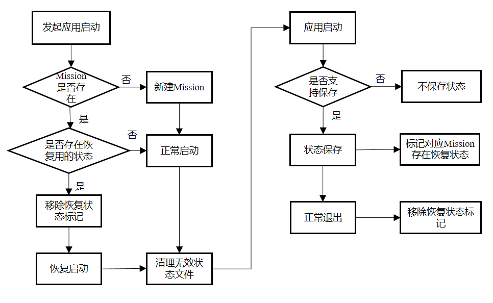
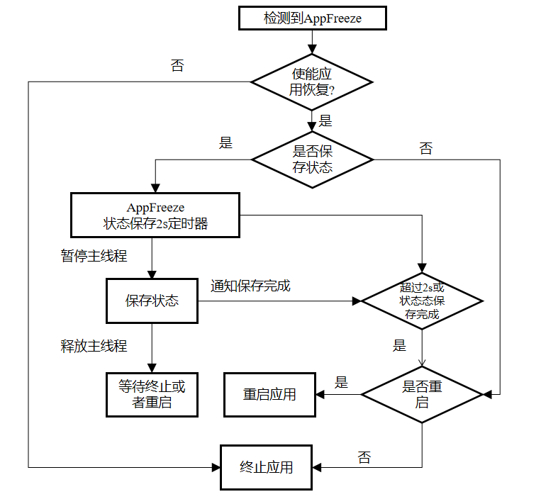
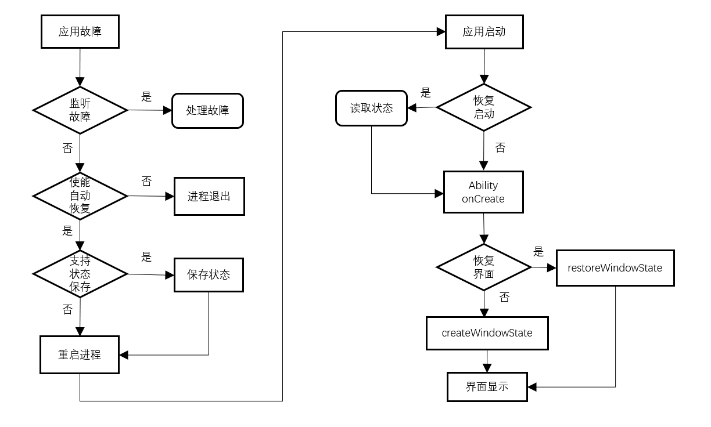

# 应用恢复开发指导

## 场景介绍

应用在运行中不可避免会产生一些非预期的行为，如运行时抛出未处理的异常和错误，违反框架的调用/运行约束等。

系统默认对异常的处理方式为进程退出，如果应用使用过程中产生了用户数据，直接退出可能会导致用户工作中断，数据丢失。

如果应用在[AbilityStage](../reference/apis-ability-kit/js-apis-app-ability-abilityStage.md#abilitystage)中使能[应用恢复功能](#应用恢复接口功能介绍)，并对临时数据进行保存，应用非预期退出后的下一次启动会恢复先前的状态和数据，给用户更连贯的使用体验。这里状态包括应用的页面栈以及onSaveState接口中保存的数据。

API 9上的应用恢复接口支持单Ability的Stage模型应用开发。支持JsError故障时的状态保存与自动重启。

API 10在API 9的基础上新增支持多Ability的Stage模型应用开发。支持AppFreeze故障时的状态保存回调。支持应用被管控模式杀死后，下次启动的状态恢复。

## 接口说明

应用故障恢复接口由appRecovery模块提供，开发者可以通过import引入，详见[开发步骤](#开发步骤)。

### 应用恢复接口功能介绍

| 接口名称 | 说明 |
| -------- | -------- |
| enableAppRecovery(restart?: RestartFlag, saveOccasion?: SaveOccasionFlag, saveMode?: SaveModeFlag) : void | 使能应用恢复功能，参数按顺序填入。该接口调用后，应用从启动器启动时第一个Ability支持恢复。 |
| saveAppState(): boolean | 主动保存当前应用中支持恢复的Ability的状态。 |
| restartApp(): void | 重启当前进程，并启动由**setRestartWant**指定的Ability，如果未指定，将重新拉起处于前台且支持恢复的Ability。 |
| saveAppState(context?: UIAbilityContext): boolean | 主动保存由Context指定的Ability状态。 |
| setRestartWant(want: Want): void | 设置主动调用**restartApp**以及**RestartFlag**不为**NO_RESTART**时重启的Ability。该Ability必须在同一个包名下，且必须为**UIAbility**。 |

由于上述接口可能在故障处理时使用，所以不会返回异常，需要开发者熟悉使用的场景。具体其各参数定义详见[参数说明](https://gitcode.com/openharmony/docs/blob/master/zh-cn/application-dev/reference/apis-ability-kit/js-apis-app-ability-appRecovery.md)。

**enableAppRecovery**：需要在应用初始化阶段调用，比如AbilityStage的OnCreate调用。

**saveAppState**：调用后框架会回调当前进程中所有支持恢复的Ability的onSaveState方法。如果在onSaveState方法中同意保存数据，则会将相关数据及Ability的页面栈持久化到应用的本地缓存。如果需要保存指定Ability，则需要指定Ability对应的Context。

**setRestartWant**：指定由appRecovery发起重启的Ability。

**restartApp**：调用后框架会杀死当前应用进程，并重新拉起由**setRestartWant**指定的Ability，其中启动原因为APP_RECOVERY。

API 9以及未使用**setRestartWant**指定Ability的场景，会拉起最后一个支持恢复且在前台的Ability，如果当前前台的Ability不支持恢复，则应用表现闪退。

如果重启的Ability存在已经保存的状态，这些状态数据会在Ability的OnCreate生命周期回调的want参数中作为wantParam属性传入。两次重启的间隔应大于一分钟，一分钟之内重复调用此接口只会退出应用不会重启应用。自动重启的行为与主动重启一致。

### 应用恢复状态管理示意

从API 10起，应用恢复的场景不仅局限于异常时自动重启。所以需要理解应用何时会加载恢复的状态。

简而言之，如果应用任务的上次退出不是由用户发起的，且应用存在用于恢复的状态，应用下一次由用户拉起时的启动原因会被设为APP_RECOVERY，并清理该任务的恢复状态。

应用恢复状态标识会在状态保存接口主动或者被动调用时设置。在应用正常退出或者应用异常退出重启后，该状态会被清理。正常退出目前包括用户按后退键退出以及用户清理最近任务。



### 应用卡死的状态保存及恢复

API 10开始支持应用卡死时的状态保存。JsError故障时，onSaveState接口在主线程进行回调。对于AppFreeze故障，主线程可能处于卡死的状态，onSaveState会在非主线程进行回调。其主要流程如下图：



由于卡死时的回调不在JS线程上执行，onSaveState回调中的代码建议不要使用import进来的Native动态库，禁止访问主线程创建的thread_local对象。

### 框架故障管理流程示意

故障管理是应用提升用户体验的重要手段。应用程序框架为开发者提供了故障监听、故障恢复、以及故障查询三种方式来管理应用的故障。

- 故障监听指的是通过[errorManager](../reference/apis-ability-kit/js-apis-app-ability-errorManager.md)注册[ErrorObserver](../reference/apis-ability-kit/js-apis-inner-application-errorObserver.md)，监听故障的发生，并通知到监听方。

- 故障恢复指的是[appRecovery](../reference/apis-ability-kit/js-apis-app-ability-appRecovery.md)，及故障发生后，将应用重启恢复到故障之前的状态。

- 故障查询指的是[faultLogger](../reference/apis-performance-analysis-kit/js-apis-faultLogger.md)通过其查询接口获取当前的故障信息。

下图中并没有标记faultLogger的调用时机，开发者可以根据应用启动时传入的[LastExitReason](../reference/apis-ability-kit/js-apis-app-ability-abilityConstant.md#lastexitreason)来决定是否调用faultLogger查询上次的故障信息。



这里建议应用开发者使用errorManager对应用的异常进行处理，处理完成后开发者可以选择调用状态保存接口并主动重启应用。

如果开发者没有注册ErrorObserver也没有使能应用恢复，则按照系统的默认逻辑执行进程退出。用户可以选择从启动器再次打开应用。

如果开发者使能应用恢复，框架会首先检查当前故障是否支持状态保存以及开发者是否配置了状态保存，如果支持则会回调Ability的[onSaveState](../reference/apis-ability-kit/js-apis-app-ability-uiAbility.md#onsavestate)的接口。最后重启应用。

### 应用故障管理接口支持场景

通常的故障类型有JS程序Crash、应用程序卡死、C++程序Crash。Crash故障时应用一般都会被关闭。Freeze故障为应用无响应卡屏场景。应用上层无需关注故障类型，底层恢复框架会根据故障类型来实现不同场景的故障管理。

| 故障名称 | 故障监听 | 状态保存 | 自动重启 | 日志查询 |
| -------- | -------- | -------- | -------- | -------- |
| [JS_CRASH](../reference/apis-performance-analysis-kit/js-apis-faultLogger.md#faulttype) | 支持 | 支持 | 支持 | 支持 |
| [APP_FREEZE](../reference/apis-performance-analysis-kit/js-apis-faultLogger.md#faulttype) | API18及以上支持 | 支持 | 支持 | 支持 |
| [CPP_CRASH](../reference/apis-performance-analysis-kit/js-apis-faultLogger.md#faulttype) | 不支持 | 不支持 | 不支持 | 支持 |

这里状态保存指的是故障时状态保存，对于应用卡死场景，开发者可以采用定时保存状态或者在Ability切入后台后自动保存的方式最大限度的保护用户数据。

## 开发步骤

### 使能开启自恢复特性

开发者需要在应用模块初始化时使能appRecovery功能。下面为示例的AbilityStage。

```ts
import { AbilityStage, appRecovery } from '@kit.AbilityKit';

export default class MyAbilityStage extends AbilityStage {
    onCreate() {
        console.info("[Demo] MyAbilityStage onCreate");
        appRecovery.enableAppRecovery(appRecovery.RestartFlag.ALWAYS_RESTART,
            appRecovery.SaveOccasionFlag.SAVE_WHEN_ERROR | appRecovery.SaveOccasionFlag.SAVE_WHEN_BACKGROUND,
            appRecovery.SaveModeFlag.SAVE_WITH_FILE);
    }
}
```

### 配置支持恢复的Ability

Ability的配置清单一般的名字为module.json5。

```json
{
    "abilities": [
      {
        "name": "EntryAbility",
        "recoverable": true,
      }]
}
```

### 数据保存和恢复

在使能appRecovery功能后，开发者可以在Ability中采用主动保存状态，主动恢复或者选择被动恢复的方式使用appRecovery功能。

下面为示例的EntryAbility。

**导包**

```ts
import { AbilityConstant, appRecovery, errorManager } from '@kit.AbilityKit';
```

**主动触发保存和恢复**

- 定义和注册[ErrorObserver](../reference/apis-ability-kit/js-apis-inner-application-errorObserver.md) callback，具体可参考[errorManager](../reference/apis-ability-kit/js-apis-app-ability-errorManager.md)里的使用方法。

```ts
import { appRecovery, errorManager, UIAbility } from '@kit.AbilityKit';
import { window } from '@kit.ArkUI';

let registerId = -1;
let callback: errorManager.ErrorObserver = {
    onUnhandledException(errMsg) {
    console.log(errMsg);
    appRecovery.saveAppState();
    appRecovery.restartApp();
    }
}

export default class EntryAbility extends UIAbility {
    onWindowStageCreate(windowStage: window.WindowStage) {
    // 为已创建的主窗口设置主页面
    console.log("[Demo] EntryAbility onWindowStageCreate");
    registerId = errorManager.on('error', callback);

    windowStage.loadContent("pages/index", (err, data) => {
        if (err.code) {
        console.error('Failed to load the content. Cause:' + JSON.stringify(err));
        return;
        }
        console.info('Succeeded in loading the content. Data: ' + JSON.stringify(data));
    })
    }
}
```

- 数据保存

callback触发appRecovery.saveAppState()调用后，会触发EntryAbility的onSaveState(state, wantParams)函数回调。

```ts
import { AbilityConstant, UIAbility } from '@kit.AbilityKit';

export default class EntryAbility extends UIAbility {
    onSaveState(state:AbilityConstant.StateType, wantParams: Record<string, Object>) {
        // Ability已调用以保存应用程序数据
        console.log("[Demo] EntryAbility onSaveState");
        wantParams["myData"] = "my1234567";
        return AbilityConstant.OnSaveResult.ALL_AGREE;
    }
}
```

- 数据恢复

callback触发后appRecovery.restartApp()调用后，应用会重启，重启后会走到EntryAbility的onCreate(want, launchParam)函数，保存的数据会在want参数的parameters里。

```ts
import { AbilityConstant, UIAbility, Want } from '@kit.AbilityKit';

let abilityWant: Want;

export default class EntryAbility extends UIAbility {
    storage: LocalStorage | undefined = undefined;

    onCreate(want: Want, launchParam: AbilityConstant.LaunchParam) {
        console.log("[Demo] EntryAbility onCreate");
        abilityWant = want;
        if (launchParam.launchReason == AbilityConstant.LaunchReason.APP_RECOVERY) {
            this.storage = new LocalStorage();
            if (want.parameters) {
                let recoveryData = want.parameters["myData"];
                this.storage.setOrCreate("myData", recoveryData);
                this.context.restoreWindowStage(this.storage);
            }
        }
    }
}
```

- 取消注册ErrorObserver callback

```ts
import { errorManager, UIAbility } from '@kit.AbilityKit';

let registerId = -1;

export default class EntryAbility extends UIAbility {
    onWindowStageDestroy() {
        // 销毁主窗口，释放相关UI资源
        console.log("[Demo] EntryAbility onWindowStageDestroy");

        errorManager.off('error', registerId, (err) => {
            console.error("[Demo] err:", err);
        });
    }
}
```

**被动保存和恢复**

被动保存和恢复依赖恢复框架底层触发，无需注册监听ErrorObserver callback，只需实现Ability的onSaveState接口数据保存和onCreate接口数据恢复流程即可。

```ts
import { AbilityConstant, UIAbility, Want } from '@kit.AbilityKit';

let abilityWant: Want;

export default class EntryAbility extends UIAbility {
    storage: LocalStorage | undefined = undefined
    onCreate(want: Want, launchParam: AbilityConstant.LaunchParam) {
    console.log("[Demo] EntryAbility onCreate");
        abilityWant = want;
        if (launchParam.launchReason == AbilityConstant.LaunchReason.APP_RECOVERY) {
            this.storage = new LocalStorage();
            if (want.parameters) {
                let recoveryData = want.parameters["myData"];
                this.storage.setOrCreate("myData", recoveryData);
                this.context.restoreWindowStage(this.storage);
            }
        }
    }

    onSaveState(state:AbilityConstant.StateType, wantParams: Record<string, Object>) {
        // Ability已调用以保存应用程序数据
        console.log("[Demo] EntryAbility onSaveState");
        wantParams["myData"] = "my1234567";
        return AbilityConstant.OnSaveResult.ALL_AGREE;
    }
}
```

**故障Ability的重启恢复标记**

发生故障的Ability再次重新启动时，在调度onCreate生命周期里，参数want的parameters成员会有[ABILITY_RECOVERY_RESTART](../reference/apis-ability-kit/js-apis-app-ability-wantConstant.md#params)标记数据，并且值为true。

```ts
import { AbilityConstant, UIAbility, Want, wantConstant } from '@kit.AbilityKit';

export default class EntryAbility extends UIAbility {
    onCreate(want: Want, launchParam: AbilityConstant.LaunchParam) {
        if (want.parameters === undefined) {
            return;
        }
        if (want.parameters[wantConstant.Params.ABILITY_RECOVERY_RESTART] != undefined &&
            want.parameters[wantConstant.Params.ABILITY_RECOVERY_RESTART] == true) {
            console.log("This ability need to recovery");
        }
    }
}
```
