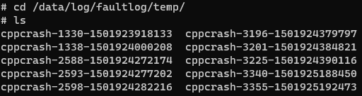
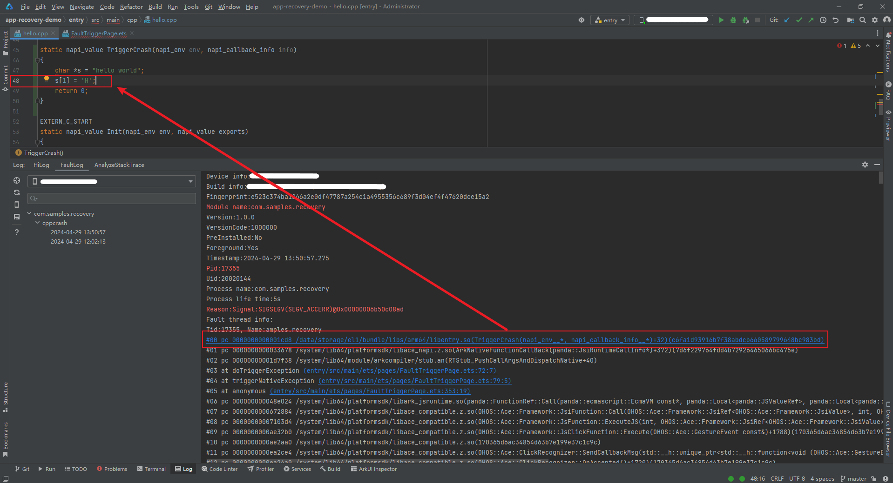
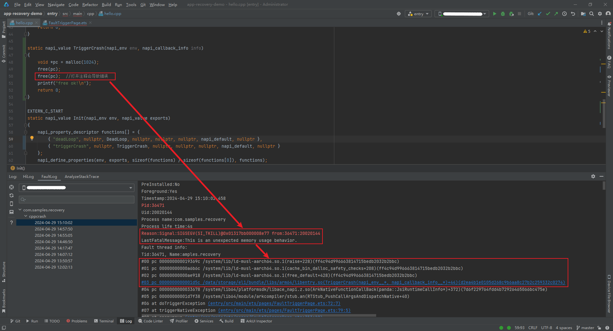
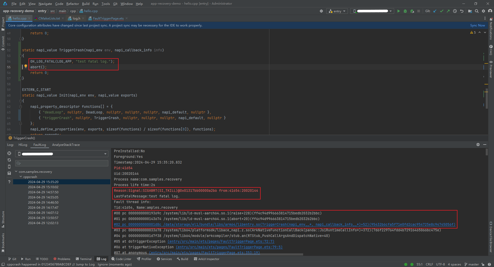
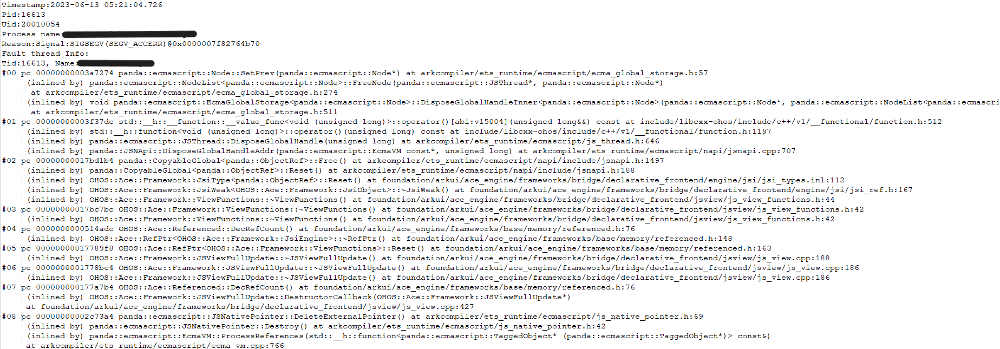
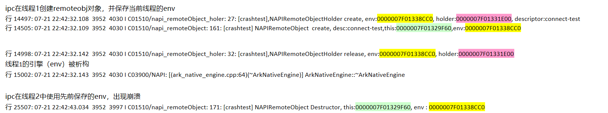
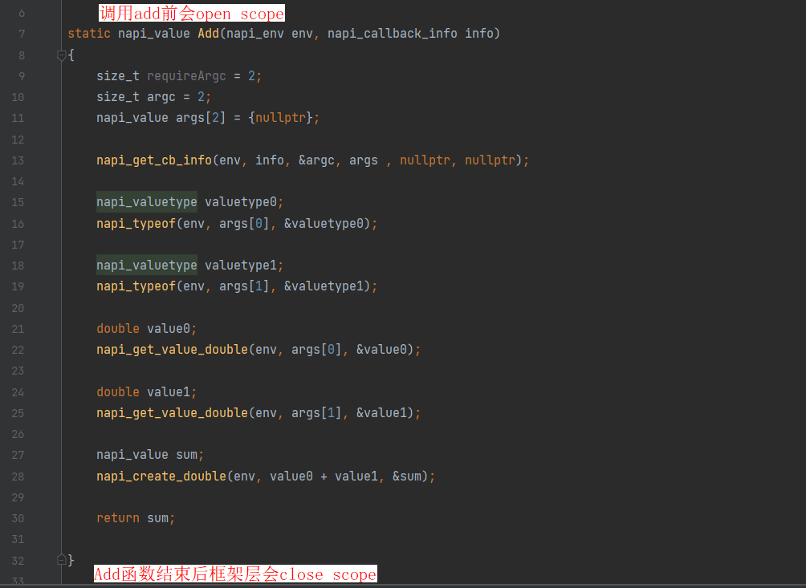
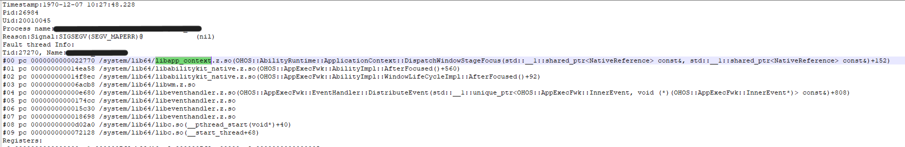
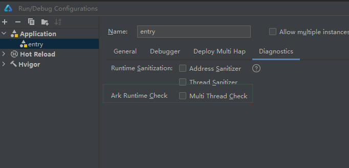

# 分析CppCrash（进程崩溃）

进程崩溃指C/C++运行时崩溃。FaultLogger模块提供进程崩溃故障检测、日志采集、日志存储、日志上报的能力，为开发者提供详细的维测日志以辅助故障定位。

本文将分别介绍进程崩溃检测能力、崩溃问题定位分析思路，以及具体的案例分析。在使用本指导分析处理崩溃日志前，需要开发者了解C/C++程序堆栈信息的基础知识。

## Cpp Crash异常检测能力

进程崩溃基于posix信号机制，目前主要支持对以下崩溃异常信号的处理：

| 信号值(signo) | 信号 | 解释 | 触发原因 |
| -------- | -------- | -------- | -------- |
| 4 | SIGILL | 非法指令。 | 进程执行了非法、格式错误、未知或特权指令。 |
| 5 | SIGTRAP | 断点或陷阱异常。 | 异常或trap指令发生。 |
| 6 | SIGABRT | 进程终止。 | 进程异常终止，通常为进程自身调用标准函数库的abort()函数。 |
| 7 | SIGBUS | 非法内存访问。 | 进程访问了对齐或者不存在的物理地址。 |
| 8 | SIGFPE | 浮点异常。 | 进程执行了错误的算术运算，如除数为0、浮点溢出、整数溢出等。 |
| 11 | SIGSEGV | 无效内存访问。 | 进程访问了无效内存引用。 |
| 16 | SIGSTKFLT | 栈错误。 | 处理器执行了错误的栈操作，如栈空时弹出、栈满时压入。 |
| 31 | SIGSYS | 错误的系统调用。 | 系统调用时使用了错误或非法参数。 |

以上部分故障信号，根据具体的场景还有二级分类(code)：  
SIGILL是一个在Unix和类Unix操作系统中的信号，它表示非法指令异常。SIGILL信号通常由以下几种类型的问题场景引起：
| 二级分类 | 信号字符串 | 解释 | 触发原因 |
| -------- | -------- | -------- | -------- |
| 1 | ILL_ILLOPC | 非法操作码异常。 | 这种异常通常发生在执行不被CPU支持的指令时，或者在尝试执行特权指令时。 |
| 2 | ILL_ILLOPN | 非法操作数异常。 | 这种异常通常发生在指令使用了不正确的操作数，或者是操作数的类型不正确时。|
| 3 | ILL_ILLADR | 非法地址异常。 | 这种异常通常发生在程序尝试访问无效的内存地址时，或者是在尝试执行未对齐的内存访问时。|
| 4 | ILL_ILLTRP | 非法陷阱异常。 | 这种异常通常发生在程序尝试执行一个非法的陷阱指令时，或者是在尝试执行一个未定义的操作时。|
| 5 | ILL_PRVOPC | 特权操作码异常。 | 这种异常通常发生在普通用户尝试执行特权指令时。|
| 6 | ILL_PRVREG | 特权寄存器异常。 | 这种异常通常发生在普通用户尝试访问特权寄存器时。|
| 7 | ILL_COPROC | 协处理器异常。 | 这种异常通常发生在程序尝试使用未定义的协处理器指令时。|
| 8 | ILL_BADSTK | 无效的堆栈异常。 | 这种异常通常发生在程序尝试在无效的堆栈地址上执行操作时，或者是在堆栈溢出时。|

SIGTRAP信号通常用于调试和跟踪程序的执行。下面是上面列出的四种SIGTRAP信号类别的问题场景介绍：
| 二级分类 | 信号字符串 | 解释 | 触发原因 |
| -------- | -------- | -------- | -------- |
| 1 | TRAP_BRKPT | 软件断点。 | 这个信号是由软件断点引起的，当程序执行到设置的断点时会触发该信号。软件断点通常用于调试程序，可以在程序的关键位置设置断点，以便在调试时暂停程序的执行并检查变量值等信息。|
| 2 | TRAP_TRACE | 单步调试。 | 这个信号是由单步执行引起的，当程序执行单个指令时会触发该信号。单步执行通常用于调试程序，可以逐步执行程序并检查每个指令的执行结果。|
| 3 | TRAP_BRANCH | 分支跟踪。 | 这个信号是由分支指令引起的，当程序执行分支指令时会触发该信号。分支指令通常用于控制程序的执行流程，例如if语句和循环语句等。|
| 4 | TRAP_HWBKPT | 硬件断点。 | 这个信号是由硬件断点引起的，当程序执行到设置的硬件断点时会触发该信号。硬件断点通常用于调试程序，可以在程序的关键位置设置断点，以便在调试时暂停程序的执行并检查变量值等信息。与软件断点不同的是，硬件断点是由CPU硬件实现的，因此可以在程序执行过程中实时检测断点是否被触发。|

SIGBUS是一种由操作系统向进程发送的信号，通常表示内存访问错误。其中，不同的信号类别表示不同的错误场景：

| 二级分类 | 信号字符串 | 解释 | 触发原因 |
| -------- | -------- | -------- | -------- |
| 1 | BUS_ADRALN | 内存地址对齐错误。 | 这种错误通常发生在尝试访问未对齐的内存地址时，例如尝试访问一个4字节整数的非偶数地址。|
| 2 | BUS_ADRERR | 非法内存地址错误。 | 这种错误通常发生在尝试访问不属于进程地址空间的内存地址时，例如尝试访问一个空指针。|
| 3 | BUS_OBJERR | 对象访问错误。 | 这种错误通常发生在尝试访问一个已经被删除或未初始化的对象时。|
| 4 | BUS_MCEERR_AR | 硬件内存校验错误。 | 发生在访问内存时检测到校验和错误。|
| 5 | BUS_MCEERR_AO | 硬件内存校验错误。 | 发生在访问内存时检测到地址和校验和错误。|

SIGFPE是一个信号，它表示浮点异常或算术异常。下面是这些SIGFPE信号类别的问题场景：

| 二级分类 | 信号字符串 | 解释 | 触发原因 |
| -------- | -------- | -------- | -------- |
| 1 | FPE_INTDIV | 整数除法错误。 | 这个信号表示整数除法中的除数为零的情况。当一个程序尝试进行整数除法，但除数为零时，会发出这个信号。|
| 2 | FPE_INTOVF | 整数溢出错误。 | 这个信号表示整数除法中的除数为负数的情况。当一个程序尝试进行整数除法，但除数为负数时，会发出这个信号。|
| 3 | FPE_FLTDIV | 浮点除法错误。 | 这个信号表示浮点数除法中的除数为零的情况。当一个程序尝试进行浮点数除法，但除数为零时，会发出这个信号。|
| 4 | FPE_FLTOVF | 浮点溢出错误。 | 这个信号表示浮点数除法中的除数为负数的情况。当一个程序尝试进行浮点数除法，但除数为负数时，会发出这个信号。|
| 5 | FPE_FLTUND | 浮点下溢错误。 | 这个信号表示浮点数除法中的除数为零的情况。当一个程序尝试进行浮点数除法，但除数为零时，会发出这个信号。|
| 6 | FPE_FLTRES | 浮点结果未定义错误。 | 这个信号表示浮点数除法中的除数为正数的情况。当一个程序尝试进行浮点数除法，但除数为正数时，会发出这个信号。|
| 7 | FPE_FLTINV | 无效浮点操作错误。 | 这个信号表示浮点数除法中的除数为负数的情况。当一个程序尝试进行浮点数除法，但除数为负数时，会发出这个信号。|
| 8 | FPE_FLTSUB | 浮点陷阱错误。 | 这个信号表示浮点数除法中的除数为零的情况。当一个程序尝试进行浮点数除法，但除数为零时，会发出这个信号。|

SIGSEGV是一种信号，它表示进程试图访问一个不属于它的内存地址，或者试图访问一个已被操作系统标记为不可访问的内存地址。SIGSEGV信号通常是由以下两种情况引起的：

| 二级分类 | 信号字符串 | 解释 | 触发原因 |
| -------- | -------- | -------- | -------- |
| 1 | SEGV_MAPERR | 不存在的内存地址。 | 进程试图访问一个不存在的内存地址，或者试图访问一个没有映射到进程地址空间的内存地址。这种情况通常是由于程序中的指针错误或内存泄漏引起的。|
| 2 | SEGV_ACCERR | 不可访问的内存地址。 | 进程试图访问一个已被操作系统标记为不可访问的内存地址，例如只读内存或没有执行权限的内存。这种情况通常是由于程序中的缓冲区溢出或者试图修改只读内存等错误引起的。|

二级分类(code)除了以上根据信号值(signo)维度分类，还可以根据信号产生的原因维度分类。其中根据信号值(signo)维度分类是每个信号值(signo)特有的，根据信号产生的原因维度分类是所有信号值(signo)共有的，当前已有信号产生原因分类的code值如下：

| 二级分类 | 信号字符串 | 解释 | 触发原因 |
| -------- | -------- | -------- | -------- |
| 0 | SI_USER | 用户空间信号。 |该信号是由用户空间的进程发送给另一个进程的，通常是通过 kill() 系统调用发送的。例如，当用户在终端中按下Ctrl+C时，会发送一个SIGINT信号给前台进程组中的所有进程。|
| 0x80 | SI_KERNEL | 内核信号。 |该信号是由内核发送给进程的，通常是由内核检测到某些错误或异常情况时发出的。例如，当进程访问无效的内存地址或者执行非法指令时，内核会发送一个SIGSEGV信号给进程。|
| -1 | SI_QUEUE | sigqueue()函数信号。 |该信号是由sigqueue()系统调用发送的，可以携带一个附加的整数值和一个指针。通常用于进程间高级通信，例如传递数据或者通知进程某个事件已经发生。|
| -2 | SI_TIMER | 定时器信号。 |该信号是由定时器发送的，通常用于定时任务或者周期性任务的执行。例如，当一个定时器到期时，内核会向进程发送一个SIGALRM信号。|
| -3 | SI_MESGQ | 消息队列信号。 |该信号是由消息队列发送的，通常用于进程间通信。例如，当一个进程向一个消息队列发送消息时，内核会向接收进程发送一个SIGIO信号。|
| -4 | SI_ASYNCIO | 异步I/O信号。 |该信号是由异步I/O操作发送的，通常用于非阻塞I/O操作。例如，当一个文件描述符上的I/O操作完成时，内核会向进程发送一个SIGIO信号。|
| -5 | SI_SIGIO | 同步I/O信号。 |该信号是由异步I/O操作发送的，通常用于非阻塞I/O操作。例如，当一个文件描述符上的I/O操作完成时，内核会向进程发送一个SIGIO信号。|
| -6 | SI_TKILL | tkill()函数信号。 |该信号是由tkill()系统调用发送的，与kill()系统调用类似，但是可以指定发送信号的线程ID。通常用于多线程程序中，向指定线程发送信号。|

## 问题定位步骤与思路

### 崩溃日志获取

进程崩溃日志是一种故障日志，与应用无响应日志、JS应用崩溃等都由FaultLogger模块进行管理，可通过以下方式获取：

- 方式一：通过DevEco Studio获取日志

    DevEco Studio会收集设备`/data/log/faultlog/faultlogger/`路径下的进程崩溃故障日志到FaultLog下，根据进程名和故障和时间分类显示。获取日志的方法参见：<!--RP1-->[DevEco Studio使用指南-FaultLog](https://developer.huawei.com/consumer/cn/doc/harmonyos-guides-V5/ide-fault-log-V5)<!--RP1End-->。

- 方式二：通过hiAppEvent接口订阅

    hiAppEvent 提供了故障订阅接口，可以订阅各类故障打点，详见[HiAppEvent介绍](hiappevent-intro.md)。

<!--Del-->
- 方式三：设备ROOT模式下通过shell获取日志

    1. 进程崩溃后，系统会在设备`/data/log/faultlog/temp/`路径下的故障日志，其文件名格式为`cppcrash-进程PID-系统毫秒级时间戳`，日志内容包含进程崩溃调用栈，进程崩溃现场寄存器、栈内存、maps，进程文件句柄列表等信息。

        

        通过Shell获取的`/data/log/faultlog/temp`获取到的日志内容格式如下：

        ```text
        Timestamp:2024-05-06 20:10:51.000  <- 故障发生时间戳
        Pid:9623                           <- 进程号
        Uid:0                              <- 用户ID
        Process name:./crasher_cpp         <- 进程名称
        Process life time:1s               <- 进程存活时间
        Reason:Signal:SIGSEGV(SEGV_MAPERR)@0x00000004  probably caused by NULL pointer dereference   <- 故障原因和空指针提示
        Fault thread info:
        Tid:9623, Name:crasher_cpp         <- 故障线程号，线程名
        #00 pc 00008d22 /system/bin/crasher_cpp(TestNullPointerDereferenceCrash0()+22)(adfc673300571d2da1e47d1d12f48b44)  <- 调用栈
        #01 pc 000064d1 /system/bin/crasher_cpp(DfxCrasher::ParseAndDoCrash(char const*) const+160)(adfc673300571d2da1e47d1d12f48b44)
        #02 pc 00006569 /system/bin/crasher_cpp(main+92)(adfc673300571d2da1e47d1d12f48b44)
        #03 pc 00072b98 /system/lib/ld-musl-arm.so.1(libc_start_main_stage2+56)(d820b1827e57855d4f9ed03ba5dfea83)
        #04 pc 00004e28 /system/bin/crasher_cpp(_start_c+84)(adfc673300571d2da1e47d1d12f48b44)
        #05 pc 00004dcc /system/bin/crasher_cpp(adfc673300571d2da1e47d1d12f48b44)
        Registers:   <- 故障现场寄存器
        r0:ffffafd2 r1:00000004 r2:00000001 r3:00000000
        r4:ffd27e39 r5:0096e000 r6:00000a40 r7:0096fdfc
        r8:f7ba58d5 r9:f7baea86 r10:f7cadd38
        fp:ffd27308 ip:f7cb2078 sp:ffd272a0 lr:f7c7ab98 pc:0096ad22
        Memory near registers:  <-  故障现场寄存器附近内存
        r4([stack]):
            ffd27e30 72656873
            ffd27e34 7070635f
            ...
            ffd27eac 3d73746f
        r5(/system/bin/crasher_cpp):
            0096dff8 00000000
            0096dffc 0096717d
            ...
            0096e074 00000000
        r7(/system/lib/ld-musl-arm.so.1):
            f7cabb58 00000000
            f7cabb5c 0034ba00
            ...
            f7cabbd4 00000000
        r8(/system/lib/ld-musl-arm.so.1):
            f7ba58cc 63637573
            f7ba58d0 2e737365
            ...
            f7ba5948 70206269
        r9(/system/lib/ld-musl-arm.so.1):
            f7baea7c 20746f6e
            f7baea80 6e756f66
            ...
            f7baeaf8 25206e69
        r10([anon:ld-musl-arm.so.1.bss]):
            f7cadd30 00000000
            f7cadd34 00000000
            ...
            f7caddac 00000000
        r12([anon:ld-musl-arm.so.1.bss]):
            f7cb2070 56726562
            f7cb2074 65756c61
            ...
            f7cb20ec 00000000
        sp([stack]):
            ffd27328 00000000
            ffd2732c 00966dd0
            ...
            ffd273a4 00000004
        pc(/system/bin/crasher_cpp):
            00966dc8 e1a0d00c
            00966dcc eb000000
            ...
            00966e44 e5907008
        pc(/system/bin/crasher_cpp):
            00966dc8 e1a0d00c
            00966dcc eb000000
            ...
            00966e44 e5907008
        FaultStack:   <- 崩溃线程的栈地址空间
            ffd27260 00000000
            ffd27264 f7cac628
            ...
            ffd2729c 0096ad1f
        sp0:ffd272a0 0096fdfc <- #00栈顶
            ffd272a4 009684d3
        sp1:ffd272a8 00000001
            ffd272ac 73657408
            ffd272b0 f7590074
            ...
            ffd272dc 0096856d
        sp2:ffd272e0 ffd27334
            ffd272e4 ffd27334
            ffd272e8 00000002
            ....
            ffd272f4 f7bfbb9c
        sp3:ffd272f8 00000000
            ffd272fc ffd27334

        Maps:   <-  故障时进程maps
        962000-966000 r--p 00000000 /system/bin/crasher_cpp
        966000-96c000 r-xp 00003000 /system/bin/crasher_cpp
        96c000-96f000 r--p 00008000 /system/bin/crasher_cpp
        96f000-970000 rw-p 0000a000 /system/bin/crasher_cpp
        149f000-14a0000 ---p 00000000 [heap]
        14a0000-14a2000 rw-p 00000000 [heap]
        ...
        f7b89000-f7be1000 r--p 00000000 /system/lib/ld-musl-arm.so.1
        f7be1000-f7ca9000 r-xp 00057000 /system/lib/ld-musl-arm.so.1
        f7ca9000-f7cab000 r--p 0011e000 /system/lib/ld-musl-arm.so.1
        f7cab000-f7cad000 rw-p 0011f000 /system/lib/ld-musl-arm.so.1
        f7cad000-f7cbc000 rw-p 00000000 [anon:ld-musl-arm.so.1.bss]
        ffd07000-ffd28000 rw-p 00000000 [stack]
        ffff0000-ffff1000 r-xp 00000000 [vectors]
        OpenFiles:   <-  故障时进程打开文件Fd信息
        0->/dev/pts/1 native object of unknown type 0
        1->/dev/pts/1 native object of unknown type 0
        2->/dev/pts/1 native object of unknown type 0
        3->socket:[67214] native object of unknown type 0
        ...
        11->pipe:[67219] native object of unknown type 0
        12->socket:[29074] native object of unknown type 0
        25->/dev/ptmx native object of unknown type 0
        26->/dev/ptmx native object of unknown type 0
        ```

    2. CppCrash故障会同步在`/data/log/faultlog/faultlogger/`路径下生成一份完善日志，故障日志文件名格式为`cppcrash-进程名-进程UID-毫秒级时间.log`，日志内容较`/data/log/faultlog/temp`下日志更加完善，增加有设备名，系统版本，进程流水日志等信息。

        
<!--DelEnd-->

**日志格式 - 空指针故障场景**

该场景会在日志中打印出提示信息，表明故障很有可能是因为空指针解引用导致。以下是一份DevEco Studio归档在FaultLog的进程崩溃日志的核心内容。

```text
Generated by HiviewDFX@OpenHarmony
================================================================
Device info:OpenHarmony 3.2        <- 设备信息
Build info:OpenHarmony 5.0.0.23    <- 版本信息
Fingerprint:cdf52fd0cc328fc432459928f3ed8edfe8a72a92ee7316445143bed179138073 <- 标识故障特征
Module name:crasher_cpp            <- 模块名
Timestamp:2024-05-06 20:10:51.000  <- 故障发生时间戳
Pid:9623   <- 进程号
Uid:0         <- 用户ID
Process name:./crasher_cpp         <- 进程名称
Process life time:1s               <- 进程存活时间
Reason:Signal:SIGSEGV(SEGV_MAPERR)@0x00000004  probably caused by NULL pointer dereference   <- 故障原因和空指针提示
Fault thread info:
Tid:9623, Name:crasher_cpp         <- 故障线程号，线程名
#00 pc 00008d22 /system/bin/crasher_cpp(TestNullPointerDereferenceCrash0()+22)(adfc673300571d2da1e47d1d12f48b44)  <- 调用栈
#01 pc 000064d1 /system/bin/crasher_cpp(DfxCrasher::ParseAndDoCrash(char const*) const+160)(adfc673300571d2da1e47d1d12f48b44)
#02 pc 00006569 /system/bin/crasher_cpp(main+92)(adfc673300571d2da1e47d1d12f48b44)
#03 pc 00072b98 /system/lib/ld-musl-arm.so.1(libc_start_main_stage2+56)(d820b1827e57855d4f9ed03ba5dfea83)
#04 pc 00004e28 /system/bin/crasher_cpp(_start_c+84)(adfc673300571d2da1e47d1d12f48b44)
#05 pc 00004dcc /system/bin/crasher_cpp(adfc673300571d2da1e47d1d12f48b44)
Registers:   <- 故障现场寄存器
r0:ffffafd2 r1:00000004 r2:00000001 r3:00000000
r4:ffd27e39 r5:0096e000 r6:00000a40 r7:0096fdfc
r8:f7ba58d5 r9:f7baea86 r10:f7cadd38
fp:ffd27308 ip:f7cb2078 sp:ffd272a0 lr:f7c7ab98 pc:0096ad22
Memory near registers:  <-  故障现场寄存器附近内存
r4([stack]):
    ffd27e30 72656873
    ffd27e34 7070635f
    ...
    ffd27eac 3d73746f
r5(/system/bin/crasher_cpp):
    0096dff8 00000000
    0096dffc 0096717d
    ...
    0096e074 00000000
r7(/system/lib/ld-musl-arm.so.1):
    f7cabb58 00000000
    f7cabb5c 0034ba00
    ...
    f7cabbd4 00000000
r8(/system/lib/ld-musl-arm.so.1):
    f7ba58cc 63637573
    f7ba58d0 2e737365
    ...
    f7ba5948 70206269
r9(/system/lib/ld-musl-arm.so.1):
    f7baea7c 20746f6e
    f7baea80 6e756f66
    ...
    f7baeaf8 25206e69
r10([anon:ld-musl-arm.so.1.bss]):
    f7cadd30 00000000
    f7cadd34 00000000
    ...
    f7caddac 00000000
r12([anon:ld-musl-arm.so.1.bss]):
    f7cb2070 56726562
    f7cb2074 65756c61
    ...
    f7cb20ec 00000000
sp([stack]):
    ffd27328 00000000
    ffd2732c 00966dd0
    ...
    ffd273a4 00000004
pc(/system/bin/crasher_cpp):
    00966dc8 e1a0d00c
    00966dcc eb000000
    ...
    00966e44 e5907008
pc(/system/bin/crasher_cpp):
    00966dc8 e1a0d00c
    00966dcc eb000000
    ...
    00966e44 e5907008
FaultStack:   <- 崩溃线程的栈地址空间
    ffd27260 00000000
    ffd27264 f7cac628
    ...
    ffd2729c 0096ad1f
sp0:ffd272a0 0096fdfc <- #00栈顶
    ffd272a4 009684d3
sp1:ffd272a8 00000001
    ffd272ac 73657408
    ffd272b0 f7590074
    ...
    ffd272dc 0096856d
sp2:ffd272e0 ffd27334
    ffd272e4 ffd27334
    ffd272e8 00000002
    ....
    ffd272f4 f7bfbb9c
sp3:ffd272f8 00000000
    ffd272fc ffd27334

Maps:   <-  故障时进程maps
962000-966000 r--p 00000000 /system/bin/crasher_cpp
966000-96c000 r-xp 00003000 /system/bin/crasher_cpp
96c000-96f000 r--p 00008000 /system/bin/crasher_cpp
96f000-970000 rw-p 0000a000 /system/bin/crasher_cpp
149f000-14a0000 ---p 00000000 [heap]
14a0000-14a2000 rw-p 00000000 [heap]
...
f7b89000-f7be1000 r--p 00000000 /system/lib/ld-musl-arm.so.1
f7be1000-f7ca9000 r-xp 00057000 /system/lib/ld-musl-arm.so.1
f7ca9000-f7cab000 r--p 0011e000 /system/lib/ld-musl-arm.so.1
f7cab000-f7cad000 rw-p 0011f000 /system/lib/ld-musl-arm.so.1
f7cad000-f7cbc000 rw-p 00000000 [anon:ld-musl-arm.so.1.bss]
ffd07000-ffd28000 rw-p 00000000 [stack]
ffff0000-ffff1000 r-xp 00000000 [vectors]
OpenFiles:   <-  故障时进程打开文件Fd信息
0->/dev/pts/1 native object of unknown type 0
1->/dev/pts/1 native object of unknown type 0
2->/dev/pts/1 native object of unknown type 0
3->socket:[67214] native object of unknown type 0
...
11->pipe:[67219] native object of unknown type 0
12->socket:[29074] native object of unknown type 0
25->/dev/ptmx native object of unknown type 0
26->/dev/ptmx native object of unknown type 0

HiLog:   <-  故障时的Hilog日志
05-06 20:10:51.301  9623  9623 E C03f00/MUSL-SIGCHAIN: signal_chain_handler call 2 rd sigchain action for signal: 11
05-06 20:10:51.306  9623  9623 I C02d11/DfxSignalHandler: DFX_SigchainHandler :: sig(11), pid(9623), tid(9623).
05-06 20:10:51.307  9623  9623 I C02d11/DfxSignalHandler: DFX_SigchainHandler :: sig(11), pid(9623), processName(./crasher_cpp), threadName(crasher_cpp).
05-06 20:10:51.389  9623  9623 I C02d11/DfxSignalHandler: processdump have get all resgs

```

**日志格式 - 栈溢出故障场景**

该场景会在日志中打印出提示信息，表明故障很有可能是因为栈溢出导致。以下是一份DevEco Studio归档在FaultLog的进程崩溃日志的核心内容。

```text
Generated by HiviewDFX@OpenHarmony
================================================================
Device info:OpenHarmony 3.2            <- 设备信息
Build info:OpenHarmony 5.0.0.23        <- 版本信息
Fingerprint:8bc3343f50024204e258b8dce86f41f8fcc50c4d25d56b24e71fe26c0a23e321  <- 标识故障特征
Module name:crasher_cpp                <- 模块名
Timestamp:2024-05-06 20:18:24.000      <- 故障发生时间戳
Pid:9838                               <- 进程号
Uid:0                                  <- 用户ID
Process name:./crasher_cpp             <- 进程名称
Process life time:2s                   <- 进程存活时间
Reason:Signal:SIGSEGV(SEGV_ACCERR)@0xf76b7ffc  current thread stack low address = 0xf76b8000, probably caused by stack-buffer-overflow    <- 故障原因和栈溢出提示
...
```

**日志格式 - 栈覆盖故障场景**

在栈覆盖场景下，由于栈上内存被踩，无法成功回溯栈帧，该场景会在日志中打印出提示信息，说明回栈失败并尝试从线程栈里解析获取不可靠的调用栈，尽可能提供开发者信息以分析问题。以下是一份DevEco Studio归档在FaultLog的进程崩溃日志的核心内容。

```text
Generated by HiviewDFX@OpenHarmony
================================================================
Device info:OpenHarmony 3.2               <- 设备信息
Build info:OpenHarmony 5.0.0.23           <- 版本信息
Fingerprint:79b6d47b87495edf27135a83dda8b1b4f9b13d37bda2560d43f2cf65358cd528    <- 标识故障特征
Module name:crasher_cpp                   <- 模块名
Timestamp:2024-05-06 20:27:23.2035266415  <- 故障发生时间戳
Pid:10026                                 <- 进程号
Uid:0                                     <- 用户ID
Process name:./crasher_cpp                <- 进程名称
Process life time:1s                      <- 进程存活时间
Reason:Signal:SIGSEGV(SEGV_MAPERR)@0000000000  probably caused by NULL pointer dereference      <- 故障原因
Fault thread info:
Tid:10026, Name:crasher_cpp               <- 故障线程号，线程名
#00 pc 00000000 Not mapped
#01 pc 00008d22 /system/bin/crasher_cpp(TestNullPointerDereferenceCrash0()+22)(adfc673300571d2da1e47d1d12f48b44)  <- 调用栈
#02 pc 000064d1 /system/bin/crasher_cpp(DfxCrasher::ParseAndDoCrash(char const*) const+160)(adfc673300571d2da1e47d1d12f48b44)
#03 pc 00006569 /system/bin/crasher_cpp(main+92)(adfc673300571d2da1e47d1d12f48b44)
#04 pc 00072b98 /system/lib/ld-musl-arm.so.1(libc_start_main_stage2+56)(d820b1827e57855d4f9ed03ba5dfea83)
Registers:   <- 故障现场寄存器
r0:ffffafd2 r1:00000004 r2:00000001 r3:00000000
r4:ffd27e39 r5:0096e000 r6:00000a40 r7:0096fdfc
r8:f7ba58d5 r9:f7baea86 r10:f7cadd38
fp:ffd27308 ip:f7cb2078 sp:ffd272a0 lr:f7c7ab98 pc:0096ad22
ExtraCrashInfo(Unwindstack):   <- 系统框架业务自定义打印回栈相关信息
Failed to unwind stack, try to get unreliable call stack from #02 by reparsing thread stack   <- 尝试从线程栈里获取不可靠的堆栈
...
```

**日志格式 - 异步线程场景故障**

（目前支持ARM64架构，且在调试应用（HAP_DEBUGGABLE）下开启）当异步线程发生崩溃后，把提交该异步任务的线程的栈也打印出来，帮助定位由于异步任务提交者造成的崩溃问题。崩溃线程的调用栈和其提交线程的调用栈用SubmitterStacktrace分割开。以下是一份DevEco Studio归档在FaultLog的进程崩溃日志的核心内容。

```text
Generated by HiviewDFX@OpenHarmony
================================================================
Device info:OpenHarmony 3.2                 <- 设备信息
Build info:OpenHarmony 5.0.0.23             <- 版本信息
Fingerprint:8bc3343f50024204e258b8dce86f41f8fcc50c4d25d56b24e71fe26c0a23e321  <- 标识故障特征
Module name:crasher_cpp                     <- 模块名
Timestamp:2024-05-06 20:28:24.000           <- 故障发生时间戳
Pid:9838                                    <- 进程号
Uid:0                                       <- 用户ID
Process name:./crasher_cpp                  <- 进程名称
Process life time:2s                        <- 进程存活时间
Reason:Signal:SIGSEGV(SI_TKILL)@0x000000000004750  from:18256:0  <- 故障原因
Fault thread info:
Tid:18257, Name:crasher_cpp                 <- 故障线程号，线程名
#00 pc 000054e6 /system/bin/ld-musl-aarch64.so.l(raise+228)(adfc673300571d2da1e47d1d12f48b44)  <- 调用栈
#01 pc 000054f9 /system/bin/crasher_cpp(CrashInSubThread(void*)+56)(adfc673300571d2da1e47d1d12f48b50)
#02 pc 000054f9 /system/bin/ld-musl-aarch64.so.l(start+236)(adfc673300571d2da1e47d1d12f48b44)
========SubmitterStacktrace========       <- 任务异常时打印任务提交者调用栈
#00 pc 000094dc /system/bin/crasher_cpp(DfxCrasher::AsyncStacktrace()+36)(adfc673300571d2da1e47d1d12f48b50)
#01 pc 00009a58 /system/bin/crasher_cpp(DfxCrasher::ParseAndDoCrash(char const*) const+232)(adfc673300571d2da1e47d1d12f48b50)
#02 pc 00009b40 /system/bin/crasher_cpp(main+140)(adfc673300571d2da1e47d1d12f48b50)
#03 pc 0000a4e1c /system/bin/ld-musl-aarch64.so.l(libc_start_main_stage2+68)(adfc673300571d2da1e47d1d12f48b44)
...
```

**日志格式 - 打印系统框架业务自定义信息**

（目前支持ARM64架构）当进程发生崩溃后，支持打印出系统框架业务自定义的维测信息，帮助开发者定位问题，目前支持字符串类型、内存类型、回调类型、回栈类型信息打印。从API 18开始LastFatalMessage字段仅承载进程崩溃前使用hilog打印的最后一条fatal级别日志或使用libc的set_fatal_message接口设置的最后一条消息，回调类型信息和回栈类型信息从LastFatalMessage字段分别调整到ExtraCrashInfo(Callback)字段和ExtraCrashInfo(Unwindstack)字段。以下是DevEco Studio归档在FaultLog包含四种不同类型系统框架业务自定义信息的进程崩溃日志中核心内容。

1. 字符串类型信息。

    ```text
    Generated by HiviewDFX@OpenHarmony
    ================================================================
    Device info:OpenHarmony 3.2        <- 设备信息
    Build info:OpenHarmony 5.0.0.23    <- 版本信息
    Fingerprint:cdf52fd0cc328fc432459928f3ed8edfe8a72a92ee7316445143bed179138073 <- 标识故障特征
    Module name:crasher_cpp            <- 模块名
    Timestamp:2024-05-06 20:10:51.000  <- 故障发生时间戳
    Pid:9623   <- 进程号
    Uid:0         <- 用户ID
    Process name:./crasher_cpp         <- 进程名称
    Process life time:1s               <- 进程存活时间
    Reason:Signal:SIGSEGV(SEGV_MAPERR)@0x00000004  probably caused by NULL pointer dereference   <- 故障原因和空指针提示
    Fault thread info:
    Tid:9623, Name:crasher_cpp         <- 故障线程号，线程名
    #00 pc 00008d22 /system/bin/crasher_cpp(TestNullPointerDereferenceCrash0()+22)(adfc673300571d2da1e47d1d12f48b44)  <- 调用栈
    #01 pc 000064d1 /system/bin/crasher_cpp(DfxCrasher::ParseAndDoCrash(char const*) const+160)(adfc673300571d2da1e47d1d12f48b44)
    #02 pc 00006569 /system/bin/crasher_cpp(main+92)(adfc673300571d2da1e47d1d12f48b44)
    #03 pc 00072b98 /system/lib/ld-musl-arm.so.1(libc_start_main_stage2+56)(d820b1827e57855d4f9ed03ba5dfea83)
    #04 pc 00004e28 /system/bin/crasher_cpp(_start_c+84)(adfc673300571d2da1e47d1d12f48b44)
    #05 pc 00004dcc /system/bin/crasher_cpp(adfc673300571d2da1e47d1d12f48b44)
    Registers:   <- 故障现场寄存器
    r0:ffffafd2 r1:00000004 r2:00000001 r3:00000000
    r4:ffd27e39 r5:0096e000 r6:00000a40 r7:0096fdfc
    r8:f7ba58d5 r9:f7baea86 r10:f7cadd38
    fp:ffd27308 ip:f7cb2078 sp:ffd272a0 lr:f7c7ab98 pc:0096ad22
    ExtraCrashInfo(String):   <- 系统框架业务自定义打印字符串信息
    test get CrashObject.
    ...
    ```

2. 内存类型信息。

    ```text
    ...
    ExtraCrashInfo(Memory start address 0000xxxx):   <- 系统框架业务自定义打印内存信息
    +0x000: xxxxx   xxxxx    xxxxx     xxxxx         <- 打印从0x000到0x018偏移地址的内存值
    +0x020: xxxxx   xxxxx    xxxxx     xxxxx         <- 打印从0x020到0x038偏移地址的内存值
    ...
    ```

3. 回调类型信息。

    从API 18开始从LastFatalMessage字段调整到ExtraCrashInfo(Callback)字段

    ```text
    ...
    ExtraCrashInfo(Callback):   <- 系统框架业务自定义打印回调信息
    test get callback information.
    ...
    ```

4. 回栈类型信息。

    从API 18开始从LastFatalMessage字段调整到ExtraCrashInfo(Unwindstack)字段

    ```text
    ...
    ExtraCrashInfo(Unwindstack):   <- 系统框架业务自定义打印回栈相关信息
    Failed to unwind stack, try to get unreliable call stack from #02 by reparsing thread stack
    ...
    ```

> **说明：**
>
> 省略部分信息跟字符串类型信息的样例类似。

### 基于崩溃栈定位行号

#### 方式一：DevEco Studio 开发者环境下，支持调用栈直接跳转到对应行号

在应用开发场景，对于应用自身的动态库，生成的cppcrash堆栈可直接跳转到代码行处，支持Native栈帧和JS栈帧，无需开发者自行进行解行号操作。对于部分未能解析跳转到对应行号的栈帧，可参考方式二解析。



#### 方式二：通过SDK llvm-addr2line 工具定位行号

1. 获取符号表。  
    获取崩溃栈中so文件对应的带符号版本，保证与应用/系统内运行时的so文件版本一致。  
    对于应用自身的动态库，经DevEco编译构建，生成在工程的 /build/default/intermediates/libs 目录下，默认是带符号的版本。可通过Linux file 命令查询二进制文件的 BuildID 以核对是否匹配。其中，BuildID 是用于标识二进制文件的唯一标识符，通常由编译器在编译时生成，not stripped 表示该动态库是包含符号表的。

    ```text
    $ file libbabel.so
    libbabel.so: ELF 64-bit LSB shared object, ARM aarch64, version 1 (SYSV), dynamically linked, BuildID[sha1]=fdb1b5432b9ea4e2a3d29780c3abf30e2a22da9d, with debug_info, not stripped
    ```

    **说明**：对于系统动态库符号表，随版本进行归档。

2. 通过 llvm-addr2line 工具定位行号。  
    llvm-addr2line 工具归档在：`[SDK DIR PATH]\OpenHarmony\11\native\llvm\bin` 路径下。根据实际的SDK版本路径略有不同，开发者请自行识别或在路径下搜索。  
    例如有堆栈如下（有省略）：

    ```text
    Generated by HiviewDFX@OpenHarmony
    ================================================================
    Device info:OpenHarmony 3.2
    Build info:OpenHarmony 5.0.0.22
    Fingerprint:50577c0a1a1b5644ac030ba8f08c241cca0092026b59f29e7b142d5d4d5bb934
    Module name:com.samples.recovery
    Version:1.0.0
    VersionCode:1000000
    PreInstalled:No
    Foreground:No
    Timestamp:2017-08-05 17:03:40.000
    Pid:2396
    Uid:20010044
    Process name:com.samples.recovery
    Process life time:7s
    Reason:Signal:SIGSEGV(SEGV_MAPERR)@0000000000  probably caused by NULL pointer dereference
    Tid:2396, Name:amples.recovery
    # 00 pc 00003510 /data/storage/el1/bundle/libs/arm/libentry.so(TriggerCrash(napi_env__*, napi_callback_info__*)+24)(446ff75d3f6a518172cc52e8f8055650b02b0e54)
    # 01 pc 0002b0c5 /system/lib/platformsdk/libace_napi.z.so(panda::JSValueRef ArkNativeFunctionCallBack<true>(panda::JsiRuntimeCallInfo*)+448)(a84fbb767fd826946623779c608395bf)
    # 02 pc 001e7597 /system/lib/platformsdk/libark_jsruntime.so(panda::ecmascript::EcmaInterpreter::RunInternal(panda::ecmascript::JSThread*, unsigned char const*, unsigned long long*)+14710)(106c552f6ce4420b9feac95e8b21b792)
    # 03 pc 001e0439 /system/lib/platformsdk/libark_jsruntime.so(panda::ecmascript::EcmaInterpreter::Execute(panda::ecmascript::EcmaRuntimeCallInfo*)+984)(106c552f6ce4420b9feac95e8b21b792)
    ...
    # 39 pc 00072998 /system/lib/ld-musl-arm.so.1(libc_start_main_stage2+56)(5b1e036c4f1369ecfdbb7a96aec31155)
    # 40 pc 00005b48 /system/bin/appspawn(_start_c+84)(cb0631260fa74df0bc9b0323e30ca03d)
    # 41 pc 00005aec /system/bin/appspawn(cb0631260fa74df0bc9b0323e30ca03d)
    Registers:
    r0:00000000 r1:ffc47af8 r2:00000001 r3:f6555c94
    r4:00000000 r5:f4d90f64 r6:bd8434f8 r7:00000000
    r8:00000000 r9:ffc48808 r10:ffc47b70
    fp:f7d8a5a0 ip:00000000 sp:ffc47aac lr:f4d6b0c7 pc:bd843510
    ```

    基于SDK llvm-addr2line解析行号如下所示：

    ```text
    [SDK DIR PATH]\OpenHarmony\11\native\llvm\bin> .\llvm-addr2line.exe -Cfie libentry.so 3150
    TrggerCrash(napi_env__*, napi_callback_info__*)
    D:/code/apprecovery-demo/entry/src/main/cpp/hello.cpp:48
    ```

    llvm-addr2line 逐行解析的命令为：`llvm-addr2line.exe -fCpie libutils.z.so 偏移量`，偏移量可以多个一起解：`llvm-addr2line.exe -fCpie libxxx.so 0x1bc868 0x1be28c xxx`。使用llvm-addr2line后，如果得出的行号看起来不是很正确，可以考虑对 地址进行微调(如减1)，或者考虑关闭一些编译优化。

#### 方式三：通过 DevEco Studio hstack 工具解析堆栈信息

hstack是DevEco Studio为开发人员提供的用于将release应用混淆后的crash堆栈还原为源码对应堆栈的工具，支持Windows、Mac、Linux三个平台。[DevEco Studio hstack使用指南](https://developer.huawei.com/consumer/cn/doc/harmonyos-guides-V5/ide-command-line-hstack-V5)。

### 结合业务检视代码

根据基于崩溃栈定位行号章节中介绍的三种方式获取到栈顶对应的行号后，回到代码中，检视上下文。如下图所示，hello.cpp中的48行是一个空指针解引用的代码问题。


本场景是一个故障构造的应用，实际的场景往往不会这么简单，需要结合实际业务进行分析。

### 反汇编（可选）

一般而言，如果是比较明确的问题，反编译定位到代码行就能够定位；较少数的情况，比如定位到某一行里面调用的方法有多个参数，参数又涉及到结构体等，就需要借助反汇编来进一步分析。

参考案例

CPPCRASH日志头部信息如下：

```text
Process name:com.ohos.medialibrary.medialibrarydata

Process life time:13402s

Reason:SIGSEGV(SEGV_MAPERR)@0x0000005b3b46c000

Fault thread info:

Tid:48552, Name:UpradeTask

#00 pc 00000000000a87e4 /system/lib/ld-musl-aarch64.so.1(memcpy+356)(3c3e7fb27680dc2ee99aa08dd0f81e85)

...
```

分析步骤：

1. 根据pc寄存器地址找到对应的汇编指令，根据汇编指令找到当前操作。

    在CPPCRASH日志文件中找到栈顶的PC地址，并反汇编对应的ELF(使用unstrip的so，llvm-objdump -d -l xxx.so)。

    例如参考案例在执行00000000000a87e4地址对应的指令时发生data_abort，反编译对应buildId(3c3e7fb27680dc2ee99aa08dd0f81e85)的libc.so，

    反汇编查看a87e4偏移地址显示的信息：

    ```text
    xxx/../../third_party/optimized-routines/string/aarch64/memcpy.S:175

    a87e4：a94371aa         ldp x10, x11, [x1, #48]
    ```

    根据反汇编显示的源码文件位置175行，查看对应memcpy.S源文件代码：

    ```text
    L(loop64):

    line 170   stp A_l, A_h, [dst, 16]

    line 171   ldp A_l, A_h, [src, 16]

    line 172   stp B_l, B_h, [dst, 32]

    line 173   ldp B_l, B_h, [src, 32]

    line 174   stp C_l, C_h, [dst, 48]

    line 175   ldp C_l, C_h, [src, 48]      ---->  崩溃处指令

    line 176   stp D_l, D_h, [dst, 64]

    line 177   ldp D_l, D_h, [src, 64]

    line 178   subs count, count, 64

    line 179   b.hi L(loop64)
    ```

2. 根据寄存器值，结合上下文推测当前操作的代码对象。

    通常x0寄存器为函数的第一个参数，x1为第二个参数，x2为第三个，依次类推；如果为类的方法，x0为对象的地址指针，其后x1、x2、x3为依次类推，注意函数参数超过5个会压入堆栈中。

    栈顶函数void* memcpy(void* restrict dest, void* restrict src, size_t n)的调用参数，x0为目的地址dest, x1为源地址，x2为拷贝字节数；

    在CPPCRASH日志文件中找到对应的三个寄存器值，结合错误访问地址0x0000005b3b46c000，判断出问题的参数为x1对应的src源地址参数：

    ```text
    Register:

    x0:000005b50c3e3c4 x1:000005b3b46bfcc x2:0000000000007e88 x3:000005b50c42380

    ...
    ```

3. 判断代码对象的故障类型。

    通过CPPCRASH日志中Memory near registers查看寄存器附近内存地址值：

    ```text
    x1(/data/medialibrary/database/kvdb/3ddb6fb8b2fcb38d2f431e86bfb806dab771637860d6e86bb9430fa15df04248/single_ver/main/gen_natural_st):

        0000005b21bb1fb8 8067d0f2e727f00a

        0000005b21bb1fc0 1b10e1e9a1079f7a

        0000005b21bb1fc8 83906d9c18cdb9c1

        0000005b21bb1fd0 627dd75ab9335eb0

        0000005b21bb1fd8 aabe2bb1b00f2c03

        0000005b21bb1fe0 f981e4acb716cbc1

        0000005b21bb1fe8 806b3d5730d281ee

        0000005b21bb1ff0 3e99fedbc0a9b5e9

        0000005b21bb1ff8 a91ab9d327969682

        0000005b21bb2000 ffffffffffffffff       -----> 读取越界

        0000005b21bb2008 ffffffffffffffff

        0000005b21bb2010 ffffffffffffffff

        0000005b21bb2018 ffffffffffffffff

        0000005b21bb2020 ffffffffffffffff

        0000005b21bb2028 ffffffffffffffff

        0000005b21bb2030 ffffffffffffffff
    ```

    由上判断是一个读取越界的问题，出问题的参数为memcpy的buf和bufSize，

    此时只需要分析代码中调用memcpy时传入的参数逻辑即可。

4. 持续跟踪出问题对象的参数来源，结合代码与流水日志排查问题。

    排查方向一：排查参数对象的有效性、范围是否合法，例如buf的实际大小是否与传入的bufSize一致；

    排查方向二：参数对象的生命周期是否合法，例如buf是否已被释放，是否存在多线程操作被踩内存；

    排查方向三：通过参数对象访问函数的上下文，排查参数的不合理操作逻辑，例如跟踪buf和bufsize的操作逻辑，增加调试信息，锁定不合理操作逻辑。

    代码片段：

    ```text
    static StatusInter xxxFunc(..., const uint8_t *buf, uint32_t bufSize)

    ...

    uint32_t srcSize = bufSize;

    uint32_t srcOffset = cache->appendOffset - bufSize;

    errno_t ret = memcpy_s(cache->buffer + srcOffset, srcSize, buf, bufSize); 

    if (ret != EOK) {

        return MEMORY_OPERATE_FAILED_INTER;

    }

    ...
    ```

    通过持续追踪buf和bufSize的来源，最终来确定buf与bufSize在连续拷贝后不匹配，bufSize最终大于实际buf大小导致越界读取。

### CppCrash 常见问题分类与原因

- 空指针解引用 NULL pointer dereference。  
    形如 SIGSEGV(SEGV_MAPERR)@0x00000000 或 cppcrash日志的Register中打印的r0，r1 等传参寄存器的值为0时，应首先考虑调用时是否传入了空指针。  
    形如 SIGSEGV(SEGV_MAPERR)@0x0000000c 或 cppcrash日志Register中打印的r1 等传参寄存器的值为一个很小的值时应考虑调用入参的结构体成员是否包含空指针。
- 程序主动终止SIGABRT。  
    一般为用户/框架/C库主动触发，大部分场景下跳过C库/abort发起的框架库的第一帧即为崩溃原因，这里主要检测的是资源使用类的问题，如线程创建，文件描述符使用，接口调用时序等。
- SIGSEGV无效内存访问。  
  - 多线程操作集合，std库的集合为非线程安全，如果多线程添加删除，容易出现SIGSEGV类崩溃，如果使用 llvm-addr2line 后的代码行与集合相关，可以考虑这个原因。  
  - 不匹配的对象生命周期，比如使用裸指针（不含有封装、自动内存管理等特性的指针）保存sptr类型以及shared_ptr类型，会导致内存泄漏和悬空指针问题。裸指针是指不含有封装、自动内存管理等特性的指针。它只是一个指向内存地址的简单指针，没有对指针指向的内存进行保护或管理。裸指针可以直接访问指向的内存，但也容易出现内存泄漏、空指针引用等问题。因此，在使用裸指针时需要特别小心，避免出现潜在的安全问题；推荐使用智能指针来管理内存。
- use after free问题。    
    返回临时变量、野指针：比如返回栈变量的引用，释放后未置空继续访问。

    ```text
    # include <iostream>

    int& getStackReference() {
        int x = 5;
        return x;  // 返回 x 的引用
    }

    int main() {
        int& ref = getStackReference();  // 获取 x 的引用
        // x 在 getStackReference 函数返回后被释放
        // ref 现在是悬空引用，继续访问会导致未定义行为
        std::cout << ref << std::endl;  // 试图输出 x 的值，这是未定义行为
        return 0;
    }
    ```

- 栈溢出：如递归调用，析构函数相互调用，特殊的栈(信号栈)中使用大块栈内存。
    ```text
    # include <iostream>

    class RecursiveClass {
    public:
        RecursiveClass() {
            std::cout << "Constructing RecursiveClass" << std::endl;
        }

        ~RecursiveClass() {
            std::cout << "Destructing RecursiveClass" << std::endl;
            // 在析构函数中递归调用
            RecursiveClass obj;
        }
    };

    int main() {
        RecursiveClass obj;
        return 0;
    }
    ```

    创建一个 RecursiveClass 对象时，它的构造函数被调用。销毁这个对象时，它的析构函数被调用。在析构函数中，创建了一个新的RecursiveClass对象，这会导致递归调用，直到栈溢出。递归调用导致了无限的函数调用，最终导致栈空间耗尽，程序崩溃。  
- 二进制不匹配：通常由ABI（应用程序二进制接口）不匹配引起，如自己编译二进制与实际运行的二进制接口存在差异，数据结构定义存在差异，这种一般会产生随机的崩溃栈。
- 踩内存：使用有效的野指针，并修改了其中的内存为非法值，访问越界，覆盖了正常的数据这种一般会产生随机的崩溃栈。
- SIGBUS (Alignment)考虑对指针进行强转之后地址是否已经处于非对齐状态。
- 无函数名称：函数名称长度超过256字节时，栈帧打印不包含函数名称
- 无build-id信息：elf中如果不包含 .note.gnu.build-id时，栈帧打印不包含build-id信息

## 分析案例

本章节从信号分类、问题场景分类和维测工具分类三个维度来对CppCrash典型问题进行分析和归纳。  
信号分类，侧重对常见崩溃信号覆盖介绍，各类信号提供一个典型案例。  
问题场景分类，侧重归纳目前高频问题背后的通用场景，各类场景提供一个典型案例。  
维测工具分类，侧重总结各类维测工具如果使用类分析相应的问题，各类工具提供一个典型案例。

### 从信号维度分析问题

#### 类型一：SIGSEGV类崩溃问题

SIGSEGV信号伴随着程序发生段错误（Segmentation Fault）故障，其故障场景为`当程序试图访问不被允许访问的内存区域（比如，尝试写一块属于操作系统的内存），或以错误的类型访问内存区域（比如，尝试写一块只读内存）`。概括有如下几点：

- SIGSEGV是在访问内存时发生的错误，它属于内存管理的范畴。
- SIGSEGV是一个用户态的概念，是操作系统在用户态程序错误访问内存时所做出的处理。
- 当用户态程序访问（访问表示读、写或执行）不允许访问的内存时，产生SIGSEGV。
- 当用户态程序以错误的方式访问允许访问的内存时，产生SIGSEGV。

SIGSEGV在很多时候是由于指针越界引起的，但并不是所有的指针越界都会引发SIGSEGV。如果不解引用越界指针，是不会引起SIGSEGV崩溃的。而且即使解引用了一个越界的指针，也不一定会引起SIGSEGV。SIGSEGV涉及到操作系统、C库、编译器、链接器各方面的内容，以如下具体的例子来说明。

1. 错误的访问类型。  
    样例代码如下：

    ```text
    static napi_value TriggerCrash(napi_env env, napi_callback_info info)
    {
        char *s = "hello world";
        s[1] = 'H';
        return 0;
    }
    ```

    这是最常见的一个例子。此例中，"hello world" 作为一个常量字符串，在编译后会被放在 .rodata 节（GCC），最后链接生成目标程序时 .rodata 节会被合并到 text segment 与代码段放在一起，故其所处内存区域是只读的。这就是错误的访问类型引起的 SIGSEGV(SEGV_ACCERR) 崩溃。

    

2. 访问不属于进程地址空间的内存。  
    样例代码如下：

    ```text
    static napi_value TriggerCrash(napi_env env, napi_callback_info info)
    {
        uint64_t* p = (uint64_t*)0xffffffcfc42ae6f4;
        *p = 10;
        return 0;
    }
    ```

    在这个例子中，我们访问了一个属于内核的地址。当然很少会有人这样写程序，但程序可能在不经意的情况下做出这样的行为，产生SIGSEGV(SEGV_MAPERR)@0xffffffcfc42ae6f4的崩溃。本例中的CppCrash故障日志（仅展示核心日志内容）如下：

    ```text
    Device info:xxxxxx xxxx xx xxx
    Build info:xxxxxxx
    Fingerprint:73a5dcdf3e509605563aa11ac8cb4f3d7f99b9946dc142212246b53b741c4129
    Module name:com.samples.recovery
    Version:1.0.0
    VersionCode:1000000
    PreInstalled:No
    Foreground:Yes
    Timestamp:2024-04-29 14:07:12.082
    Pid:21374
    Uid:20020144
    Process name:com.samples.recovery
    Process life time:8s
    Reason:Signal:SIGSEGV(SEGV_MAPERR)@0xffffffcfc42ae6f4  <-崩溃地址，即进程在
    Fault thread info:
    Tid:21374, Name:amples.recovery
    # 00 pc 0000000000001ccc /data/storage/el1/bundle/libs/arm64/libentry.so(TriggerCrash(napi_env__*, napi_callback_info__*)+36)(4dd115fa8b8c1b3f37bdb5b7b67fc70f31f0dbac)
    # 01 pc 0000000000033678 /system/lib64/platformsdk/libace_napi.z.so(ArkNativeFunctionCallBack(panda::JsiRuntimeCallInfo*)+372)(7d6f229764fdd4b72926465066bc475e)
    # 02 pc 00000000001d7f38 /system/lib64/module/arkcompiler/stub.an(RTStub_PushCallArgsAndDispatchNative+40)
    # 03 at doTriggerException entry (entry/src/main/ets/pages/FaultTriggerPage.ets:72:7)
    # 04 at triggerNativeException entry (entry/src/main/ets/pages/FaultTriggerPage.ets:79:5)
    # 05 at anonymous entry (entry/src/main/ets/pages/FaultTriggerPage.ets:353:19)
    # 06 pc 000000000048e024 /system/lib64/platformsdk/libark_jsruntime.so(panda::FunctionRef::Call(panda::ecmascript::EcmaVM const*, panda::Local<panda::JSValueRef>, panda::Local<panda::JSValueRef> const*, int)+1040)(9fa942a1d42bd4ae607257975fbc1b77)
    ...
    # 38 pc 00000000000324b0 /system/bin/appspawn(AppSpawnRun+172)(c992404f8d1cf03c84c067fbf3e1dff9)
    # 39 pc 00000000000213a8 /system/bin/appspawn(main+956)(c992404f8d1cf03c84c067fbf3e1dff9)
    # 40 pc 00000000000a4b98 /system/lib/ld-musl-aarch64.so.1(libc_start_main_stage2+64)(ff4c94d996663814715bedb2032b2bbc)
    ```

3. 访问不存在的内存。  
    样例代码如下：

    ```text
    static napi_value TriggerCrash(napi_env env, napi_callback_info info)
    {
        int *a = NULL;
        *a = 1;
        return 0;
    }
    ```

    在实际情况中，此例中的空指针可能指向用户态地址空间，但其所指向的页面实际不存在，便是最常见的空指针解引用的场景，这类场景CppCrash日志会识别出来，并在Reason字段打印推断信息 `Reason:Signal:SIGSEGV(SEGV_MAPERR)@000000000000000000  probably caused by NULL pointer dereference`，如下图所示：

    

4. 重复free。  
    样例代码如下：

    ```text
    static napi_value TriggerCrash(napi_env env, napi_callback_info info)
    {
        void *pc = malloc(1024);
        free(pc);
        free(pc);  // 重复free
        printf("free ok!\n");
        return 0;
    }
    ```

    重复释放内存的场景，系统会抛出 SIGSEGV(SI_TKILL) 类故障提示为非法的内存操作，如下图所示：

    

    以上是 SIGSEGV 类崩溃比较常见的原因，除此之外还有栈溢出内存访问、堆溢出内存访问、访问全局区野指针、函数跳转到一个非法的地址上执行，以及非法的系统调用参数等一些场景都有可能触发 SIGSEGV 。SIGSEGV和操作系统栈分配回收、编译器有着密切的联系。

#### 类型二：SIGABRT类崩溃问题

SIGABRT信号被发送到进程，告诉进程中止。既可以进程自己调用C标准库的abort()函数，信号通常由进程本身发起，也可以跟其他信号一样从外部发送给进程。

1. 执行abort函数。  
    样例代码如下：

    ```text
    static napi_value TriggerCrash(napi_env env, napi_callback_info info)
    {
        OH_LOG_FATAL(LOG_APP, "test fatal log.");
        abort();
        return 0;
    }
    ```

    该场景是主动调用 abort() 函数构造，对应的场景是各基础库可能会存在一些安全校验，对于识别为会导致进程无法安全运行性的场景，会主动 abort。对应如下场景如下图所示，会将进程退出前的最后一条fatal级别日志打印到崩溃日志中。

    

2. 执行assert函数。  
    样例代码如下：

    ```text
    static napi_value TriggerCrash(napi_env env, napi_callback_info info)
    {
    # if 0  //该值为0，则报错；为1，则正常
        void *pc = malloc(1024);
    # else
        void *pc = nullptr;
    # endif
        assert(pc != nullptr);
        return 0;
    }
    ```

    除了调用 abort() 函数外，C++中的另一个异常处理机制还包括 assert() 函数，其他的还有 exit() 函数，异常捕获机制（try-catch）、exception类等。assert用于校验当前函数执行流程中的一些数据，校验失败进程会主动 abort。对应的故障场景如下图所示：

    

### 从场景维度分析问题

#### 类型一：内存访问类崩溃问题

**问题背景**

每次崩溃地址0x7f82764b70都在libace_napi_ark.z.so的可读可执行段上。崩溃原因是需要对地址进行写操作，而对应的maps段只有可读、可执行权限没有写权限，当进程试图访问不被允许访问的内存区域时，进程发生内存访问类崩溃。

```text
7f82740000-7f8275c000 r--p 00000000 /system/lib64/libace_napi_ark.z.so
7f8275c000-7f8276e000 r-xp 0001b000 /system/lib64/libace_napi_ark.z.so <-崩溃地址落在该地址区间
7f8276e000-7f82773000 r--p 0002c000 /system/lib64/libace_napi_ark.z.so
7f82773000-7f82774000 rw-p 00030000 /system/lib64/libace_napi_ark.z.so
```

崩溃调用栈如下图：



**定位思路**

每次地址出错都很有规律，但node地址不应该落在libace_napi_ark.z.so，从此类问题的现象来看，很有可能是踩内存问题。踩内存问题可使用[ASAN工具](https://developer.huawei.com/consumer/cn/doc/harmonyos-guides-V5/ide-asan-V5)排查问题。于是后续使用ASAN版本进行压测复现，也找到了稳定必现的场景。ASAN版本检测出来的问题也和上面崩溃栈反映的问题一致。堆栈报的是heap-use-after-free，实际上是对同一个address进行重复释放，只是在重复释放那次操作时，使用该地址去访问了其对象成员，进而报出了UAF问题。
ASAN核心日志如下：

```text
=================================================================
==appspawn==2029==ERROR: AddressSanitizer: heap-use-after-free on address 0x003a375eb724 at pc 0x002029ba8514 bp 0x007fd8175710 sp 0x007fd8175708
READ of size 1 at 0x003a375eb724 thread T0 (thread name)
    # 0 0x2029ba8510  (/system/asan/lib64/platformsdk/libark_jsruntime.so+0xca8510) panda::ecmascript::Node::IsUsing() const at arkcompiler/ets_runtime/ecmascript/ecma_global_storage.h:82:16
(inlined by) panda::JSNApi::DisposeGlobalHandleAddr(panda::ecmascript::EcmaVM const*, unsigned long) at arkcompiler/ets_runtime/ecmascript/napi/jsnapi.cpp:749:67 BuildID[md5/uuid]=9a18e2ec0dc8a83216800b2f0dd7b76a
    # 1 0x403ee94d30  (/system/asan/lib64/libace.z.so+0x6194d30) panda::CopyableGlobal<panda::ObjectRef>::Free() at arkcompiler/ets_runtime/ecmascript/napi/include/jsnapi.h:1520:9
(inlined by) panda::CopyableGlobal<panda::ObjectRef>::Reset() at arkcompiler/ets_runtime/ecmascript/napi/include/jsnapi.h:189:9
(inlined by) OHOS::Ace::Framework::JsiType<panda::ObjectRef>::Reset() at foundation/arkui/ace_engine/frameworks/bridge/declarative_frontend/engine/jsi/jsi_types.inl:112:13
(inlined by) OHOS::Ace::Framework::JsiWeak<OHOS::Ace::Framework::JsiObject>::~JsiWeak() at foundation/arkui/ace_engine/frameworks/bridge/declarative_frontend/engine/jsi/jsi_ref.h:167:16
(inlined by) OHOS::Ace::Framework::ViewFunctions::~ViewFunctions() at foundation/arkui/ace_engine/frameworks/bridge/declarative_frontend/jsview/js_view_functions.h:44:5 BuildID[md5/uuid]=1330f8b9be73bdb76ae18107c2a60ca1
    # 2 0x403ee9296c  (/system/asan/lib64/libace.z.so+0x619296c) OHOS::Ace::Framework::ViewFunctions::~ViewFunctions() at foundation/arkui/ace_engine/frameworks/bridge/declarative_frontend/jsview/js_view_functions.h:42:5
(inlined by) OHOS::Ace::Framework::ViewFunctions::~ViewFunctions() at foundation/arkui/ace_engine/frameworks/bridge/declarative_frontend/jsview/js_view_functions.h:42:5 BuildID[md5/uuid]=1330f8b9be73bdb76ae18107c2a60ca1
    # 3 0x403ed9b130  (/system/asan/lib64/libace.z.so+0x609b130) OHOS::Ace::Referenced::DecRefCount() at foundation/arkui/ace_engine/frameworks/base/memory/referenced.h:76:13
(inlined by) OHOS::Ace::RefPtr<OHOS::Ace::Framework::ViewFunctions>::~RefPtr() at foundation/arkui/ace_engine/frameworks/base/memory/referenced.h:148:22 BuildID[md5/uuid]=1330f8b9be73bdb76ae18107c2a60ca1
    # 4 0x403ed9b838  (/system/asan/lib64/libace.z.so+0x609b838) OHOS::Ace::RefPtr<OHOS::Ace::Framework::ViewFunctions>::Reset() at foundation/arkui/ace_engine/frameworks/base/memory/referenced.h:163:9
(inlined by) OHOS::Ace::Framework::JSViewFullUpdate::~JSViewFullUpdate() at foundation/arkui/ace_engine/frameworks/bridge/declarative_frontend/jsview/js_view.cpp:159:21 BuildID[md5/uuid]=1330f8b9be73bdb76ae18107c2a60ca1
    # 5 0x403ed9bf24  (/system/asan/lib64/libace.z.so+0x609bf24) OHOS::Ace::Framework::JSViewFullUpdate::~JSViewFullUpdate() at foundation/arkui/ace_engine/frameworks/bridge/declarative_frontend/jsview/js_view.cpp:157:1
(inlined by) OHOS::Ace::Framework::JSViewFullUpdate::~JSViewFullUpdate() at foundation/arkui/ace_engine/frameworks/bridge/declarative_frontend/jsview/js_view.cpp:157:1 BuildID[md5/uuid]=1330f8b9be73bdb76ae18107c2a60ca1
...
freed by thread T0 (thread name) here:
    # 0 0x2024ed3abc  (/system/asan/lib64/libclang_rt.asan.so+0xd3abc)
    # 1 0x2029ba8424  (/system/asan/lib64/platformsdk/libark_jsruntime.so+0xca8424) std::__h::__function::__value_func<void (unsigned long)>::operator()[abi:v15004](unsigned long&&) const at prebuilts/clang/ohos/linux-x86_64/llvm/bin/../include/libcxx-ohos/include/c++/v1/__functional/function.h:512:16
(inlined by) std::__h::function<void (unsigned long)>::operator()(unsigned long) const at prebuilts/clang/ohos/linux-x86_64/llvm/bin/../include/libcxx-ohos/include/c++/v1/__functional/function.h:1197:12
(inlined by) panda::ecmascript::JSThread::DisposeGlobalHandle(unsigned long) at arkcompiler/ets_runtime/ecmascript/js_thread.h:604:9
(inlined by) panda::JSNApi::DisposeGlobalHandleAddr(panda::ecmascript::EcmaVM const*, unsigned long) at arkcompiler/ets_runtime/ecmascript/napi/jsnapi.cpp:752:24 BuildID[md5/uuid]=9a18e2ec0dc8a83216800b2f0dd7b76a
    # 2 0x403ee94b68  (/system/asan/lib64/libace.z.so+0x6194b68) panda::CopyableGlobal<panda::FunctionRef>::Free() at arkcompiler/ets_runtime/ecmascript/napi/include/jsnapi.h:1520:9
(inlined by) panda::CopyableGlobal<panda::FunctionRef>::Reset() at arkcompiler/ets_runtime/ecmascript/napi/include/jsnapi.h:189:9
(inlined by) OHOS::Ace::Framework::JsiType<panda::FunctionRef>::Reset() at foundation/arkui/ace_engine/frameworks/bridge/declarative_frontend/engine/jsi/jsi_types.inl:112:13
(inlined by) OHOS::Ace::Framework::JsiWeak<OHOS::Ace::Framework::JsiFunction>::~JsiWeak() at foundation/arkui/ace_engine/frameworks/bridge/declarative_frontend/engine/jsi/jsi_ref.h:167:16
(inlined by) OHOS::Ace::Framework::ViewFunctions::~ViewFunctions() at foundation/arkui/ace_engine/frameworks/bridge/declarative_frontend/jsview/js_view_functions.h:44:5 BuildID[md5/uuid]=1330f8b9be73bdb76ae18107c2a60ca1
    # 3 0x403ee9296c  (/system/asan/lib64/libace.z.so+0x619296c) OHOS::Ace::Framework::ViewFunctions::~ViewFunctions() at foundation/arkui/ace_engine/frameworks/bridge/declarative_frontend/jsview/js_view_functions.h:42:5
(inlined by) OHOS::Ace::Framework::ViewFunctions::~ViewFunctions() at foundation/arkui/ace_engine/frameworks/bridge/declarative_frontend/jsview/js_view_functions.h:42:5 BuildID[md5/uuid]=1330f8b9be73bdb76ae18107c2a60ca1
    # 4 0x403ed9b130  (/system/asan/lib64/libace.z.so+0x609b130) OHOS::Ace::Referenced::DecRefCount() at foundation/arkui/ace_engine/frameworks/base/memory/referenced.h:76:13
(inlined by) OHOS::Ace::RefPtr<OHOS::Ace::Framework::ViewFunctions>::~RefPtr() at foundation/arkui/ace_engine/frameworks/base/memory/referenced.h:148:22 BuildID[md5/uuid]=1330f8b9be73bdb76ae18107c2a60ca1
...
previously allocated by thread T0 (thread name) here:
    # 0 0x2024ed3be4  (/system/asan/lib64/libclang_rt.asan.so+0xd3be4)
    # 1 0x2029ade778  (/system/asan/lib64/platformsdk/libark_jsruntime.so+0xbde778) panda::ecmascript::NativeAreaAllocator::AllocateBuffer(unsigned long) at arkcompiler/ets_runtime/ecmascript/mem/native_area_allocator.cpp:98:17 BuildID[md5/uuid]=9a18e2ec0dc8a83216800b2f0dd7b76a
    # 2 0x2029a39064  (/system/asan/lib64/platformsdk/libark_jsruntime.so+0xb39064) std::__h::enable_if<!std::is_array_v<panda::ecmascript::NodeList<panda::ecmascript::WeakNode>>, panda::ecmascript::NodeList<panda::ecmascript::WeakNode>*>::type panda::ecmascript::NativeAreaAllocator::New<panda::ecmascript::NodeList<panda::ecmascript::WeakNode>>() at arkcompiler/ets_runtime/ecmascript/mem/native_area_allocator.h:61:19
(inlined by) unsigned long panda::ecmascript::EcmaGlobalStorage<panda::ecmascript::Node>::NewGlobalHandleImplement<panda::ecmascript::WeakNode>(panda::ecmascript::NodeList<panda::ecmascript::WeakNode>**, panda::ecmascript::NodeList<panda::ecmascript::WeakNode>**, unsigned long) at arkcompiler/ets_runtime/ecmascript/ecma_global_storage.h:565:34
(inlined by) panda::ecmascript::EcmaGlobalStorage<panda::ecmascript::Node>::SetWeak(unsigned long, void*, void (*)(void*), void (*)(void*)) at arkcompiler/ets_runtime/ecmascript/ecma_global_storage.h:455:26 BuildID[md5/uuid]=9a18e2ec0dc8a83216800b2f0dd7b76a
    # 3 0x2029ba5620  (/system/asan/lib64/platformsdk/libark_jsruntime.so+0xca5620) std::__h::__function::__value_func<unsigned long (unsigned long, void*, void (*)(void*), void (*)(void*))>::operator()[abi:v15004](unsigned long&&, void*&&, void (*&&)(void*), void (*&&)(void*)) const at prebuilts/clang/ohos/linux-x86_64/llvm/bin/../include/libcxx-ohos/include/c++/v1/__functional/function.h:512:16
(inlined by) std::__h::function<unsigned long (unsigned long, void*, void (*)(void*), void (*)(void*))>::operator()(unsigned long, void*, void (*)(void*), void (*)(void*)) const at prebuilts/clang/ohos/linux-x86_64/llvm/bin/../include/libcxx-ohos/include/c++/v1/__functional/function.h:1197:12
(inlined by) panda::ecmascript::JSThread::SetWeak(unsigned long, void*, void (*)(void*), void (*)(void*)) at arkcompiler/ets_runtime/ecmascript/js_thread.h:610:16
(inlined by) panda::JSNApi::SetWeak(panda::ecmascript::EcmaVM const*, unsigned long) at arkcompiler/ets_runtime/ecmascript/napi/jsnapi.cpp:711:31 BuildID[md5/uuid]=9a18e2ec0dc8a83216800b2f0dd7b76a
...
```

根据堆栈继续分析，JsiWeak析构或重置的时候会触发其成员(类型为JsiObject/JsiValue/JsiFunction)父类JsiType中CopyableGlobal被释放，如下图：


运行时在GC过程中IterateWeakEcmaGlobalStorage，会对无callback的WeakNode调用DisposeGlobalHandle操作，也对其进行释放，如下图：


因此，对于同一个WeakNode，可能会存在两个入口释放。如果是GC过程中IterateWeakEcmaGlobalStorage先释放，因为无callback回调通知到JsiWeak进行清理，JsiWeak那边仍保存一个对已释放的WeakNode引用，即CopyableGlobal；当前面讲的WeakNode所在的NodeList被整体释放，归还给操作系统后，JsiWeak处保留的CopyableGlobal再释放，就会存在double-free问题。


**修改方法**

JsiWeak调用SetWeakCallback，传入callback，在GC过程中IterateWeakEcmaGlobalStorage释放WeakNode时，通知JsiWeak对其保存的CopyableGlobal进行重置，确保同一个地址不被double-free。

**建议与总结**

使用内存时应考虑是否存在重复释放或者未释放的可能，另外定位内存访问类崩溃问题（一般是SIGSEGV类型问题）时，如果根据崩溃栈分析问题无头绪时，应优先考虑跑ASAN版本复现问题。

#### 类型二：多线程类问题

**问题背景**

napi_env释放后仍被使用。

**问题场景**

napi接口的env传入非法，崩溃栈直接挂在NativeEngineInterface::ClearLastError()中，根据日志打印env地址定位，发现是env被释放后仍然被使用。



核心崩溃栈如下：


**修改方法**

一个线程的创建的env，不要传给另一个线程使用。

**建议与总结**

对于多线程类问题可以打开方舟多线程检测功能，能够更加方便定位问题，见工具类方舟多线程检测章节。

注：napi接口中的env，是引擎创建时候的arkNativeEngine。

#### 类型三：生命周期类问题

**问题背景**

开发者在写native代码创建napi_value时，需要配合napi_handle_scope一起使用。napi_handle_scope的作用是管理napi_value的生命周期，napi_value只能在napi_handle_scope的作用域范围内进行使用，离开napi_handle_scope作用域范围后，napi_value及它所持有的js对象的生命周期不再得到保护，一旦引用计数为0，就会被GC回收掉，此时再去使用napi_value就会访问已释放的内存，产生问题。

**问题场景**

napi_value其实是个裸指针（结构体指针），其作用是持有js对象，用于保持js对象的生命周期，保证js对象不被GC当成垃圾对象回收。napi_handle_scope用来管理napi_value，离开napi_handle_scope作用域之后，napi_value由GC回收，napi_value不再持有js对象（不再保护js对象生命周期）。

**定位思路**

根据崩溃栈反编译找到出现问题的napi接口的上层接口，在上层接口内找到出问题的napi_value，检查napi_value的使用范围是否超出了napi_handle_scope的作用域范围。

**案例**

napi_value超出NAPI框架的scope，如下：



js侧通过Add接口添加数据，native侧以napi_value保存到vector，js侧通过get接口获取添加的数据，native侧将保存的napi_value以数组形式返回回去，然后js侧读取数据的属性。出现报错：Can not get Prototype on non ECMA Object。跨napi的native_value未使用napi_ref保存，导致native_value失效。
注：NAPI框架的scope即napi_handle_scope，napi开发者可以通过napi_handle_scope来管理napi_value的生命周期。框架层的scope嵌入在js call native的端到端流程中，即进入开发者自己写的native方法前open scope，native方法结束后close scope。

#### 类型四：指针类问题

**问题背景**

智能指针使用之前未判空，造成进程运行时发生空指针解引用崩溃问题。

**问题影响**

进程发生崩溃，影响进程的稳定运行，非预期退出。

**定位思路**



空指针类型崩溃可以从故障原因得到提示信息。通过llvm-addr2line解行号发现业务代码中在使用智能指针之前未对智能指针判空，对空地址进行访问导致崩溃产生。

**修复方法**

对所有使用该指针的地方进行保护性判空。

**建议与总结**

指针在使用之前应该要进行判空处理，防止访问空指针造成进程崩溃退出。

### 配合工具分析问题

#### 工具一：ASAN

[ASAN使用指南](https://developer.huawei.com/consumer/cn/doc/harmonyos-guides-V5/ide-asan-V5)。

#### 工具二：方舟多线程检测

**基本原理**

js是单线程的，操作js对象只允许发生在创建该js线程上，否则将会有多线程安全问题（主线程创建的js对象只能在主线程上操作，worker创建的js对象只能在worker线程上操作）。napi接口会直接涉及到对象的操作，因此绝大部分（95%）的napi接口只允许在js线程上使用。多线程检测机制检测的是：当前线程和使用的vm/env中的js thread id是否一致，若不一致，则表明vm/env被跨线程使用，存在多线程安全问题。常见问题有：1. 非js线程使用napi接口，2. napi接口使用其他线程的env。

**使用方法**



DevEco勾选Multi Thread Check选项即可开启方舟多线程检测功能。

**使用场景**

如果crash日志的堆栈难以分析，出现概率也相对比较高，对于此类问题，应该考虑开启多线程检测。 开启多线程检测之后，如果cpp_crash日志中fatal信息为Fatal: ecma_vm cannot run in multi-thread! thread:3096 currentThread:3550，则发生了多线程安全问题，意思是当前线程号为3550，而使用的js thread却是3096线程创建出来的，跨线程使用vm。

**案例**

打开后重新触发崩溃，如果是多线程问题，会显示fatal 信息，参考如下：

```text
Fatal: ecma_vm cannot run in multi-thread! thread:xxx currentThread:yyy
```

该信息意思是当前线程号为17585，而使用的 js thread 却是17688 线程创建出来的，跨线程使用 vm。vm 就是 js thread 的 napi_env__* ，运行线程代码的环境，一个线程使用一个 vm。
崩溃日志核心部分如下所示：

```text
Reason:Signal:SIGABRT(SI_TKILL)@0x01317b9f000044b1 from:17585: 20020127
LastFatalMessage: [default] CheckThread:177 Fatal: ecma_vm cannot run in multi-thread! thread:17688 currentThread:17585
Fault thread Info:
Tid:17585, Name:xxxxx
# 00 pc 00000000000f157c /system/lib/ld-musl-aarch64-asan.so.1(__restore_sigs+52)(38eb4ca904ae601d4b4dca502e948960)
# 01 pc 00000000000f1800 /system/lib/ld-musl-aarch64-asan.so.1(raise+112) (38eb4ca904aeó01d4b4dca502e948960)
# 02 pc 00000000000adc74 /system/lib/ld-musl-aarch64-asan.so.1(abort.+20) (38eb4ca904ae601d4b4dca502e948960)
# 03 pc 0000000000844fdc /system/asan/libó4/platformsdk/libark_jsruntime.so(panda::ecmascript::EcmaVM::CheckThread() const+2712)(1df055932338c14060b864435aec88ab)
# 04 pc 0000000000f3d930 /system/asan/libó4/platformsdk/libark_jsruntime.so(panda::0bjectRef:: New(panda::ecmascript::EcmaVM const*)+908)(1df055932338c14060b864435aec88
# 05 pC 0000000000095048 /sYstem/asan/lib64/platformsdk/libace_napi.z.so(napi_create_object+80)(efc1b3d1378f56b4b800489fb30dcded)
# 06 pc 00000000005d9770 /data/ storage/el1/bundle/libs/arm64/xxxxx.so (c0f1735eada49fadc5197745f5afOc0a52246270)
```

多线程问题分析步骤：  
i. 检查 libace_napi.z.so 下面的第一个栈帧，上图为`xxxxx.so`，判断是否把 17688 线程的 napi_env 传给了 17585 线程；  
ii. 如果 libace_napi.z.so 下面的栈帧没有明显的 napi_env 参数传递，需要检查是否以结构体成员变量的方式传递；

#### 工具三：objdump

**使用方法**

objdump二进制是系统侧工具，开发者需要具备OpenHarmony编译环境，项目代码在gitee上可获取，命令如下：

```text
repo init -u git@gitee.com:openharmony/manifest.git -b master --no-repo-verify --no-clone-bundle --depth=1
repo sync -c
./build/prebuilts_download.sh
```

工具在工程目录下`prebuilts/clang/ohos/linux-x86_64/llvm/bin/llvm-objdump`，命令如下：

```text
prebuilts/clang/ohos/linux-x86_64/llvm/bin/llvm-objdump -d libark_jsruntime.so > dump.txt
```

**使用场景**

有些情况下，通过addr2line只能看出代码某一行有问题，无法确认具体是哪个变量异常，此时可以通过objdump反汇编并结合cppcrash寄存器内容，进一步确认具体崩溃原因。

**案例**

日志内容如下：

```text
Tid:6655, Name:GC_WorkerThread
# 00 pc 00000000004492d4 /system/lib64/platformsdk/libark_jsruntime.so(panda::ecmascript::NonMovableMarker::MarkObject(unsigned int, panda::ecmascript::TaggedObject*)+124)(21cf5411626d5986a4ba6383e959b3cc)
# 01 pc 000000000044b580 /system/lib64/platformsdk/libark_jsruntime.so(panda::ecmascript::NonMovableMarker::MarkValue(unsigned int, panda::ecmascript::ObjectSlot&, panda::ecmascript::Region*, bool)+72)(21cf5411626d5986a4ba6383e959b3cc)
# 02 pc 000000000044b4e8 /system/lib64/platformsdk/libark_jsruntime.so(std::__h::__function::__func<panda::ecmascript::NonMovableMarker::ProcessMarkStack(unsigned int)::$_2, std::__h::allocator<panda::ecmascript::NonMovableMarker::ProcessMarkStack(unsigned int)::$_2>, void (panda::ecmascript::TaggedObject*, panda::ecmascript::ObjectSlot, panda::ecmascript::ObjectSlot, panda::ecmascript::VisitObjectArea)>::operator()(panda::ecmascript::TaggedObject*&&, panda::ecmascript::ObjectSlot&&, panda::ecmascript::ObjectSlot&&, panda::ecmascript::VisitObjectArea&&)+256)(21cf5411626d5986a4ba6383e959b3cc)
# 03 pc 0000000000442ac0 /system/lib64/platformsdk/libark_jsruntime.so(void panda::ecmascript::ObjectXRay::VisitObjectBody<(panda::ecmascript::VisitType)1>(panda::ecmascript::TaggedObject*, panda::ecmascript::JSHClass*, std::__h::function<void (panda::ecmascript::TaggedObject*, panda::ecmascript::ObjectSlot, panda::ecmascript::ObjectSlot, panda::ecmascript::VisitObjectArea)> const&)+216)(21cf5411626d5986a4ba6383e959b3cc)
# 04 pc 0000000000447ccc /system/lib64/platformsdk/libark_jsruntime.so(panda::ecmascript::NonMovableMarker::ProcessMarkStack(unsigned int)+248)(21cf5411626d5986a4ba6383e959b3cc)
# 05 pc 0000000000438588 /system/lib64/platformsdk/libark_jsruntime.so(panda::ecmascript::Heap::ParallelGCTask::Run(unsigned int)+148)(21cf5411626d5986a4ba6383e959b3cc)
# 06 pc 00000000004e31c8 /system/lib64/platformsdk/libark_jsruntime.so(panda::ecmascript::Runner::Run(unsigned int)+144)(21cf5411626d5986a4ba6383e959b3cc)
# 07 pc 00000000004e3780 /system/lib64/platformsdk/libark_jsruntime.so(void* std::__h::__thread_proxy[abi:v15004]<std::__h::tuple<std::__h::unique_ptr<std::__h::__thread_struct, std::__h::default_delete<std::__h::__thread_struct>>, void (panda::ecmascript::Runner::*)(unsigned int), panda::ecmascript::Runner*, unsigned int>>(void*)+64)(21cf5411626d5986a4ba6383e959b3cc)
# 08 pc 000000000014d894 /system/lib/ld-musl-aarch64.so.1
# 09 pc 0000000000085d04 /system/lib/ld-musl-aarch64.so.1
```

首先先用addr2line查看出错的行，如下：


能看出的信息是判断IsYongSpace的时候访问到了空指针挂了，能够大概猜测出来是Region是空指针。
继续使用objdump反汇编，搜索出错地址4492d4 , 对应的汇编指令如下。


查看x20寄存器，发现为0x000000000000000，x20从上面可以看出是基于x2做位运算(清除掉后18位，典型的Region::ObjectAddressToRange操作)。这样分析之后，就清楚了，x2为MarkObject函数的第二个参数object，x20为变量objectRegion，如下：

```text
Registers: x0:0000007f0fe31560 x1:0000000000000003 x2:0000000000000000 x3:0000005593100000
        x4:0000000000000000 x5:0000000000000000 x6:0000000000000000 x7:0000005596374fa0
        x8:0000000000000000 x9:0000000000000000 x10:0000000000000000 x11:0000007f9cb42bb8
        x12:000000000000005e x13:000000000061f59e x14:00000005d73d60fb x15:0000000000000000
        x16:0000007f9cc5f200 x17:0000007f9f201f68 x18:0000000000000000 x19:0000000000000000
        x20:0000000000000000 x21:0000000000000000 x22:0000000000000000 x23:000000559313f860
        x24:000000559313f868 x25:0000000000000003 x26:00000055a0e19960 x27:0000007f9cc57b38
        x28:0000007f9f21a1c0 x29:00000055a0e19700 lr:0000007f9cb4b584 sp:00000055a0e19700 pc:0000007f9cb492d4
```

上面ldrb w8, [x20]对应 packedData_.flags_.spaceFlag_ 是因为，packedData_是region的第一个域，flags_是packedData_的第一个域，spaceFlag_是flags_的第一个域，所以直接取objectRegion地址对应的第一个字节。  
查看汇编代码需要熟悉常见的汇编指令，以及传参规则，例如对于c++非inline的成员函数r0一般保存的是this指针。另外，由于编译器优化，源码和汇编代码对应关系可能不是很直观，我们可以根据代码中的一些特征值(常量)，较快地找到对应关系。
