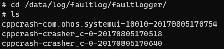

# 进程崩溃(cppcrash)日志分析指导

## 简介

进程崩溃指C/C++运行时崩溃。OpenHarmony FaultLogger模块提供的进程崩溃故障检测、日志采集、日志存储、日志上报能力，为开发者提供了详细的维测日志用以辅助故障定位。

本文将分别介绍进程崩溃检测能力、崩溃日志获取和进程崩溃日志分析。在使用本指导分析日志前，需要开发者对C/C++程序堆栈信息有相关基础知识。

## 进程崩溃检测能力

进程崩溃基于Linux信号机制，目前主要支持对以下C/C++运行时崩溃异常信号的处理：

| 信号值 | 信号 | 解释 | 触发原因 |
| ------ | --------- | --------------- | ------------------------------------------- |
| 4      | SIGILL    | 非法指令        | 进程执行了非法、格式错误、未知或特权指令 |
| 5      | SIGTRAP   | 断点或陷阱异常  | 异常或trap指令发生 |
| 6      | SIGABRT   | 进程终止        | 进程异常终止，通常为进程自身调用标准函数库的`abort()`函数 |
| 7      | SIGBUS    | 非法内存访问    | 进程访问了对齐或者不存在的物理地址 |
| 8      | SIGFPE    | 浮点异常        | 进程执行了错误的算术运算，如除数为0、浮点溢出、整数溢出等 |
| 11     | SIGSEGV   | 无效内存访问    | 进程访问了无效内存引用 |
| 16     | SIGSTKFLT | 栈错误          | 处理器执行了错误的栈操作，如栈空时弹出、栈满时压入 |
| 31     | SIGSYS    | 错误的系统调用  | 系统调用时使用了错误或非法参数 |

## 崩溃日志获取

进程崩溃日志是一种故障日志，与应用无响应日志、JS应用崩溃等都由FaultLogger模块进行管理，可以通过如下三个方式获取：

### 通过shell获取日志

1. 设备`/data/log/faultlog/faultlogger/`路径下的故障日志，其文件名格式为`cppcrash-进程名-进程UID-秒级时间`，仅包含设备名、系统版本、进程崩溃调用栈等信息。

    

2. 设备`/data/log/faultlog/temp/`路径下的故障日志，其文件名格式为`cppcrash-进程PID-系统毫秒级时间戳`，还包含进程崩溃时栈内存、进程maps等信息。

    

### 通过DevEco Studio获取日志

DevEco Studio会收集设备`/data/log/faultlog/faultlogger/`路径下的进程崩溃故障日志到FaultLog下面，根据进程名和故障和时间分类显示。


### 通过faultlogger接口获取

FaultLogger对外提供了故障查询接口，可以查询各种故障信息，详见[@ohos.faultLogger (故障日志获取)](../reference/apis/js-apis-faultLogger.md)

## 进程崩溃日志分析

### 日志格式

以下是一份DevEco Studio归档在FaultLog的进程崩溃日志的核心内容。

```
Generated by HiviewDFX@OpenHarmony
==================================================================
Device info:OpenHarmony 3.2     <- 设备信息
Build info:OpenHarmony 4.0.5.5  <- 版本信息
Module name:crasher_c   <- 模块名
Pid:1205  <- 进程号
Uid:0  <- 用户ID
Reason:Signal:SIGSEGV(SEGV_ACCERR)@0x0042d33d   <- 异常信息
Thread name:crasher <- 异常线程名
#00 pc 0000332c /data/crasher(TriggerSegmentFaultException+15)(8bc37ceb8d6169e919d178fdc7f5449e)  <- 调用栈
#01 pc 000035c7 /data/crasher(ParseAndDoCrash+277)(8bc37ceb8d6169e919d178fdc7f5449e)
#02 pc 00003689 /data/crasher(main+39)(8bc37ceb8d6169e919d178fdc7f5449e)
#03 pc 000c3b08 /system/lib/ld-musl-arm.so.1(__libc_start_main+116)
#04 pc 000032f8 /data/crasher(_start_c+112)(8bc37ceb8d6169e919d178fdc7f5449e)
#05 pc 00003284 /data/crasher(_start+32)(8bc37ceb8d6169e919d178fdc7f5449e)
...
```

### 通过日志定位问题

1. 通过故障日志等基础信息确定问题模块和故障类别

    通过崩溃进程名一般能定界到故障的模块，通过信号能判断崩溃的原因，通过堆栈中的方法名，可以复原崩溃栈的函数调用链。\
    如范例中的SIGSEGV是由Linux内核抛出，原因为访问了非法内存地址，问题发生在TriggerSegmentFaultException这个函数中。\
    大部分场景下崩溃栈的最上层就是崩溃的原因，如空指针访问以及程序主动终止运行。\
    少部分场景调用栈无法定位原因，需要查看其他信息，例如踩内存或者栈溢出的问题场景。

2. 通过addr2line工具解析出代码行号来复原崩溃现场调用栈

    使用Linux addr2line工具解析崩溃栈的行号，这里需要使用带调试信息的二进制。一般在版本编译或者应用编译时会生成带调试信息的二进制。

    应用二进制位置在DevEco Studio应用构建的临时目录中，如`build/default/intermediates/libs`。

    系统二进制位置在如下目录，对于直接获取的版本，二进制会归档在完整镜像包中。
    ```
    \代码根路径\out\产品\lib.unstripped
    \代码根路径\out\产品\exe.unstripped
    ```

    Linux环境下，开发者可以通过`apt-get install addr2line`命令安装addr2line软件来使用。\
    在应用开发环境下，开发者还可以使用SDK中归档的llvm-addr2line工具来解析行号，使用方法一致。

    使用addr2line工具根据偏移地址解析行号:

    ```
    root:~/OpenHarmony/out/rk3568/exe.unstripped/hiviewdfx/faultloggerd$ addr2line -e crasher 0000332c
    base/hiviewdfx/faultloggerd/tools/crasher/dfx_crasher.c:57
    ```

    范例中的崩溃故障是由赋值给一块不可写的区域导致的，代码行为dfx_crasher.c文件的57行，修改后可以避免发生此崩溃。\
    另外，使用addr2line后，如果得出的行号看起来不是很正确，可以考虑对地址进行微调(如减1)，或者考虑关闭一些编译优化，已知使用LTO的二进制可能无法正确获得行号。

## 相关实例

针对故障日志获取，有以下相关实力可供参考：

- [故障日志获取（ArkTS）（API9）](https://gitee.com/openharmony/applications_app_samples/tree/OpenHarmony-3.2-Release/code/BasicFeature/DFX/FaultLogger)