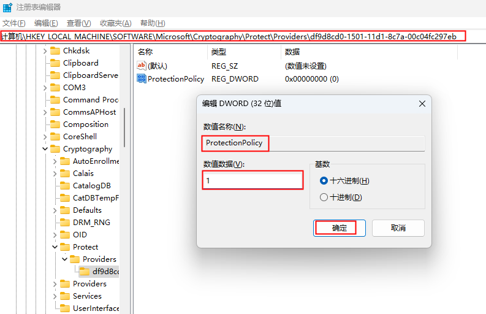

# hdc

hdc（HarmonyOS Device Connector）是提供给开发人员的命令行调试工具，用于与设备进行交互调试、数据传输、日志查看以及应用安装等操作。该工具支持在Windows/Linux/MacOS系统上运行，为开发者提供高效，便捷的设备调试能力。

hdc分为三部分：

**client**：运行在电脑端的进程，开发者在执行hdc命令时启动该进程，命令结束后进程自动退出。

**server**：运行在电脑端的后台服务进程，用来管理client进程和设备端daemon进程之间的数据交互，设备发现等。

**daemon**：作为守护进程运行在设备端，用来响应电脑端server发来的请求。

关系如下图所示：


> **说明：**
>
> hdc client在启动时，默认会判断server是否正在运行，如果没有运行则会启动一个新的hdc程序作为server，运行在后台。
>
> hdc server运行时，默认会监听电脑端的8710端口，开发者可通过设置系统环境变量OHOS_HDC_SERVER_PORT自定义监听的端口号，范围为1~65535。

## 环境准备

下载并安装[DevEco Studio](https://developer.huawei.com/consumer/cn/deveco-studio/)。hdc应用程序默认安装在以下路径：DevEco Studio/sdk/default/openharmony/toolchains。

hdc支持USB和无线两种连接调试方式。可在设备侧设置>系统>开发者选项中开启或关闭调试开关 ，无需重启设备即可生效。设备如果未启用“开发者选项”菜单可参考[开发者选项](https://developer.huawei.com/consumer/cn/doc/harmonyos-guides/ide-developer-mode#section530763213432)进行启用。具体调试连接方式及操作步骤请参考[USB连接场景](#usb连接场景)和[TCP连接场景](#tcp连接场景)。

### （可选）命令行直接执行hdc程序

**安装目录调试**

- 开发者可以在SDK的toolchains子目录下执行hdc命令进行设备调试。

- hdc支持独立运行，将安装子目录toolchains下的hdc可执行文件和libusb_shared依赖文件集中存放至自定义目录中，可在自定义目录下直接执行hdc命令，实现独立调试功能。

**添加hdc到系统环境变量**

- Window环境变量设置方法：
  1. 按下键盘上的Windows键，在搜索栏中输入“设置”，点击后进入设置窗口；
  2. 在搜索栏中搜索“查看高级系统设置”，在环境变量>系统变量>Path>编辑中，将hdc.exe所在目录添加到 Path，环境变量配置完成后请重启电脑，即可在命令行窗口执行hdc命令。

- Linux/MacOS系统：
  1. 打开终端工具，执行以下命令，根据输出结果分别执行不同命令。

      ```shell
      echo $SHELL
      ```

      1. 如果输出结果为bin/bash，则执行以下命令，打开.bashrc文件。

          ```shell
          vi ~/.bashrc
          ```

      2. 如果输出结果为/bin/zsh，则执行以下命令，打开.zshrc文件。

          ```shell
          vi ~/.zshrc
          ```

  2. 系统切换为英文输入法，按下键盘字母“i”，进入Insert模式。
  3. 在文件末尾输入以下内容，添加PATH信息。

      ```shell
      PATH={DevEco Studio}/sdk/default/openharmony/toolchains:$PATH
      ```

      其中{DevEco Studio}需替换为开发者实际安装DevEco Studio的绝对路径。
  4. 编辑完成后，单击Esc键，退出编辑模式，然后输入“:wq”，单击Enter键保存。
  5. 执行以下命令，使配置的环境变量生效。
      1. 如果步骤1操作打开的是.bashrc文件，请执行如下命令：

          ```shell
          source ~/.bashrc
          ```

      2. 如果步骤1操作打开的是.zshrc文件，请执行如下命令：

          ```shell
          source ~/.zshrc
          ```

  6. 环境变量配置完成后，重启电脑。

### （可选）hdc server配置

通过配置对应的系统环境变量，可以修改hdc server的监听端口，日志打印级别或特性开关等，详细介绍请查看[可选配置项](#可选配置项)章节。

> **说明：**
>
> 环境变量配置完成后，关闭并重启命令行或其他使用到HarmonyOS SDK的软件，以生效新配置的环境变量。

## hdc命令列表

### 全局参数

全局参数是指运行hdc命令时，可添加在hdc和具体执行命令之间的参数。例如，选择指定的设备执行命令，使用-t参数：

```shell
hdc -t connect-key shell echo "Hello world"
```

| 参数 | 说明 |
| -------- | -------- |
| [-t](#连接指定的目标设备) | 通过设备标识符连接指定的目标设备。单台设备连接时为可选参数，连接多台设备时为必选参数。 |
| [-l](#server端日志) | 可选参数，指定运行时日志等级，范围为数字0-6，默认为3（LOG_INFO）。 |
| [-s](#远程连接场景) | 可选参数，指定客户端连接服务端时，服务进程的网络监听参数，格式为IP:port。 |
| [-p](#快速执行命令) | 可选参数，绕过对服务进程的查询步骤，用于快速执行客户端命令。 |
| [-m](#前台启动服务) | 可选参数，使用前台启动模式启动服务进程。 |

### 命令列表

| 命令 | 说明 |
| -------- | -------- |
| [list targets](#查询设备列表) | 查询已连接的所有目标设备。 |
| [wait](#等待设备正常连接) | 等待设备正常连接。 |
| [tmode usb](#usb调试和无线调试切换) | 3.1.0e版本开始已废弃，不会实际操作设备连接通道，需要在设备设置界面通过USB调试开关进行设置。 |
| [tmode port](#打开设备网络连接通道) | 打开设备网络连接通道。 |
| [tmode port close](#关闭网络连接通道) | 关闭设备网络连接通道。 |
| [tconn](#tcp连接设备) | 指定连接设备：通过“IP:port”来指定连接的设备。 |
| [shell](#执行交互命令) | 在设备侧执行单次命令如hdc shell XXX，无命令参数可进入设备侧终端执行命令。 |
| [install](#安装应用文件) | 安装指定的应用文件。 |
| [uninstall](#卸载应用) | 卸载指定的应用包。 |
| [file send](#本地发送文件至远端设备) | 从本地发送文件至远端设备。 |
| [file recv](#接收远端设备文件至本地) | 接收远端设备文件至本地。 |
| [fport ls](#查询端口转发任务列表) | 列出全部转发端口转发任务。 |
| [fport](#创建正向端口转发任务) | 设置正向端口转发任务：监听“主机端口”，接收请求并进行转发， 转发到“设备端口”。 |
| [rport](#创建反向端口转发任务) | 设置反向端口转发任务：监听“设备端口”，接收请求并进行转发，转发到“主机端口”。 |
| [fport rm](#删除端口转发任务) | 删除指定的端口转发任务。 |
| [start](#启动服务) | 启动hdc服务进程。 |
| [kill](#终止服务) | 终止hdc服务进程。 |
| [hilog](#打印设备端日志) | 打印设备端的日志信息。 |
| [jpid](#显示设备开启jdwp调试协议的进程pid) | 显示设备上所有开启了JDWP调试协议的应用的PID。 |
| [track-jpid](#显示设备开启jdwp调试协议的进程pid和应用名) | 实时显示设备上开启了JDWP调试协议的应用的PID和应用名。 |
| [target boot](#重启目标设备) | 重启目标设备。 |
| <!--DelRow--> target mount | 以读写模式挂载系统分区（非root的设备不可用）。 |
| <!--DelRow--> smode | 授予设备端hdc后台服务进程root权限， 使用-r参数取消授权（非root的设备不可用）。 |
| [keygen](#安全相关命令) | 生成一个新的秘钥对。 |
| [version](#查询hdc版本号) | 打印hdc版本信息，也可使用hdc -v打印版本信息。 |
| [checkserver](#查询客户端和服务端进程版本) | 获取客户进程与服务进程版本信息。 |

## 基本使用方法

以USB调试方式为例，执行命令前请在设备上开启USB调试功能，用USB线连接设备和电脑。

### 查询连接的设备

```shell
hdc list targets
```

### 执行shell命令

```shell
hdc shell echo "Hello world"
```

### 获取帮助

显示hdc相关的帮助信息，命令格式如下：

```shell
hdc -h [verbose]
hdc help
```

| 参数名 | 说明 |
| -------- | -------- |
| -h verbose | 显示hdc相关的帮助信息。可选参数：verbose，显示详细的帮助信息。 |
| help | 显示hdc相关的帮助信息。 |

**返回信息**：

| 返回信息 | 说明 |
| -------- | -------- |
| OpenHarmony device connector(HDC) ...<br/>---------------------------------global commands:----------------------------------<br/>-h/help [verbose]&nbsp;&nbsp;&nbsp;&nbsp;&nbsp;&nbsp;&nbsp;&nbsp;&nbsp;&nbsp;&nbsp;&nbsp;&nbsp;&nbsp;&nbsp;&nbsp;&nbsp;&nbsp;&nbsp;&nbsp;&nbsp;- Print hdc help, 'verbose' for more other cmds<br/>...（此处省略详细帮助信息） | hdc命令使用帮助信息。 |

> **注意：**
>
> 使用hdc时如出现异常，可尝试通过hdc kill -r命令杀掉异常进程并重启hdc服务。
>
> 如出现hdc list targets获取不到设备信息的情况，参见[设备无法识别](#设备无法识别)章节。

## 设备连接管理

### 查询设备列表

```shell
hdc list targets [-v]
```

**参数**：

| 参数名 | 说明 |
| -------- | -------- |
| -v | 显示设备更多详情。 |

**返回信息**：

| 返回信息 | 说明 |
| -------- | -------- |
| 设备标识符列表 | 已连接的设备标识符列表。<br/>命令添加-v参数显示更多详情，依次为设备标识符，连接方式（TCP/USB），连接状态（Unknown/Ready/Connected/Offline/Unauthorized），设备名称，hdc标识。 |
| 设备标识符 Unauthorized | 设备未授权。 |
| [Empty] | 没有查询到设备信息。 |

**使用方法**：

```shell
$ hdc list targets
connect-key1
...

$ hdc list targets -v
connect-key1            USB     Connected       localhost       hdc
127.0.0.1:5555          TCP     Offline         localhost       hdc
connect-key2            USB     Offline         localhost       hdc
...
```

### 连接指定的目标设备

```shell
hdc -t [connect-key] [command]
```

**参数**：

| 参数名 | 说明 |
| -------- | -------- |
| -t | 通过设备标识符连接指定的目标设备。<br/>连接单台设备时，为可选参数；连接多台设备时，为必填参数。 |
| command | hdc支持的命令。 |

> **说明：**
>
> connect-key为每个设备唯一的标识符。通过USB连接，标识符为设备序列号；通过网络无线连接设备，标识符格式为IP:port。

**返回信息**：

| 返回信息 | 说明 |
| -------- | -------- |
| 正常执行返回信息，参考[命令列表](#命令列表)具体说明。 | - |
| [Fail]Not match target founded, check connect-key please. | 使用-t参数匹配不存在的connect-key，找不到与connect-key匹配的设备。 |
| [Fail]Device not founded or connected. | 设备未找到或尚未连接。 |
| [Fail]ExecuteCommand need connect-key? please confirm a device by help info. | 无设备连接或设备未打开调试开关。 |
| Unknown operation command... | 不支持的命令。 |

> **说明：**
>
> 命令返回的错误信息仅供开发者解读使用，后续可能会优化调整。请勿将此类信息用于自动化脚本或程序中的逻辑判断，实际程序交互建议使用系统异常提供的标准错误码，具体详情可参考[hdc错误码](#hdc错误码)。

**使用方法**：

该调试方法需要与具体的操作命令搭配使用，下面以shell命令为例：

```shell
$ hdc list targets
connect-key1
...

$ hdc -t connect-key1 shell echo "hello world!"
hello world!
```

### 等待设备正常连接

```shell
hdc wait # 等待设备正常连接
hdc -t [connect-key] wait # 等待指定的设备正常连接，connect-key需要替换为指定的设备标识符
```

**参数**：

| 参数名 | 说明 |
| -------- | -------- |
| -t connect-key | 3.1.0a版本新增参数：<br/>连接单台设备时，为可选参数。<br/>连接了多台设备时，为必填参数。 |

**返回信息**：

| 返回信息 | 说明 |
| -------- | -------- |
| 无 | hdc wait命令执行后，识别到正常连接的设备后结束。 |

**使用方法**：

```shell
# 如果设备正常连接，则命令执行结束无任何打印信息
$ hdc wait # 单台设备
$ hdc -t connect-key1 wait # 多设备需使用-t指定连接设备
```

### USB连接场景

**环境确认**

| 确认项 | 正常 | 异常处理 |
| -------- | -------- | -------- |
| USB调试选项 | 开启。 | 设备的USB调试模式如无法自动开启，请尝试重启设备。 |
| USB数据连接线 | 使用USB数据连接线连接到调试电脑的USB接口。 | 如使用低带宽、无数据通信功能的USB连接线可能导致无法识别hdc设备，建议更换为设备原装充电线。 |
| USB接口 | 主板直出USB接口（台式机为后面板的USB接口，笔记本为机身的USB接口）。 | 如使用转接头/拓展坞/台式机前面板USB接口，可能存在带宽低和USB同步异常等问题，会导致频繁断连，推荐使用直连方式连接电脑和设备。 |
| hdc环境变量 | 终端命令行输入hdc -h有回显帮助信息内容。 | 参见[环境准备](#环境准备)章节。 |
| 驱动 | 连接hdc设备后，设备管理器通用串行总线设备存在设备“HDC Device”或“HDC Interface”。 | 参见[设备无法识别](#设备无法识别)章节。 |

**连接步骤**

1. 电脑端通过USB连接设备。

2. 查看已连接设备，执行以下命令：

   ```shell
   hdc list targets
   ```

   返回信息中存在对应设备的标识符，即为USB连接成功。

3. 可以查询到设备后，即可运行相关命令和设备进行交互。如果希望不带设备标识符进行USB命令操作，需要确认设备不在tcp连接模式（hdc list targets查询的设备不包含IP:port形式的连接信息），直接连接即可，例如：

   ```shell
   hdc shell
   ```

### TCP连接场景

> **注意：**
>
> TCP调试功能尚未稳定，请谨慎用于生产环境。

环境确认：

| 确认项 | 正常 | 异常处理 |
| -------- | -------- | -------- |
| 网络连接 | 电脑、设备处于同一网络。 | 连接同一WiFi。 |
| 网络状态 | telnet IP:port正常，网速稳定。 | 请选择稳定的网络连接方式。 |
| hdc环境变量 | 终端命令行输入hdc -h有回显帮助信息内容。 | 参见[环境准备](#环境准备)章节。 |

**连接步骤**

1. 在设备端设置>系统>开发者选项>无线调试>打开无线调试开关。

2. 记录设备界面显示的IP地址和端口，格式为IP:port。

3. 通过tcp连接设备，执行以下命令：

   ```shell
   hdc tconn IP:port
   ```

   命令执行返回“Connect OK”则表示连接成功。

4. 查看已连接设备，执行以下命令：

   ```shell
   hdc list targets
   ```

   返回信息格式为IP:port。

   > **说明：**
   >
   > 如果需要关闭TCP连接模式，可以在设备中关闭无线调试开关或断开网络连接。

### 远程连接场景

远程连接场景是指客户端（通常是开发者使用的本地电脑）通过网络与服务端（通常是连接了调试设备的服务器或开发机）建立连接，实现客户端对目标设备的远程调试，控制和管理。


远程连接使用-s参数来指定服务端的网络参数，包括地址和端口号，该设置只在当前命令执行期间有效，命令格式如下：

```shell
hdc -s IP:port [command]
```

| 命令 | 说明 |
| -------- | -------- |
| -s | 指定当前服务进程的网络监听参数。 |

**参数**：

| 参数 | 说明 |
| -------- | -------- |
| IP | 指定监听的IP地址，支持IPv4和IPv6。 |
| port | 指定监听的端口，范围为1~65535。 |
| command | hdc支持的命令，参见[hdc命令列表](#hdc命令列表)。 |

**返回信息**：

| 返回信息 | 说明 |
| -------- | -------- |
| Connect server failed. | 与服务进程建立连接失败。 |
| -s content port incorrect. | 端口号超出可设置范围（1~65535）。 |

**使用方法**

```shell
# 在已有服务进程，且服务进程的网络监听参数为127.0.0.1:8710的环境中，执行查询设备命令
$ hdc -s 127.0.0.1:8710 list targets
```

**连接步骤**

1. 服务端配置
   服务端通过USB连接到对应的hdc设备后执行以下命令：

   ```shell
   $ hdc kill          # 关闭本地hdc服务
   $ hdc -s IP:8710 -m # 启动网络转发的hdc服务
                       # 其中IP为服务端自身的IP，windows可通过ipconfig查询，unix系统可通过ifconfig查询
                       # 8710为默认端口号，也可设置为其他端口号如：18710
                       # 启动后服务端将打印日志
   ```

2. 客户端连接
   客户端连接需要确保可以连通服务端IP地址，满足前述条件后执行以下命令：

   ```shell
   $ hdc -s IP:8710 [command] # 其中IP为服务端IP，8710为第一步服务端启动时设置的端口号，
                              # 如果端口号有变化，这里也需要变更。
                              # command可以为任意hdc可用命令，例如list targets
   ```

> **说明：**
>
> 当命令行中明确使用 -s 参数指定服务端口时，系统将忽略OHOS_HDC_SERVER_PORT环境变量中定义的端口设置。

### USB调试和无线调试切换

用于连接模式切换的命令如下表所示：

| 命令 | 说明 |
| -------- | -------- |
| tmode usb | 该命令已废弃，不会实际操作设备连接通道，需要在设备设置界面通过USB调试开关进行设置。 |
| tmode port [port-number] | 打开设备网络连接通道：设备端daemon进程会重启，已建立的连接会中断，需要重新连接。 |
| tmode port close | 关闭设备网络连接通道：设备端daemon进程会重启，已建立的连接会中断，需要重新连接。 |
| tconn IP:port [-remove] | 连接指定的设备，通过“IP:port”来指定连接的设备，使用-remove参数断开连接。 |

> **说明：**
>
> 当前推荐通过设备端的USB调试开关和无线调试开关来控制连接通道的开启和关闭。

### 打开设备网络连接通道

命令格式如下：

```shell
hdc tmode port [port-number]
```

**参数**：

| 参数 | 参数说明 |
| -------- | -------- |
| port -number | 监听连接的网络端口号，范围：1~65535。 |

**返回信息**：

| 返回信息 | 说明 |
| -------- | -------- |
| Set device run mode successful. | 打开成功。 |
| [Fail]ExecuteCommand need connect-key. | 打开失败，设备列表无设备，无法打开设备无线调试通道。 |
| [Fail]Incorrect port range. | 端口号超出可设置范围1~65535。 |

**使用方法**：

```shell
$ hdc tmode port 65512
Set device run mode successful.
```

> **注意：**
>
> 切换前，请确保条件满足：远端设备与近端电脑处于同一网络，可通过执行ping命令检查：
>
> 1. 近端电脑在命令行工具中执行命令ping 远端设备的IP；
>
> 2. 如果可正常接收到远端设备回应数据包，表明二者处于同一网络。
>
> 如不满足以上条件请勿使用该命令进行切换。
>
> 执行完毕后，远端daemon进程将会退出并重启，连接将会断开，需要重新连接。

### 关闭网络连接通道

命令格式如下：

```shell
hdc tmode port close
```

**返回信息**：

| 返回信息 | 说明 |
| -------- | -------- |
| [Fail]ExecuteCommand need connect-key. | 设备列表无设备，无法执行命令。 |

**使用方法**：

```shell
hdc tmode port close
```

> **说明：**
>
> 执行完毕后，远端daemon进程将会退出并重启，连接将会断开，需要重新连接。

### TCP连接设备

通过TCP连接指定的设备，命令格式如下：

```shell
hdc tconn IP:port [-remove]
```

**参数**：

| 参数 | 参数说明 |
| -------- | -------- |
| IP:port | 设备的IP地址与端口号。 |
| -remove | 可选参数，断开指定设备的连接。 |

**返回信息**：

| 返回信息 | 说明 |
| -------- | -------- |
| Connect OK. | 连接成功。 |
| [Info]Target is connected, repeat opration. | 设备当前已连接。 |
| [Fail]Connect failed. | 连接失败。 |

**使用方法**：

```shell
$ hdc tconn 192.168.0.1:8888
Connect OK

# 断开指定网络设备连接
$ hdc tconn 192.168.0.1:8888 -remove
```

## 执行交互命令

```shell
hdc shell [-b bundlename] [command]
```

**参数**：

| 参数 | 说明 |
| -------- | -------- |
| -b bundlename | 3.1.0e版本新增参数，指定可调试应用包名，在可调试应用数据目录内，以非交互式模式执行命令。<br/>[命令行方式访问应用沙箱](https://developer.huawei.com/consumer/cn/doc/harmonyos-guides/ide-device-file-explorer#section9381241102211)。<br/>此参数当前仅支持以非交互式模式执行命令，不支持缺省command参数执行命令进入交互式shell会话。<br/>未配置此参数默认执行路径为系统根目录。 |
| command | 需要在设备侧执行的单次命令，不同类型或版本的系统支持的command命令有所差异，可以通过hdc shell ls /system/bin查阅支持的命令列表。当前大多数命令都是由[toybox](../tools/toybox.md)提供，可通过 hdc shell toybox --help 获取命令帮助。<br/>缺省该参数，hdc将会启动一个交互式的shell会话，开发者可以在命令提示符下输入命令，比如 ls、cd、pwd 等。 |

> **说明：**
>
> 使用参数[-b bundlename]指定包名，应满足条件：指定包名的已安装应用为“使用调试证书签名的应用”且在设备上已启动， 如何申请调试证书及签名可参考：[申请调试证书](https://developer.huawei.com/consumer/cn/doc/app/agc-help-add-debugcert-0000001914263178)。

**返回信息**：

| 返回信息 | 说明 |
| -------- | -------- |
| 交互命令返回内容。 | 返回内容详情请参见其他交互命令返回内容。 |
| /bin/sh: XXX : inaccessible or not found. | 不支持的交互命令。 |
| [Fail]具体失败信息。 | 执行失败，参见[hdc错误码](#hdc错误码)。 |

**使用方法**：

```shell
# 进入交互式模式执行命令
$ hdc shell
$

# 以非交互式模式执行命令
$ hdc shell "ps -ef | grep hdcd"
shell         39491      1 1 14:40:58 ?     00:00:00 hdcd

# 查询全部可用命令
$ hdc shell help -a
---toybox---------------------------------------------------------------------

usage: toybox [--long | --help | --version | [command] [arguments...]]

With no arguments, shows available commands. First argument is
name of a command to run, followed by any arguments to that command.

--long  Show path to each command
...

# 在指定包名的应用数据目录内以非交互式模式执行命令，支持touch、rm、ls、stat、cat、mkdir等命令。
$ hdc shell -b com.example.myapplication ls data/storage/el2/base/
```

**常用调试工具**

| 命令 | 说明 |
| -------- | -------- |
| [aa](../tools/aa-tool.md) | 应用调试工具 |
| [bm](../tools/bm-tool.md) | 包管理工具 |
| [cem](../tools/cem-tool.md) | 公共事件管理工具 |
| [anm](../tools/anm-tool.md) | 通知管理工具 |
| [edm](../tools/edm-tool.md) | 企业设备管理工具 |
| [param](../tools/param-tool.md) | 操作系统参数管理工具 |
| [power-shell](../tools/power-shell.md) | 设备电源状态转换工具 |
| [atm](../tools/atm-tool.md) | 程序访问控制管理工具 |
| [hilog](./hilog.md) | 日志管理工具 |
| [hidumper](./hidumper.md) | 系统信息导出工具 |
| [hitrace](./hitrace.md) | 系统打点及采集工具 |
| [hiperf](./hiperf.md) | 性能分析工具 |
| [mediatool](../tools/mediatool.md) | 媒体资源库工具 |
| [devicedebug](../tools/devicedebug-tool.md) | 调试应用发送信号工具 |
| [rawheap-translator](../tools/rawheap-translator.md) | rawheap文件解析工具 |

## 应用管理

| 命令 | 说明 |
| -------- | -------- |
| install src | 安装指定的应用文件。 |
| uninstall bundlename | 卸载指定的应用包package包名。 |

### 安装应用文件

安装APP package，命令格式如下：

```shell
hdc install [-r|-s] src
```

**参数**：

| 参数名 | 说明 |
| -------- | -------- |
| src | 应用安装包的文件名。 |
| -r | 替换已存在应用（.hap）。 |
| -s | 安装一个共享包（.hsp）。 |

**返回信息**：

| 返回信息 | 说明 |
| -------- | -------- |
| [Info]App install path:XXX msg:install bundle successfully.<br/>AppMod finish. | 成功情况下返回安装信息和AppMod finish。 |
| 具体安装失败原因。 | 失败情况下返回具体安装失败信息。 |

**使用方法**：

```shell
# 以安装example.hap包为例：
$ hdc install E:\example.hap
AppMod finish
```

### 卸载应用

命令格式如下：

```shell
hdc uninstall [-k|-s] bundlename
```

**参数**：

| 参数名 | 说明 |
| -------- | -------- |
| bundlename | 应用安装包。 |
| -k | 卸载应用后，保留/data和/cache目录。 |
| -s | 卸载共享包。 |

**返回信息**：

| 返回信息 | 说明 |
| -------- | -------- |
| [Info]App uninstall path: msg:uninstall bundle successfully.<br/>AppMod finish. | 成功情况下返回卸载信息和AppMod finish。 |
| 具体卸载失败原因。 | 失败情况下返回具体卸载失败信息。 |

**使用方法**：

```shell
# 以卸载com.example.hello包为例：
$ hdc uninstall com.example.hello
AppMod finish
```

## 文件传输

| 命令 | 说明 |
| -------- | -------- |
| file send SOURCE DEST | 从本地发送文件至远端设备。 |
| file recv DEST SOURCE | 接收远端设备文件至本地。 |

### 本地发送文件至远端设备

命令格式如下：

```shell
hdc file send [-a|-sync|-z|-m|-b bundlename] SOURCE DEST
```

**参数**：

| 参数名 | 说明 |
| -------- | -------- |
| SOURCE | 本地待发送的文件路径。 |
| DEST | 远程待接收的文件路径。 |
| -a | 保留文件时间戳。 |
| -sync | 只传输文件mtime有更新的文件。<br/>mtime（modified timestamp）：修改后的时间戳。 |
| -z | 通过LZ4格式压缩传输，此功能未开放，请勿使用。 |
| -m | 文件传输时同步文件DAC权限，uid，gid，MAC权限。<br/>DAC（Discretionary Access Control）：自主访问控制，<br/>uid（User identifier）：用户标识符（或用户ID），<br/>gid（Group identifier）：组标识符（或组ID），<br/>MAC（Mandatory Access Control）：强制访问控制（或非自主访问控制）。 |
| -b | 3.1.0e版本新增参数，指定可调试应用包名。<br/>使用方法可参考[通过命令往应用沙箱目录中发送文件](https://developer.huawei.com/consumer/cn/doc/harmonyos-guides/ide-device-file-explorer#section9381241102211)。 |
| bundlename | 可调试应用进程的包名。 |

**返回信息**：

文件发送成功，返回传输成功的结果信息。文件发送失败，返回传输失败的具体信息。

**使用方法**：

```shell
$ hdc file send test /test/
FileTransfer finish, Size:10, File count = 1, time:0ms rate:100kB/s
```

### 接收远端设备文件至本地

命令格式如下：

```shell
hdc file recv [-a|-sync|-z|-m|-b bundlename] DEST SOURCE
```

**参数**：

| 参数名 | 说明 |
| -------- | -------- |
| SOURCE | 本地待接收的文件路径。 |
| DEST | 远程待发送的文件路径。 |
| -a | 保留文件修改时间戳。 |
| -sync | 只传输文件mtime有更新的文件。<br/>mtime（modified timestamp）：修改后的时间戳。 |
| -z | 通过LZ4格式压缩传输，此功能未开放，请勿使用。 |
| -m | 文件传输时同步文件DAC权限，uid，gid，MAC权限。<br/>DAC（Discretionary Access Control）：自主访问控制，<br/>uid（User identifier）：用户标识符（或用户ID），<br/>gid（Group identifier）：组标识符（或组ID），<br/>MAC（Mandatory Access Control）：强制访问控制（或非自主访问控制）。 |
| -b | 3.1.0e版本新增参数，传输指定的可调试应用进程应用数据目录下的文件。<br/>使用方法可参考[从沙箱目录中下载文件到本地计算机](https://developer.huawei.com/consumer/cn/doc/harmonyos-guides/ide-device-file-explorer#section48216711204)。 |
| bundlename | 可调试应用进程的包名。 |

**返回信息**：

文件接收成功，返回传输成功的结果信息。文件接收失败，返回传输失败的具体信息。

**使用方法**：

```shell
$ hdc file recv /test/test ./
FileTransfer finish, Size:10, File count = 1, time:0ms rate:100kB/s
```

> **说明：**
>
> 使用参数[-b bundlename]指定包名，应满足条件：指定包名的已安装应用为“使用调试证书签名的应用”且在设备上已启动， 如何申请调试证书及签名可参考：[申请调试证书](https://developer.huawei.com/consumer/cn/doc/app/agc-help-add-debugcert-0000001914263178)。
>
> **版本更新说明**：从3.1.0a版本开始，支持使用中文字符作为文件传输命令参数，便于多语言环境下使用。

## 端口转发

| 命令 | 说明 |
| -------- | -------- |
| fport ls | 列出全部转发端口转发任务。 |
| fport [IP:port] [IP:port] | 设置正向端口转发任务：监听“主机端口”，接收请求并进行转发， 转发到“设备端口”，设备端口范围1~65535。 |
| rport [IP:port] [IP:port] | 设置反向端口转发任务：监听“设备端口”，接收请求并进行转发，转发到“主机端口”，设备端口范围1024~65535。 |
| fport rm [IP:port] [IP:port] | 删除指定的端口转发任务。 |

> **说明：**
>
> 电脑端支持的端口转发类型：tcp。
>
> 设备端支持的端口转发类型：tcp，dev，localabstract，localfilesystem，jdwp，ark。

### 查询端口转发任务列表

列出全部转发端口转发任务，命令格式如下：

```shell
hdc fport ls
```

**返回信息**：

| 返回信息 | 说明 |
| -------- | -------- |
| tcp:1234 tcp:1080 [Forward] | 正向端口转发任务。 |
| tcp:2080 tcp:2345 [Reverse] | 反向端口转发任务。 |
| [Empty] | 无端口转发任务。 |

**使用方法**：

```shell
$ hdc fport ls
[Empty]
```

### 创建正向端口转发任务

设置正向端口转发任务，执行后将设置指定的“主机端口”转发数据到“设备端口”转发任务，命令格式如下：

```shell
hdc fport [IP:port] [IP:port]
```

**返回信息**：

| 返回信息 | 说明 |
| -------- | -------- |
| Forwardport result:OK. | 端口转发任务设置正常。 |
| [Fail]Incorrect forward command. | 端口转发任务设置失败，端口转发参数错误。 |
| [Fail]TCP Port listen failed at XXXX. | 端口转发任务设置失败，本地转发端口被占用。 |
| [Fail]Forward parament failed. | 端口转发任务格式有误，或转发端口协议或端口范围有误。 |

**使用方法**：

```shell
$ hdc fport tcp:1234 tcp:1080
Forwardport result:OK
```

### 创建反向端口转发任务

设置反向端口转发任务，执行后将设置指定的“设备端口”转发数据到“主机端口”转发任务，命令格式如下：

```shell
hdc rport [IP:port] [IP:port]
```

**返回信息**：

| 返回信息 | 说明 |
| -------- | -------- |
| Forwardport result:OK. | 端口转发任务设置正常。 |
| [Fail]Incorrect forward command. | 端口转发任务设置失败，端口转发参数错误。 |
| [Fail]TCP Port listen failed at XXXX. | 端口转发任务设置失败，本地转发端口被占用。 |
| [Fail]Forward parament failed. | 端口转发任务格式有误，或转发端口协议或端口范围有误。 |

**使用方法**：

```shell
$ hdc rport tcp:1234 tcp:1080
Forwardport result:OK
```

### 删除端口转发任务

删除端口转发任务，执行后将指定的转发任务删除，命令格式如下：

```shell
hdc fport rm [IP:port][IP:port]
```

**参数**：

| 参数 | 说明 |
| -------- | -------- |
| IP:port | 端口转发任务，形如 tcp:XXXX tcp:XXXX。 |

**返回信息**：

| 返回信息 | 说明 |
| -------- | -------- |
| Remove forward ruler success, ruler:tcp:XXXX tcp:XXXX. | 端口转发任务删除正常。 |
| [Fail]Remove forward ruler failed, ruler is not exist tcp:XXXX tcp:XXXX. | 端口转发任务删除失败，不存在指定的转发任务。 |

**使用方法**：

```shell
$ hdc fport rm tcp:1234 tcp:1080
Remove forward ruler success, ruler:tcp:1234 tcp:1080
```

## 服务进程管理

| 命令 | 说明 |
| -------- | -------- |
| start [-r] | 启动hdc服务进程，使用-r参数触发服务进程重新启动。 |
| kill [-r] | 终止hdc服务进程，使用-r参数触发服务进程重新启动。 |
| -p | 绕过对服务进程的查询步骤，用于快速执行客户端命令。 |
| -m | 使用前台启动模式启动服务进程。<br/>前台启动模式（添加-m参数）：实时打印服务日志到客户端窗口。<br/>后台启动模式（不添加-m参数）：客户端不打印服务日志，日志内容写入本地磁盘文件，具体文件存放路径可参考[server端日志](#server端日志)。 |

### 启动服务

启动hdc服务进程，命令格式如下：

```shell
hdc start [-r]
```

**返回信息**：

| 返回信息 | 说明 |
| -------- | -------- |
| 无返回信息 | 服务进程启动成功。 |

**使用方法**：

```shell
hdc start -r # 服务进程启动状态下，触发服务进程重新启动。
```

> **说明：**
>
> 当启动hdc服务进程且系统未检测到运行的服务进程时，日志等级的设置优先级如下：若同时指定了-l参数和配置了OHOS_HDC_LOG_LEVEL环境变量，环境变量优先级高于-l参数；如果仅指定了-l参数，则采用该参数配置的日志等级；若两者均未指定，则服务进程将以默认日志等级LOG_INFO启动。

### 终止服务

命令格式如下：

```shell
hdc kill [-r]
```

**返回信息**：

| 返回信息 | 说明 |
| -------- | -------- |
| Kill server finish. | 服务进程终止成功。 |
| [Fail]具体失败信息。 | 服务进程终止失败。 |

**使用方法**：

```shell
$ hdc kill -r # 终止并重启服务进程，实际使用可执行hdc -l 5 kill -r命令查看详细重启的log。 
Kill server finish

$ hdc kill # 终止服务进程。
Kill server finish
```

### 快速执行命令

绕过对服务进程的查询步骤，用于快速执行客户端命令，服务未启动时执行命令不会重新启动新的服务，使用参数前确保服务已正常启动。命令格式如下：

```shell
hdc -p [command]
```

**参数**：

| 参数 | 说明 |
| -------- | -------- |
| command | hdc支持的命令。 |

**返回信息**：

| 返回信息 | 说明 |
| -------- | -------- |
| Connect server failed. | 与服务进程建立连接失败。 |

**使用方法**：

```shell
$ hdc start # 启动后台服务进程。

$ hdc -p list targets # 跳过检查，直接执行命令。
connect-key1
connect-key2
...
```

> **说明：**
>
> 在未指定 -p 参数的情况下直接执行 command 命令时，客户端将首先检查本地是否已有运行的服务进程。若系统未检测到运行的服务进程，客户端将自动启动服务进程，并建立连接以传递命令；若系统检测到运行的服务进程，客户端将直接与该后台服务建立连接并下发相应的命令。

### 前台启动服务

使用前台启动模式启动服务进程，命令格式如下：

```shell
hdc -m
```

**返回信息**：

| 返回信息 | 说明 |
| -------- | -------- |
| Initial failed. | 服务进程初始化失败。 |
| [I][1970-01-01 00:00:00.000] Program running. Ver: X.X.Xx Pid:XXX.<br/>... | 正常打印对应等级的日志，显示服务端活动状态。 |

**使用方法**：

```shell
$ hdc -s 127.0.0.1:8710 -m # 指定当前服务进程的网络监听参数并启动服务进程
[I][1970-01-01 00:00:00.000] Program running. Ver: 3.1.0e Pid:8236
...
```

> **说明：**
>
> 1. 使用前台启动参数时，可通过附加 -s 参数来指定服务进程的网络监听参数。如果既没有使用 -s 指定网络监听参数，也没有配置环境变量OHOS_HDC_SERVER_PORT配置监听端口，系统将采用默认网络监听参数：127.0.0.1:8710。
>
> 2. 在服务进程前台启动模式下，系统默认的日志输出等级为 LOG_DEBUG。如需变更日志等级，可通过结合使用 -l 参数来进行相应的调整。
>
> 3. 在运行环境中，仅允许单一的服务进程实例存在。若运行环境中已存在一个活跃的后台服务进程，那么尝试在前台启动新的服务进程实例将不会成功。

## 设备操作

| 命令 | 说明 |
| -------- | -------- |
| hilog [-h] | 打印设备端的日志信息，可通过hdc hilog -h查阅支持的参数列表。 |
| jpid | 显示设备上所有开启了JDWP调试协议的应用的PID。<br/>JDWP：定义调试器和被调试设备之间的通信协议。 |
| track-jpid [-a\|-p] | 实时显示设备上开启了JDWP调试协议的应用PID和应用名。不加参数只显示debug的应用的进程，使用-a或-p参数显示debug和release应用的进程，使用-p参数不显示debug和release的标签。 |
| target boot [-bootloader\|-recovery] | 重启目标设备，使用-bootloader参数重启后进入fastboot模式，使用-recovery参数重启后进入recovery模式。 |
| target boot [MODE] | 重启目标设备，加参数重启后进入相应的模式，其中MODE为/bin/begetctl命令中reboot支持的参数，可通过hdc shell "/bin/begetctl -h \| grep reboot"查看。 |
| <!--DelRow--> target mount | 以读写模式挂载系统分区（设备root后支持此命令）。 |
| <!--DelRow--> smode [-r] | 授予设备端hdc后台服务进程root权限， 使用-r参数取消授权（设备root后支持此命令）。 |

### 打印设备端日志

命令格式如下：

```shell
hdc hilog [-h]
```

**参数**：

| 参数 | 说明 |
| -------- | -------- |
| -h | hilog支持的参数，可通过hdc hilog -h查阅支持的参数列表。 |

**返回信息**：

| 返回信息 | 说明 |
| -------- | -------- |
| 返回具体信息。 | 抓取的日志信息。 |

**使用方法**：

```shell
$ hdc hilog -h
Usage:
-h --help
  Show all help information.
  Show single help information with option:
...
```

### 显示设备开启JDWP调试协议的进程PID

命令格式如下：

```shell
hdc jpid
```

**返回信息**：

| 返回信息 | 说明 |
| -------- | -------- |
| 进程号列表 | 开启了JDWP调试协议的应用的PID。 |
| [Empty] | 无开启了JDWP调试协议的进程。 |

**使用方法**：

```shell
$ hdc jpid
1234
1080
...
```

### 显示设备开启JDWP调试协议的进程PID和应用名

实时显示设备开启JDWP调试协议的进程PID和应用名，命令格式如下：

```shell
hdc track-jpid [-a|-p]
```

**参数**：

| 参数 | 说明 |
| -------- | -------- |
| 不加参数 | 只显示debug的应用的进程号和包名/进程名。 |
| -a | 显示debug和release应用的进程号和包名/进程名。 |
| -p | 显示debug和release应用的进程号和包名/进程名，但不显示debug和release的标签。 |

**返回信息**：

| 返回信息 | 说明 |
| -------- | -------- |
| 进程号和包名/进程名列表。 | 不加参数时显示开启了JDWP调试协议的debug应用的进程，使用-a或-p参数时表示开启了JDWP调试协议的debug和release进程。 |
| [Empty] | 无开启JDWP调试协议的应用进程。 |

**使用方法**：

```shell
$ hdc track-jpid -a
1234 com.example.hello release
...

$ hdc track-jpid -p
1234 com.example.hello
...
```

### 重启目标设备

命令格式如下：

```shell
hdc target boot [-bootloader|-recovery]
hdc target boot [MODE]
```

**参数**：

| 参数名 | 说明 |
| -------- | -------- |
| 不加参数 | 重启设备。 |
| -bootloader | 重启后进入fastboot模式。 |
| -recovery | 重启后进入recovery模式。 |
| MODE | 重启后进入MODE模式，MODE为/bin/begetctl命令中reboot支持的参数。 |

**使用方法**：

```shell
hdc target boot -bootloader  # 重启后进入fastboot模式
hdc target boot -recovery    # 重启后进入recovery模式
hdc target boot shutdown     # 关机
```
<!--Del-->
### 以读写模式挂载系统分区

命令格式如下：

   ```shell
   hdc target mount
   ```

   **返回值：**
   | 返回值 | 说明 |
   | -------- | -------- |
   | Mount finish | 挂载成功 |
   | [Fail]Mount failed | 挂载失败 |

   **使用方法：**

   ```shell
   hdc target mount
   ```

   > **说明：**
   >
   > 设备root后才支持此命令，对系统分区的修改存在一定的风险，请谨慎使用。

### 授予设备端hdc后台服务进程root权限

命令格式如下：

   ```shell
   hdc smode [-r]
   ```

   **返回值：**
   | 返回值 | 说明 |
   | -------- | -------- |
   | 无返回值 | 授予权限成功 |
   | [Fail]具体失败信息 | 授予权限失败 |

   **使用方法：**

   ```shell
   hdc smode
   hdc smode -r  // 取消root权限
   ```

   > **说明：**
   >
   > 设备root后才支持此命令。
<!--DelEnd-->

## 安全相关命令

| 命令 | 说明 |
| -------- | -------- |
| keygen FILE | 生成一个新的秘钥对，并将私钥和公钥分别保存到FILE和FILE.pub，其中FILE为自定义的文件名。 |

命令格式如下：

```shell
hdc keygen FILE
```

**参数**：

| 参数 | 说明 |
| -------- | -------- |
| FILE | FILE为自定义的文件名。 |

**使用方法**：

```shell
# 在当前目录下生成key和key.pub文件
$ hdc keygen key 
```

## 查询hdc版本号

| 命令 | 说明 |
| -------- | -------- |
| -v/version | 打印hdc版本信息。 |
| checkserver | 获取客户端与服务进程版本。 |

### 查询hdc服务进程版本

显示hdc的版本信息，命令格式如下：

```shell
hdc -v/version
```

**返回信息**：

| 返回信息 | 说明 |
| -------- | -------- |
| Ver: X.X.Xx. | hdc（SDK）的版本信息。 |

**使用方法**：

```shell
$ hdc -v 或hdc version
Ver: 3.1.0e
```

### 查询客户端和服务端进程版本

命令格式如下：

```shell
hdc checkserver
```

**返回信息**：

| 返回信息 | 说明 |
| -------- | -------- |
| Client version: Ver: X.X.Xx, Server version: Ver: X.X.Xx. | client（客户端），server（服务进程）版本号。 |

**使用方法**：

```shell
$ hdc checkserver
Client version: Ver: 3.1.0e, Server version: Ver: 3.1.0e
```

## hdc调试日志

### server端日志

**指定运行时日志等级**

hdc运行时日志等级，默认为LOG_INFO，命令格式如下：

```shell
hdc -l [level] [command]
```

**参数**：

| 参数 | 说明 |
| -------- | -------- |
| [level] | 指定运行时日志等级，等级随数字递增。设置日志级别时会启用当前及以下所有等级类型，如设置日志等级为3，可打印1~3类型的所有日志。<br/>0：LOG_OFF<br/>1：LOG_FATAL<br/>2：LOG_WARN<br/>3：LOG_INFO<br/>4：LOG_DEBUG<br/>5：LOG_ALL<br/>6：LOG_LIBUSB |
| command | hdc支持的命令。 |

> **说明：**
>
> 1. 当配置运行时日志级别为6（LOG_LIBUSB）时，将激活libusb相关的增量日志输出，增量日志级别的详细程度高、数据量大，有助于准确诊断服务进程中与USB相关的异常情况，建议开发者按需使用。USB相关操作主要由服务进程执行，因此，只有服务进程具备打印增量日志的功能。相应地，客户端侧的日志几乎不包含增量日志信息。
>
> 2. 指定运行日志等级仅适用于当前进程（包括客户端与服务进程），无法更改已存在的进程日志等级。

**返回信息**：

| 返回信息 | 说明 |
| -------- | -------- |
| 日志信息。 | 指定等级的日志打印信息。 |

**使用方法**：

```shell
# 客户端打印LOG_DEBUG及以下级别日志，以执行shell ls为例
$ hdc -l 5 shell ls
[D][1970-01-01 00:00:00.000][12dc][xxxx.xxx:123] Mallocchannel:1234567
...

# 服务进程前台模式启动指定LOG_LIBUSB级别日志
$ hdc kill && hdc -l 6 -m
Kill server finish
[I][1970-01-01 00:00:00.000][4f28][xxxx.xxx:123] Program running. Ver: 3.1.0e Pid:12345
...

# 服务进程后台启动模式指定LOG_LIBUSB级别日志
$ hdc kill && hdc -l 6 start
Kill server finish
[D][1970-01-01 00:00:00.000][12dc][xxxx.xxx:123] Mallocchannel:1234567
...
```

> **说明：**
>
> -m参数指定以前台启动服务进程，可以直接观察前台日志输出，按下Ctrl+C退出进程。
>
> 以后台启动，可以在hdc.log中观察日志输出。

**日志获取**

执行以下命令开启日志获取：

```shell
hdc kill
hdc -l 5 start
```

收集到的完整日志存放路径：

| 平台 | 路径 | 备注 |
| -------- | -------- | -------- |
| Windows | %temp%\ | 实际路径参考：C:\\Users\用户名\AppData\Local\Temp<br/>（实际使用请替换用户名变量）。 |
| Linux | /tmp/ |  |
| MacOS | $TMPDIR/ | 实际路径可通过echo $TMPDIR查看，执行cd $TMPDIR命令直接跳转至对应目录下 |

日志文件类型：

| 日志类型 | 日志名称格式 | 日志用途 | 备注 |
| -------- | -------- | -------- | -------- |
| 实时日志 | hdc.log | 实时记录hdc server日志。 | 每次重启hdc服务进程，将会重命名原有日志并记录新的hdc.log。 |
| 历史日志临时文件 | hdc-%Y%m%d-%H%M%S.log | 转储历史日志归档生成的中间文件。 | 以时间2024年9月19日16:18:57.921为例，对应时间格式为：20240919-161857921，生成的日志临时文件名为：hdc-20240919-161857921.log。 |
| 历史日志归档文件 | hdc-%Y%m%d-%H%M%S.log.tgz | 压缩存储历史日志。 | 归档文件为.tgz类型压缩文件，可使用解压工具进行解压查看。以历史日志临时文件名hdc-20240919-161857921.log为例，对应的历史日志归档文件名为：hdc-20240919-161857921.log.tgz，历史日志归档文件生成后，对应的历史日志临时文件将自动删除。 |
| 实时日志缓存临时文件 | .hdc.cache.log | 实时日志产生的临时缓存。 |  |

### 设备端日志

开启hilog日志工具，获取对应日志，命令如下：

```shell
hdc shell hilog -w start                              # 开启hilog日志落盘(已开启hilog日志工具再次执行会报错)
hdc shell hilog -w stop                               # 关闭hilog日志落盘(已关闭hilog日志工具再次执行会报错)
hdc shell ls /data/log/hilog                          # 查看已落盘hilog日志
hdc file recv /data/log/hilog {local_path}            # 获取hilog已落盘日志（包含内核日志，local_path为本地路径，不同系统有所区别，这里未列举实际示例）
```

## 可选配置项

### OHOS_HDC_SERVER_PORT

默认值：8710。

用于设置hdc server运行时监听的端口号，该端口用于hdc client与hdc server之间的数据通讯。

hdc server启动时，默认会监听电脑的8710端口，hdc client使用tcp协议通过此端口连接server。如果电脑的8710端口已经被使用或者希望使用其他端口，可以通过添加环境变量OHOS_HDC_SERVER_PORT到系统环境变量中来修改server启动时监听的端口号。可以设置的端口范围为1~65535。

例如，添加变量名为：OHOS_HDC_SERVER_PORT，变量值可设置为任意未被占用的端口，如18710。

### OHOS_HDC_LOG_LEVEL

默认值：3。

用于设置服务进程日志记录级别，日志级别详情参考：[server端日志](#server端日志)指定运行时日志等级章节。

### OHOS_HDC_HEARTBEAT

默认：心跳功能开启。

用于设置hdc server和hdc daemon的心跳功能开关。

hdc server和hdc daemon启动后，默认会互相发送心跳数据包，收到心跳数据包后会记录在hdc的日志中，方便后期查看设备的连接情况。

hdc server运行的电脑中配置环境变量OHOS_HDC_HEARTBEAT为“1”后，hdc server会关闭心跳特性；当有设备连接这台电脑后，hdc server会给hdc daemon发送心跳特性关闭的信息，双方不再互相发送心跳数据包。

设置为"1"表示关闭心跳功能；设置为其它数字表示开启心跳功能。

### OHOS_HDC_CMD_RECORD

默认：hdc命令录制关闭。

用于设置hdc命令录制功能的开关。此功能仅记录执行的hdc命令，不记录命令的执行结果。

设置为"1"表示开启命令录制功能；不设置或者设置为其它数字表示关闭命令录制功能。

从API version 20开始，支持该参数。

录制日志存放路径：

| 平台 | 路径 | 备注 |
| -------- | -------- | -------- |
| Windows | %temp%\hdc_cmd\ | 实际路径参考：C:\\Users\用户名\AppData\Local\Temp\hdc_cmd\<br/>（实际使用请替换用户名变量）。 |
| Linux | /tmp/hdc_cmd/ |  |
| MacOS | $TMPDIR/hdc_cmd/ |  |

### OHOS_HDC_ENCRYPT_CHANNEL

默认：通道加密功能关闭。

用于设置hdc server和hdc daemon之间的TCP连接通道加密功能开关。

设置为"1"表示开启TCP连接的通道加密功能；不设置或者设置为其它数字表示关闭通道加密功能。

从API version 20开始，支持该参数。

> **说明：**
>
> hdc server运行时默认监听电脑端的8710端口，可通过设置系统环境变量OHOS_HDC_SERVER_PORT自定义监听的端口号。

### 环境变量配置方法

以配置OHOS_HDC_LOG_LEVEL值为5举例，介绍环境变量配置方法，更详细的步骤可参考[环境准备](#环境准备)。

| 操作系统 | 配置方法 |
| -------- | -------- |
| Windows | 在电脑设置中搜索“查看高级系统设置”，在环境变量 > 系统变量 > Path > 编辑中，添加环境变量名称为OHOS_HDC_LOG_LEVEL，变量值为5。配置完毕后点击确认。环境变量配置完成后，关闭并重启命令行或其他使用到HarmonyOS SDK的软件，以生效新配置的环境变量。 |
| Linux | 在~/.bash_profile文件末尾追加内容export OHOS_HDC_LOG_LEVEL=5并保存后，执行source ~/.bash_profile生效当前环境变量。 |
| MacOS | 在~/.zshrc文件末尾追加内容export OHOS_HDC_LOG_LEVEL=5并保存后，执行source ~/.zshrc生效当前环境变量。环境变量配置完成后，关闭并重启命令行或其他使用到HarmonyOS SDK的软件，以生效新配置的环境变量。 |

## hdc版本配套表

| hdc版本 | API版本 | 新增特性 |
| -------- | -------- | -------- |
| 3.1.0a | 12 | wait命令支持-t参数：详细说明参见[等待设备正常连接](#等待设备正常连接)。 |
| 3.1.0e | 15及以上版本 | - file send命令支持-b参数：详细说明参见[文件传输](#文件传输)。<br/>- file recv命令支持-b参数：详细说明参见[文件传输](#文件传输)。<br/>- shell命令支持-b参数：详细说明参见[执行交互命令](#执行交互命令)。 |

> **注意：**
>
> 如果开发者当前运行的hdc版本较低，某些功能存在兼容性问题，需要根据功能特性提升版本时，可参考对应API版本说明下载最新版本。

## 常见问题

### 设备无法识别

**现象描述**

命令行执行hdc list targets命令后，返回结果为[Empty]。

**可能原因&amp;解决方法**

**情况一**：

查看设备管理是否显示hdc设备。

Windows环境：

在设备管理器>通用串行总线设备中是否显示HDC Device（单一端口设备）或HDC Interface（复合端口设备）。

Linux环境：

在命令行执行lsusb，在返回的内容中查看是否有HDC Device（单一端口设备）或HDC Interface（复合端口设备）。

MacOS环境：

使用系统信息或系统概述来查看USB设备，步骤如下：

1. 按住键盘上的Option键，点按菜单（通常位于屏幕左上角）；

2. 选取系统信息或系统概述；

3. 在随后出现的窗口中，选择左边的USB；

4. 在随后显示的设备树查看是否有HDC Device（单一端口设备）或HDC Interface（复合端口设备）。

**可采取的解决方法**

以上环境如没有显示hdc设备，则说明无法识别设备，可以根据实际场景尝试以下方法：

1. 使用其他USB物理接口。

2. 更换USB数据连接线。

3. 使用其他计算机调试。

4. 设备开启USB调试模式。

5. 设备出现弹窗点击允许调试。

6. 设备恢复出厂设置。

**情况二**：

存在USB设备，但是驱动损坏，显示"HDC Device"⚠警告图标。

现象描述：该问题常见于Windows环境，现象为设备管理器>通用串行总线设备中，HDC Device显示为黄标警告，且描述信息为该设备无法正常工作。可尝试重新安装驱动解决，如重新安装驱动无法解决，可以尝试更换USB连接数据线/拓展坞/USB接口。

**重新安装驱动的方法**

1. 打开设备管理器，右键点击存在警告图标的HDC Device；

2. 出现的菜单中点击更新驱动程序；

3. 出现的提示窗口（第1/3个）中，选取浏览我的电脑以查找驱动程序；

4. 出现的提示窗口（第2/3个）中，选取让我从计算机上的可用驱动程序列表中选取；

5. 出现的提示窗口（第3/3个）中，取消勾选显示兼容硬件，选择厂商：WinUSB设备，选择型号：WinUSB设备，选择完成后点击下一步按钮。

**情况三**：

连接设备时出现[Fail]Failed to communicate with daemon。

现象描述：命令行执行hdc相关命令，执行失败返回[Fail]Failed to communicate with daemon。

可能存在以下原因，可参考排查：

1. hdc或SDK版本与设备不匹配：如果设备更新到最新版本，可更新hdc或SDK工具至最新版本。

2. 端口被占用：

常见于hdc和hdc_std使用同一端口，同时运行时OHOS_HDC_SERVER_PORT设置的端口互相冲突（未设置则使用默认端口8710，仍然会冲突），注意只运行其中一个。其他软件占用hdc默认端口也会导致该问题发生。

**情况四**：

连接设备时出现Connect server failed。

出现该现象，可能有如下原因：

**端口抢占**

解决方法如下：

1. 排查自带hdc的软件进程。
   包括自带hdc的软件（DevEco Studio、DevEco Testing），如存在请关闭这些软件后再执行hdc相关命令。

2. 查询hdc端口情况。
   以设置的OHOS_HDC_SERVER_PORT为8710端口为例，在不同平台查询命令如下：

   Unix：

   ```shell
   netstat -an |grep 8710
   ```

   Windows：

   ```shell
   netstat -an |findstr 8710
   ```

   如存在抢占的软件，可以关闭该软件进程或者更换OHOS_HDC_SERVER_PORT环境变量为其他端口号。

3. 排查未关闭的其他版本hdc server。
   Windows：

   使用任务管理器>详细信息查询hdc.exe进程，右键打开文件所在位置，核对位置是否为配置的环境变量中的hdc文件位置，如果不一致，可尝试结束hdc.exe进程（hdc kill或者任务管理器直接结束进程）并重新执行hdc命令。（关闭hdc server后执行hdc命令会重新启动hdc server）。

   Unix：

   使用ps -ef |grep hdc查询hdc后台server进程，核对进程启动位置是否为配置的环境变量中的hdc文件位置，如果不一致，可尝试结束hdc进程（hdc kill或者kill -9 hdc进程的PID）并重新执行hdc命令。（关闭hdc server后执行hdc命令会重新启动hdc server）。

**注册表异常**

解决方法：清理注册表，步骤如下：

1. 同时按下Win+R键，启动运行工具，输入栏输入regedit打开注册表；

2. 注册表地址栏输入以下内容并按下回车，即可进入USB类设备驱动程序的注册表；

   ```shell
   计算机\HKEY_LOCAL_MACHINE\SYSTEM\CurrentControlSet\Control\Class\{88bae032-5a81-49f0-bc3d-a4ff138216d6}
   ```

3. 找到UpperFilters，右键点击”修改”，**备份**并清空其中数值数据内容（如清空后无法解决问题可依照备份恢复）；

4. 刷新设备管理器/插拔USB接口/重启计算机。

### Linux系统非管理员权限运行hdc提示无法找到设备

**现象描述**

Linux非管理员角色运行hdc后，使用USB方式连接设备后执行hdc list targets命令无法找到设备。

**可能原因&amp;解决方法**

非管理员角色无USB设备操作权限，可以选择开启非管理员角色USB设备操作权限，方法如下，

- （临时权限）设置USB设备操作权限最大化：

```shell
sudo chmod -R 777 /dev/bus/usb/
```

- （永久权限）永久修改USB设备权限：
  1. 使用lsusb找出USB设备的vendorID和productID；
  2. 创建一个新的udev规则；
      编辑udev加载规则，用设备的“idVendor”和“idProduct”来替换默认值。

      MODE="0666"来表示USB设备的权限GROUP；GROUP代表用户组，要确保此时登录的系统用户在该用户组中：

      ```shell
      $ sudo vim /etc/udev/rules.d/90-myusb.rules
        SUBSYSTEMS=="usb", ATTRS{idVendor}=="067b", ATTRS{idProduct}=="2303", GROUP="users", MODE="0666"
      ```

  3. 重启电脑或重新加载udev规则：

      ```shell
      sudo udevadm control --reload
      ```

> **注意：**
>
> 开启非管理员角色USB设备操作权限可以解决Linux环境在非管理员权限下使用hdc无法找到设备的情况，但权限最大化可能存在潜在安全问题，请开发者根据使用场景自行评估是否开启。

### hdc无法运行

**现象描述**

使用命令行执行hdc.exe/hdc二进制文件无法运行。

**可能原因&amp;解决方法**

1. 运行环境异常
   Linux运行环境：建议使用Ubuntu18.04及以上64版本，如出现libc++.so引用错误，请使用ldd/readelf等命令检查库引用。

   MacOS运行环境：建议使用MacOS 11及以上版本。

   Windows运行环境：建议使用Windows10/Windows11 64位版本，如低版本缺失WinUSB库/驱动，请使用Zadig工具更新。对于符合设备，需要使用Zadig工具安装libusb-win32驱动。详情请见：[Zadig链接](https://github.com/pbatard/libwdi/releases)。

2. 运行方式不当：请使用命令行依照正确命令运行hdc工具，而非鼠标双击文件。

### 使用hdc file send/recv传输中文文件出现乱码

**现象描述**

hdc文件传输命令执行出现乱码，如使用file recv从设备侧发送带有中文名称的文件到本地，报错提示[Fail]Error opening file: no such file or directory, path:XXXXX，其中path显示中文乱码。


**可能原因&amp;解决方法**

3.1.0a版本开始，文件传输命令支持参数路径包含中文，版本过低需要更新至最新版本。

执行hdc checkserver命令检查当前版本，如果低于3.1.0a版本需自行升级SDK到API12或更高版本。

### 执行hdc list targets显示"Unauthorized"

**现象描述**

使用hdc list targets命令查询已连接设备，连接设备标识后显示Unauthorized。


**可能原因&amp;解决方法**

- 首次连接未授权：连接设备后解锁设备，屏幕显示“是否信任此设备？”窗口，点击“始终信任”或“信任”完成授权。

- 授权窗口关闭或拒绝授权：设备侧授权窗口会在超时后关闭，或开发者在授权窗口点击“不信任”拒绝授权。需要再次授权可在设备侧 设置 > 系统 > 开发者选项 > USB调试/无线调试 中，关闭已开启的调试开关后再开启，或执行hdc kill -r重启服务进程。屏幕会再次显示“是否信任此设备？”窗口，点击“始终信任”或“信任”完成授权。

### 执行任意hdc命令报错：CryptAcquireContext second failed

**现象描述**

执行hdc命令提示报错：CryptAcquireContext second failed XXX。

**可能原因&amp;解决方法**

修改电脑环境注册表信息：

1. 同时按下Win+R键，启动运行工具，输入栏输入regedit打开注册表；

2. 注册表地址栏输入以下内容并按下回车
   计算机\HKEY_LOCAL_MACHINE\SOFTWARE\Microsoft\Cryptography\Protect\Providers\df9d8cd0-1501-11d1-8c7a-00c04fc297eb；

3. 右键新建DWORD(32位)值(D)，新增值名称为ProtectionPolicy 值为 1 （16进制），然后点击确定；
   

4. 重启电脑后问题解决。

### Windows设备管理器出现 未知USB设备（设备描述符请求失败）

**现象描述**

使用USB连接调试设备，电脑端设备管理器通用串行总线控制器出现未知USB设备（设备描述符请求失败）


**可能原因&amp;解决方法**

1. 进入Windows服务管理（services.msc），禁止后重启Plug and Play服务；

2. 卸载设备管理器中出现问题的USB设备并拔出USB线；

3. 重启计算机。

尝试后，如仍然无法识别，或将设备连接到其他计算机上也无法识别，可能是USB设备端驱动出现故障，可尝试更换USB连接线。

### hdc命令执行异常

**现象描述**

hdc命令执行未输出预期内容，包含但不限于以下场景。

- 场景一：执行hdc命令提示：Connect server failed。

- 场景二：执行hdc命令提示：connect failed status:-4078。

- 场景三：执行hdc命令无任何输出。

**可能原因&amp;解决方法**

端口异常问题，解决方法如下：

1. 排查自带hdc的软件进程。包括自带hdc的软件（DevEco Studio、DevEco Testing），如存在请关闭这些软件后再执行hdc相关命令。

2. 查询hdc端口情况。以设置的OHOS_HDC_SERVER_PORT为8710端口为例，在不同平台查询命令如下：
   Unix：

   ```shell
   netstat -an |grep 8710
   ```

   Windows：

   ```shell
   netstat -an |findstr 8710
   ```

   如存在抢占的软件，可以关闭该软件进程或者更换OHOS_HDC_SERVER_PORT环境变量为其他端口号。

3. 排查未关闭的其他版本hdc server。
   Windows：使用任务管理器>详细信息查询hdc.exe进程，右键打开文件所在位置，核对位置是否为配置的环境变量中的hdc文件位置，如果不一致，可尝试结束hdc.exe进程（命令行工具中执行hdc kill或者任务管理器直接结束进程）并重新执行hdc命令。（关闭hdc server后执行hdc命令会重新启动hdc服务进程）。

   Unix：使用ps -ef | grep hdc查询hdc后台server进程，核对进程启动位置是否为配置的环境变量中的hdc文件位置，如果不一致，可尝试结束hdc进程（hdc kill或者kill -9 hdc进程的PID）并重新执行hdc命令。（关闭hdc server后执行hdc命令会重新启动hdc 服务进程）。

### 其他问题排查常用步骤

1. 命令行执行hdc list targets查看返回信息。

2. 查看设备管理是否有HDC Device。

3. 执行hdc kill关闭server后，执行hdc -l5 start收集日志（hdc.log位于执行端TEMP目录下，不同平台目录位置存在差异，可参考[server端日志](#server端日志)）。

4. 通过hdc.log日志定位相关问题。

> **说明：**
>
> 更多常见问题处理可见[FAQ](https://developer.huawei.com/consumer/cn/doc/harmonyos-faqs/faqs-performance-analysis-kit)。

## hdc错误码

### E000001 hdc版本太低

**错误信息**

The sdk hdc.exe version is too low, please upgrade to the latest version.

**错误描述**

hdc版本太低，需更新至最新版本。

**可能原因**

本地运行hdc版本低于3.0.0b的客户端不支持授权，不允许接入系统。

**处理步骤**

可参考[hdc版本配套表](#hdc版本配套表)升级到最新版本。

### E000002 设备未授权

**错误信息**

The device unauthorized.

This server's public key is not set.

Please check for a confirmation dialog on your device.

Otherwise try 'hdc kill' if that seems wrong.

**错误描述**

设备未授权。计算机侧公钥未设置，检查设备是否授权，或尝试执行"hdc kill"后重新执行调试命令。

**可能原因**

- 场景一：首次连接设备未在设备侧授权调试计算机。

- 场景二：授权窗口弹出，开发者点击了“信任”而非“始终信任”，在断开设备后重新连接时需要再次授权。

**处理步骤**

- 场景一：设备侧弹出授权窗口，点击授权。

- 场景二：进入设备侧 设置 > 系统 > 开发者选项 后关闭调试开关后重新打开，重新连接设备进行授权；或执行命令hdc kill -r后重新启动hdc，再次触发授权弹窗，点击“始终信任”。

### E000003 设备侧用户未授权

**错误信息**

The device unauthorized.

The user denied the access for the device.

Please execute 'hdc kill' and redo your command,

then check for a confirmation dialog on your device.

**错误描述**

设备未授权。设备侧拒绝授权调试，请执行"hdc kill"命令后重新执行调试命令，并且检查设备侧授权窗口提醒。

**可能原因**

1. 设备侧授权窗口超时自动关闭，未确认授权。

2. 开发者点击“不信任”，拒绝授权。

**处理步骤**

进入设备侧 设置 > 系统 > 开发者选项 后关闭调试开关后重新打开，重新连接设备进行授权；或执行命令hdc kill -r后重新启动hdc，再次触发授权弹窗，点击“始终信任”。

### E000004 通信连接不稳定

**错误信息**

The communication channel is being established.

Please wait for several seconds and try again.

**错误描述**

通信通道未建立，请等待几秒后重试。

**可能原因**

网络或USB连接未建立或连接不稳定。

**处理步骤**

连接设备后等待10秒左右，待连接建立后进行调试。

### E001000 tmode不支持设置USB调试

**错误信息**

For USB debugging, please set it on the device's Settings UI.

**错误描述**

执行hdc tmode命令不支持设置USB调试。

**可能原因**

hdc tmode usb命令已废弃，参见[USB调试和无线调试切换](#usb调试和无线调试切换)。

**处理步骤**

参见[USB调试和无线调试切换](#usb调试和无线调试切换) tmode usb命令说明。

### E001001 命令未知

**错误信息**

Unknown command.

**错误描述**

hdc tmode 命令有误。

**可能原因**

hdc tmode命令缺少参数或参数有误。

**处理步骤**

参考[USB调试和无线调试切换](#usb调试和无线调试切换)，完善执行命令。

### E001003 USB连接异常

**错误信息**

USB communication abnormal, please check the USB communication link.

**错误描述**

USB通信异常，请检查USB通信链路。

**可能原因**

- USB连接线松动或断开。

- 执行hdc shell reboot，设备重启，连接正常断开，无需处理。

- 执行hdc tmode port XXX，由USB调试方式转换为无线调试方式，连接正常断开，无需处理。

**处理步骤**

- 确认设备与电脑的USB线连接牢固。正常连接仍有异常，可尝试更换USB线或其他USB端口。

- 参考[hdc版本配套表](#hdc版本配套表)章节版本配套表升级到最新版本。

### E001104 tconn命令IP地址非法

**错误信息**

IP address incorrect.

**错误描述**

IP地址格式不正确。

**可能原因**

使用tconn命令无线调试连接时，输入IP地址不符合IPv4格式。

**处理步骤**

检查输入IP地址是否合法，正确IP格式参照127.0.0.1:8888保证无异常非法字符，修正后重新连接。

### E001005 设备未知或断连

**错误信息**

Device not found or connected.

**错误描述**

找不到连接设备或为非连接状态。

**可能原因**

设备断连。

**处理步骤**

参考[设备无法识别](#设备无法识别)中实际场景对应解决方式进行操作。

### E001300 模拟器不支持tmode命令

**错误信息**

Not support tmode for Emulator.

**错误描述**

模拟器场景不支持hdc tmode命令。

**可能原因**

DevEco Studio中模拟器调试不支持hdc tmode命令。

**处理步骤**

如需调试tmode相关命令，请连接实体设备后进行调试。

### E002101 server进程无法结束

**错误信息**

Terminal hdc process failed, please terminal the hdc process in the task manager first.

**错误描述**

hdc server进程无法结束。

**可能原因**

当删除.hdcserver.pid文件后执行hdc kill时，由于无法获取hdc server的进程pid，导致无法结束进程。

**处理步骤**

手动在任务管理器中结束hdc进程。

### E002105 命令不支持

**错误信息**

Unsupport command.

**错误描述**

命令不支持。

**可能原因**

设备侧版本过低，不支持执行调试命令。

**处理步骤**

尝试升级device版本或参考[hdc命令列表](#hdc命令列表)排查命令是否准确。

### E002106 设备通信异常

**错误信息**

Failed to communicate with daemon.

**错误描述**

server与设备侧daemon通信异常。

**可能原因**

- USB调试连接断开。

- TCP无线调试方式网络不稳定。

**处理步骤**

检查设备连接状态，确保设备已正常连接。

检查网络状态，网络稳定后重新尝试连接。

### E003001 （命令行）指定的包名非法

**错误信息**

Invalid bundle name: bundlename.

**错误描述**

命令hdc shell [-b bundlename] [command]指定的 bundlename 不是已安装的可调试应用包名且已在设备启动，或应用目录不存在。

**可能原因**

1. 场景一：指定的应用未安装到设备上。

2. 场景二：指定包名的应用，不是可调试应用。

3. 场景三：指定包名的应用没有启动。

**处理步骤**

- 场景一：确认命令指定包名的应用已安装到设备上。
  可执行hdc shell "bm dump -a | grep bundlename"查询对应包名的应用是否已安装到设备上，预期返回信息为 bundlename；

  以应用名com.example.myapplication为例，查询命令如下：

  ```shell
  hdc shell "bm dump -a | grep com.example.myapplication"
  ```

  如应用已安装到设备上，预期返回信息：

  ```shell
  com.example.myapplication
  ```

- 场景二：确认命令指定的应用是否为可调试应用。
  1. 可执行hdc shell "bm dump -n bundlename | grep appProvisionType"查询，预期返回信息为"appProvisionType": "debug"。
      以包名com.example.myapplication为例，可执行如下命令查询：

      ```shell
      hdc shell "bm dump -n com.example.myapplication | grep appProvisionType"
      ```

      如包名对应的应用是可调试应用，预期返回信息：

      ```shell
      "appProvisionType": "debug",
      ```

  2. 构建可调试应用需要使用调试证书进行签名，申请调试证书及签名可参考：[申请调试证书](https://developer.huawei.com/consumer/cn/doc/app/agc-help-add-debugcert-0000001914263178)。

- 场景三：确定命令指定的应用已启动。
  1. 启动应用后，系统会挂载相应的资源目录，可执行hdc shell "mount |grep bundlename"查询应用启动后的资源目录挂载情况。
      以应用名com.example.myapplication为例，可执行如下命令查询是否已挂载资源目录：

      ```shell
      hdc shell "mount |grep com.example.myapplication"
      ```

      如已挂载相应的资源目录，预期返回挂载信息（返回内容以实际挂载情况为准，此处不作展示）。

      如未挂载相应的资源目录，预期无返回信息。
  2. 如未挂载相应的资源目录，可以通过手动点击应用或通过aa相关命令启动应用。
      以应用名com.example.myapplication模块名EntryAbility为例，启动命令为：

      ```shell
      hdc shell aa start -b com.example.myapplication -a EntryAbility
      ```

      更多详细用法请参考[aa命令介绍](../tools/aa-tool.md)。

### E003002 命令行指定的参数不支持交互模式

**错误信息**

Unsupport interactive shell command option.

**错误描述**

命令hdc shell [-b bundlename] [command]不支持“交互模式”命令行。

**可能原因**

命令hdc shell [-b bundlename] [command]指定的 command 参数为空值。

**处理步骤**

确认命令的 command 参数不为空值，详细使用方法参考[执行交互命令](#执行交互命令)。

### E003003 交互命令参数不支持

**错误信息**

Unsupport shell option: XXX.

**错误描述**

命令hdc shell [-b bundlename] [command]指定了如-f、-B等不支持的命令行参数。

**可能原因**

参数未区分大小写，或使用不支持的参数。

**处理步骤**

参考[执行交互命令](#执行交互命令)使用当前版本支持的命令行参数，如-b参数。

### E003004 设备侧不支持当前使用的参数

**错误信息**

Device does not supported this shell command.

**错误描述**

当前设备不支持执行hdc shell [-b bundlename] [command]命令。

**可能原因**

设备系统版本较低，不支持对应新增的命令行参数功能。

**处理步骤**

升级设备操作系统版本到最新，具体版本可参考[hdc版本配套表](#hdc版本配套表)中版本配套说明。

### E003005 命令行参数有误

**错误信息**

The parameter is missing, correct your input by referring below: Usage...

**错误描述**

hdc shell xxx，设备侧命令不支持。

**可能原因**

设备系统版本较低，不支持对应新增的命令行参数功能。

**处理步骤**

升级设备操作系统版本到最新，具体版本可参考[hdc版本配套表](#hdc版本配套表)中版本配套说明。

### E005003 （文件传输）缺少参数

**错误信息**

There is no bundle name.

**错误描述**

- 命令hdc file send [-b bundlename][SOURCE][DEST]缺少必要的参数。

- 命令hdc file recv [-b bundlename][DEST][SOURCE]缺少必要的参数。

**可能原因**

命令指定-b参数时，缺少bundlename，SOURCE，DEST参数，命令详情参考[文件传输](#文件传输)。

**处理步骤**

确认命令参数bundlename，SOURCE，DEST参数均不为空。

### E005004 SDK或设备系统不支持-b参数

**错误信息**

SDK/Device ROM doesn't support -b option.

**错误描述**

hdc file send/recv 命令带-b选项时，SDK中的hdc或设备系统版本不支持该选项。

**可能原因**

- 场景一：执行命令hdc file send [-b bundlename] [SOURCE] [DEST]时，设备系统版本不支持-b选项。

- 场景二：执行命令hdc file recv [-b bundlename] [DEST] [SOURCE]时，SDK中的hdc不支持-b选项。

**处理步骤**

- 场景一：升级到最新系统版本，具体版本可参考[hdc版本配套表](#hdc版本配套表)中版本配套说明。

- 场景二：升级到最新SDK版本，具体版本可参考[hdc版本配套表](#hdc版本配套表)中版本配套说明。

### E005005 创建目录失败

**错误信息**

Error create directory: xxx, path: xxx.

**错误描述**

创建目录失败。

**可能原因**

执行hdc file send命令发送文件，设备侧对应目录为无权限目录或只读系统目录。

**处理步骤**

修改发送文件目标目录，确保目标目录有写权限。

### E005101 （文件传输）指定的包名非法

同错误码[E003001 （命令行）指定的包名非法](#e003001-命令行指定的包名非法)。

### E005102 非法的远端路径

**错误信息**

Remote path: xxx is invalid, no such file/directory or it's out of the application directory.

**错误描述**

- 命令hdc file send [-b bundlename][SOURCE][DEST]指定的DEST表示的路径不存在或已超出应用数据目录。

- 命令hdc file recv [-b bundlename][SOURCE][DEST]指定的DEST表示的路径不存在或已超出应用数据目录。

**可能原因**

- 场景一：远端路径不存在。

- 场景二：参数DEST包含 .. 路径跳转符号，处理跳转后，实际目录超出了应用数据根目录。

**处理步骤**

检查参数DEST指定的应用数据目录相对路径是否真实存在。

### E006001 安装包路径非法

**错误信息**

Not any installation package was found.

**错误描述**

找不到任何安装包。

**可能原因**

命令hdc install后缺少参数。

**处理步骤**

参考[应用管理](#应用管理)。

### E007100 不支持的命令

**错误信息**

Operate need running under debug mode.

**错误描述**

命令仅在调试模式下支持。

**可能原因**

不支持的命令。

**处理步骤**

无需处理。

### E005008 不支持的文件传输操作

**错误信息**

Operation not allowed.

**错误描述**

命令操作不被允许。

**可能原因**

涉及敏感文件不允许操作。

**处理步骤**

无需处理。
