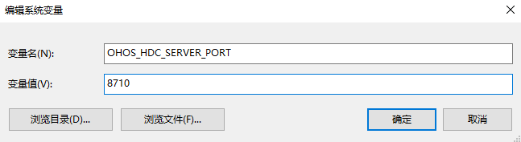
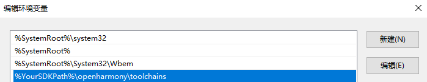

# hdc

hdc（OpenHarmony Device Connector）是为开发人员提供的用于调试的命令行工具，通过该工具可以在windows/linux/mac系统上与设备进行交互。

## 环境准备

hdc工具通过OpenHarmony SDK获取，存放于SDK的toolchains目录下，首次使用按照如下提示配置环境变量。

### 配置环境变量OHOS_HDC_SERVER_PORT

**Windows环境变量设置方法**

在**此电脑 &gt; 属性 &gt; 高级系统设置 &gt; 高级 &gt; 环境变量**中，添加HDC端口变量名为：OHOS_HDC_SERVER_PORT，变量值可设置为任意未被占用的端口，如8710。



环境变量配置完成后，关闭并重启DevEco Studio。

**macOS环境变量设置方法**

1. 打开终端工具，执行以下命令，根据输出结果分别执行不同命令。

   ```shell
   echo $SHELL 
   ```

   - 如输出结果为/bin/bash，则执行以下命令，打开.bash_profile文件。

      ```shell
      vi ~/.bash_profile
      ```

   - 如输出结果为/bin/zsh，则执行以下命令，打开.zshrc文件。

      ```shell
      vi ~/.zshrc
      ```

2. 单击字母“i”，进入**Insert**模式。
3. 输入以下内容，在PATH路径下添加OHOS_HDC_SERVER_PORT端口信息。

   ```shell
   OHOS_HDC_SERVER_PORT=8710
   launchctl setenv OHOS_HDC_SERVER_PORT $OHOS_HDC_SERVER_PORT
   export OHOS_HDC_SERVER_PORT
   ```

4. 编辑完成后，单击**Esc**键，退出编辑模式，然后输入“:wq”，单击**Enter**键保存。
5. 执行以下命令，使配置的环境变量生效。

   - 如果步骤1时打开的是.bash_profile文件，请执行如下命令：

      ```shell
      source ~/.bash_profile
      ```

   - 如果步骤1时打开的是.zshrc文件，请执行如下命令：

      ```shell
      source ~/.zshrc
      ```

6. 环境变量配置完成后，关闭并重启DevEco Studio。

### （可选）配置全局环境变量

> **说明：**
> 如未配置全局环境变量，开发者可通过命令行进入SDK的toolchains目录，在目录中执行hdc相关命令进行调试。

**Windows环境变量设置方法**

在**此电脑 &gt; 属性 &gt; 高级系统设置 &gt; 高级 &gt; 环境变量 &gt; 系统变量**中，将SDK的toolchains完整路径添加到Path变量值中，具体路径信息以SDK**实际配置路径**为准。

以下图示内容以本地SDK的toolchains完整路径<!--RP1-->_$DevEco Studio安装目录/sdk/default/openharmony/toolchains_<!--RP1End-->为例：




**Linux/macOS环境变量设置方法**

1. 打开终端工具，执行以下命令，根据输出结果分别执行不同命令。

   ```shell
   echo $SHELL 
   ```

   - 如输出结果为/bin/bash，则执行以下命令，打开.bash_profile文件。

      ```shell
      vi ~/.bash_profile
      ```

   - 如输出结果为/bin/zsh，则执行以下命令，打开.zshrc文件。

      ```shell
      vi ~/.zshrc
      ```

2. 单击字母“i”，进入**Insert**模式。

3. 输入以下内容，在PATH路径下**增加**SDK路径信息，具体路径信息以SDK**实际配置路径**为准。

   以下内容以本地SDK的toolchains完整路径<!--RP1-->_$DevEco Studio安装目录/sdk/default/openharmony/toolchains_<!--RP1End-->为例：

   ```shell
   HDC_SDK_PATH=${DevEco Studio安装目录}/sdk/default/openharmony/toolchains
   launchctl setenv HDC_SDK_PATH $HDC_SDK_PATH # 仅MacOS需要在此执行，Linux无须执行
   export PATH=$PATH:$HDC_SDK_PATH
   ```

4. 编辑完成后，单击**Esc**键，退出编辑模式，然后输入“:wq”，单击**Enter**键保存。

5. 执行以下命令，使配置的环境变量生效。

   - 如果步骤1时打开的是.bash_profile文件，请执行如下命令：

      ```shell
      source ~/.bash_profile
      ```

   - 如果步骤1时打开的是.zshrc文件，请执行如下命令：

      ```shell
      source ~/.zshrc
      ```
<!--Del-->
**（Linux可选）开启非root用户USB设备操作权限**

- （临时权限）设置USB设备操作权限最大化:

   ```shell
   sudo chmod -R 777 /dev/bus/usb/
   ```

- （永久权限）永久修改USB设备权限:

   1. 使用lsusb找出USB设备的vendorID和productID。

   2. 创建一个新的udev规则。

      编辑udev加载规则，用设备的“idVendor”和“idProduct”来替换默认值。

      MODE="0666"来表示USB设备的权限GROUP；GROUP代表用户组，要确保此时登录的系统用户在该用户组中：

        ```shell
        sudo vim /etc/udev/rules.d/90-myusb.rules
        SUBSYSTEMS=="usb", ATTRS{idVendor}=="067b", ATTRS{idProduct}=="2303", GROUP="users", MODE="0666"
        ```

   3. 重启电脑或重新加载udev规则：

        ```shell
        sudo udevadm control --reload
        ```

> **注意：**
> **开启非root用户USB设备操作权限**可以解决Linux环境在非root权限下使用hdc无法找到设备的情况，但权限最大化**可能存在潜在安全问题**，请开发者根据使用场景自行评估是否开启。

## 注意事项

- 使用hdc时如出现异常，可尝试通过hdc kill -r命令杀掉异常进程并重启hdc服务。

- 如出现hdc list targets获取不到设备信息的情况，可通过任务管理器查看是否有hdc进程存在。若进程存在，则通过hdc kill -r命令杀掉该进程并重启hdc服务。


## 开发指导
> **说明：**
>
> - 命令行中被[ ]修饰的参数表示可选参数。
> - 命令行中的参数若是斜体，表示在使用时该参数需替换为具体的信息。
<!--DelEnd-->

### 全局option相关命令

| Option | 说明 |
| -------- | -------- |
| -h/help | 打印hdc帮助信息 |
| -v/version | 打印hdc版本信息 |
| -t [connect-key] [command] | 连接指定的目标设备，connect-key可通过hdc list targets查询 | 
| -l [level] | 指定运行时日志等级，默认为LOG_INFO |
| wait | 等待设备正常连接，用于检测设备是否连接并准备好接收指令 |
| checkserver | 获取客户端与服务进程版本 |
| -s | 指定当前服务进程的网络监听参数 |
| -p | 绕过对服务进程的查询步骤，用于快速执行客户端命令 |
| -m | 使用前台启动模式启动服务进程 |

1. 显示hdc相关的帮助信息，命令格式如下：

   ```shell
   hdc -h/help
   ```

   **返回值：**
   | 返回值 | 说明 |
   | -------- | -------- |
   | OpenHarmony device connector(HDC) ...<br/>---------------------------------global commands:----------------------------------<br/>-h/help [verbose]&nbsp;&nbsp;&nbsp;&nbsp;&nbsp;&nbsp;&nbsp;&nbsp;&nbsp;&nbsp;&nbsp;&nbsp;&nbsp;&nbsp;&nbsp;&nbsp;&nbsp;&nbsp;&nbsp;&nbsp;&nbsp;- Print hdc help, 'verbose' for more other cmds<br/>..._（此处省略详细帮助信息）_ | hdc命令使用帮助信息 | 

   **使用方法：**

   ```shell
   hdc -h 或 hdc help
   ```

2. 显示hdc的版本信息，命令格式如下：

   ```shell
   hdc -v/version
   ```

   **返回值：**
   | 返回值 | 说明 |
   | -------- | -------- |
   | Ver: X.X.Xa | hdc（SDK）的版本信息 |

   **使用方法：**

   ```shell
   hdc -v 或 hdc version
   ```

3. 连接单台设备时，执行命令无需指定设备标识符；连接了多台设备时，每次执行命令时需要指定目标设备的标识符，命令格式如下：

   ```shell
   hdc -t [connect-key] [command]
   ```

   **参数：**
   | 参数名 | 说明 |
   | -------- | -------- |
   | connect-key| 设备标识符 |
   | command | hdc支持的命令 |

> **说明：**
   > connect-key为每个设备唯一的标识符。如果通过usb连接，标识符为序列号；如果通过网络连接设备，标识符为“IP地址:端口号”；

   **返回值：**
   | 返回值 | 说明 |
   | -------- | -------- |
   | 命令执行返回内容 | 请参考对应命令的返回值 |
   | [Fail]Not match target founded, check connect-key please | 没有找到与connect-key匹配的设备 |
   | [Fail]Device not founded or connected | 设备未找到或尚未连接 |
   | [Fail]ExecuteCommand need connect-key? please confirm a device by help info | 多设备连接时需要指定一个设备 |
   | Unknown operation command... | 不支持的命令 |

   **使用方法**：

   该方法需要与具体的操作命令搭配使用，下面以shell命令举例：

   ```shell
   hdc list targets  // 查询已连接的所有目标设备的connect-key
   hdc -t [connect-key] shell // -t后面添加的connect-key需要替换为指定的设备标识符
   ```

4. 指定运行时日志等级，默认为LOG_INFO，命令格式如下：

   ```shell
   hdc -l [level] [command]
   ```

   **参数：**
   | 参数 | 说明 |
   | -------- | -------- |
   | [level] | 指定运行时日志等级<br/>0：LOG_OFF<br/>1：LOG_FATAL<br/>2：LOG_WARN<br/>3：LOG_INFO<br/>4：LOG_DEBUG<br/>5：LOG_ALL <br/>6：libusb debug log| 
   | command | hdc支持的命令 |

   **返回值：**
   | 返回值 | 说明 |
   | -------- | -------- |
   | 命令执行返回内容 | 请参考对应命令的返回值 |
   | LOG日志信息 | 对应指定的运行时等级日志打印 |

   **使用方法：**

   ```shell
   hdc -l 5 shell ls
   ```

5. 等待设备正常连接，命令格式如下：

   ```shell
   hdc wait // 等待设备正常连接
   hdc -t connect-key wait // 等待指定的设备正常连接，connect-key需要替换为指定的设备标识符
   ```

   **返回值：**
   | 返回值 | 说明 |
   | -------- | -------- |
   | 无 | hdc wait命令执行后，识别到正常连接的设备后结束 | 

   **使用方法：**

   ```shell
   hdc wait
   hdc -t connect-key wait
   ```

6. 获取客户端与服务进程版本，命令格式如下：

   ```shell
   hdc checkserver
   ```

   **返回值：**
   | 返回值 | 说明 |
   | -------- | -------- |
   | Client version: Ver: X.X.Xa, Server version: Ver: X.X.Xa | client（客户端），server（服务进程）版本号 | 

   **使用方法：**

   ```shell
   hdc checkserver
   ```

7. 指定当前服务进程的网络监听参数，包括地址和端口号，以确保连接的即时配置，该设置将在当前会话中有效，命令格式如下：

    ```shell
    hdc -s [ip]:[port] [command]
    ```

    **参数：**
    | 参数 | 说明 |
    | -------- | -------- |
    | ip | 指定监听的IP地址，支持IPv4和IPv6 |
    | port | 指定监听的端口，范围：1~65536 |
    | command | hdc支持的命令 |

    **返回值： **
    | 返回值 | 说明 |
    | -------- | -------- |
    | Connect server failed | 与服务进程建立连接失败 |
    
    使用方法：
    ```shell
    # 在已有服务进程，且服务进程的网络监听参数为127.0.0.1:8710的环境中，执行查询设备命令
    hdc -s 127.0.0.1:8710 list targets
    ```

> **说明：**
    > 当命令行中明确使用 -s 参数指定服务端口时，系统将忽略OHOS_HDC_SERVER_PORT环境变量中定义的端口设置。

8. 绕过对服务进程的查询步骤，用于快速执行客户端命令，命令格式如下：
    ```shell
    hdc -p [command]
    ```

   **参数：**
   | 参数 | 说明 |
   | -------- | -------- |
   | command | hdc支持的命令 |

    **返回值：**
   | 返回值 | 说明 |
   | -------- | -------- |
   | Connect server failed | 与服务进程建立连接失败 | 

    使用方法：
    ```shell
    # 启动后台服务进程
    hdc start
    # 跳过进程查询，直接执行命令
    hdc -p list targets
    ```
> **说明：**
    > 在未指定 -p 参数的情况下直接执行 command 命令时，客户端将首先检查本地是否已有运行的服务进程。若无服务进程运行，客户端将自动启动一个后台服务进程，并建立连接以传递命令；若已有一个服务进程在运行，客户端将直接与该后台服务建立连接并下发相应的命令。<br>

9. 使用前台启动模式启动服务进程，命令格式如下：
    ```shell
    hdc -m
    ```
    **返回值：**
    | 返回值 | 说明 |
    | -------- | -------- |
    | Initial failed | 服务进程初始化失败 |
    | [I][_1970-01-01 00:00:00.000_][_abcd_][_session.cpp:25_] _Program running. Ver: X.X.Xa Pid:12345_ | 正常打印对应等级的日志，显示服务端活动状态 |
    
    使用方法：
    ```shell
    # 指定当前服务进程的网络监听参数并启动服务进程
    hdc -s 127.0.0.1:8710 -m
    ```

> **说明：**
   > 1. 使用前台启动参数时，可通过附加 -s 参数来指定服务进程的网络监听参数。如果既没有使用 -s 指定网络监听参数，也没有配置环境变量OHOS_HDC_SERVER_PORT配置监听端口，系统将采用默认网络监听参数:127.0.0.1:8710。<br>
   > 2. 在服务进程前台启动模式下，系统默认的日志输出等级设置为 LOG_DEBUG。如需变更日志等级，可通过结合使用 -l 参数来进行相应的调整。<br>
   > 3. 在运行环境中，仅允许单一的服务进程实例存在。若运行环境中已存在一个活跃的后台服务进程，那么尝试在前台启动新的服务进程实例将不会成功。


### 查询设备列表相关命令

| 命令 | 说明 |
| -------- | -------- |
| list targets [-v] | 查询已连接的所有目标设备，添加-v选项，则会打印设备详细信息 |

显示所有已连接的设备列表，命令格式如下：

```shell
hdc list targets [-v]
```

**返回值：**
| 返回值 | 说明 |
| -------- | -------- |
| 设备信息 | 已连接的设备列表信息 |
| [Empty] | 没有查询到设备信息 |

**使用方法：**

```shell
hdc list targets
hdc list targets -v
```

### 服务进程相关命令

| 命令 | 说明 |
| -------- | -------- |
| target mount | 以读写模式挂载系统分区（user不可用） |
| target boot [-bootloader\|-recovery] | 重启目标设备，使用-bootloader参数重启后进入fastboot模式，使用-recovery参数重启后进入recovery模式 |
| target boot [MODE] | 重启目标设备，加参数重启后进入相应的模式，其中MODE为/bin/begetctl命令中reboot支持的参数 |
| smode [-r] | 授予设备端hdc后台服务进程root权限， 使用-r参数取消授权（user不可用） |
| kill [-r] | 终止hdc服务进程，使用-r参数触发服务进程重新启动 |
| start [-r] | 启动hdc服务进程，使用-r参数触发服务进程重新启动 |

1. 以读写模式挂载系统分区，命令格式如下：

   ```shell
   hdc target mount
   ```

   **返回值：**
   | 返回值 | 说明 |
   | -------- | -------- |
   | Mount finish | 挂载成功 |
   | [Fail]Mount failed | 挂载失败 |

   **使用方法：**

   ```shell
   hdc target mount
   ```

2. 重启目标设备，命令格式如下：

   ```shell
   target boot [-bootloader|-recovery]
   target boot [MODE]
   ```

   **参数：**
   | 参数名 | 说明 |
   | -------- | -------- |
   | 不加参数| 重启设备 |
   | -bootloader| 重启后进入fastboot模式 |
   | -recovery | 重启后进入recovery模式 |
   | MODE | 重启后进入MODE模式，MODE为/bin/begetctl命令中reboot支持的参数,<br> 可通过hdc shell "/bin/begetctl -h \| grep reboot"查看 |

   **使用方法：**

   ```shell
   hdc target boot -bootloader // 重启后进入fastboot模式
   hdc target boot -recovery  // 重启后进入recovery模式
   hdc target boot shutdown  // 关机

3. 授予设备端hdc后台服务进程root权限，命令格式如下：

   ```shell
   hdc smode [-r]
   ```

   **返回值：**
   | 返回值 | 说明 |
   | -------- | -------- |
   | 无返回值 | 授予权限成功 |
   | [Fail]具体失败信息 | 授予权限失败 |

   **使用方法：**

   ```shell
   hdc smode  
   hdc smode -r  // 取消root权限
   ```

4. 终止hdc服务进程，命令格式如下：

   ```shell
   hdc kill [-r]
   ```

   **返回值：**
   | 返回值 | 说明 |
   | -------- | -------- |
   | Kill server finish | 服务进程终止成功 |
   | [Fail]具体失败信息 | 服务进程终止失败 |

   **使用方法：**

   ```shell
   hdc kill
   hdc kill -r  // 重启并终止服务进程
   ```

5. 启动hdc服务进程，命令格式如下：

   ```shell
   hdc start [-r]
   ```

   **返回值：**
   | 返回值 | 说明 |
   | -------- | -------- |
   | 无返回值 | 服务进程启动成功 |
   | [Fail]具体失败信息 | 服务进程启动失败 |

   **使用方法：**

   ```shell
   hdc start
   hdc start -r // 服务进程启动状态下，触发服务进程重新启动
   ```

> **说明：**
   > 1. 同时指定 -l 参数和配置OHOS_HDC_LOG_LEVEL环境变量执行`hdc start`，如不存在服务进程，将以OHOS_HDC_LOG_LEVEL参数配置的日志等级启动服务进程；<br>
   > 2. 指定 -l 参数和未配置OHOS_HDC_LOG_LEVEL环境变量执行`hdc start`，如不存在服务进程，指定 -l 参数配置的日志等级启动服务进程。

### 网络相关命令

| 命令 | 说明 |
| -------- | -------- |
| fport ls | 列出全部转发端口转发任务 |
| fport _localnode remotenode_ | 设置正向端口转发任务：监听“主机端口”，接收请求并进行转发， 转发到“设备端口” |
| rport _remotenode localnode_ | 设置反向端口转发任务：监听“设备端口”，接收请求并进行转发，转发到“主机端口” |
| fport rm _taskstr_ | 删除指定的端口转发任务|
| tmode usb | 该命令不会实际操作设备连接通道，需要在设备设置界面通过USB调试开关进行设置 |
| tmode port [port-number] | 打开设备网络连接通道：设备端daemon进程会重启，已建立的USB连接会中断，需要重新连接 |
| tmode port close | 关闭设备无线连接通道：设备端daemon进程会重启，已建立的USB连接会中断，需要重新连接 |
| tconn [IP]:[port] [-remove] | 指定连接设备：通过“IP地址：端口号”来指定连接的设备，使用-remove参数断开连接 |

1. 列出全部转发端口转发任务，命令格式如下：

   ```shell
   hdc fport ls
   ```

   **返回值：**
   | 返回值 | 说明 |
   | -------- | -------- |
   | tcp:1234 tcp:1080 [Forward] | 正向端口转发任务 |
   | tcp:2080 tcp:2345 [Reverse] | 反向端口转发任务 |
   | [empty] | 无端口转发任务 |

   **使用方法：**

   ```shell
   hdc fport ls
   ```

2. 设置正向端口转发任务，执行后将设置指定的“主机端口”转发数据到“设备端口”转发任务，命令格式如下：

   ```shell
   hdc fport localnode remotenode
   ```

   **返回值：**
   | 返回值 | 说明 |
   | -------- | -------- |
   | Forwardport result:OK | 端口转发任务设置正常 |
   | [Fail]Incorrect forward command | 端口转发任务设置失败，端口转发参数错误 |
   | [Fail]TCP Port listen failed at XXXX | 端口转发任务设置失败，本地转发端口被占用 |

   **使用方法：**

   ```shell
   hdc fport tcp:1234 tcp:1080
   ```


3. 设置反向端口转发任务，执行后将设置指定的“设备端口”转发数据到“主机端口”转发任务，命令格式如下：

   ```shell
   hdc rport remotenode localnode
   ```

   **返回值：**
   | 返回值 | 说明 |
   | -------- | -------- |
   | Forwardport result:OK | 端口转发任务设置正常 | 
   | [Fail]Incorrect forward command | 端口转发任务设置失败，端口转发参数错误 |
   | [Fail]TCP Port listen failed at XXXX | 端口转发任务设置失败，本地转发端口被占用 |

   **使用方法：**

   ```shell
   hdc rport tcp:1234 tcp:1080
   ```
4. 删除端口转发任务，执行后将指定的转发任务删除，命令格式如下：

   ```shell
   hdc fport rm taskstr
   ```

   **参数：**
   | 参数 | 说明 |
   | -------- | -------- |
   | _taskstr_ | 端口转发任务，形如 tcp:XXXX tcp:XXXX | 

   **返回值：**
   | 返回值 | 说明 |
   | -------- | -------- |
   | Remove forward ruler success, ruler:tcp:XXXX tcp:XXXX | 端口转发任务删除正常 |
   | [Fail]Remove forward ruler failed, ruler is not exist tcp:XXXX tcp:XXXX | 端口转发任务删除失败，不存在指定的转发任务 |

   **使用方法：**

   ```shell
   hdc fport rm tcp:1234 tcp:1080
   ```


5. 打开设备USB连接通道，命令格式如下：

   ```shell
   hdc tmode usb
   ```

   **使用方法：**

   ```shell
   hdc tmode usb
   ```
   > **说明：**
   > 该命令不会实际操作设备连接通道，需要在设备设置界面通过USB调试开关进行设置。

6. 打开设备网络连接通道，命令格式如下：

   ```shell
   hdc tmode port [port-number]
   ```

   **参数：**
   | 参数 | 参数说明 |
   | -------- | -------- |
   | port-number | 监听连接的网络端口号，范围:1~65536 |

   **返回值：**
   | 返回值 | 说明 |
   | -------- | -------- |
   | Set device run mode successful. | 打开成功 |
   | [Fail]ExecuteCommand need connect-key | 打开失败，设备列表无设备，无法打开设备无线调试通道 |
   | [Fail]Incorrect port range | 端口号超出可设置范围（1~65536） |

   **使用方法：**

   ```shell
   hdc tmode port 1234
   ```

   > **注意：**
   > 切换前，请确保条件满足：远端设备与近端执行机处于同一网络，且执行机可ping通远端设备IP。
   >
   > 如不满足以上条件请勿使用该命令进行切换。

   > **说明：**
   > 执行完毕后，远端daemon进程将会退出并重启，USB连接将会断开，需要重新连接。

7. 关闭设备无线连接通道，命令格式如下：

   ```shell
   hdc tmode port close
   ```

   **返回值：**
   | 返回值 | 说明 |
   | -------- | -------- |
   | [Fail]ExecuteCommand need connect-key | 设备列表无设备，无法执行命令 |

   **使用方法：**

   ```shell
   hdc tmode port close
   ```
   > **说明：**
   > 执行完毕后，远端daemon进程将会退出并重启，USB连接将会断开，需要重新连接。

8. 通过TCP连接指定的设备，命令格式如下：

   ```shell
   hdc tconn [IP]:[port] [-remove]
   ```

   **参数：**
   | 参数 | 参数说明 |
   | -------- | -------- |
   | [IP]:[port]  | 设备的IP地址与端口号|
   | -remove | 【可选】断开指定设备的连接 |

   **返回值：**
   | 返回值 | 说明 |
   | -------- | -------- |
   | Connect OK | 连接成功 |
   | [Info]Target is connected, repeat opration | 设备当前已连接 |
   | [Fail]Connect failed | 连接失败 |

   **使用方法：**

   ```shell
   hdc tconn 192.168.0.1:8888
   hdc tconn 192.168.0.1:8888 -remove  // 断开指定网络设备连接
   ```

### 文件相关命令

| 命令 | 说明 |
| -------- | -------- |
| file send _localpath remotepath_ | 从本地发送文件至远端设备 |
| file recv _remotepath localpath_ | 从远端设备发送文件至本地 |

1. 从本地发送文件至远端设备，命令格式如下：

   ```shell
   hdc file send localpath remotepath
   ```

   **参数：**
   | 参数名 | 说明 |
   | -------- | -------- |
   | _localpath_ | 本地待发送的文件路径 |
   | _remotepath_ | 远程待接收的文件路径 |

   **返回值：**

   文件发送成功，返回传输成功的结果信息。文件发送失败，返回传输失败的具体信息。

   **使用方法：**

   ```shell
   hdc file send E:\example.txt /data/local/tmp/example.txt
   ```

2. 从远端设备发送文件至本地，命令格式如下：

   ```shell
   hdc file recv remotepath localpath
   ```

   **参数：**
   | 参数名 | 说明 |
   | -------- | -------- |
   | _localpath_ | 本地待接收的文件路径 |
   | _remotepath_ | 远程待发送的文件路径 |

   **返回值：**

   文件接收成功，返回传输成功的结果信息。文件接收失败，返回传输失败的具体信息。

   **使用方法：**

   ```shell
   hdc file recv  /data/local/tmp/a.txt   ./a.txt
   ```

### 应用相关命令

| 命令 | 说明 |
| -------- | -------- |
| install _src_ | 安装指定的应用文件 |
| uninstall _packageName_ | 卸载指定的应用包package包名 |

1. 安装APP package，命令格式如下：

   ```shell
   hdc install [-r|-s] src
   ```

   **参数：**
   | 参数名 | 说明 |
   | -------- | -------- |
   | src| 应用安装包的文件名 |
   | -r | 替换已存在应用（.hap） |
   | -s | 安装一个共享包（.hsp） |

   **返回值：**
   | 返回值 | 说明 |
   | -------- | -------- |
   | AppMod finish | 成功情况下返回安装信息和AppMod finish |
   | 具体安装失败原因 | 失败情况下返回具体安装失败信息 |

   **使用方法：**

   以安装example.hap包为例：

   ```shell
   hdc install E:\example.hap
   ```

2. 卸载应用，命令格式如下：

   ```shell
   hdc uninstall [-k|-s] packageName
   ```

   **参数：**
   | 参数名 | 说明 |
   | -------- | -------- |
   | packageName | 应用安装包 |
   | -k | 保留/data和/cache目录 |
   | -s | 卸载共享包 |

   **返回值：**
   | 返回值 | 说明 |
   | -------- | -------- |
   | AppMod finish | 成功情况下返回卸载信息和AppMod finish |
   | 具体卸载失败原因 | 失败情况下返回具体卸载失败信息 |

   **使用方法：**

   以卸载com.example.hello包为例：

   ```shell
   hdc uninstall com.example.hello
   ```

### 调试相关命令

| 命令 | 说明 |
| -------- | -------- |
| jpid | 显示设备上所有开启了JDWP调试协议的应用的PID |
| track-jpid [-a\|-p]  | 实时显示设备上开启了JDWP调试协议的应用的PID和应用名，不加参数只显示debug的应用的进程，使用-a参数显示debug和release应用的进程，使用-p参数不显示debug和release的标签 |
| hilog [options] | 打印设备端的日志信息，options表示hilog支持的参数，可通过hdc hilog -h查阅支持的参数列表  |
| shell [command] | 交互命令，command表示需要执行的单次命令，不同类型或版本的系统支持的command命令有所差异，可以通过hdc shell ls /system/bin查阅支持的命令列表 |

1. 抓取log信息，命令格式如下：

   ```shell
   hdc hilog [options]
   ```

   **参数：**
   | 参数 | 说明 |
   | -------- | -------- |
   | [options] | hilog支持的参数，可通过hdc hilog -h查阅支持的参数列表 |

   **返回值：**
   | 返回值 | 说明 |
   | -------- | -------- |
   | 返回具体信息 | 抓取的日志信息 |

   **使用方法：**

   ```shell
   hdc hilog 
   hdc shell "hilog -r" // 清理hilog缓存日志
   ```

2. 显示设备上所有开启了JDWP调试协议的进程的PID，命令格式如下：

   ```shell
   hdc jpid
   ```

   **返回值：**
   | 返回值 | 说明 |
   | -------- | -------- |
   | 进程号列表 | 开启了JDWP调试协议的应用的PID |
   | [empty] | 无开启了JDWP调试协议的进程 |

   **使用方法：**

   ```shell
   hdc jpid
   ```

3. 实时显示设备上开启了JDWP调试协议的进程的PID和应用名，命令格式如下：

   ```shell
   track-jpid [-a|-p]
   ```

   **参数：**
   | 参数 | 说明 |
   | -------- | -------- |
   | 不加参数 | 只显示debug的应用的进程号和包名/进程名 |
   | -a | 显示debug和release应用的进程号和包名/进程名 |
   | -p | 显示debug和release应用的进程号和包名/进程名，但不显示debug和release的标签 |

   **返回值：**
   | 返回值 | 说明 |
   | -------- | -------- |
   | 进程号和包名/进程名列表 | - |
   | [empty] | 不加参数时表示无开启了JDWP调试协议的debug应用的进程，使用-a或-p参数时表示无开启了JDWP调试协议的进程 |

   **使用方法：**

   ```shell
   hdc track-jpid
   ```

4. 交互命令，命令格式如下：

   ```shell
   hdc shell [command]
   ```

   **参数：**
   | 参数 | 说明 |
   | -------- | -------- |
   | [command] | 调试命令行可用命令，详细可用命令help来获取全部命令提示 |

   **返回值：**
   | 返回值 | 说明 |
   | -------- | -------- |
   | 交互命令返回内容 | 返回内容详情请参见其他交互命令返回内容 | 
   | /bin/sh: XXX : inaccessible or not found | 不支持的交互命令 |

   **使用方法：**

   ```shell
   hdc shell ps -ef  
   hdc shell help -a // 查询全部可用命令
   ```

### 安全相关命令

| 命令 | 说明 |
| -------- | -------- |
| keygen FILE | 生成一个新的秘钥对，并将私钥和公钥分别保存到FILE和FILE.pub，其中文件名FILE可自定义 |

1. 生成一个新的秘钥对，命令格式如下：

   ```shell
   hdc keygen FILE
   ```

   **参数：**
   | 参数 | 说明 |
   | -------- | -------- |
   | FILE | FILE为自定义的文件名 |

   **使用方法：**

   ```shell
   hdc keygen key // 在当前目录下生成key和key.pub文件
   ```


## 常见场景

### USB连接场景

**环境确认**
| 确认项 | 正常 | 异常处理 |
| -------- | -------- | -------- |
| USB调试选项 | 开启 | 设备的USB调试模式如无法自动开启，请尝试重启设备 |
| USB数据连接线 | 使用USB数据连接线连接到调试PC的USB接口 | 如使用低带宽、无数据通信功能的USB连接线可能导致无法识别HDC设备，建议更换官方USB数据连接线 |
| USB接口 | 主板直出USB接口（台式机为后面板的USB接口，笔记本为机身的USB接口） | 如使用转接头/拓展坞/台式机前面板USB接口，存在带宽低和USB同步异常等问题，会导致频繁断连，推荐使用直连方式连接PC和设备 |
| hdc环境变量 | 终端命令行输入hdc -h有回显帮助信息内容 | 参见环境准备章节 |
| 驱动 | 连接HDC设备后，设备管理器通用串行总线设备存在设备"HDC Device"或"HDC Interface" | 请安装驱动 |

**连接步骤**

```shell
hdc shell //USB直连需要确认设备非处在tcp连接模式，直接连接即可。
```

### TCP连接场景

**环境确认**
| 确认项 | 正常 | 异常处理 |
| -------- | -------- | -------- |
| 网络连接 | PC、手机设备处于同一网络 | 连接同一WiFi或手机开启热点 |
| 网络状态 | telnet IP:port正常，网速稳定 | 请选择稳定的网络连接方式 |
| hdc环境变量 | 终端命令行输入hdc有回显帮助信息 | 参见环境准备章节 |

**连接步骤**

1. PC通过USB连接设备。


2. 将设备通过USB模式切换至tcp模式，执行以下命令：

   ```shell
   hdc tmode port 8710  //port 后加指定端口号（可自行设置）
   ```

3. 通过tcp连接设备（需要事先知道设备IP），执行以下命令：

   ```shell
   hdc tconn IP:8710
   ```

   IP可在手机查看设备侧的IP地址，端口号为上一步指定的，默认值为8710。

4. 查看已连接设备，执行以下命令：

   ```shell
   hdc list targets
   ```

   返回值为IP:port形式即为连接成功。

5. （可选）TCP模式切换回USB模式,在已连接TCP模式状态下，执行以下命令：

   ```shell
   hdc tmode usb
   ```

   切换后将恢复USB模式。

### 远程连接场景

远程连接结构如图所示:


**服务端配置**

服务端通过USB连接到对应的HDC设备后执行以下命令：

```shell
hdc kill          // 关闭本地hdc服务
hdc -s IP:8710 -m // 启动网络转发的hdc服务
                  // 其中IP为服务端自身的IP，windows可通过ipconfig查询，unix系统可通过ifconfig查询
                  // 8710为默认端口号，也可设置为其他端口号如：18710
                  // 启动后服务端将打印日志
```

**客户端连接**

客户端连接需要确保可以连通服务端IP地址，满足前述条件后执行以下命令：
```shell
hdc -s IP:8710 [command] // 其中IP为服务端IP，
                         // command可以为任意hdc可用命令，例如list targets
```

### 日志获取场景

**server端日志**

执行以下命令开启日志获取：

```shell
hdc kill ​
hdc -l5 start
```

收集到的完整日志存放路径：

| 平台 | 路径 | 备注 |
| -------- | -------- | -------- |
| Windows | %temp%\hdc_logs | 实际路径参考，实际使用请替换用户名变量<br/>C:\Users\用户名\AppData\Local\Temp\hdc_logs |
| Linux | /tmp/hdc_logs | - |
| MacOS | $TMPDIR/hdc_logs | - |

hdc_logs日志文件夹将存在以下类型日志：

|日志类型 | 日志名称格式 | 日志用途 | 备注 |
| -------- | -------- | -------- | -------- |
| 实时日志 | hdc.log | 实时记录hdc server日志 | 每次重启hdc server，将会重命名原有日志并记录新的hdc.log|
| 历史日志临时文件 | hdc-%Y%m%d-%H%M%S.log | 转储历史日志归档生成的中间文件 | 以时间`2024年9月19日16:18:57.921`为例，<br>对应时间格式为：`20240919-161857921`，<br>生成的日志临时文件名为：`hdc-20240919-161857921.log` |
| 历史日志归档文件 | hdc-%Y%m%d-%H%M%S.log.tgz | 压缩存储历史日志 | 归档文件为`.tgz`类型压缩文件，可使用解压工具进行解压查看。<br>以历史日志临时文件名`hdc-20240919-161857921.log`为例，<br>对应的历史日志归档文件名为：`hdc-20240919-161857921.log.tgz`，<br>历史日志归档文件生成后，对应的历史日志临时文件将自动删除。 |
| 实时日志缓存临时文件 | .hdc.cache.log | 实时日志产生的临时缓存 | |

日志相关环境变量：
| 环境变量名称             | 默认值 | 用途                             |
|--------------------|-----|--------------------------------|
| OHOS_HDC_LOG_LEVEL | 5   | 配置服务端日志记录级别                      |
| OHOS_HDC_LOG_LIMIT | 300 | 配置日志条目数量阈值。当日志记录超出此阈值时，系统将自动启动日志清理机制，以维护日志存储空间的优化，当前系统设定下，日志存储空间的上限为3GB，该限制目前不可调整。|


**设备端日志**

开启hilog日志工具，获取对应日志，命令如下：

```shell
hdc shell hilog -w start                              // 开启hilog日志落盘
hdc shell ls /data/log/hilog                          // 查看已落盘hilog日志
hdc file recv /data/log/hilog                         // 获取hilog已落盘日志（包含内核日志）
```

## 常见问题

### 设备无法识别

**现象描述**

命令行执行`hdc list targets`命令后，返回结果为`[empty]`。

可通过以下方式排查。

- 情况一：查看设备管理是否显示HDC设备。

  Windows环境：

  在`设备管理器`>`通用串行总线设备`中是否显示`HDC Device`（单一端口设备）或`HDC Interface`（复合端口设备）。

  Linux环境：

  在命令行执行`lsusb`,在返回的内容中查看是否有`HDC Device`（单一端口设备）或`HDC Interface`（复合端口设备）。

  MacOS环境：

  使用`系统信息`或`系统概述`来查看USB设备，步骤如下：

  1. 按住键盘上的Option键，点按菜单。

  2. 选取`系统信息`或`系统概述`。

  3. 在随后出现的窗口中，选择左边的`USB`。

  4. 在随后显示的设备树查看是否有`HDC Device`（单一端口设备）或`HDC Interface`（复合端口设备）。

  **可采取的解决方法**

  以上环境如没有显示HDC设备，则说明无法识别设备，可以根据实际场景尝试以下方法：

  - 使用其他USB物理接口。
  - 更换USB数据连接线。
  - 使用其他计算机调试。
  - 设备开启USB调试模式。
  - 设备出现弹窗点击允许调试。
  - 如可通过TCP模式连接，可执行`hdc tmode usb`命令恢复USB连接。
  - 设备恢复出厂设置。

- 情况二：存在USB设备，但是驱动损坏，显示"HDC Device"⚠警告图标。

  现象描述：该问题常见于Windows环境，现象为`设备管理器`>`通用串行总线设备`中，`HDC Device`显示为黄标警告，且描述信息为该设备无法正常工作。可尝试重新安装驱动解决，如重新安装驱动无法解决，可以尝试更换USB连接数据线/拓展坞/USB接口。

  **重新安装驱动的方法**

  1. 打开`设备管理器`，右键点击存在警告图标的`HDC Device`；

  2. 出现的菜单中点击`更新驱动程序`；

  3. 出现的提示窗口（第1/3个）中，选取`浏览我的电脑以查找驱动程序`；

  4. 出现的提示窗口（第2/3个）中，选取`让我从计算机上的可用驱动程序列表中选取`；

  5. 出现的提示窗口（第3/3个）中，取消勾选`显示兼容硬件`，选择厂商：`WinUSB设备`，选择型号：`WinUSB设备`，选择完成后点击`下一步`按钮。

- 情况三：连接设备时出现`[Fail]Failed to communicate with daemon`。

  现象描述：命令行执行hdc相关命令，执行失败返回`[Fail]Failed to communicate with daemon`。

  可能存在以下原因，可参考排查：

  - hdc或SDK版本与设备不匹配: 如果设备更新到最新版本，可更新hdc或SDK工具至最新版本。
  - 端口被占用：

    常见于hdc和hdc_std使用同一端口，同时运行时OHOS_HDC_SERVER_PORT设置的端口互相冲突（未设置则使用默认端口8710，仍然会冲突），注意只运行其中一个。其他软件占用hdc默认端口也会导致该问题发生。

- 情况四：连接设备时出现`Connect server failed`。

  出现该现象，可能有如下原因：

  - **端口抢占**

    解决方法如下：
    1. 排查自带hdc的软件进程。

       包括自带hdc的软件（DevEco Studio、DevEco Testing），如存在请关闭这些软件后再执行hdc相关命令。

    2. 查询HDC端口情况。

       以设置的OHOS_HDC_SERVER_PORT为8710端口为例，在不同平台查询命令如下：

       Unix：

       ```shell
       netstat -an |grep 8710
       ```

       Windows:

       ```shell
       netstat -an |findstr 8710
       ```

       如存在抢占的软件，可以关闭该软件进程或者更换OHOS_HDC_SERVER_PORT环境变量为其他端口号。

    3. 排查未关闭的其他版本hdc server

       Windows：

       使用`任务管理器`>`详细信息`查询hdc.exe进程,右键打开文件所在位置，核对位置是否为配置的环境变量中的hdc文件位置，如果不一致，可尝试结束hdc.exe进程(hdc kill或者任务管理器直接结束进程)并重新执行hdc命令。（关闭hdc server后执行hdc命令会重新启动hdc server）

       Unix：

       使用`ps -ef |grep hdc`查询hdc后台server进程，核对进程启动位置是否为配置的环境变量中的hdc文件位置，如果不一致，可尝试结束hdc进程(hdc kill或者kill -9 hdc进程的PID)并重新执行hdc命令。（关闭hdc server后执行hdc命令会重新启动hdc server）

  - **注册表异常**

    解决方法：清理注册表，步骤如下：

    1. 同时按下`Win`+`R`键，启动运行工具，输入栏输入`regedit`打开注册表。
    2. 注册表地址栏输入以下内容并按下`回车`，即可进入USB类设备驱动程序的注册表。

       ```shell
       计算机\HKEY_LOCAL_MACHINE\SYSTEM\CurrentControlSet\Control\Class\{88bae032-5a81-49f0-bc3d-a4ff138216d6}
       ```

    3. 找到`UpperFilters`键，右键`修改`编辑，**备份**并清空其中数值数据内容（如清空后无法解决问题可依照备份恢复）。
    4. 刷新设备管理器/插拔USB接口/重启计算机。

### hdc无法运行

**现象描述**

使用命令行执行hdc.exe/hdc 二进制文件无法运行。

**可能原因&解决方法**

- 运行环境异常

  Linux运行环境：建议使用Ubuntu18.04及以上64版本，如出现libc++.so引用错误，请使用ldd/readelf等命令检查库引用。

  MacOS运行环境：建议使用MacOS 11及以上版本。

  Windows运行环境：建议使用Windows10/Windows11 64位版本，如低版本缺失WinUSB库/驱动，请使用Zadig工具更新。对于符合设备，需要使用Zadig工具安装libusb-win32驱动。详情请见：[Zadig链接](https://github.com/pbatard/libwdi/releases)。

- 运行方式不当：请使用命令行依照正确命令运行hdc工具，而非鼠标双击文件。

### 其他问题排查常用步骤

1. 命令行执行`hdc list targets`查看返回值。
2. 查看`设备管理`是否有`HDC Device`。
3. 执行`hdc kill`关闭server后，执行`hdc -l5 start`收集日志（hdc.log位于执行端TEMP目录下hdc_logs文件夹中，不同平台目录位置存在差异，可参考[日志获取场景](#日志获取场景)）。
4. 通过hdc.log日志定位相关问题。