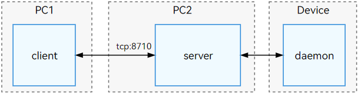

# hdc

hdc（OpenHarmony Device Connector）是为开发人员提供的用于调试的命令行工具，通过该工具可以在windows/linux/mac系统上与设备进行交互。

hdc分为三部分：

**client**：运行在电脑端的进程，开发者在执行hdc命令时启动该进程，命令结束后进程退出。

**server**：运行在电脑端的后台服务进程，用来管理client进程和设备端的daemon进程之间的数据交互，以及设备发现等。

**daemon**：作为守护进程运行在设备端，用来响应电脑端server发来的请求。

关系如下图所示：


> **说明：**
>
> hdc client在启动时，默认会判断server是否正在运行，如果没有运行则会启动一个新的hdc程序作为server，运行在后台。
>
> hdc server运行时，默认会监听PC的8710端口，开发者可通过设置系统环境变量OHOS_HDC_SERVER_PORT自定义监听的端口号。

## 环境准备

下载并安装[DevEco Studio](https://developer.huawei.com/consumer/cn/deveco-studio/)，hdc应用程序可以在DevEco Studio安装位置下：DevEco Studio/sdk/default/openharmony/toolchains目录中查看。

### （可选）命令行直接执行hdc程序

开发者可通过命令行进入SDK的toolchains目录，在目录中执行hdc相关命令进行调试。
为了方便在命令行中直接执行hdc程序，开发者也可以将hdc程序文件路径添加到操作系统命令搜索路径的环境变量中。
例如，Windows系统可以添加到系统环境变量Path中。

### （可选）hdc server配置

通过配置对应的系统环境变量，可以修改hdc server的监听端口，日志打印级别或特性开关等，详细介绍请查看[可选配置项](#可选配置项)章节。

> **说明：**
>
> 环境变量配置完成后，关闭并重启命令行或其他使用到OpenHarmony SDK的软件。

## hdc命令列表

### 全局参数

全局参数是指运行部分hdc命令时，可以跟随在hdc后面的参数，例如：
选择指定的设备执行命令，使用-t参数：

   ```shell
   hdc -t connect-key shell echo "Hello world"
   ```

| 参数 | 说明 |
| -------- | -------- |
| -t | 连接指定的目标设备，连接一台设备时为可选参数，连接多台设备时为必选参数。 |
| -l | 可选参数，指定运行时日志等级，范围为数字0-6，默认为3（LOG_INFO）。 |
| -s | 可选参数，指定客户端连接服务端时，服务进程的网络监听参数，格式为ip:port。 |
| -p | 可选参数，绕过对服务进程的查询步骤，用于快速执行客户端命令。 |
| -m | 可选参数，使用前台启动模式启动服务进程。 |

### 命令列表
| 命令 | 说明 |
| -------- | -------- |
| list targets | 查询已连接的所有目标设备。 |
| wait | 等待设备正常连接。 |
| tmode usb | 该命令已经废弃，不会实际操作设备连接通道，需要在设备设置界面通过USB调试开关进行设置。 |
| tmode port | 打开设备网络连接通道。 |
| tmode port close | 关闭设备网络连接通道。 |
| tconn | 指定连接设备：通过“IP地址：端口号”来指定连接的设备。 |
| shell | 在设备侧执行单次命令。 |
| install | 安装指定的应用文件。 |
| uninstall | 卸载指定的应用包。 |
| file send | 从本地发送文件至远端设备。 |
| file recv | 从远端设备发送文件至本地。 |
| fport ls | 列出全部转发端口转发任务。 |
| fport | 设置正向端口转发任务：监听“主机端口”，接收请求并进行转发， 转发到“设备端口”。 |
| rport | 设置反向端口转发任务：监听“设备端口”，接收请求并进行转发，转发到“主机端口”。 |
| fport rm | 删除指定的端口转发任务。 |
| start | 启动hdc服务进程。 |
| kill | 终止hdc服务进程。 |
| hilog | 打印设备端的日志信息。 |
| jpid | 显示设备上所有开启了JDWP调试协议的应用的PID。 |
| track-jpid | 实时显示设备上开启了JDWP调试协议的应用的PID和应用名。 |
| target boot| 重启目标设备。 |
| <!--DelRow--> target mount | 以读写模式挂载系统分区（非root的设备不可用）。 |
| <!--DelRow--> smode | 授予设备端hdc后台服务进程root权限， 使用-r参数取消授权（非root的设备不可用）。 |
| keygen | 生成一个新的秘钥对。 |
| version | 打印hdc版本信息，也可使用hdc -v打印版本信息。 |
| checkserver | 获取客户进程与服务进程版本信息。 |

> **说明：**
>
> 全局参数在使用时需要放在命令之前。

## 基本使用方法

在使用hdc前，请在设备上开启usb调试功能，用usb线连接设备和PC。

### 查询连接的设备

   ```shell
   hdc list targets
   ```

### 执行shell命令

   ```shell
   hdc shell echo "Hello world"
   ```

### 获取帮助

| 命令 | 说明 |
| -------- | -------- |
| -h [verbose] | 显示hdc相关的帮助信息。可选参数：verbose，显示详细的帮助信息。 |
| help | 显示hdc相关的帮助信息。 |

显示hdc相关的帮助信息，命令格式如下：

   ```shell
   hdc -h [verbose]
   hdc help
   ```

**返回值：**
| 返回值 | 说明 |
| -------- | -------- |
| OpenHarmony device connector(HDC) ...<br/>---------------------------------global commands:----------------------------------<br/>-h/help [verbose]&nbsp;&nbsp;&nbsp;&nbsp;&nbsp;&nbsp;&nbsp;&nbsp;&nbsp;&nbsp;&nbsp;&nbsp;&nbsp;&nbsp;&nbsp;&nbsp;&nbsp;&nbsp;&nbsp;&nbsp;&nbsp;- Print hdc help, 'verbose' for more other cmds<br/>..._（此处省略详细帮助信息）_ | hdc命令使用帮助信息。|

**使用方法：**

```shell
hdc -h
hdc help

// 显示详细帮助信息
hdc -h verbose
```

### 使用注意事项

- 使用hdc时如出现异常，可尝试通过hdc kill -r命令杀掉异常进程并重启hdc服务。

- 如出现hdc list targets获取不到设备信息的情况，参见[设备无法识别](#设备无法识别)章节。

## 设备连接管理

### 查询设备列表

通过命令list targets，查询已连接的所有目标设备。
添加-v参数，则会打印设备详细信息。
命令格式如下：

```shell
hdc list targets [-v]
```

**返回值：**
| 返回值 | 说明 |
| -------- | -------- |
| 设备标识符列表 | 已连接的设备标识符列表，-t参数使用的connect-key即为此信息。 |
| [Empty] | 没有查询到设备信息。 |

**使用方法：**

```shell
hdc list targets
hdc list targets -v
```

### 连接指定的目标设备

连接单台设备时，执行命令无需指定设备标识符；
连接了多台设备时，每次执行命令时需要使用-t参数指定目标设备的标识符，命令格式如下：

   ```shell
   hdc -t [connect-key] [command]
   ```

   **参数：**
   | 参数名 | 说明 |
   | -------- | -------- |
   | connect-key| 设备标识符，即为hdc list targets返回的信息。 |
   | command | hdc支持的命令。 |

   > **说明：**
   >
   > connect-key为每个设备唯一的标识符。如果通过usb连接，标识符为序列号；如果通过网络连接设备，标识符为“IP地址:端口号”。

   **返回值：**
   | 返回值 | 说明 |
   | -------- | -------- |
   | 命令执行返回内容 | 请参考对应命令的返回值。 |
   | [Fail]Not match target founded, check connect-key please | 没有找到与connect-key匹配的设备。 |
   | [Fail]Device not founded or connected | 设备未找到或尚未连接。 |
   | [Fail]ExecuteCommand need connect-key? please confirm a device by help info | 多设备连接时需要指定一个设备。 |
   | Unknown operation command... | 不支持的命令。 |

   > **说明：**
   >
   > 返回的错误提示信息后续会调整优化，请勿用于自动化脚本或程序的结果判断。

   **使用方法：**

   该方法需要与具体的操作命令搭配使用，下面以shell命令举例：

   ```shell
   hdc list targets  // 查询已连接的所有目标设备的connect-key
   hdc -t [connect-key] shell // -t 后面添加的connect-key需要替换为指定的设备标识符
   ```

### 等待设备正常连接

命令格式如下：

   ```shell
   hdc wait // 等待设备正常连接
   hdc -t connect-key wait // 等待指定的设备正常连接，connect-key需要替换为指定的设备标识符
   ```

   **返回值：**
   | 返回值 | 说明 |
   | -------- | -------- |
   | 无 | hdc wait命令执行后，识别到正常连接的设备后结束。 |

   **使用方法：**

   ```shell
   hdc wait
   hdc -t connect-key wait
   ```

### 常见连接场景

#### USB连接场景

- 环境确认

| 确认项 | 正常 | 异常处理 |
| -------- | -------- | -------- |
| USB调试选项 | 开启。 | 设备的USB调试模式如无法自动开启，请尝试重启设备。 |
| USB数据连接线 | 使用USB数据连接线连接到调试PC的USB接口。 | 如使用低带宽、无数据通信功能的USB连接线可能导致无法识别HDC设备，建议更换官方USB数据连接线。 |
| USB接口 | 主板直出USB接口（台式机为后面板的USB接口，笔记本为机身的USB接口）。 | 如使用转接头/拓展坞/台式机前面板USB接口，存在带宽低和USB同步异常等问题，会导致频繁断连，推荐使用直连方式连接PC和设备。 |
| hdc环境变量 | 终端命令行输入hdc -h有回显帮助信息内容。 | 参见[环境准备章节](#环境准备)。 |
| 驱动 | 连接HDC设备后，设备管理器通用串行总线设备存在设备"HDC Device"或"HDC Interface"。 | 参见[设备无法识别章节](#设备无法识别)。 |

- 连接步骤

1. PC通过USB连接设备。

2. 查看已连接设备，执行以下命令：

   ```shell
   hdc list targets
   ```

   返回值中存在对应设备的标识符，即为usb连接成功。

3. 可以查询到设备后，即可运行设备相关命令和设备进行交互。如果希望不带设备标识符进行USB命令操作，需要确认设备不在tcp连接模式（hdc list targets查询的设备不包含IP:port形式的连接信息），直接连接即可，例如：

   ```shell
   hdc shell
   ```

#### TCP连接场景

   > **注意：**
   >
   > TCP调试功能尚未稳定，请谨慎用于生产环境。

- 环境确认

| 确认项 | 正常 | 异常处理 |
| -------- | -------- | -------- |
| 网络连接 | PC、手机设备处于同一网络。 | 连接同一WiFi或手机开启热点。 |
| 网络状态 | telnet IP:port正常，网速稳定。 | 请选择稳定的网络连接方式。 |
| hdc环境变量 | 终端命令行输入hdc -h有回显帮助信息内容。 | 参见[环境准备章节](#环境准备)。 |

- 连接步骤

1. 在设备设置界面打开无线调试开关。

2. 记录设备界面显示的监听端口号，记为PORT，用于后面的tcp连接。

3. 通过tcp连接设备（需要事先知道设备IP和打开的PORT），执行以下命令：

   ```shell
   hdc tconn IP:PORT
   ```
   IP地址可在设备侧的设置里面查看到，端口号为上一步设备无线调试界面显示的端口号。

4. 查看已连接设备，执行以下命令：

   ```shell
   hdc list targets
   ```

   返回值为IP:PORT形式即为连接成功。

5. 如果需要关闭TCP连接模式，可以在设备中关闭无线调试开关。

#### 远程连接场景

远程连接场景是指客户端通过网络远程连接服务端，客户端和服务端在不同的PC运行，服务端连接设备。
远程连接如图所示:



hdc client（客户端）在PC1中运行，hdc server（服务端）在PC2中运行，PC2中的hdc server连接设备。

- 连接命令

   | 命令 | 说明 |
   | -------- | -------- |
   | -s | 指定当前服务进程的网络监听参数。 |

   远程连接使用-s参数来指定服务端的网络参数，包括地址和端口号，该设置只在当前命令执行期间有效，命令格式如下：

   ```shell
   hdc -s [ip]:[port] [command]
   ```

   **参数：**
   | 参数 | 说明 |
   | -------- | -------- |
   | ip | 指定监听的IP地址，支持IPv4和IPv6。 |
   | port | 指定监听的端口，范围：1~65535。 |
   | command | hdc支持的命令。 |

   **返回值：**
   | 返回值 | 说明 |
   | -------- | -------- |
   | Connect server failed | 与服务进程建立连接失败。 |
   | -s content port incorrect. | 端口号超出可设置范围（1~65535）。 |

   **使用方法：**

   ```shell
   # 在已有服务进程，且服务进程的网络监听参数为127.0.0.1:8710的环境中，执行查询设备命令
   hdc -s 127.0.0.1:8710 list targets
   ```

   > **说明：**
   >
   > 当命令行中明确使用 -s 参数指定服务端口时，系统将忽略OHOS_HDC_SERVER_PORT环境变量中定义的端口设置。

- 连接步骤

   1. 服务端配置

   服务端通过USB连接到对应的HDC设备后执行以下命令：

   ```shell
   hdc kill          // 关闭本地hdc服务
   hdc -s IP:8710 -m // 启动网络转发的hdc服务
                     // 其中IP为服务端自身的IP，windows可通过ipconfig查询，unix系统可通过ifconfig查询
                     // 8710为默认端口号，也可设置为其他端口号如：18710
                     // 启动后服务端将打印日志
   ```

   2. 客户端连接

   客户端连接需要确保可以连通服务端IP地址，满足前述条件后执行以下命令：

   ```shell
   hdc -s IP:8710 [command] // 其中IP为服务端IP，8710为第一步服务端启动时设置的端口号，
                           // 如果端口号有变化，这里也需要变更。
                           // command可以为任意hdc可用命令，例如list targets
   ```

### usb调试和无线调试切换

用于连接模式切换的命令如下表所示：

当前推荐通过设备端的usb调试开关和无线调试开关来控制连接通道的开启和关闭。

| 命令 | 说明 |
| -------- | -------- |
| tmode usb | 该命令已经废弃，不会实际操作设备连接通道，需要在设备设置界面通过USB调试开关进行设置。 |
| tmode port [port-number] | 打开设备网络连接通道：设备端daemon进程会重启，已建立的USB连接会中断，需要重新连接。 |
| tmode port close | 关闭设备网络连接通道：设备端daemon进程会重启，已建立的USB连接会中断，需要重新连接。 |
| tconn [IP]:[port] [-remove] | 连接指定的设备，通过“IP地址：端口号”来指定连接的设备，使用-remove参数断开连接。 |

1. 打开设备网络连接通道，命令格式如下：

   ```shell
   hdc tmode port [port-number]
   ```

   **参数：**
   | 参数 | 参数说明 |
   | -------- | -------- |
   | port-number | 监听连接的网络端口号，范围:1~65535。 |

   **返回值：**
   | 返回值 | 说明 |
   | -------- | -------- |
   | Set device run mode successful. | 打开成功。 |
   | [Fail]ExecuteCommand need connect-key | 打开失败，设备列表无设备，无法打开设备无线调试通道。 |
   | [Fail]Incorrect port range | 端口号超出可设置范围（1~65535）。 |

   **使用方法：**

   ```shell
   hdc tmode port 1234
   ```

   > **注意：**
   >
   > 切换前，请确保条件满足：远端设备与近端PC处于同一网络，且PC可ping通远端设备IP。
   >
   > 如不满足以上条件请勿使用该命令进行切换。

   > **说明：**
   >
   > 执行完毕后，远端daemon进程将会退出并重启，USB连接将会断开，需要重新连接。

2. 关闭设备网络连接通道，命令格式如下：

   ```shell
   hdc tmode port close
   ```

   **返回值：**
   | 返回值 | 说明 |
   | -------- | -------- |
   | [Fail]ExecuteCommand need connect-key | 设备列表无设备，无法执行命令。 |

   **使用方法：**

   ```shell
   hdc tmode port close
   ```
   > **说明：**
   > 执行完毕后，远端daemon进程将会退出并重启，USB连接将会断开，需要重新连接。

3. 通过TCP连接指定的设备，命令格式如下：

   ```shell
   hdc tconn [IP]:[port] [-remove]
   ```

   **参数：**
   | 参数 | 参数说明 |
   | -------- | -------- |
   | [IP]:[port]  | 设备的IP地址与端口号。 |
   | -remove | 可选参数，断开指定设备的连接。 |

   **返回值：**
   | 返回值 | 说明 |
   | -------- | -------- |
   | Connect OK | 连接成功。 |
   | [Info]Target is connected, repeat opration | 设备当前已连接。 |
   | [Fail]Connect failed | 连接失败。 |

   **使用方法：**

   ```shell
   hdc tconn 192.168.0.1:8888
   hdc tconn 192.168.0.1:8888 -remove  // 断开指定网络设备连接
   ```

## 执行交互命令

命令格式如下：

   ```shell
   hdc shell [-b bundlename] [command]
   ```

   **参数：**
   | 参数 | 说明 |
   | -------- | -------- |
   | [-b _bundlename_] | 指定可调试应用包名，在可调试应用数据目录内，以非交互式模式执行命令。<br>此参数当前仅支持以非交互式模式执行命令，不支持缺省command参数执行命令进入交互式shell会话，<br>未配置此参数默认执行路径为系统根目录。 |
   | [command] | 需要在设备侧执行的单次命令，不同类型或版本的系统支持的command命令有所差异，可以通过hdc shell ls /system/bin查阅支持的命令列表。当前许多命令都是由[toybox](../tools/toybox.md)提供，可通过 hdc shell toybox --help 获取命令帮助。<br>缺省该参数，hdc将会启动一个交互式的shell会话，开发者可以在命令提示符下输入命令，比如 ls、cd、pwd 等。 |

   **返回值：**
   | 返回值 | 说明 |
   | -------- | -------- |
   | 交互命令返回内容 | 返回内容详情请参见其他交互命令返回内容。 |
   | /bin/sh: XXX : inaccessible or not found | 不支持的交互命令。 |
   | [Fail]具体失败信息 | 执行失败，参见[hdc错误码章节](#hdc错误码)。 |

   **使用方法：**

   ```shell
   # 进入交互式模式执行命令
   hdc shell

   # 以非交互式模式执行命令
   hdc shell ps -ef

   # 查询全部可用命令
   hdc shell help -a

   # 在指定包名的应用数据目录内以非交互式模式执行命令，支持touch、rm、ls、stat、cat、mkdir命令。
   hdc shell -b com.example.myapplication ls data/storage/el2/base/
   ```

   > **说明：**
   >
   > 使用参数[-b _bundlename_]指定包名，应满足条件：指定包名的已安装应用为“使用调试证书签名的应用”， 如何申请调试证书及签名可参考：[申请调试证书](https://developer.huawei.com/consumer/cn/doc/app/agc-help-add-debugcert-0000001914263178)。

## 应用管理

| 命令 | 说明 |
| -------- | -------- |
| install _src_ | 安装指定的应用文件。 |
| uninstall _packageName_ | 卸载指定的应用包package包名。 |

1. 安装APP package，命令格式如下：

   ```shell
   hdc install [-r|-s] src
   ```

   **参数：**
   | 参数名 | 说明 |
   | -------- | -------- |
   | src| 应用安装包的文件名。 |
   | -r | 替换已存在应用（.hap）。 |
   | -s | 安装一个共享包（.hsp）。 |

   **返回值：**
   | 返回值 | 说明 |
   | -------- | -------- |
   | AppMod finish | 成功情况下返回安装信息和AppMod finish。 |
   | 具体安装失败原因 | 失败情况下返回具体安装失败信息。 |

   **使用方法：**

   以安装example.hap包为例：

   ```shell
   hdc install E:\example.hap
   ```

2. 卸载应用，命令格式如下：

   ```shell
   hdc uninstall [-k|-s] packageName
   ```

   **参数：**
   | 参数名 | 说明 |
   | -------- | -------- |
   | packageName | 应用安装包。 |
   | -k | 保留/data和/cache目录。 |
   | -s | 卸载共享包。 |

   **返回值：**
   | 返回值 | 说明 |
   | -------- | -------- |
   | AppMod finish | 成功情况下返回卸载信息和AppMod finish。 |
   | 具体卸载失败原因 | 失败情况下返回具体卸载失败信息。 |

   **使用方法：**

   以卸载com.example.hello包为例：

   ```shell
   hdc uninstall com.example.hello
   ```

## 文件传输

| 命令 | 说明 |
| -------- | -------- |
| file send _localpath remotepath_ | 从本地发送文件至远端设备。 |
| file recv _remotepath localpath_ | 从远端设备发送文件至本地。 |

1. 从本地发送文件至远端设备，命令格式如下：

   ```shell
   hdc file send [-a|-sync|-z|-m|-b bundlename] localpath remotepath
   ```

   **参数：**
   | 参数名 | 说明 |
   | -------- | -------- |
   | _localpath_ | 本地待发送的文件路径。 |
   | _remotepath_ | 远程待接收的文件路径。 |
   | -a | 保留文件时间戳。 |
   | -sync | 只传输文件mtime有更新的文件。 |
   | -z | 通过LZ4格式压缩传输，此功能未开放，请勿使用。 |
   | -m | 文件传输时同步文件DAC权限，uid，gid，MAC权限。 |
   | -b | 传输指定的可调试应用进程应用数据目录下的文件。 |
   | _bundlename_ | 可调试应用进程的包名。 |

   **返回值：**

   文件发送成功，返回传输成功的结果信息。文件发送失败，返回传输失败的具体信息。

   **使用方法：**

   ```shell
   hdc file send E:\example.txt /data/local/tmp/example.txt
   hdc file send -b com.example.myapplication a.txt data/storage/el2/base/b.txt
   ```

   > **说明：**
   >
   > 使用方法中，`hdc file send -b com.example.myapplication a.txt data/storage/el2/base/b.txt`指定了-b参数，将传输本地当前目录下的文件a.txt到包名为com.example.myapplication应用数据目录，传输到相对路径data/storage/el2/base/下，并重命名为b.txt。
   >
   > 使用参数[-b _bundlename_]指定包名，应满足条件：指定包名的已安装应用为“使用调试证书签名的应用”， 如何申请调试证书及签名可参考：[申请调试证书](https://developer.huawei.com/consumer/cn/doc/app/agc-help-add-debugcert-0000001914263178)。

2. 从远端设备发送文件至本地，命令格式如下：

   ```shell
   hdc file recv [-a|-sync|-z|-m|-b bundlename] remotepath localpath
   ```

   **参数：**
   | 参数名 | 说明 |
   | -------- | -------- |
   | _localpath_ | 本地待接收的文件路径。 |
   | _remotepath_ | 远程待发送的文件路径。 |
   | -a | 保留文件时间戳。 |
   | -sync | 只传输文件mtime有更新的文件。 |
   | -z | 通过LZ4格式压缩传输，此功能未开放，请勿使用。 |
   | -m | 文件传输时同步文件DAC权限，uid，gid，MAC权限。 |
   | -b | 传输指定的可调试应用进程应用数据目录下的文件。 |
   | _bundlename_ | 可调试应用进程的包名。 |

   **返回值：**

   文件接收成功，返回传输成功的结果信息。文件接收失败，返回传输失败的具体信息。

   **使用方法：**

   ```shell
   hdc file recv  /data/local/tmp/a.txt   ./a.txt
   hdc file recv -b com.example.myapplication data/storage/el2/base/b.txt   a.txt
   ```

   > **说明：**
   >
   > 使用方法中，`hdc file recv -b com.example.myapplication data/storage/el2/base/b.txt   a.txt`指定了-b参数，将传输名为com.example.myapplication可调试应用进程的应用数据相对路径data/storage/el2/base/下的文件b.txt到本地当前目录下，并重命名为a.txt。
   >
   > 使用参数[-b _bundlename_]指定包名，应满足条件：指定包名的已安装应用为“使用调试证书签名的应用”， 如何申请调试证书及签名可参考：[申请调试证书](https://developer.huawei.com/consumer/cn/doc/app/agc-help-add-debugcert-0000001914263178)。

## 端口转发

| 命令 | 说明 |
| -------- | -------- |
| fport ls | 列出全部转发端口转发任务。 |
| fport _localnode remotenode_ | 设置正向端口转发任务：监听“主机端口”，接收请求并进行转发， 转发到“设备端口”。 |
| rport _remotenode localnode_ | 设置反向端口转发任务：监听“设备端口”，接收请求并进行转发，转发到“主机端口”。 |
| fport rm _taskstr_ | 删除指定的端口转发任务。 |

PC端支持的端口转发类型：tcp。

设备端支持的端口转发类型：tcp，dev，localabstract，localfilesystem，jdwp，ark。

1. 列出全部转发端口转发任务，命令格式如下：

   ```shell
   hdc fport ls
   ```

   **返回值：**
   | 返回值 | 说明 |
   | -------- | -------- |
   | tcp:1234 tcp:1080 [Forward] | 正向端口转发任务。 |
   | tcp:2080 tcp:2345 [Reverse] | 反向端口转发任务。 |
   | [empty] | 无端口转发任务。 |

   **使用方法：**

   ```shell
   hdc fport ls
   ```

2. 设置正向端口转发任务，执行后将设置指定的“主机端口”转发数据到“设备端口”转发任务，命令格式如下：

   ```shell
   hdc fport localnode remotenode
   ```

   **返回值：**
   | 返回值 | 说明 |
   | -------- | -------- |
   | Forwardport result:OK | 端口转发任务设置正常。 |
   | [Fail]Incorrect forward command | 端口转发任务设置失败，端口转发参数错误。 |
   | [Fail]TCP Port listen failed at XXXX | 端口转发任务设置失败，本地转发端口被占用。 |

   **使用方法：**

   ```shell
   hdc fport tcp:1234 tcp:1080
   ```

3. 设置反向端口转发任务，执行后将设置指定的“设备端口”转发数据到“主机端口”转发任务，命令格式如下：

   ```shell
   hdc rport remotenode localnode
   ```

   **返回值：**
   | 返回值 | 说明 |
   | -------- | -------- |
   | Forwardport result:OK | 端口转发任务设置正常。 |
   | [Fail]Incorrect forward command | 端口转发任务设置失败，端口转发参数错误。 |
   | [Fail]TCP Port listen failed at XXXX | 端口转发任务设置失败，本地转发端口被占用。 |

   **使用方法：**

   ```shell
   hdc rport tcp:1234 tcp:1080
   ```
4. 删除端口转发任务，执行后将指定的转发任务删除，命令格式如下：

   ```shell
   hdc fport rm taskstr
   ```

   **参数：**
   | 参数 | 说明 |
   | -------- | -------- |
   | _taskstr_ | 端口转发任务，形如 tcp:XXXX tcp:XXXX。 |

   **返回值：**
   | 返回值 | 说明 |
   | -------- | -------- |
   | Remove forward ruler success, ruler:tcp:XXXX tcp:XXXX | 端口转发任务删除正常。 |
   | [Fail]Remove forward ruler failed, ruler is not exist tcp:XXXX tcp:XXXX | 端口转发任务删除失败，不存在指定的转发任务。 |

   **使用方法：**

   ```shell
   hdc fport rm tcp:1234 tcp:1080
   ```

## 服务进程管理

| 命令 | 说明 |
| -------- | -------- |
| start [-r] | 启动hdc服务进程，使用-r参数触发服务进程重新启动。 |
| kill [-r] | 终止hdc服务进程，使用-r参数触发服务进程重新启动。 |
| -p | 绕过对服务进程的查询步骤，用于快速执行客户端命令。 |
| -m | 使用前台启动模式启动服务进程。 |


1. 启动hdc服务进程，命令格式如下：

   ```shell
   hdc start [-r]
   ```

   **返回值：**
   | 返回值 | 说明 |
   | -------- | -------- |
   | 无返回值 | 服务进程启动成功。 |

   **使用方法：**

   ```shell
   hdc start
   hdc start -r // 服务进程启动状态下，触发服务进程重新启动
   ```

   > **说明：**
   >
   > 当启动hdc服务进程且系统未检测到运行的服务进程时，日志等级的设置优先级如下：若同时指定了-l参数和配置了OHOS_HDC_LOG_LEVEL环境变量，则使用环境变量配置的日志等级；如果仅指定了-l参数，则采用该参数配置的日志等级；若两者均未指定，则服务进程将以默认的LOG_INFO等级启动。

2. 终止hdc服务进程，命令格式如下：

   ```shell
   hdc kill [-r]
   ```

   **返回值：**
   | 返回值 | 说明 |
   | -------- | -------- |
   | Kill server finish | 服务进程终止成功。 |
   | [Fail]具体失败信息 | 服务进程终止失败。 |

   **使用方法：**

   ```shell
   hdc kill
   hdc kill -r  // 重启并终止服务进程
   ```

3. 绕过对服务进程的查询步骤，用于快速执行客户端命令，命令格式如下：

   ```shell
   hdc -p [command]
   ```

   **参数：**
   | 参数 | 说明 |
   | -------- | -------- |
   | command | hdc支持的命令。 |

   **返回值：**
   | 返回值 | 说明 |
   | -------- | -------- |
   | Connect server failed | 与服务进程建立连接失败。 |

   **使用方法：**

   ```shell
   # 启动后台服务进程
   hdc start
   # 跳过进程查询，直接执行命令
   hdc -p list targets
   ```

   > **说明：**
   >
   > 在未指定 -p 参数的情况下直接执行 command 命令时，客户端将首先检查本地是否已有运行的服务进程。若系统未检测到运行的服务进程，客户端将自动启动服务进程，并建立连接以传递命令；若系统检测到运行的服务进程，客户端将直接与该后台服务建立连接并下发相应的命令。

4. 使用前台启动模式启动服务进程，命令格式如下：

   ```shell
   hdc -m
   ```

   **返回值：**
   | 返回值 | 说明 |
   | -------- | -------- |
   | Initial failed | 服务进程初始化失败。 |
   | [I][_1970-01-01 00:00:00.000_][_abcd_][_session.cpp:25_] _Program running. Ver: X.X.Xa Pid:12345_ | 正常打印对应等级的日志，显示服务端活动状态。 |

   **使用方法：**

   ```shell
   # 指定当前服务进程的网络监听参数并启动服务进程
   hdc -s 127.0.0.1:8710 -m
   ```

   > **说明：**
   >
   > 1. 使用前台启动参数时，可通过附加 -s 参数来指定服务进程的网络监听参数。如果既没有使用 -s 指定网络监听参数，也没有配置环境变量OHOS_HDC_SERVER_PORT配置监听端口，系统将采用默认网络监听参数:127.0.0.1:8710。
   > 2. 在服务进程前台启动模式下，系统默认的日志输出等级设置为 LOG_DEBUG。如需变更日志等级，可通过结合使用 -l 参数来进行相应的调整。
   > 3. 在运行环境中，仅允许单一的服务进程实例存在。若运行环境中已存在一个活跃的后台服务进程，那么尝试在前台启动新的服务进程实例将不会成功。

## 设备操作

| 命令 | 说明 |
| -------- | -------- |
| hilog [-h] | 打印设备端的日志信息，可通过hdc hilog -h查阅支持的参数列表。  |
| jpid | 显示设备上所有开启了JDWP调试协议的应用的PID。 |
| track-jpid [-a\|-p]  | 实时显示设备上开启了JDWP调试协议的应用的PID和应用名，不加参数只显示debug的应用的进程，使用-a参数显示debug和release应用的进程，使用-p参数不显示debug和release的标签。 |
| target boot [-bootloader\|-recovery] | 重启目标设备，使用-bootloader参数重启后进入fastboot模式，使用-recovery参数重启后进入recovery模式。 |
| target boot [MODE] | 重启目标设备，加参数重启后进入相应的模式，其中MODE为/bin/begetctl命令中reboot支持的参数。 |
| <!--DelRow--> target mount | 以读写模式挂载系统分区（设备root后支持此命令）。 |
| <!--DelRow--> smode [-r] | 授予设备端hdc后台服务进程root权限， 使用-r参数取消授权（设备root后支持此命令）。 |

1. 打印设备端的日志信息，命令格式如下：

   ```shell
   hdc hilog [-h]
   ```

   **参数：**
   | 参数 | 说明 |
   | -------- | -------- |
   | [-h] | hilog支持的参数，可通过hdc hilog -h查阅支持的参数列表。 |

   **返回值：**
   | 返回值 | 说明 |
   | -------- | -------- |
   | 返回具体信息 | 抓取的日志信息。 |

   **使用方法：**

   ```shell
   hdc hilog
   ```

2. 显示设备上所有开启了JDWP调试协议的进程的PID，命令格式如下：

   ```shell
   hdc jpid
   ```

   **返回值：**
   | 返回值 | 说明 |
   | -------- | -------- |
   | 进程号列表 | 开启了JDWP调试协议的应用的PID。 |
   | [empty] | 无开启了JDWP调试协议的进程。 |

   **使用方法：**

   ```shell
   hdc jpid
   ```

3. 实时显示设备上开启了JDWP调试协议的进程的PID和应用名，命令格式如下：

   ```shell
   track-jpid [-a|-p]
   ```

   **参数：**
   | 参数 | 说明 |
   | -------- | -------- |
   | 不加参数 | 只显示debug的应用的进程号和包名/进程名。 |
   | -a | 显示debug和release应用的进程号和包名/进程名。 |
   | -p | 显示debug和release应用的进程号和包名/进程名，但不显示debug和release的标签。 |

   **返回值：**
   | 返回值 | 说明 |
   | -------- | -------- |
   | 进程号和包名/进程名列表 | - |
   | [empty] | 不加参数时表示无开启了JDWP调试协议的debug应用的进程，使用-a或-p参数时表示无开启了JDWP调试协议的进程。 |

   **使用方法：**

   ```shell
   hdc track-jpid
   ```

4. 重启目标设备，命令格式如下：

   ```shell
   target boot [-bootloader|-recovery]
   target boot [MODE]
   ```

   **参数：**
   | 参数名 | 说明 |
   | -------- | -------- |
   | 不加参数| 重启设备。 |
   | -bootloader| 重启后进入fastboot模式。 |
   | -recovery | 重启后进入recovery模式。 |
   | MODE | 重启后进入MODE模式，MODE为/bin/begetctl命令中reboot支持的参数。<br> 可通过hdc shell "/bin/begetctl -h \| grep reboot"查看。 |

   **使用方法：**

   ```shell
   hdc target boot -bootloader // 重启后进入fastboot模式
   hdc target boot -recovery  // 重启后进入recovery模式
   hdc target boot shutdown  // 关机
   ```

<!--Del-->
5. 以读写模式挂载系统分区，命令格式如下：

   ```shell
   hdc target mount
   ```

   **返回值：**
   | 返回值 | 说明 |
   | -------- | -------- |
   | Mount finish | 挂载成功 |
   | [Fail]Mount failed | 挂载失败 |

   **使用方法：**

   ```shell
   hdc target mount
   ```

   > **说明：**
   >
   > 设备root后才支持此命令，对系统分区的修改存在一定的风险，请谨慎使用。

6. 授予设备端hdc后台服务进程root权限，命令格式如下：

   ```shell
   hdc smode [-r]
   ```

   **返回值：**
   | 返回值 | 说明 |
   | -------- | -------- |
   | 无返回值 | 授予权限成功 |
   | [Fail]具体失败信息 | 授予权限失败 |

   **使用方法：**

   ```shell
   hdc smode
   hdc smode -r  // 取消root权限
   ```

   > **说明：**
   >
   > 设备root后才支持此命令。

<!--DelEnd-->

## 安全相关命令

| 命令 | 说明 |
| -------- | -------- |
| keygen FILE | 生成一个新的秘钥对，并将私钥和公钥分别保存到FILE和FILE.pub，其中文件名FILE可自定义。 |

1. 生成一个新的秘钥对，命令格式如下：

   ```shell
   hdc keygen FILE
   ```

   **参数：**
   | 参数 | 说明 |
   | -------- | -------- |
   | FILE | FILE为自定义的文件名。 |

   **使用方法：**

   ```shell
   hdc keygen key // 在当前目录下生成key和key.pub文件
   ```

## 查询版本号

| 命令 | 说明 |
| -------- | -------- |
| -v/version | 打印hdc版本信息。 |
| checkserver | 获取客户端与服务进程版本。 |

1. 显示hdc的版本信息，命令格式如下：

   ```shell
   hdc -v/version
   ```

   **返回值：**
   | 返回值 | 说明 |
   | -------- | -------- |
   | Ver: X.X.Xa | hdc（SDK）的版本信息。 |

   **使用方法：**

   ```shell
   hdc -v 或 hdc version
   ```

2. 获取客户端与服务进程版本，命令格式如下：

   ```shell
   hdc checkserver
   ```

   **返回值：**
   | 返回值 | 说明 |
   | -------- | -------- |
   | Client version: Ver: X.X.Xa, Server version: Ver: X.X.Xa | client（客户端），server（服务进程）版本号。 |

   **使用方法：**

   ```shell
   hdc checkserver
   ```

## hdc调试日志

### server端日志

#### 指定运行时日志等级

hdc运行时日志等级，默认为LOG_INFO，命令格式如下：

   ```shell
   hdc -l [level] [command]
   ```

   **参数：**
   | 参数 | 说明 |
   | -------- | -------- |
   | [level] | 指定运行时日志等级。<br/>0：LOG_OFF<br/>1：LOG_FATAL<br/>2：LOG_WARN<br/>3：LOG_INFO<br/>4：LOG_DEBUG<br/>5：LOG_ALL <br/>6：LOG_LIBUSB |
   | command | hdc支持的命令。 |

   > **说明：**
   >
   > 1. 当配置运行时日志级别为6（LOG_LIBUSB）时，将激活libusb相关的增量日志输出，增量日志级别的详细程度高、数据量大，有助于精确诊断服务进程中与USB相关的异常情况。USB相关操作主要由服务进程执行，因此，只有服务进程具备打印增量日志的功能。相应地，客户端侧的日志几乎不包含增量日志信息。
   > 2. 指定运行时日志等级仅适用于当前进程（包括客户端与服务进程），无法更改已存在的进程日志等级。

   **返回值：**
   | 返回值 | 说明 |
   | -------- | -------- |
   | 命令执行返回内容 | 请参考对应命令的返回值。 |
   | 日志信息 | 对应指定的运行时等级日志打印。 |

   **使用方法：**

   客户端打印LOG_DEBUG级别日志，以执行shell ls为例，命令示例如下:

   ```shell
   hdc -l 5 shell ls
   ```

   服务进程前台模式启动指定LOG_LIBUSB级别日志，命令示例如下:

   ```shell
   hdc kill && hdc -l 6 -m
   ```

   > **说明：**
   > `-m`参数指定以前台模式启动服务进程，可以直接观察前台日志输出，按下Ctrl+C退出进程。

   服务进程后台启动模式指定LOG_LIBUSB级别日志，命令示例如下:

   ```shell
   hdc kill && hdc -l 6 start
   ```

   > **说明：**
   > 以后台模式启动，可以在hdc.log中观察日志输出，日志路径可以查看**日志获取**章节的描述。

#### 日志获取

执行以下命令开启日志获取：

```shell
hdc kill
hdc -l5 start
```

收集到的完整日志存放路径：

| 平台 | 路径 | 备注 |
| -------- | -------- | -------- |
| Windows | %temp% | 实际路径参考：`C:\Users\用户名\AppData\Local\Temp` <br/>（实际使用请替换用户名变量）。 |
| Linux | /tmp | - |
| MacOS | $TMPDIR | - |

日志相关环境变量：

| 环境变量名称             | 默认值 | 说明                             |
|--------------------|-----|--------------------------------|
| OHOS_HDC_LOG_LEVEL | 5   | 用于配置服务进程日志记录级别，日志级别详情参考：<br>[server端日志](#server端日志)指定运行时日志等级章节。  |

环境变量配置方法：

以下通过配置OHOS_HDC_LOG_LEVEL环境变量为例，配置环境变量值为：5，介绍环境变量配置方法。

| 操作系统 | 配置方法 |
|---|---|
| Windows  | 在**此电脑 &gt; 属性 &gt; 高级系统设置 &gt; 高级 &gt; 环境变量**中，添加环境变量名称为OHOS_HDC_LOG_LEVEL，变量值为5。配置完毕后点击确认。环境变量配置完成后，关闭并重启命令行或其他使用到OpenHarmony SDK的软件，以生效新配置的环境变量。  |
| Linux  | 在~/.bash_profile文件末尾追加内容export OHOS_HDC_LOG_LEVEL=5并保存后，执行`source ~/.bash_profile`生效当前环境变量。 |
| MacOS  | 在~/.zshrc文件末尾追加内容export OHOS_HDC_LOG_LEVEL=5并保存后，执行`source ~/.zshrc`生效当前环境变量。环境变量配置完成后，关闭并重启命令行或其他使用到OpenHarmony SDK的软件，以生效新配置的环境变量。 |

### 设备端日志

开启hilog日志工具，获取对应日志，命令如下：

```shell
hdc shell hilog -w start                              // 开启hilog日志落盘
hdc shell ls /data/log/hilog                          // 查看已落盘hilog日志
hdc file recv /data/log/hilog                         // 获取hilog已落盘日志（包含内核日志）
```

## 可选配置项

### OHOS_HDC_SERVER_PORT

默认值：8710。

用于设置hdc server运行时监听的端口号，该端口用于hdc client与hdc server之间的数据通讯。

hdc server启动时，默认会监听电脑的8710端口，hdc client使用tcp协议通过此端口连接server。如果电脑的8710端口已经被使用或者希望使用其他端口，可以通过添加环境变量OHOS_HDC_SERVER_PORT到系统环境变量中来修改server启动时监听的端口号。可以设置的端口范围为1~65535。

例如，添加变量名为：OHOS_HDC_SERVER_PORT，变量值可设置为任意未被占用的端口，如18710。

### OHOS_HDC_LOG_LEVEL

默认值：3。

用于设置服务进程日志记录级别，日志级别详情参考：[server端日志](#server端日志)指定运行时日志等级章节。

### OHOS_HDC_HEARTBEAT

默认：心跳功能开启。

用于设置hdc server和hdc daemon的心跳功能开关。

hdc server和hdc daemon启动后，默认会互相发送心跳数据包，收到心跳数据包后会记录在hdc的日志中，方便后期查看设备的连接情况。

当hdc server对应的电脑中配置环境变量OHOS_HDC_HEARTBEAT为“1”后，hdc server会关闭心跳特性；当设备连接这台电脑后，hdc server会给hdc daemon发送心跳特性关闭的信息，双方不再互相发送心跳数据包。

设置为"1"表示关闭心跳功能；设置为其它数字表示开启心跳功能。

## 常见问题

### 设备无法识别

**现象描述**

命令行执行`hdc list targets`命令后，返回结果为`[empty]`。

**可能原因&解决方法**

可通过以下方式排查。

- 情况一：查看设备管理是否显示HDC设备。

   Windows环境：

   在`设备管理器`>`通用串行总线设备`中是否显示`HDC Device`（单一端口设备）或`HDC Interface`（复合端口设备）。

   Linux环境：

   在命令行执行`lsusb`,在返回的内容中查看是否有`HDC Device`（单一端口设备）或`HDC Interface`（复合端口设备）。

   MacOS环境：

   使用`系统信息`或`系统概述`来查看USB设备，步骤如下：

   1. 按住键盘上的Option键，点按菜单。

   2. 选取`系统信息`或`系统概述`。

   3. 在随后出现的窗口中，选择左边的`USB`。

   4. 在随后显示的设备树查看是否有`HDC Device`（单一端口设备）或`HDC Interface`（复合端口设备）。

   **可采取的解决方法**

   以上环境如没有显示HDC设备，则说明无法识别设备，可以根据实际场景尝试以下方法：

   - 使用其他USB物理接口。
   - 更换USB数据连接线。
   - 使用其他计算机调试。
   - 设备开启USB调试模式。
   - 设备出现弹窗点击允许调试。
   - 如可通过TCP模式连接，可执行`hdc tmode usb`命令恢复USB连接。
   - 设备恢复出厂设置。

- 情况二：存在USB设备，但是驱动损坏，显示"HDC Device"⚠警告图标。

   现象描述：该问题常见于Windows环境，现象为`设备管理器`>`通用串行总线设备`中，`HDC Device`显示为黄标警告，且描述信息为该设备无法正常工作。可尝试重新安装驱动解决，如重新安装驱动无法解决，可以尝试更换USB连接数据线/拓展坞/USB接口。

   **重新安装驱动的方法**

   1. 打开`设备管理器`，右键点击存在警告图标的`HDC Device`；

   2. 出现的菜单中点击`更新驱动程序`；

   3. 出现的提示窗口（第1/3个）中，选取`浏览我的电脑以查找驱动程序`；

   4. 出现的提示窗口（第2/3个）中，选取`让我从计算机上的可用驱动程序列表中选取`；

   5. 出现的提示窗口（第3/3个）中，取消勾选`显示兼容硬件`，选择厂商：`WinUSB设备`，选择型号：`WinUSB设备`，选择完成后点击`下一步`按钮。

- 情况三：连接设备时出现`[Fail]Failed to communicate with daemon`。

   现象描述：命令行执行hdc相关命令，执行失败返回`[Fail]Failed to communicate with daemon`。

   可能存在以下原因，可参考排查：

   - hdc或SDK版本与设备不匹配: 如果设备更新到最新版本，可更新hdc或SDK工具至最新版本。
   - 端口被占用：

   常见于hdc和hdc_std使用同一端口，同时运行时OHOS_HDC_SERVER_PORT设置的端口互相冲突（未设置则使用默认端口8710，仍然会冲突），注意只运行其中一个。其他软件占用hdc默认端口也会导致该问题发生。

- 情况四：连接设备时出现`Connect server failed`。

   出现该现象，可能有如下原因：

   - **端口抢占**

      解决方法如下：
      1. 排查自带hdc的软件进程。

         包括自带hdc的软件（DevEco Studio、DevEco Testing），如存在请关闭这些软件后再执行hdc相关命令。

      2. 查询HDC端口情况。

         以设置的OHOS_HDC_SERVER_PORT为8710端口为例，在不同平台查询命令如下：

         Unix：

         ```shell
         netstat -an |grep 8710
         ```

         Windows:

         ```shell
         netstat -an |findstr 8710
         ```

         如存在抢占的软件，可以关闭该软件进程或者更换OHOS_HDC_SERVER_PORT环境变量为其他端口号。

      3. 排查未关闭的其他版本hdc server。

         Windows：

         使用`任务管理器`>`详细信息`查询hdc.exe进程,右键打开文件所在位置，核对位置是否为配置的环境变量中的hdc文件位置，如果不一致，可尝试结束hdc.exe进程(hdc kill或者任务管理器直接结束进程)并重新执行hdc命令。（关闭hdc server后执行hdc命令会重新启动hdc server）

         Unix：

         使用`ps -ef |grep hdc`查询hdc后台server进程，核对进程启动位置是否为配置的环境变量中的hdc文件位置，如果不一致，可尝试结束hdc进程(hdc kill或者kill -9 hdc进程的PID)并重新执行hdc命令。（关闭hdc server后执行hdc命令会重新启动hdc server）

   - **注册表异常**

      解决方法：清理注册表，步骤如下：

      1. 同时按下`Win`+`R`键，启动运行工具，输入栏输入`regedit`打开注册表。
      2. 注册表地址栏输入以下内容并按下`回车`，即可进入USB类设备驱动程序的注册表。

         ```shell
         计算机\HKEY_LOCAL_MACHINE\SYSTEM\CurrentControlSet\Control\Class\{88bae032-5a81-49f0-bc3d-a4ff138216d6}
         ```

      3. 找到`UpperFilters`键，右键`修改`编辑，**备份**并清空其中数值数据内容（如清空后无法解决问题可依照备份恢复）。
      4. 刷新设备管理器/插拔USB接口/重启计算机。

<!--Del-->

**linux系统非root权限运行hdc无法找到设备**

linux环境可以选择开启非root用户USB设备操作权限，方法如下：

- （临时权限）设置USB设备操作权限最大化:

   ```shell
   sudo chmod -R 777 /dev/bus/usb/
   ```

- （永久权限）永久修改USB设备权限:

   1. 使用lsusb找出USB设备的vendorID和productID。

   2. 创建一个新的udev规则。

      编辑udev加载规则，用设备的“idVendor”和“idProduct”来替换默认值。

      MODE="0666"来表示USB设备的权限GROUP；GROUP代表用户组，要确保此时登录的系统用户在该用户组中：

         ```shell
         sudo vim /etc/udev/rules.d/90-myusb.rules
         SUBSYSTEMS=="usb", ATTRS{idVendor}=="067b", ATTRS{idProduct}=="2303", GROUP="users", MODE="0666"
         ```

   3. 重启电脑或重新加载udev规则：

         ```shell
         sudo udevadm control --reload
         ```

> **注意：**
> **开启非root用户USB设备操作权限**可以解决Linux环境在非root权限下使用hdc无法找到设备的情况，但权限最大化**可能存在潜在安全问题**，请开发者根据使用场景自行评估是否开启。

<!--DelEnd-->

### hdc无法运行

**现象描述**

使用命令行执行hdc.exe/hdc 二进制文件无法运行。

**可能原因&解决方法**

- 运行环境异常

   Linux运行环境：建议使用Ubuntu18.04及以上64版本，如出现libc++.so引用错误，请使用ldd/readelf等命令检查库引用。

   MacOS运行环境：建议使用MacOS 11及以上版本。

   Windows运行环境：建议使用Windows10/Windows11 64位版本，如低版本缺失WinUSB库/驱动，请使用Zadig工具更新。对于符合设备，需要使用Zadig工具安装libusb-win32驱动。详情请见：[Zadig链接](https://github.com/pbatard/libwdi/releases)。

- 运行方式不当：请使用命令行依照正确命令运行hdc工具，而非鼠标双击文件。

### 其他问题排查常用步骤

1. 命令行执行`hdc list targets`查看返回值。
2. 查看`设备管理`是否有`HDC Device`。
3. 执行`hdc kill`关闭server后，执行`hdc -l5 start`收集日志（hdc.log位于执行端TEMP目录下，不同平台目录位置存在差异，可参考[server端日志](#server端日志)）。
4. 通过hdc.log日志定位相关问题。

## hdc错误码

### E003001 （命令行）指定的包名非法

**错误信息**

Invalid bundle name: _bundlename_

**错误描述**

命令`hdc shell [-b bundlename] [command]`指定的 _bundlename_ 不是已安装的可调试应用包名，或应用目录不存在。

**可能原因**

* 场景一：指定的应用未安装到设备上。

* 场景二：指定包名的应用，不是可调试应用。

* 场景三：指定包名的应用没有启动。

**处理步骤**

* 场景一：确认命令指定包名的应用已安装到设备上。

   a.可执行`hdc shell "bm dump -a | grep bundlename"`查询对应包名的应用是否已安装到设备上，预期返回信息为 _bundlename_；
   
   以应用名`com.example.myapplication`为例，查询命令如下：

   ```shell
   hdc shell "bm dump -a | grep com.example.myapplication"
   ```

   如应用已安装到设备上，预期返回信息：

   ```shell
   com.example.myapplication
   ```

   b.如应用为可调试应用，但未安装到设备上，可执行`hdc install [app_path]`安装应用；

   c.如应用不是可调试应用，而是release类型的应用，将不支持指定 _bundlename_ 执行命令相关功能。

* 场景二：确认命令指定的应用是否为可调试应用，可执行`hdc shell "bm dump -n bundlename | grep appProvisionType"`查询，预期返回信息为`"appProvisionType": "debug"`。

   以包名`com.example.myapplication`为例，可执行如下命令查询：

   ```shell
   hdc shell "bm dump -n com.example.myapplication | grep appProvisionType"
   ```

   如包名对应的应用是可调试应用，预期返回信息：

   ```shell
   "appProvisionType": "debug",
   ```

   构建可调试应用需要使用调试证书进行签名，申请调试证书及签名可参考：[申请调试证书](https://developer.huawei.com/consumer/cn/doc/app/agc-help-add-debugcert-0000001914263178)。

* 场景三：确定命令指定的应用已启动。

   a.启动应用后，系统会挂载相应的资源目录，可执行`hdc shell "mount |grep bundlename"`查询应用启动后的资源目录挂载情况。

   以应用名`com.example.myapplication`为例，可执行如下命令查询是否已挂载资源目录：

   ```shell
   hdc shell "mount |grep com.example.myapplication"
   ```

   如已挂载相应的资源目录，预期返回挂载信息（返回内容以实际挂载情况为准，此处不作展示）。

   如未挂载相应的资源目录，预期无返回信息。

   b.如未挂载相应的资源目录，可以通过手动点击应用或通过`aa`相关命令启动应用。

   以应用名`com.example.myapplication`模块名`EntryAbility`为例，启动命令为：

   ```shell
   hdc shell aa start -b com.example.myapplication -a EntryAbility
   ```

   更多详细用法请参考[aa命令介绍](../tools/aa-tool.md)。

### E003002 命令行指定的参数不支持交互模式

**错误信息**

Unsupport interactive shell command option

**错误描述**

命令`hdc shell [-b bundlename] [command]`不支持“交互模式”命令行。

**可能原因**

命令`hdc shell [-b bundlename] [command]`指定的 _command_ 参数为空值。

**处理步骤**

确认命令的 _command_ 参数不为空值，详细使用方法参考[执行交互命令介绍](#执行交互命令)。

### E003003 不支持的命令行参数

**错误信息**

Unsupported shell option: _option_

**错误描述**

命令`hdc shell [-b bundlename] [command]`存在不支持的命令行参数 _option_ 。

**可能原因**

命令`hdc shell [-b bundlename] [command]`指定了如`-f`、`-B`等不支持的命令行参数（参数区分大小写）。

**处理步骤**

请使用当前版本支持的命令行参数，如`-b`参数。

### E003004 存在设备不支持的命令行参数

**错误信息**

Device does not supported this shell command

**错误描述**

命令`hdc shell [-b bundlename] [command]`存在设备不支持的命令行参数。

**可能原因**

设备系统版本较低，不支持对应新增的命令行参数功能。

**处理步骤**

升级设备系统版本到最新。

### E003005 （命令行）缺少参数

**错误信息**

The parameter is missing, correct your input by referring below: _Usage_

**错误描述**

`hdc shell [-b bundlename] [command]`命令指定选项时，缺少必要的参数。

**可能原因**

命令指定-b选项时，缺少 _bundlename_、 _command_ 参数，参数详细释义参考[执行交互命令介绍](#执行交互命令)。

**处理步骤**

确认命令的 _bundlename_ 、 _command_ 参数均不为空。

### E005101 （文件传输）指定的包名非法

**错误信息**

Invalid bundle name: _bundlename_

**错误描述**

命令`hdc file send/recv [-b bundlename] [localpath] [remotepath]`指定的 _bundlename_ 不是已安装的可调试应用包名，或应用目录不存在。

**可能原因**

同错误码[E003001](#e003001-命令行指定的包名非法)

**处理步骤**

同错误码[E003001](#e003001-命令行指定的包名非法)

### E005102 非法的远程路径

**错误信息**

Remote path: _remotepath_ is invalid, it is out of the application directory.

**错误描述**

命令`hdc file send [-b bundlename] [localpath] [remotepath]`指定的 _remotepath_ 表示的路径不存在或者已超出应用数据目录。

命令`hdc file recv [-b bundlename] [remotepath] [localpath]`指定的 _remotepath_ 表示的路径不存在或者已超出应用数据目录。

**可能原因**

* 场景一：路径不存在。

* 场景二：参数 _remotepath_ 包含`..`跳转符号，处理跳转后，实际目录超出了应用数据根目录。

**处理步骤**

检查参数 _remotepath_ 指定的应用数据目录相对路径是否真实存在。

### E005003 （文件传输）缺少参数

**错误信息**

The parameter is missing, correct your input by referring below: _Usage_

**错误描述**

命令`hdc file send [-b bundlename] [localpath] [remotepath]`缺少必要的参数。

命令`hdc file recv [-b bundlename] [remotepath] [localpath]`缺少必要的参数。

**可能原因**

命令指定-b选项时，缺少 _bundlename_、 _localpath_、 _remotepath_ 参数，参数详细释义参考[文件传输命令介绍](#文件传输)。

**处理步骤**

确认命令的 _bundlename_、_localpath_、_remotepath_ 参数均不为空。

### E005004 SDK或者设备系统版本不支持-b选项

**错误信息**

SDK/Device ROM doesn't support -b option. 

**错误描述**

hdc file send/recv 命令带-b选项时，SDK中的hdc或设备系统版本不支持该选项。

**可能原因**

* 场景一：执行命令`hdc file send [-b bundlename] [localpath] [remotepath]`时，设备系统版本不支持-b选项。

* 场景二：执行命令`hdc file recv [-b bundlename] [remotepath] [localpath]`时，SDK中的hdc不支持-b选项。

**处理步骤**

* 场景一：升级到最新系统版本。

* 场景二：升级到最新SDK版本。
