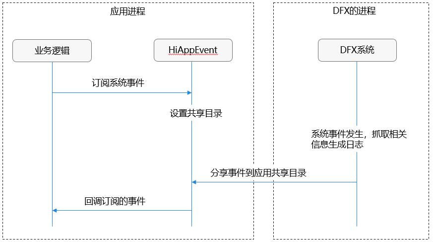
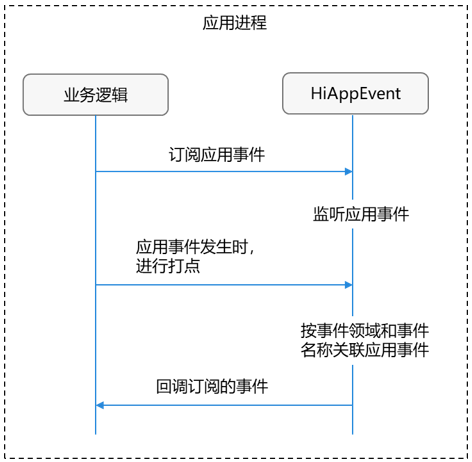

# HiAppEvent介绍

## 简介

HiAppEvent是在系统层面为应用开发者提供的一种事件打点机制，支持应用记录在运行过程中发生的故障事件、统计事件、安全事件、行为事件，帮助开发者定位问题、分析应用运行情况，以便进一步统计分析访问数量、日常用户活跃数量、用户操作习惯以及其他影响用户使用产品的关键因素。

## 基本概念

**打点**： 记录由用户操作引起的变化，提供业务数据信息，供开发、产品、运维进行分析。

- 事件领域：标识事件的领域，建议设置为业务模块名称，以便于区分不同的业务模块。

- 事件名称：指定事件的名称，建议设置为具体的业务名称，以便于描述实际的业务意义。

- 事件类型：指定事件的类型，支持以下四种类型事件：

  - 行为事件：记录用户日常操作行为的事件，例如按钮点击、界面跳转等行为。
  - 故障事件：定位和分析应用故障的事件，例如界面卡顿、掉网掉话等异常事件。
  - 统计事件：统计和度量应用关键行为的事件，例如对使用时长、访问数等的统计。
  - 安全事件：记录涉及应用安全行为的事件，例如用户授权等行为。

- 事件参数：指定事件的参数，每个事件可以包含一组参数，建议设置为事件属性或事件发生上下文信息，以便于描述事件的详细信息。

**事件订阅**：通过HiAppEvent的接口addWatcher()，开发者可以注册监听自己关注的系统事件或应用事件。目的是当订阅的事件发生后，可以收到事件的回调信息并进行处理。

## 实现原理

### 系统事件订阅机制

在当前系统应用沙箱机制下，应用进程仅可以直接访问自己的应用沙箱目录，参考[应用沙箱目录](../file-management/app-sandbox-directory.md)。而系统事件信息的存放路径不在应用沙箱目录中，因此无法直接获取。

应用调用HiAppEvent的接口addWatcher()订阅系统事件，并生成一个共享目录。当应用进程发生故障，DFX系统抓取相关信息生成事件和日志，分享到应用共享目录。HiAppEvent监听到有事件发生后，将事件回调给应用。

### 应用事件订阅机制

应用调用addWatcher()接口订阅关注的应用事件后，还需在应用事件发生时，调用write()接口进行打点，用来记录应用事件。

在同一生命周期中，HiAppEvent根据事件领域和事件名称关联应用事件，并根据addWatcher()接口设置的回调方式，将事件回调给应用。

## 约束与限制

- 订阅接口addWatcher()是同步接口，涉及IO操作，对于性能有要求的模块建议将接口的调用放到非主线程。

- 订阅接口addWatcher()传入的名称name是唯一的，相同name，后一次调用会覆盖前一次的订阅。
