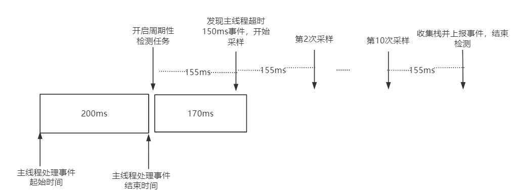
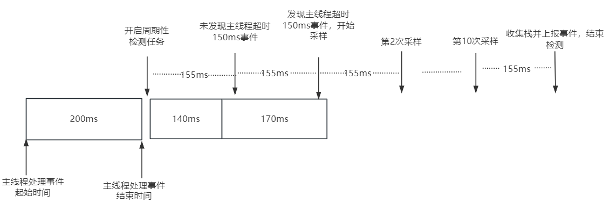
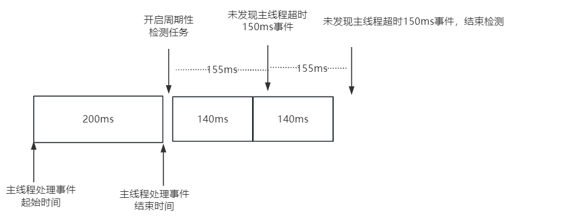

# 订阅主线程超时事件（ArkTS）

## 接口说明

API接口的具体使用说明（参数使用限制、具体取值范围等）请参考[应用事件打点API文档](../reference/apis-performance-analysis-kit/js-apis-hiviewdfx-hiappevent.md)。

| 接口名                                              | 描述                                         |
| --------------------------------------------------- | -------------------------------------------- |
| addWatcher(watcher: Watcher): AppEventPackageHolder | 添加应用事件观察者，以添加对应用事件的订阅。 |
| removeWatcher(watcher: Watcher): void               | 移除应用事件观察者，以移除对应用事件的订阅。 |

## 开发步骤

以实现对发生主线程超时场景生成的主线程超时事件订阅为例，说明开发步骤。

1. 新建一个ArkTS应用工程，编辑工程中的“entry > src > main > ets  > entryability > EntryAbility.ets”文件，导入依赖模块：

   ```ts
   import { hiAppEvent, hilog } from '@kit.PerformanceAnalysisKit';
   ```

2. 编辑工程中的“entry > src > main > ets  > entryability > EntryAbility.ets”文件，在onCreate函数中添加系统事件的订阅，示例代码如下：

   ```ts
    hiAppEvent.addWatcher({
      // 开发者可以自定义观察者名称，系统会使用名称来标识不同的观察者
      name: "watcher",
      // 开发者可以订阅感兴趣的系统事件，此处是订阅了主线程超时事件
      appEventFilters: [
        {
          domain: hiAppEvent.domain.OS,
          names: [hiAppEvent.event.MAIN_THREAD_JANK]
        }
      ],
      // 开发者可以自行实现订阅实时回调函数，以便对订阅获取到的事件数据进行自定义处理
      onReceive: (domain: string, appEventGroups: Array<hiAppEvent.AppEventGroup>) => {
        hilog.info(0x0000, 'testTag', `HiAppEvent onReceive: domain=${domain}`);
        for (const eventGroup of appEventGroups) {
          // 开发者可以根据事件集合中的事件名称区分不同的系统事件
          hilog.info(0x0000, 'testTag', `HiAppEvent eventName=${eventGroup.name}`);
          for (const eventInfo of eventGroup.appEventInfos) {
            // 开发者可以对事件集合中的事件数据进行自定义处理，此处是将事件数据打印在日志中
            hilog.info(0x0000, 'testTag', `HiAppEvent eventInfo.domain=${eventInfo.domain}`);
            hilog.info(0x0000, 'testTag', `HiAppEvent eventInfo.name=${eventInfo.name}`);
            hilog.info(0x0000, 'testTag', `HiAppEvent eventInfo.eventType=${eventInfo.eventType}`);
            // 开发者可以获取到主线程超时事件发生的时间戳
            hilog.info(0x0000, 'testTag', `HiAppEvent eventInfo.params.time=${eventInfo.params['time']}`);
            // 开发者可以获取到主线程超时应用的版本信息
            hilog.info(0x0000, 'testTag', `HiAppEvent eventInfo.params.bundle_version=${eventInfo.params['bundle_version']}`);
            // 开发者可以获取到主线程超时应用的包名
            hilog.info(0x0000, 'testTag', `HiAppEvent eventInfo.params.bundle_name=${eventInfo.params['bundle_name']}`);
            // 开发者可以获取到主线程超时应用的pid、uid
            hilog.info(0x0000, 'testTag', `HiAppEvent eventInfo.params.pid=${eventInfo.params['pid']}`);
            hilog.info(0x0000, 'testTag', `HiAppEvent eventInfo.params.uid=${eventInfo.params['uid']}`);
            // 开发者可以获取主线程处理开始和结束时间
            hilog.info(0x0000, 'testTag', `HiAppEvent eventInfo.params.begin_time=${eventInfo.params['begin_time']}`);
            hilog.info(0x0000, 'testTag', `HiAppEvent eventInfo.params.end_time=${eventInfo.params['end_time']}`);
            // 开发者可以获取到主线程超时事件发生时的故障日志文件
            hilog.info(0x0000, 'testTag', `HiAppEvent eventInfo.params.external_log=${JSON.stringify(eventInfo.params['external_log'])}`);
            hilog.info(0x0000, 'testTag', `HiAppEvent eventInfo.params.log_over_limit=${eventInfo.params['log_over_limit']}`);
          }
        }
      }
    });
   ```


3. 编辑工程中的“entry > src > main > ets  > pages> Index.ets”文件，添加一个Button控件onClick中实现主线程超时代码，示例代码如下：
   ```ts
     Button("timeOut350")
     .fontSize(50)
     .fontWeight(FontWeight.Bold)
     .onClick(() => {
         let t = Date.now();
         while (Date.now() - t <= 350) {}
     })
   ```

4. **开发者使用nolog版本，开发者模式处于关闭状态**，可以使能主线程超时检测抓取trace的功能。

5. 点击IDE界面中的运行按钮，运行应用工程，连续点击两次timeOut350按钮，会触发主线程超时事件。

6. 主线程超时事件上报后，系统会回调应用的onReceive函数，可以在Log窗口看到对系统事件数据的处理日志：

   主线程超时事件采样栈示例：

    ```text
     HiAppEvent eventInfo.domain=OS
     HiAppEvent eventInfo.name=MAIN_THREAD_JANK
     HiAppEvent eventInfo.eventType=1
     HiAppEvent eventInfo.params.time=1717593620518
     HiAppEvent eventInfo.params.bundle_version=1.0.0
     HiAppEvent eventInfo.params.bundle_name=com.example.main_thread_jank
     HiAppEvent eventInfo.params.pid=40986
     HiAppEvent eventInfo.params.uid=20020150
     HiAppEvent eventInfo.params.begin_time=1717593620016
     HiAppEvent eventInfo.params.end_time=1717593620518
     HiAppEvent eventInfo.params.external_log=["/data/storage/el2/log/watchdog/MAIN_THREAD_JANK_20240613211739_40986.txt"]
     HiAppEvent eventInfo.params.log_over_limit=false
    ```

   主线程超时事件采样trace，与采样栈的结果大致相同，不同的地方：
   
   栈：
   external_log=["/data/storage/el2/log/watchdog/MAIN_THREAD_JANK_yyyyMMDDHHmmss_xxxx.txt"]。xxxx：代表进程pid
   
   trace：
   external_log=[""/data/storage/el2/log/watchdog/MAIN_THREAD_JANK_unix时间戳_xxxx.trace"]。xxxx：代表进程pid

## 主线程超时事件时间规格
1. 启动时间

    主线程超时采样栈（150ms < 主线程处理时长 < 450ms）。**同一个应用的PID一个生命周期仅会触发一次主线程超时事件采样栈。**
  
    主线程超时采样Trace（主线程处理时长 > 450ms）。**同一个应用的UID一天仅会触发一次主线程超时事件采样trace。**

2. 抓栈时间

    主线程处理事件超时后，开始执行周期性任务检测，每隔155ms检测主线程是否再次发生超时事件(1 <= 检测次数 <= 2)，共三种情况：

    (1) 第一次检测发现超时事件，开始执行堆栈采样，每隔155ms采样一次，共采样10次堆栈，第11次收集堆栈并上报事件，结束检测。 
    
      

    (2) 第一次检测未发生超时事件，第二次检测发现超时事件，开始执行堆栈采样，每隔155ms采样一次，共采样10次堆栈，第11次收集堆栈并上报事件，结束检测。 
    
      

    (3) 两次检测均未发现超时事件，结束检测。 

      

3. 抓trace时间  

   主线程超时抓Trace调用录制函数后，每隔150ms检测主线程是否再次发生超时事件(检测次数 = 20)，其中，只要在20个间隔检测时，有一次主线程事件超时150ms，3s检测结束后落盘trace。

   (1) 20次检测均未发生主线程超时150ms事件

   

   (2) 20次检测至少有一次发生主线程超时150ms事件

   

## 主线程超时事件规格

1. 事件规格

   主线程超时事件上报结果，可以通过hdc shell命令查看事件：hisysevent -l | grep MAIN_THREAD_JANK，更多命令参考：[hisysevent](./hisysevent.md)。
   
   事件上报的内容解读如下：

    |   类型  |   说明   |
    | -------------- | ------------------------------------- |
    | BUNDLE_VERSION | 应用版本号                             |
    | BUNDLE_NAME    | 应用进程名                             |
    | BEGIN_TIME     | 主线程超时事件开始时间戳                |
    | END_TIME       | 主线程超时事件结束时间戳                |
    | EXTERNAL_LOG   | 栈文件存储路径                         |
    | STACK          | 堆栈内容                              |
    | JANK_LEVEL     | 标志位（0-采集栈 1-采集trace）         |
    | THREAD_NAME    | 线程名                                |
    | FOREGROUND     | 应用是否在前台                         |
    | LOG_TIME       | 日志时间戳                             |

2. 日志老化规格

    一般情况，栈文件的大小为7-10KB，trace文件大小为3-6M。应用沙箱内的watchdog目录最大保存10M内容，超出后，需要用户手动清理文件。目录地址：/data/app/el2/100/log/应用bundle name/watchdog。

3. 事件里如何获取日志：从external_logs中获取日志路径

4. 抓栈功能目前只支持ARM64架构，抓栈结果为解析后的混合栈信息，包含native帧和JS帧

   抓栈结果部分示例如下：
   ```text
    9 #00 pc 0000757c /system/bin/appspawn(55679d09bcdea35bb1e0d4e1d9a3e58f)
        9 #01 pc 000731c0 /system/lib/ld-musl-aarch64.so.1(add9e521e4eaf5cb009d4260f3b69ccd)
            9 #02 pc 000090a9 /system/bin/appspawn(main+396)(55679d09bcdea35bb1e0d4e1d9a3e58f)
                9 #03 pc 0000ab5d /system/bin/appspawn(AppSpawnRun+100)(55679d09bcdea35bb1e0d4e1d9a3e58f)
                    9 #04 pc 0000e7f1 /system/lib/chipset-pub-sdk/libbegetutil.z.so(RunLoop_+200)(52ace27d827ad482439bf32cc75bb17b)
                    ......
                                            9 #21 pc 00107aec /system/lib/ld-musl-aarch64.so.1(__pthread_cond_timedwait+628)(add9e521e4eaf5cb009d4260f3b69ccd)
    1 #00 pc 00032e67 /system/lib/platformsdk/libmmi-util.z.so(OHOS::MMI::UDSSocket::OnReadPackets(OHOS::MMI::CircleStreamBuffer&, std::__h::function<void (OHOS::MMI::NetPacket&)>)+158)(99e56bc765f9208f7b7ba8b268886a59)
        1 #01 pc 0000312e5 /system/lib/platformsdk/libmmi-client.z.so(OHOS::MMI::ClientMsgHandler::OnMsgHandler(OHOS::MMI::UDSClient const&, OHOS::MMI::NetPacket&)+340)(66ac85e964777ae89f0c26c339093cd1)
            1 #02 pc 0003016b /system/lib/platformsdk/libmmi-client.z.so(OHOS::MMI::ClientMsgHandler::OnPointerEvent(OHOS::MMI::UDSClient const&, OHOS::MMI::NetPacket&)+1222)(66ac85e964777ae89f0c26c339093cd1)
                1 #03 pc 0003b96b /system/lib/platformsdk/libmmi-client.z.so(OHOS::MMI::InputManagerImpl::OnPointerEvent(std::__h::shared_ptr<OHOS::MMI::PointerEvent>)+1370)(66ac85e964777ae89f0c26c339093cd1)
                    1 #04 pc 00095903 /system/lib/platformsdk/libwm.z.so(OHOS::Rosen::InputEventListener::OnInputEvent(std::__h::shared_ptr<OHOS::MMI::PointerEvent>) const+478)(9c40c5f416d6f830435126998fbcad42)
                    ......
                                            1 #21 pc 003f5c55 /system/lib/platformsdk/libark_jsruntime.so(4e6a2651ec80a7f639233f414d6486fe)
                                                1 #22 at anonymous (/entry/build/default/cache/default/default@CompileArkTS/esmodule/debug/entry/src/main/ets/pages/Index.js:67:17)
                                                    1 #23 at wait2 (/entry/build/default/cache/default/default@CompileArkTS/esmodule/debug/entry/src/main/ets/pages/Index.js:16:12)
                                                    ......
   ```

   每次抓栈拷贝16KB主线程调用栈信息进行回栈解析，所以每一次抓栈结果最多可以展示进程16KB调用信息，共进行10次，重复栈帧会聚合在一起，不同调用层次通过行缩进进行区分，最终以树型方式进行展示。当抓栈失败（如主线程阻塞在内核或信号被屏蔽等情况）时，将会输出"/proc/self/wchan"文件内容。
   
   展示结果中每一行表示一个栈信息，每一行栈帧信息所表示的意义可以按如下方式解读：

   native帧格式如下： 

   ```text
    9 #02 pc 000090a9 /system/bin/appspawn(main+396)(55679d09bcdea35bb1e0d4e1d9a3e58f)
    ^  ^       ^               ^              ^                   ^ 
    1  2       3               4              5                   6

    1 表示采样到此帧的次数
    2 表示帧的调用层级，行缩进大小与该层级对应，所有同一层级帧采样到的次数和不大于10次，#00采样次数和为10(设置采样的次数)
    3 为native帧PC值
    4 表示调用的文件路径
    5 调用的函数名及代码行偏移(unstripped版本，stripped版本可能没有)
    6 so文件md5值
   ```

   JS帧格式如下： 

   ```text
    1 #23 at wait2 (/entry/build/default/cache/default/XXX/entry/src/main/ets/pages/Index.js:16:12)
    ^  ^    ^               ^
    1  2    3               4

    1 表示采样到此帧的次数，同样最大为采样次数
    2 表示帧的调用层级，与native帧意义相同
    3 表示调用函数名wait2
    4 表示调用函数所在的路径，文件及行列号
   ```

5. trace规格简介

    trace大小为1-5M，对于trace文件的解析可以使用[smpartperf在线工具](https://www.smartperf.host)进行解读.

    导入trace文件后页面解读：从上往下主要展示时间轴、cpu使用率、cpu使用情况、进程间通讯数据的方法调用情况、进程、线程和方法调用情况，由此可以在事件维度上对这些数据进行直观展示。

    更多对trace文件使用的介绍可以参考：[web端加载trace说明](https://gitee.com/openharmony/developtools_smartperf_host/blob/master/ide/src/doc/md/quickstart_systemtrace.md)
