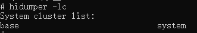
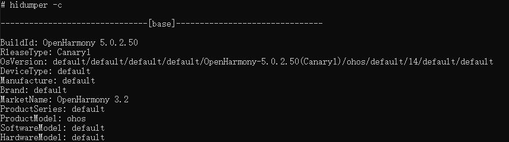
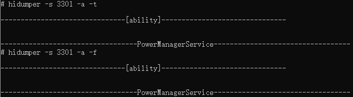
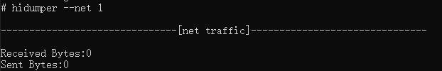
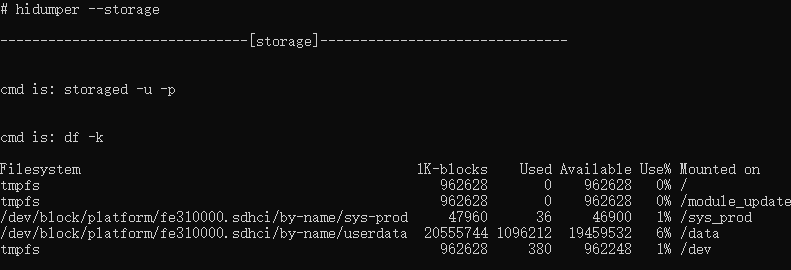
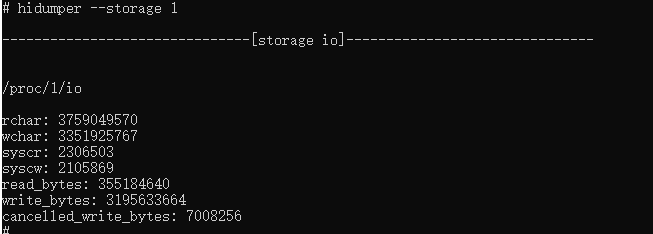
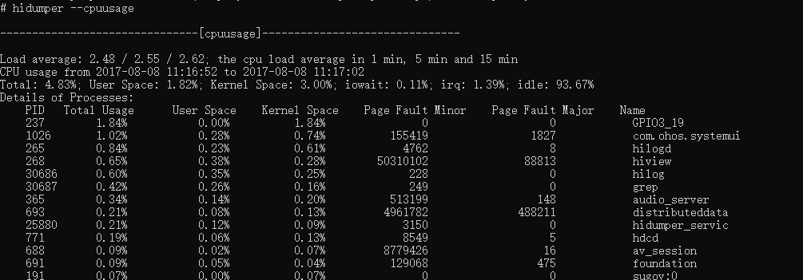
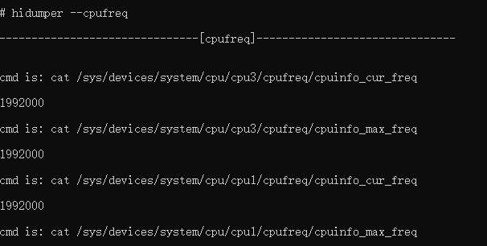
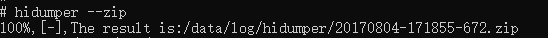

# hidumper

HiDumper为开发、测试人员提供统一的系统信息获取工具，可帮助使用者分析，定位问题。

## 环境要求

- 根据hdc命令行工具指导，完成[环境准备](hdc.md#环境准备)。

- 正常连接设备。

## 命令行说明

| 选项 | 说明 |
| -------- | -------- |
| -h  | 帮助命令。 |
| -lc | 列出系统信息集群。 |
| -ls | 列出系统能力。 |
| -c | 获取系统信息集群详细信息。 |
| -s | 获取所有系统能力详细信息。 |
| -s [SA] -a ["option"] | 执行单个系统能力的特定选项。SA表示系统能力名称，option表示该系统能力支持的选项。可通过 -s [SA] -a ["-h"] 获取单个系统能力支持的所有选项。|
| -e | 获取崩溃历史记录的故障日志。 |
| --net [pid] | 获取网络信息。如果指定了进程的pid，则只输出该进程的网络流量使用信息。 |
| --storage [pid] | 获取存储信息。如果指定了进程的pid，则只输出该进程的io信息。 |
| -p [pid] | 获取进程信息，包括进程和线程的列表和信息。 |
| --cpuusage [pid] | 获取CPU使用率,按进程和类别分类；如果指定pid，则获取指定pid的CPU使用信息。 |
| --cpufreq | 获取CPU每个核的真实频率。 |
| --mem [pid] | 获取总内存占用率；如果指定pid，则获取指定pid的内存占用率。 |
| --zip | 保存命令输出到/data/log/hidumper下的压缩文件。 |
| --ipc pid/-a --start-stat/stop-stat/stat | 统计一段时间进程IPC信息，如果使用-a则统计所有进程IPC数据，--start-stat开始统计，--stat获取统计数据，--stop-stat结束统计。 |
| --mem-smaps pid [-v] | 获取pid内存统计信息，数据来源于/proc/pid/smaps，使用-v指定更多详细信息。 (仅限制debug版本使用) |
| --mem-jsheap pid [-T tid] [--gc] [--leakobj] | pid 必选参数。命令触发所有线程gc和快照导出。如果指定线程的tid，只触发该线程gc和快照导出；如果指定--gc，只触发gc不做快照导出；如果指定--leakobj，则获取泄露对象的列表 |

## 常用命令

1. 查看帮助命令。

   ```
   hidumper -h
   ```

   **使用样例：**

   

2. 列出系统信息集群。

   ```
   hidumper -lc
   ```

   **使用样例：**

   

3. 列出系统能力。
   ```
   hidumper -ls
   ```

   **使用样例：**

   

4. 获取系统信息集群详细信息。
   ```
   hidumper -c
   ```

   **使用样例：**

   

5. 获取所有系统能力详细信息，命令格式如下：

   ```
   hidumper -s
   ```

   **使用样例：**

   


6. 执行单个系统能力的特定选项。
   
   获取RenderService的使用帮助，命令格式如下：

   ```
   hidumper -s RenderService -a "h" 
   ```

   **使用样例：**

   

   获取对应surface的刷新帧率，可以使用以下命令，返回值为surface刷新帧对应的时间戳。

   ```
   hidumper -s RenderService -a "surface_name fps" 
   ```

   **使用样例：**

   

   为开发者提供使设备不自动息屏的能力。-t参数使设备不自动息屏，-f参数使设备恢复自动息屏，或者设备重启使设备恢复自动息屏。

   ```
   hidumper -s 3301 -a -t
   hidumper -s 3301 -a -f
   ```

   **使用样例：**

   

7. 获取Faultlog模块生成的崩溃历史信息。

   ```
   hidumper -e 
   ```

   **使用样例：**

    

8. 获取网络信息；如果指定了进程的pid，则只获取该进程的网络流量使用信息。

    ```
    hidumper --net
    ```

    **使用样例：**

    

    ```
    hidumper --net 1
    ```

    **使用样例：**

    


9. 获取存储信息。如果指定了进程的pid，则只输出该进程的io信息。

   ```
   hidumper --storage
   ```

   **使用样例：**

   

   ```
   hidumper --storage 1
   ```

   **使用样例：**

   


10. 获取进程信息，包括进程、线程的列表等信息。

    ```
    hidumper -p
    ```

    **使用样例：**

    

11. 获取CPU使用率，根据进程和类别分类展示。

   ```
   hidumper --cpuusage
   ```

   **使用样例：**

   

   获取pid的类别使用率，命令格式如下：

   ```
   hidumper --cpuusage pid
   ```

   **使用样例：**

   

12. 获取CPU每个核的真实频率。

    ```
    hidumper --cpufreq
    ```

    **使用样例：**

    

13. 获取设备中所有pid的内存信息。

   ```
   hidumper --mem
   ```

   **使用样例：**

   

   获取设备中指定pid的内存信息。

   ```
   hidumper --mem pid
   ```

   **使用样例：**

   

   **Graph字段统计方式为：计算/proc/process_dmabuf_info节点下该进程使用的内存大小。**
   
14. 保存命令输出到/data/log/hidumper下的压缩文件。

    ```
    hidumper --zip
    ```

    **使用样例：**

    

15. 统计一段时间进程IPC信息，如果使用-a则统计所有进程IPC数据，指定pid则统计对应进程的IPC数据。--start-stat开始统计，--stat获取统计数据，--stop-stat结束统计。

    ```
    hidumper --ipc pid --start-stat
    hidumper --ipc pid --stat
    hidumper --ipc pid --stop-stat
    ```

    **使用样例：**

    

16. 导出指定进程内存信息的详细使用情况。

    ```
    hidumper --mem-smaps pid [-v]
    ```

    > **注意**
    >
    > 该命令仅限debug版本使用，release版本不可用。
    >
    > 如何区分debug/release版本：
    >
    > 命令1：执行hdc shell "param get|grep const.debuggable"查看输出为0还是1。
    >
    > 命令2：执行hdc shell "param get|grep const.product.software.version"查看当前版本是否包含"log"字符串。
    >
    > release版本:命令1执行结果为0且命令2不包含"log"字符串
    >
    > debug版本:非release版本即为debug版本

    **使用样例：**

    

17. 运行  **hidumper --mem-jsheap pid [-T tid] [--gc] [--leakobj]**  pid 必选参数。命令触发所有线程gc和快照导出。如果指定线程的tid，只触发该线程gc和快照导出；如果指定--gc，只触发gc不做快照导出;如果指定--leakobj，则获取泄露对象的列表。(仅限debug版本使用)

    ```
    hidumper --mem-jsheap pid [-T tid] [--gc] [--leakobj]
    ```

    > **注意**
    >
    > 该命令在release版本只支持导出debug应用的快照信息。
    >
    > 如何区分debug和release版本：同上。
    >
    > 导出的jsheap文件一般位于/data/log/faultlog/temp或/data/log/reliability/resource_leak/memory_leak下

    **使用样例：**

    
