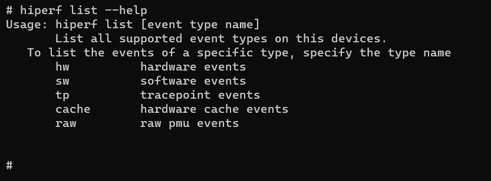

# hiperf

hiperf为开发人员提供用于调试的命令行工具，用于抓取特定程序或者系统的性能数据，类似内核的perf工具，该工具支持在 Windows/Linux/Mac 等操作系统上运行。

## 环境要求

- 根据hdc命令行工具指导，完成[环境准备](hdc.md#环境准备)。

- 正常连接设备。

## hiperf命令行说明

| 参数 | 参数说明 |
| -------- | -------- |
| -h/--help  | 帮助命令。 |
| --debug | 输出debug级别日志。 |
| --hilog | 日志写入hilog。 |
| --logpath | 日志路径。 |
| --logtag | 日志等级。 |
| --mixlog | 混合日志输出。|
| --much | 输出尽可能多的日志。 |
| --nodebug | 无日志输出。 |
| --verbose | 输出verbose级别日志。 |

## 帮助命令

可用 --help 查看帮助。

```
hiperf --help
```


使用如下命令查看子功能的帮助信息。

```
hiperf [command] --help
```

## list命令

可列出设备上支持的所有事件名称，事件名称用于 stat 和 record 的 -e 和 -g 参数。

**list命令参数说明**

| 参数 | 参数说明 |
| -------- | -------- |
| -h/--help  | 帮助命令。 |
| hw | 硬件事件。 |
| sw | 软件事件。 |
| tp | tracepoint事件。 |
| cache | 硬件缓存事件。 |
| raw | 原始pmu事件。 |

```
Usage: hiperf list [event type name]
```

使用help命令查询支持的事件类型。

```
hiperf list --help
```



下面列出了设备支持的HW事件，并且会提示哪些事件此设备不支持。

```
hiperf list hw
```


## record命令

采样指定目标程序，并且将采样数据保存到指定的文件中(默认为/data/local/tmp/perf.data)。

**record命令参数说明**

| 参数 | 参数说明 |
| -------- | -------- |
| -h/--help  | 帮助命令。 |
| -a  | 采集整机信息，用于评估所有进程、线程。 |
| --exclude-hiperf | 不采集hiperf本身数据。 |
| -c | 设置采集的cpuid,只采集这些cpu数据。 |
| --cpu-limit | 设置采集时cpu最大占比，取值范围：1 - 100，默认25。 |
| -d | 采集时长。 |
| -f | 采集频率，默认4000次每秒，不能和--period一起使用。 |
| --period | 设置采集事件周期，多少事件采集一次，不能和-f一起使用。 |
| -e | 采集事件，以逗号隔开。 |
| -g | 采集事件群组，以逗号隔开。 |
| --no-inherit | 不采集子进程数据。 |
| -p | 采集进程ID，以逗号隔开，不能和-a一起使用。 |
| -t | 采集线程ID，以逗号隔开，不能和-a一起使用。 |
| --exclude-tid | 不采集线程ID，以逗号隔开，不能和-a一起使用。 |
| --exclude-thread | 不采集线程名，以逗号隔开，不能和-a一起使用。 |
| --exclude-process | 不采集进程名，以逗号隔开，必须和-a一起使用。 |
| --offcpu | 跟踪线程何时脱离cpu调度。 |
| -j | 分支堆栈采样，过滤器支持any、any_call、any_ret、ind_call、ind_jmp、cond、call。 |
| -s/--callstack | 设置回栈模式。 |
| --kernel-callchain | 采集内核态堆栈，必须和-s fp/dwarf一起使用。 |
| --callchain-useronly | 只收集用户态堆栈。 |
| --delay-unwind | -s dwarf被设置时栈会在录制时展开，设置此选项栈会在录制后展开。 |
| --disable-unwind | -s dwarf被设置时，默认情况下，录制时堆栈将不会展开。 |
| --disable-callstack-expand | -s dwarf被设置时，破除64K栈限制，默认情况下合并callstack构建更完整的调用堆栈，可能有时候会不准确。 |
| --enable-debuginfo-symbolic | -s fp/dwarf被设置时，elf在.gnu_debugdata段的符号会被解析，默认不解析。 |
| --clockid | 设置采集时钟类型，支持monotonic 和 monotonic_raw。 |
| --symbol-dir | 在线符号化符号表文件路径。 |
| -m | mmap页数量，取值范围：2 - 1024，默认1024。 |
| --app | 采集的应用程序名，以逗号隔开，应用程序必须是debuggable模式，应用程序未启动时会等待20s。 |
| --chkms | 设置查询的间隔时间，取值范围：1 - 200，默认10。 |
| --data-limit | 输出数据达到指定大小停止采集，默认无限制。 |
| -o | 设置输出文件路径。 |
| -z | 以压缩文件形式输出。 |
| --restart | 收集应用启动的性能指标信息，如果进程在30秒内未启动，记录将退出。 |
| --verbose | 输出更详细的报告。 |
| --control [command]| 采集命令控制参数。命令包括prepare/start/pause/resume/output/stop。 |
| --dedup_stack | 删除记录中的重复堆栈，不能和-a一起使用。 |
| --cmdline-size | 设置/sys/kernel/tracing/saved_cmdlines_size节点的值，取值范围：512 - 4096。 |
| --report | 采集后回栈报告，不能和-a一起使用。 |
| --backtrack | 采集之前一段时间的数据，必须和--control prepare一起使用。 |
| --backtrack-sec | 采集之前数据的时长，取值范围5-30，默认10s，必须和--backtrack一起使用 |
| --dumpoptions | dump命令选项。 |

```
Usage: hiperf record [options] [command [command-args]] 
```

对指定的PID为267的进程采样10秒，并且使用dwarf回栈。

```
hiperf record -p 267 -d 10 -s dwarf
```


## stat命令

监听指定目标程序，周期性打印性能计数器的值。

**stat命令参数说明**

| 参数 | 参数说明 |
| -------- | -------- |
| -h/--help  | 帮助命令。 |
| -a  | 采集整机信息，用于评估所有进程、线程。 |
| -c | 设置采集的cpuid,限制采集哪些cpu数据。 |
| -d | 采集时长。 |
| -i | 设置每隔多少ms打印stat信息。 |
| -e | 采集事件，以逗号隔开。 |
| -g | 采集事件群组，以逗号隔开。 |
| --no-inherit | 不采集子进程数据。 |
| -p | 采集进程ID，以逗号隔开，不能和-a一起使用。 |
| -t | 采集线程ID，以逗号隔开，不能和-a一起使用。 |
| --app | 采集的应用程序名，以逗号隔开，应用程序必须是debuggable模式，应用程序未启动时会等待10秒。 |
| --chkms | 设置查询的间隔时间，取值范围：1 - 200，默认10。 |
| --per-core | 每个cpu核的打印计数。 |
| --pre-thread | 每个线程的打印计数。 |
| --restart | 收集应用启动的性能指标信息，如果进程在30秒内未启动，记录将退出。 |
| --verbose | 输出更详细的报告。 |
| --dumpoptions | dump命令选项。 |

```
Usage: hiperf stat [options] [command [command-args]]
```

下面展示了一个 stats 监听2349进程在CPU0上3秒的性能计数器命令。

```
hiperf stat -p 2349 -d 3 -c 0
```

## dump命令

此命令主要以不加以处理的方式直接读取perf.data的数据，开发和测试人员可核对其中原始采样数据的正确性。

**dump命令参数说明**

| 参数 | 参数说明 |
| -------- | -------- |
| -h/--help  | 帮助命令。 |
| --head | 只输出数据头和属性。 |
| -d | 只输出数据段。 |
| -f | 只输出附加功能。 |
| --syspath | 符号表文件路径。 |
| -i | 资源文件路径。 |
| -o | 输出文件路径，未设置则输出到屏幕。 |
| --elf | 输出elf文件。 |
| --proto | 输出protobuf格式数据。 |
| --export | 将用户堆栈数据导出到某个分割文件，使用此命令生成ut数据。 |

```
Usage: hiperf dump [option] \<filename\>
```

使用dump命令将/data/local/tmp/perf.data文件读取出来，输出到/data/local/tmp/perf.dump文件中。

```
hiperf dump -i /data/local/tmp/perf.data -o /data/local/tmp/perf.dump
```


## report命令

此命令主要用于展示相关采样数据（从perf.data中读取）并且转换为用户需要的格式（比如Json或者ProtoBuf）。

**report命令参数说明**

| 参数 | 参数说明 |
| -------- | -------- |
| -h/--help  | 帮助命令。 |
| --symbol-dir | 符号表文件路径。 |
| --limit-percent | 只显示前面多少百分比的内容。 |
| -s | 显示回栈模式。 |
| --call-stack-limit-percent | 只显示前面多少百分比的堆栈内容。 |
| -i | 资源文件路径，默认perf.data。 |
| -o | 输出文件路径，未设置则输出到屏幕。 |
| --proto | 输出protobuf格式数据。 |
| --json | 输出json格式数据。 |
| --diff | 显示-i --diff两个文件的不同。 |
| --branch | 从地址而不是ip地址显示分支。 |
| --\<keys\> \<keyname1\>[,keyname2][,...] | 可选关键字：comms、pids、tids、dsos、funcs、from_dsos、from_funcs，例如： --comms hiperf。 |
| --sort [key1],[key2],[...] | 按关键字排序。 |
| --hide_count | 报告中不显示数值。 |
| --dumpoptions | dump命令选项。 |

```
Usage: hiperf report [option] \<filename\>
```

范例输出普通报告的命令，限制为占比不超过1%。

```
hiperf report --limit-percent 1
```


## 脚本

一般用户用脚本执行采样操作，可生成可视化的火焰图。工具可在[developtools_hiperf仓库](https://gitee.com/openharmony/developtools_hiperf/tree/master/script)中获取。

1. 采样。

   由 command_script.py 完成，它是 report 命令的包装脚本。

   ```
   usage: command_script.py [-h]                         
                            (-app PACKAGE_NAME | -lp LOCAL_PROGRAM | -cmd CMD | -p [PID [PID ...]] | -t [TID [TID ...]] | -sw)
                            [-a ABILITY] [-r RECORD_OPTIONS] [-lib LOCAL_LIB_DIR]
                            [-o OUTPUT_PERF_DATA] [--not_hdc_root]
   ```

   对指定包名采样，包名是 com.ohos.launch。

   ```
   python command_script.py -app com.ohos.launch
   ```

   对特定进程采样，进程名称是 hdcd。

   ```
   python command_script.py -lp hdcd
   ```

2. 收集符号表。

   由 recv_binary_cache.py 完成，它主要根据 perf.data 里面记录的相关文件和库以及它们的 buildid， 在用户指定的路径中去寻找对应的 ELF 作为符号表文件用于回栈或者打印函数名等。

   ```
   usage: recv_binary_cache.py [-h] [-i PERF_DATA] [-l LOCAL_LIB_DIR [LOCAL_LIB_DIR ...]]
   ```

   指定了2个符号表路径的位置。

   ```
   python recv_binary_cache.py -l Z:\OHOS_MASTER\out\ohos-arm-release\lib.unstripped  Z:\OHOS_MASTER\out\ohos-arm-release\exe.unstripped
   ```

   对应的符号表文件会复制到 binary_cache 文件夹，优先检查用户给出的符号表位置，如果没有则复制设备中的文件。

3. 生成火焰图。

   由 make_report.py 完成，将采样后的数据导出为HTML展示页面。

   ```
   usage: make_report.py [-h] [-i PERF_DATA] [-r REPORT_HTML]
   ```

   产生HTML文件，默认的文件名是 hiperf_report.html。

   ```
   python make_report.py -i perf.data
   ```
