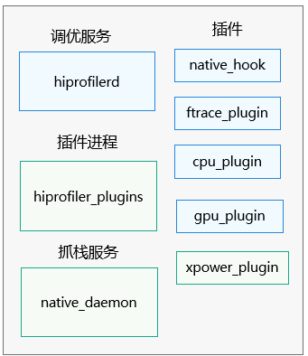
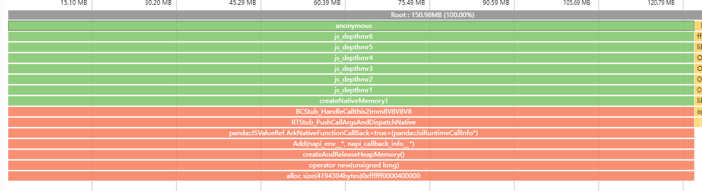
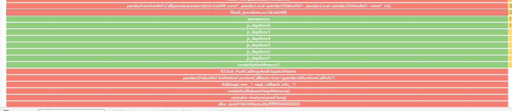
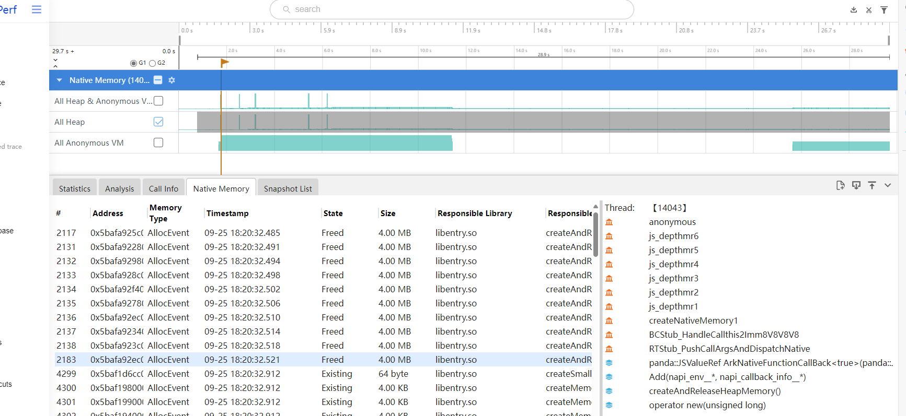
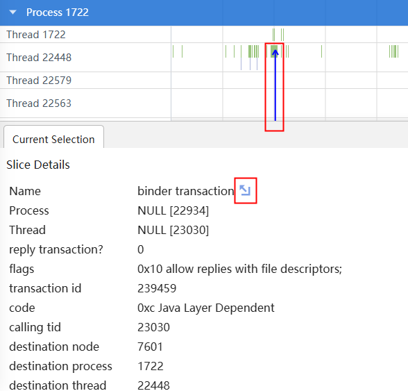
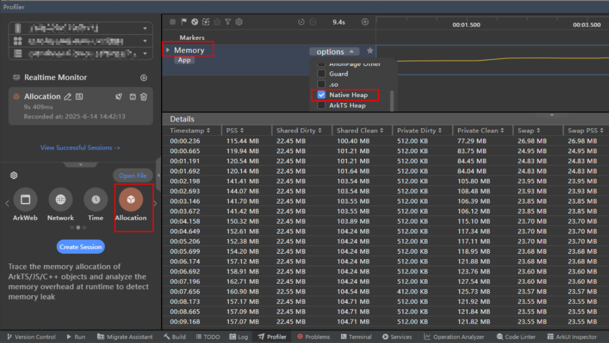
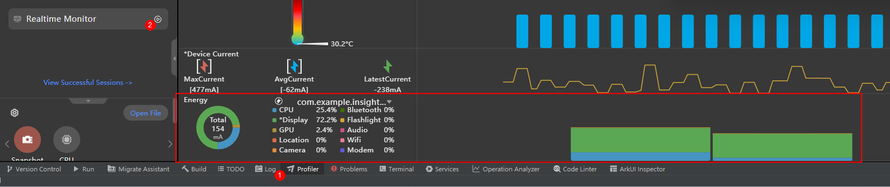
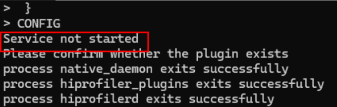

# hiprofiler

<!--Kit: Performance Analysis Kit-->
<!--Subsystem: HiviewDFX-->
<!--Owner: @zyxzyx-->
<!--SE: @Maplestroy-->
<!--TSE: @gcw_KuLfPSbe-->


## Hiprofiler简介


HiProfiler性能调优组件包含系统和应用调优框架，旨在为开发者提供一套性能调优平台，可以用来分析内存、性能等问题。


整体架构分为PC端和设备端，主体部分为PC端调优数据展示页面和设备端性能调优服务。PC端和设备端服务采用C/S模型，PC端调优数据在[DevEco studio](https://cbg.huawei.com/#/group/ipd/DevEcoToolsList)/[Smartperf](https://gitee.com/openharmony/developtools_smartperf_host)网页中展示。设备端程序包含多个部分，均运行在系统环境中，其中和DevEco通信的hiprofilerd进程作为调优服务。设备端还包含命令行工具（hiprofiler_cmd）、数据采集进程（hiprofiler_plugins）。调优服务操控数据采集进程获取调优数据，数据最终流向DevEco Studio，整个过程可抽象为生产者-消费者（Producer-Consumer）模型。目前已经完成了nativehook、CPU、ftrace、GPU、hiperf、xpower、memory数据采集等多个插件，实现了CPU、GPU、内存、能耗等多维度调优的能力。


Hiprofiler工具对标业界调优工具，并提供更多能力，比如[跨语言回栈、能耗数据获取、长时间堆内存抓栈功能](#插件参数说明)等。


## 环境要求

- 根据hdc命令行工具指导，完成[环境准备](hdc.md#环境准备)。

- 确保设备已正常连接，并执行hdc shell。


## 架构简介

1. PC端通过DevEco/Smartperf调用hiprofiler_cmd命令行；

2. hiprofiler_cmd进程拉起hiprofilerd调优服务，以及hiprofiler_plugins插件进程；

3. hiprofiler_plugins开启对应插件，获取到的调优数据汇总至hiprofilerd进程；

4. hiprofilerd进程将调优数据以proto格式储存到文件，或者实时返回给PC端；

5. PC端解析数据，生成泳道，展示获取到的调优数据。




## 命令行说明

使用hiprofiler_cmd命令行工具可以调用profiler不同插件，输入不同参数以满足不同调优需求。示范命令如下：

```shell
$ hiprofiler_cmd \
  -c - \
  -o /data/local/tmp/hiprofiler_data.htrace \
  -t 30 \
  -s \
  -k \
<<CONFIG
 request_id: 1
 session_config {
  buffers {
   pages: 16384
  }
 }
 plugin_configs {
  plugin_name: "ftrace-plugin"
  sample_interval: 1000
  config_data {
   hitrace_categories: "binder"
   buffer_size_kb: 204800
   flush_interval_ms: 1000
   flush_threshold_kb: 4096
   trace_period_ms: 200
  }
 }
CONFIG
```


| 命令 | 命令说明 | 
| -------- | -------- |
| -c | 设置该选项后，需要将配置文件放入/data/local/tmp目录下，将路径作为参数输入。 | 
| -o | 自定义文件保存路径（需要以/data/local/tmp开头）。若不设置路径，则调优数据自动保存至/data/local/tmp/hiprofiler_data.htrace。重复调优会覆盖原来路径的文件。 | 
| -k | 杀掉已存在的调优服务进程。 | 
| -s | 拉起调优服务进程。 | 
| -t | 设置调优持续时间，单位：s。 | 


输入完hiprofiler_cmd参数后，需要输入插件配置信息，以&lt;&lt;CONFIG开头，CONFIG结尾，中间内容以json格式输入。


以下是session config字段介绍：


| 字段 | 字段说明 | 
| -------- | -------- |
| buffers | 共享内存页的数量。 | 
| split_file | 是否拆分文件。true代表拆分文件；false代表不拆分文件。 | 
| split_file_max_size_mb | 设置split_file为true的情况下，定义每个拆分文件的最大大小。 | 


plugin_configs字段介绍：


| 字段 | 字段说明 | 
| -------- | -------- |
| plugin_name | 开启插件的名字。 | 
| sample_interval | 插件获取调优数据的间隔，单位：ms。 | 
| config_data | 插件具体参数。每个插件需要的参数不同，参考各插件proto定义。<br/>（代码路径：developtools/profiler/protos）。 | 


生成的trace文件通过hdc file recv导到本地，然后上传到smartperf网站或者DevEco Studio进行解析。


## 支持插件列表

<!--RP1-->
| 插件名字 | 简介 | 规格说明 |
| -------- | -------- | -------- |
| native_hook | 获取堆内存分配的调用栈信息。 |  |
| ftrace-plugin | 获取内核打点的trace事件，以及hitrace打点的数据。 |  |
| cpu-plugin | 获取进程CPU使用率信息，包括进程级和线程级的使用率。 |  |
| gpu-plugin | 获取进程GPU使用率信息。 |  |
| xpower-plugin | 获取进程能耗使用数据。 |  |
| memory-plugin | 获取进程内存占用情况，主要是获取进程smaps节点的数据。 | user模式不展示smaps中的地址，filepath。 |
| diskio plugin | 获取进程磁盘空间占用情况。 |  |
| network profiler | 通过进程内打点，获取进程http request信息。 |  |
| network plugin | 获取进程网络流量信息。 |  |
| hisysevent plugin | 通过hisysevent命令，获取hisysevent打点数据。 |  |
| hiperf plugin | 通过调用hiperf命令获取进程指令数信息以及对应的堆栈。 |  |
| hidump plugin | 通过SP_daemon命令获取hidump数据。 |  |
<!--RP1End-->


## 使用调试证书签名的应用


> **注意：**
>
> 确认命令指定的应用是否为可调试应用，可执行hdc shell "bm dump -n bundlename | grep appProvisionType"查询，预期返回信息为"appProvisionType": "debug"。

以包名com.example.myapplication为例，可执行如下命令查询：

```shell
hdc shell "bm dump -n com.example.myapplication | grep appProvisionType"
```

如包名对应的应用是可调试应用，预期返回信息：

```shell
"appProvisionType": "debug",
```

构建可调试应用需要使用调试证书进行签名，申请调试证书及签名可参考：[申请调试证书](https://developer.huawei.com/consumer/cn/doc/app/agc-help-add-debugcert-0000001914263178)。


## 插件参数说明

**native_hook 插件**

获取堆内存分配的调用栈信息，跨语言堆内存分配信息（如在ArtTS语言中调用napi分配native堆内存）。包括malloc，mmap，calloc，realloc等通过基础库函数分配堆内存调用栈。还能展示内存泄漏未释放堆内存调用栈信息。

nativehook参数列表：

| 参数名字 | 类型 | 参数含义 | 详细介绍 | 
| -------- | -------- | -------- | -------- |
| fp_unwind | bool | true表示使用fp回栈方式进行回栈；<br/>false表示使用dwarf回栈方式进行回栈。 | fp回栈是利用了x29寄存器保存的fp指针，函数的fp指针始终指向父函数（调用方）的fp指针，调优服务根据这一特点进行回栈，根据ip计算相对PC，然后查找maps对应区间来进行符号化。<br/>由于现在编译期越来越优化，出现寄存器重用或者编译禁用fp，会导致fp方式回不出相应的栈；混合栈情况下，fp不会记录多重混合，于是便需要dwarf回栈方式做更精确的回栈。<br/>dwarf回栈是根据pc寄存器在map表中查找对应的map信息，由于dwarf是逐级解析调用栈，所以其性能会比fp有劣化。<br/>注意：fp回栈暂不支持调优非aarch64架构的设备。 | 
| statistics_interval | int | 统计间隔，表示将一个统计周期内的栈进行汇总，单位：s。 | 为实现长时间轻量化采集，提供统计模式抓栈。如果更关注调优时的性能，只需要知道每个调用栈出现的次数和总大小，不需要知道每一次具体时间，可以使用统计模式。 | 
| startup_mode | bool | 是否抓取进程启动阶段内存。默认不抓取启动阶段内存。 | 记录进程从被appspawn拉起到调优结束这个期间内堆内存分配的信息。如果抓的是一个sa服务，需要在sa对应的cfg文件中找到拉起sa的进程名（如sa_main），将之加到此参数。 | 
| js_stack_report | int | 是否开启跨语言回栈。<br/>0：不抓取js栈。<br/>1：开启抓js栈。 | 为方舟环境提供跨语言回栈功能。 | 
| malloc_free_matching_interval | int | 匹配间隔，单位：s，指在相应时间间隔内，将malloc和free进行匹配。匹配到的就不进行落盘。 | 在匹配间隔内，分配并释放了的调用栈不被记录，减少了抓栈服务进程的开销。此参数设置的值大于0时，就不能将statistics_interval参数设置为true。 | 
| offline_symbolization | bool | 是否开启离线符号化。<br/>true：使用离线符号化，<br/>false：使用在线符号化。 | 使用离线符号化时，根据ip匹配符号的操作转移到了网页端（smartperf）完成，native daemon的性能得到了优化, 调优时会减少进程卡顿的情况。但由于需要将离线符号表写到trace文件，离线符号化情况下trace文件大小比在线符号化的要大。 | 
| sample_interval | int | 采样大小。 | 设置此参数时开启采样模式。采样模式下对于malloc size小于采样大小进行概率性统计。调用栈分配内存大小越大，出现次数越高，被统计的几率越大。 | 

结果示例：

开启fp回栈+跨语言回栈（其中绿色部分为js）：



开启dwarf回栈和跨语言回栈（可以展示出native -&gt; js -&gt;native的栈）：



开启统计模式（栈数据周期性展示）：


开启非统计模式：



**ftrace_plugin**：

1. 参数介绍

| 参数名字 | 类型 | 参数含义 | 详细介绍 | 
| -------- | -------- | -------- | -------- |
| ftrace_events | string | 抓取的trace event。 | 记录内核打点的trace event。 | 
| hitrace_categories | string | 抓取的hitrace打点信息。 | 调用hitrace能力，获取数据以proto格式写入文件。 | 
| buffer_size_kb | int | buffer缓存大小，单位：kB。 | hiprofiler_plugins进程读取内核事件所需要的缓存大小。推荐使用默认数值：204800。 | 
| flush_interval_ms | int | 采集数据频率，单位：ms。 | 推荐使用默认数值：1000。 | 
| flush_threshold_kb | int | 刷新数据大小。 | 超过threshold刷新一次数据至文件。用smartperf默认数值即可。 | 
| parse_ksyms | bool | 是否获取内核数据。 | true：获取内核数据；false：不获取内核数据。 | 
| trace_period_ms | int | 读取内核数据的频率。 | 用smartperf默认数值即可。 | 

2. 结果分析

示例命令：

```shell
$ hiprofiler_cmd \
  -c - \
  -o /data/local/tmp/hiprofiler_data.htrace \
  -t 10 \
  -s \
  -k \
<<CONFIG
 request_id: 1
 session_config {
  buffers {
   pages: 16384
  }
 }
 plugin_configs {
  plugin_name: "ftrace-plugin"
  sample_interval: 1000
  config_data {
   ftrace_events: "binder/binder_transaction"
   ftrace_events: "binder/binder_transaction_received"
   buffer_size_kb: 204800
   flush_interval_ms: 1000
   flush_threshold_kb: 4096
   parse_ksyms: true
   clock: "boot"
   trace_period_ms: 200
   debug_on: false
  }
 }
CONFIG
```

此命令读取的内核binder_transaction和binder_transaction_received数据，这两个字段同时使用，才能完整展示binder两端数据。执行命令后，通过hdc file recv将文件导出，然后拖至smartperf解析。结果示例如下图：

点击binder transaction右边的箭头，可以跳转到binder对端的进程/线程。



**memory_plugin**：

1. 参数介绍

| 参数名字 | 类型 | 参数含义 | 详细介绍 | 
| -------- | -------- | -------- | -------- |
| report_sysmem_vmem_info | bool | 是否读取虚拟内存数据。 | 从/proc/vmstat节点读取内存数据。 | 
| report_process_mem_info | bool | 是否获取进程详细内存数据，如rss_shmem，rss_file，vm_swap等。 | 从/proc/${pid}/stat节点读取内存数据。 | 
| report_smaps_mem_info | bool | 是否获取进程smaps内存信息。 | 从/proc/${pid}/smaps节点获取进程smaps内存数据。 | 
| report_gpu_mem_info | bool | 是否获取进程GPU使用情况。 | 读取/proc/gpu_memory节点数据。 | 
| parse_smaps_rollup | bool | 是否刷新数据大小。 | 读取/proc/{pid}/smaps_rollup节点的smaps统计数据，相比使用report_smaps_mem_info参数调优服务性能会更好（如CPU，内存）。 | 

2. 结果分析



通过DevEco-&gt;profiler-&gt;Allocation工具，选择Memory泳道，可以使用profiler的memory plugin功能。上图展示了框选时间段的进程smaps内存信息。

**xpower_plugin**：

1. 参数介绍

| 参数名字 | 类型 | 参数含义 | 详细介绍 | 
| -------- | -------- | -------- | -------- |
| bundle_name | string | 需要进行能耗调优的进程名。 | 和/proc/节点下的进程名一致。 | 
| message_type | XpowerMessageType | 需要获取能耗数据的类型。 | 数据类型包括REAL_BATTERY，APP_STATISTIC，APP_DETAIL，COMPONENT_TOP，ABNORMAL_EVENTS，THERMAL_REPORT | 

2. 结果分析



通过DevEco-&gt;profiler-&gt;real time monitor工具，可以获取相关进程能耗数据。

**gpu_plugin**：

获取gpu使用率相关信息

1. 参数介绍

| 参数名字 | 类型 | 参数含义 | 详细介绍 | 
| -------- | -------- | -------- | -------- |
| pid | int | 需要进行调优的进程名。 | 和/proc/节点下的进程名一致。 | 
| report_gpu_info | bool | 是否展示指定进程的GPU使用率信息 | true: 展示指定进程的gpu数据，需要设置pid。数据从<br/>/sys/class/devfreq/gpufreq/gpu_scene_aware/utilisation节点读出。<br/>false: 展示指定进程的gpu数据 | 

**cpu_plugin**：

获取cpu使用率相关信息

1. 参数介绍

| 参数名字 | 类型 | 参数含义 | 详细介绍 | 
| -------- | -------- | -------- | -------- |
| pid | int | 需要进行调优的进程名。 | 和/proc/节点下的进程名一致。 | 
| report_process_info | bool | 是否展示指定进程的CPU使用率信息 | true：展示指定进程的数据，需要设置pid参数；<br/>false：展示系统级CPU使用率数据 | 
| skip_thread_cpu_info | bool | 是否跳过线程CPU使用率数据 | true：不展示每个线程CPU使用率的信息，开启此参数时可以降低调优服务的开销；<br/>false：展示每个线程CPU使用率的信息 | 


## 常用命令


### 堆内存分配调用栈数据采样记录


对com.example.insight_test_stage进程堆内存分配操作进行抓栈。开启fp回栈，离线符号化，统计模式。


```shell
$ hiprofiler_cmd \
  -c - \
  -t 30 \
  -s \
  -k \
<<CONFIG
 request_id: 1
 session_config {
  buffers {
   pages: 16384
  }
 }
 plugin_configs {
  plugin_name: "nativehook"
  sample_interval: 5000
  config_data {
   save_file: false
   smb_pages: 16384
   max_stack_depth: 20
   process_name: "com.example.insight_test_stage"
   string_compressed: true
   fp_unwind: true
   blocked: true
   callframe_compress: true
   record_accurately: true
   offline_symbolization: true
   startup_mode: false
   statistics_interval: 10
   sample_interval: 256
   js_stack_report: 1
   max_js_stack_depth: 10
  }
 }
CONFIG
```


采集的数据会被保存至/data/local/tmp/hiprofiler_data.htrace文件中，该文件包含了内存泄漏分析所需的函数调用信息、线程和动态库维度内存分配情况，以及调用栈次数和分配大小聚类信息。开启离线符号化，fp回栈，统计模式均可以提升调优服务处理数据速率。


抓取指定进程CPU使用率


对进程号为1234的进程采集CPU数据，采集时长为30s，采样周期为1000ms，调优数据传输的共享内存大小是16384个内存页，采集的数据会被保存至/data/local/tmp/hiprofiler_data.htrace文件中。


```shell
$ hiprofiler_cmd \
  -c - \
  -o /data/local/tmp/hiprofiler_data.htrace \
  -t 30 \
  -s \
  -k \
<<CONFIG
 request_id: 1
 session_config {
  buffers {
   pages: 16384
  }
 }
 plugin_configs {
  plugin_name: "cpu-plugin"
  sample_interval: 1000
  config_data {
   pid: 1234
   report_process_info: true
  }
 }
CONFIG
```


## 常见问题：

调优出现异常

**现象描述**

使用hiprofiler_cmd命令时，显示Service not started



**可能原因&amp;解决方法**

调优服务未能开启，说明正在使用DevEco Studio调优或者上次调优异常退出，需要执行hiprofiler_cmd -k之后再重新执行调优命令。

抓取到的trace文件为空

**现象描述**

抓取到的trace文件是空的

**可能原因&amp;解决方法**

需要检查生成文件的路径是否在/data/local/tmp/目录下。如果目标路径是/data/local/tmp下的一个文件夹，则尝试对文件夹执行chmod 777操作。如果是user版本使用nativehook或者network profiler抓取no debug应用，也抓不到数据（参考changelog https://gitcode.com/openharmony/docs/pulls/57419）。

调优数据疑似不准确

**现象描述**

hiprofiler抓取到的native heap和hidumper查看的native heap有差异

**可能原因&amp;解决方法**

hidumper抓取的是进程维度内存使用情况，hiprofiler抓取到的是进程用户态通过基础库函数（malloc，mmap，realloc等，operator new也是调用的malloc）分配堆内存的数据。两者之间会有差异，差异存在于线程的内存缓存，堆内存延迟释放，加载器使用内存等。
