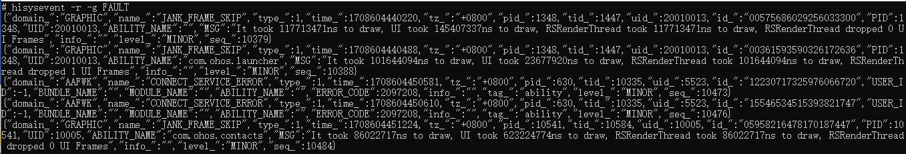
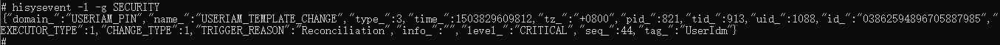
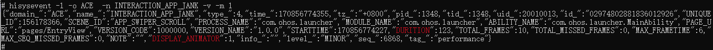

# hisysevent

<!--Kit: Performance Analysis Kit-->
<!--Subsystem: HiviewDFX-->
<!--Owner: @lyj_love_code-->
<!--Designer: @tangyyan-->
<!--Tester: @gcw_KuLfPSbe-->
<!--Adviser: @foryourself-->

hisysevent是系统的预置工具，主要用来帮助开发者订阅实时系统事件，查询历史系统事件。

## 环境要求

- 根据hdc命令行工具指导，完成[环境准备](hdc.md#环境准备)。

- 确保设备已正常连接，并执行hdc shell。

- 在终端使用执行"hisysevent"命令完成相关能力的调用。

## 订阅实时系统事件

- 使用"hisysevent -r"命令完成对系统事件的订阅。

   

- 使用"-g"指定事件类型来完成对系统事件更高精确度的订阅。

  > **说明：**
  > 订阅实时系统事件时，使用"-g"可以指定**FAULT**（错误类型）、**STATISTIC**（统计类型）、**SECURITY**（安全类型）以及**BEHAVIOR**（用户行为类型）四种事件类型。
  >
  > 如果开发者没有使用"-g"指定事件类型，hisysevent命令行工具将订阅所有类型的系统事件。

  样例：订阅**FAULT**（错误）类型的系统事件。

  

- 使用"-o"指定事件域，"-n"指定事件名，以及"-c"指定事件域和事件名称的匹配规则，完成系统事件更高精确度的订阅。

  > **说明：**
  > 订阅实时系统事件时，使用"-c"可以指定**WHOLE_WORD**（全词匹配）、**PREFIX**（前缀匹配）以及**REGULAR**（正则匹配）三种匹配规则。
  >
  > 如果开发者没有使用"-c"指定匹配规则，hisysevent命令行工具将默认使用**WHOLE_WORD**匹配规则进行订阅匹配。

  样例1：使用全词匹配规则，订阅事件域为"AAFWK"，事件名称为"CONNECT_SERVICE"的系统事件。

  

  样例2：使用前缀匹配规则，订阅事件域前缀为"AAF"，事件名称前缀为"CONNECT"的系统事件。

  

  样例3：使用正则表达式匹配规则，订阅事件域可以匹配"AA\*"正则表达式，事件名称可以匹配"CONNE\*"正则表达式的系统事件。

  

- 使用"-t"指定事件标签以及"-c"指定事件标签的匹配规则，来完成系统事件更高精确度的订阅。

  样例1：使用全词匹配规则，订阅事件标签为"ability"的系统事件。

  

  样例2：使用前缀匹配规则，订阅事件标签前缀为"abili"的系统事件。

  

  样例3：使用正则表达式匹配规则，订阅事件标签可以匹配"abi\*"正则表达式的系统事件。

  

## 查询历史事件

- 使用"hisysevent -l"命令完成对已落盘的系统事件的查询。

  

- 可以使用"-g"指定事件类型来完成对系统事件更高精确度的查询。

  > **说明：**
  > 查询历史事件时，使用"-g"可以指定**FAULT**（错误类型）、**STATISTIC**（统计类型）、**SECURITY**（安全类型）以及**BEHAVIOR**（用户行为类型）四种事件类型。
  >
  > 如果开发者没有使用"-g"指定事件类型，hisysevent命令行工具将查询所有类型的系统事件。

  样例：查询**SECURITY**（安全）类型的系统事件。

  

- 使用"-s"指定起始原始时间戳、"-e"指定截止原始时间戳，完成对特定时间段内系统事件的查询。

  > **说明：**
  > 原始时间戳精确度为毫秒。

  样例：查询起始时间戳是1708604541551，结束时间戳是1708604558551时间段内的所有系统事件。

  

- 使用"-S"指定起始格式化时间戳、"-E"指定截止格式化时间戳，完成对特定时间段内系统事件的查询。

  > **说明：**
  > 格式化时间戳的格式为："YYYY-MM-DD hh:mm:ss"。

  样例：查询起始时间戳是"2024-02-22 20:22:21"，结束时间戳是"2024-02-22 20:22:38"时间段内的所有系统事件。

  

- 使用"-o"指定事件域，"-n"指定事件名，以及"-c"指定事件域和事件名称的匹配规则，来完成系统事件更高精度的查询。

  > **说明：**
  > 查询历史事件时，使用"-c"只能指定**WHOLE_WORD**（全词匹配）一种匹配规则。
  >
  > 如果开发者不使用"-c"指定匹配规则，hisysevent命令行工具将使用**WHOLE_WORD**（全词匹配）匹配规则进行查询匹配。

  样例：使用全词匹配规则，查询事件域为"AAFWK"，事件名称为"CONNECT_SERVICE"的系统事件。

  

- 使用"-m"指定查询的最大系统事件条数。

  > **说明：**
  > 查询历史事件时，如果开发者不使用"-m"指定查询的最大系统事件条数，hisysevent命令行工具默认最多只查询10000条系统事件。

  

  

## 合法性检查模式

可以使用"-v"打开合法性检查模式。

在合法性检查模式开启后，任何订阅或者查询到的系统事件中，如果包含非法内容都会红色高亮显示。

> **说明：**
>
> “非法内容”的定义标准：
>
> 1. 未配置的自定义参数键。
> 2. 类型和定义的类型不匹配的值。

样例：事件域为"ACE"，事件名称为"INTERACTION_APP_JANK"的<!--RP1-->[系统事件配置](../../device-dev/subsystems/subsys-dfx-hisysevent-logging-config.md)<!--RP1End-->中不包含"DURITION"、"DISPLAY_ANIMATOR"自定义参数，但是实际落盘的系统事件却包含此字符串类型的键值对，合法性检查模式开启的情况下，此键值对的键被红色高亮标注。

