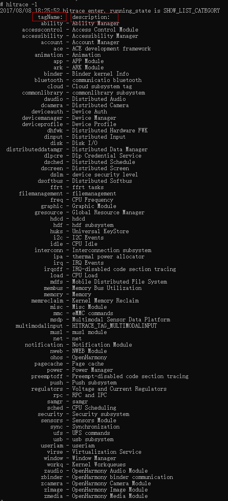
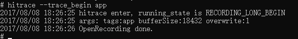
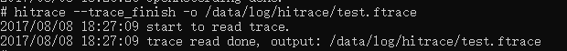

# hitrace

HiTrace为开发者提供业务流程调用链跟踪的维测接口。通过使用该接口所提供的功能，帮助开发者迅速获取指定业务流程调用链的运行日志，定位跨设备、跨进程、跨线程的故障问题。

## 前置条件

- 根据hdc命令行工具指导，完成[环境准备](hdc.md#环境准备)。

- 正常连接设备。

## 命令行说明

| 命令 | 含义说明 |
| -------- | -------- |
| -h  | 帮助命令。 |
| -l | 查看tag列表。 |
| --trace_begin | 开始捕获trace。 |
| --trace_finish | 结束捕获trace。 |
| --trace_dump | 导出trace信息。 |
| -b N | 设置用于存储和读取trace的缓冲区大小(buffer size KB)。默认的缓冲区大小为2048 KB。 |
| -t N | 设置hitrace运行时长，单位为秒（默认为5秒），取决于分析所需的时间。 |
| -o | 文件名指定目标文件的名称（默认为stdout）。 |
| -z | 压缩捕获的跟踪。 |
| --trace_clock | 设置向trace添加时间戳的时钟类型，可以是引导（默认）、全局、单声道、正常运行时间或性能。 |
| --trace_finish_nodump | 停止捕获trace时不打印trace信息。 |

## 常用命令

在hdc shell执行如下命令：

1. 查看hitrace包含的tag：hitrace -l。

   

2. 开始抓指定tag的trace：hitrace --trace_begin app。

   

3. 结束抓trace：hitrace --trace_finish 、 hitrace --trace_finish -o /data/local/tmp/test.htrace。默认将trace信息打印在命令行窗口，若添加输出路径，trace信息将导出至对应的文件中。

   

4. 设置抓trace的一些信息：hitrace -b 10240 -t 10 -o /data/local/tmp/test1.htrace app ability。

   

   - 设置缓冲区大小为10240KB；
   - 设置抓trace时间为10s；
   - 设置抓完trace后文件存储在/data/local/tmp/test1.htrace中；
   - 抓取app/ability两个tag的trace；

5. 导出trace信息：hitrace --trace_dump 、 hitrace --trace_dump -o /data/local/tmp/test2.htrace。默认将信息显示在命令行窗口，若添加输出路径，trace信息将导出至对应的文件中。

   

   也可根据关键词打印trace信息，使用命令hitrace --trace_dump |grep \*\*\*即可。
