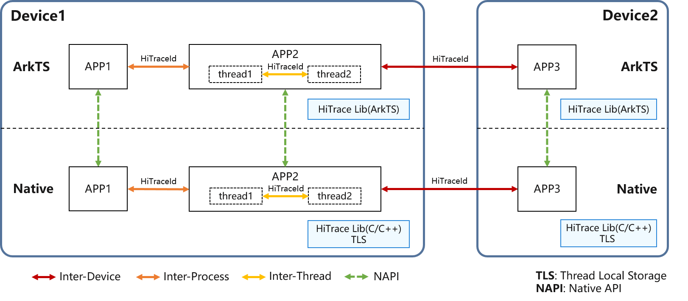

# HiTraceChain介绍

<!--Kit: Performance Analysis Kit-->
<!--Subsystem: HiviewDFX-->
<!--Owner: @qq_437963121-->
<!--Designer: @MontSaintMichel-->
<!--Tester: @gcw_KuLfPSbe-->
<!--Adviser: @foryourself-->

## 简介

HiTraceChain是基于分布式跟踪调用链思想，在端侧业务流程（涉及跨线程、跨进程、跨设备）中的一种轻量级分布式跟踪的实现。HiTraceChain在业务流程中生成和传递唯一跟踪标识，在业务流程输出的各类信息中（包括HiTraceMeter打点、应用事件、hilog日志等）记录该跟踪标识。在调试、问题定位的过程中，开发者可以通过该唯一跟踪标识将本次业务流程端到端的各类信息快速关联起来。HiTraceChain为开发者提供业务流程调用链跟踪的维测接口，帮助开发者迅速获取指定业务流程调用链的运行日志，定位跨设备/跨进程/跨线程的故障问题。

## 基本概念

**HiTraceId**：HiTraceChain提供的唯一跟踪标识，用于跟踪业务流程的调用链。

**chainId**：跟踪链标识，属于HiTraceId的一部分，用于标识当前跟踪的业务流程。

**spanId**：分支标识，属于HiTraceId的一部分，用于标识业务流程在某个服务中的一个具体任务，可以为每个任务创建一个唯一的spanId，用于区分不同的任务。

**parentSpanId**：父分支标识，属于HiTraceId的一部分，用于标识当前任务的父任务，可以建立不同任务之间的层级关系，显示任务之间的从属关系。

## 实现原理

1. **生成唯一跟踪标识**：启用HiTraceChain跟踪后，会在当前线程的TLS（Thread Local Storage，线程本地存储）生成一个全局唯一跟踪标识HiTraceId。

2. **获取HiTraceId**：Native层直接获取TLS中的HiTraceId；ArkTS层通过NAPI接口调用获取Native层TLS中的HiTraceId。

3. **传递HiTraceId**：随着业务流程的推进，开发者可取出当前线程TLS中的HiTraceId，在不同的线程（如thread1, thread2）、进程（如APP1, APP2）以及设备（如Device1, Device2）之间传递，并将HiTraceId设置到其他线程的TLS中，确保在同一个业务流程中，所有相关线程都能访问到这个唯一的跟踪标识。

4. **信息记录**：对于启用HiTraceChain的业务流程，其输出的各类信息中（包括HiTraceMeter打点、应用事件、hilog日志等）都会记录该跟踪标识，开发者可以通过HiTraceId将这些信息关联起来，从而实现端到端的调用链跟踪。
   

## 约束与限制

下表列举了一些常见的支持与不支持HiTraceChain自动传递的机制，不支持HiTraceChain自动传递的机制无法传递HiTraceId到创建的异步任务、线程或进程中，会导致HiTraceChain调用链中断，需要开发者手动传递并设置HiTraceId，以实现完整的调用链跟踪。

|  | 异步任务 | 跨线程 | 跨进程 | 跨设备 | 
| -------- | -------- | -------- | -------- | -------- |
| 支持HiTraceChain自动传递的机制 | [async/await](../arkts-utils/async-concurrency-overview.md#asyncawait) [promise/then](../arkts-utils/async-concurrency-overview.md#promise) | [HiAppEvent](hiappevent-intro.md) [napi_async_work](../napi/use-napi-asynchronous-task.md) [FFRT](../ffrt/ffrt-overview.md) | [IPC](../ipc/ipc-rpc-overview.md) | [RPC](../ipc/ipc-rpc-overview.md) | 
| 不支持HiTraceChain自动传递的机制 | 宏任务及其异步任务（例如[setTimeout](../reference/common/js-apis-timer.md#settimeout)、[setInterval](../reference/common/js-apis-timer.md#setinterval)等） | [TaskPool](../arkts-utils/taskpool-introduction.md) [Worker](../arkts-utils/worker-introduction.md) C++标准库std::thread、pthread_create、std::async等创建的线程 | [Socket](../network/socket-connection.md) [Ashmem](../reference/apis-ipc-kit/js-apis-rpc.md#ashmem8) | - | 
