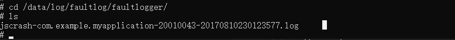

# 分析JS Crash（进程崩溃）

当未处理的JS异常导致应用意外退出时，应用会在抛出未处理的异常时崩溃并且会生成对应的JS Crash崩溃日志文件。开发者可通过错误日志查看引起崩溃的代码位置及分析应用崩溃的原因。

本文将分别介绍JS Crash异常捕获场景，JS Crash故障分析思路，以及典型分析案例。

## JS Crash异常检测能力

### JS Crash日志规格

以下是进程崩溃日志信息中对应字段解释。

```text
Device info:XXX <- 设备信息
Build info:XXX-XXXX X.X.X.XX(XXXXXXXX) <- 版本信息
Fingerprint:ed1811f3f5ae13c7262b51aab73ddd01df95b2c64466a204e0d70e6461cf1697 <- 特征信息
Timestamp:XXXX-XX-XX XX:XX:XX.XXX <- 时间戳
Module name:com.example.myapplication <- 模块名
Version:1.0.0 <- 版本号
VersionCode:1000000 <- 版本编码
Pid:579 <- 进程号
Uid:0 <- 用户ID
Process Memory(kB): 1897(Rss) <- 进程占用内存
Device Memory(kB): Total 1935820, Free 482136, Available 1204216  <- 整机内存信息
Reason:TypeError <- 原因
Error message:Cannot read property c of undefined <- 异常信息
Cannot get SourceMap info, dump raw stack: <- 应用安装包为release包安装时不包含sourcemap文件，JS栈通过sourcemap行列号解析会失败
SourceCode:
        var a = b.c;   <- 异常代码位置
                ^
Stacktrace:
    at onPageShow entry (entry/src/main/ets/pages/Index.ets:7:13)  <-异常代码调用栈
           ^        ^                              ^
         函数名   模块的包名                   文件行列号位置
```

JS Crash多为应用问题，开发者可通过崩溃文件中的Error message和StackTrace来定位问题。

### 异常代码调用栈格式规范

异常代码调用栈内容在Debug和Release模式存在差异：Debug模式保留完整调试信息，Release模式通过代码优化和混淆技术剥离调试信息，导致异常代码调用栈格式不同。

#### Release模式

Release模式构建的应用中，异常堆栈信息遵循以下标准化格式：

at <执行方法名> (<本模块名|依赖的模块名|版本号|编译产物路径>:<行号>:<列号>)

示例如下：

```txt
at onPageShow (entry|har1|1.0.0|src/main/ets/pages/Index.ts:7:13);
```

格式解析：

1. 固定标识：at为堆栈调用链的固定起始标识符。

2. 执行方法名：onPageShow表示触发异常的调用方法名称。

3. 源码路径结构：

   - 源码路径：详见[异常堆栈解析原理 sourcemap结构：key字段介绍](https://developer.huawei.com/consumer/cn/doc/harmonyos-guides/ide-exception-stack-parsing-principle#section1145914292713)。
   - 文件类型：文件扩展名多为.ts。

4. 行列号：以“:”为分隔符分隔行号列号。

#### Debug模式

Release模式构建的应用产生的异常堆栈在通过Source Map进行代码转译或使用Debug模式构建的应用中，异常堆栈信息遵循以下标准化格式：

at <执行方法名> <源码路径所属模块名> (<源码路径>:<行号>:<列号>)

示例如下：

```txt
at onPageShow har1 (har1/src/main/ets/pages/Index.ets:7:13);
```

格式解析：

1. 固定标识：at为堆栈调用链的固定起始标识符。

2. 执行方法名：onPageShow表示触发异常的调用方法名称。

3. 源码路径结构：

   - 所属模块名：路径源码路径所属模块名（如示例中的har1）。
   - 源码路径：基于工程目录的源码文件路径。
   - 文件类型：文件扩展名多为.ets。

4. 行列号：以“:”为分隔符分隔行号列号。

### JS Crash异常捕获场景

JS Crash异常根据不同的异常场景，在Reason字段进行了分类，分为Error、TypeError、SyntaxError、RangeError等错误类型。

- 自定义Error类：Error是最基本的错误类型，其他的错误类型都继承自该类型。Error对象主要有两个重要属性message和name分别表示错误信息和错误名称。程序运行过程中抛出的异常一般都有具体的类型，Error类型一般都是开发人员自己抛出的异常。

- TypeError（类型错误）类：运行时最常见的异常，表示变量或参数不是预期类型。

- SyntaxError（语法错误）类：语法错误也称为解析错误。语法错误在任何编程语言中都是最常见的错误类型，表示不符合编程语言的语法规范。

- RangeError（边界错误）类：表示超出有效范围时发生的异常，主要的有以下几种情况：
  - 数组长度为负数或超长。
  - 数字类型的方法参数超出预定义范围。
  - 函数堆栈调用超过最大值。

- ReferenceError - 引用错误：引用一个不存在的变量时发生的错误。创建变量时，变量名称都会被写入变量存储中心。变量存储中心就像键值存储一样，引用变量时，会先去存储中心找到key并提取并返回value。如果未找到对应变量，就会抛出ReferenceError。

- URI Error - URL错误：在调用URI相关的方法中URL无效时抛出的异常，主要包括`encodeURI()`、`decodeURI()`、`encodeURIComponent()`、`decodeURIComponent()`、`escape()`和`unescape()`几个函数。

## 问题定位思路

### 获取日志

进程崩溃日志是一种故障日志，与应用无响应日志、JS应用崩溃等都由FaultLogger模块管理，可通过以下方式获取：

- 方式一：通过DevEco Studio获取日志

    DevEco Studio会收集设备“/data/log/faultlog/faultlogger/”路径下的进程崩溃故障日志并归档在FaultLog下，获取日志的方法可参考[DevEco Studio使用指南-FaultLog](https://developer.huawei.com/consumer/cn/doc/harmonyos-guides/ide-fault-log)。

- 方式二：通过hiAppEvent接口订阅

    hiAppEvent提供了故障订阅接口，可以订阅各类故障打点，详见[HiAppEvent介绍](hiappevent-intro.md)。

<!--Del-->
- 方式三：设备ROOT模式下通过shell获取日志

    进程崩溃后，JS Crash文件会生成在设备“/data/log/faultlog/faultlogger/”路径下，故障日志文件名格式为“jscrash-进程名-进程UID-毫秒级时间.log”，包含设备名、系统版本、进程崩溃调用栈等信息。

    
<!--DelEnd-->

### 根因分析

JS Crash问题分析一般根据上述异常的场景，结合错误信息、调用栈定位到源码，可得出基本的分析结论。对于调用栈的分析有以下几种情况。

#### 1. StackTrace 场景分类

JS Crash故障日志中，StackTrace字段存放的是JS Crash异常的调用栈信息，StackTrace的显示分为以下几种场景。

1. JS调用栈可直接通过超链接跳转到对应错误代码行，栈顶即为问题第一现场，如下样例所示。

    ```text
    Device info:xxx
    Build info:xxx-xxx x.x.x.xxx(xxxx)
    Fingerprint:ed1811f3f5ae13c7262b51aab73ddd01df95b2c64466a204e0d70e6461cf1697
    Timestamp:xxxx-xx-xx xx:xx:xx.xxx
    Module name:com.xxx.xxx
    Version:1.0.0
    VersionCode:1000000
    PreInstalled:No
    Foreground:Yes
    Pid:31255
    Uid:20020145
    Process Memory(kB): 1897(Rss)
    Device Memory(kB): Total 1935820, Free 482136, Available 1204216
    Reason:Error
    Error name:Error
    Error message:JSERROR
    Sourcecode:
                    throw new Error("JSERROR");
                          ^
    Stacktrace:
        at anonymous entry (entry/src/main/ets/pages/Index.ets:13:19)
    ```

2. 异常代码调用栈Stack Cannot get SourceMap info, dump raw stack，表示因SourceMap转换失败，仅展示eTS栈对应编译后产物中代码行号，可通过超链接跳转到对应错误代码行，如下样例所示。

    ```text
    Device info:xxx
    Build info:xxx-xxx x.x.x.xxx(xxxx)
    Fingerprint:a370fceb59011d96e41e97bda139b1851c911012ab8c386d1a2d63986d6d226d
    Timestamp:xxxx-xx-xx xx:xx:xx.xxx
    Module name:com.xxx.xxx
    Version:1.0.0
    VersionCode:1000000
    PreInstalled:No
    Foreground:Yes
    Pid:39185
    Uid:20020145
    Process Memory(kB): 1897(Rss)
    Device Memory(kB): Total 1935820, Free 482136, Available 1204216
    Reason:Error
    Error name:Error
    Error message:JSERROR
    Stacktrace:
    Cannot get SourceMap info, dump raw stack:
        at anonymous entry (entry/src/main/ets/pages/Index.ts:49:49)
    ```

3. 异常代码调用栈包含SourceMap is not initialized yet，表示因SourceMap转换非常耗时，改为通过异步线程去进行初始化，导致会出现SourceMap没初始化完成就有异常产生的情况。针对这种情况增加这行日志来提示开发者。eTS栈对应编译后产物中代码行号，可通过超链接跳转到对应错误代码行。如下样例所示。

    ```text
    Device info:xxx
    Build info:xxx-xxx x.x.x.xxx(xxxx)
    Fingerprint:377ef8529301363f373ce837d0bf83aacfc46112502143237e2f4026e86a0510
    Timestamp:xxxx-xx-xx xx:xx:xx.xxx
    Module name:com.xxx.xxx
    Version:1.0.0
    VersionCode:1000000
    PreInstalled:No
    Foreground:Yes
    Pid:6042
    Uid:20020145
    Process Memory(kB): 1897(Rss)
    Device Memory(kB): Total 1935820, Free 482136, Available 1204216
    Reason:Error
    Error name:Error
    Error message:JSERROR
    Sourcecode:
                throw new Error("JSERROR");
                      ^
    Stacktrace:
    SourceMap is not initialized yet
    at anonymous entry (entry/src/main/ets/pages/Index.ts:49:49)
    ```

4. 异常代码调用栈中打印native栈，栈顶一般为libark_jsruntime.so动态库，这是因为JS异常最后都会经过虚拟机抛出。从崩溃栈从上往下找，libace_napi.z.so的上一帧一般是抛出异常的现场。如下样例所示。

    ```text
    Device info:xxx
    Build info:xxx-xxx x.x.x.xxx(xxxx)
    Fingerprint:89f2b64b24d642b0fc64e3a7cf68ca39fecaa580ff5736bb9d6706ea4cdf2c93
    Timestamp:xxxx-xx-xx xx:xx:xx.xxx
    Module name:com.xxx.xxx
    Version:1.0.0
    VersionCode:1000000
    PreInstalled:No
    Foreground:No
    Pid:14325
    Uid:20020145
    Process Memory(kB): 1897(Rss)
    Device Memory(kB): Total 1935820, Free 482136, Available 1204216
    Reason:ReferenceError
    Error name:ReferenceError
    Error message:Cannot find module 'com.xxx.xxx/entry/EntryAbility' , which is application Entry Point
    Stacktrace:
    SourceMap is not initialized yet
    #01 pc 000000000028ba3b /system/lib64/platformsdk/libark_jsruntime.so(bf6ea8e474ac3e417991f101e062fa90)
    #02 pc 00000000001452ff /system/lib64/platformsdk/libark_jsruntime.so(bf6ea8e474ac3e417991f101e062fa90)
    #03 pc 0000000000144c9f /system/lib64/platformsdk/libark_jsruntime.so(bf6ea8e474ac3e417991f101e062fa90)
    #04 pc 00000000001c617b /system/lib64/platformsdk/libark_jsruntime.so(bf6ea8e474ac3e417991f101e062fa90)
    #05 pc 00000000004c3cb7 /system/lib64/platformsdk/libark_jsruntime.so(bf6ea8e474ac3e417991f101e062fa90)
    #06 pc 00000000004c045f /system/lib64/platformsdk/libark_jsruntime.so(bf6ea8e474ac3e417991f101e062fa90)
    #07 pc 000000000038034f /system/lib64/platformsdk/libark_jsruntime.so(bf6ea8e474ac3e417991f101e062fa90)
    #08 pc 00000000004b2d9b /system/lib64/platformsdk/libark_jsruntime.so(bf6ea8e474ac3e417991f101e062fa90)
    #09 pc 0000000000037e7f /system/lib64/platformsdk/libace_napi.z.so(10ceafd39b5354314d2fe3059b8f9e4f)
    #10 pc 00000000000484cf /system/lib64/platformsdk/libruntime.z.so(3f6305a3843fae1de148a06eec4bd014) <- 异常抛出位置
    #11 pc 000000000004fce7 /system/lib64/platformsdk/libruntime.z.so(3f6305a3843fae1de148a06eec4bd014)
    #12 pc 000000000004e9fb /system/lib64/platformsdk/libruntime.z.so(3f6305a3843fae1de148a06eec4bd014)
    #13 pc 000000000004eb7b /system/lib64/platformsdk/libruntime.z.so(3f6305a3843fae1de148a06eec4bd014)
    #14 pc 000000000004f5c7 /system/lib64/platformsdk/libruntime.z.so(3f6305a3843fae1de148a06eec4bd014)
    #15 pc 00000000000303cf /system/lib64/platformsdk/libuiabilitykit_native.z.so(3203F4CCe84a43b519d0a731dfOdb1a3)
    ```

#### 2. 调用栈分析

调用栈分析会有如下两种情况：

- **情况一：可跳转至引起错误的代码行**

  如果FaultLog的堆栈信息中的链接或偏移地址指向的是当前工程中的某行代码，该段信息将被转换为超链接形式，在DevEco Studio中点击后跳转至对应代码行。

- **情况二：不可跳转至引起错误的代码行或者跳转代码位置不存在**

  如出现`Cannot get Source Map info, dump raw stack`信息代表js栈转换ets行列号失败，在DevEco Studio中点击链接会跳转到不正确的代码位置或不存在的代码行位置。

  应用代码运行出错时，会打印错误栈信息。如果ts栈转换ets行列号失败时错误栈的后缀仍显示为ets，开发者需要在build目录下编译中间产物以生成ts代码，在js代码中定位对应错误代码行。可参考：[应用堆栈解析](https://developer.huawei.com/consumer/cn/doc/harmonyos-guides/ide-release-app-stack-analysis)。

## 分析案例

本章节将基于现在开发者所遇到的高频的两类JS Crash故障进行案例介绍，包含TypeError和Error类。

### TypeError类案例分析

TypeError类问题在实际应用开发调试运行过程中是最常见的JS Crash类型，其表示为变量不是预期类型，在代码层面则为对变量的使用未进行事先的校验，在错误日志中报错多表现为如下：

```text
Error name:TypeError
Error message:Cannot read property xxx of undefined
```

#### 案例一：更新跟手动效相关属性时偶现JS Crash

1. 获取JS Crash日志如下：

    ```text
    Generated by HiviewDFX@OpenHarmony
    ================================================================
    Device info:xxxx
    Build info:xxxx
    Fingerprint:9851196f9fed7fd818170303296ae7a5767c9ab11f38fd8b0072f0e32c42ea39
    Timestamp:xxxx-xx-xx xx:xx:xx.xxx
    Module name:com.xxx.xxx
    Version:1.0.0.29
    VersionCode:10000029
    PreInstalled:Yes
    Foreground:No
    Pid:2780
    Uid:20020018
    Process Memory(kB): 1897(Rss)
    Device Memory(kB): Total 1935820, Free 482136, Available 1204216
    Reason:TypeError
    Error name:TypeError
    Error message:Cannot read property needRenderTranslate of undefined
    Stacktrace:
    Cannot get SourceMap info, dump raw stack:
        at updateGestureValue entry (phone/src/main/ets/SceneBoard/recent/scenepanel/recentpanel/RecentGesture.ts:51:51)
        at onRecentGestureActionBegin entry (phone/src/main/ets/SceneBoard/scenemanager/SCBScenePanel.ts:5609:5609)
        at anonymous entry (phone/src/main/ets/SceneBoard/scenemanager/SCBScenePanel.ts:555:555)
        at anonymous entry (phone/src/main/ets/SceneBoard/recent/RecentEventView.ts:183:183)
    ```

2. 提取日志关键信息

    通过日志信息可以确定为TypeError类问题，由异常信息得知是在读取needRenderTranslate对象时报错，该对象为undefined。最后可以通过异常代码调用栈，获取错误产生位置。

    Cannot get SourceMap info, dump raw stack 信息表示该应用为release包安装，JS栈转换eTS行列号失败，可考虑使用[应用堆栈解析](https://developer.huawei.com/consumer/cn/doc/harmonyos-guides/ide-release-app-stack-analysis)来解析行号。

3. 定位到具体代码

    通过以上JS堆栈和报错变量分析，能够定位到具体函数示例如下：

    ```ts
      // 更新与跟手动效相关的属性
      public updateGestureValue(screenWidth: number, recentScale: number, sceneContainerSessionList: SCBSceneContainerSession[]) {
        // 跟手移动的距离计算
        this.translationUpY = (this.multiCardsNum >= 1) ? sceneContainerSessionList[this.multiCardsNum - 1].needRenderTranslate.translateY : 0;    ---> 报错行号
        this.translationDownY = (this.multiCardsNum >= 2) ? sceneContainerSessionList[this.multiCardsNum - 2].needRenderTranslate.translateY : 0;
        this.screenWidth = px2vp(screenWidth);
        this.recentScale = recentScale;
      }
    ```

4. 修改方案

    上述分析已经明确为sceneContainerSessionList的成员变量 needRenderTranslate在使用的过程中可能存在为undefined的情况。对于这类问题，需要增加保护性判断，可直接规避此类问题。具体修改方法可以如下，在访问对象前增加'?'操作符进行判断保护。

    ```ts
    // 更新与跟手动效相关的属性
    public updateGestureValue(screenWidth: number, recentScale: number, sceneContainerSessionList: SCBSceneContainerSession[]) {
      // 跟手移动的距离计算
      this.translationUpY = (this.multiCardsNum >= 1) ?
        sceneContainerSessionList[this.multiCardsNum - 1]?.needRenderTranslate.translateY : 0;
      this.translationDownY = (this.multiCardsNum >= 2) ?
        sceneContainerSessionList[this.multiCardsNum - 2]?.needRenderTranslate.translateY : 0;
      this.screenWidth = px2vp(screenWidth);
      this.recentScale = recentScale;
    }
    ```

5. 思考与建议

    对于这类问题，需要我们在编码阶段充分考虑对象访问的安全性，确保必要的判空处理。同时很多场景单纯的判空可能只能是规避问题，还需要结合业务看看是否是原始对象构造或赋值的逻辑存在问题。

### Error 类案例分析

Error类问题一般是开发者或JS库主动抛出来的JS异常。

这类问题目前有两种场景：

1. 如果是当前应用程序遇到无法解决的只能终止当前业务的故障，需要考虑抛出JS异常来终止业务并生成故障日志。
2. 依赖使用JS库或者其他的模块接口，对于可能抛出异常的接口，需要考虑使用try-catch机制进行捕获，否则也会终止当前业务。

#### 案例一：如何主动抛出一个自定义的JS异常来终止程序

开发者自主抛出JS异常，可通过如下代码实现：

```ts
throw new Error("TEST JS ERROR")
```

通过上述开发过程基于DevEco Studio FaultLog工具收集到的故障日志，可以基于JS异常栈直接定位到抛异常的位置。


遇到这类问题的解决思路，仍旧是通过故障日志定位到具体的代码行，检视上下文来分析问题即可。

#### 案例二：因未处理三方接口抛出的JS异常导致的JS Crash问题

1. 获取JS Crash 日志核心内容如下

    ```text
    Error name:Error
    Error message:BusinessError 2501000: Operation failed.
    Error code:2501000
    Stacktrace:
    Cannot get SourceMap info, dump raw stack:
      at onStart entry (product/phone/build/default/cache/default/default@CompileArkTS/esmodule/release/feature/systemstatus/linkspeedcomponent/src/main/ets/default/controller/NetSpeedController.ts:50:1)
      at NetSpeedController entry (product/phone/build/default/cache/default/default@CompileArkTS/esmodule/release/feature/systemstatus/linkspeedcomponent/src/main/ets/default/controller/NetSpeedController.ts:43:43)
      at getInstance entry (product/phone/build/default/cache/default/default@CompileArkTS/esmodule/release/staticcommon/basiccommon/src/main/ets/component/utils/SingletonHelper.ts:17:17)
      at func_main_0 entry (product/phone/build/default/cache/default/default@CompileArkTS/esmodule/release/feature/systemstatus/linkspeedcomponent/src/main/ets/default/controller/NetSpeedController.ts:325:325)
    ```

2. 提取日志关键信息

    通过日志信息可以确定为Error类问题，为代码主动抛出的异常。最后可以通过异常代码调用栈，获取错误产生位置。

    Cannot get SourceMap info, dump raw stack信息表示该应用为release包安装，JS栈转换eTS行列号失败，可考虑使用[应用堆栈解析](https://developer.huawei.com/consumer/cn/doc/harmonyos-guides/ide-release-app-stack-analysis)来解析行号。

3. 定位到具体代码

    通过以上JS堆栈，能够定位到NetSpeedController.ts文件中具体代码片段如下，异常抛出位置为wifiManager.on函数调用。

    ```ts
    onStart(): void {
      super.onStart();
      log.showInfo('onStart');
      // ...
      wifiManager.on('wifiConnectionChange', (data) => {
        this.isConnected = data === 1 ? true : false;
        this.handleUpdateState();
      });
      wifiManager.on('wifiStateChange', (data) => {
        this.isWifiActive = data === 1 ? true : false;
        this.handleUpdateState();
      });
      // ...
    }
    ```

4. 修改方案

    通过分析wifiManager.on源码，得知该函数内存在部分场景会抛出内容为BusinessError 2501000: Operation failed.的JS异常，对于此类问题，识别当前业务异常不会导致当前程序无法运行下去，考虑使用try-catch机制对异常进行捕获处理。具体的修改方法可参考如下:

    ```ts
    onStart(): void {
      super.onStart();
      log.showInfo('onStart');
      // ...
      try {
        wifiManager.on('wifiConnectionChange', (data) => {
          this.isConnected = data === 1 ? true : false;
          this.handleUpdateState();
        });
      } catch (error) {
        log.showError('wifiConnectionChange error');
      }
      try {
        wifiManager.on('wifiStateChange', (data) => {
          this.isWifiActive = data === 1 ? true : false;
          this.handleUpdateState();
        });
      } catch (error) {
        log.showError('wifiStateChange error');
      }
      // ...
    }
    ```

5. 思考与建议

    对于这类问题，我们可以考虑在编码阶段灵活的运用JS异常机制，来识别各类异常场景；同时对于使用可能会抛异常的接口，也需要考虑是否需要捕获该异常，避免影响应用主体业务。
