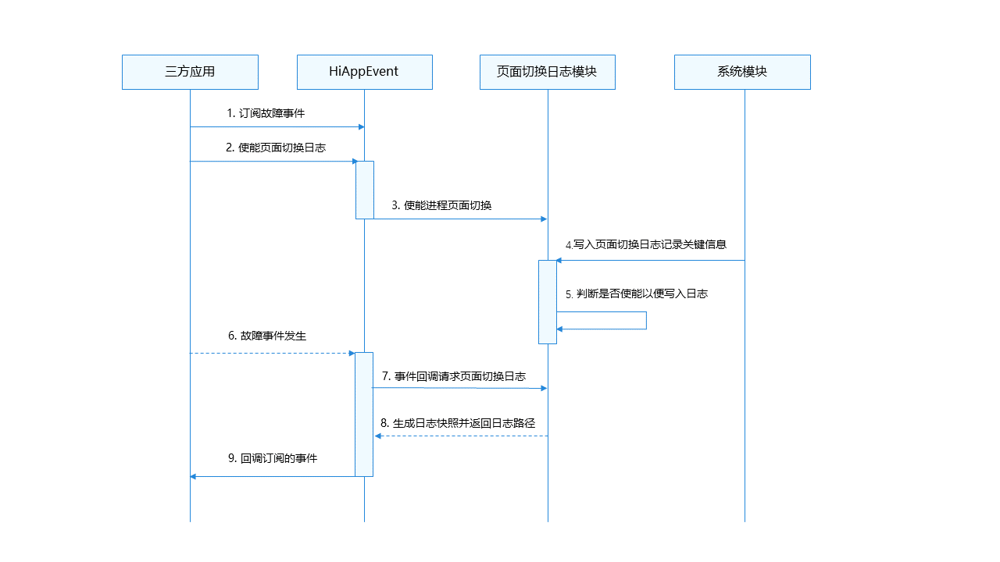

# 页面切换日志

<!--Kit: Performance Analysis Kit-->
<!--Subsystem: HiviewDFX-->
<!--Owner: @buzhenwang-->
<!--Designer: @shenchenkai-->
<!--Tester: @liyang2235-->
<!--Adviser: @jinqiuheng-->

## 简介

从API版本24开始支持页面切换日志。页面切换日志用于记录应用页面切换信息，比如窗口创建和销毁、页面跳转等信息，帮助开发者通过该日志分析故障发生前的用户操作，提高问题定位效率。

## 实现原理
三方应用通过订阅故障事件和使能记录页面切换日志来获取故障发生时的页面切换日志信息，其实现原理如下图所示：



详细步骤如下：
1. 应用调用HiAppEvent接口添加订阅故障事件。
2. 应用调用HiAppEvent接口使能故障事件的页面切换日志。
3. HiAppEvent设置页面切换日志模块的使能状态。
4. 写入页面切换日志记录关键信息。
5. 依据使能状态决定是否写入记录应用页面切换轨迹的日志信息。
6. 应用运行过程中发生故障事件。

   故障发生后，订阅故障事件的进程会收到事件回调。如果存在多实例场景，则故障发生后每个活跃的实例进程都会收到事件的回调，因故障崩溃而退出的实例进程重新启动后不会收到回调。

   例如下表，在四个实例进程都监听注册崩溃事件的前提下，622进程因发生故障而崩溃无法收到崩溃事件的回调，而依旧活跃的623~625进程会收到崩溃事件的回调；同理若625进程因发生故障而崩溃，625进程无法收到崩溃事件回调，而622~624进程会收到崩溃事件回调。
   | 进程号 | 进程名 |
   | ------ | ------ |
   | 622 | com.example.myapplication |
   | 623 | com.example.myapplication:EngineServiceAbility:1 |
   | 624 | com.example.myapplication:EngineServiceAbility:5 |
   | 625 | com.example.myapplication:EngineServiceAbility:6 |

7. HiAppEvent依据使能与否向页面切换日志模块请求页面切换日志信息。
8. 页面切换日志模块收到HiAppEvent请求后，将生成的页面切换日志快照的文件路径返回给HiAppEvent。

   生成规则：查找本实例以及未被其他进程持有的页面切换日志文件，复制生成快照文件，快照文件命名为：page_switch-进程名-实例索引-文件索引-毫秒级事件触发时间.log，如果快照文件已存在，则不重复生成。

   例如上表中625进程发生崩溃，生成快照文件如下：
   ```text
   page_switch-com.example.myapplication_EngineServiceAbility-3-1-20260509142812417.log
   page_switch-com.example.myapplication_EngineServiceAbility-3-2-20260509142812417.log
   ```
   为了避免对历史实例的页面切换日志创建快照，还需要比较事件发生时间和页面切换日志的修改时间。约定事件发生时间与页面切换日志的修改时间相差大于24小时时，不创建快照。

9. HiAppEvent将页面切换日志快照文件路径添加进故障事件的信息中，随回调一同返回给应用。

## 日志规格

### 文件命名规格

页面切换日志文件包括日志文件和快照文件。日志文件记录页面切换的日志信息，在发生故障时，系统将日志文件打包成快照文件，事件回调会将快照文件路径返回给开发者协助分析。

1. 页面切换日志文件命名规格。

   页面切换日志文件名称由五列属性组成，除后缀日志类型外，日志名称部分以`-`进行分隔。命名示例如下：
   ```text
   page_switch-com.example.myapplication-1-1.log
   ```

   | 第一列（日志前缀） | 第二列（进程名） | 第三列（实例索引） | 第四列（文件索引） | 第五列（日志后缀） |
   | :--------: | :--------: | :--------: | :--------: | :--------: |
   | page_switch | com.example.myapplication | 1 | 1 | log |
   > **说明：**
   >
   > 进程名：进程名需去除末尾`:N`后缀；进程名中包含`:`、`/`、`-` 字符时，对应字符统一替换为 `_`。
   >
   > 实例索引：多个进程共用沙箱场景（例如[多实例](../quick-start/multiInstance.md)或[ExtensionAbility组件](../application-models/extensionability-overview.md)）会出现日志写冲突，所以页面切换日志会为每个进程创建一组日志文件，使用实例索引标识不同进程。取值范围：[1, 10]。
   >
   > 文件索引：同一进程名及实例索引下最多保留 2 个文件。取值范围：[1, 2]。

2. 页面切换日志快照文件命名规格。

   示例：
   ```text
   page_switch-com.example.myapplication-1-1-20260509142812417.log
   ```

   | 第一列（日志前缀） | 第二列（进程名） | 第三列（实例索引） | 第四列（文件索引） | 第五列（时间戳） | 第六列（日志后缀） |
   | :--------: | :--------: | :--------: | :--------: | :--------: | :--------: |
   | page_switch | com.example.myapplication | 1 | 1 | 20260509142812417 | log |
   > **说明：**
   >
   > 进程名、实例索引、文件索引与页面切换日志文件名称里的说明相同。
   >
   > 时间戳：格式为 YYYYMMDDhhmmssSSS，其中年（YYYY）占4位，月（MM）、日（DD）、时（hh）、分（mm）、秒（ss）各占2位，毫秒（SSS）占3位。

### 文件内容规格

页面切换日志内容支持记录窗口切换日志、ArkUI路由切换日志等内容。

1. 窗口切换日志规格。

   窗口切换日志用于记录应用窗口的生命周期和窗口的状态变化，包含窗口创建、显示、隐藏、销毁等关键信息。窗口切换日志示例如下：
   ```text
   window {事件描述}, name: {窗口名称}, id: {窗口ID}, displayId: {屏幕ID}
   ```
   “事件描述”包含窗口生命周期事件和窗口状态变化事件。

   (1) 窗口生命周期事件。

   记录窗口从创建到销毁过程中的生命周期变化，包括窗口创建、显示、隐藏及销毁。具体描述及含义如下表：
   | 事件描述 | 含义 |
   |--------|------|
   | create | 窗口创建。 |
   | show | 窗口显示。 |
   | already show | 窗口显示，且之前已处于显示状态。 |
   | hide | 窗口隐藏。 |
   | already hide | 窗口隐藏，且之前已处于隐藏状态。 |
   | destroy | 窗口销毁。 |

   (2) 窗口状态变化事件。

   记录窗口在FULLSCREEN、MAXIMIZE、MINIMIZE、FLOATING、SPLITSCREEN等状态之间的切换行为。具体描述及含义如下表：
   | 事件描述 | 含义 |
   |--------|------|
   | status: FULLSCREEN | 窗口切换为全屏状态。 |
   | status: MAXIMIZE | 窗口切换为最大化状态。 |
   | status: MINIMIZE | 窗口切换为最小化状态。 |
   | status: FLOATING | 窗口切换为悬浮窗状态。 |
   | status: SPLITSCREEN | 窗口切换为分屏状态。 |
   | status: UNDEFINED | 窗口状态未定义。当切换的状态不是上述的状态时是未定义，一般情况下不会出现。 |

   应用在实际使用中的窗口切换日志示例如下：
   ```text
   2026-07-27 14:34:46.513  56594  56594 window create, name: mySubWindow, id: 56, displayId: 0    <- 创建窗口mySubWindow
   2026-07-27 14:34:46.540  56594  56594 window show, name: mySubWindow, id: 56, displayId: 0    <- 显示窗口mySubWindow
   2026-07-27 14:34:46.559  56594  56680 window status: FLOATING, name: mySubWindow, id: 56, displayId: 0    <- 窗口mySubWindow显示的状态为悬浮窗
   2026-07-27 14:34:58.222  56594  56594 window destroy, name: mySubWindow, id: 56, displayId: 0   <- 销毁窗口mySubWindow
   ```

2. ArkUI路由切换日志规格。

   ArkUI路由切换日志，包含Router和Navigation两个路由组件的切换日志。

   格式：
   ```text
   Navigate change at {切换时间戳}: from page '{页面名称}' (split: {是否处于Navigation分栏模式}) to page '{页面名称}' (split: {是否处于Navigation分栏模式})
   ```
   示例：
   ```text
   2026-07-27 14:41:49.609 14043 14043 Navigate change at 1785134509304: from page 'navBar' (split: false) to page 'pageOne' (split: false). <- 页面由navBar跳转至pageOne，发生时刻的时间戳为1785134509304，跳转前后页面均处于非分栏模式。
   ```

## 约束与限制

页面切换日志功能从API版本24开始支持，低于此版本不提供该能力。

### 页面切换日志

1. 页面切换日志至多支持5个不同进程，每个进程至多支持10个实例，每个实例至多创建1组共2个文件。

   举例：下面为A~E共5种类型进程，每种类型共有1~10共10个实例，每个实例有1组共2个页面切换日志。

   > page_switch-A-1-1.log、page_switch-A-1-2.log
   > page_switch-A-2-1.log、page_switch-A-2-2.log
   > ...
   > page_switch-A-10-1.log、page_switch-A-10-2.log
   >
   > page_switch-B-1-1.log、page_switch-B-1-2.log
   > page_switch-B-2-1.log、page_switch-B-2-2.log
   > ...
   > page_switch-B-10-1.log、page_switch-B-10-2.log
   >
   > ...
   >
   > page_switch-E-1-1.log、page_switch-E-1-2.log
   > page_switch-E-2-1.log、page_switch-E-2-2.log
   > ...
   > page_switch-E-10-1.log、page_switch-E-10-2.log

2. 页面切换日志文件数量上限为100个，达到上限时按文件修改时间先后顺序进行老化删除。

### 页面切换日志快照

页面切换日志快照至多保留40个，超过40个按日志文件名上的时间戳老化。

### 事件类型

页面切换日志的获取当前只支持[崩溃事件](./hiappevent-watcher-crash-events.md)、[应用冻屏事件](./hiappevent-watcher-freeze-events.md)、[资源泄漏事件](./hiappevent-watcher-resourceleak-events.md)、[地址越界事件](./hiappevent-watcher-address-sanitizer-events.md)。

## 日志获取

获取故障页面切换日志需要对故障事件进行订阅并使能故障事件的页面切换日志，日志获取依赖于HiAppEvent的事件订阅和系统事件策略配置能力。接口的详细使用说明（参数限制、取值范围等）请参考[@ohos.hiviewdfx.hiAppEvent](../reference/apis-performance-analysis-kit/js-apis-hiviewdfx-hiappevent.md)。

### 接口说明
| 接口名 | 描述 |
| -------- | -------- |
| addWatcher(watcher: Watcher): AppEventPackageHolder | 添加应用事件观察者，以添加对应用事件的订阅。 |
| removeWatcher(watcher: Watcher): void | 移除应用事件观察者，以移除对应用事件的订阅。 |
| configEventPolicy(policy: EventPolicy): Promise&lt;void&gt; | 系统策略配置方法，以使能系统事件的页面切换日志。 |

### 开发步骤

目前HiAppEvent使能系统事件的页面切换日志接口只支持ArkTS语言，这里以获取崩溃事件的页面切换日志为例，说明开发步骤。

1. 添加事件观察者。

   (1) 新建一个ArkTS应用工程，编辑工程中的“entry > src > main > ets > entryability > EntryAbility.ets”文件，导入依赖模块，示例代码如下：

   ```ts
   import { BusinessError, deviceInfo } from '@kit.BasicServicesKit';
   import { hiAppEvent, hilog } from '@kit.PerformanceAnalysisKit';
   ```

   (2) 编辑工程中的“entry > src > main > ets > entryability > EntryAbility.ets”文件，在onCreate函数中设置事件的自定义参数，示例代码如下：

   ```ts
   if (deviceInfo.sdkApiVersion >= 24) {  // API Version 24及以后版本，支持设置页面切换日志
       // 配置页面切换日志
       let policy : hiAppEvent.EventPolicy = {
           appCrashPolicy: {
               pageSwitchLogEnable: true
           }
       };
       // 开发者可以设置崩溃事件策略配置参数
       hiAppEvent.configEventPolicy(policy).then(() => {
           hilog.info(0x0000, 'testTag', `HiAppEvent success to config event policy.`);
       }).catch((err: BusinessError) => {
           hilog.error(0x0000, 'testTag', `HiAppEvent code: ${err.code}, message: ${err.message}`);
       });
   }
   ```

   (3) 编辑工程中的“entry > src > main > ets > entryability > EntryAbility.ets”文件，在onCreate函数中添加系统事件的订阅，示例代码如下：

   ```ts
   hiAppEvent.addWatcher({
       // 开发者可以自定义观察者名称，系统会使用名称来标识不同的观察者
       name: "watcher",
       // 开发者可以订阅感兴趣的系统事件，此处是订阅了应用崩溃事件
       appEventFilters: [
           {
               domain: hiAppEvent.domain.OS,
               names: [hiAppEvent.event.APP_CRASH]
           }
       ],
       // 开发者可以自行实现订阅实时回调函数，以便对订阅获取到的事件数据进行自定义处理
       onReceive: (domain: string, appEventGroups: Array<hiAppEvent.AppEventGroup>) => {
           hilog.info(0x0000, 'testTag', `HiAppEvent onReceive: domain=${domain}`);
           for (const eventGroup of appEventGroups) {
               // 开发者可以根据事件集合中的事件名称区分不同的系统事件
               hilog.info(0x0000, 'testTag', `HiAppEvent eventName=${eventGroup.name}`);
               for (const eventInfo of eventGroup.appEventInfos) {
                   // 开发者可以对事件集合中的事件数据进行自定义处理，此处是将事件数据打印在日志中
                   hilog.info(0x0000, 'testTag', `HiAppEvent eventInfo.domain=${eventInfo.domain}`);
                   hilog.info(0x0000, 'testTag', `HiAppEvent eventInfo.name=${eventInfo.name}`);
                   hilog.info(0x0000, 'testTag', `HiAppEvent eventInfo.eventType=${eventInfo.eventType}`);
                   // 开发者可以获取到应用崩溃事件发生时的故障日志文件
                   hilog.info(0x0000, 'testTag', `HiAppEvent eventInfo.params.external_log=${JSON.stringify(eventInfo.params['external_log'])}`);
                   hilog.info(0x0000, 'testTag', `HiAppEvent eventInfo.params.log_over_limit=${eventInfo.params['log_over_limit']}`);
                   // 开发者可以获取到应用崩溃的页面切换日志
                   hilog.info(0x0000, 'testTag', `HiAppEvent eventInfo.params.page_switch_log=${JSON.stringify(eventInfo.params['page_switch_log'])}`);
               }
           }
       }
   });
   ```

   (4) 编辑工程中的“entry > src > main > ets > pages > Index.ets”文件，添加按钮并在其onClick函数构造应用崩溃场景，以触发应用崩溃事件，示例代码如下：

   ```ts
   Button("appCrash").onClick(()=>{
       // 在按钮点击函数中构造一个crash场景，触发应用崩溃事件
       JSON.parse('');
   })
   ```

   (5) 点击DevEco Studio界面中的运行按钮，运行应用工程，然后在应用界面中点击按钮“appCrash”，触发一次应用崩溃事件。

2. 验证观察者订阅到的应用崩溃事件信息。

   应用崩溃退出后，重新进入应用可以在Log窗口看到对系统事件数据的处理日志：
   ```text
   HiAppEvent onReceive: domain=OS
   HiAppEvent eventName=APP_CRASH
   HiAppEvent eventInfo.domain=OS
   HiAppEvent eventInfo.name=APP_CRASH
   HiAppEvent eventInfo.eventType=1
   HiAppEvent eventInfo.params.external_log=["/data/storage/el2/log/hiappevent/APP_CRASH_1784946783228_8531.log"]
   HiAppEvent eventInfo.params.log_over_limit=false
   HiAppEvent eventInfo.params.page_switch_log="[\"/data/storage/el2/log/page_switch/snapshot/page_switch-com.example.testpageswitchrel-1-1-20260725103301547.log\",\"/data/storage/el2/log/page_switch/snapshot/page_switch-com.example.testpageswitchrel-1-2-20260725103301547.log\"]"
   ```