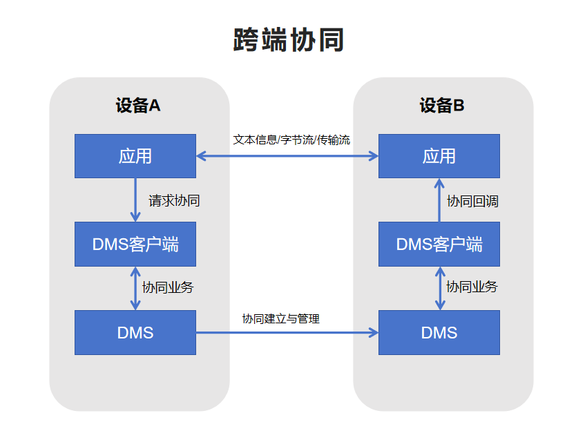

# 应用跨设备连接管理开发指南


## 简介

应用跨设备连接管理可以通过分布式操作系统，将用户拥有的多个设备整合为一个整体，实现设备与设备之间的能力互助，为用户提供比单设备更加高效的沉浸式体验。例如通过手表相机应用拉起手机的相机功能并实现实时画面预览和遥控拍照。


### 能力范围

- 跨设备拉起应用：可以通过本设备应用，拉起其他组网设备的同应用，并进行协同作业。
- 数据交互：实现跨设备数据传输，包括文本信息、字节流、图片、传输流（三方应用仅支持文本信息交互能力）。


### 亮点特征

通过多样化的跨设备传输流特性，实现本设备相机拉起对端设备相机功能。为用户提供实时预览对端设备摄像头的画面、文本信息交互、接受回传照片、遥控拍照等能力。


### 基本概念

在进行应用跨设备连接管理开发前，开发者应了解以下基本概念：

- **DMS**
  
  DMS（Distributedsched Management Service）是分布式组件管理框架，提供分布式组件的管理能力。

- **字节流**
  
  字节流是数据类型为[ArrayBuffer](../arkts-utils/arraybuffer-object.md)类型的数据。可以被用于存储二进制数据，例如图像或音频数据。

- **传输流**

  可进行图片、视频流传输的媒体流。

### 实现原理

应用跨设备连接管理生长在分布式组件管理框架之上，在分布式组件管理框架上进行了JS对象型的封装，能通过分布式组件管理框架服务建立协同关系并进行应用间的连接，数据的交互能力由系统支持。

**图1** 应用跨设备连接运行机制




### 约束与限制

- 设备间需要登录相同的华为账号。

- 不同设备间只有相同bundleName的UIAbility应用才能进行协同。

- 字节流、图片以及传输流的能力仅支持系统应用。

- 业务协同完毕后需及时结束协同状态。未申请长时任务的应用，在锁屏或退至后台5秒以上，会被结束掉协同生命周期。

- 分布式组件管理框架在协同过程中不会对传输内容进行审查。涉及隐私敏感数据时，建议业务通过数据加密、弹框提醒等方式加强信息安全。


## 环境准备

### 环境要求

可登录华为账号的设备A和设备B，设备间需要组网成功（双端登录同一个华为账号，并使用蓝牙连接）。


### 搭建环境

1. 在PC上安装[DevEco Studio](https://developer.huawei.com/consumer/cn/download/deveco-studio)，要求版本在4.1及以上。
2. 将public-SDK更新到API 16或以上，更新SDK的具体操作可参见[更新指南](../faqs/full-sdk-switch-guide.md)。
3. 用USB线缆将两台调测设备（设备A和设备B）连接到PC。
4. 打开设备A和设备B的蓝牙，互相识别，实现组网。


### 检验环境是否搭建成功

PC上执行shell命令：

```shell
hdc shell
hidumper -s 4700 -a "buscenter -l remote_device_info"
```

组网成功时可显示组网设备数量的信息，如“remote device num = 1”。


## 开发指导

应用跨设备连接管理可以通过分布式操作系统，将用户拥有的多个设备作为一个整体，设备与设备之间取长补短、相互帮助，为用户提供比单设备更加高效、沉浸的体验。


### 接口说明

应用跨设备连接管理接口如下表所示。具体API说明详见API参考：[abilityConnectionManager](../reference/apis-distributedservice-kit/js-apis-distributed-abilityConnectionManager.md)。

**表1** abilityConnectionManager接口功能介绍

| 接口名 | 描述 |
| -------- | -------- |
| createAbilityConnectionSession(serverId:&nbsp;string,&nbsp;context:&nbsp;Context,&nbsp;peerInfo:&nbsp;peerInfo,&nbsp;connectOpt:&nbsp;ConnectOption):&nbsp;number; | 创建应用间的会话。 |
| destroyAbilityConnectionSession(sessionId:&nbsp;number):&nbsp;void; | 销毁应用间的会话。 |
| connect(sessionId:&nbsp;number):&nbsp;Promise&lt;ConnectResult&gt;; | source侧进行ability的连接。 |
| acceptConnect(sessionId:&nbsp;number,&nbsp;token:&nbsp;string):&nbsp;Promise&lt;void&gt;; | sink侧进行ability的连接。 |
| disconnect(sessionId:&nbsp;number):&nbsp;void; | 断开ability的连接。 |
| on(type:&nbsp;'connect'&nbsp;\| &nbsp;'disconnect'&nbsp;\| &nbsp;'receiveMessage'&nbsp;\| &nbsp;'receiveData'&nbsp;\| &nbsp;'receiveImage',&nbsp;sessionId:&nbsp;number,&nbsp;callback:&nbsp;Callback&lt;EventCallbackInfo&gt;):&nbsp;void | 监听connect/disconnect/receiveMessage/receiveData/receiveImage事件。 |
| off(type:&nbsp;'connect'&nbsp;\| &nbsp;'disconnect'&nbsp;\| &nbsp;'receiveMessage'&nbsp;\| &nbsp;'receiveData'&nbsp;\| &nbsp;'receiveImage',&nbsp;'connect',&nbsp;sessionId:&nbsp;number,&nbsp;callback?:&nbsp;Callback&lt;EventCallbackInfo&gt;):&nbsp;void | 取消connect/disconnect/receiveMessage/receiveData/receiveImage事件的监听。 |
| sendMessage(sessionId:&nbsp;number,&nbsp;msg:&nbsp;string):&nbsp;Promise&lt;void&gt;; | 发送文本信息。 |
| sendData(sessionId:&nbsp;number,&nbsp;data:&nbsp;ArrayBuffer):&nbsp;Promise&lt;void&gt;; | 发送字节流（仅支持系统应用调用）。 |
| sendImage(sessionId:&nbsp;number,&nbsp;image:&nbsp;image.PixelMap):&nbsp;Promise&lt;void&gt;; | 发送图片（仅支持系统应用调用）。 |
| createStream(sessionId:&nbsp;number,&nbsp;param:&nbsp;StreamParam):&nbsp;Promise&lt;number&gt;; | 创建传输流（仅支持系统应用调用）。 |
| destroyStream(sessionId:&nbsp;number):&nbsp;void; | 关闭传输流（仅支持系统应用调用）。 |


### 开发步骤

通过应用跨设备管理模块，设备A拉起并连接设备B上的应用。连接成功后，设备A和设备B通过on接口注册相应事件的回调监听。设备A或设备B通过sendMessage、sendData、sendImage、createStream等接口发送消息、字节流、传输流。对端通过监听到的回调信息进行后续协同业务。

#### 导入AbilityConnectionManager模块文件

   ```ts
   import { abilityConnectionManager } from '@kit.DistributedServiceKit';
   ```


#### 发现设备

设备A上的应用，需要发现并选择设备B的netWorkId来作为协同接口的入参。可调用分布式设备管理模块接口，进行对端设备的发现和选择，详情可参考[分布式设备管理模块](devicemanager-guidelines.md)进行开发。


#### 应用间创建会话并进行连接

设备A和设备B在创建会话和连接时要执行的操作不同，接下来的开发步骤中，以设备A作为连接发起方，设备B作为连接接收端。

##### 设备A

应用主动调用createAbilityConnectionSession()接口创建会话，获得sessionId。之后调用connect()方法启动ability会话连接（此时设备B上应用会被拉起）。

  ```ts
  import { abilityConnectionManager, distributedDeviceManager } from '@kit.DistributedServiceKit';
  import { common } from '@kit.AbilityKit';
  import { hilog } from '@kit.PerformanceAnalysisKit';

  let dmClass: distributedDeviceManager.DeviceManager;

  function initDmClass(): void {
    try {
      dmClass = distributedDeviceManager.createDeviceManager('com.example.remotephotodemo');
    } catch (err) {
      hilog.error(0x0000, 'testTag', 'createDeviceManager err: ' + JSON.stringify(err));
    }
  }
  // 获取设备B的设备ID
  function getRemoteDeviceId(): string | undefined {
    initDmClass();
    if (typeof dmClass === 'object' && dmClass !== null) {
      hilog.info(0x0000, 'testTag', 'getRemoteDeviceId begin');
      let list = dmClass.getAvailableDeviceListSync();
      if (typeof (list) === 'undefined' || typeof (list.length) === 'undefined') {
        hilog.info(0x0000, 'testTag', 'getRemoteDeviceId err: list is null');
        return;
      }
      if (list.length === 0) {
        hilog.info(0x0000, 'testTag', 'getRemoteDeviceId err: list is empty');
        return;
      }
      return list[0].networkId;
    } else {
      hilog.info(0x0000, 'testTag', 'getRemoteDeviceId err: dmClass is null');
      return;
    }
  }
  // 定义设备B的协同信息
  const peerInfo: abilityConnectionManager.PeerInfo = {
    deviceId: getRemoteDeviceId(),
    bundleName: 'com.example.remotephotodemo',
    moduleName: 'entry',
    abilityName: 'EntryAbility',
    serverId: 'collabTest'
  };
  const myRecord: Record<string, string> = {
    "newKey1": "value1",
  };

  const options: Record<string, string> = {
    'ohos.collabrate.key.start.option': 'ohos.collabrate.value.foreground',
  };
  // 定义连接选项
  const connectOption: abilityConnectionManager.ConnectOption = {
    needSendBigData: true,
    needSendStream: false,
    needReceiveStream: true,
    options: options,
    parameters: myRecord
  };
  let context = getContext(this) as common.UIAbilityContext;
  try {
    this.sessionId = abilityConnectionManager.createAbilityConnectionSession("collabTest", context, peerInfo, connectOption);
    hilog.info(0x0000, 'testTag', 'createSession sessionId is', this.sessionId);

    abilityConnectionManager.connect(this.sessionId).then((ConnectResult) => {
      if (!ConnectResult.isConnected) {
        hilog.info(0x0000, 'testTag', 'connect failed');
        return;
      }
    }).catch(() => {
      hilog.error(0x0000, 'testTag', "connect failed");
    })

  } catch (error) {
    hilog.error(0x0000, 'testTag', error);
  }
  ```

##### 设备B

设备A的应用调用connect()后，设备B的应用会通过协同的方式被拉起，拉起时会触发协同生命周期函数onCollaborate()，可在该接口中配置createAbilityConnectionSession()接口以及acceptConnect()接口的调用。

  ```ts
  import { AbilityConstant, UIAbility, Want } from '@kit.AbilityKit';
  import { abilityConnectionManager } from '@kit.DistributedServiceKit';
  import { hilog } from '@kit.PerformanceAnalysisKit';

  export default class EntryAbility extends UIAbility {
    onCreate(want: Want, launchParam: AbilityConstant.LaunchParam): void {
      hilog.info(0x0000, 'testTag', '%{public}s', 'Ability onCreate');
    }

    onCollaborate(wantParam: Record<string, Object>): AbilityConstant.OnCollaborateResult {
      hilog.info(0x0000, 'testTag', '%{public}s', 'on collaborate');
      let param = wantParam["ohos.extra.param.key.supportCollaborateIndex"] as Record<string, Object>
      this.onCollab(param);
      return 0;
    }

    onCollab(collabParam: Record<string, Object>) {
      const sessionId = this.createSessionFromWant(collabParam);
      if (sessionId == -1) {
        hilog.info(0x0000, 'testTag', 'Invalid session ID.');
        return;
      }
      const collabToken = collabParam["ohos.dms.collabToken"] as string;
      abilityConnectionManager.acceptConnect(sessionId, collabToken).then(() => {
        hilog.info(0x0000, 'testTag', 'acceptConnect success');
      }).catch(() => {
        hilog.error("failed");
      })
    }

    createSessionFromWant(collabParam: Record<string, Object>): number {
      let sessionId = -1;
      const peerInfo = collabParam["PeerInfo"] as abilityConnectionManager.PeerInfo;
      if (peerInfo == undefined) {
        return sessionId;
      }
 
      const options = collabParam["ConnectOption"] as abilityConnectionManager.ConnectOption;
      options.needSendBigData = true;
      options.needSendStream = true;
      options.needReceiveStream = false;
      try {
        sessionId = abilityConnectionManager.createAbilityConnectionSession("collabTest", this.context, peerInfo, options);
        AppStorage.setOrCreate('sessionId', sessionId);
        hilog.info(0x0000, 'testTag', 'createSession sessionId is' + sessionId);
      } catch (error) {
        hilog.error(0x0000, 'testTag', error);
      }
      return sessionId;
    }
  }
  ```

#### 注册事件监听

在应用创建会话成功并获得sessionId后，开发者可调用on()方法进行对应事件的监听，通过触发回调函数的方式通知监听者，以便执行对应业务。

  ```ts
  import { abilityConnectionManager } from '@kit.DistributedServiceKit';
  import { hilog } from '@kit.PerformanceAnalysisKit';

  abilityConnectionManager.on("connect", this.sessionId,(callbackInfo) => {
    hilog.info(0x0000, 'testTag', 'session connect, sessionId is', callbackInfo.sessionId);
  });
  abilityConnectionManager.on("disconnect", this.sessionId,(callbackInfo) => {
    hilog.info(0x0000, 'testTag', 'session disconnect, sessionId is', callbackInfo.sessionId);
  });
  abilityConnectionManager.on("receiveMessage", this.sessionId,(callbackInfo) => {
    hilog.info(0x0000, 'testTag', 'session receiveMessage, sessionId is', callbackInfo.sessionId);
  });
  abilityConnectionManager.on("receiveData", this.sessionId,(callbackInfo) => {
    hilog.info(0x0000, 'testTag', 'session receiveData, sessionId is', callbackInfo.sessionId);
  });
  abilityConnectionManager.on("receiveImage", this.sessionId,(callbackInfo) => {
    hilog.info(0x0000, 'testTag', 'session receiveImage, sessionId is', callbackInfo.sessionId);
  });
  ```

#### 发送数据

##### 发送消息
应用连接成功后，开发者可在设备A或者设备B上调用sendMessage()方法给对端应用发送文本信息。

  ```ts
  import { abilityConnectionManager } from '@kit.DistributedServiceKit';
  import { hilog } from '@kit.PerformanceAnalysisKit';

  abilityConnectionManager.sendMessage(this.sessionId, "message send success").then(() => {
    hilog.info(0x0000, 'testTag', "sendMessage success");
  }).catch(() => {
    hilog.error(0x0000, 'testTag', "connect failed");
  })
  ```

##### 发送字节流数据

应用连接成功后，开发者可在设备A或者设备B上调用sendData()方法给对端应用发送字节数据（仅支持系统应用调用）。

  ```ts
  import { abilityConnectionManager } from '@kit.DistributedServiceKit';
  import { hilog } from '@kit.PerformanceAnalysisKit';

  let textEncoder = util.TextEncoder.create("utf-8");
  const arrayBuffer  = textEncoder.encodeInto("data send success");

  abilityConnectionManager.sendData(this.sessionId, arrayBuffer.buffer).then(() => {
    hilog.info(0x0000, 'testTag', "sendMessage success");
  }).catch(() => {
    hilog.info(0x0000, 'testTag', "sendMessage failed");
  })
  ```

##### 发送图片

应用连接成功后，开发者可在设备A或者设备B上调用sendImage()方法给对端应用发送图片（仅支持系统应用调用）。

  ```ts
  import { abilityConnectionManager } from '@kit.DistributedServiceKit';
  import { hilog } from '@kit.PerformanceAnalysisKit';
  import CameraService from '../model/CameraService';
  import { photoAccessHelper } from '@kit.MediaLibraryKit';
  import { image } from '@kit.ImageKit';
  import { fileIo as fs } from '@kit.CoreFileKit';

  try {
    let photoSelectOptions = new photoAccessHelper.PhotoSelectOptions();
    photoSelectOptions.MIMEType = photoAccessHelper.PhotoViewMIMETypes.IMAGE_TYPE;
    photoSelectOptions.maxSelectNumber = 5;
    let photoPicker = new photoAccessHelper.PhotoViewPicker();
    photoPicker.select(photoSelectOptions).then((photoSelectResult) => {
      if (!photoSelectResult) {
        hilog.error(0x0000, 'testTag', 'photoSelectResult = null');
      return;
      }

      let file = fs.openSync(photoSelectResult.photoUris[0], fs.OpenMode.READ_ONLY);
      hilog.info(0x0000, 'testTag', 'file.fd:' + file.fd);

      let imageSourceApi: image.ImageSource = image.createImageSource(file.fd);
      if (imageSourceApi) {
        imageSourceApi.createPixelMap().then((pixelMap) => {
          abilityConnectionManager.sendImage(this.sessionId, pixelMap)
        });
      } else {
        hilog.info(0x0000, 'testTag', 'imageSourceApi is undefined');
      }
    })
  } catch (error) {
    hilog.error(0x0000, 'testTag', 'photoPicker failed with error: ' + JSON.stringify(error));
  }
  ```

##### 发送传输流

应用连接成功后，开发者可在设备A或者设备B上调用createStream()方法创建传输流(仅支持系统应用调用)，之后调用startStream()方法传输流给对端设备。

  ```ts
  import { abilityConnectionManager } from '@kit.DistributedServiceKit';
  import { hilog } from '@kit.PerformanceAnalysisKit';

  hilog.info(0x0000, 'testTag', 'startStream');
  abilityConnectionManager.createStream(sessionId ,{name: 'receive', role: 0}).then(async (streamId) => {
    let surfaceParam: abilityConnectionManager.SurfaceParam = {
      width: 640,
      height: 480,
      format: 1
    }
    let surfaceId = abilityConnectionManager.getSurfaceId(streamId, surfaceParam);
    hilog.info(0x0000, 'testTag', 'surfaceId is'+surfaceId);
    AppStorage.setOrCreate<string>('surfaceId', surfaceId);
    await CameraService.initCamera(surfaceId, 0);
    abilityConnectionManager.startStream(streamId);
  })
  ```

#### 结束协同

业务协同完毕后需及时结束协同状态。若是后续短期内还有协同需要，可调用disconnect()方法断开应用间的连接，保留sessionId，以便下次继续使用该sessionId进行连接。若是短期无需使用协同业务，可直接调用destroyAbilityConnectionSession()接口销毁会话，此时会自动断开连接。

  ```ts
  import { abilityConnectionManager } from '@kit.DistributedServiceKit';
  import { hilog } from '@kit.PerformanceAnalysisKit';

  hilog.info(0x0000, 'testTag', 'disconnectRemoteAbility begin');
  if (this.sessionId == -1) {
    hilog.info(0x0000, 'testTag', 'Invalid session ID.');
  return;
  }
  abilityConnectionManager.disconnect(this.sessionId);

  hilog.info(0x0000, 'testTag', 'destroyAbilityConnectionSession called');
  abilityConnectionManager.destroyAbilityConnectionSession(this.sessionId);
  ```


### 调测验证

应用侧开发完成后，可在设备A和设备B上安装应用，测试步骤如下：

1. 点击设备A应用的“连接”按钮，此时设备B上的应用被拉起。
2. 点击设备A应用的“sendMessage”按钮，此时设备B上的应用会触发on()方法的回调，接受该字符串。
3. 点击设备A应用的“sendData”按钮，此时设备B上的应用会触发on()方法的回调，接受该字节流。
4. 点击设备A应用的“sendImage”按钮，此时设备B上的应用会触发on()方法的回调，接受该图片。
5. 点击设备A应用的“启动传输流”按钮，此时设备B上的应用会触发on()方法的回调，接受传输流内容。
6. 点击设备A或设备B应用的“disconnect”按钮，此时双端会断开连接，触发connect()接口的回调，将断连信息上报给双端应用。


## 常见问题

### 设备A应用无法拉起设备B应用

**可能原因**

- 【原因1】：设备间没有相互组网，导致设备A发起连接时，createAbilityConnectionSession()接口中的peerInfo.deviceId属性未设置正确。

- 【原因2】：有多台设备相互组网，设备A发起连接时，createAbilityConnectionSession()接口中的peerInfo.deviceId属性设置为其他设备的deviceId，未正确指定到B设备上。

**解决措施**

- 针对原因1，设备A和设备B开启USB调试功能，用USB线连接设备和PC。执行shell命令：
   
  ```shell
  hdc shell
  hidumper -s 4700 -a "buscenter -l remote_device_info"
  ```
  回显信息为“remote device num = 0”即为组网失败，请确保登录同一华为账号并使用蓝牙连接。组网成功时可显示组网设备数量的信息，如“remote device num = 1”。

- 针对原因2，查询并选择指定设备时，添加设备选择列表，确保指定到期望的设备。

### 应用锁屏或者退后台一段时间后，正在执行的协同业务被断开

**可能原因**

应用在协同过程中，DMS会对应用的生命周期进行监听。发生锁屏、退后台操作持续五秒后，未申请长时任务的应用会被结束协同状态。

**解决措施**

应用[申请长时任务](../task-management/continuous-task.md)，消除此限制。