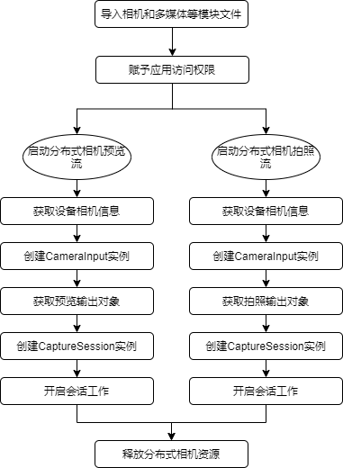

# 分布式相机开发指南
<!--Kit: Distributed Service Kit-->
<!--Subsystem: DistributedHardware-->
<!--Owner: @hobbycao-->
<!--Designer: @saga_2025-->
<!--Tester: @wei-guoqing1-->
<!--Adviser: @w_Machine_cc-->

## 简介

  OpenHarmony分布式相机通过打破硬件边界，实现了跨设备的摄像头能力协同。当搭载OpenHarmony系统的设备A与设备B完成组网后，设备A的应用可实时调用设备B的摄像头资源，获取对方影像（预览流/拍照流/录像流），且支持分辨率调节、参数同步等深度控制。这一功能在以下场景中具有突破性应用价值，例如：
  - 多视角协同创作
  - 远程专家协作
  - 沉浸式安防系统
  - 分布式影音交互


### 基本概念

  在进行分布式相机开发前，建议开发者查看下列章节，了解相关功能操作：
  - [应用跨设备连接](abilityconnectmanager-guidelines.md)
  - [相机管理](../media/camera/camera-device-management.md)
  - [申请相关权限](../media/camera/camera-preparation.md)
  - [会话管理](../media/camera/camera-session-management.md)
  - [拍照](../media/camera/camera-shooting.md)
  - [录像](../media/camera/camera-recording.md)


## 环境准备

### 环境要求

  设备A和设备B之间需要组网成功，并通过分布式硬件管理框架上线设备。


### 搭建环境

  1. 安装[DevEco Studio](https://developer.huawei.com/consumer/cn/download/deveco-studio)，要求版本在5.0及以上。
  2. 将public-SDK更新到API 16或以上<!--Del-->，更新SDK的具体操作可参见[更新指南](../tools/openharmony_sdk_upgrade_assistant.md)<!--DelEnd-->。
  3. 用USB线缆将两台调测设备（设备A和设备B）连接到PC。
  4. 打开设备A和设备B的Wifi并连接到同一个接入点上，互相识别，连接并组网。连接组网的具体操作可参见[创建会话并连接](abilityconnectmanager-guidelines.md#开发步骤)。


### 检验环境是否搭建成功

  PC上执行shell命令：

  ```shell
  hdc shell
  hidumper -s 4700 -a "buscenter -l remote_device_info"
  ```

  组网成功时可显示组网设备数量的信息，如“remote device num = 1”。


## 开发指导

  通过OpenHarmony操作系统，将用户拥有的多个设备相机资源作为一个硬件池，为用户提供跨端使用相机的能力。

### 开发流程

  分布式相机流程图建议如下：

  
 

### 开发步骤

**导入相机和多媒体等模块文件**

   ```ts
  import { camera } from '@kit.CameraKit';
  import { media } from '@kit.MediaKit';
   ```

**赋予应用访问权限**

  应用需申请权限，包括但不限于下列权限类型：
  - 图片和视频  ohos.permission.MEDIA_LOCATION
  - 文件读  ohos.permission.READ_MEDIA
  - 文件写  ohos.permission.WRITE_MEDIA
  - 相机  ohos.permission.CAMERA
  - 多设备协同  ohos.permission.DISTRIBUTED_DATASYNC

  例如在UIAbility申请相关的访问权限，通过调用requestPermissionsFromUser()方法添加对应的权限类型。
  ```ts
  //EntryAbility.ets
  export default class EntryAbility extends UIAbility {
    onCreate(want, launchParam) {
      Logger.info('Sample_VideoRecorder', 'Ability onCreate,requestPermissionsFromUser');
      let permissionNames: Array<Permissions> = ['ohos.permission.MEDIA_LOCATION', 'ohos.permission.READ_MEDIA',
        'ohos.permission.WRITE_MEDIA', 'ohos.permission.CAMERA', 'ohos.permission.MICROPHONE', 'ohos.permission.DISTRIBUTED_DATASYNC'];
      abilityAccessCtrl.createAtManager().requestPermissionsFromUser(this.context, permissionNames).then((data)=> {
        console.info("testTag", data);
      })
        .catch((err : BusinessError) => {
          console.error("testTag", err.message);
        });
    }
  ```


**启动分布式相机预览流及拍照流**

**1. 获取远端设备相机信息**

  应用组网成功后，需获取远端设备信息，通过getCameraManager()方法获取相机管理器实例，getSupportedCameras()方法获取支持指定的相机设备对象。

  ```ts
  private cameras?: Array<camera.CameraDevice>;
  private cameraManager?: camera.CameraManager;
  private cameraOutputCapability?: camera.CameraOutputCapability;
  private cameraIndex: number = 0;
  private curVideoProfiles?: Array<camera.VideoProfile>;

  function initCamera(): void {
    console.info('init remote camera called');
    if (this.cameraManager) {
      console.info('cameraManager already exits');
      return;
    }
    console.info('[camera] case to get cameraManager');
    this.cameraManager = camera.getCameraManager(globalThis.abilityContext);
    if (this.cameraManager) {
      console.info('[camera] case getCameraManager success');
    } else {
      console.error('[camera] case getCameraManager failed');
      return;
    }
    this.cameras = this.cameraManager.getSupportedCameras();
    if (this.cameras) {
      console.info('[camera] case getCameras success, size ', this.cameras.length);
      for (let i = 0; i < this.cameras.length; i++) {
        let came: camera.CameraDevice = this.cameras[i];
        console.info('[came] camera json:', JSON.stringify(came));
        if (came.connectionType == camera.ConnectionType.CAMERA_CONNECTION_REMOTE) {
          this.cameraIndex = i;
          this.cameraOutputCapability = this.cameraManager.getSupportedOutputCapability(came);
          this.curVideoProfiles = this.cameraOutputCapability.videoProfiles;
          console.info('init remote camera done'); //初始化远端摄像头成功
          break;
        }
      }
    } else {
      console.error('[camera] case getCameras failed');
    }
  }
  ```

**2. 创建CameraInput实例**

  获取相机管理器实例和支持指定的相机设备对象后，通过createCameraInput()方法创建CameraInput实例。

  ```ts
  // create camera input
  async createCameraInput(): Promise<void> {
    console.info('createCameraInput called');
    if (this.cameras && this.cameras.length > 0) {
      let came: camera.CameraDevice = this.cameras[this.cameraIndex];
      console.info('[came]createCameraInput camera json:', JSON.stringify(came));
      this.cameraInput = this.cameraManager?.createCameraInput(came);
      if (this.cameraInput) {
        console.info('[camera] case createCameraInput success');
        await this.cameraInput.open().then(() => {
          console.info('[camera] case cameraInput.open() success');
        }).catch((err: Error) => {
          console.error('[camera] cameraInput.open then.error:', JSON.stringify(err));
        });
      } else {
        console.error('[camera] case createCameraInput failed');
        return;
      }
    }
  }
  ```

**3. 获取预览输出对象**

  通过createPreviewOutput()方法创建预览输出对象。

  ```ts
  private previewOutput?: camera.PreviewOutput;
  private avConfig: media.AVRecorderConfig = {
    videoSourceType: media.VideoSourceType.VIDEO_SOURCE_TYPE_SURFACE_YUV,
    profile: this.avProfile,
    url: 'fd://',
  }

  // create camera preview
  async createPreviewOutput(): Promise<void> {
    console.info('createPreviewOutput called');
    if (this.cameraOutputCapability && this.cameraManager) {
      this.previewProfiles = this.cameraOutputCapability.previewProfiles;
      console.info('[camera] this.previewProfiles json ', JSON.stringify(this.previewProfiles));
      if (this.previewProfiles[0].format === camera.CameraFormat.CAMERA_FORMAT_YUV_420_SP) {
        console.info('[camera] case format is VIDEO_SOURCE_TYPE_SURFACE_YUV');
        this.avConfig.videoSourceType = media.VideoSourceType.VIDEO_SOURCE_TYPE_SURFACE_YUV;
      } else {
        console.info('[camera] case format is VIDEO_SOURCE_TYPE_SURFACE_ES');
        this.avConfig.videoSourceType = media.VideoSourceType.VIDEO_SOURCE_TYPE_SURFACE_ES;
      }
      this.previewOutput = this.cameraManager.createPreviewOutput(this.previewProfiles[0], this.surfaceId);
      if (!this.previewOutput) {
        console.error('create previewOutput failed!');
      }
      console.info('createPreviewOutput done');
    }
  }
  ```


**4. 获取拍照输出对象**

  通过createPhotoOutput()方法创建拍照输出对象，通过createImageReceiver()方法创建ImageReceiver实例。

  ```ts
  import { fileio } from '@kit.CoreFileKit';

  private photoReceiver?: image.ImageReceiver;
  private photoOutput?: camera.PhotoOutput;
  private mSaveCameraAsset: SaveCameraAsset = new SaveCameraAsset('Sample_VideoRecorder');

  async getImageFileFd(): Promise<void> {
    console.info('getImageFileFd called');
    this.mFileAssetId = await this.mSaveCameraAsset.createImageFd();
    this.fdPath = 'fd://' + this.mFileAssetId.toString();
    this.avConfig.url = this.fdPath;
    console.info('ImageFileFd is: ' + this.fdPath);
    console.info('getImageFileFd done');
  }

  // close file fd
  async closeFd(): Promise<void> {
    console.info('case closeFd called');
    if (this.mSaveCameraAsset) {
      await this.mSaveCameraAsset.closeVideoFile();
      this.mFileAssetId = undefined;
      this.fdPath = undefined;
      console.info('case closeFd done');
    }
  }

  async createPhotoOutput() {
    const photoProfile: camera.Profile = {
      format: camera.CameraFormat.CAMERA_FORMAT_JPEG,
      size: {
        "width": 1280,
        "height": 720
      }
    }
    if (!this.cameraManager) {
      console.error('createPhotoOutput cameraManager is null')
    }
    if (!this.photoReceiver) {
      this.photoReceiver = image.createImageReceiver(photoProfile.size.width, photoProfile.size.height, photoProfile.format, 8)
      this.photoReceiver.on("imageArrival",()=>{
        this.photoReceiver?.readNextImage((err,image)=>{
          if (err || image === undefined) {
            console.error('photoReceiver imageArrival on error')
            return;
          }
          image.getComponent(4, async (err, img) => {
            if (err || img === undefined) {
              console.error('image getComponent on error')
              return;
            }
            await this.getImageFileFd()
            fileio.write(this.mFileAssetId, img.byteBuffer)
            await this.closeFd()
            await image.release()
            console.info('photoReceiver image.getComponent save success')
          })
        })
      })
        await this.photoReceiver.getReceivingSurfaceId().then((surfaceId: string) => {
          this.photoOutput = this.cameraManager?.createPhotoOutput(photoProfile, surfaceId)
          if (!this.photoOutput) {
            console.error('cameraManager.createPhotoOutput on error')
          }
          console.info('cameraManager.createPhotoOutput success')
          this.photoOutput?.on("captureStart", (err, captureId) => {
            console.info('photoOutput.on captureStart')
          })
        }).catch((err: Error) => {
          console.error('photoReceiver.getReceivingSurfaceId on error:' + err)
        })
      }
    }
  ```

**5. 创建CaptureSession实例**

通过createCaptureSession()方法创建CaptureSession实例。调用beginConfig()方法开始配置会话，使用addInput()和addOutput()方法将CameraInput()和CameraOutput()加入到会话，最后调用commitConfig()方法提交配置信息，通过Promise获取结果。

  ```ts
  private captureSession?: camera.CaptureSession;

  function failureCallback(error: BusinessError): Promise<void> {
    console.error('case failureCallback called,errMessage is ', JSON.stringify(error));
  }

  function catchCallback(error: BusinessError): Promise<void> {
    console.error('case catchCallback called,errMessage is ', JSON.stringify(error));
  }

  // create camera capture session
  async createCaptureSession(): Promise<void> {
    console.info('createCaptureSession called');
    if (this.cameraManager) {
      this.captureSession = this.cameraManager.createCaptureSession();
      if (!this.captureSession) {
        console.error('createCaptureSession failed!');
        return;
      }
      try {
        this.captureSession.beginConfig();
        this.captureSession.addInput(this.cameraInput);
      } catch (e) {
        console.error('case addInput error:' + JSON.stringify(e));
      }
      try {
        this.captureSession.addOutput(this.previewOutput);
      } catch (e) {
        console.error('case addOutput error:' + JSON.stringify(e));
      }
      await this.captureSession.commitConfig().then(() => {
        console.info('captureSession commitConfig success');
      }, this.failureCallback).catch(this.catchCallback);
    }
  }
  ```

**6. 开启会话工作**

  通过CaptureSession实例上的start()方法开始会话工作，通过Promise获取结果。

  ```ts
  // start captureSession
  async startCaptureSession(): Promise<void> {
    console.info('startCaptureSession called');
    if (!this.captureSession) {
      console.error('CaptureSession does not exist!');
      return;
    }

    try {
      await this.captureSession.start();
      console.info('CaptureSession started successfully.');
    } catch (error) {
      console.error('Failed to start CaptureSession:', error);
      if (this.failureCallback) {
        this.failureCallback(error);
      }
    }
  }
  ```

**释放分布式相机资源**

  业务协同完毕后需及时结束协同状态，释放分布式相机资源。

  ```ts
  // 释放相机
  async releaseCameraInput(): Promise<void> {
    console.info('releaseCameraInput called');
    if (this.cameraInput) {
      this.cameraInput = undefined;
    }
    console.info('releaseCameraInput done');
  }

  // 释放预览
  async releasePreviewOutput(): Promise<void> {
    console.info('releasePreviewOutput called');
    if (this.previewOutput) {
      await this.previewOutput.release().then(() => {
        console.info('[camera] case main previewOutput release called');
      }, this.failureCallback).catch(this.catchCallback);
      this.previewOutput = undefined;
    }
    console.info('releasePreviewOutput done');
  }

  // 释放视频输出
  async releaseVideoOutput(): Promise<void> {
    console.info('releaseVideoOutput called');
    if (this.videoOutput) {
      await this.videoOutput.release().then(() => {
        console.info('[camera] case main videoOutput release called');
      }, this.failureCallback).catch(this.catchCallback);
      this.videoOutput = undefined;
    }
    console.info('releaseVideoOutput done');
  }

  // 停止拍照任务
  async stopCaptureSession(): Promise<void> {
    console.info('stopCaptureSession called');
    if (this.captureSession) {
      await this.captureSession.stop().then(() => {
        console.info('[camera] case main captureSession stop success');
      }, this.failureCallback).catch(this.catchCallback);
    }
    console.info('stopCaptureSession done');
  }

  // 释放拍照任务
  async releaseCaptureSession(): Promise<void> {
    console.info('releaseCaptureSession called');
    if (this.captureSession) {
      await this.captureSession.release().then(() => {
        console.info('[camera] case main captureSession release success');
      }, this.failureCallback).catch(this.catchCallback);
      this.captureSession = undefined;
    }
    console.info('releaseCaptureSession done');
  }

  // 释放相机资源
  async releaseCamera(): Promise<void> {
    console.info('releaseCamera called');
    await this.stopCaptureSession();
    await this.releaseCameraInput();
    await this.releasePreviewOutput();
    await this.releaseVideoOutput();
    await this.releaseCaptureSession();
    console.info('releaseCamera done');
  }
  ```

### 调测验证

  应用侧开发完成后，可在设备A和设备B上安装应用，测试步骤如下：

  1. 设备A拉起设备B上的分布式摄像头并发起预览，设备A能接收到预览流。
  2. 设备A拉起设备B上的分布式摄像头并拍照，设备A能接收到照片。

## 常见问题


### 设备A应用无法拉起设备B摄像头

**可能原因**

  设备间没有相互组网或者组网后中断了连接。

**解决措施**

  设备A和设备B开启USB调试功能，用USB线连接设备和PC。执行shell命令：
   
  ```shell
  hdc shell
  hidumper -s 4700 -a "buscenter -l remote_device_info"
  ```
  回显信息为 “remote device num = 0” 即为组网失败，请禁用再启用Wifi重新接入到同一个接入点上。组网成功后重新执行命令会显示正确组网设备数量的信息，如“remote device num = 1”。