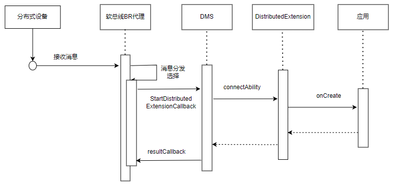

# 分布式Extension开发指南

## 简介

随着用户不同种类的终端设备数量不断增多，将不同设备作为本端设备能力的扩展，使设备之间协同合作完成各种复杂场景即为设备的分布式业务。

用户使用单账号在不同终端设备上使用较为繁琐，针对此类场景，提供了跨端操作的能力，例如手机侧应用APP 涉及与手表等设备互联协同，提供消息同步机制。

### 能力范围

数据交互：实现跨设备数据传输，包括文本信息、字节流、图片、传输流（三方应用仅支持文本信息交互能力）。

### 亮点特征

在应用跨设备协同过程中，当终端A处于后台而终端B保持前台运行时，系统可借助分布式消息服务激活分布式扩展组件，从而实现信息跨设备同步传输。例如，手机侧应用运行在后台，手表侧应用运行在前台时，上行消息通过DMS（Distributedsched Management Service）拉起DistributedExtension，从而实现手表侧消息回复同步至手机侧应用服务。

### 基本概念

在进行应用跨设备互联协同开发前，开发者应了解以下基本概念：

* **DMS**
  
  DMS（Distributedsched Management Service）是分布式组件管理框架，提供分布式组件的管理能力。
* **UIAbility**
  
  描述应用程序的界面交互能力，负责管理应用界面的生命周期、用户交互以及界面渲染等任务。
* **Extension**
  
  用于扩展应用的功能或实现跨设备协同。它允许应用在后台运行某些任务，或者将部分功能迁移到其他设备上执行，从而实现分布式能力。
* **字节流**
  
  字节流是数据类型为[ArrayBuffer](https://gitee.com/openharmony/docs/blob/master/zh-cn/application-dev/arkts-utils/arraybuffer-object.md)类型的数据。可以被用于存储二进制数据，例如图像或音频数据。
* **传输流**
  
  可进行图片、音频、文本信息和字节流。

## 实现原理

设备A应用集成**DistributedExtension**，当设备A侧分布式软总线收到应用的消息时，通过DistributedExtension拉起设备A侧应用后台服务，设备A侧应用后台服务将设备B侧应用消息发送到应用服务。



## 约束与限制

* 设备间需要登录相同的华为账号。
* 不同设备间只有相同bundleName的UIAbility应用才能进行协同。

## 环境准备

### 环境要求

可登录华为账号的设备A和设备B，设备间需要组网成功（双端登录同一个华为账号，并使用蓝牙连接）。

### 搭建环境

1. 在PC上安装[DevEco Studio](https://gitee.com/link?target=https%3A%2F%2Fdeveloper.huawei.com%2Fconsumer%2Fcn%2Fdownload%2Fdeveco-studio)，要求版本在4.1及以上。
2. 将public-SDK更新到API 20或以上，更新SDK的具体操作可参见[更新指南](../tools/openharmony_sdk_upgrade_assistant.md)。
3. 打开设备A和设备B的蓝牙，互相识别，实现组网。

### 检验环境是否搭建成功

将设备A与B连接至PC并在PC上执行shell命令：

```shell
hdc shell
hidumper -s 4700 -a "buscenter -l remote_device_info"
```

组网成功时可显示组网设备数量的信息，如“remote device num = 1”。

## 开发指导

应用跨设备连接管理可以通过分布式操作系统，实时处理终端应用后台消息，为用户提供更加高效的体验。

### 接口说明

分布式扩展能力API的接口使用指导请参见[DistributedExtensionAbility API参考](../reference/apis-distributedservice-kit/js-apis-distributedExtensionAbility.md)。

| 接口名                                                               | 描述                       |
| -------------------------------------------------------------------- | -------------------------- |
| onCreate(want: Want): void;                                          | 分布式协同触发创建。       |
| onDestroy(): void;                                                   | 分布式协同销毁 。          |
| onCollaborate(wantParam: Record): AbilityConstant.CollaborateResult; | 分布式协同有请求时时回调。 |

### 开发步骤

1. 在配置文件中注册 `Extension`组件。
   
   在应用配置文件 `module.json5`中新增 `"extensionAbilities"`字段，其中注册类型 `"type"`设置为 `"distributed"`，元数据信息["metadata"](../reference/apis-ability-kit/js-apis-bundleManager-metadata.md)新增一个 `"name"`为 `"ohos.extension.DistributedExtension"`的条目。
   
   DistributedExtensionAbility配置文件示例：
   
   ```json
   "extensionAbilities": [
     {
       "name": "EntrydistributedAbility",
       "srcEntry": "./ets/entrybackupability/EntryDistributedAbility.ets",
       "type": "distributed",
       "exported": false,
       "metadata": [
         {
           "name": "ohos.extension.DistributedExtension",
         }
       ],
       "srcEntry": "./ets/common/MDSExtension.ts",
     }
   ]
   ```
2. 导入开发所需模块。
   
   ```ts
   import { AbilityConstant, Want } from '@kit.AbilityKit';
   import { abilityConnectionManager, DistributedExtensionAbility } from '@kit.DistributedServiceKit';
   ```
3. 开发者可以自定义 `MDSExtension.ets`文件，类中继承 `DistributedExtensionAbility`，通过重写其 `onCreate、onDestroy`和 `onCollaborate`方法，使其达到在分布式能力扩展的创建、销毁和连接回调的使用。
   
   下面的示例展示了一个空实现的 `MDSExtension.ets`文件，根据对应日志可观测其生命周期：
   
   ```ts
   import { AbilityConstant, Want } from '@kit.AbilityKit';
   import { abilityConnectionManager, DistributedExtensionAbility } from '@kit.DistributedServiceKit';   
   
   export default class DistributedExtension extends DistributedExtensionAbility {
     onCreate(want: Want) {
       console.info(`DistributedExtension Create ok`);
       console.info(`DistributedExtension on Create want: ${JSON.stringify(want)}`);
       console.info(`DistributedExtension on Create end`);
     }
   
     onCollaborate(wantParam: Record<string, Object>) {
       console.info(`DistributedExtension onCollabRequest Accept to the result of Ability collaborate`);
       let sessionId = -1;
       const collaborationValues = wantParam["CollaborationValues"] as abilityConnectionManager.CollaborationValues;
       if (collaborationValues == undefined) {
         return sessionId;
       }
   
       console.info(`onCollab, collaborationValues: ${JSON.stringify(collaborationValues)}`);
       return AbilityConstant.CollaborateResult.ACCEPT;
     }
   
     onDestroy() {
       console.info(`DistributedExtension onDestroy ok`);
     }
   }
   ```

## 常见问题

### 设备A侧回复消息设备B侧未收到

**可能原因**

设备间没有相互组网，导致设备A侧与设备B连接超时。

**解决措施**

设备A和设备B开启USB调试功能，用USB线连接设备和PC。执行shell命令：

```
hdc shell
hidumper -s 4700 -a "buscenter -l remote_device_info"
```

回显信息为“remote device num = 0”即为组网失败，请确保登录同一华为账号并使用蓝牙连接。组网成功时可显示组网设备数量的信息，如“remote device num = 1”。

### 应用长时间未操作，正在执行的协同业务被断开

**可能原因**

应用在协同过程中，DMS会对进程的生命周期进行监听。发生操作持续十秒后，会被结束协同进程的状态。

**解决措施**

重新发消息触发进程重新拉起。

