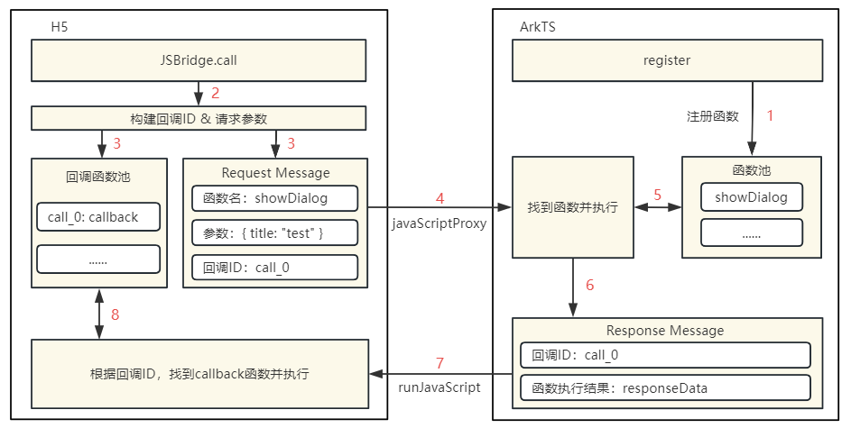

# Web开发常见问题


## H5页面如何与ArkTS交互(API 10)

**问题现象**

目前javaScriptProxy仅支持同步调用，异步调用无法获取执行结果。

**解决措施**

对javaScriptProxy和runJavaScript封装，实现JSBridge通信方案。适用于H5调用原生侧函数。使用Web组件javaScriptProxy将原生侧接口注入到H5的window对象上，通过runJavaScript接口执行JS脚本到H5中，并在回调中获取脚本执行结果。具体调用流程如下图所示：



- 首先通过Web组件的javaScriptProxy属性，将JSBridgeHandle对象注册到H5的window上，作为H5调用原生的通道。当H5开始加载时，在onPageBegin生命周期中调用initJSBridge()方法初始化JSBridge。
  ```
  // javaScriptProxy对象
  public get javaScriptProxy() {
      return {
          object: {
              call: this.call
          },
          name: "JSBridgeHandle",
          methodList: ['call'],
          controller: this.controller,
      }
  }
  ```

  ```
  // 使用Web组件加载H5页面
  @Component
  struct JsProxy {
    private controller: WebviewController = new WebView.WebviewController()
    private jsBridge: JSBridge = new JSBridge(this.controller)
    build() {
      Column(){
        Web({ src: $rawfile('index.html'), controller: this.controller })
          .javaScriptProxy(this.jsBridge.javaScriptProxy)
          .onPageBegin(() => {
            this.jsBridge.initJSBridge()
          })
      }
    }
  }
  ```

- 在initJSBridge方法中，通过webviewControll.runJavaScript()将JSBridge初始化脚本注入H5执行。当H5调用时，生成window.callID标识回调函数，将callID与调用参数使用JSBridgeHandle.call传到原生侧。通过JSBridgeCallback接收原生侧执行的结果，根据callID找到对应callback执行并且释放内存。
  ```
  // bridgeKey与bridgeMethod动态生成H5侧调用的入口
  bridgeKey: string = 'JSBridge'
  bridgeMethod: string = 'call'
  // 初始化脚本注入H5侧
  public initJSBridge() {
      try {
          this.controller.runJavaScript(`
              // 接收原生侧结果，执行callback
              function JSBridgeCallback(id, params){
                  window.JSBridgeMap[id](params)
              };
              // 声明调用入口
              window.${this.bridgeKey} = {
                  ${this.bridgeMethod}(method, params, callback){
                      window.JSBridgeMap[id] = callback || (() => {});
                      JSBridgeHandle.call(method, JSON.stringify(paramsObj));
                  },
              }`)
      }
  }
  ```

- JSBridgeHandle.call()是H5调用原生接口的统一入口，在该方法中根据H5调用的方法名，匹配到对应接口去调用。调用结束后通过this.callback()方法将调用结果返回H5。callback方法中使用webviewControll.runJavaScript()调用H5的JSBridgeCallback回传callID和调用结果。
  ```
  // call方法调用原生侧方法，接收结果
  private call = (fun, params) => {
      try {
          const paramsObj = JSON.parse(params)
          const events = this.exposeManage.methodMap.get(fun)
          const results = []
          events.forEach(callFun => {
              results.push(callFun(paramsObj.data))
          })
          Promise.all(results.filter(i => !!i)).then(res => {
              this.callback(paramsObj.callID, res.length > 1 ? res : res[0])
          })
      }
  }
  
  // 通过runJavaScript调用JSBridgeCallback执行回调
  private callback(id, data) {
      this.controller.runJavaScript(`__JSBridgeCallback__("${id}", ${JSON.stringify(data)})`);
  }
  ```


## Web组件的onUrlLoadIntercept返回结果是否影响onInterceptRequest(API 9)

**解决措施**

Web组件的onUrlLoadIntercept的不同返回结果对应不同的操作：

- onUrlLoadIntercept返回true则直接拦截URL请求。

- onUrlLoadIntercept返回false走onInterceptRequest回调。

**参考链接**

[onUrlloadIntercept](../reference/apis-arkweb/ts-basic-components-web.md#onurlloadinterceptdeprecated)


## 为什么Web组件的onKeyEvent键盘事件不生效(API 9)

**问题现象**

Web组件设置onKeyEvent监听键盘事件，键盘按下或抬起该事件不触发。

**解决措施**

onKeyEvent为通用事件，当前Web组件不支持通用事件。Web组件监听键盘事件可以使用onInterceptKeyEvent回调函数。

**参考链接**

[onInterceptKeyEvent](../reference/apis-arkweb/ts-basic-components-web.md#oninterceptkeyevent9)


## onInterceptRequest拦截URL并自定义HTML文件，页面加载失败(API 9)

**问题现象**

onInterceptRequest拦截页面Web的src的链接后返回自定义HTML，但是自定义HTML文件里面的script标签里的内容没有加载。

**解决措施**

设置拦截器时，如果只设置setResponseData，内核将无法识别到这是个HTML文件，需要同时设置setResponseEncoding、setResponseMimeType、setResponseHeader等参数。

**代码示例**

```
Web({ src: 'www.example.com', controller: this.controller })
  .onInterceptRequest((event) => {
    console.log('url:' + event.request.getRequestUrl())
    this.responseweb = new WebResourceResponse();
    var head1:Header = {
      headerKey:"Connection",
      headerValue:"keep-alive"
    }
    var length = this.heads.push(head1)
    this.responseweb.setResponseHeader(this.heads)
    this.responseweb.setResponseData(this.webdata)
    this.responseweb.setResponseEncoding('utf-8')
    this.responseweb.setResponseMimeType('text/html')
    this.responseweb.setResponseCode(200)
    this.responseweb.setReasonMessage('OK')
    return this.responseweb
})
```

**参考链接**

[WebResourceResponse](../reference/apis-arkweb/ts-basic-components-web.md#webresourceresponse)


## 如何在ArkTS代码中执行HTML内的JS函数(API 9)

**解决措施**

通过WebviewController中runJavaScript方法异步执行JavaScript脚本，并通过回调方式获取执行结果。

> **说明：**
> runJavaScript需要在loadUrl完成后，比如onPageEnd中调用。

**参考链接**

[runJavaScript](../reference/apis-arkweb/js-apis-webview.md#runjavascript)


## 使用Web组件加载本地网页时，如何在本地网页中调用ArkTS中的函数(API 9)

**解决措施**

1. 准备一个html文件，例如：

   ```
   <!DOCTYPE html>
   <html lang="en">
   <head>
       <meta charset="UTF-8">
       <meta http-equiv="X-UA-Compatible" content="IE=edge">
       <meta name="viewport" content="width=device-width, initial-scale=1.0">
       <title>Document</title>
   </head>
   <body>
       <h1>标题</h1>
       <h5 id="h5"></h5>
       <h5 id = "h6"></h5>
       <button onclick="handleFromH5">调用Arkts的方法</button>
       <script type="text/javascript">
           function handleFromH5(){
               let result = window.objName.test();
               document.getElementById('h6').innerHTML = result;
           }
       </script>
   </body>
   </html>
   ```

2. 在ArkTs中使用JavaScriptProxy方法将ArkTs里的对象注册到H5的window对象中，然后在h5中使用window对象调用该方法。比如下面例子，在ArkTs中将testObj这个对象以别名objName注册到h5的window对象上，在上面的h5中就可以使用window.objName去访问这个对象。

   ```
   // xxx.ets
   import web_webview from '@ohos.web.webview'
   @Entry
   @Component
   struct Index {
     @State message: string = 'Hello World'
     controller: web_webview.WebviewController = new web_webview.WebviewController()
     testObj = {
       test: (data1, data2, data3) => {
         console.log("data1:" + data1);
         console.log("data2:" + data2);
         console.log("data3:" + data3);
         return "AceString";
       },
       toString: () => {
         console.log('toString' + "interface instead.");
       }
     }
     build() {
       Row() {
         Column() {
           Web({ src:$rawfile('index.html'), controller:this.controller })
             .javaScriptAccess(true)
             .javaScriptProxy({
               object: this.testObj,
               name: "objName",
               methodList: ["test", "toString"],
               controller: this.controller,
            })
         }
         .width('100%')
       }
       .height('100%')
     }
   }
   ```

**参考链接**

[javaScriptProxy](../reference/apis-arkweb/ts-basic-components-web.md#javascriptproxy)


## Web组件domStorageAccess属性设置(API 9)

**解决措施**

设置是否开启文档对象模型存储接口（DOM Storage API）权限，默认未开启，控制web网页中localStorage的使用，对sessionStorage未做控制

**参考链接**

[domStorageAccess](../reference/apis-arkweb/ts-basic-components-web.md#domstorageaccess)


## 如何解决Web组件加载的HTML页面内检测网络状态失败(API 9)

**问题现象**

在HTML页面内通过window.navigator.onLine获取网络状态，联网和断网情况下均为false。

**解决措施**

配置应用获取网络信息权限： ohos.permission.GET_NETWORK_INFO

**参考链接**

[GET\_NETWORK\_INFO](../security/AccessToken/permissions-for-all.md#ohospermissionget_network_info)


## 如何自定义拼接设置User-Agent参数(API 9)

**解决措施**

默认User-Agent需要通过WebviewController获取。WebviewController对象必须在Web组件绑定后，才能调用WebviewController上的方法getUserAgent获取默认User-Agent。因此在页面加载前通过自定义字符串拼接修改User-Agent，可采用此方式：

1. 使用\@State定义初始User-Agent，绑定到Web组件；

2. 在Web组件的onUrlLoadIntercept回调中，通过WebviewController.getUserAgent()获取默认User-Agent，并修改Web组件绑定的User-Agent

**代码示例**

```
import web_webview from '@ohos.web.webview'
@Entry
@Component
struct Index {
  private controller: web_webview.WebviewController = new web_webview.WebviewController()
  @State userAgentPa: string = ''
  build() {
    Row() {
      Column() {
        Web({ src: 'http://www.example.com', controller: this.controller }) //需要手动替换为真实网站
          .width('100%')
          .userAgent(this.userAgentPa)
          .onUrlLoadIntercept((event) => {
            let userAgent = this.controller.getUserAgent();
            this.userAgentPa = userAgent + ' 111111111'
            return false;
          })
      }
      .width('100%')
    }
    .height('100%')
  }
}
```

**参考链接**

[userAgent](../reference/apis-arkweb/ts-basic-components-web.md#useragentdeprecated)、[getUserAgent](../reference/apis-arkweb/js-apis-webview.md#getuseragent)


## Web组件中如何通过手势滑动返回上一个Web页面(API 9)

**解决措施**

通过重写onBackPress函数来自定义返回逻辑，使用WebviewController判断是否返回上一个Web页面。

**示例代码**

```
import web_webview from '@ohos.web.webview';
@Entry
@Component
struct Index {
  controller: web_webview.WebviewController = new web_webview.WebviewController();
  build() {
    Column() {
      Web({ src: 'http://www.example.com', controller: this.controller })//需要手动替换为真实网站
    }
  }
  onBackPress() {
    // 当前页面是否可前进或者后退给定的step步(-1),正数代表前进，负数代表后退
    if (this.controller.accessStep(-1)) {
      this.controller.backward(); // 返回上一个web页
      // 执行用户自定义返回逻辑
      return true
    } else {
      // 执行系统默认返回逻辑，返回上一个page页
      return false
    }
  }
}
```

**参考链接**

[accessStep](../reference/apis-arkweb/js-apis-webview.md#accessstep)


## WebView支持同层渲染吗(API 10)

**解决措施**

1. 支持Video、Map、Camera、Canvas、WebGL、WebView组件同层渲染。
2. 支持将Web embed标签的id、type、src、width、height、url属性传递给原生组件。


## WebView有哪些调试工具，调试工具的用法是什么(API 10)

**解决措施**

setWebDebuggingAccess()接口开启Web组件前端页面调试能力，利用DevTools工具可以在2in1上调试移动设备上的前端网页，设备需为4.1.0及以上版本。

**参考链接**

[使用Devtools工具调试前端页面（开发指南）](../web/web-debugging-with-devtools.md)


## WebView如何实现网络请求拦截功能(API 10)

**解决措施**

可以通过onInterceptRequest()接口实现自定义资源请求响应，该能力可用于自定义Web页面响应、自定义文件资源响应等场景。当Web网页发起资源加载请求时，应用层会收到该请求消息并构造本地资源响应消息发送给Web内核，Web内核根据应用层响应信息进行页面资源加载。

**参考链接**

[自定义页面请求响应（开发指南）](../web/web-resource-interception-request-mgmt.md)


## WebView和原生进行通信的方式有哪些，如何实现(API 10)

**解决措施**

1. Native->H5使用runJavaScript接口注入JS进行通信，H5->Native使用registerJavaScriptProy接口。先将Native方法注册至H5侧，H5再通过调用前端方法实现与Native侧的通信。
2. runJavaScript、registerJavaScriptProy接口同时在NDK侧C API暴露。
3. 使用onInterceptrequest接口拦截H5侧请求，同时将Native侧数据作为Response返回至H5，实现Native与H5的通信。

**参考链接**

[runJavaScript](../reference/apis-arkweb/js-apis-webview.md#runjavascriptext10)、[registerJavaScriptProxy](../reference/apis-arkweb/js-apis-webview.md#registerjavascriptproxy)、[javaScriptProxy](../reference/apis-arkweb/ts-basic-components-web.md#javascriptproxy)、[onInterceptRequest](../reference/apis-arkweb/ts-basic-components-web.md#oninterceptrequest9)


## WebView进程模型和渲染机制是什么(API 11)

**解决措施**

1. 进程模型：1个主进程、多个render进程。
2. 渲染机制：web自渲染。


## 系统目前是否支持Webrtc的功能？规格是什么？

**解决措施**

1. WebView支持Webrtc的P-P功能以及音视频流功能。
2. 非WebView场景，系统不直接提供Webrtc，但会提供技术支持，比如支持三方gn+ninja交叉编译方式适配Webrtc（RR-30030985），包含以下两点：
   * sdk支持gn+ninja交叉编译方式
   * 提供编译样例指导


## Webview如何设置mixcontent策略，用以解决http与https混合加载的问题？

**解决措施**

Webview提供mixedMode(mixedMode: MixedMode)接口，设置是否允许加载超文本传输协议（HTTP）和超文本传输安全协议（HTTPS）混合内容，默认不允许加载HTTP和HTTPS混合内容。

**参考链接**

[mixedmode](../reference/apis-arkweb/ts-basic-components-web.md#mixedmode)


## WebView除了设置缓存，还有什么方式可以提升渲染速度吗？

**解决措施**

使用prepareForPageLoad接口开启预解析。

**参考链接**

[prepareforpageload](../reference/apis-arkweb/js-apis-webview.md#prepareforpageload10)


## 如何预创建Web组件？如何回收web组件复用？

**解决措施**

通过ArkUI提供的组件动态上下树能力，实现Web组件预创建、回收复用，使用指南见参考链接。

**参考链接**

[动态创建Web组件](../web/web-page-loading-with-web-components.md)


## 目前OpenHarmony是否有提供类似其他系统的JavaScript引擎能力?

**解决措施**

目前已支持，详情请见参考链接。

**参考链接**

[JSVM](../reference/common/_j_s_v_m.md)