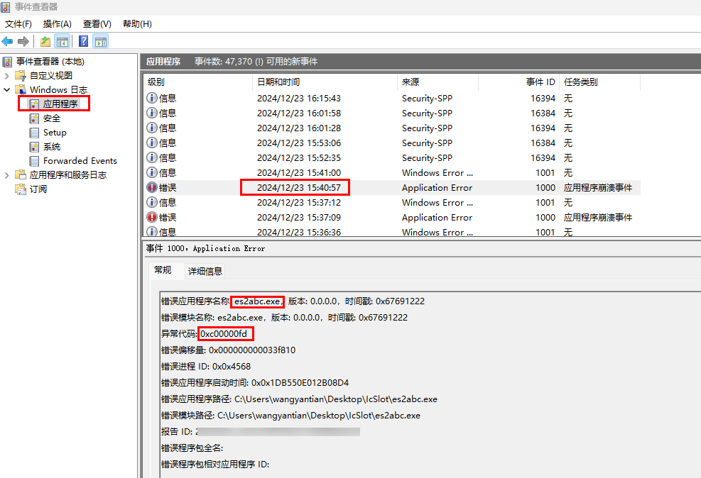
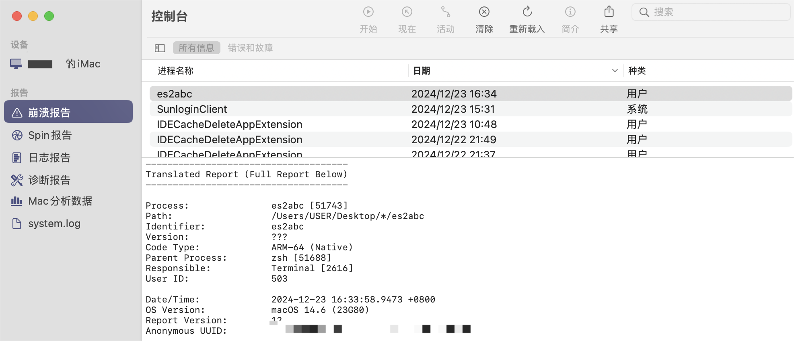
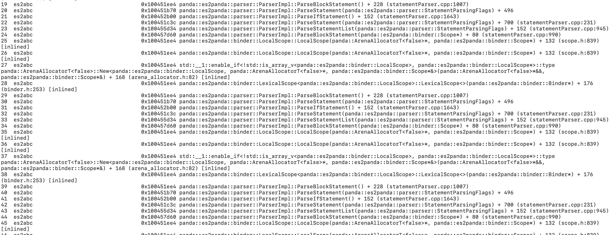

# 语言编译运行时常见问题


## 从rawfile中获取json格式的字符串后，转换成对应的object对象后，再去调用实例方法时直接崩溃(API 9)

**问题现象**

直接报错：jscrash happened in xxxxxxxxx，crash日志中错误信息：Error message: Unexpected Object in JSON

**解决措施**

通过json解析字符串得到的对象的原型是object，其原型链中不存在自有的实例方法，故无法调用。

如需调用该方法，则有以下两种方式：

1. 在解析后的对象上添加对应的原型。

2. 将该实例方法改为静态方法，通过类名去调用。

## napi_call_function出现pending exception时导致下一次使用NAPI方法出错(API 10)

**问题场景**

场景：napi_call_function调用ArkTs函数异常时，系统行为是pending exception而不是Crash。
后果：导致pending时，如果开发者未作安全校验，则会在下一次使用napi方法时出错，且出错行为无法预期，这种情况下应该如何处理？

**解决方案**

考虑ArkTS侧调用一个native方法，在native方法中使用了napi_call_function，如果产生异常系统就jscrash，那么开发者在ArkTS侧try..catch就会失效。
调用napi_call_function，如果有异常就需要及时返回。

## 除了napi_call_function会有pending exception，是否还有其他异常场景？(API 10)

**解决方案**

调用NAPI接口理论上都有可能产生异常；所以在业务的关键流程需要对接口调用的返结果进行判断，查看否有异常产生。比如：
```cpp
napi_status status = napi_create_object(env, &object);
if (status != napi_ok) {
  napi_throw_error(env, ...);
  return;
}
```

## 使用HSP的多包场景下场景，直接崩溃并产生cppcrash异常日志，错误信息为resolveBufferCallback get buffer failed

**解决方案**

该问题是由于hsp包解析失败导致，常见加载失败原因有安装失败、文件丢失、缺少权限、安全内存校验失败等，开发者可以根据关键日志进行排查。通常情况下，重新安装应用即可恢复。

| **已知关键错误日志** | **修改建议** |
| -------- | -------- |
| realHapPath is empty | 路径查询失败，无法获取用户安装包信息。建议开发者重新安装应用。 |
| transform real path error: ERROR, pathName: PATH | 使用realpath函数解析路径失败，ERROR表示错误信息，PATH表示hsp路径。建议开发者重新安装应用。 |
| CreateFileMapper, mmap failed, errno ERROR. fileName: FILENAME | 使用mmap函数映射安全内存映射失败，ERROR表示错误信息，FILENAME表示文件名。常见原因是系统内存不足、文件未签名。|

## Array数组的长度上限是多少

ECMAScript标准中定义的是2^32 - 1，超过该值会抛出RangeError。

## 模块间循环依赖导致运行时未初始化异常问题定位

**问题场景**

模块间循环依赖可能导致应用运行时模块依赖的变量未初始化，如下示例。index.ets文件执行前，会先执行依赖的page.ets文件，page.ets文件执行时又循环依赖了index.ets导出的foo符号。此时index.ets文件未执行，foo变量尚未完成初始化，会导致运行时异常。

```typescript
// index.ets
import { bar } from './page'

export function foo() {
    bar()
}

// page.ets
import { foo } from './index'

export function bar() {
    foo()
}
bar()

```

**问题现象**

运行时发生js crash, crash日志中报错信息为：Error message: foo is not initialized

**解决方案**

开发者可以通过IDE中Code Linter检查工具识别应用代码中的循环依赖并进行代码重构，消除循环依赖影响，工具详情请参考[Deveco Studio代码Code Linter检查](https://developer.huawei.com/consumer/cn/doc/harmonyos-guides-V5/ide-code-linter-V5)。操作步骤如下：

1. 在工程根目录下创建code-linter.json5配置文件，配置如下：
    ```json
    {
      "files": [ // 用于表示配置适用的文件范围的 glob 模式数组。
        "**/*.js",
        "**/*.ts",
        "**/*.ets"
      ],
      "rules": {
        "@security/no-cycle": "error" // 配置循环依赖检查规则。
      }
    }
    ```
2. 在工程管理窗口中鼠标选中工程根目录，右键选择Code Linter > Full Linter执行代码全量检查。
3. 根据检查结果，对应用代码中的循环依赖部分进行代码重构。

## 编译异常，无具体错误日志，难以定位问题
**问题现象**

出现Failed to execute es2abc. 但是没有具体的错误日志，难以对问题进行定位以及原因分析。

**问题场景**

场景：开发者在源码中使用大量深度嵌套的代码，比如几百层的if-else，as转换，括号嵌套等，在编译的时候由于递归调用导致超出栈容量上限，引发es2abc的闪退，并且没有相关的错误日志。

**定位方案**

在windows上，可以打开事件管理器，Windows日志，应用程序，找到对应的时间，如果能找到es2abc.exe的崩溃日志，同时异常代码为 0xc00000fd, 那么表示该编译由于爆栈导致崩溃。<br>
<br>
在mac上，可以进入控制台，点击崩溃报告，找到es2abc,双击查看崩溃日志。<br>
<br>
如果出现下图中所示，调用栈出现大量反复的调用相同的函数，那么极有可能是出现了大量递归导致爆栈。<br>


**解决方案**

排查代码中有无大量重复嵌套的场景，比如几百层if-else，as转换，括号嵌套等，对其进行拆分或者优化。

**问题代码示例**

包括但不限于以下问题场景

```typescript
if (condition) {
    if (condition) {
        if (condition) {
            if (condition) {
                if (condition) {
                    if (condition) {
                        ...
                    }
                }
            }
        }
    }
}
```

```typescript
[
    [
        [
            [
                [
                    [
                        [
                            [
                                ...
                            ]
                        ]
                    ]
                ]
            ]
        ]
    ]
]
```

```typescript
!!!!!!!!!!
!!!!!!!!!!
...
!!!!!a
```

```typescript
var a = 1
a as Int as Int as Int as Int as Int ...
```