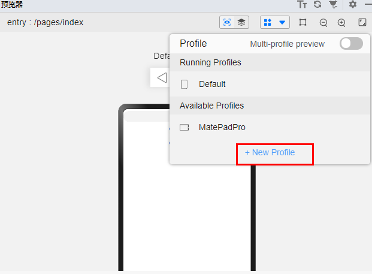

# 开发板


## 如何获取开发板上截屏图片？

适用于：OpenHarmony SDK 3.2.2.5版本，API9 Stage模型

- 方法一：点击开发板下拉控制中心的截屏按钮，截屏图片通过相册可以查看。

- 方法二：通过截屏脚本一键截屏，可以在电脑上查看。操作方法：Windows上连接开发板，然后电脑上新建文本文件，拷贝如下脚本内容，文件名后缀改为.bat文件（需要提前配置好hdc的环境变量），点击运行后，截屏图片与脚本在同一目录。
  示例：

    
  ```
  set filepath=/data/%date:~0,4%%date:~5,2%%date:~8,2%%time:~1,1%%time:~3,2%%time:~6,2%.png
  echo %filepath%
  : pause
  hdc_std shell snapshot_display -f %filepath%
  : pause
  hdc_std file recv %filepath% .
  : pause
  ```

## RK3568板子和previewer上展示的效果差异较大，如何把previewer的尺寸调整成实际板子一样。

适用于：IDE 3.0.0.991

1. 给预览器新建Profile
   
   

2. 新建Profile的具体参数可参考如下配置：
   Device type : default

   Resolution: 720\*1280

   DPI: 240

## 开发板安装驱动后设备仍然无法识别，设备管理器错误识别为其他设备：FT232R USB UART （）

可能原因：开发版的USB串口驱动没有安装。

解决办法：搜索FT232R USB UART确定，下载安装驱动即可。

## 在开发板上登录需要认证网络如何进行认证

适用于：OpenHarmony SDK 3.2.2.5版本

连接需要认证的网络后，用浏览器打开任意网址就可以进入认证页面。

如果开发板上没有浏览器，可以安装[浏览器Sample应用](https://gitee.com/openharmony/app_samples/tree/master/device/Browser)。
