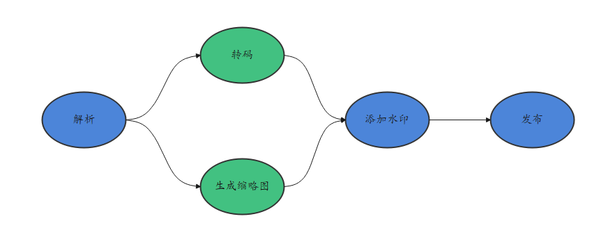
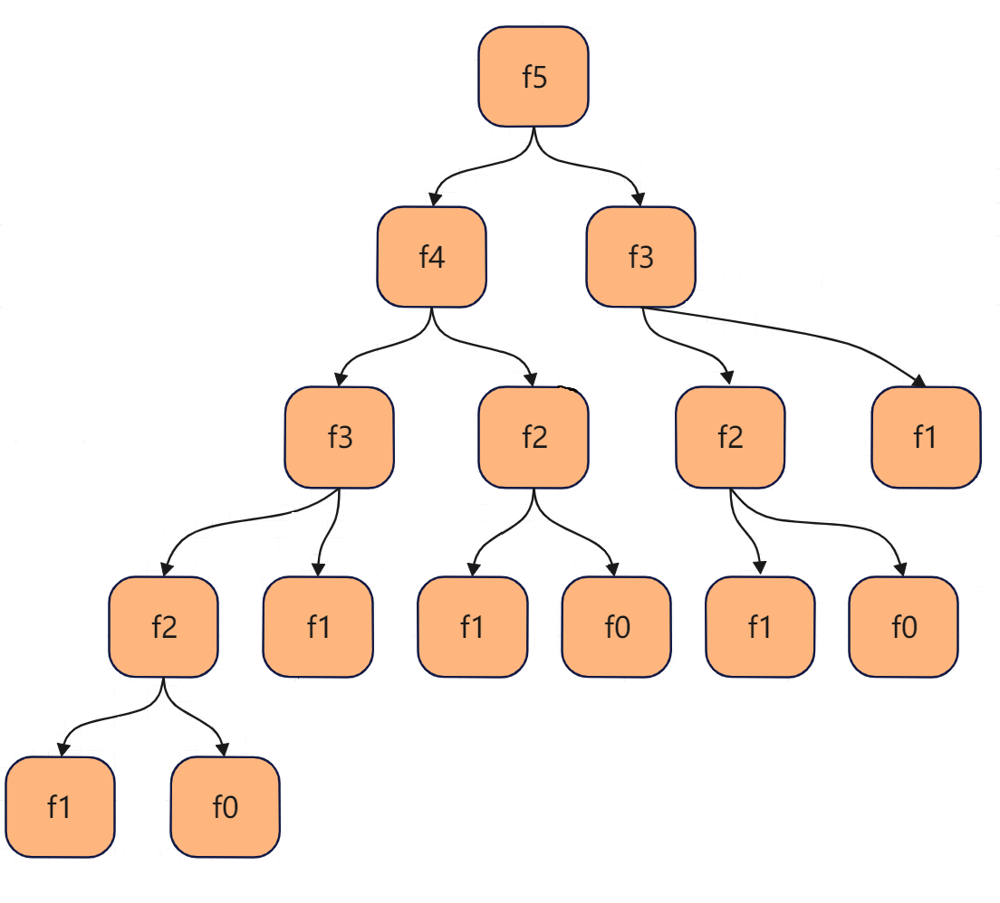

# Function Flow Runtime图依赖并发(C)

## 概述

FFRT图依赖并发范式支持任务依赖和数据依赖两种方式构建任务依赖图。任务依赖图中每个节点表示一个任务，边表示任务之间的依赖关系。任务依赖分为输入依赖`in_deps`和输出依赖`out_deps`。

构建任务依赖图的两种不同方式：

- 当使用任务依赖方式构建任务依赖图时，使用任务句柄`handle`来对应一个任务对象。
- 当使用数据依赖方式构建任务依赖图时，数据对象表达抽象为数据签名，每个数据签名唯一对应一个数据对象。

### 任务依赖

> **说明：**
>
> 当任务句柄出现在一个任务的`in_deps`中时，任务句柄对应的任务是该任务的前置任务；当任务句柄出现在一个任务的`out_deps`中时，任务句柄对应的任务是该任务的后继任务。

任务依赖适用于任务之间有明确顺序或逻辑流程要求的场景，例如：

- 顺序执行的任务，例如：先进行数据预处理任务，然后再进行模型训练任务。
- 逻辑流程控制，例如：商品交易过程中，通常是先下单，然后是制作，最后是物流运输。
- 多级任务链，例如：流媒体视频处理过程中，视频解析后可以进行视频转码和视频生成缩略图，然后是视频添加水印，最后是视频发布。

### 数据依赖

> **说明：**
>
> 当数据对象的签名出现在一个任务的`in_deps`中时，该任务称为数据对象的消费者任务，消费者任务执行不改变其输入数据对象的内容；
> 当数据对象的签名出现在任务的`out_deps`中时，该任务称为数据对象的生产者任务，生产者任务执行改变其输出数据对象的内容，从而生成该数据对象的一个新的版本。

数据依赖适用于任务之间通过数据生产和消费关系来触发执行的场景。

一个数据对象可能存在多个版本，每个版本对应一个生产者任务和零个，一个或多个消费者任务，根据生产者任务和消费者任务的下发顺序定义数据对象的多个版本的顺序，以及每个版本所对应的生产者和消费者任务。

数据依赖解除的任务进入就绪状态允许被调度执行，依赖解除状态指任务所有输入数据对象版本的生产者任务执行完成，且所有输出数据对象版本的所有消费者任务执行完成的状态。

FFRT在运行时可动态构建任务之间的基于生产者/消费者的数据依赖关系并遵循任务数据依赖状态执行调度，包括：

- Producer-Consumer依赖

  一个数据对象版本的生产者任务和该数据对象版本的消费者任务之间形成的依赖关系，也称为Read-after-Write依赖。

- Consumer-Producer依赖

  一个数据对象版本的消费者任务和该数据对象的下一个版本的生产者任务之间形成的依赖关系，也称为Write-after-Read依赖。

- Producer-Producer依赖

  一个数据对象版本的生产者任务和该数据对象的下一个版本的生产者任务之间形成的依赖关系，也称为Write-after-Write依赖。

例如，存在一组任务与数据A的关系表述为：

```cpp
task1(OUT A);
task2(IN A);
task3(IN A);
task4(OUT A);
task5(OUT A);
```


为表述方便，本文中的数据流图均以圆圈表示Task，方块表示数据。

可以得出以下结论：

- task1与task2/task3构成Producer-Consumer依赖，即：task2/task3需要等到task1写完A之后才能读A。
- task2/task3与task4构成Consumer-Producer依赖，即：task4需要等到task2/task3读完A之后才能写A。
- task4与task5构成Producer-Producer依赖，即：task5需要等到task4写完A之后才能写A。

## 示例：流媒体视频处理

用户上传视频到流媒体平台，处理步骤包含：视频解析A、视频转码B、视频缩略图生成C、视频水印添加D和视频发布E，其中步骤B和步骤C可以并行执行。任务流程如下图所示：



借助FFRT提供了图依赖并发范式，可以描述任务依赖关系，同时并行化上述视频处理流程，代码如下所示：

```c
#include <stdio.h>
#include "ffrt/ffrt.h"

static inline void ffrt_submit_c(ffrt_function_t func, const ffrt_function_t after_func,
    void* arg, const ffrt_deps_t* in_deps, const ffrt_deps_t* out_deps, const ffrt_task_attr_t* attr)
{
    ffrt_submit_base(ffrt_create_function_wrapper(func, after_func, arg), in_deps, out_deps, attr);
}

static inline ffrt_task_handle_t ffrt_submit_h_c(ffrt_function_t func, const ffrt_function_t after_func,
    void* arg, const ffrt_deps_t* in_deps, const ffrt_deps_t* out_deps, const ffrt_task_attr_t* attr)
{
    return ffrt_submit_h_base(ffrt_create_function_wrapper(func, after_func, arg), in_deps, out_deps, attr);
}

void func_TaskA(void* arg)
{
    printf("视频解析\n");
}

void func_TaskB(void* arg)
{
    printf("视频转码\n");
}

void func_TaskC(void* arg)
{
    printf("视频生成缩略图\n");
}

void func_TaskD(void* arg)
{
    printf("视频添加水印\n");
}

void func_TaskE(void* arg)
{
    printf("视频发布\n");
}

int main()
{
    // 提交任务A
    ffrt_task_handle_t hTaskA = ffrt_submit_h_c(func_TaskA, NULL, NULL, NULL, NULL, NULL);

    // 提交任务B和C
    ffrt_dependence_t taskA_deps[] = {{ffrt_dependence_task, hTaskA}};
    ffrt_deps_t dTaskA = {1, taskA_deps};
    ffrt_task_handle_t hTaskB = ffrt_submit_h_c(func_TaskB, NULL, NULL, &dTaskA, NULL, NULL);
    ffrt_task_handle_t hTaskC = ffrt_submit_h_c(func_TaskC, NULL, NULL, &dTaskA, NULL, NULL);

    // 提交任务D
    ffrt_dependence_t taskBC_deps[] = {{ffrt_dependence_task, hTaskB}, {ffrt_dependence_task, hTaskC}};
    ffrt_deps_t dTaskBC = {2, taskBC_deps};
    ffrt_task_handle_t hTaskD = ffrt_submit_h_c(func_TaskD, NULL, NULL, &dTaskBC, NULL, NULL);

    // 提交任务E
    ffrt_dependence_t taskD_deps[] = {{ffrt_dependence_task, hTaskD}};
    ffrt_deps_t dTaskD = {1, taskD_deps};
    ffrt_submit_c(func_TaskE, NULL, NULL, &dTaskD, NULL, NULL);

    // 等待所有任务完成
    ffrt_wait();

    ffrt_task_handle_destroy(hTaskA);
    ffrt_task_handle_destroy(hTaskB);
    ffrt_task_handle_destroy(hTaskC);
    ffrt_task_handle_destroy(hTaskD);
    return 0;
}
```

C风格构建FFRT任务需要一些额外的封装，封装方式为公共代码，与具体业务场景无关，使用方可以考虑用公共机制封装管理。

```c
typedef struct {
    ffrt_function_header_t header;
    ffrt_function_t func;
    ffrt_function_t after_func;
    void* arg;
} c_function_t;

static inline void ffrt_exec_function_wrapper(void* t)
{
    c_function_t* f = (c_function_t *)t;
    if (f->func) {
        f->func(f->arg);
    }
}

static inline void ffrt_destroy_function_wrapper(void* t)
{
    c_function_t* f = (c_function_t *)t;
    if (f->after_func) {
        f->after_func(f->arg);
    }
}

#define FFRT_STATIC_ASSERT(cond, msg) int x(int static_assertion_##msg[(cond) ? 1 : -1])
static inline ffrt_function_header_t *ffrt_create_function_wrapper(const ffrt_function_t func,
    const ffrt_function_t after_func, void *arg)
{
    FFRT_STATIC_ASSERT(sizeof(c_function_t) <= ffrt_auto_managed_function_storage_size,
        size_of_function_must_be_less_than_ffrt_auto_managed_function_storage_size);

    c_function_t* f = (c_function_t *)ffrt_alloc_auto_managed_function_storage_base(ffrt_function_kind_general);
    f->header.exec = ffrt_exec_function_wrapper;
    f->header.destroy = ffrt_destroy_function_wrapper;
    f->func = func;
    f->after_func = after_func;
    f->arg = arg;
    return (ffrt_function_header_t *)f;
}
```

预期的输出可能为：

```plain
视频解析
视频转码
视频生成缩略图
视频添加水印
视频发布
```

## 示例：斐波那契数列

斐波那契数列中每个数字是前两个数字之和，计算斐波那契数的过程可以很好地通过数据对象来表达任务依赖关系。使用FFRT并发编程框架计算斐波那契数的代码如下所示：

```c
#include <stdio.h>
#include "ffrt/task.h"

typedef struct {
    int x;
    int* y;
} fib_ffrt_s;

static inline void ffrt_submit_c(ffrt_function_t func, const ffrt_function_t after_func,
    void* arg, const ffrt_deps_t* in_deps, const ffrt_deps_t* out_deps, const ffrt_task_attr_t* attr)
{
    ffrt_submit_base(ffrt_create_function_wrapper(func, after_func, arg), in_deps, out_deps, attr);
}

void fib_ffrt(void* arg)
{
    fib_ffrt_s* p = (fib_ffrt_s*)arg;
    int x = p->x;
    int* y = p->y;

    if (x <= 1) {
        *y = x;
    } else {
        int y1, y2;
        fib_ffrt_s s1 = {x - 1, &y1};
        fib_ffrt_s s2 = {x - 2, &y2};

        // 构建数据依赖
        ffrt_dependence_t dx_deps[] = {{ffrt_dependence_data, &x}};
        ffrt_deps_t dx = {1, dx_deps};
        ffrt_dependence_t dy1_deps[] = {{ffrt_dependence_data, &y1}};
        ffrt_deps_t dy1 = {1, dy1_deps};
        ffrt_dependence_t dy2_deps[] = {{ffrt_dependence_data, &y2}};
        ffrt_deps_t dy2 = {1, dy2_deps};
        ffrt_dependence_t dy12_deps[] = {{ffrt_dependence_data, &y1}, {ffrt_dependence_data, &y2}};
        ffrt_deps_t dy12 = {2, dy12_deps};

        // 分别提交任务
        ffrt_submit_c(fib_ffrt, NULL, &s1, &dx, &dy1, NULL);
        ffrt_submit_c(fib_ffrt, NULL, &s2, &dx, &dy2, NULL);

        // 等待任务完成
        ffrt_wait_deps(&dy12);
        *y = y1 + y2;
    }
}

int main()
{
    int r;
    fib_ffrt_s s = {5, &r};
    ffrt_dependence_t dr_deps[] = {{ffrt_dependence_data, &r}};
    ffrt_deps_t dr = {1, dr_deps};
    ffrt_submit_c(fib_ffrt, NULL, &s, NULL, &dr, NULL);

    // 等待任务完成
    ffrt_wait_deps(&dr);
    printf("Fibonacci(5) is %d\n", r);
    return 0;
}
```

预期输出为：

```plain
Fibonacci(5) is 5
```

示例中将`fibonacci(x-1)`和`fibonacci(x-2)`作为两个任务提交给FFRT，在两个任务完成之后将结果进行累加。虽然单个任务只是拆分成两个子任务，但是子任务又可以继续进行拆分，因此整个计算图的并行度是非常高的。

各个任务在FFRT内部形成了一颗调用树：



## 接口说明

上述样例中涉及到主要的FFRT的接口包括：

| 名称                                                             | 描述                                   |
| ---------------------------------------------------------------- | -------------------------------------- |
| [ffrt_submit_base](ffrt-api-guideline-c.md#ffrt_submit_base)     | 提交任务调度执行。                     |
| [ffrt_submit_h_base](ffrt-api-guideline-c.md#ffrt_submit_h_base) | 提交任务调度执行并返回任务句柄。       |
| [ffrt_wait_deps](ffrt-api-guideline-c.md#ffrt_wait_deps)         | 等待依赖的任务完成，当前任务开始执行。 |

> **说明：**
>
> - 如何使用FFRT C++ API详见：[FFRT C++接口三方库使用指导](ffrt-development-guideline.md#using-ffrt-c-api-1)。
> - 使用FFRT C接口或C++接口时，都可以通过FFRT C++接口三方库简化头文件包含，即使用`#include "ffrt/ffrt.h"`头文件包含语句。

## 约束限制

- 使用`ffrt_submit_base`接口进行任务提交时，每个任务的输入依赖和输出依赖的数量之和不能超过8个。
- 使用`ffrt_submit_h_base`接口进行任务提交时，每个任务的输入依赖和输出依赖的数量之和不能超过7个。
- 参数既作为输入依赖又作为输出依赖的时候，统计依赖数量时只统计一次，如输入依赖是`{&x}`，输出依赖也是`{&x}`，实际依赖的数量是1。
