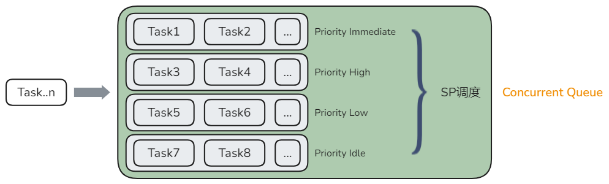

# Function Flow Runtime并发范式

为了应对实际业务中，任务执行顺序固定、灵活优先级调度以及复杂的任务依赖关系等场景，FFRT支持串行队列、并发队列和图依赖三种不同的并发范式。

## 串行队列（Serial Queue）

串行队列并发范式常用于解决一下场景中的问题：

1. **顺序执行**: 某些任务需要按特定顺序执行，串行队列可以确保任务按添加的顺序逐一执行，避免了乱序执行带来的数据不一致性和错误。
2. **数据安全**: 在并发环境中访问和修改共享资源时，容易出现竞争条件。使用串行队列可以避免多个线程同时访问共享资源，确保数据的一致性和安全性。
3. **任务协调**: 串行队列可以用来协调复杂任务的执行顺序，例如在进行多个依赖关系的任务时，确保前一个任务完成后再开始下一个任务。
4. **简化开发**: 相较于手动管理锁和同步机制，串行队列的使用更加简洁明了。开发者只需将任务添加到队列中，系统会自动处理任务的调度和执行顺序，减少了开发和调试的复杂性。
5. **资源管理**: 在某些情况下，限制并发任务的数量可以避免资源争用和过载。串行队列可以控制并发任务的数量，优化系统资源的使用。

串行队列并发范式开发样例可以参考 [串行队列(C)](ffrt-concurrency-serial-queue-c.md) / [串行队列(C++)](ffrt-concurrency-serial-queue-cpp.md)

## 并发队列（Concurrent Queue）

并发队列并发范式常用于解决一下场景中的问题：

1. **提高并发度**: 并发队列允许多个任务同时执行，充分利用多核处理器的计算能力，显著提高系统的并发度和整体性能。
2. **资源高效利用**: 并发队列能将任务分配到可用的CPU核心上，优化资源的使用，减少任务的等待时间和资源争用。
3. **任务调度灵活**: 并发队列允许任务按照不同的优先级（Priority）和QoS进行调度，确保关键任务能够及时执行，提高系统的响应速度。
4. **避免资源冲击**: 并发队列允许设置最大并发度，避免任务并发过多对系统资源造成的冲击，从而保证系统的稳定性和性能。

并发队列并发范式开发样例可以参考 [并发队列(C)](ffrt-concurrency-concurrent-queue-c.md) / [并发队列(C++)](ffrt-concurrency-concurrent-queue-cpp.md)

## 图依赖并发（Task Graph）

图依赖并发范式常用于解决一下场景中的问题：

1. **复杂任务依赖关系**: 在许多实际应用中，任务之间存在复杂的依赖关系。图依赖并发范式通过使用有向图来表示任务及其依赖关系，能够清晰地管理和调度这些任务。
2. **动态任务调度**: 当任务的依赖关系和执行顺序需要根据运行时的条件动态决定时，图依赖并发范式可以灵活地调整任务的调度，确保任务按正确的顺序执行。
3. **并行任务执行**: 图依赖并发范式允许多个不相互依赖的任务并行执行，从而最大化利用系统的计算资源，提高并发度和执行效率。
4. **结构化并发**：图依赖并发范式中可以通过明确的任务生命周期和依赖关系，确保并发任务的创建和完成在代码结构中清晰可见，减少并发编程的复杂性和错误。

图依赖并发范式开发样例可以参考 [图依赖并发(C)](ffrt-concurrency-graph-c.md) / [图依赖并发(C++)](ffrt-concurrency-graph-cpp.md)
