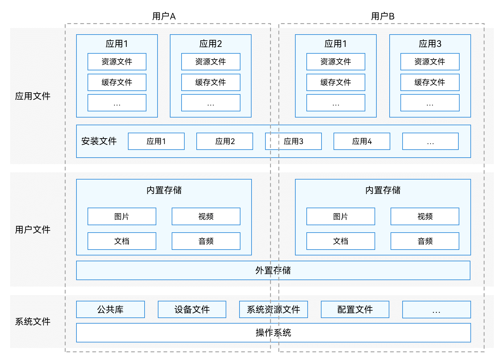
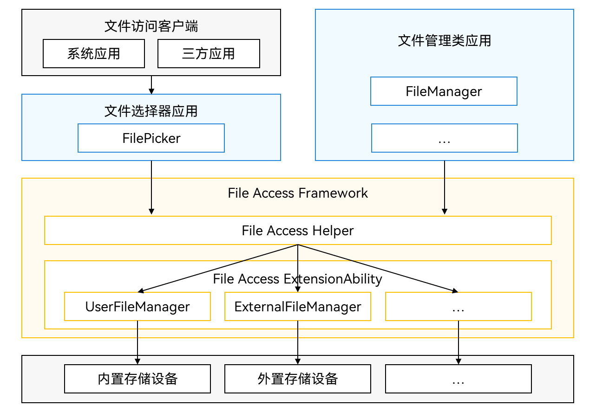

# Core File Kit简介

Core File Kit（文件基础服务）为开发者提供一套访问和管理应用文件和用户文件的能力。帮助用户更高效地管理、查找和备份各类文件，使用户能够轻松应对各种文件管理的需求。

## Core File Kit概述

在Core File Kit套件中，按文件所有者的不同，有如下文件分类模型，其示意图如下面文件分类模型示意图：

- [应用文件](app-file-overview.md)：文件所有者为应用，包括应用安装文件、应用资源文件、应用缓存文件等。

- [用户文件](user-file-overview.md)：文件所有者为登录到该终端设备的用户，包括用户私有的图片、视频、音频、文档等。

- 系统文件：与应用和用户无关的其它文件，包括公共库、设备文件、系统资源文件等。这类文件不需要开发者进行文件管理，本文不展开介绍。

按文件系统管理的文件存储位置（数据源位置）的不同，有如下文件系统分类模型：

- 本地文件系统：提供本地设备或外置存储设备（如U盘、移动硬盘）的文件访问能力。本地文件系统是最基本的文件系统，本文不展开介绍。

- [分布式文件系统](distributed-fs-overview.md)：提供跨设备的文件访问能力。所谓跨设备，指文件不一定存储在本地设备或外置存储设备，而是通过计算机网络与其它分布式设备相连。

**图1** 文件分类模型示意图

## Kit使用场景

Core File Kit常见的使用场景：

- 应用文件访问和文件分享。
- 应用数据备份恢复。
- 选择与保存用户文件。
- 跨设备的文件访问和分享能力。

## 能力范围

- 支持对应用文件进行查看、创建、读写、删除、移动、复制、获取属性等访问操作。
- 支持应用文件上传到网络服务器和网络服务器下载网络资源文件到本地应用文件目录。
- 支持获取当前应用的存储空间大小、指定文件系统的剩余空间大小和指定文件系统的总空间大小。
- 支持应用分享文件给其它应用和使用其它应用分享的文件。
- 支持应用接入数据备份恢复，在接入后，应用可通过修改配置文件定制备份恢复框架的行为，包括是否允许备份恢复、备份哪些数据。<!--Del-->
- 支持应用触发数据备份恢复（仅对系统应用开放）。
<!--DelEnd-->
- 提供[用户文件访问框架](#用户文件访问框架)，用于开发者访问和管理用户文件。例如选择与保存用户文件<!--Del-->和开发用户文件管理器（仅对系统应用开放）<!--DelEnd-->。
- 支持跨设备的文件访问和拷贝能力。

## 亮点/特征

- 沙箱隔离：
访问和管理应用文件，对于每个应用，系统会在内部存储空间映射出一个专属的“[应用沙箱目录](app-sandbox-directory.md#应用沙箱目录)”，它是“[应用文件目录](app-sandbox-directory.md#应用文件目录与应用文件路径)”与一部分系统文件（应用运行必需的少量系统文件）所在的目录组成的集合。有以下优点：
  - 隔离性：应用沙箱提供了一个完全隔离的环境，使用户可以安全地访问应用文件。
  - 安全性：应用沙箱限制了应用可见的数据的最小范围，保护了应用文件的安全。
- 应用分享：
应用之间可以通过分享URI（Uniform Resource Identifier）或文件描述符FD（File Descriptor）的方式，进行文件共享。有以下优点：
  - 便携性：应用之间进行文件分享，省去了用户在多个应用间切换的麻烦，简化了操作步骤，提高了效率。
  - 高效性：应用间的文件分享能够更快地完成文件的传输，减少了因多次跳转和等待而浪费的时间。
  - 数据一致性：应用间的文件分享能够确保数据的完整性和一致性，避免数据在传输过程中出现损坏或丢失的情况。
  - 安全性：应用间的文件分享可以确保文件的安全性，避免文件被非法获取或篡改。同时，通过文件授权访问的方式，可以进一步增强文件的安全性。

## 框架原理

### 应用文件访问框架

应用文件访问框架是通过基础文件操作接口（[ohos.file.fs](../reference/apis-core-file-kit/js-apis-file-fs.md)）实现。开发者无需了解内部实现，基础文件操作接口功能详情请参考[接口说明](app-file-access.md#接口说明)。

### 用户文件访问框架

用户文件访问框架（File Access Framework）是一套提供给开发者访问和管理用户文件的基础框架。该框架依托于OpenHarmony的ExtensionAbility组件机制，提供了一套统一访问用户文件的方法和接口。

**图2** 用户文件访问框架示意图  

- 各类系统应用或三方应用（即图中的文件访问客户端）若需访问用户文件，如选择一张照片或保存多个文档等，可以通过拉起“文件选择器应用”来实现。

- FilePicker：系统预置应用，提供文件访问客户端选择和保存文件的能力，且不需要配置任何权限。FilePicker的使用指导请参见[选择用户文件](select-user-file.md)。

- FileManager：对于设备开发者，还可以按需开发自己的文件选择器或文件管理器应用。<!--RP1-->其中，选择器功能是管理器的子集，本文目前提供了管理器的开发指导，请参见[开发用户文件管理器（仅对系统应用开放）](dev-user-file-manager.md)。<!--RP1End-->

- File Access Framework（用户文件访问框架）的主要功能模块如下：
  - File Access Helper：提供给文件管理器和文件选择器访问用户文件的API接口。
  - File Access ExtensionAbility：提供文件访问框架能力，由内卡文件管理服务UserFileManager和外卡文件管理服务ExternalFileManager组成，实现对应的文件访问功能。
    - UserFileManager：内卡文件管理服务，基于File Access ExtensionAbility框架实现，用于管理内置存储设备上的文件。
    - ExternalFileManager：外卡文件管理服务，基于File Access ExtensionAbility框架实现，用于管理外置存储设备上的文件。

## 与相关Kit的关系

Ability Kit: Core File Kit中用户文件访问框架依赖Ability Kit提供的Extension基础能力，受Ability Kit服务调度管理。

## 相关实例

针对Core File Kit开发，有以下相关实例可供参考：

- [文件管理（ArkTS）（Full SDK）（API10）](https://gitee.com/openharmony/applications_app_samples/tree/OpenHarmony-5.0.0-Release/code/BasicFeature/FileManagement/FileManager)
