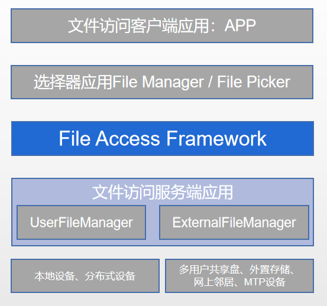

# 用户公共文件访问框架概述
在搭载 OpenHarmony3.2 (API 9) 及更高版本的设备上，应用可以基于FileAccessFramework(FAF) 对本地公共文件、分布式设备文件、外部存储设备文件、多用户共享文件进行访问。

出于对用户数据的隐私安全考虑，目前此框架仅支持用户通过**文件管理器**和**文件选择器**对文件访问服务端进行操作，包括创建、打开、删除、重命名、移动等。
应用卸载，不会影响到用户数据，实际用户数据仍保留在对应设备中。
其它系统应用如需要访问本地公共文件，请参考使用媒体库接口。

> **注意：**
> 1：如果应用是系统非管理类应用，比如：系统图库，请优先考虑直接使用媒体库接口，媒体库接口提供了一系列直接操作文件的接口。
> 2：FAF 接口与媒体库接口原则上不能混用。

## FileAccessFramework机制介绍
FAF 依托于 OpenHarmony 上[ExtensionAbility机制](https://gitee.com/openharmony/docs/blob/master/zh-cn/application-dev/application-models/extensionability-overview.md)，实现了一套对外提供能力的统一接口。应用可以通过这套接口预览和操作公共文件，从而实现自己的逻辑。有兴趣的开发者，可以预览我们的[源码仓](https://gitee.com/openharmony/filemanagement_user_file_service)，提出您宝贵的意见。

基于 FAF 进行文件操作的全流程，包含以下几个元素， 如图所示：

<left>

图片1：公共文件操作层次图

</left>

* **文件访问客户端应用** - 需要访问或操作公共文件的应用。通过拉起文件选择器，用户可以在可视化界面上进行文件操作。
* **文件选择器应用** - 可以让用户访问所有共享数据集的系统应用。通过使用 FAF 的对上接口，完成各种文件操作。
* **文件访问服务端应用** - 系统内支持将数据集进行共享的服务。目前有[UserFileManager](https://gitee.com/openharmony/multimedia_medialibrary_standard)、ExternalFileManager等。前者管理了本地磁盘、分布式设备的数据集，后者管理了SD卡、U盘等多种外置存储设备的数据集。开发者也可以基于 FAF 的服务端配置，共享自己的数据集。

FAF提供的主要功能：
* 可以让用户浏览系统内所有文件服务端应用提供的数据集，而不仅仅是单一应用的数据集。
* 客户端应用不需要获取 FAF 的使用权限，直接通过选择器应用操作文件。
* 支持访问多个临时挂载的设备，比如外置存储卡、分布式设备等。

## 数据模型
FAF 中数据模型主要通过URI、FileInfo、RootInfo 进行传递。详情参考[fileExtension](https://gitee.com/openharmony/docs/blob/master/zh-cn/application-dev/reference/apis/js-apis-fileExtensionInfo.md)。文件访问服务端应用可以通过 FileAccessExtensionAbility API，将自身的数据安全的共享出去。

<left>

图片2：公共文件访问框架数据流

</left>

请注意以下几点：
* 在 FAF 中，文件访问客户端和文件访问服务端并不直接交互。只需要具备拉起文件选择器应用的权限即可。
* 文件选择器应用会为用户提供标准的文档访问界面，即使底层的文件访问服务端相互之间差异很大，一致性也不受影响。