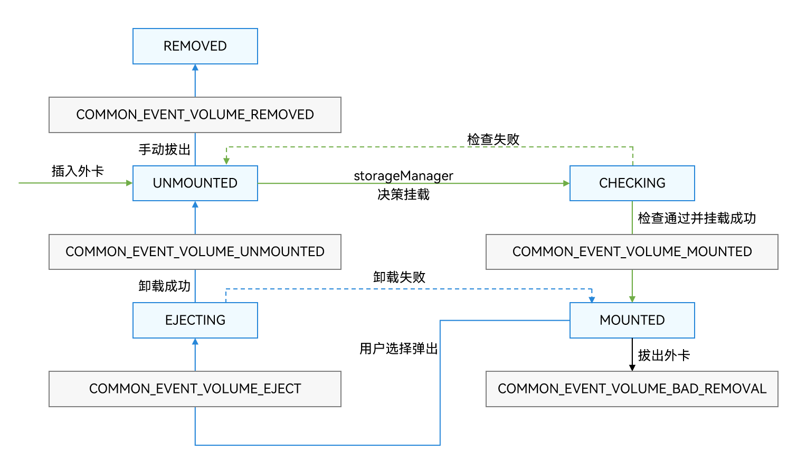

# 管理外置存储设备（仅对系统应用开放）
<!--Kit: Core File Kit-->
<!--Subsystem: FileManagement-->
<!--Owner: @wang_zhangjun; @zhuangzhuang-->
<!--Designer: @wang_zhangjun; @zhuangzhuang; @renguang1116-->
<!--Tester: @liuhonggang123; @yue-ye2; @juxiaopang-->
<!--Adviser: @foryourself-->

外置存储设备具备可插拔属性，因此系统提供了设备插拔事件的监听及挂载功能，用于管理外置存储设备。

外置存储设备的管理由StorageManager和StorageDaemon两个服务完成。StorageDaemon实现底层的的监听挂载等功能；StorageManager则对系统应用提供状态变更通知、查询和管理能力。

**图1** 外置存储设备管理示意图  



- 插入外卡时，StorageDaemon进程通过netlink监听获取到外卡插入事件，创建对应的磁盘设备以及卷设备。此时，已创建的卷设备状态为卸载状态（UNMOUNTED）。

- StorageDaemon进程在创建完卷设备后，会对卷设备进行检查，此时卷状态为检查状态（CHECKING）。
  - **检查成功**：对卷设备进行挂载，挂载成功后，卷状态更改为挂载状态（MOUNTED），并通知StorageManager发送COMMON_EVENT_VOLUME_MOUNTED广播。
  - **检查失败**：则返回卸载状态（UNMOUNTED）。

- 当卷设备处于挂载状态时：
  - **用户选择弹出**：卷状态设备更改为正在弹出状态（EJECTING），并发送COMMON_EVENT_VOLUME_EJECT广播。StorageDaemon进程将卷设备卸载成功后，卷状态更改为卸载状态（UNMOUNTED），并发送COMMON_EVENT_VOLUME_UNMOUNTED广播。
    <br>当卷设备处于卸载状态后，拔出卷设备会删除相关卷设备信息，并发送COMMON_EVENT_VOLUME_REMOVED广播。
  - **拔出外卡**：卷设备状态同样会经历正在弹出状态（EJECTING）和卸载状态（UNMOUNTED），并发送对应阶段的广播。在拔出后，删除相关卷设备信息，发送COMMON_EVENT_VOLUME_BAD_REMOVAL广播。

## 接口说明

外置存储设备管理相关API的详细介绍请参见[API参考](../reference/apis-core-file-kit/js-apis-file-volumemanager-sys.md)。

各类广播传递的相关参数，请见下表。

**表1** 广播传递的参数

| 广播类型 | 参数 | 
| -------- | -------- |
| usual.event.data.VOLUME_REMOVED | id：卷设备ID。<br/>diskId：卷设备所属磁盘设备ID。 | 
| usual.event.data.VOLUME_UNMOUNTED | id：卷设备ID。<br/>diskId：卷设备所属磁盘设备ID。<br/>volumeState：卷设备状态。 | 
| usual.event.data.VOLUME_MOUNTED | id：卷设备ID。<br/>diskId：卷设备所属磁盘设备ID。<br/>volumeState：卷设备状态。<br/>fsUuid：卷设备uuid。<br/>path：卷设备挂载路径。 | 
| usual.event.data.VOLUME_BAD_REMOVAL | id：卷设备ID。<br/>diskId：卷设备所属磁盘设备ID。 | 
| usual.event.data.VOLUME_EJECT | id：卷设备ID。<br/>diskId：卷设备所属磁盘设备ID。<br/>volumeState：卷设备状态。 | 

## 开发步骤

开发者通过订阅卷设备相关的广播事件来感知外置存储的插入，通过广播传递的信息获取卷设备信息后可以对卷设备进行查询以及管理操作。

1. 获取权限。  
  订阅卷设备广播事件需要申请ohos.permission.STORAGE_MANAGER权限，配置方式请参见[申请应用权限](../security/AccessToken/determine-application-mode.md#system_basic等级应用申请权限的方式)。

2. 订阅广播事件。  
  需订阅的事件如下：

   - 卷设备移除："usual.event.data.VOLUME_REMOVED"。
   - 卷设备卸载："usual.event.data.VOLUME_UNMOUNTED"。
   - 卷设备挂载："usual.event.data.VOLUME_MOUNTED"。
   - 卷设备异常移除："usual.event.data.VOLUME_BAD_REMOVAL"。
   - 卷设备正在弹出："usual.event.data.VOLUME_EJECT"。

   ```ts
   import { commonEventManager } from '@kit.BasicServicesKit';
   import { volumeManager } from '@kit.CoreFileKit';
   import { BusinessError } from '@kit.BasicServicesKit';

   let subscriber: commonEventManager.CommonEventSubscriber;
   async function example() {
     const subscribeInfo: commonEventManager.CommonEventSubscribeInfo = {
       events: [
         "usual.event.data.VOLUME_REMOVED",
         "usual.event.data.VOLUME_UNMOUNTED",
         "usual.event.data.VOLUME_MOUNTED",
         "usual.event.data.VOLUME_BAD_REMOVAL",
         "usual.event.data.VOLUME_EJECT"
       ]
     };
     subscriber = await commonEventManager.createSubscriber(subscribeInfo);
   }
   ```

3. 收到广播通知后获取卷设备信息。

   ```ts
   let subscriber: commonEventManager.CommonEventSubscriber|undefined;
   //注意： 参数subscriber 是从步骤2订阅广播事件 中 await commonEventManager.createSubscriber(subscribeInfo) 获取到的。
   if (subscriber !== undefined) {
    commonEventManager.subscribe(subscriber, (err: BusinessError, data: commonEventManager.CommonEventData) => {
      if (data.event === 'usual.event.data.VOLUME_MOUNTED' && data.parameters !== undefined) {
        // 开发者可以通过广播传递的卷设备信息来管理卷设备
        let volId: string = data.parameters.id;
        volumeManager.getVolumeById(volId, (error: BusinessError, vol: volumeManager.Volume) => {
          if (error) {
            console.error(`volumeManager getVolumeById failed, Error code: ${error.code}, message: ${error.message}`);
          } else {
            console.info('volumeManager getVolumeById successfully, the volume state is ' + vol.state);
          }
        })
      }
    })
   }
   ```
