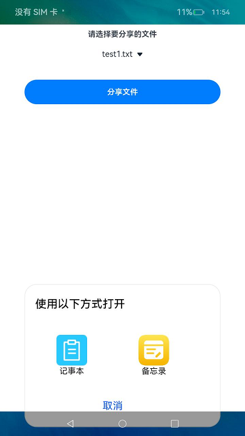

# 应用文件分享

应用文件分享是应用之间通过分享URI（Uniform Resource Identifier）或文件描述符FD（File Descriptor）的方式，进行文件共享的过程。

- 基于URI分享方式，应用可分享单个文件，通过[ohos.app.ability.wantConstant的wantConstant.Flags接口](../reference/apis-ability-kit/js-apis-app-ability-wantConstant.md#flags)以只读或读写权限授权给其他应用。应用可通过[ohos.file.fs的fs.open](../reference/apis-core-file-kit/js-apis-file-fs.md#fsopen)打开URI，并进行读写操作。当前仅支持临时授权，分享给其他应用的文件在被分享应用退出时权限被收回。

- 基于FD分享方式，应用可分享单个文件，通过ohos.file.fs的open接口以指定权限授权给其他应用。应用从want中解析拿到FD后可通过[ohos.file.fs](../reference/apis-core-file-kit/js-apis-file-fs.md)的读写接口对文件进行读写。
由于FD分享的文件关闭FD后，无法再打开分享文件，因此不推荐使用，本文重点介绍基于URI[分享文件给其他应用](#分享文件给其他应用)或[使用其他应用分享的文件](#使用其他应用分享的文件)。

## 应用可分享目录

| 沙箱路径                             | 物理路径                                                                             | 说明 &emsp;&emsp;&emsp;&emsp;&emsp;&emsp;&emsp;&emsp;&emsp;&emsp;&emsp;&emsp; |
| -------                              | -------                                                                             | ---- |
| /data/storage/el1/base               | /data/app/el1/\<currentUserId\>/base/\<PackageName\>                                | 应用el1级别加密数据目录 |
| /data/storage/el2/base               | /data/app/el2/\<currentUserId\>/base/\<PackageName\>                                | 应用el2级别加密数据目录 |
| /data/storage/el2/distributedfiles   | /mnt/hmdfs/\<currentUserId\>/account/device_view/\<networkId\>/data/\<PackageName\> | 应用el2加密级别有账号分布式数据融合目录 |

## 文件URI规范

文件URI的格式为：

  格式为file://&lt;bundleName&gt;/&lt;path&gt;

- file：文件URI的标志。

- bundleName：该文件资源的属主。

- path：文件资源在应用沙箱中的路径。

## 分享文件给其他应用

在分享文件给其他应用前，开发者需要先[获取应用文件路径](../application-models/application-context-stage.md#获取应用文件路径)。

1. 获取文件在应用沙箱中的路径，并转换为文件URI。

   ```ts
   import { UIAbility } from '@kit.AbilityKit';
   import { fileUri } from '@kit.CoreFileKit';
   import { window } from '@kit.ArkUI';
   
   export default class EntryAbility extends UIAbility {
     onWindowStageCreate(windowStage: window.WindowStage) {
       // 获取文件的沙箱路径
       let pathInSandbox = this.context.filesDir + "/test1.txt";
       // 将沙箱路径转换为uri
       let uri = fileUri.getUriFromPath(pathInSandbox);
       // 获取的uri为"file://com.example.demo/data/storage/el2/base/files/test1.txt"
     }
   }
   ```

2. 设置获取文件的权限以及选择要分享的应用。
   分享文件给其他应用需要使用[startAbility](../reference/apis-ability-kit/js-apis-inner-application-uiAbilityContext.md#uiabilitycontextstartability)接口，将获取到的URI填充在want的参数URI中，标注URI的文件类型，type字段可参考[want属性](../reference/apis-ability-kit/js-apis-app-ability-want.md#属性)，并通过设置want的flag来设置对应的读写权限，action字段配置为"ohos.want.action.sendData"表示进行应用文件分享，开发示例如下。

   > **说明：**
   >
   > 写权限分享时，同时授予读权限。

   ```ts
   import { fileUri } from '@kit.CoreFileKit';
   import { window } from '@kit.ArkUI';
   import { wantConstant } from '@kit.AbilityKit';
   import { UIAbility } from '@kit.AbilityKit';
   import { Want } from '@kit.AbilityKit';
   import { BusinessError } from '@kit.BasicServicesKit';
   
   export default class EntryAbility extends UIAbility {
     onWindowStageCreate(windowStage: window.WindowStage) {
       // 获取文件沙箱路径
       let filePath = this.context.filesDir + '/test1.txt';
       // 将沙箱路径转换为uri
       let uri = fileUri.getUriFromPath(filePath);
       let want: Want  = {
         // 配置被分享文件的读写权限，例如对被分享应用进行读写授权
         flags: wantConstant.Flags.FLAG_AUTH_WRITE_URI_PERMISSION | wantConstant.Flags.FLAG_AUTH_READ_URI_PERMISSION,
         // 配置分享应用的隐式拉起规则
         action: 'ohos.want.action.sendData',
         uri: uri,
         type: 'text/plain'
       }
       this.context.startAbility(want)
         .then(() => {
           console.info('Invoke getCurrentBundleStats succeeded.');
         })
         .catch((err: BusinessError) => {
           console.error(`Invoke startAbility failed, code is ${err.code}, message is ${err.message}`);
         });
     }
     // ...
   }
   ```
**图1** 效果示意图：<br/>


## 使用其他应用分享的文件

被分享应用需要在[module.json5配置文件](../quick-start/module-configuration-file.md)的actions标签的值配置为"ohos.want.action.sendData"，表示接收应用分享文件，配置uris字段，表示接收URI的类型，即只接收其他应用分享该类型的URI，如下表示本应用只接收scheme为file，类型为txt的文件，示例如下。
  
```json
{
  "module": {
    ...
    "abilities": [
      {
        ...
        "skills": [
          {
            ...
            "actions": [
              "ohos.want.action.sendData"
            ],
            "uris": [
              {
                "scheme": "file",
                "type": "text/plain"
              }
           ]
          }
        ]
      }
    ]
  }
}
```

被分享方的UIAbility被启动后，可以在其[onCreate()](../reference/apis-ability-kit/js-apis-app-ability-uiAbility.md#uiabilityoncreate)或者[onNewWant](../reference/apis-ability-kit/js-apis-app-ability-uiAbility.md#uiabilityonnewwant)回调中获取传入的want参数信息。

通过接口want的参数获取分享文件的URI，获取文件URI后通过fs.open接口打开文件，获取对应的file对象后，可对文件进行读写操作。

```ts
// xxx.ets
import { fileIo as fs } from '@kit.CoreFileKit';
import { Want } from '@kit.AbilityKit';
import { BusinessError } from '@kit.BasicServicesKit';

function getShareFile() {
  try {
    let want: Want = {}; // 此处实际使用时应该修改为获取到的分享方传递过来的want信息

    // 从want信息中获取uri字段
    let uri = want.uri;
    if (uri == null || uri == undefined) {
      console.info('uri is invalid');
      return;
    }
    try {
      // 根据需要对被分享文件的URI进行相应操作。例如读写的方式打开URI获取file对象
      let file = fs.openSync(uri, fs.OpenMode.READ_WRITE);
      console.info('open file successfully!');
    } catch (err) {
      let error: BusinessError = err as BusinessError;
      console.error(`Invoke openSync failed, code is ${error.code}, message is ${error.message}`);
    }
  } catch (error) {
    let err: BusinessError = error as BusinessError;
    console.error(`Invoke openSync failed, code is ${err.code}, message is ${err.message}`);
  }
}
```

## 相关实例

针对应用文件分享，有以下相关实例可供参考：

- [文件分享与访问（ArkTS）（API9）](https://gitee.com/openharmony/applications_app_samples/tree/OpenHarmony-5.0.1-Release/code/BasicFeature/FileManagement/FileShare/SandboxShare)