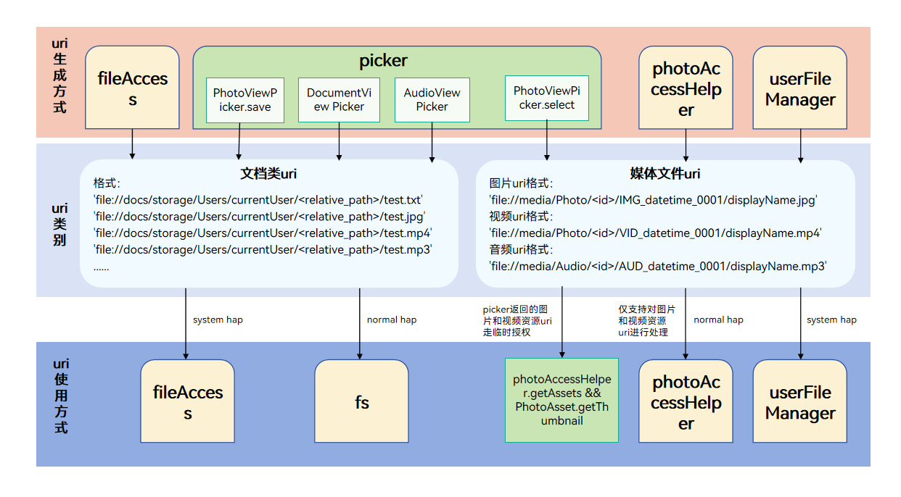

# 用户文件uri介绍

用户文件uri是文件的唯一标识，在对用户文件进行访问与修改等操作时往往都会使用到uri，不建议开发者解析uri中的片段用于业务代码开发，不同类型的uri使用方式将在下文详细介绍。

## uri的类型

uri类型可以归纳为文档类uri和媒体文件uri两类

- 文档类uri：由picker拉起文件管理器选择或保存返回，以及通过fileAccess模块获取。具体获取方式参见[文档类uri获取方式](#文档类uri获取方式)。
- 媒体文件uri：由picker通过拉起图库选择图片或者视频返回，通过photoAccessHelper模块获取图片或者视频文件的uri，以及通过userFileManager模块获取图片、视频或者音频文件的uri。具体获取方式参见[媒体文件uri获取方式](#媒体文件uri获取方式)。



## 文档类uri

### 文档类uri介绍

**文档类uri的格式类型为：**

'file://docs/storage/Users/currentUser/\<relative_path\>/test.txt'

**其中各个字段表示的含义为：**

| uri字段          | 说明        |
| ------------- | ------------------- |
| 'file://docs/storage/Users/currentUser/' | 文件管理器的根目录。|
| '\<relative_path\>/' | 文件在根目录下的相对路径。例如：'Download/'和'Documents/'。|
| 'test.txt' | 用户文件系统中存储的文件名，支持的文件类型为文件管理器支持的所有类型，以文件管理器为准。例如txt、jpg、mp4和mp3等格式的文件。|

### 文档类uri获取方式

1. 通过[DocumentViewPicker接口](../reference/apis-core-file-kit/js-apis-file-picker.md#documentviewpicker)选择或保存文件，返回选择或保存的文件uri。

2. 通过[AudioViewPicker接口](../reference/apis-core-file-kit/js-apis-file-picker.md#audioviewpicker)选择或保存文件，返回选择或保存的文件uri。<!--Del-->

3. 通过[fileAccess模块](../reference/apis-core-file-kit/js-apis-fileAccess-sys.md)获取文档类目录下的文件得到对应文件的[FileInfo](../reference/apis-core-file-kit/js-apis-fileAccess-sys.md#fileinfo)对象，此对象中就包含对应文件或者目录的uri属性，此模块中的接口为系统接口，使用此模块需要注意应用是否为系统应用。支持获取文件uri的目录有：
   - 外部存储目录
   - Docs目录
   - Download目录
   - Desktop目录
   - Documents目录
   - Share共享盘目录
<!--DelEnd-->

### 文档类uri的使用方式

normal等级的应用使用此类uri的方式只能通过[fs模块](../reference/apis-core-file-kit/js-apis-file-fs.md)进行进一步处理，其他模块使用此uri是会报没有权限的错误。示例代码参见picker中的[选择文档类文件](./select-user-file.md#选择文档类文件)和[保存文档类文件](./save-user-file.md#保存文档类文件)。<!--Del-->

system_basic等级及以上的应用使用此类uri的方式除了上述通过fs模块外还可以通过[fileAccess模块](../reference/apis-core-file-kit/js-apis-fileAccess-sys.md)进行进一步处理，使用此模块需要在配置文件module.json5中声明ohos.permission.FILE_ACCESS_MANAGER 和 ohos.permission.GET_BUNDLE_INFO_PRIVILEGED 权限，此权限为system_basic权限，仅供系统应用使用。其他模块使用此uri会报没有权限的错误。下面示例为使用fileAccess模块创建文件得到uri后对其进行重命名操作：

1. 通过[fileAccess模块](../reference/apis-core-file-kit/js-apis-fileAccess-sys.md)获取文件uri。
2. 使用获取到的文件uri进行重命名操作。

```ts
import { BusinessError } from '@kit.BasicServicesKit';
import { Want } from '@kit.AbilityKit';
import { common } from '@kit.AbilityKit';
import { fileAccess } from '@kit.CoreFileKit';
// context 是EntryAbility 传过来的context
let context = getContext(this) as common.UIAbilityContext;

async function example() {
    let fileAccessHelper: fileAccess.FileAccessHelper;
    // wantInfos 从getFileAccessAbilityInfo()获取
    let wantInfos: Array<Want> = [
      {
        bundleName: "com.ohos.UserFile.ExternalFileManager",
        abilityName: "FileExtensionAbility",
      },
    ]
    try {
      fileAccessHelper = fileAccess.createFileAccessHelper(context, wantInfos);
      if (!fileAccessHelper) {
        console.error("createFileAccessHelper interface returns an undefined object");
      }
      // 以内置存储目录为例
      // 示例代码sourceUri表示Download目录，该uri是对应的fileInfo中uri
      // 开发者应根据自己实际获取的uri进行开发
      let sourceUri: string = "file://docs/storage/Users/currentUser/Download";
      let displayName: string = "file1.txt";
      let fileUri: string;
      try {
        // 创建文件返回该文件的uri
        fileUri = await fileAccessHelper.createFile(sourceUri, displayName);
        if (!fileUri) {
          console.error("createFile return undefined object");
        }
        console.log("createFile success, fileUri: " + JSON.stringify(fileUri));
        // 将刚创建的文件进行重命名，返回新文件的uri
        let renameUri = await fileAccessHelper.rename(fileUri, "renameFile.txt");
        console.log("rename success, renameUri: " + JSON.stringify(renameUri));
      } catch (err) {
        let error: BusinessError = err as BusinessError;
        console.error("createFile failed, errCode:" + error.code + ", errMessage:" + error.message);
      }
    } catch (err) {
      let error: BusinessError = err as BusinessError;
      console.error("createFileAccessHelper failed, errCode:" + error.code + ", errMessage:" + error.message);
    }
  }
```
<!--DelEnd-->

## 媒体文件uri

### 媒体文件uri介绍

**媒体文件uri的格式类型为：**

图片uri格式：

- 'file://media/Photo/\<id\>/IMG_datetime_0001/displayName.jpg'

视频uri格式：

- 'file://media/Photo/\<id>/VID_datetime_0001/displayName.mp4'

音频uri格式：

- 'file://media/Audio/\<id>/AUD_datetime_0001/displayName.mp3'

**其中各个字段表示的含义为：**

| uri字段          | 说明        |
| ------------- | ------------------- |
| 'file://media' | 表示这个uri是媒体文件。 |
| 'Photo' | Photo表示这个uri是媒体文件中的图片或者视频类文件。 |
| 'Audio' | 表示这个uri是媒体文件中的音频类文件。 |
| '\<id>' | 表示在数据库中多个表中处理后的值，并不是指表中的file_id列，注意请不要使用此id去数据库中查询具体文件。 |
| 'IMG_datetime_0001' | 表示图片文件在用户文件系统中存储的文件名去掉后缀剩下的部分。 |
| 'VID_datetime_0001' | 表示视频文件在用户文件系统中存储的文件名去掉后缀剩下的部分。 |
| 'AUD_datetime_0001' | 表示音频文件在用户文件系统中存储的文件名去掉后缀剩下的部分。 |
|<!--DelRow--> 'displayName.jpg' | 表示图片文件对外展示的displayName，使用[userFileManager.commitModify](../reference/apis-core-file-kit/js-apis-userFileManager-sys.md#commitmodify)接口重命名修改的就是这个值，需要注意这个值修改后uri也会发生改变。 |
|<!--DelRow--> 'displayName.mp4' | 表示视频文件对外展示的displayName，使用[userFileManager.commitModify](../reference/apis-core-file-kit/js-apis-userFileManager-sys.md#commitmodify)接口重命名修改的就是这个值，需要注意这个值修改后uri也会发生改变。 |
|<!--DelRow--> 'displayName.mp3' | 表示音频文件对外展示的displayName，使用[userFileManager.commitModify](../reference/apis-core-file-kit/js-apis-userFileManager-sys.md#commitmodify)接口重命名修改的就是这个值，需要注意这个值修改后uri也会发生改变。 |

### 媒体文件uri获取方式

1. 通过[PhotoAccessHelper的PhotoViewPicker](../media/medialibrary/photoAccessHelper-photoviewpicker.md)选择媒体文件，返回选择的媒体文件文件的uri。

2. 通过[photoAccessHelper模块](../reference/apis-media-library-kit/js-apis-photoAccessHelper.md)中的[getAssets](../reference/apis-media-library-kit/js-apis-photoAccessHelper.md#getassets)或[createAsset](../reference/apis-media-library-kit/js-apis-photoAccessHelper.md#createasset)接口获取媒体文件对应文件的uri。<!--Del-->

3. 通过[userFileManager模块](../reference/apis-core-file-kit/js-apis-userFileManager-sys.md)中的[getPhotoAssets](../reference/apis-core-file-kit/js-apis-userFileManager-sys.md#getphotoassets)、[getAudioAssets](../reference/apis-core-file-kit/js-apis-userFileManager-sys.md#getaudioassets)、[createAudioAsset](../reference/apis-core-file-kit/js-apis-userFileManager-sys.md#createaudioasset10)或[createPhotoAsset](../reference/apis-core-file-kit/js-apis-userFileManager-sys.md#createphotoasset)接口获取媒体文件对应文件的uri。
<!--DelEnd-->

### 媒体文件uri的使用方式

normal等级的应用使用此类uri可以通过[photoAccessHelper模块](../reference/apis-media-library-kit/js-apis-photoAccessHelper.md)进行进一步处理。示例代码参见媒体资源使用指导中的[指定URI获取图片或视频资源](../media/medialibrary/photoAccessHelper-photoviewpicker.md#指定uri获取图片或视频资源)。此接口需要申请相册管理模块读权限'ohos.permission.READ_IMAGEVIDEO'，在使用中需要注意应用是否有此权限。<!--Del-->

system_basic等级及以上的应用使用此类uri的方式除了上述通过photoAccessHelper模块外还可以通过[userFileManager模块](../reference/apis-core-file-kit/js-apis-userFileManager-sys.md)进行进一步处理，接口详细使用方式见接口文档。
<!--DelEnd-->

若normal等级的应用不想申请权限也可以通过临时授权的方式使用[PhotoAccessHelper的PhotoViewPicker](../media/medialibrary/photoAccessHelper-photoviewpicker.md)得到的uri使用[photoAccessHelper.getAssets接口](../reference/apis-media-library-kit/js-apis-photoAccessHelper.md#getassets)获取对应uri的PhotoAsset对象。这种方式获取的对象可以调用[getThumbnail](../reference/apis-media-library-kit/js-apis-photoAccessHelper.md#getthumbnail)获取缩略图和使用[get接口](../reference/apis-media-library-kit/js-apis-photoAccessHelper.md#get)读取[PhotoKeys](../reference/apis-media-library-kit/js-apis-photoAccessHelper.md#photokeys)中的部分信息。

以下为PhotoKeys中支持临时授权方式可以读取的信息：

| 名称          | 值              | 说明                                                       |
| ------------- | ------------------- | ---------------------------------------------------------- |
| URI           | 'uri'                 | 文件uri。                                                   |
| PHOTO_TYPE    | 'media_type'           | 媒体文件类型。                                              |
| DISPLAY_NAME  | 'display_name'        | 显示名字。                                                   |
| SIZE          | 'size'                | 文件大小。                                                   |
| DATE_ADDED    | 'date_added'          | 添加日期（添加文件时间距1970年1月1日的秒数值）。             |
| DATE_MODIFIED | 'date_modified'       | 修改日期（修改文件时间距1970年1月1日的秒数值，修改文件名不会改变此值，当文件内容发生修改时才会更新）。 |
| DURATION      | 'duration'            | 持续时间（单位：毫秒）。                                    |
| WIDTH         | 'width'               | 图片宽度（单位：像素）。                                    |
| HEIGHT        | 'height'              | 图片高度（单位：像素）。                                      |
| DATE_TAKEN    | 'date_taken'          | 拍摄日期（文件拍照时间距1970年1月1日的秒数值）。                |
| ORIENTATION   | 'orientation'         | 图片文件的方向。                                             |
| TITLE         | 'title'               | 文件标题。                                                   |

下面为通过临时授权方式使用媒体文件uri进行获取缩略图和读取文件部分信息的示例代码：

```ts
import { photoAccessHelper } from '@kit.MediaLibraryKit';
import { BusinessError } from '@kit.BasicServicesKit';
import { dataSharePredicates } from '@kit.ArkData';

// 定义一个uri数组，用于接收PhotoViewPicker选择图片返回的uri
let uris: Array<string> = [];
const context = getContext(this);

// 调用PhotoViewPicker.select选择图片
async function photoPickerGetUri() {
  try {  
    let PhotoSelectOptions = new photoAccessHelper.PhotoSelectOptions();
    PhotoSelectOptions.MIMEType = photoAccessHelper.PhotoViewMIMETypes.IMAGE_TYPE;
    PhotoSelectOptions.maxSelectNumber = 1;
    let photoPicker = new photoAccessHelper.PhotoViewPicker();
    photoPicker.select(PhotoSelectOptions).then((PhotoSelectResult: photoAccessHelper.PhotoSelectResult) => {
      console.info('PhotoViewPicker.select successfully, PhotoSelectResult uri: ' + JSON.stringify(PhotoSelectResult));
      uris = PhotoSelectResult.photoUris;
    }).catch((err: BusinessError) => {
      console.error('PhotoViewPicker.select failed with err: ' + JSON.stringify(err));
    });
  } catch (error) {
    let err: BusinessError = error as BusinessError;
    console.error('PhotoViewPicker failed with err: ' + JSON.stringify(err));
  }
}

async function uriGetAssets() {
try {
    let phAccessHelper = photoAccessHelper.getPhotoAccessHelper(context);
    let predicates: dataSharePredicates.DataSharePredicates = new dataSharePredicates.DataSharePredicates();
    // 配置查询条件，使用PhotoViewPicker选择图片返回的uri进行查询
    predicates.equalTo('uri', uris[0]);
    let fetchOption: photoAccessHelper.FetchOptions = {
      fetchColumns: [photoAccessHelper.PhotoKeys.WIDTH, photoAccessHelper.PhotoKeys.HEIGHT, photoAccessHelper.PhotoKeys.TITLE, photoAccessHelper.PhotoKeys.DURATION],
      predicates: predicates
    };
    let fetchResult: photoAccessHelper.FetchResult<photoAccessHelper.PhotoAsset> = await phAccessHelper.getAssets(fetchOption);
    // 得到uri对应的PhotoAsset对象，读取文件的部分信息
    const asset: photoAccessHelper.PhotoAsset = await fetchResult.getFirstObject();
    console.info('asset displayName: ', asset.displayName);
    console.info('asset uri: ', asset.uri);
    console.info('asset photoType: ', asset.photoType);
    console.info('asset width: ', asset.get(photoAccessHelper.PhotoKeys.WIDTH));
    console.info('asset height: ', asset.get(photoAccessHelper.PhotoKeys.HEIGHT));
    console.info('asset title: ' + asset.get(photoAccessHelper.PhotoKeys.TITLE));
    // 获取缩略图
    asset.getThumbnail((err, pixelMap) => {
      if (err == undefined) {
        console.info('getThumbnail successful ' + JSON.stringify(pixelMap));
      } else {
        console.error('getThumbnail fail', err);
      }
    });
  } catch (error){
    console.error('uriGetAssets failed with err: ' + JSON.stringify(error));
  }
}
```
<!--Del-->
## 通过uri复制文件（仅对系统应用开放）

用户复制文件到指定目录

1. 通过[createFileAccessHelper](../reference/apis-core-file-kit/js-apis-fileAccess-sys.md#fileaccesscreatefileaccesshelper)创建fileAccessHelper helper。

2. 获取源文件的srcUri。

3. 获取目的路径的destUri。

4. 获取备用名 fileName。

5. 使用helper.[copyFile](../reference/apis-core-file-kit/js-apis-fileAccess-sys.md#copyfile11)(srcUri, destUri, fileName) 进行文件操作。

复制文件代码示例：

```
import { BusinessError } from '@kit.BasicServicesKit';
import { Want } from '@kit.AbilityKit';
import { common } from '@kit.AbilityKit';
import { fileAccess } from '@kit.CoreFileKit';

// context 是EntryAbility 传过来的context
let context = getContext(this) as common.UIAbilityContext;
async function example() {
    let fileAccessHelper: fileAccess.FileAccessHelper;
    // wantInfos 从getFileAccessAbilityInfo()获取
    let wantInfos: Array<Want> = [
      {
        bundleName: "com.ohos.UserFile.ExternalFileManager",
        abilityName: "FileExtensionAbility",
      },
    ]
    try {
      fileAccessHelper = fileAccess.createFileAccessHelper(context, wantInfos);
      if (!fileAccessHelper) {
        console.error("createFileAccessHelper interface returns an undefined object");
      }
      // 以内置存储目录为例
      // 示例代码sourceUri表示Download目录，该uri是对应的fileInfo中uri
      // 开发者应根据自己实际获取的uri进行开发
      let sourceUri: string = "file://docs/storage/Users/currentUser/Download/one.txt";
      // 将文件复制到的位置uri
      let destUri: string = "file://docs/storage/Users/currentUser/Documents";
      // 如果文件名冲突，要使用的文件名
      let displayName: string = "file1.txt";
      // 存放返回的uri
      let fileUri: string;
      try {
        // 复制文件返回该文件的uri
        fileUri = await fileAccessHelper.copyFile(sourceUri, destUri, displayName);
        if (!fileUri) {
          console.error("copyFile return undefined object");
        }
        console.log("copyFile success, fileUri: " + JSON.stringify(fileUri));
      } catch (err) {
        let error: BusinessError = err as BusinessError;
        console.error("copyFile failed, errCode:" + error.code + ", errMessage:" + error.message);
      }
    } catch (err) {
      let error: BusinessError = err as BusinessError;
      console.error("createFileAccessHelper failed, errCode:" + error.code + ", errMessage:" + error.message);
    }
  }
```
<!--DelEnd-->