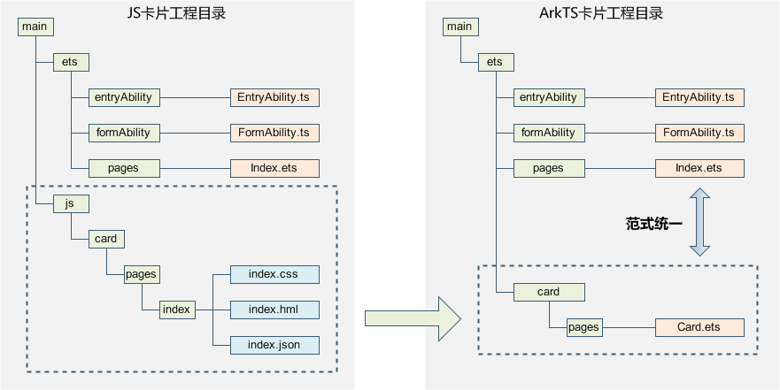
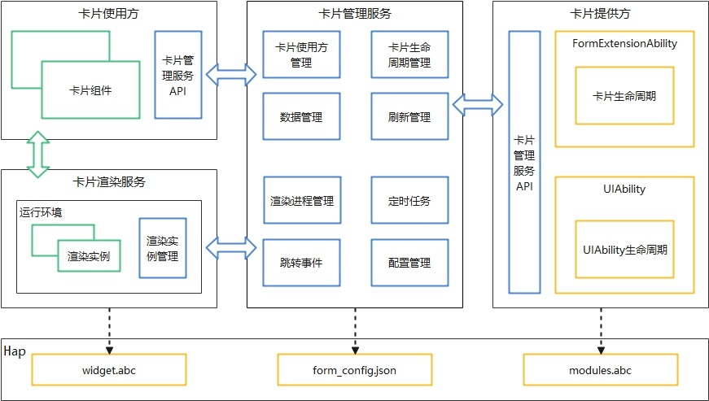
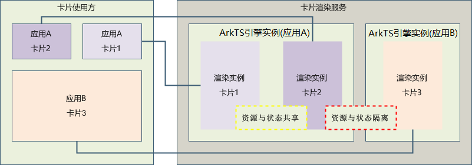

# ArkTS卡片概述
<!--Kit: Form Kit-->
<!--Subsystem: Ability-->
<!--Owner: @cx983299475-->
<!--SE: @xueyulong-->
<!--TSE: @chenmingze-->
以下内容介绍基于声明式范式ArkTS UI卡片开发。

## 亮点/特征
1. 统一开发范式

    - ArkTS卡片统一了卡片和应用页面的开发范式，应用页面的布局可以直接复用到卡片布局中，提升开发体验和开发效率。具体请参考图1 卡片工程结构对比。

    **图1** 卡片工程结构对比   
    

2. 卡片能力增强

    - 新增了动效的能力：ArkTS卡片开放了[属性动画](../reference/apis-arkui/arkui-ts/ts-animatorproperty.md)和[显式动画](../reference/apis-arkui/arkui-ts/ts-explicit-animation.md)的能力，使卡片的交互更加友好。
    - 新增了自定义绘制的能力：ArkTS卡片开放了[Canvas](../reference/apis-arkui/arkui-ts/ts-components-canvas-canvas.md)画布组件的能力，卡片可以使用自定义绘制的能力构建更多样的显示和交互效果。
    - 允许卡片中运行逻辑代码：开放逻辑代码运行后很多业务逻辑可以在卡片内部自闭环，拓宽了卡片的业务适用场景。

## 实现原理

- 卡片使用方：显示卡片内容的宿主应用，控制卡片在宿主中展示的位置，当前仅系统应用可以作为卡片使用方。

- 卡片提供方：提供卡片显示内容的应用，控制卡片的显示内容、控件布局以及控件点击事件。

- 卡片管理服务：用于管理系统中所添加卡片的常驻代理服务，提供[formProvider](../reference/apis-form-kit/js-apis-app-form-formProvider.md)<!--Del-->和[formHost](../reference/apis-form-kit/js-apis-app-form-formHost-sys.md)<!--DelEnd-->的接口能力，同时提供卡片对象的管理与使用以及卡片周期性刷新等能力。

- 卡片渲染服务：用于管理卡片渲染实例，渲染实例与卡片使用方的<!--Del-->[<!--DelEnd-->卡片组件<!--Del-->](../reference/apis-arkui/arkui-ts/ts-basic-components-formcomponent-sys.md)<!--DelEnd-->一一绑定。卡片渲染服务根据form_config.json配置的卡片信息运行widget.abc文件的卡片页面代码进行渲染，并将渲染后的数据发送至卡片使用方对应的<!--Del-->[<!--DelEnd-->卡片组件<!--Del-->](../reference/apis-arkui/arkui-ts/ts-basic-components-formcomponent-sys.md)<!--DelEnd-->。

**图2** ArkTS卡片实现原理  

**图3** ArkTS卡片渲染服务运行原理  

与JS卡片相比，ArkTS卡片支持在卡片中运行逻辑代码，为确保ArkTS卡片发生问题后不影响卡片使用方应用的使用，ArkTS卡片新增了卡片渲染服务用于运行卡片页面代码widget.abc，卡片渲染服务由卡片管理服务管理。卡片使用方的每个卡片组件都对应了卡片渲染服务里的一个渲染实例，同一卡片提供方的渲染实例运行在同一个ArkTS虚拟机运行环境中，不同卡片提供方的渲染实例运行在不同的ArkTS虚拟机运行环境中，通过ArkTS虚拟机运行环境隔离不同卡片提供方卡片之间的资源与状态。开发过程中需要注意的是globalThis对象的使用，相同卡片提供方的卡片globalThis对象是同一个，不同卡片提供方的卡片globalThis对象是不同的。

## ArkTS卡片类型
ArkTS卡片分为动态卡片、静态卡片和互动卡片三种类型。

与动态卡片相比，静态卡片整体的运行框架和渲染流程和动态卡片是一致的。主要区别在于，卡片渲染服务将卡片内容渲染完毕后，卡片使用方会使用最后一帧渲染的数据作为静态图片显示，其次卡片渲染服务中的卡片实例会释放该卡片的所有运行资源以节省内存。因此频繁的刷新会导致静态卡片运行时资源不断的创建和销毁，增加卡片功耗。 

| 卡片类型 | 支持的能力 | 适用场景 | 优缺点 |
| ------- | ------ | ------- | ------- | 
| 静态卡片 | 仅支持UI组件和布局能力。| 主要用于展示静态信息（UI相对固定），仅可以通过FormLink组件跳转到指定的UIAbility。| 功能简单但可以有效控制内存开销。|
| 动态卡片 | 除了支持UI组件和布局能力，还支持通用事件能力和自定义动效能力。 | 用于有复杂业务逻辑和交互的场景。例如：卡片页面图片的刷新、卡片内容的刷新等。| 功能丰富但内存开销较大。|
| 互动卡片 | 在动态卡片基础上，额外支持破框动效能力。 | 用于有复杂业务逻辑和交互，需要执行破框动效呈现更好视觉体验的场景。例如：桌面卡片游戏等。| 功能丰富但内存开销较大。|

### 动态卡片
ArkTS卡片中提供了[postCardAction](../reference/apis-arkui/js-apis-postCardAction.md#postcardaction-1)接口用于动态卡片内部和提供方应用间的交互，当前支持router、message和call三种类型的事件，仅在卡片控件的点击事件中可以调用。

**图4** 动态卡片事件实现原理  

动态卡片事件的主要使用场景如下：
- router事件：可以使用router事件跳转到指定UIAbility，以完成点击卡片跳转应用内页面的交互功能。对于非系统应用仅支持跳转到自己应用内的UIAbility。
- call事件：可以使用call事件拉起指定UIAbility到后台，再通过UIAbility申请对应后台长时任务完成音乐播放等功能。
- message事件：可以使用message拉起FormExtensionAbility，通过onFormEvent接口回调通知，以完成卡片内控件点击消息传递，从而更新卡片内容。

### 静态卡片
ArkTS卡片提供FormLink静态卡片交互组件，用于静态卡片内部和提供方应用间的交互，当前支持router、message和call三种类型的事件。
请参见[FormLink](../reference/apis-arkui/arkui-ts/ts-container-formlink.md)。

### 互动卡片
互动卡片提供破框动效能力，可动态展示静态信息或图片，并实现人机交互，提升信息提醒、浅层交互和可玩性。具体请参考[互动卡片概述](arkts-ui-liveform-overview.md)。

## 约束与限制
ArkTS卡片支持在UI内运行逻辑代码，相较于JS卡片具备了更加丰富的能力，但也增加了使用卡片进行恶意行为的风险。因为承载ArkTS卡片UI部分的widget.abc代码运行在系统公共的FRS进程内，并最终显示在卡片使用方应用中（一般为桌面应用），为确保系统渲染进程的稳定性、各卡片之间的隔离安全性，以及内存功耗等资源考虑，对ArkTS卡片UI可使用的能力做了以下约束：

- 当前仅支持基于ArkUI开发卡片，不支持跨平台开发。

- 当导入模块时，仅支持导入标识“支持在ArkTS卡片中使用”的模块。若使用了不支持使用的API，卡片加载显示异常。

- 支持导入[HAR](../quick-start/har-package.md)静态共享包，不支持导入[HSP](../quick-start/in-app-hsp.md)动态共享包。

- 不支持使用native语言开发，不支持加载native so。

- 针对卡片UI页面开发，ArkTS卡片仅支持[声明式范式](../ui/arkts-ui-development-overview.md)的部分组件、事件、动效、数据管理、状态管理和API能力。对于支持在ArkTS卡片UI页面中使用的接口，会添加“卡片能力”的标记：从API version x开始，该接口支持在ArkTS卡片中使用。

- 卡片组件内容的事件处理和卡片使用方的事件处理是独立的，建议在使用方支持左右滑动的场景下卡片内容不要使用左右滑动功能的组件，以防手势冲突影响交互体验。

除此之外，当前ArkTS卡片还存在如下约束：

- 不支持极速预览。

- 不支持断点调试能力。

- 不支持Hot Reload热重载。

- 不支持setTimeOut。

## 相关实例

针对ArkTS卡片开发，有以下相关实例可供参考：

- [Stage模型卡片JS与C++通信（ArkTS）（API10）](https://gitcode.com/openharmony/applications_app_samples/tree/master/code/SuperFeature/Widget/FormGame)