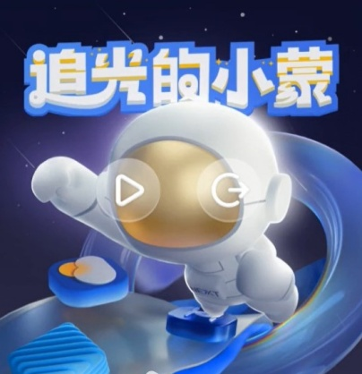
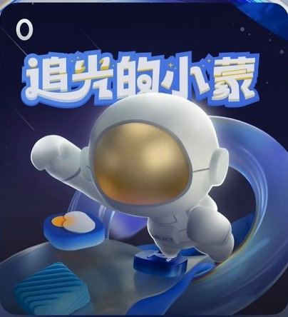

# 趣味交互类型互动卡片开发指导

趣味交互类型互动卡片当前仅支持基于[快游戏](https://developer.huawei.com/consumer/cn/doc/quickApp-Guides/quickgame-interact-card-0000002045917828)开发的卡片小游戏，互动卡片默认处于非激活态，当用户点击卡片时，卡片切换为激活态，并开始游戏。在游戏过程中，用户可以点击“暂停”按钮进入暂停态。在暂停态，用户可以通过“继续游戏”和“停止游戏”按钮选择返回激活态继续游戏，或者结束游戏。
## 基本概念

趣味交互类型互动卡片主要包含三个状态：激活态、暂停态和非激活态，分别对应游戏进行、游戏暂停、游戏结束。

### 激活态

在此状态下，卡片UI由卡片提供方基于快游戏所开发的卡片小游戏页面承载。此时系统支持游戏内容渲染到卡片自身渲染区域之外的“破框”效果。

**图1** 趣味交互类型互动卡片激活态

### 暂停态

在此状态下，卡片UI由卡片提供方widgetCard.ets中的内容所承载。同时系统在卡片上默认渲染“继续游戏”和“停止游戏”按钮。

**图2** 趣味交互类型互动卡片暂停态

### 非激活态

即普通卡片状态，在此状态下，卡片与普通卡片行为无异，遵循既有的卡片开发规范，卡片UI由卡片提供方widgetCard.ets中的内容所承载。

**图3** 趣味交互类型互动卡片非激活态

## 约束与限制

1. 用户与卡片交互时，例如点击、长按、拖拽等，卡片的有交互响应热区始终与卡片自身渲染区域等大。即使动效渲染区域大于卡片自身渲染区域，超出部分也仅做UI呈现，不响应交互事件。
2. 激活态时，卡片自身渲染区域范围内交互事件由卡片提供方开发的卡片小游戏页面响应；其他状态下交互事件由卡片提供方开发的普通卡片响应。
3. 同一时刻，全局只支持一个卡片进行趣味交互，即仅支持一个卡片处于激活态或暂停态。用户点击卡片，切换卡片进入激活态时，其他趣味交互类型互动卡片强制切换为非激活态。
4. 其他设计规范和约束请参考创新互动卡片[开发指导](https://developer.huawei.com/consumer/cn/doc/quickApp-Guides/quickgame-interact-card-dev-0000002045919412#section15581101333911)。

## 开发指导

游戏内容具体开发可参考[互动卡片小游戏开发指导](https://developer.huawei.com/consumer/cn/doc/quickApp-Guides/quickgame-interact-card-dev-0000002045919412)。

端侧卡片配置开发可参考[趣味交互类型互动卡片配置](arkts-ui-widget-configuration.md#funinteractionparams标签)。