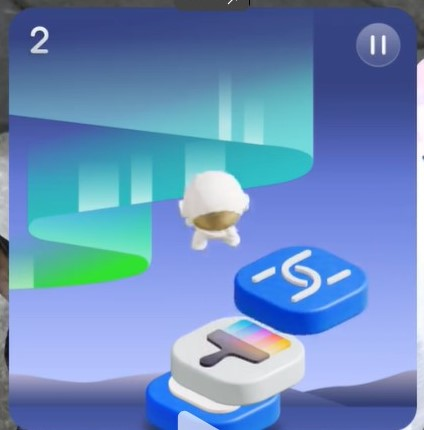

# 趣味交互类型互动卡片概述

趣味交互类型互动卡片当前仅支持基于鸿蒙快游戏引擎开发的卡片小游戏，本文档针对其基本概念、原理以及约束进行阐述。

## 基本概念

趣味交互类型互动卡片当前仅支持基于鸿蒙快游戏引擎开发的卡片小游戏。卡片主要包含三个状态：激活态、暂停态和非激活态，分别对应游戏进行、游戏暂停、游戏结束。

### 激活态

在此状态下，卡片 UI 由卡片提供方基于鸿蒙快游戏引擎所开发的卡片小游戏页面承载。此时系统支持游戏内容渲染到卡片范围之外的“破框”效果。

图1 趣味交互类型互动卡片激活态

### 暂停态

在此状态下，卡片 UI 由卡片提供方 widgetCard.ets 中的内容所承载。同时系统在卡片上默认渲染“继续游戏”和“停止游戏”按钮。

图2 趣味交互类型互动卡片暂停态

### 非激活态

即普通卡片状态，在此状态下，卡片与普通卡片行为无异，遵循既有的卡片开发规范，卡片 UI 由卡片提供方 widgetCard.ets 中的内容所承载。

图3 趣味交互类型互动卡片非激活态

## 开发指导

详细开发指导可参考[趣味交互类型互动卡片开发指导](arkts-ui-liveform-funinteraction-development.md)。

### 交互原则
趣味交互类型互动卡片遵循以下交互原则：
1. 卡片的有效交互热区始终保持卡片自身大小，卡片以外区域仅做 UI 呈现，交互事件直接由系统响应，事件分发时跳过当前卡片。
2. 激活态时，卡片范围内点击、长按、滑动事件由卡片提供方响应；其他状态下相应事件由系统响应，事件分发时跳过当前卡片。
3. 同一时刻，全局只支持一个卡片进行趣味交互（卡片处于激活态或暂停态）。用户点击卡片，切换卡片进入激活态时，其他卡片强制切换为非激活态。

## 能力说明
互动卡片作为卡片功能的增强，卡片自身业务不能强依赖互动卡片动效能力。