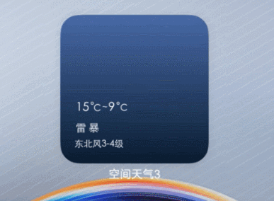

# 互动卡片概述

互动卡片提供卡片动效能力，能够动态展示普通卡片提供的静态信息或图片，并实现人机交互，提升信息提醒、浅层交互和可玩性体验。

## 使用场景

互动卡片包含两种类型：趣味交互类型互动卡片和场景动效类型互动卡片。

### 趣味交互类型

趣味交互类型互动卡片，提供卡片小游戏功能，当用户点击卡片时，开始体验对应卡片小游戏。当前仅支持基于[鸿蒙快游戏](https://developer.huawei.com/consumer/cn/doc/quickApp-Guides/quickgame-interact-card-0000002045917828)开发。详细请参考[趣味交互类型互动卡片开发指导](arkts-ui-liveform-funinteraction-development.md)。

**图1** 趣味交互类型互动卡片样例

### 场景动效类型

场景动效类型互动卡片，支持卡片实现动态效果。以天气卡片为例，当天气转为雷雨天气时卡片被激活，触发互动卡片动效。互动卡片动效结束后，卡片切换回原有显示效果。详细请参考[场景动效类型互动卡片概述](arkts-ui-liveform-sceneanimation-overview.md)。

**图2** 场景动效类型互动卡片样例

## 约束和限制
互动卡片作为卡片功能的增强，卡片自身业务不能强依赖互动卡片动效能力。