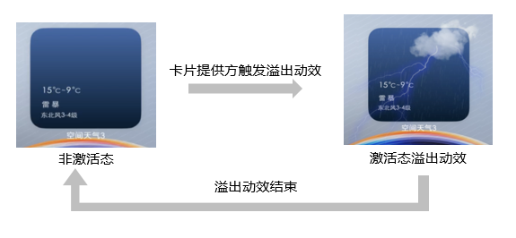

# 互动卡片概述

本文档针对互动卡片特性的使用场景、基本概念、原理以及约束进行阐述。

## 使用场景和亮点特征
针对普通卡片所提供的静态信息、图片展示，作为主应用的快捷入口和导流入口的定位，互动卡片特性在信息提醒、浅层交互、可玩性方面起到了很好的提升。互动卡片主要有两种类型：趣味交互类型和场景动效类型。

### 趣味交互类型
当前趣味交互类型互动卡片仅支持基于鸿蒙快游戏引擎开发的卡片小游戏，效果如下图所示。当用户点击卡片时，开始体验对应卡片小游戏。

详细介绍可参考[趣味交互类型互动卡片概述](arkts-ui-liveform-funinteraction-overview.md)。

### 场景动效类型

场景动效类型互动卡片以下方天气卡片为例子。

针对上述 demo 视频，可以看到当天气变化，转为雷雨天气时。卡片被激活，触发互动卡片动效，闪电以及云朵效果渲染区域超过了卡片既有的圆角矩形范围。互动卡片动效结束后，卡片切换回原有显示效果。

详细介绍可参考[场景动效类型互动卡片概述](arkts-ui-liveform-sceneanimation-overview.md)。

## 能力使用注意事项
互动卡片能力作为卡片功能的增强，因此卡片本身业务逻辑不能强依赖该动效能力。避免在部分没有适配互动卡片能力的平台，卡片基础交互或功能异常，引发用户体验问题。