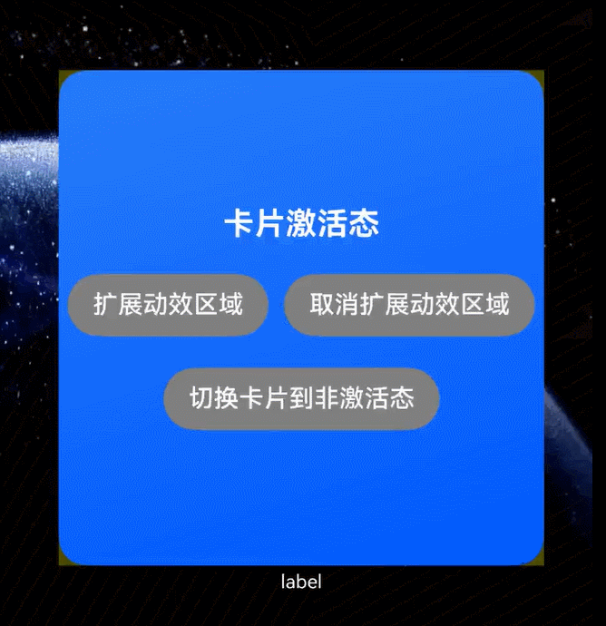

# 场景动效类型互动卡片开发指导（系统应用）

场景动效类型互动卡片基础开发指导，可以参考文档[场景动效类型互动卡片开发指导](arkts-ui-liveform-sceneanimation-development.md)。针对系统应用，场景动效类型互动卡片提供了**手势禁用配置**和**卡片长时间保持激活态**两个扩展能力。

## 接口说明

场景动效类型互动卡片开发关键接口如下表所示。

**表1** 主要接口

| 接口名                                                                                                                                                                       | 描述                                                                                                                  |
|---------------------------------------------------------------------------------------------------------------------------------------------------------------------------|---------------------------------------------------------------------------------------------------------------------|
| [formProvider.activateSceneAnimation(formId: string): Promise&lt;void&gt;](../reference/apis-form-kit/js-apis-app-form-formProvider-sys.md#activatesceneanimation20)     | 互动卡片请求状态切换到激活态。 |
| [formProvider.deactivateSceneAnimation(formId: string): Promise&lt;void&gt;](../reference/apis-form-kit/js-apis-app-form-formProvider-sys.md#deactivatesceneanimation20) | 互动卡片请求切换到非激活态。 |


## 手势禁用配置
针对[场景动效类型互动卡片](arkts-ui-liveform-sceneanimation-overview.md)，若用户在桌面的长按、拖拽等操作会打断当前动效，卡片重新变成非激活态。系统应用可通过form_config.json中[disabledDesktopBehaviors](arkts-ui-widget-configuration.md#sceneanimationparams标签)字段进行配置取消该限制，确保用户在激活态卡片交互热区内操作时，不打断当前卡片动效。
不配置时，默认不拦截桌面的任何有效手势操作。手势操作被拦截后，对应的手势事件由LiveFormExtensionAbility响应。

## 卡片长时间保持激活态

系统应用支持通过接口控制卡片状态切换，卡片可长时间保持激活态（后文简称为长时激活态，处于该状态的卡片简称为长时激活卡片）。卡片状态切换由[formProvider.activateSceneAnimation](../reference/apis-form-kit/js-apis-app-form-formProvider-sys.md#activatesceneanimation20)和[formProvider.deactivateSceneAnimation](../reference/apis-form-kit/js-apis-app-form-formProvider-sys.md#deactivatesceneanimation20)接口控制。此时卡片动效渲染区域和卡片自身等大，无破框效果。系统限制长时间保持激活态卡片不超过5个。数量超过时将淘汰最早切换为长时间保持激活态的卡片。

### 长时激活卡片扩展动效渲染区域

长时激活卡片支持调用[formProvider.requestOverflow](../reference/apis-form-kit/js-apis-app-form-formProvider.md#formproviderrequestoverflow20)接口长时间扩展卡片动效渲染区域。当接口中传入的动效时长大于60000毫秒时，卡片可实现长时间获得扩展后的动效渲染区域（后文简称为长时破框态，处于该状态卡片简称为长时破框卡片），反之扩展动效渲染区域请求失败。长时破框态卡片被其他互动卡片动效打断时，卡片动效渲染区域大小调整为卡片尺寸大小，卡片切换为长时激活态。

### 长时激活卡片状态信息同步

系统针对卡片关键状态信息更新时，通过代理向卡片提供方发送当前卡片最新状态信息。卡片提供方可以通过[uiExtensionContentSession](../reference/apis-ability-kit/js-apis-app-ability-uiExtensionContentSession-sys.md#setreceivedatacallback)能力进行监听。当前支持的卡片状态数据有

|状态|说明|
|-----|---------|
|stopOverflow|卡片动效渲染区域回退为同卡片自身等大，切换为长时激活态|
|startSwipe|用户触发桌面水平滑动翻页手势|
|endSwipe|用户完成桌面水平滑动翻页手势|
|onBackground|卡片由可见变为不可见，对应LiveFormExtensionAbility切换到后台|
|onForeground|卡片由不可见变为可见，对应LiveFormExtensionAbility切换到前台|
|extensionready|卡片的激活态已切换完毕|
|longPress|用户触发卡片长按手势，系统即将弹出卡片长按菜单|

### 约束与限制

互动卡片破框[动效请求约束](arkts-ui-liveform-sceneanimation-overview.md#动效请求约束)进一步扩展如下：
1. 同一时刻，全局只有一个卡片执行互动卡片破框动效。
2. 当用户通过点击等方式主动触发互动卡片破框动效时，优先响应此次请求。此时，当前卡片切换到激活态，执行动效，其他卡片动效被打断（长时破框态卡片，动效渲染区域大小调整为卡片尺寸大小，普通互动卡片切换为非激活态）。
3. 其他触发方式，例如通过卡片定时定数据刷新机制触发动效，遵循先到先得原则。系统只处理第一个合法动效请求。其他请求返回失败，同时不做缓存。
4. 长时激活态卡片不受请求约束影响。
5. 处于长时破框态的卡片，系统设置60秒倒计时。倒计时结束前，其他卡片的非用户点击触发的动效请求均返回失败。倒计时结束后，其他卡片的动效请求均可响应。当前卡片的动效渲染区域回退为与卡片自身等大，并切换为长时激活态。

## 开发流程

### 卡片激活态UI开发

1. 创建互动卡片

    通过[LiveFormExtensionAbility](../reference/apis-form-kit/js-apis-app-form-LiveFormExtensionAbility.md)创建互动卡片，创建时加载互动卡片页面。
    
    ```ts
    // entry/src/main/ets/mysystemliveformextensionability/MySystemLiveFormExtensionAbility.ets
    import { formInfo, LiveFormInfo, LiveFormExtensionAbility } from '@kit.FormKit';
    import { UIExtensionContentSession } from '@kit.AbilityKit';
    import { Constants } from '../common/Constants';
    
    const PAGE_PATH: string = 'mysystemliveformextensionability/pages/MySystemLiveFormPage';
    
    export default class MySystemLiveFormExtensionAbility extends LiveFormExtensionAbility {
      onLiveFormCreate(liveFormInfo: LiveFormInfo, session: UIExtensionContentSession) {
        let storage: LocalStorage = new LocalStorage();
        storage.setOrCreate(Constants.SESSION, session);
    
        // 获取参卡片 ID 与激活态渲染区域
        let formId: string = liveFormInfo.formId as string;
        storage.setOrCreate(Constants.FORM_ID, formId);
        let rect: formInfo.Rect = liveFormInfo.rect as formInfo.Rect
        storage.setOrCreate(Constants.FORM_RECT, rect);
        let borderRadius: number = liveFormInfo.borderRadius as number;
        storage.setOrCreate(Constants.BORDER_RADIUS, borderRadius);
        console.log(`onSessionCreate formId: ${formId}, rect: ${JSON.stringify(rect)}` +
          `, borderRadius: ${borderRadius}`);
    
        // 加载卡片提供方页面
        session.loadContent(PAGE_PATH, storage);
    
        // 卡片提供方需在激活态页面准备就绪时，通过 session 发送信息告知卡片使用方
        session.sendData({['isFormReady']: true});
      }
    
      onLiveFormDestroy(liveFormInfo: LiveFormInfo) {
        console.log(`MySystemLiveFormExtensionAbility onDestroy`);
      }
    }
    ```

2. 实现互动卡片页面

    ```ts
    // entry/src/main/ets/mysystemliveformextensionability/pages/MySystemLiveFormPage.ets
    import { formInfo, formProvider } from '@kit.FormKit';
    import { UIExtensionContentSession } from '@kit.AbilityKit';
    import { Constants } from '../../common/Constants';
    
    let that: MySystemLiveFormPage;
    
    @Entry
    @Component
    struct MySystemLiveFormPage {
      private uiContext: UIContext | undefined = undefined;
      private storageActiveUIExtAbilityPage: LocalStorage | undefined = undefined;
      private session: UIExtensionContentSession | undefined = undefined;
      private message: string = '卡片激活态';
      private formId: string | undefined = undefined;
      @State formRect: formInfo.Rect | undefined = undefined;
      @State formBorderRadius: number | undefined = undefined;
    
      aboutToAppear(): void {
        console.log('aboutToAppear');
        this.uiContext = this.getUIContext();
        if (!this.uiContext) {
          console.log('no uiContext');
          return;
        }
        that = this;
        this.initParams();
      }
    
      /**
       * 初始化卡片相关属性
       */
      private initParams(): void {
        this.storageActiveUIExtAbilityPage = this.uiContext?.getSharedLocalStorage();
        this.formId = this.storageActiveUIExtAbilityPage?.get<string>(Constants.FORM_ID);
        this.formRect = this.storageActiveUIExtAbilityPage?.get<formInfo.Rect>(Constants.FORM_RECT);
        this.formBorderRadius = this.storageActiveUIExtAbilityPage?.get<number>(Constants.BORDER_RADIUS);
        this.session = this.storageActiveUIExtAbilityPage?.get<UIExtensionContentSession>(Constants.SESSION);
      }
    
      onPageShow(): void {
        if (!this.session) {
          return;
        }
    
        // 当系统识别卡片状态变化时，通过session通知卡片提供方，卡片提供方根据业务需求处理动效接续和数据保存。
        this.session.setReceiveDataCallback(that.handleMessage);
      }
    
      /**
       * 系统消息处理函数
       *
       * @param data 系统通知的，卡片关键状态变化信息
       */
      private async handleMessage(data: Record<string, Object>): Promise<void> {
        try {
          let formStatusChange: string = data[Constants.FORM_STATUS_CHANGE] as string;
          let formStatusObject: Record<string, Object> = JSON.parse(formStatusChange) as Record<string, Object>;
          if (!formStatusObject || !that.formId) {
            console.log(`sth wrong when get form status`);
            return;
          }
          let status: string = formStatusObject[Constants.FORM_STATUS] as string;
          console.log(`data: ${JSON.stringify(data)}, status: ${status}`);
          await that.handleFormStatus(status);
        } catch (e) {
          console.log(`sth wrong when handleMessage, code: ${e.code}, message: ${e.message}`);
        }
      }

      /**
       * 当系统识别卡片状态变化时，通过session通知卡片提供方，卡片提供方根据业务需求处理动效接续和数据保存。
       * @param status 卡片状态
       */
      private async handleFormStatus(status: string): Promise<void> {
        if (status === Constants.STOP_OVERFLOW) {
          // 卡片动效渲染区域回退为同卡片自身等大，切换为长时激活态
          return;
        }
        if (status === Constants.START_SWIPE) {
          // 用户触发桌面水平滑动翻页手势
          return;
        }
        if (status === Constants.END_SWIPE) {
          // 用户完成桌面水平滑动翻页手势
          return;
        }
        if (status === Constants.ON_BACKGROUND) {
          // 卡片由可见变为不可见，对应LiveFormExtensionAbility切换到后台
          return;
        }
        if (status === Constants.ON_FOREGROUND) {
          // 卡片由不可见变为可见，对应LiveFormExtensionAbility切换到前台
          return;
        }
        if (status === Constants.EXTENSION_READY) {
          // 卡片的激活态已切换完毕
          return;
        }
        if (status === Constants.LONG_PRESS) {
          // 用户触发卡片长按手势，系统即将弹出卡片长按菜单
          return;
        }
      }
    
      build() {
        Stack() {
          this.buildBackground();
          Column({space: 20}) {
            this.buildControlButton();
          }
        }
        .width('100%')
        .height('100%')
      }
    
      @Builder
      buildBackground() {
        Stack()
          .width('100%')
          .height('100%')
          .opacity(0.3)
          .backgroundColor(Color.Yellow)
    
        // 卡片背景组件，和普通卡片等大
        Image($r('app.media.background'))
          .width(this.formRect? this.formRect.width : 0)
          .height(this.formRect? this.formRect.height : 0)
          .borderRadius(this.formBorderRadius ? this.formBorderRadius : 0)
      }
    
      @Builder
      buildControlButton() {
        Text(this.message)
          .fontColor(Color.White)
          .fontSize(20)
          .fontWeight(FontWeight.Bold)
    
        Row({space: 10}) {
          Button('扩展动效区域')
            .backgroundColor(Color.Grey)
            .onClick(() => {
              console.log('MyLiveFormPage start overflow animation');
              this.requestOverflow();
            })
    
          Button('取消扩展动效区域')
            .backgroundColor(Color.Grey)
            .onClick(() => {
              console.log('MyLiveFormPage cancel overflow animation');
              formProvider.cancelOverflow(this.formId);
            })
        }
    
        Button('切换卡片到非激活态')
          .backgroundColor(Color.Grey)
          .onClick(() => {
            console.log('MyLiveFormPage cancel active status');
            formProvider.deactivateSceneAnimation(this.formId);
          })
      }
    
      private requestOverflow(): void {
        if (!this.formId || !this.formRect) {
          return;
        }
        formProvider.requestOverflow(this.formId,{
          area: {
            left: -this.formRect.width * Constants.OVERFLOW_LEFT_RATIO,
            top: -this.formRect.height * Constants.OVERFLOW_TOP_RATIO,
            width: this.formRect.width * Constants.OVERFLOW_WIDTH_RATIO,
            height: this.formRect.height * Constants.OVERFLOW_HEIGHT_RATIO
          },
    
          // 申请动效时长需要大于等于60s
          duration: Constants.OVERFLOW_DURATION
        });
      }
    }
    ```

3. 互动卡片LiveFormExtensionAbility配置

    在module.json5配置文件中[extensionAbilities标签](../quick-start/module-configuration-file.md#extensionabilities标签)下配置LiveFormExtensionAbility。
    
    ```ts
    // entry/src/main/module.json5
        ...
        "extensionAbilities": [
          {
            "name": "MySystemLiveFormExtensionAbility",
            "srcEntry": "./ets/mysystemliveformextensionability/MySystemLiveFormExtensionAbility.ets",
            "description": "MySystemLiveFormExtensionAbility_desc",
            "type": "liveForm"
          }
        ]
        ...
    ```
    
    在main_pages.json文件中声明互动卡片页面。
    
    ```ts
    // entry/src/main/resources/base/profile/main_pages.json
    {
      "src": [
        "pages/Index",
        "mysystemliveformextensionability/pages/MySystemLiveFormPage"
      ]
    }
    ```

### 卡片非激活态UI开发

1. 非激活态卡片页面实现

    非激活态卡片页面开发流程与普通卡片开发完全一致，在SystemWidgetCard.ets中完成。SystemWidgetCard.ets文件在卡片创建时自动生成，卡片创建流程可以参考[创建ArkTS卡片](arkts-ui-widget-creation.md)。在非激活态卡片页面实现点击卡片时，请求卡片动效。
    
    ```ts
    // entry/src/main/ets/systemwidget/pages/SystemWidgetCard.ets
    @Entry
    @Component
    struct SystemWidgetCard {
      /*
       * The title.
       */
      readonly title: string = '系统应用，点击切换卡片状态';
      /*
       * The action type.
       */
      readonly actionType: string = 'message';
      /*
       * The ability name.
       */
      readonly abilityName: string = 'EntryFormAbility';
      /*
       * The message.
       */
      readonly message: string = 'activateSceneAnimation';
      /*
       * The width percentage setting.
       */
      readonly fullWidthPercent: string = '100%';
      /*
       * The height percentage setting.
       */
      readonly fullHeightPercent: string = '100%';
    
      build() {
        Row() {
          Column() {
            Text(this.title)
              .fontSize($r('app.float.font_size'))
              .fontWeight(FontWeight.Medium)
              .fontColor($r('sys.color.font_primary'))
          }
          .width(this.fullWidthPercent)
        }
        .height(this.fullHeightPercent)
        .onClick(() => {
          postCardAction(this, {
            action: this.actionType,
            abilityName: this.abilityName,
            params: {
              message: this.message
            }
          });
        })
      }
    }
    ```

2. form_config.json配置

    在form_config.json配置文件中新增sceneAnimationParams配置项。
    
    ```ts
    // entry/src/main/resources/base/profile/form_config.json
    {
      "forms": [
        {
          "name": "systemWidget",
          "displayName": "$string:systemWidget_display_name",
          "description": "$string:systemWidget_desc",
          "src": "./ets/systemwidget/pages/SystemWidgetCard.ets",
          "uiSyntax": "arkts",
          "window": {
            "designWidth": 720,
            "autoDesignWidth": true
          },
          "colorMode": "auto",
          "isDynamic": true,
          "isDefault": false,
          "updateEnabled": false,
          "scheduledUpdateTime": "10:30",
          "updateDuration": 1,
          "defaultDimension": "4*4",
          "supportDimensions": [
            "4*4"
          ],
          "sceneAnimationParams": {
            "abilityName": "MySystemLiveFormExtensionAbility"，
            "disabledDesktopBehaviors": [
              "SWIPE_DESKTOP",
              "PULL_DOWN_SEARCH",
              "LONG_CLICK",
              "DRAG"
            ]            
          }
        }
      ]
    }
    ```

### 互动卡片动效实现

1. 长时激活态卡片实现    
    ```ts
    // entry/src/main/ets/entryformability/EntryFormAbility.ets
    import { formProvider, FormExtensionAbility } from '@kit.FormKit';
    import { BusinessError } from '@kit.BasicServicesKit';
    
    export default class EntryFormAbility extends FormExtensionAbility {
      async onFormEvent(formId: string, message: string) {
        let shortMessage: string = JSON.parse(message)['message'];
        // 当接收的 message 为 activateSceneAnimation，触发互动卡片切换到长时激活态
        if (shortMessage === 'activateSceneAnimation') {
          this.activateSceneAnimation(formId);
          return;
        }
      }
    
      private activateSceneAnimation(formId: string): void {
        try {
          formProvider.activateSceneAnimation(formId).then(() => {
            console.log('activateSceneAnimation succeed');
          }).catch((error: BusinessError) => {
            console.log(`activateSceneAnimation catch error` +
              `, code: ${error.code}, message: ${error.message}`);
          })
        } catch (e) {
          console.log(`activateSceneAnimation call requestOverflow catch error` +
            `, code: ${e.code}, message: ${e.message}`);
        }
      }
    }
    ```

2. 互动卡片动效工具函数实现
    ```ts
    // entry/src/main/ets/common/Constants.ets
    export class Constants {
      // 互动卡片动效左侧偏移百分比 = 偏移值/卡片宽度
      public static readonly OVERFLOW_LEFT_RATIO: number = 0.1;
    
      // 互动卡片动效上侧偏移百分比 = 偏移值/卡片高度
      public static readonly OVERFLOW_TOP_RATIO: number = 0.1;
    
      // 互动卡片动效宽度放大百分比
      public static readonly OVERFLOW_WIDTH_RATIO: number = 1.2;
    
      // 互动卡片动效高度放大百分比
      public static readonly OVERFLOW_HEIGHT_RATIO: number = 1.2;
    
      // 互动卡片动效时长
      public static readonly OVERFLOW_DURATION: number = 60000;
    
      // LiveFormExtensionAbility 数据结构相关常量
      public static readonly FORM_ID: string = 'formId';
    
      public static readonly FORM_RECT: string = 'formRect';
    
      public static readonly BORDER_RADIUS: string = 'borderRadius';
    
      public static readonly SESSION: string = 'session';
    
      public static readonly FORM_STATUS_CHANGE: string = 'formStatusChange';
    
      public static readonly FORM_STATUS: string = 'formStatus';
    
      // 卡片动效渲染区域回退为同卡片自身等大，切换为长时激活态
      public static readonly STOP_OVERFLOW: string = 'stopOverflow';
    
      // 用户触发桌面水平滑动翻页手势
      public static readonly START_SWIPE: string = 'startSwipe';
    
      // 用户完成桌面水平滑动翻页手势
      public static readonly END_SWIPE: string = 'endSwipe';
    
      // 卡片由可见变为不可见，对应LiveFormExtensionAbility切换到后台
      public static readonly ON_BACKGROUND: string = 'onBackground';
    
      // 卡片由不可见变为可见，对应LiveFormExtensionAbility切换到前台
      public static readonly ON_FOREGROUND: string = 'onForeground';
    
      // 卡片的激活态已切换完毕
      public static readonly EXTENSION_READY: string = 'extensionReady';
    
      // 用户触发卡片长按手势，系统即将弹出卡片长按菜单
      public static readonly LONG_PRESS: string = 'longPress';
    }
    ```

## 实现效果
以下是按照本文档代码示例开发而成的效果demo。

