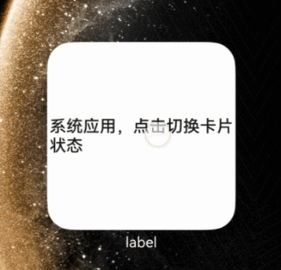

# 场景动效类型互动卡片开发指导（系统应用）

本文档提供了场景动效类型互动卡片（系统应用）的开发指导，包括：卡片非激活态和激活态 UI 界面开发，卡片配置文件开发。

## 开发接入指导
场景动效类型互动卡片基础开发指导，可以参考文档[互动卡片开发指导](arkts-ui-liveform-sceneanimation-development.md)。针对系统应用，支持以下扩展能力。

### 禁用手势配置
在 form_config.json 中，可选配置项 sceneAnimationParams 新增针对系统应用的可选字段 disableBehaviors，应用可以控制在激活态下卡片不响应特定桌面操作例如：
1. 长按：LONG_CLICK。
2. 拖拽卡片：DRAG。
3. 下拉进入全搜：PULL_DOWN_SEARCH。
4. 滑动翻页：SWIPE_PAGE。

配置可参考下面样例, 不配置时，默认不禁用任何桌面操作。

**代码样例：entry/src/main/resources/base/profile/form_config.json**

```ts
{
  "forms": [
    {
      "name": "systemWidget",
      "displayName": "$string:systemWidget_display_name",
      "description": "$string:systemWidget_desc",
      "src": "./ets/systemwidget/pages/SystemWidgetCard.ets",
      "uiSyntax": "arkts",
      "window": {
        "designWidth": 720,
        "autoDesignWidth": true
      },
      "colorMode": "auto",
      "isDynamic": true,
      "isDefault": false,
      "updateEnabled": false,
      "scheduledUpdateTime": "10:30",
      "updateDuration": 1,
      "defaultDimension": "2*2",
      "supportDimensions": [
        "2*2"
      ],
      "sceneAnimationParams": {
        "abilityName": "MySystemLiveFormExtensionAbility",
        "disabledDesktopBehaviors": "LONG_CLICK|DRAG|SWIPE_DESKTOP|PULL_DOWN_SEARCH"
      }
    }
  ]
}
```

### 卡片状态切换
针对系统应用，支持通过接口控制卡片状态切换，不对激活态保持时间做强限制，卡片进入/退出激活态操作由 [formProvider.activateSceneAnimation](../reference/apis-form-kit/js-apis-app-form-formProvider-sys.md#activatesceneanimation20) 和 [formProvider.deactivateSceneAnimation](../reference/apis-form-kit/js-apis-app-form-formProvider-sys.md#deactivatesceneanimation20) 接口控制。
特别地，卡片处于长时激活状态时候，卡片动效渲染区域和卡片自身渲染区域等大，不支持在激活态下调用 [formProvider.requestOverflow](../reference/apis-form-kit/js-apis-app-form-formProvider.md#formproviderrequestoverflow20)。

**代码样例：entry/src/main/ets/entryformability/EntryFormAbility.ets**

```ts
import {
  formBindingData,
  formInfo,
  formProvider,
  FormExtensionAbility,
} from '@kit.FormKit';
import { BusinessError } from '@kit.BasicServicesKit';
import { Want } from '@kit.AbilityKit';
import { Constants } from '../common/Constants';
import { Utils } from '../common/Utils';
import { preferences } from '@kit.ArkData';

const DB_NAME: string = 'myStore'

export default class EntryFormAbility extends FormExtensionAbility {
  onAddForm(want: Want) {
    // Called to return a FormBindingData object.
    const formData = '';
    return formBindingData.createFormBindingData(formData);
  }

  onCastToNormalForm(formId: string) {
    // Called when the form provider is notified that a temporary form is successfully
    // converted to a normal form.
  }

  async onUpdateForm(formId: string, wantParams?: Record<string, Object>) {
    // Called to notify the form provider to update a specified form.
    if (wantParams) {
      this.saveFormSize(formId, wantParams);
    }
  }

  private saveFormSize(formId: string, wantParams: Record<string, Object>) {
    let width = 0;
    let height = 0;
    width = wantParams[formInfo.FormParam.FORM_WIDTH_VP_KEY] as number;
    height = wantParams[formInfo.FormParam.FORM_HEIGHT_VP_KEY] as number;
    console.log(`onUpdateForm, formId: ${formId}, size:[${width}, ${height}]`);
    let promise: Promise<preferences.Preferences> = preferences.getPreferences(this.context, DB_NAME);
    Utils.writeFormSize(promise, formId, width, height);
  }

  private async getFormSize(formId: string): Promise<number[]> {
    let storeDB: preferences.Preferences =  await preferences.getPreferences(this.context, DB_NAME);
    let formCardInfo: string[] = await Utils.readFormSize(formId, storeDB);
    return [Number.parseFloat(formCardInfo[0]), Number.parseFloat(formCardInfo[1])];
  }

  async onFormEvent(formId: string, message: string) {
    // Called when a specified message event defined by the form provider is triggered.
    let shortMessage: string = JSON.parse(message)['message'];
    if (shortMessage === 'activateSceneAnimation') {
      this.activateSceneAnimation(formId);
    }
  }

  private activateSceneAnimation(formId: string): void {
    try {
      formProvider.activateSceneAnimation(formId).then(() => {
        console.log('onFormEvent activateSceneAnimation succeed');
      }).catch((error: BusinessError) => {
        console.log(`onFormEvent activateSceneAnimation catch error` + `, code: ${error.code}, message: ${error.message}`);
      })
    } catch(e) {
      console.log(`onFormEvent call activateSceneAnimation, catch error` + `, code: ${e.code}, message: ${e.message}`);
    }
  }

  onRemoveForm(formId: string) {
    // Called to notify the form provider that a specified form has been destroyed.
  }

  onAcquireFormState(want: Want) {
    // Called to return a {@link FormState} object.
    return formInfo.FormState.READY;
  }
}
```

**代码样例：entry/src/main/ets/systemwidget/pages/SystemWidgetCard.ets**

```ts
@Entry
@Component
struct SystemWidgetCard {
  /*
   * The title.
   */
  readonly title: string = '系统应用，点击切换卡片状态';
  /*
   * The action type.
   */
  readonly actionType: string = 'message';
  /*
   * The ability name.
   */
  readonly abilityName: string = 'EntryFormAbility';
  /*
   * The message.
   */
  readonly message: string = 'activateSceneAnimation';
  /*
   * The width percentage setting.
   */
  readonly fullWidthPercent: string = '100%';
  /*
   * The height percentage setting.
   */
  readonly fullHeightPercent: string = '100%';

  build() {
    Row() {
      Column() {
        Text(this.title)
          .fontSize($r('app.float.font_size'))
          .fontWeight(FontWeight.Medium)
          .fontColor($r('sys.color.font_primary'))
      }
      .width(this.fullWidthPercent)
    }
    .height(this.fullHeightPercent)
    .onClick(() => {
      postCardAction(this, {
        action: this.actionType,
        abilityName: this.abilityName,
        params: {
          message: this.message
        }
      });
    })
  }
}
```

**代码样例：entry/src/main/ets/mysystemliveformextensionability/MySystemLiveFormExtensionAbility.ets**

```ts
import { LiveFormInfo } from '@kit.FormKit';
import { LiveFormExtensionAbility } from '@kit.FormKit';
import { UIExtensionContentSession } from '@kit.AbilityKit';

export default class MySystemLiveFormExtensionAbility extends LiveFormExtensionAbility {
  onLiveFormCreate(liveFormInfo: LiveFormInfo, session: UIExtensionContentSession) {
    let storage: LocalStorage = new LocalStorage();
    storage.setOrCreate('session', session);

    // 获取参卡片 ID 与激活态渲染区域
    let formId: string = liveFormInfo.formId as string;
    storage.setOrCreate('formId', formId);
    console.log(`MySystemLiveFormExtensionAbility onSessionCreate formId: ${formId}`);

    // 加载提供方页面
    session.loadContent('mysystemliveformextensionability/pages/MySystemLiveFormPage', storage);
    this.context.setBackgroundImage($r('app.media.background'));
  }

  onLiveFormDestroy(liveFormInfo: LiveFormInfo) {
    console.log(`MySystemLiveFormExtensionAbility onDestroy`);
  }
}
```

在 module.json 中，在 extensionAbilities 配置项中增加 MySystemLiveFormExtensionAbility 配置。其中 type 字段为 liveForm。

**代码样例：entry/src/main/module.json**

```ts
    "extensionAbilities": [
      {
        "name": "MySystemLiveFormExtensionAbility",
        "srcEntry": "./ets/mysystemliveformextensionability/MySystemLiveFormExtensionAbility.ets",
        "description": "$string:MySystemLiveFormExtensionAbility_desc",
        "label": "$string:MySystemLiveFormExtensionAbility_label",
        "type": "liveForm"
      }
    ]
```

**代码样例：entry/src/main/ets/mysystemliveformextensionability/pages/MySystemLiveFormPage.ets**

```ts
import { formProvider } from '@kit.FormKit';
import { UIExtensionContentSession } from '@kit.AbilityKit';

let storageForMySystemLiveFormPage = LocalStorage.getShared();

@Entry(storageForMySystemLiveFormPage)
@Component
struct MySystemLiveFormPage {
  @State message: string = '卡片激活态';
  private session: UIExtensionContentSession | undefined =
    storageForMySystemLiveFormPage?.get<UIExtensionContentSession>('session');
  private formId: string | undefined = storageForMySystemLiveFormPage?.get<string>('formId');

  build() {
    Stack() {
      Column({space: 10}) {
        Text(this.message)
          .fontColor(Color.White)
          .fontSize(20)
          .fontWeight(FontWeight.Bold)

        Button('切换卡片到非激活态')
          .backgroundColor(Color.Grey)
          .onClick(() => {
            console.log('MyLiveFormPage cancel overflow animation');
            formProvider.deactivateSceneAnimation(this.formId);
          })
      }
    }
    .width('100%')
    .height('100%')
  }
}
```

## demo 效果
