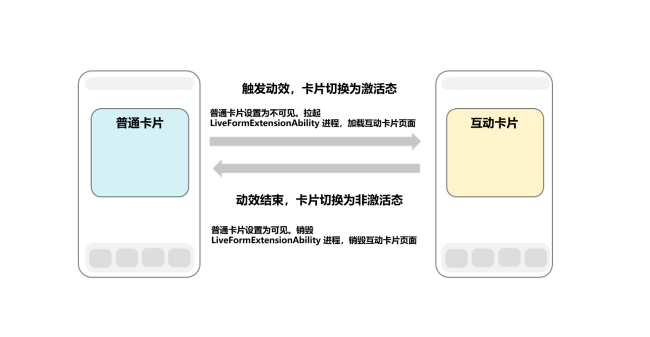
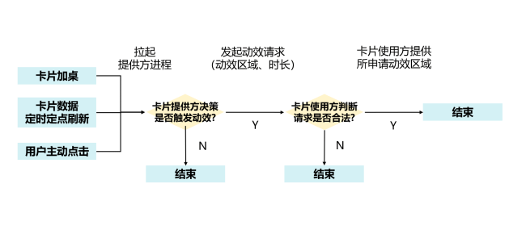
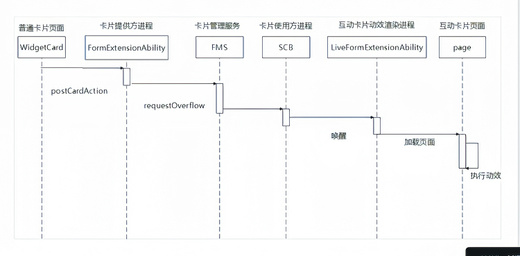
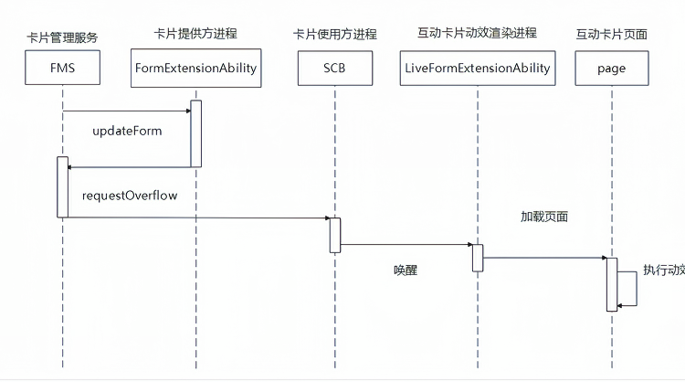
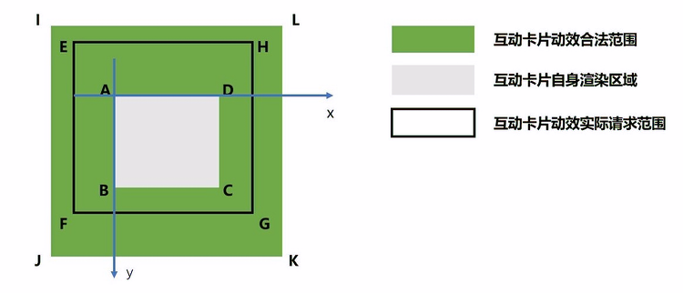

# 场景动效类型互动卡片开发指导
<!--Kit: Form Kit-->
<!--Subsystem: Ability-->
<!--Owner: @Qian-Win-->
<!--Designer: @cx983299475-->
<!--Tester: @mahailong123456-->
<!--Adviser: @HelloShuo-->
从API version 20开始，场景动效类型互动卡片支持在特定场景下触发互动卡片的特有效果。例如，开发者可以选择将动效渲染区域扩展到卡片自身的渲染区域之外，营造“破框”效果。本文档提供了场景动效类型互动卡片的开发指导，包括场景动效类型互动卡片概念、约束和限制、卡片非激活态、激活态UI界面开发和卡片配置文件开发。

## 基本概念

场景动效类型互动卡片主要包含两个状态：激活态和非激活态。卡片生命周期中的事件，如数据定时或定点刷新、用户点击等交互场景，可触发卡片动效，使卡片切换至激活态。动效结束后，卡片切回非激活态。

**非激活态**：在此状态下，卡片与普通卡片行为无异，遵循既有的卡片开发规范，卡片UI由卡片提供方widgetCard.ets中的内容所呈现。

**激活态**： 表示互动卡片动效渲染状态，在此状态下，卡片UI由卡片提供方所开发的[LiveFormExtensionAbility](../reference/apis-form-kit/js-apis-app-form-LiveFormExtensionAbility.md)对应page页面完成渲染。

**图1** 互动卡片状态切换说明



**图2** 互动卡片动效触发流程



## 实现原理

开发者可以通过[formProvider.requestOverflow](../reference/apis-form-kit/js-apis-app-form-formProvider.md#formproviderrequestoverflow20)接口触发互动卡片动效，例如在用户点击时触发，典型时序图如下。

**图3** 点击触发互动卡片动效时序图



**图4** 定时定点触发互动卡片动效时序图



**图5** 摇一摇触发互动卡片动效时序图


## 约束和限制

### 支持的场景
1. 当前互动卡片动效只有在[FormLocation](../reference/apis-form-kit/js-apis-app-form-formInfo.md#formlocation20)为“DESKTOP”的单张卡片上面才能生效。
2. 由于性能功耗影响只支持部分机型，在不支持的机型会报[801](../reference/errorcode-universal.md#801-该设备不支持此api)错误码。

### 请求参数约束
1. 互动卡片申请动效的最大合法动效时长：3500ms，倒计时结束时，卡片将切换回非激活态。<!--Del-->系统应用额外支持长时激活卡片，其动效时长不受限制，可参考[场景动效类型互动卡片开发指导（仅对系统应用开放）](arkts-ui-liveform-sceneanimation-development-sys.md)。<!--DelEnd-->
2. 由卡片定时定点刷新触发的互动卡片动效，一天内单张卡片最多触发50次。
3. 最大可申请动效区域：如下图，矩形ABCD表示卡片自身渲染区域，矩形IJKL表示卡片最大可申请动效区域。两个矩形中心对齐。尺寸满足以下表格描述。

| 卡片样式  | JK 边长 | IJ 边长 | 
|-------|---------------|---------------|
| 1 * 2 | 不超过AD边长的150%。| 不超过AB边长的200%。|
| 2 * 2 | 不超过AD边长的150%。| 不超过AB边长的150%。|
| 2 * 4 | 不超过AD边长的125%。| 不超过AB边长的150%。|
| 4 * 4 | 不超过AD边长的125%。| 不超过AB边长的125%。|
| 6 * 4 | 不超过AD边长的125%。| 不超过AB边长的110%。|

**图6** 互动卡片动效区域申请规则说明



例如：某设备上一个2*2卡片宽度为158vp，高度为158vp。对应上图则有：

（1）AD=158vp，AB=158vp，IJ=158\*1.5=237vp，JK=158\*1.5=237vp。

（2）IA两点水平相距39.5vp，垂直相距39.5vp。

因此，以A点为原点，向右为X轴正方向，向下为Y轴正方向，图5中E点的合法坐标可以是（-20，-20），EF边长合法值可以是200vp，EH边长合法值可以是200vp。

互动卡片可以通过调用[formProvider.getFormRect](../reference/apis-form-kit/js-apis-app-form-formProvider.md#formprovidergetformrect20)接口获取卡片在窗口中的尺寸及相对坐标位置信息。卡片提供方以此计算动效申请范围，坐标计算时，以上图A点为（0，0）点，计算矩形EFGH对应参数，单位为vp。

调用[formProvider.requestOverflow](../reference/apis-form-kit/js-apis-app-form-formProvider.md#formproviderrequestoverflow20)接口时，[overflowInfo](../reference/apis-form-kit/js-apis-app-form-formInfo.md#overflowinfo20)中描述的互动卡片动效渲染区域（矩形EFGH）需要满足：
1. 包含了卡片（矩形ABCD）的全部区域。
2. 不超过矩形IJKL（矩形IJKL完整包含矩形EFGH）。<!--Del-->仅三方应用生效，系统应用不作限制。<!--DelEnd-->

### 功耗约束
1. 设备进入省电模式时，互动卡片不响应动效请求。
2. 当设备热档位进入HOT时，不再响应非点击触发的动效请求；当热档位进入OVERHEATED时，不再响应所有动效请求。具体可参考[热档位信息](../reference/apis-basic-services-kit/js-apis-thermal.md#thermallevel)。

### 动效请求约束
1. 同一时刻，全局只有一个卡片执行互动卡片动效。
2. 当用户通过点击等方式主动触发互动卡片动效时，优先响应此次请求。此时，当前卡片切换到激活态，执行动效，其他卡片切换到非激活态。
3. 其他触发方式，例如通过卡片定时定点数据刷新机制触发动效，遵循先到先得原则。系统只处理第一个合法动效请求。其他请求返回失败，同时不做缓存。
4. 用户在桌面的其他有效操作（点击应用、卡片等，滑动翻页，下拉进入全搜、双中心、拖动卡片、长按卡片等）均会打断当前动效，卡片重新变成非激活态。<!--Del-->系统应用可以通过禁用手势配置项方式禁用用户在桌面的某些操作，可参考[场景动效类型互动卡片开发指导（系统应用）](arkts-ui-liveform-sceneanimation-development-sys.md)。<!--DelEnd-->
5. 互动卡片执行动效期间，超过卡片自身渲染范围（对应图6中的矩形ABCD）的交互事件，互动卡片不做响应。
6. 更多场景动效类型互动卡片激活态能力约束，可参考[LiveFormExtensionAbility](../reference/apis-form-kit/js-apis-app-form-LiveFormExtensionAbility.md)中说明。

## 接口说明

场景动效类型互动卡片关键接口如下表所示。

**表1** 主要接口

| 接口名                                                                                                                                                                                                 | 描述                 |
|-----------------------------------------------------------------------------------------------------------------------------------------------------------------------------------------------------|--------------------|
| [onLiveFormCreate(liveFormInfo: LiveFormInfo, session: UIExtensionContentSession): void](../reference/apis-form-kit/js-apis-app-form-LiveFormExtensionAbility.md#onliveformcreate)                  | 互动卡片界面对象创建的回调函数。   |
| [onLiveFormDestroy(liveFormInfo: LiveFormInfo): void](../reference/apis-form-kit/js-apis-app-form-LiveFormExtensionAbility.md#onliveformdestroy)                                                    | 互动卡片界面对象销毁、资源清理的回调函数。  |
| [LiveFormExtensionContext](../reference/apis-form-kit/js-apis-application-LiveFormExtensionContext.md)                  | LiveFormExtensionAbility的上下文，继承自ExtensionContext。 |
| [startAbilityByLiveForm(want: Want): Promise&lt;void&gt;](../reference/apis-form-kit/js-apis-application-LiveFormExtensionContext.md#startabilitybyliveform)| 拉起互动卡片提供方（应用）的页面。 |
| [formProvider.requestOverflow(formId: string, overflowInfo: formInfo.OverflowInfo): Promise&lt;void&gt;](../reference/apis-form-kit/js-apis-app-form-formProvider.md#formproviderrequestoverflow20) | 卡片提供方发起互动卡片动效请求。   |
| [formProvider.cancelOverflow(formId: string): Promise&lt;void&gt;](../reference/apis-form-kit/js-apis-app-form-formProvider.md#formprovidercanceloverflow20)                                        | 卡片提供方发起取消互动卡片动效请求。 |
| [formProvider.getFormRect(formId: string): Promise&lt;formInfo.Rect&gt;](../reference/apis-form-kit/js-apis-app-form-formProvider.md#formprovidergetformrect20)                                        | 卡片提供方查询卡片位置、尺寸。 |

## 开发流程

### 卡片激活态UI开发

1. 创建互动卡片

    通过[LiveFormExtensionAbility](../reference/apis-form-kit/js-apis-app-form-LiveFormExtensionAbility.md)创建互动卡片，创建时加载互动卡片页面。

    <!-- @[liveform_LiveFormExtensionAbility](https://gitcode.com/openharmony/applications_app_samples/blob/master/code/DocsSample/Form/FormLiveDemo/entry/src/main/ets/myliveformextensionability/MyLiveFormExtensionAbility.ets) -->
    
    ``` TypeScript
    // entry/src/main/ets/myliveformextensionability/MyLiveFormExtensionAbility.ets
    import { formInfo, LiveFormExtensionAbility, LiveFormInfo } from '@kit.FormKit';
    import { UIExtensionContentSession } from '@kit.AbilityKit';
    import { hilog } from '@kit.PerformanceAnalysisKit';
    
    const DOMAIN = 0x0000;
    
    export default class MyLiveFormExtensionAbility extends LiveFormExtensionAbility {
      onLiveFormCreate(liveFormInfo: LiveFormInfo, session: UIExtensionContentSession) {
        let storage: LocalStorage = new LocalStorage();
        storage.setOrCreate('context', this.context);
        storage.setOrCreate('session', session);
        let formId: string = liveFormInfo.formId;
        storage.setOrCreate('formId', formId);
    
        // 获取卡片圆角信息
        let borderRadius: number = liveFormInfo.borderRadius;
        storage.setOrCreate('borderRadius', borderRadius);
    
        // liveFormInfo.rect字段表示非激活态卡片组件相对激活态UI的位置和尺寸信息
        let formRect: formInfo.Rect = liveFormInfo.rect;
        storage.setOrCreate('formRect', formRect);
        hilog.info(DOMAIN, 'testTag', `MyLiveFormExtensionAbility onLiveFormCreate formId: ${formId}` +
          `, borderRadius: ${borderRadius}, formRectInfo: ${JSON.stringify(formRect)}`);
    
        // 加载互动页面
        session.loadContent('myliveformextensionability/pages/MyLiveFormPage', storage);
      }
    
      onLiveFormDestroy(liveFormInfo: LiveFormInfo) {
        hilog.info(DOMAIN, 'testTag', `MyLiveFormExtensionAbility onDestroy`);
      }
    };
    ```
    

2. 实现互动卡片页面

   <!-- @[liveform_MyLiveFormPage](https://gitcode.com/openharmony/applications_app_samples/blob/master/code/DocsSample/Form/FormLiveDemo/entry/src/main/ets/myliveformextensionability/pages/MyLiveFormPage.ets) --> 
   
   ``` TypeScript
   // entry/src/main/ets/myliveformextensionability/pages/MyLiveFormPage.ets
   import { formInfo, formProvider } from '@kit.FormKit';
   import { BusinessError } from '@kit.BasicServicesKit';
   import { common } from '@kit.AbilityKit';
   // Constants实现参考“互动卡片动效工具函数实现”小节
   import { Constants } from '../../common/Constants';
   import { hilog } from '@kit.PerformanceAnalysisKit';
   
   const ANIMATION_RECT_SIZE: number = 100;
   const END_SCALE: number = 1.5;
   const END_TRANSLATE: number = -300;
   const DOMAIN = 0x0000;
   
   @Entry
   @Component
   struct MyLiveFormPage {
     @State columnScale: number = 1.0;
     @State columnTranslate: number = 0.0;
     private uiContext: UIContext | undefined = undefined;
     private storageForMyLiveFormPage: LocalStorage | undefined = undefined;
     private formId: string | undefined = undefined;
     private formRect: formInfo.Rect | undefined = undefined;
     private formBorderRadius: number | undefined = undefined;
     private liveFormContext: common.LiveFormExtensionContext | undefined = undefined;
   
     aboutToAppear(): void {
       this.uiContext = this.getUIContext();
       if (!this.uiContext) {
         hilog.error(DOMAIN, 'testTag', 'no uiContext');
         return;
       }
       this.initParams();
     }
   
     private initParams(): void {
       this.storageForMyLiveFormPage = this.uiContext?.getSharedLocalStorage();
       this.formId = this.storageForMyLiveFormPage?.get<string>('formId');
       this.formRect = this.storageForMyLiveFormPage?.get<formInfo.Rect>('formRect');
       this.formBorderRadius = this.storageForMyLiveFormPage?.get<number>('borderRadius');
       this.liveFormContext = this.storageForMyLiveFormPage?.get<common.LiveFormExtensionContext>('context');
     }
   
     // 执行动效
     private runAnimation(): void {
       this.uiContext?.animateTo({
         duration: Constants.OVERFLOW_DURATION,
         curve: Curve.Ease
       }, () => {
         this.columnScale = END_SCALE;
         this.columnTranslate = END_TRANSLATE;
       });
     }
   
     private startAbilityByLiveForm(): void {
       try {
         // 请开发者替换为实际的want信息
         this.liveFormContext?.startAbilityByLiveForm({
           bundleName: 'com.samples.formlivedemo',
           abilityName: 'EntryAbility',
         })
           .then(() => {
             hilog.info(DOMAIN, 'testTag', 'startAbilityByLiveForm succeed');
           })
           .catch((err: BusinessError) => {
             hilog.error(DOMAIN, 'testTag',
               `startAbilityByLiveForm failed, code is ${err?.code}, message is ${err?.message}`);
           });
       } catch (e) {
         hilog.error(DOMAIN, 'testTag', `startAbilityByLiveForm failed, code is ${e?.code}, message is ${e?.message}`);
       }
     }
   
     build() {
       Stack({ alignContent: Alignment.TopStart }) {
         // 背景组件和普通卡片一样大
         Column()
           .width(this.formRect ? this.formRect.width : 0)
           .height(this.formRect ? this.formRect.height : 0)
           .offset({
             x: this.formRect ? this.formRect.left : 0,
             y: this.formRect ? this.formRect.top : 0,
           })
           .borderRadius(this.formBorderRadius ? this.formBorderRadius : 0)
           .backgroundColor('#2875F5')
         Stack() {
           this.buildContent();
         }
         .width('100%')
         .height('100%')
       }
       .width('100%')
       .height('100%')
       .onClick(() => {
         hilog.info(DOMAIN, 'testTag', 'MyLiveFormPage click to start ability');
         if (!this.liveFormContext) {
           hilog.info(DOMAIN, 'testTag', 'MyLiveFormPage liveFormContext is empty');
           return;
         }
         this.startAbilityByLiveForm();
       })
     }
   
     @Builder
     buildContent() {
       Stack()
         .width(ANIMATION_RECT_SIZE)
         .height(ANIMATION_RECT_SIZE)
         .backgroundColor(Color.White)
         .scale({
           x: this.columnScale,
           y: this.columnScale,
         })
         .translate({
           y: this.columnTranslate
         })
         .onAppear(() => {
           // 在页面出现时执行动效
           this.runAnimation();
         })
       // $r('app.string.button_cancel')需要在相应的资源文件string.json中定义
       Button($r('app.string.button_cancel'))
         .backgroundColor(Color.Grey)
         .onClick(() => {
           if (!this.formId) {
             hilog.info(DOMAIN, 'testTag', 'MyLiveFormPage formId is empty, cancel overflow failed');
             return;
           }
           hilog.info(DOMAIN, 'testTag', 'MyLiveFormPage cancel overflow animation');
           formProvider.cancelOverflow(this.formId);
         })
     }
   }
   ```


3. 互动卡片LiveFormExtensionAbility配置

    在module.json5配置文件中[extensionAbilities标签](../quick-start/module-configuration-file.md#extensionabilities标签)下配置LiveFormExtensionAbility。

    <!-- @[liveform_moudlejson5](https://gitcode.com/openharmony/applications_app_samples/blob/master/code/DocsSample/Form/FormLiveDemo/entry/src/main/module.json5) --> 
    
    ``` JSON5
    // entry/src/main/module.json5
    // ...
        "extensionAbilities": [
          // ...
          {
            "name": "MyLiveFormExtensionAbility",
            "srcEntry": "./ets/myliveformextensionability/MyLiveFormExtensionAbility.ets",
            "description": "MyLiveFormExtensionAbility",
            "type": "liveForm"
          }
        ],
        // ...
    ```

    在main_pages.json文件中声明互动卡片页面。

    ```ts
    // entry/src/main/resources/base/profile/main_pages.json
    {
      "src": [
        "pages/Index",
        "myliveformextensionability/pages/MyLiveFormPage"
      ]
    }
    ```

### 卡片非激活态UI开发

1. 非激活态卡片页面实现

    非激活态卡片页面开发同普通卡片开发流程完全一致，在widgetCard.ets中完成。widgetCard.ets文件在卡片创建时自动生成，卡片创建流程可以参考[创建ArkTS卡片](arkts-ui-widget-creation.md)。在非激活态卡片页面实现点击卡片时，发起卡片动效请求。

    <!-- @[liveform_WidgetCard](https://gitcode.com/openharmony/applications_app_samples/blob/master/code/DocsSample/Form/FormLiveDemo/entry/src/main/ets/widget/pages/WidgetCard.ets) --> 
    
    ``` TypeScript
    // entry/src/main/ets/widget/pages/WidgetCard.ets
    @Entry
    @Component
    struct WidgetCard {
      build() {
        Row() {
          Column() {
            // $r('app.string.liveform_click1')需要在相应的资源文件string.json中定义
            Text($r('app.string.liveform_click1'))
              // $r('app.float.font_size')需开发者根据实际情况替换相应的资源或值
              .fontSize($r('app.float.font_size'))
              .fontWeight(FontWeight.Medium)
              // $r('sys.color.font_primary')需开发者根据实际情况替换相应的资源或值
              .fontColor($r('sys.color.font_primary'))
          }
          .width('100%')
        }
        .height('100%')
        .onClick(() => {
          // 点击卡片时，选择向EntryFormAbility发送消息，并在其onFormEvent回调中调用formProvider.requestOverflow，请求卡片动效
          postCardAction(this, {
            action: 'message',
            abilityName: 'EntryFormAbility',
            params: {
              message: 'requestOverflow'
            }
          });
        })
      }
    }
    ```


2. form_config.json配置

    在form_config.json配置文件中新增sceneAnimationParams配置项。

    ```ts
    // entry/src/main/resources/base/profile/form_config.json
    {
      "forms": [
        {
          "name": "widget",
          "displayName": "$string:widget_display_name",
          "description": "$string:widget_desc",
          "src": "./ets/widget/pages/WidgetCard.ets",
          "uiSyntax": "arkts",
          "window": {
            "designWidth": 720,
            "autoDesignWidth": true
          },
          "colorMode": "auto",
          "isDefault": true,
          "updateEnabled": true,
          "scheduledUpdateTime": "10:30",
          "updateDuration": 1,
          "defaultDimension": "2*2",
          "supportDimensions": [
            "2*2"
          ],
          "formConfigAbility": "ability://EntryAbility",
          "dataProxyEnabled": false,
          "isDynamic": true,
          "transparencyEnabled": false,
          "metadata": [],
          "sceneAnimationParams": {
            "abilityName": "MyLiveFormExtensionAbility"
          }
        }
      ]
    }
    ```   

### 互动卡片动效实现

1. 触发互动卡片动效

    互动卡片通过调用[formProvider.requestOverflow](../reference/apis-form-kit/js-apis-app-form-formProvider.md#formproviderrequestoverflow20)接口触发动效，调用时需要明确：（1）动效申请范围。（2）动效持续时间。（3）是否使用系统提供的默认切换动效。具体可参考[formInfo.OverflowInfo](../reference/apis-form-kit/js-apis-app-form-formInfo.md#overflowinfo20)。其中，互动卡片可以通过调用[formProvider.getFormRect](../reference/apis-form-kit/js-apis-app-form-formProvider.md#formprovidergetformrect20)接口获取卡片尺寸和在窗口内的位置信息。卡片提供方以此计算动效申请范围，单位为vp。计算规则具体请参考[互动卡片请求参数约束](#请求参数约束)。

    <!-- @[liveform_EntryFormAbility](https://gitcode.com/openharmony/applications_app_samples/blob/master/code/DocsSample/Form/FormLiveDemo/entry/src/main/ets/entryformability/EntryFormAbility.ets) -->
    
    ``` TypeScript
    // entry/src/main/ets/entryformability/EntryFormAbility.ets
    import { FormExtensionAbility, formInfo, formProvider } from '@kit.FormKit';
    import { BusinessError } from '@kit.BasicServicesKit';
    // Constants实现参考“互动卡片动效工具函数实现”小节
    import { Constants } from '../common/Constants';
    import { hilog } from '@kit.PerformanceAnalysisKit';
    
    const TAG: string = 'EntryFormAbility';
    const DOMAIN_NUMBER: number = 0xFF00;
    
    export default class EntryFormAbility extends FormExtensionAbility {
      async onFormEvent(formId: string, message: string) {
        let shortMessage: string = JSON.parse(message)['message'];
    
        // 当接收的message为requestOverflow，触发互动卡片动效
        if (shortMessage === 'requestOverflow') {
          let formRect: formInfo.Rect = await formProvider.getFormRect(formId);
          this.requestOverflow(formId, formRect.width, formRect.height);
          return;
        }
      }
    
      private requestOverflow(formId: string, formWidth: number, formHeight: number): void {
        if (formWidth <= 0 || formHeight <= 0) {
          hilog.info(DOMAIN_NUMBER, TAG, 'requestOverflow failed, form size is not correct.');
          return;
        }
    
        // 基于卡片自身尺寸信息，计算卡片动效渲染区域
        let left: number = -Constants.OVERFLOW_LEFT_RATIO * formWidth;
        let top: number = -Constants.OVERFLOW_TOP_RATIO * formHeight;
        let width: number = Constants.OVERFLOW_WIDTH_RATIO * formWidth;
        let height: number = Constants.OVERFLOW_HEIGHT_RATIO * formHeight;
        let duration: number = Constants.OVERFLOW_DURATION;
    
        // 发起互动卡片动效申请
        try {
          formProvider.requestOverflow(formId, {
            // 动效申请范围
            area: {
              left: left,
              top: top,
              width: width,
              height: height
            },
            // 动效持续时间
            duration: duration,
            // 指定是否使用系统提供的默认切换动效
            useDefaultAnimation: true,
          }).then(() => {
            hilog.info(DOMAIN_NUMBER, TAG, 'requestOverflow requestOverflow succeed');
          }).catch((error: BusinessError) => {
            hilog.info(DOMAIN_NUMBER, TAG, `requestOverflow requestOverflow catch error` + `,
              code: ${error.code}, message: ${error.message}`);
          })
        } catch (e) {
          hilog.info(DOMAIN_NUMBER, TAG, `requestOverflow call requestOverflow catch error` + `,
            code: ${e.code}, message: ${e.message}`);
        }
      }
    }
    ```


2. 互动卡片动效工具函数实现

   <!-- @[liveform_Constants](https://gitcode.com/openharmony/applications_app_samples/blob/master/code/DocsSample/Form/FormLiveDemo/entry/src/main/ets/common/Constants.ets) --> 
   
   ``` TypeScript
   // entry/src/main/ets/common/Constants.ets
   // 动效相关常量的开发
   export class Constants {
     // 互动卡片动效超范围，左侧偏移百分比 = 偏移值/卡片宽度
     public static readonly OVERFLOW_LEFT_RATIO: number = 0.1;
     // 互动卡片动效超范围，上侧偏移百分比 = 偏移值/卡片高度
     public static readonly OVERFLOW_TOP_RATIO: number = 0.15;
     // 互动卡片动效超范围，宽度放大百分比
     public static readonly OVERFLOW_WIDTH_RATIO: number = 1.2;
     // 互动卡片动效超范围，高度放大百分比
     public static readonly OVERFLOW_HEIGHT_RATIO: number = 1.3;
     // 互动卡片动效超范围，动效时长
     public static readonly OVERFLOW_DURATION: number = 3500;
   }
   ```


3. 需要的资源文件string.json

    ```json5
    {
        "string": [
          // ...
          {
            "name": "liveform_click1",
            "value": "点击触发互动卡片动效"
          },
          {
            "name": "button_cancel",
            "value": "强制取消动效"
          }
        ]
    }
    ```

## 实现效果
以下是按照本文档代码示例开发而成的效果demo，demo执行动效时，点击按钮，将调用 [formProvider.cancelOverflow](../reference/apis-form-kit/js-apis-app-form-formProvider.md#formprovidercanceloverflow20) 接口，打断当前破框动效，卡片切换为非激活态。

