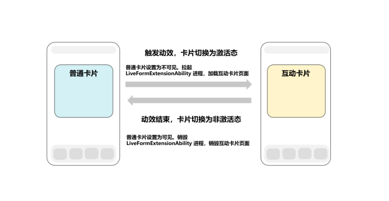
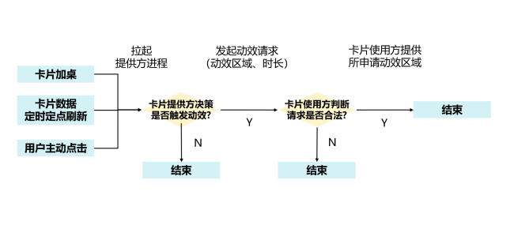
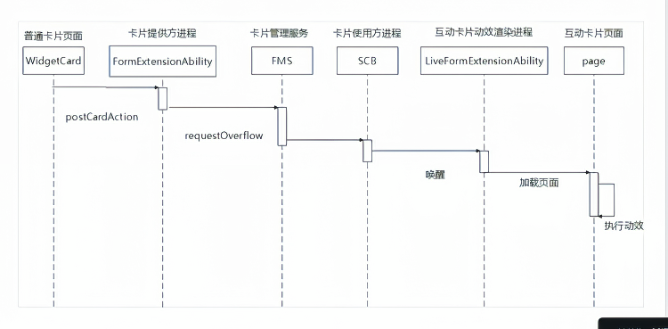
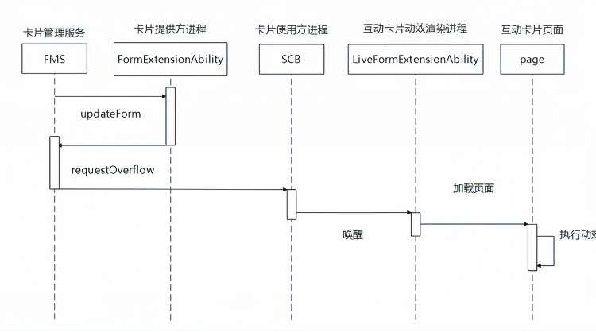
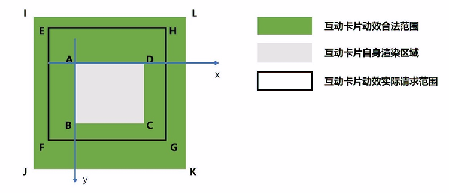

# 场景动效类型互动卡片概述

场景动效类型互动卡片，支持卡片在特定场景下触发互动卡片特有动效，例如开发者可以选择将动效渲染区域超出卡片自身渲染区域，营造“破框”效果。

## 基本概念

场景动效类型互动卡片主要包含两个状态：激活态和非激活态。卡片首次加桌、卡片数据定时或定点刷新，或者用户点击等用户主动与卡片交互的场景下，可以触发卡片动效，卡片切换至激活态，卡片动效结束，切回非激活态。

**非激活态**：在此状态下，卡片与普通卡片行为无异，遵循既有的卡片开发规范，卡片UI由卡片提供方widgetCard.ets中的内容所承载。

**激活态**： 表示互动卡片动效渲染状态，在此状态下，卡片UI由卡片提供方所开发的[LiveFormExtensionAbility](../reference/apis-form-kit/js-apis-app-form-LiveFormExtensionAbility.md)对应page页面完成渲染。详细可参考[场景动效类型互动卡片开发指导](arkts-ui-liveform-sceneanimation-development.md)。

**图1** 互动卡片状态切换说明

**图2** 互动卡片动效触发流程

## 实现原理

开发者可以通过[formProvider.requestOverflow](../reference/apis-form-kit/js-apis-app-form-formProvider.md#formproviderrequestoverflow20)接口触发互动卡片动效，例如在用户点击时触发，典型时序图如下。

**图3** 点击触发互动卡片动效时序图

在卡片定时定点刷新场景下，典型时序图如下。

**图4** 定时定点触发互动卡片动效时序图

## 约束和限制

### 请求参数约束
1. 互动卡片申请破框的最大合法动效时长：3500ms，倒计时结束时，卡片将切换回非激活态。<!--Del-->仅三方应用生效，系统应用不作限制。<!--DelEnd-->
2. 由卡片定时定点刷新触发的互动卡片动效，一天内单张卡片最多触发50次。
3. 最大可申请动效区域：如下图，矩形ABCD表示卡片自身渲染区域，矩形IJKL表示卡片最大可申请动效区域。两个矩形中心对齐。尺寸满足以下表格描述。

| 卡片样式  | JK 边长 | IJ 边长 | 
|-------|---------------|---------------|
| 1 * 2 | 不超过AD边长的150%。| 不超过AB边长的200%。|
| 2 * 2 | 不超过AD边长的150%。| 不超过AB边长的150%。|
| 2 * 4 | 不超过AD边长的125%。| 不超过AB边长的150%。|
| 4 * 4 | 不超过AD边长的125%。| 不超过AB边长的125%。|
| 6 * 4 | 不超过AD边长的125%。| 不超过AB边长的110%。|

**图5** 互动卡片动效区域申请规则说明

例如：某设备上一个2*2卡片宽度为158vp，高度为158vp。对应上图则有：
（1）AD=158vp，AB=158vp，IJ=158\*1.5=237vp，IL=158\*1.5=237vp。
（2）IA两点水平相距39.5vp，垂直相距39.5vp。

因此，以A点为原点，向右为X轴正方向，向下为Y轴正方向，图5中E点的合法坐标可以是（-20，-20），EF边长合法值可以是200vp，EH边长合法值可以是200vp。

在加桌时，互动卡片可以通过[onUpdateForm](../reference/apis-form-kit/js-apis-app-form-formExtensionAbility.md#formextensionabilityonupdateform)生命周期回调中的wantParams参数获取卡片实际尺寸。卡片提供方以此计算动效申请范围，坐标计算时，以上图A点为（0,0）点，计算矩形EFGH对应参数，单位为vp。

调用[formProvider.requestOverflow](../reference/apis-form-kit/js-apis-app-form-formProvider.md#formproviderrequestoverflow20)接口时，[overflowInfo](../reference/apis-form-kit/js-apis-app-form-formInfo.md#overflowinfo20)中描述的互动卡片动效渲染区域（矩形EFGH）需要满足：
1. 完整包含了卡片（矩形ABCD）。
2. 不超过矩形IJKL（矩形IJKL完整包含矩形EFGH）。<!--Del-->仅三方应用生效，系统应用不作限制。<!--DelEnd-->

具体可参考[场景动效类型互动卡片开发指导](arkts-ui-liveform-sceneanimation-development.md)。

### 动效请求约束
1. 同一时刻，全局只有一个卡片执行场景动效。
2. 当用户通过点击等方式主动触发互动卡片动效时，优先响应此次动效触发请求。此时，当前卡片切换到激活态，执行动效，其他卡片立即强制切换到非激活态。
3. 其他触发方式，例如通过卡片定时定数据刷新机制触发动效，遵循先到先得原则。系统只处理第一个合法动效请求。其他请求返回失败，同时不做缓存。
4. 用户在桌面的其他有效操作（点击应用、卡片等，滑动翻页，下拉进入全搜、双中心、拖动卡片、长按卡片等）均会打断当前动效，卡片重新变成非激活态。<!--Del-->系统应用可以通过禁用手势配置项方式禁用用户在桌面的某些操作，可参考[场景动效类型互动卡片开发指导（系统应用）](arkts-ui-liveform-sceneanimation-development-sys.md)。<!--DelEnd-->
5. 互动卡片执行动效期间，超过卡片自身渲染范围（对应图5中的矩形ABCD）的交互事件，互动卡片不做响应。