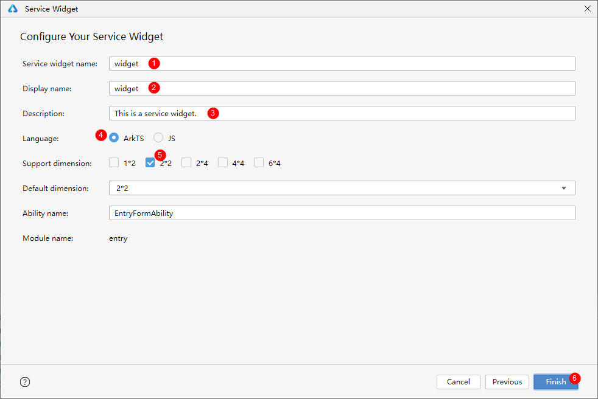
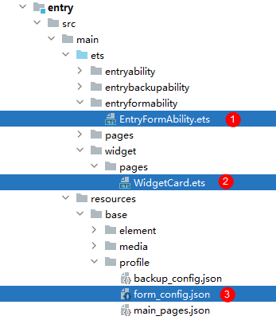
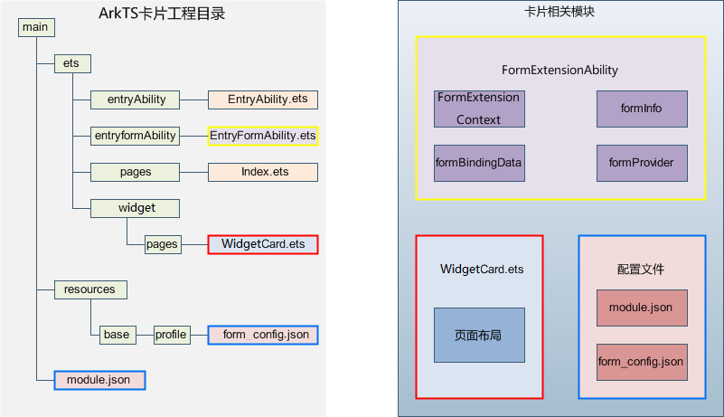
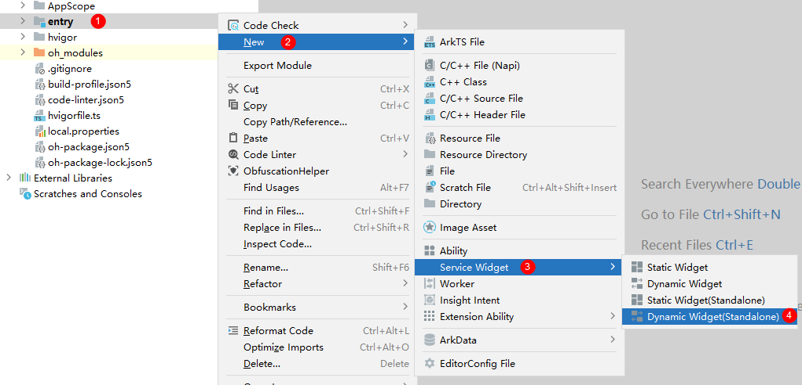
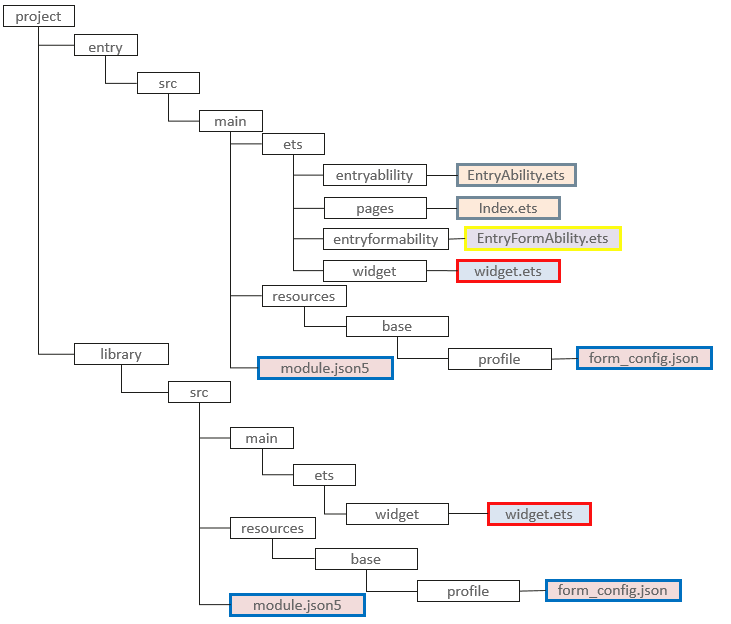

# 创建ArkTS卡片
<!--Kit: Form Kit-->
<!--Subsystem: Ability-->
<!--Owner: @cx983299475-->
<!--Designer: @xueyulong-->
<!--Tester: @chenmingze-->
<!--Adviser: @Brilliantry_Rui-->
ArkTS卡片有两种创建卡片包的方式。开发者在开发过程中任选其一即可。 
方式一：卡片和应用共包方式，创建步骤请参考[共包方式创建卡片](./arkts-ui-widget-creation.md#方式一共包方式创建卡片)，此时卡片UI和应用代码在一个module内，最终编译产物也在同一个HAP包内。 
方式二：独立卡片包方式，创建步骤请参考[独立包方式创建卡片](./arkts-ui-widget-creation.md#方式二独立包方式创建卡片)，此时卡片UI和应用代码在不同module内，最终编译产物分为卡片包和应用包。 
## 方式一：共包方式创建卡片
### 创建步骤
#### 1. 新建应用工程
应用工程分为两种：Application（普通应用）和Atomic Servic（元服务）。这两种应用都支持创建卡片。
- 创建工程时，选择Application，可以在创建工程后右键新建卡片。
- 创建工程时，选择Atomic Service（元服务），也可以在创建工程后右键新建卡片。 

>**说明：** 
>
> 基于不同版本的DevEco Studio，请以实际界面为准。

#### 2. 新建卡片
在已有的应用工程中，右键新建ArkTS卡片，具体操作如下。

- 选中entry目录单击右键选择【New】->【Service Widget】->【Dynamic Widget】。 
   
>**说明：** 
>
> 在API 10及以上 Stage模型的工程中，开发者可通过Service Widget菜单可直接选择创建动态卡片（Dynamic Widget）或静态卡片（Static Widget）。创建卡片后，也可在卡片的[form_config.json配置文件](arkts-ui-widget-configuration.md)中，通过isDynamic参数修改卡片类型：isDynamic置空或赋值为“true”，则该卡片为[为动态卡片](./arkts-form-overview.md#动态卡片)；isDynamic赋值为"false"，则该卡片为[静态卡片](./arkts-form-overview.md#静态卡片)。

- 选择模板后，点击【Next】。 
   

- 在选择卡片的开发语言类型（Language）时，选择ArkTS选项。选择卡片支持的外观规格（Support dimension）时，选择期望的卡片尺寸，然后选择默认的外观规格（Default dimension），最后点击“Finish”，即可完成ArkTS卡片创建。详细的卡片外观规格可参考[form_config.json](arkts-ui-widget-configuration.md#配置文件字段说明)配置文件，后续也可以在form_config.json配置文件中修改卡片规格。 
   

   建议根据实际使用场景命名卡片名称，ArkTS卡片创建完成后，工程中会新增如下卡片相关文件：卡片生命周期管理文件（EntryFormAbility.ets）、卡片页面文件（WidgetCard.ets）和卡片配置文件（form_config.json）。填写卡片配置之后点击【Finish】。 
   
### 工程结构介绍
**图1** ArkTS卡片工程目录、相关模块 

- [FormExtensionAbility](../reference/apis-form-kit/js-apis-app-form-formExtensionAbility.md)：卡片扩展模块，提供卡片创建、销毁、刷新等生命周期回调。

- [FormExtensionContext](../reference/apis-form-kit/js-apis-inner-application-formExtensionContext.md)：FormExtensionAbility的上下文环境，提供FormExtensionAbility具有的接口和能力。

- [formProvider](../reference/apis-form-kit/js-apis-app-form-formProvider.md)：提供了获取卡片信息、更新卡片、设置卡片更新时间等能力。

- [formInfo](../reference/apis-form-kit/js-apis-app-form-formInfo.md)：提供了卡片信息和状态等相关类型和枚举。

- [formBindingData](../reference/apis-form-kit/js-apis-app-form-formBindingData.md)：提供卡片数据绑定的能力，包括FormBindingData对象的创建、相关信息的描述。

- [页面布局（WidgetCard.ets）](arkts-ui-widget-page-overview.md)：基于ArkUI提供卡片UI开发能力。
   - [ArkTS卡片通用能力](arkts-ui-widget-page-overview.md#arkts卡片支持的页面能力)：提供了能在ArkTS卡片中使用的组件、属性和API。
   - [ArkTS卡片特有能力](arkts-ui-widget-event-overview.md)：postCardAction用于卡片内部和提供方应用间的交互，仅在卡片中可以调用。

- [卡片配置](arkts-ui-widget-configuration.md)：包含FormExtensionAbility的配置和卡片的配置。
   - 在[module.json5配置文件](../quick-start/module-configuration-file.md)中的extensionAbilities标签下，配置FormExtensionAbility相关信息。
   - 在resources/base/profile/目录下的[form_config.json](arkts-ui-widget-configuration.md#配置文件字段说明)配置文件中，配置卡片（WidgetCard.ets）相关信息。

## 方式二：独立包方式创建卡片
### 创建步骤
#### 1. 新建应用工程
应用工程可以分为Application（普通应用），Atomic Service（元服务）两种。这两种应用都支持创建卡片。
- 创建工程时，选择Application，可以在创建工程后右键新建卡片。
- 创建工程时，选择Atomic Service（元服务），也可以在创建工程后右键新建卡片。 

>**说明：** 
>
> 基于不同版本的DevEco Studio，请以实际界面为准。
#### 2. 新建卡片包
- 选中entry目录单击右键选择【New】->【Service Widget】->【Dynamic Widget(Standalone)】。 

>**说明：** 
>
> 在Service Widget菜单可直接选择创建独立包的动态卡片（Dynamic Widget(standalone)）或静态卡片（Static Widget(standalone)）。创建服务卡片后，也可以在卡片的[form_config.json配置文件](arkts-ui-widget-configuration.md)中，通过isDynamic参数修改卡片类型：isDynamic置空或赋值为“true”，则该卡片为[动态卡片](./arkts-form-overview.md#动态卡片)；isDynamic赋值为"false"，则该卡片为[静态卡片](./arkts-form-overview.md#静态卡片)。
- 选择模板后，点击【Next】。 

- 填写卡片配置之后点击【Finish】。 

>**说明：**
>
>卡片创建成功后，entry包中包含应用和卡片后端能力；library包中包含卡片UI侧能力。entry模块下的`module.json5`配置文件中的`formWidgetModule`字段需关联library模块，library模块下的`module.json5`配置文件中的`formExtensionModule`字段需关联entry模块，以实现卡片包和应用包相互关联。创建完成后，会自动生成配置文件并进行配置，后续也可以在按照[卡片配置文件](./arkts-ui-widget-configuration.md)指导配置。
### 工程结构介绍
**图2** 独立卡片包工程目录。 
 
>**说明：**
>
> 独立卡片包把应用包和卡片包区分开了，需要注意同时安装的应用包和卡片包要保持相同版本号。
