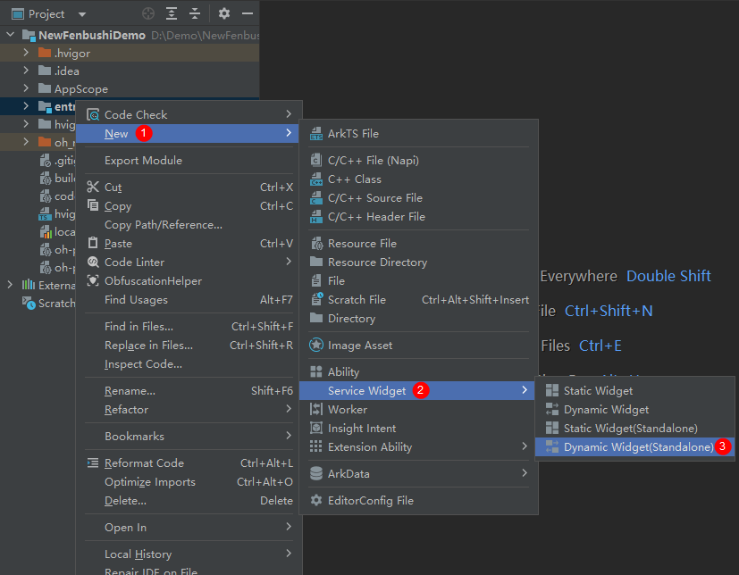
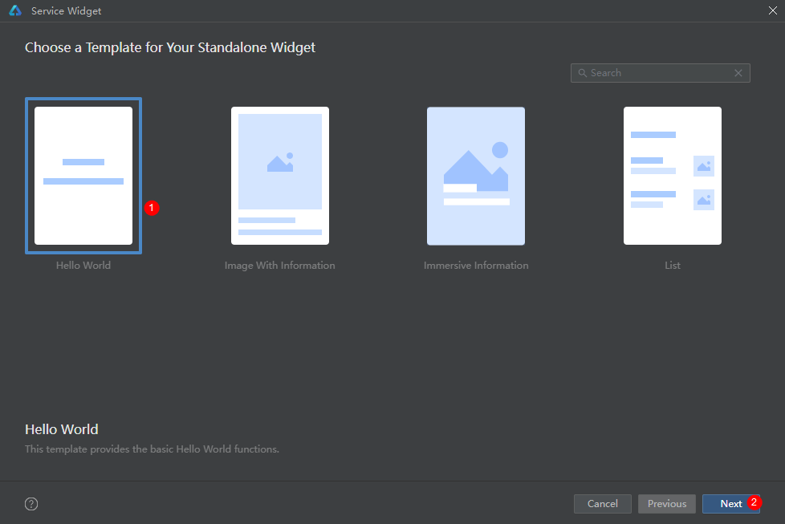
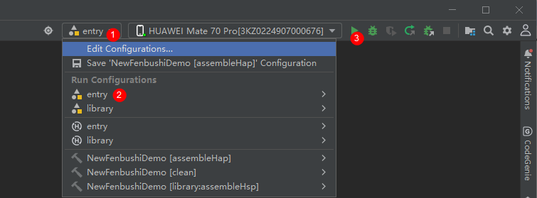
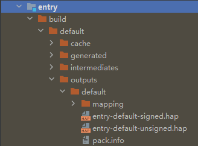
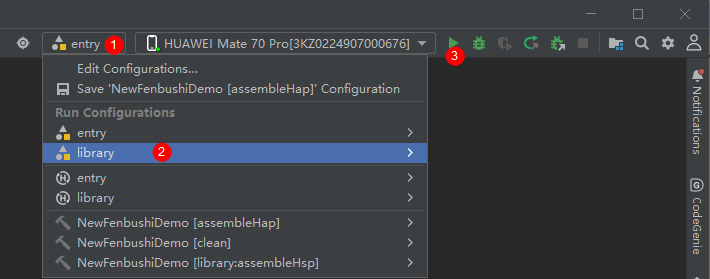
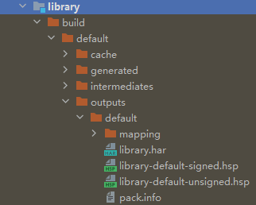

# 创建ArkTS卡片
ArkTS卡片有卡片和应用共包、独立卡片包两种形态。
## 卡片和应用共包形态
最终的编译产物是同一个hap包。
### 创建应用工程
创建卡片当前有两种入口：
- 创建工程时，选择Application，可以在创建工程后右键新建卡片。
- 创建工程时，选择Atomic Service（元服务），也可以在创建工程后右键新建卡片。 

>**说明：** 
>
>基于不同版本的DevEco Studio，请以实际界面为准。

### ArkTS卡片创建
在已有的应用工程中，可以通过右键新建ArkTS卡片，具体的操作方式如下。

1. 右键新建卡片。 
   
>**说明：** 
>
>在API 10及以上 Stage模型的工程中，在Service Widget菜单可直接选择创建动态或静态服务卡片。创建服务卡片后，也可以在卡片的[form_config.json配置文件](arkts-ui-widget-configuration.md)中，通过isDynamic参数修改卡片类型：isDynamic置空或赋值为“true”，则该卡片为[动态卡片](./arkts-ui-widget-configuration.md#isdynamic标签)；isDynamic赋值为"false"，则该卡片为[静态卡片](./arkts-ui-widget-configuration.md#isdynamic标签)。
   
2. 根据实际业务场景，选择一个卡片模板。 
   

3. 在选择卡片的开发语言类型（Language）时，选择ArkTS选项。选择卡片支持的外观规格（Support dimension）时，选择期望的卡片尺寸，再选择默认的外观规格（Default dimension）。详细的卡片外观规格，可参考[form_config.json配置文件](arkts-ui-widget-configuration.md)，后续也可以在form_config.json配置文件中修改卡片规格。然后单击“Finish”，即可完成ArkTS卡片创建。 
   
   
   建议根据实际使用场景命名卡片名称，ArkTS卡片创建完成后，工程中会新增如下卡片相关文件：卡片生命周期管理文件（EntryFormAbility.ets）、卡片页面文件（WidgetCard.ets）和卡片配置文件（form_config.json）。 
   
### 工程结构介绍
**图1** ArkTS卡片工程目录、相关模块 

- [FormExtensionAbility](../reference/apis-form-kit/js-apis-app-form-formExtensionAbility.md)：卡片扩展模块，提供卡片创建、销毁、刷新等生命周期回调。

- [FormExtensionContext](../reference/apis-form-kit/js-apis-inner-application-formExtensionContext.md)：FormExtensionAbility的上下文环境，提供FormExtensionAbility具有的接口和能力。

- [formProvider](../reference/apis-form-kit/js-apis-app-form-formProvider.md)：提供了获取卡片信息、更新卡片、设置卡片更新时间等能力。

- [formInfo](../reference/apis-form-kit/js-apis-app-form-formInfo.md)：提供了卡片信息和状态等相关类型和枚举。

- [formBindingData](../reference/apis-form-kit/js-apis-app-form-formBindingData.md)：提供卡片数据绑定的能力，包括FormBindingData对象的创建、相关信息的描述。

- [页面布局（WidgetCard.ets）](arkts-ui-widget-page-overview.md)：基于ArkUI提供卡片UI开发能力。
   - [ArkTS卡片通用能力](arkts-ui-widget-page-overview.md#arkts卡片支持的页面能力)：提供了能在ArkTS卡片中使用的组件、属性和API。
   - [ArkTS卡片特有能力](arkts-ui-widget-event-overview.md)：postCardAction用于卡片内部和提供方应用间的交互，仅在卡片中可以调用。

- [卡片配置](arkts-ui-widget-configuration.md)：包含FormExtensionAbility的配置和卡片的配置。
   - 在[module.json5配置文件](../quick-start/module-configuration-file.md)中的extensionAbilities标签下，配置FormExtensionAbility相关信息。
   - 在resources/base/profile/目录下的[form_config.json配置文件](arkts-ui-widget-configuration.md)中，配置卡片（WidgetCard.ets）相关信息。

## 独立卡片包形态
最终编译的产物分为卡片包和应用包，已达到卡片的前端和后端解耦目的。
### [创建应用工程](./arkts-ui-widget-creation.md#应用工程创建)
### ArkTS卡片创建
1. 选中entry目录单击右键选择【New】->【Service Widget】->【Dynamic Widget(Standalone)】。 

2. 选择模版之后点击【Next】。 

3. 填写卡片配置之后点击【Finish】。 

>**说明：**
>在卡片创建成功之后。entry模块称为应用包卡片后端，主要包含应用和卡片后端能力。library模块称为卡片包前端，主要包含卡片UI侧能力。entry模块下module.json5配置文件里面的formExtensionModule字段需要关联library，library模块下module.json5配置文件里面的formWidgetModule字段需要关联entry以满足卡片包前端和应用包卡片后端相互关联。
### 工程结构介绍
**图2** 独立卡片包工程目录。 
 
### 工程构建
1. 应用包构建安装。
- 应用包构建安装步骤。 

- 应用包产物。 

2. 卡片包构建安装。
- 卡片包构建安装步骤。 

- 卡片包编译产物。 

>**说明：**
>独立卡片包把应用包和卡片包区分开了，我们可以单独编译安装其中一个包。需要注意同事安装的应用包和卡片包要保持一致。
