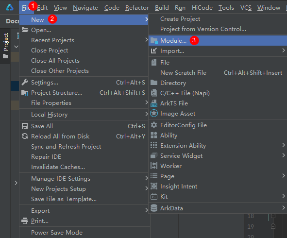
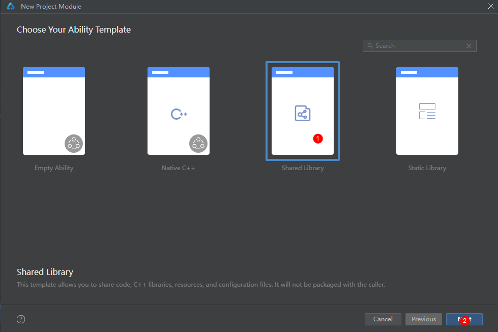

# 创建ArkTS卡片
## 卡片和应用共hap包方式创建
### 应用工程创建
创建卡片当前有两种入口：

- 创建工程时，选择Application，可以在创建工程后右键新建卡片。
- 创建工程时，选择Atomic Service（元服务），也可以在创建工程后右键新建卡片。


>**说明：** 
>
>基于不同版本的DevEco Studio，请以实际界面为准。

### ArkTS卡片创建
在已有的应用工程中，可以通过右键新建ArkTS卡片，具体的操作方式如下。

1. 右键新建卡片。  
   
>**说明：** 
>
>在API 10及以上 Stage模型的工程中，在Service Widget菜单可直接选择创建动态或静态服务卡片。创建服务卡片后，也可以在卡片的[form_config.json配置文件](arkts-ui-widget-configuration.md)中，通过isDynamic参数修改卡片类型：isDynamic置空或赋值为“true”，则该卡片为[动态卡片](./arkts-ui-widget-configuration.md#isdynamic标签)；isDynamic赋值为"false"，则该卡片为[静态卡片](./arkts-ui-widget-configuration.md#isdynamic标签)。
   
2. 根据实际业务场景，选择一个卡片模板。  
   

3. 在选择卡片的开发语言类型（Language）时，选择ArkTS选项。选择卡片支持的外观规格（Support dimension）时，选择期望的卡片尺寸，再选择默认的外观规格（Default dimension）。详细的卡片外观规格，可参考[form_config.json配置文件](arkts-ui-widget-configuration.md)，后续也可以在form_config.json配置文件中修改卡片规格。然后单击“Finish”，即可完成ArkTS卡片创建。  
   
   
   建议根据实际使用场景命名卡片名称，ArkTS卡片创建完成后，工程中会新增如下卡片相关文件：卡片生命周期管理文件（EntryFormAbility.ets）、卡片页面文件（WidgetCard.ets）和卡片配置文件（form_config.json）。  
   
### 工程结构介绍
**图1** ArkTS卡片工程目录、相关模块  

- [FormExtensionAbility](../reference/apis-form-kit/js-apis-app-form-formExtensionAbility.md)：卡片扩展模块，提供卡片创建、销毁、刷新等生命周期回调。

- [FormExtensionContext](../reference/apis-form-kit/js-apis-inner-application-formExtensionContext.md)：FormExtensionAbility的上下文环境，提供FormExtensionAbility具有的接口和能力。

- [formProvider](../reference/apis-form-kit/js-apis-app-form-formProvider.md)：提供了获取卡片信息、更新卡片、设置卡片更新时间等能力。

- [formInfo](../reference/apis-form-kit/js-apis-app-form-formInfo.md)：提供了卡片信息和状态等相关类型和枚举。

- [formBindingData](../reference/apis-form-kit/js-apis-app-form-formBindingData.md)：提供卡片数据绑定的能力，包括FormBindingData对象的创建、相关信息的描述。

- [页面布局（WidgetCard.ets）](arkts-ui-widget-page-overview.md)：基于ArkUI提供卡片UI开发能力。
   - [ArkTS卡片通用能力](arkts-ui-widget-page-overview.md#arkts卡片支持的页面能力)：提供了能在ArkTS卡片中使用的组件、属性和API。
   - [ArkTS卡片特有能力](arkts-ui-widget-event-overview.md)：postCardAction用于卡片内部和提供方应用间的交互，仅在卡片中可以调用。

- [卡片配置](arkts-ui-widget-configuration.md)：包含FormExtensionAbility的配置和卡片的配置。
   - 在[module.json5配置文件](../quick-start/module-configuration-file.md)中的extensionAbilities标签下，配置FormExtensionAbility相关信息。
   - 在resources/base/profile/目录下的[form_config.json配置文件](arkts-ui-widget-configuration.md)中，配置卡片（WidgetCard.ets）相关信息。

## 卡片独立包方式创建
### module.json5配置文件属性介绍
| 属性名称        | 含义    | 数据类型  | 是否缺省  |
| ------------ | --------- | ---------- | ---------- |
| type | 卡片包应配置为hsp类型shared（当前entry/feature/har/shared） | 字符串 | 不可缺省 |
| deviceTypes | 分布式卡片包应包含可流转设备类型 | 字符串数组 | 不可缺省 |
| formExtensionModule | 卡片包前端关联卡片后端的模块名 | 字符串 | 可缺省 |
| formWidgetModule | 应用包卡片后端关联卡片前端模块名 | 字符串 | 可缺省 |
### 工程创建步骤
1. [创建应用工程](./arkts-ui-widget-creation.md#应用工程创建)， 称为应用包卡片后端。
2. [创建ArkTs卡片](./arkts-ui-widget-creation.md#arkts卡片创建)。
3. 新建module， 称为卡片包前端。<br>
- 右键新建moudle。<br>

- 选择Share Library模版。<br>

- 保持默认选项，点击Finish按钮。<br>

4. 在卡片包前端[创建ArkTs卡片](./arkts-ui-widget-creation.md#arkts卡片创建)。
5. 关联卡片包前端与应用包卡片后端。
- 卡片包前端在module.json5里面配置formExtensionModule字段。
```ts
{
  "module": {
    "name": "library",
    "type": "shared",
    "description": "$string:shared_desc",
    "deviceTypes": [
      "phone"
    ],
    "deliveryWithInstall": true,
    "pages": "$profile:main_pages",
    "formExtensionModule": "entry"
  }
}
```
- 应用包卡片后端在module.json5里面配置formWidgetModule字段。
```ts
{
  "module": {
    "name": "entry",
    "type": "entry",
    "description": "$string:module_desc",
    "mainElement": "EntryAbility",
    "deviceTypes": [
      "phone"
    ],
    "deliveryWithInstall": true,
    "installationFree": false,
    "pages": "$profile:main_pages",
    "abilities": [
      {
        "name": "EntryAbility",
        "srcEntry": "./ets/entryability/EntryAbility.ets",
        "description": "$string:EntryAbility_desc",
        "icon": "$media:layered_image",
        "label": "$string:EntryAbility_label",
        "startWindowIcon": "$media:startIcon",
        "startWindowBackground": "$color:start_window_background",
        "exported": true,
        "skills": [
          {
            "entities": [
              "entity.system.home"
            ],
            "actions": [
              "ohos.want.action.home"
            ]
          }
        ]
      }
    ],
    "extensionAbilities": [
      {
        "name": "EntryBackupAbility",
        "srcEntry": "./ets/entrybackupability/EntryBackupAbility.ets",
        "type": "backup",
        "exported": false,
        "metadata": [
          {
            "name": "ohos.extension.backup",
            "resource": "$profile:backup_config"
          }
        ],
      },
      {
        "name": "EntryFormAbility",
        "srcEntry": "./ets/entryformability/EntryFormAbility.ets",
        "label": "$string:EntryFormAbility_label",
        "description": "$string:EntryFormAbility_desc",
        "type": "form",
        "metadata": [
          {
            "name": "ohos.extension.form",
            "resource": "$profile:form_config"
          }
        ]
      }
    ],
    "formWidgetModule": "library"
  }
}
```
### 工程结构介绍
**图2** 独立包ArkTS卡片工程目录<br>
<br>

