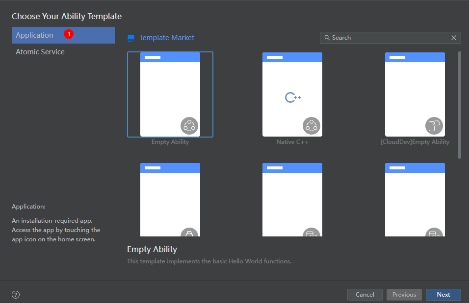
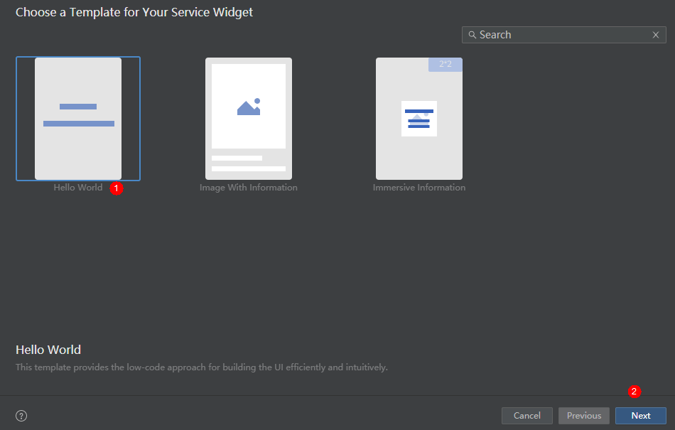
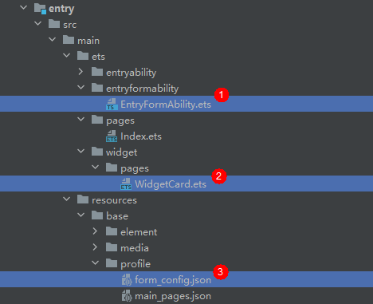

# 创建一个ArkTS卡片

创建卡片当前有两种入口：

- 创建工程时，选择Application，默认不带卡片，可以在创建工程后右键新建卡片。
- 创建工程时，选择Atomic Service，也可以在创建工程后右键新建卡片。

>**说明：** 
>
>基于不同版本的DeEco Studio，请以实际界面为准。

在已有的应用工程中，可以通过右键新建ArkTS卡片，具体的操作方式如下。

1. 右键新建卡片。  
   
>**说明：** 
>
>在API 10及以上 Stage模型的工程中，在Service Widget菜单可直接选择创建动态或静态服务卡片。创建服务卡片后，也可以在卡片的[form_config.json配置文件](arkts-ui-widget-configuration.md)中，通过isDynamic参数修改卡片类型：isDynamic置空或赋值为"true"，则该卡片为动态卡片；isDynamic赋值为"false"，则该卡片为静态卡片。
   
2. 根据实际业务场景，选择一个卡片模板。  
   

3. 在选择卡片的开发语言类型（Language）时，选择ArkTS选项，然后单击“Finish”，即可完成ArkTS卡片创建。  
   

   ArkTS卡片创建完成后，工程中会新增如下卡片相关文件：卡片生命周期管理文件（EntryFormAbility.ets）、卡片页面文件（WidgetCard.ets）和卡片配置文件（form_config.json）。  
   

